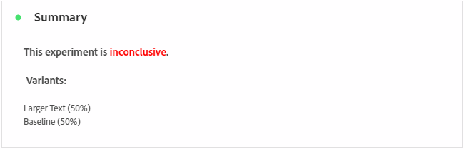

# Rapport om experimentkampanjer {#campaign-global-report-cja-experimentation}

>[!CONTEXTUALHELP]
>id="ajo_campaigns_content_experiment_click"
>title="Resultatmått"
>abstract="Det totala värdet för resultatmåttet, som tidigare valts när du skapade dina experiment, delat med antalet profiler."

## Experimentation {#experimentation}

Fliken **[!UICONTROL Experimentation]** ger viktiga insikter om prestanda för varje variant och identifierar den som fungerar bäst.

Observera att det kan ta en stund att definiera den bästa utföraren. Om ditt experiment inte lyckas ställs det in på **Ofullständig**.

### KPI:er för experiment {#experimentation-kpis}

**[!UICONTROL Experimentation]** KPI:er (Key Performance Indicators) fungerar som en heltäckande kontrollpanel som levererar en analys av viktiga mått som är kopplade till dina experiment.

+++ Läs mer om KPI:er för experiment

* **[!UICONTROL Lift]**: Mät den procentuella förbättringen av konverteringsgraden för en given behandling över baslinjen.

* **[!UICONTROL Confidence]**: Bevis på att en viss behandling är densamma som den initiala behandlingen. [Läs mer](../content-management/experiment-calculations.md#adobes-statistical-methodology-any-time-valid-confidence-sequences)

+++

### Variant efter lyckat mått {#variant-inbound}

Tabellen **Variant efter framgångsmått** visar hur varje variant fungerar baserat på det framgångsmått som valts när du konfigurerade experimentet.
En djupdykning i dessa resultat och hur du tolkar dem finns på [den här sidan](../content-management/get-started-experiment.md#interpret-results).

+++ Läs mer om Variant med Success Metric

* **[!UICONTROL People]**: Antal användarprofiler som kvalificerar sig som målprofiler för dina meddelanden.

* **[!UICONTROL Inbound Clicks]**: Det totala värdet för resultatmåttet, som tidigare valdes när du skapade dina experiment.

* **[!UICONTROL Conversion rate]**: Det totala värdet för resultatmåttet, som tidigare valdes när du skapade dina experiment, delat med antalet profiler.

* **[!UICONTROL Lift]**: Mät den procentuella förbättringen av konverteringsgraden för en given behandling över baslinjen.

* **[!UICONTROL Confidence Lower bound]**: Det lägsta uppskattade värdet av konverteringsskillnaden mellan behandlingen och baslinjen, inom det valda konfidensintervallet.

* **[!UICONTROL Confidence]**: Bevis på att en viss behandling är densamma som den initiala behandlingen. [Läs mer](../content-management/experiment-calculations.md#adobes-statistical-methodology-any-time-valid-confidence-sequences)

* **[!UICONTROL Confidence Upper bound]**: Det högsta uppskattade värdet av konverteringsskillnaden mellan behandlingen och baslinjen, inom det valda konfidensintervallet.

+++

### Konverteringsgrad för framgångsmått {#conversion-rate}

Diagrammet **[!UICONTROL Confidence interval]** visar intervallet av möjliga förbättringar, som jämför baslinjen med den bästa behandlingen för det valda framgångsmåttet. [Läs mer](../content-management/experiment-calculations.md#adobes-statistical-methodology-any-time-valid-confidence-sequences).