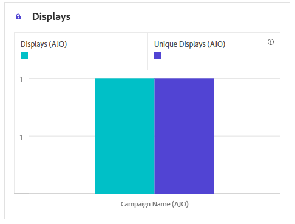

# Kampanjrapport i appen {#campaign-global-report-cja-inapp}

>[!IMPORTANT]
>
>Innan du kan rapportera om dina kampanjer och resor i appen måste du följa de rapporteringskrav som finns på [den här sidan](../in-app/inapp-configuration.md#experiment-prerequisites).

>[!BEGINSHADEBOX]

Du kommer åt kampanjrapporten i appen genom att klicka på knappen **[!UICONTROL Reports]** i kampanjen och sedan välja **[!UICONTROL View all time report]**. [Läs mer](report-gs-cja.md)

>[!ENDSHADEBOX]

## Visa och klicka på trend {#impression-click-trend}

Diagrammet **[!UICONTROL Impression & Click trend]** innehåller en detaljerad analys av hur dina profiler interagerar med dina meddelanden i appen och ger värdefulla insikter om hur profilerna interagerar med ditt innehåll.

+++ Läs mer om mått för tryck och klickning

* **[!UICONTROL Clicks]**: Antal gånger som användaren interagerade med meddelanden i appen.

* **[!UICONTROL Displays]**: Antal gånger som meddelandet i appen visades för användaren.

+++

## Klickningar {#clicks-inapp}

Diagrammet **[!UICONTROL Clicks]** visar klickvärden i appen, som visar både det totala antalet innehållsklickningar och antalet unika profiler som klickade på innehållet.

+++ Läs mer om klickningsstatistik

* **[!UICONTROL Unique Clicks]**: Antal profiler som klickat på ett innehåll i meddelanden i appen

* **[!UICONTROL Clicks]**: Antal gånger som användaren interagerade med meddelanden i appen.

+++

## Visa {#display-inapp}

Diagrammet **[!UICONTROL Displays]** hjälper dig att förstå både meddelandets övergripande räckvidd och antalet unika profiler som är kopplade till det.

+++ Läs mer om visningsmått

* **[!UICONTROL Displays]**: Antal gånger som meddelandet i appen visades för användaren.

* **[!UICONTROL Unique displays]**: Det antal gånger som meddelandet öppnades tas ingen hänsyn till flera interaktioner för en profil.

+++

## Spårningsdata {#tracking-data-inapp}

Tabellen **[!UICONTROL Tracking data]** innehåller en detaljerad ögonblicksbild av profilaktiviteten som är kopplad till dina meddelanden i appen, vilket ger viktiga insikter i hur engagemanget och i appmeddelanden fungerar.

+++ Läs mer om att spåra datamått

* **[!UICONTROL People]**: Antal användarprofiler som kvalificerar som målprofiler för meddelanden i appen.

* **[!UICONTROL Click through rate (CTR)]**: Procentandel användare som interagerade med meddelanden i appen.

* **[!UICONTROL Click through open rate (CTOR)]**: Antal gånger som meddelanden i programmet öppnades.

* **[!UICONTROL Clicks]**: Antal gånger som användaren interagerade med meddelanden i appen.

* **[!UICONTROL Unique Clicks]**: Antal profiler som klickat på ett innehåll i meddelanden i appen.

* **[!UICONTROL Displays]**: Antal gånger som meddelandet i appen visades för användaren.

* **[!UICONTROL Unique displays]**: Det antal gånger som meddelandet öppnades tas ingen hänsyn till flera interaktioner för en profil.

* **[!UICONTROL Sends]**: Antal gånger som appen har begärt kampanj i appen. Flera begäranden per användarsession (t.ex. vid start eller omladdning) kan göra att det här värdet överskrider det unika antalet användare om kampanjdata inte cachelagras.

* **[!UICONTROL Inbound triggered]**: Antal gånger som appen övervägde att visa meddelandet i appen. Det här numret kan vara lägre än det totala antalet utskick om regler på appsidan förhindrar att meddelandet visas.

* **[!UICONTROL Inbound dismisses]**: Antal gånger som användare har stängt meddelandet i appen utan att interagera med det.

+++

## Spårade länketiketter {#track-link-label-inapp}

Tabellen **[!UICONTROL Tracked link labels]** innehåller en omfattande översikt över länketiketterna i dina meddelanden i appen, som visar de som genererar den högsta besökstrafiken. Med den här funktionen kan du identifiera och prioritera de mest populära länkarna.

+++ Läs mer om mätvärden för spårade länketiketter

* **[!UICONTROL Unique Clicks]**: Antal profiler som klickat på ett innehåll i meddelanden i appen.

* **[!UICONTROL Clicks]**: Antal gånger som användaren interagerade med meddelanden i appen.

* **[!UICONTROL Displays]**: Antal gånger som meddelandet i appen visades för användaren.

* **[!UICONTROL Unique displays]**: Det antal gånger som meddelandet öppnades tas ingen hänsyn till flera interaktioner för en profil.

+++

## URL för spårad länk {#track-link-url-inapp}

Tabellen **[!UICONTROL Tracked link URLs]** innehåller en omfattande översikt över de URL:er i dina meddelanden i appen som lockar den högsta besökstrafiken. På så sätt kan ni identifiera och prioritera de populäraste länkarna och öka er förståelse för hur proffsen interagerar med specifikt innehåll i era meddelanden i appen.

+++ Läs mer om URL-mått för spårad länk

* **[!UICONTROL Unique Clicks]**: Antal profiler som klickat på ett innehåll i meddelanden i appen.

* **[!UICONTROL Clicks]**: Antal gånger som användaren interagerade med meddelanden i appen.

+++
