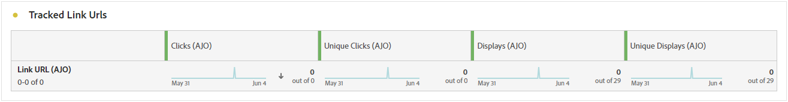

# Webbkampanjrapport {#campaign-global-report-cja-web}

>[!BEGINSHADEBOX]

Du kommer åt webbkampanjrapporten genom att klicka på knappen **[!UICONTROL Reports]** i kampanjen och sedan välja **[!UICONTROL View all time report]**. [Läs mer](report-gs-cja.md)

>[!ENDSHADEBOX]

## Trend för tryck och klickning {#impressions-web}

Diagrammet **[!UICONTROL Impression & Click trend]** innehåller en detaljerad analys av hur dina profiler interagerar med dina webbsidor, och ger värdefulla insikter om hur profiler interagerar med ditt innehåll.

+++ Läs mer om mått för tryck och klickning

* **[!UICONTROL Clicks]**: Antal gånger som ett innehåll har klickats på på dina webbsidor.

* **[!UICONTROL Displays]**: Antal gånger som meddelandet öppnades.

+++

## Klickningar {#clicks-web}

Diagrammet **[!UICONTROL Clicks]** visar klickvärden för webbsidor, som visar både det totala antalet innehållsklickningar och antalet unika profiler som klickade på innehållet.

+++ Läs mer om klickningsstatistik

* **[!UICONTROL Unique Clicks]**: Antal profiler som klickat på ett innehåll på dina webbsidor.

* **[!UICONTROL Clicks]**: Antal gånger som ett innehåll har klickats på på dina webbsidor.

+++

## Visar {#displays-web}

Diagrammet **[!UICONTROL Displays]** hjälper dig att förstå både meddelandets övergripande räckvidd och antalet unika profiler som är kopplade till det.

+++ Läs mer om visningsmått

* **[!UICONTROL Displays]**: Antal gånger som meddelandet öppnades.

* **[!UICONTROL Unique displays]**: Det antal gånger som meddelandet öppnades tas ingen hänsyn till flera interaktioner för en profil.

+++

## Spårningsdata {#track-data-web}

Tabellen **[!UICONTROL Tracking data]** innehåller en detaljerad ögonblicksbild av profilaktiviteten som är kopplad till dina webbsidor, vilket ger viktiga insikter i hur engagemanget och webbsidorna fungerar.

+++ Läs mer om att spåra datamått

* **[!UICONTROL People]**: Antal användarprofiler som kvalificerar sig som målprofiler för dina webbsidor.

* **[!UICONTROL Click through rate (CTR)]**: Procentandel användare som interagerade med webbsidorna.

* **[!UICONTROL Clicks]**: Antal gånger som ett innehåll har klickats på på dina webbsidor.

* **[!UICONTROL Unique Clicks]**: Antal profiler som klickat på ett innehåll på dina webbsidor.

* **[!UICONTROL Displays]**: Antal gånger som webbsidan öppnades.

* **[!UICONTROL Unique displays]**: Antal gånger webbsidan öppnades, flera interaktioner i en profil beaktas inte.

+++

## Spårade länketiketter {#track-link-web}

Tabellen **[!UICONTROL Tracked link labels]** innehåller en omfattande översikt över länketiketterna på dina webbsidor, och här framhävs de som genererar störst besökstrafik. Med den här funktionen kan du identifiera och prioritera de mest populära länkarna.

+++ Läs mer om mätvärden för spårade länketiketter

* **[!UICONTROL Unique Clicks]**: Antal profiler som klickat på ett innehåll på dina webbsidor.

* **[!UICONTROL Clicks]**: Antal gånger som ett innehåll har klickats på på dina webbsidor.

* **[!UICONTROL Displays]**: Antal gånger som meddelandet öppnades.

* **[!UICONTROL Unique displays]**: Det antal gånger som meddelandet öppnades tas ingen hänsyn till flera interaktioner för en profil.

+++

## URL för spårad länk {#track-url-web}

Tabellen **[!UICONTROL Tracked link URLs]** innehåller en omfattande översikt över de webbadresser på dina webbsidor som tillför den högsta besökstrafiken. På så sätt kan du identifiera och prioritera de populäraste länkarna och öka din förståelse för hur proffsen interagerar med specifikt innehåll på dina webbsidor.

+++ Läs mer om URL-mått för spårad länk

* **[!UICONTROL Unique Clicks]**: Antal profiler som klickat på ett innehåll på dina webbsidor.

* **[!UICONTROL Clicks]**: Antal gånger som ett innehåll har klickats på på dina webbsidor.

* **[!UICONTROL Displays]**: Antal gånger som meddelandet öppnades.

* **[!UICONTROL Unique displays]**: Det antal gånger som meddelandet öppnades tas ingen hänsyn till flera interaktioner för en profil.

+++
