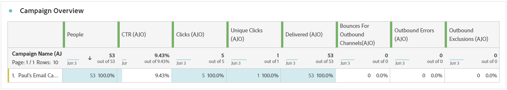
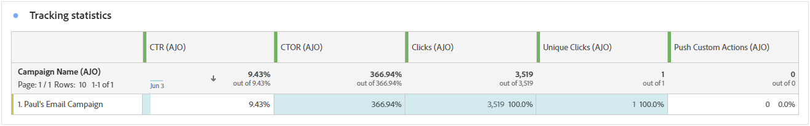

# Kampanjrapport {#campaign-global-report-cja}

The **Kampanjrapport** fungerar som en omfattande kontrollpanel och ger en detaljerad analys av nyckeltal som är kopplade till kampanjen. Den innehåller data som klickräkning, levererade meddelanden, profilnummer och vidtagna åtgärder. Genom att erbjuda en fullständig översikt över kampanjens effektivitet och engagemangsnivåer säkerställer rapporten en grundlig förståelse för kampanjens övergripande resultat.

Kampanjrapporter kan nås direkt från er Campaign via **[!UICONTROL Reports]** -knappen.

The **Kampanjrapport** visas med följande flikar beroende på den valda kanalen:

* [Campaign](#campaign-global)
* [Experimentation](#experimentation)
* [E-post](#email-global)
* [SMS](#sms)
* [Push-meddelande](#push-notification)
* [Direktmeddelande](#direct-mail)
* [Webb](#web)

Mer information om Customer Journey Analytics Workspace och hur du filtrerar och analyserar data finns i [den här sidan](https://experienceleague.adobe.com/en/docs/analytics-platform/using/cja-workspace/home).

## Campaign {#campaign-global}

### KPI:er för kampanj {#campaign-kpis}

The **[!UICONTROL Campaign]** KPI (Key Performance Indicators) fungerar som en heltäckande kontrollpanel, som tillhandahåller en analys av viktig statistik som är kopplad till kampanjen. Detta omfattar detaljer som antalet klick och antalet levererade meddelanden, vilket ger en heltäckande inblick i kampanjens effektivitet och nivå av engagemang.

KPI:erna varierar beroende på vilka kanaler som används i kampanjen.

+++ Läs mer om KPI:er för Campaign

* **[!UICONTROL Click through rate]**: Procentandel användare som interagerade med meddelandet.

* **[!UICONTROL Clicks]**: Antal gånger som användaren klickat på ett innehåll i meddelandet.

* **[!UICONTROL Delivered]**: Antal e-postmeddelanden som har skickats, i relation till det totala antalet skickade meddelanden.

* **[!UICONTROL Displays]**: Antal gånger som meddelandet öppnades.

+++

### Översikt över Campaign {#delivery-global}

The **[!UICONTROL Campaign overview]** tabellen fungerar som en omfattande kontrollpanel med en detaljerad beskrivning av nyckeltal relaterade till kampanjen. Detta inkluderar viktig information som antalet profiler och de åtgärder som utförts, vilket ger en grundlig förståelse för kampanjens resultat och engagemang.

Observera att mätvärdena varierar beroende på vilka kanaler som används i kampanjen.

+++ Läs mer om mätvärden för Campaign-översikt

* **[!UICONTROL People]**: Antal användarprofiler som kvalificerar sig som målprofiler för dina meddelanden.

* **[!UICONTROL Click through rate]**: Procentandel användare som interagerade med meddelandet.

* **[!UICONTROL Clicks]**: Antal gånger som användaren klickat på ett innehåll i meddelandet.

* **[!UICONTROL Unique Clicks]**: Antal profiler som klickat på ett innehåll i meddelandet.

* **[!UICONTROL Delivered]**: Antal e-postmeddelanden som har skickats, i relation till det totala antalet skickade meddelanden.

* **[!UICONTROL Bounces for outbound channels]**: Totalt antal fel som har ackumulerats under sändningsprocessen och automatisk returbearbetning i relation till totalt antal skickade meddelanden.

* **[!UICONTROL Outbound Errors]**: Totalt antal fel som uppstod under sändningsprocessen och som förhindrar att den skickas till profiler.

* **[!UICONTROL Outbound Exclusions]**: Antal profiler som har uteslutits av Adobe Journey Optimizer.

* **[!UICONTROL Displays]**: Antal gånger som meddelandet öppnades.

* **[!UICONTROL Unique displays]**: Antal gånger som meddelandet öppnades beaktas inte flera interaktioner för en profil.

+++

### Kampanjtrattresultat {#campaign-funnel}

The **[!UICONTROL Campaign funnel results]** diagram ger en detaljerad analys av hur era profiler interagerar med era meddelanden, och ger värdefulla insikter om hur olika profiler interagerade med ert innehåll.

+++ Läs mer om resultatstatistik för kampanjtrattar

* **[!UICONTROL Delivered]**: Antal e-postmeddelanden som har skickats, i relation till det totala antalet skickade meddelanden.

* **[!UICONTROL Clicks]**: Antal gånger som användaren klickat på ett innehåll i meddelandet.
+++

### Etikett för spårad länk {#campaign-track}

The **[!UICONTROL Tracked link label]** tabellen ger viktiga insikter om besökarnas engagemang med de URL:er som finns i era meddelanden, och ger värdefull information om vilka länkar som drar störst nytta av interaktionen.

+++ Läs mer om spårning av etikettmått för länkar

* **[!UICONTROL Unique Clicks]**: Antal profiler som klickat på ett innehåll i meddelandet.

* **[!UICONTROL Clicks]**: Antal gånger som användaren klickat på ett innehåll i meddelandet.

+++

## Experimentation {#experimentation}

The **[!UICONTROL Experimentation]** ger viktiga insikter om prestanda för varje variant och identifierar den mest framgångsrika.

Observera att det kan ta en stund att definiera den bästa utföraren. Om experimentet inte lyckas ställs det in på **Inkonklusiv**.

### KPI:er för experiment {#experimentation-kpis}

The **[!UICONTROL Experimentation]** KPI (Key Performance Indicators) fungerar som en heltäckande kontrollpanel som ger en analys av viktig statistik som är kopplad till dina experiment.

+++ Läs mer om KPI:er för experiment

* **[!UICONTROL Lift]**: Mät den procentuella förbättringen av konverteringsgraden för en viss behandling jämfört med baslinjen.

* **[!UICONTROL Confidence]** Bevis på att en viss behandling är densamma som den initiala behandlingen. [Läs mer](../content-management/experiment-calculations.md#understand-confidence)

+++

### Variant efter inkommande klick {#variant-inbound}

The **[!UICONTROL Variant by Inbound clicks]** widgeten anger prestanda för varje variant.
En djupdykning i dessa resultat och hur du tolkar dem finns i [den här sidan](../content-management/get-started-experiment.md#interpret-results).

+++ Läs mer om Mätvärden för inkommande klick för Variant

* **[!UICONTROL People]**: Antal användarprofiler som kvalificerar sig som målprofiler för dina meddelanden.

* **[!UICONTROL Inbound Clicks]**: Totalt antal klick i utgående kanaler.

* **[!UICONTROL Conversion rate]**: Totalt värde för resultatmåttet, som tidigare valdes när du skapade dina experiment, delat med antalet profiler.

* **[!UICONTROL Lift]**: Mät den procentuella förbättringen av konverteringsgraden för en viss behandling jämfört med baslinjen.

* **[!UICONTROL Confidence]** Bevis på att en viss behandling är densamma som den initiala behandlingen. [Läs mer](../content-management/experiment-calculations.md#understand-confidence)

<!--
* **[!UICONTROL Confidence Upper bound]**:

* **[!UICONTROL Confidence Lower bound]**:
-->
+++

### Konverteringsgrad för inkommande klick {#conversion-rate}

The **[!UICONTROL Confidence interval]** graf mäter osäkerheten kring förbättringen. Här anges den procentuella skillnaden i prestanda mellan baslinjen och den bästa behandlingen. [Läs mer](../content-management/experiment-calculations.md#confidence-intervals).

## E-post {#email-global}

### Levererat kontra klicktrend {#delivered-click}

The **[!UICONTROL Delivered vs Click trend]** diagram ger en detaljerad analys av hur era profiler interagerar med era e-postmeddelanden, och ger värdefulla insikter om hur profilerna interagerar med ert innehåll.

+++ Läs mer om Levererat jämfört med Click-trendstatistik

* **[!UICONTROL Delivered]**: Antal e-postmeddelanden som skickats, i relation till det totala antalet skickade e-postmeddelanden.

* **[!UICONTROL Clicks]**: Antal gånger som ett innehåll klickades på i dina e-postmeddelanden.

+++

### Leveransstatus {#delivery-status}

The **[!UICONTROL Delivery status]** graf ger en heltäckande bild av data relaterade till skickade e-postmeddelanden i kampanjen och ger insikter i viktiga mätvärden som levererade och studsade. Detta möjliggör en detaljerad analys av e-postsändningsprocessen och ger värdefull information om effektiviteten och resultatet för era kampanjer.

+++ Läs mer om leveransstatusvärden

* **[!UICONTROL Delivered]**: Antal e-postmeddelanden som skickats, i relation till det totala antalet skickade e-postmeddelanden.

* **[!UICONTROL Bounces for outbound channels]**:Totalt antal fel som har ackumulerats under sändningsprocessen och automatisk returbearbetning i relation till totalt antal skickade meddelanden.

* **[!UICONTROL Outbound errors]**: Totalt antal fel som uppstod under en sändningsprocess och som förhindrar att den skickas till profiler.

* **[!UICONTROL Outbound exclusions]**: Antal profiler som har uteslutits av Adobe Journey Optimizer.

+++

### Skicka statistik {#sending-statistics-email}

The **[!UICONTROL Sending Statistics]** tabellen innehåller en omfattande sammanfattning av viktiga data om e-post i era kampanjer. Den innehåller viktiga mätvärden som interaktionen med e-postmeddelanden och antalet e-postmeddelanden som levererats, vilket ger värdefulla insikter om effektiviteten och räckvidden för era e-postmeddelanden och kampanjer.

+++ Läs mer om Skicka statistik-statistik

* **[!UICONTROL People]**: Antal användarprofiler som kvalificerar sig som målprofiler för dina meddelanden.

* **[!UICONTROL Targeted]**: Totalt antal bearbetade e-postmeddelanden under sändningsprocessen.

* **[!UICONTROL Sends]**: Totalt antal skickade meddelanden för din e-post.

* **[!UICONTROL Delivered]**: Antal e-postmeddelanden som har skickats, i relation till det totala antalet skickade meddelanden.

* **[!UICONTROL Bounces for outbound channels]**: Totalt antal fel som har ackumulerats under sändningsprocessen och automatisk returbearbetning i relation till det totala antalet skickade meddelanden.

* **[!UICONTROL Outbound Errors]**: Totalt antal fel som uppstod under sändningsprocessen och som förhindrar att den skickas till profiler.

* **[!UICONTROL Outbound Exclusions]**: Antal profiler som har uteslutits av Adobe Journey Optimizer.

+++

### Spårningsstatistik {#tracking-statistics-email}

The **[!UICONTROL Email - Tracking statistics]** tabellen ger en detaljerad redovisning av profilaktivitet som rör e-post som ingår i kampanjen. Detta inkluderar mätvärden för öppningar, klick och andra relevanta interaktionsindikatorer, som ger en heltäckande bild av hur profiler interagerar med ert e-postinnehåll.

+++ Läs mer om statistik för spårning

* **[!UICONTROL Click through rate (CTR)]**: Procentandel användare som interagerade med e-postmeddelandet.

* **[!UICONTROL Click through open rate (CTOR)]**: Antal gånger som e-postmeddelandet öppnades.

* **[!UICONTROL Clicks]**: Antal gånger som ett innehåll klickades på i dina e-postmeddelanden.

* **[!UICONTROL Unique Clicks]**: Antal profiler som klickat på ett innehåll i ett e-postmeddelande.

* **[!UICONTROL Email Opens]**: Antal gånger som dina e-postmeddelanden öppnats i en kampanj.

* **[!UICONTROL Unique Email Opens]**: Procentandel öppnade e-postmeddelanden.

* **[!UICONTROL Spam complaints]**: Antal gånger ett meddelande har deklarerats som skräppost eller skräppost.

* **[!UICONTROL Unsubscribes]**: Antal klick på länken för att avbryta prenumerationen.

+++

### E-postdomäner {#email-domains}

The **[!UICONTROL Email Domains]** tabellen ger en detaljerad beskrivning av e-postmeddelanden kategoriserade efter domän, vilket ger omfattande insikter om hur väl era e-postkampanjer fungerar. Denna omfattande analys gör att ni kan förstå beteendet hos olika domäner som svar på ert e-postinnehåll.

+++ Läs mer om mätvärden för e-postdomäner

* **[!UICONTROL Sends]**: Totalt antal skickade meddelanden för din e-post.

* **[!UICONTROL Delivered]**: Antal e-postmeddelanden som skickats, i relation till det totala antalet skickade e-postmeddelanden.

* **[!UICONTROL Email Opens]**: Antal gånger som dina e-postmeddelanden öppnats i en kampanj.

* **[!UICONTROL Clicks]**: Antal gånger som ett innehåll klickades på i dina e-postmeddelanden.

* **[!UICONTROL Bounces for outbound channels]**: Totalt antal fel som sammanställts under sändningsprocessen och automatisk returbehandling i relation till det totala antalet skickade e-postmeddelanden.

* **[!UICONTROL Outbound Errors]**: Totalt antal fel som uppstod under sändningsprocessen och som förhindrar att den skickas till profiler.
+++

### Spårade länketiketter {#track-link-label}

The **[!UICONTROL Tracked link labels]** tabellen ger en omfattande översikt över länketiketterna i e-postmeddelandena, som visar vilka som genererar störst besökstrafik. Med den här funktionen kan du identifiera och prioritera de mest populära länkarna.

+++ Läs mer om mätvärden för spårade länketiketter

* **[!UICONTROL Unique Clicks]**: Antal profiler som klickat på ett innehåll i ett e-postmeddelande.

* **[!UICONTROL Clicks]**: Antal gånger som ett innehåll klickades på i dina e-postmeddelanden.

+++

### URL för spårad länk {#track-link-url}

The **[!UICONTROL Tracked link URLs]** tabellen innehåller en omfattande översikt över de URL:er i e-postmeddelandet som lockar till sig den högsta besökstrafiken. På så sätt kan ni identifiera och prioritera de mest populära länkarna och öka er förståelse för hur proffsen interagerar med specifikt innehåll i era e-postmeddelanden.

+++ Läs mer om URL:er för spårade länkar

* **[!UICONTROL Unique Clicks]**: Antal profiler som klickat på ett innehåll i ett e-postmeddelande.

* **[!UICONTROL Clicks]**: Antal gånger som ett innehåll klickades på i dina e-postmeddelanden.

* **[!UICONTROL Displays]**: Antal gånger som e-postmeddelandet öppnades.

* **[!UICONTROL Unique displays]**: Antal gånger som e-postmeddelandet öppnades beaktas inte flera interaktioner för en profil.

+++

### E-postämnen {#email-subjects}

The **[!UICONTROL Email subjects]** tabellen innehåller en detaljerad översikt över e-postämnen som har fått den högsta besökstrafiken. Den här resursen ger värdefulla insikter om målgruppsengagemangets dynamik.

+++ Läs mer om ämnesstatistik för e-post

* **[!UICONTROL People]**: Antal användarprofiler som kvalificerar sig som målprofiler för dina e-postmeddelanden.

+++

### Undantagna orsaker {#excluded-reasons}

The **[!UICONTROL Excluded reasons]** tabellen ger en heltäckande bild av de olika faktorer som ledde till att användarprofiler exkluderades från målgruppen, vilket ledde till att meddelandet inte togs emot.

Se [den här sidan](exclusion-list.md) En fullständig förteckning över orsaker till uteslutning.

### Brytningsorsaker {#bounce-reasons-email}

The **[!UICONTROL Bounce Reasons]** tabellen sammanställer tillgängliga data för studsade meddelanden och ger detaljerade insikter om de specifika orsakerna till e-poststudenterna.

Mer information om studsar finns i [Undertryckningslista](../reports/suppression-list.md) sida.

### Felorsaker {#error-reasons-email}

The **[!UICONTROL Error Reasons]** tabellen ger dig insyn i de specifika fel som uppstod under sändningsprocessen och ger värdefull information om felens art och förekomst.

## SMS {#sms}

### Levererat kontra klicktrend {#delivered-click-sms}

The **[!UICONTROL Delivered vs Click trend]** diagram ger en detaljerad analys av hur era profiler interagerar med era e-postmeddelanden, och ger värdefulla insikter om hur profilerna interagerar med ert innehåll.

+++ Läs mer om Levererat jämfört med Click-trendstatistik

* **[!UICONTROL Delivered]**: Antal SMS-meddelanden som skickats, i relation till totalt antal SMS-meddelanden.

* **[!UICONTROL Clicks]**: Antal gånger som ett innehåll klickades på i SMS-meddelanden.

+++

### Leveransstatus {#delivery-status-sms}

The **[!UICONTROL Delivery status]** tabellen ger en detaljerad redovisning av profilaktivitet som rör dina SMS-kampanjer. Detta inkluderar mätvärden för levererade data, klickningar och andra relevanta interaktionsindikatorer, som ger en heltäckande bild av hur profiler interagerar med ert SMS-innehåll.

+++ Läs mer om leveransstatusvärden

* **[!UICONTROL Delivered]**: Antal SMS-meddelanden som skickats, i relation till totalt antal SMS-meddelanden.

* **[!UICONTROL Bounces for outbound channels]**: Totalt antal fel som sammanställts under sändningsprocessen och automatisk returbehandling i relation till det totala antalet skickade SMS-meddelanden.

* **[!UICONTROL Outbound errors]**: Totalt antal fel som har inträffat som förhindrar att den skickas till profiler.

* **[!UICONTROL Outbound exclusions]**: Antal profiler som har uteslutits av Adobe Journey Optimizer.

+++

### Spårade länketiketter {#track-link-label-sms}

The **[!UICONTROL Tracked link labels]** tabellen ger en omfattande översikt över de länketiketter som finns i SMS-meddelanden, där de som genererar störst besökstrafik markeras. Med den här funktionen kan du identifiera och prioritera de mest populära länkarna.

+++ Läs mer om mätvärden för spårade länketiketter

* **[!UICONTROL Unique Clicks]**: Antal profiler som klickade på ett innehåll i SMS-meddelandet.

* **[!UICONTROL Clicks]**: Antal gånger som ett innehåll klickades på i SMS-meddelanden.

+++

### URL för spårad länk {#track-link-url-sms}

The **[!UICONTROL Tracked link URLs]** tabellen ger en omfattande översikt över de URL:er i SMS-meddelanden som lockar den högsta besökstrafiken. På så sätt kan ni identifiera och prioritera de mest populära länkarna och öka er förståelse för hur proffsen interagerar med specifikt innehåll i era SMS-meddelanden.

+++ Läs mer om URL:er för spårade länkar

* **[!UICONTROL Unique Clicks]**: Antal profiler som klickade på ett innehåll i SMS-meddelandet.

* **[!UICONTROL Clicks]**: Antal gånger som ett innehåll klickades på i SMS-meddelanden.

* **[!UICONTROL Displays]**: Antal gånger som meddelandet öppnades.

* **[!UICONTROL Unique displays]**: Antal gånger som meddelandet öppnades beaktas inte flera interaktioner för en profil.

+++

### SMS inkommande meddelande {#sms-inbound}

The **[!UICONTROL SMS inbound message]** tabellen ger en detaljerad översikt över vilka SMS-meddelanden som har dragit till sig den högsta besökstrafiken. Den här resursen ger värdefulla insikter om målgruppsengagemangets dynamik.

+++ Läs mer om mätvärden för inkommande SMS-meddelanden

* **[!UICONTROL People]**: Antal användarprofiler som kvalificerar sig som målprofiler för dina SMS-meddelanden.

+++

### SMS-meddelandetyp {#sms-message-type}

The **[!UICONTROL SMS Message type]** tabellen ger en detaljerad översikt över vilken SMS-meddelandetyp som har dragit till sig den högsta besökstrafiken. Den här resursen ger värdefulla insikter om målgruppsengagemangets dynamik.

+++ Läs mer om mätvärden för SMS-meddelandetyp

* **[!UICONTROL People]**: Antal användarprofiler som kvalificerar sig som målprofiler för dina SMS-meddelanden.

+++

### SMS-leverantörer {#sms-providers}

The **[!UICONTROL SMS providers]** tabellen ger en detaljerad översikt över vilka SMS-leverantörer som har dragit till sig den högsta besökstrafiken. Den här resursen ger värdefulla insikter om målgruppsengagemangets dynamik.

+++ Läs mer om mätvärden för SMS-leverantörer

* **[!UICONTROL People]**: Antal användarprofiler som kvalificerar sig som målprofiler för dina SMS-meddelanden.

+++

### Brytningsorsaker {#bounce-reasons-sms}

The **[!UICONTROL Bounces Reasons]** tabellen ger en omfattande översikt över data relaterade till studsade SMS-meddelanden och ger värdefulla insikter om de specifika orsakerna bakom instanser av SMS-meddelandegränser.

### Felorsaker {#error-reasons-sms}

The **[!UICONTROL Error Reasons]** I tabellen kan du identifiera de specifika fel som uppstod under sändningsprocessen för dina SMS-meddelanden, vilket underlättar en grundlig analys av eventuella problem som uppstått.

### Exkludera orsaker {#excluded-reasons-sms}

The **[!UICONTROL Exclude Reasons]** tabellen visar visuellt de olika faktorer som ledde till att användarprofiler exkluderades från målgruppen, vilket förhindrar dem från att ta emot dina SMS-meddelanden.

Se [den här sidan](exclusion-list.md) En fullständig förteckning över orsaker till uteslutning.

## Push-meddelande {#push-notification}

### Skicka statistik {#sending-statistics-push}

The **[!UICONTROL Sending Statistics]** tabellen innehåller en omfattande sammanfattning av viktiga data om era kampanjer för push-meddelanden. Den innehåller viktiga mätvärden, som målgruppens storlek och antalet push-meddelanden som levererats, och ger värdefulla insikter om hur effektivt och relevant ditt push-meddelande är.

+++ Läs mer om Skicka statistik-statistik

* **[!UICONTROL People]**: Antal användarprofiler som kvalificerar sig som målprofiler för push-meddelanden.

* **[!UICONTROL Targeted]**: Totalt antal push-meddelanden som bearbetats under analysen.

* **[!UICONTROL Sends]**: Totalt antal överföringar för push-meddelanden.

* **[!UICONTROL Delivered]**: Antal push-meddelanden som har skickats, i relation till det totala antalet skickade push-meddelanden.

* **[!UICONTROL Bounces for outbound channels]**: Totalt antal fel som har ackumulerats under sändningsprocessen och automatisk returbearbetning i relation till totalt antal push-meddelanden.

* **[!UICONTROL Outbound errors]**: Totalt antal fel som har inträffat som förhindrar att den skickas till profiler.

* **[!UICONTROL Outbound exclusions]**: Antal profiler som har uteslutits av Adobe Journey Optimizer.

+++

### Spårningsstatistik {#tracking-statistics-push}

The **[!UICONTROL Tracking statistics]** tabellen ger en detaljerad ögonblicksbild av profilaktivitet som är kopplad till dina push-meddelanden, och ger viktiga insikter om engagemang och push-meddelandenas effektivitet.

+++ Läs mer om statistik för spårning

* **[!UICONTROL Click through rate (CTR)]**: Procentandel användare som interagerade med push-meddelanden.

* **[!UICONTROL Click through open rate (CTOR)]**: Antal gånger push-meddelanden öppnades.

* **[!UICONTROL Clicks]**: Antal gånger som ett innehåll klickades på i dina push-meddelanden.

* **[!UICONTROL Unique Clicks]**: Antal profiler som klickat på ett innehåll i dina push-meddelanden.

<!--
* **[!UICONTROL Push custom actions]**: 
-->
+++

### Spårade länketiketter {#track-link-label-push}

The **[!UICONTROL Tracked link labels]** tabellen ger en omfattande översikt över de länketiketter som finns i push-meddelandena, och markerar de som genererar den högsta besökstrafiken. Med den här funktionen kan du identifiera och prioritera de mest populära länkarna.

+++ Läs mer om mätvärden för spårade länketiketter

* **[!UICONTROL Unique Clicks]**: Antal profiler som klickat på ett innehåll i dina push-meddelanden.

* **[!UICONTROL Clicks]**: Antal gånger som ett innehåll klickades på i dina push-meddelanden.

+++

### URL för spårad länk {#track-link-url-push}

The **[!UICONTROL Tracked link URLs]** tabellen ger en omfattande översikt över de URL:er i push-meddelanden som lockar till sig den högsta besökstrafiken. På så sätt kan ni identifiera och prioritera de populäraste länkarna och öka er förståelse för hur proffsen interagerar med specifikt innehåll i era push-meddelanden.

+++ Läs mer om URL:er för spårade länkar

* **[!UICONTROL Unique Clicks]**: Antal profiler som klickat på ett innehåll i dina push-meddelanden.

* **[!UICONTROL Clicks]**: Antal gånger som ett innehåll klickades på i dina push-meddelanden.

+++

### Brytningsorsaker {#bounce-reasons-push}

The **[!UICONTROL Bounces Reasons]** tabellen ger en omfattande översikt över data relaterade till studsade push-meddelanden, och ger värdefulla insikter om de specifika orsakerna bakom instanser av push-meddelanden.

### Felorsaker {#error-reasons-push}

The **[!UICONTROL Error Reasons]** I tabellen kan du identifiera de specifika fel som uppstod under sändningsprocessen för push-meddelanden, vilket underlättar en grundlig analys av eventuella problem som uppstått.

### Undantagna orsaker {#exclude-reasons-push}

The **[!UICONTROL Exclude Reasons]** tabellen visar de olika faktorer som ledde till att användarprofiler exkluderades från målgruppen, vilket förhindrar dem från att ta emot push-meddelanden.

Se [den här sidan](exclusion-list.md) En fullständig förteckning över orsaker till uteslutning.

## I appen {#in-app}

### Trend för tryck och klickning {#impression-click-trend}

The **[!UICONTROL Impression & Click trend]** I diagrammet presenteras en detaljerad analys av hur era profiler interagerar med era meddelanden i appen, som ger värdefulla insikter om hur profilerna interagerar med ert innehåll.

+++ Läs mer om intryckt- och klicktrendstatistik

* **[!UICONTROL Clicks]**: Antal gånger som ett innehåll klickades på i dina meddelanden i appen.

* **[!UICONTROL Displays]**: Antal gånger som meddelandet öppnades.

+++

### Klickningar {#clicks-inapp}

The **[!UICONTROL Clicks]** I diagrammet visas klickstatistik i appen, vilket visar både det totala antalet innehållsklickningar och antalet unika profiler som klickade på innehållet.

+++ Läs mer om klickningsstatistik

* **[!UICONTROL Unique Clicks]**: Antal profiler som klickat på ett innehåll i meddelanden i appen

* **[!UICONTROL Clicks]**: Antal gånger som ett innehåll klickades på i dina meddelanden i appen.

+++

### Visa {#display-inapp}

The **[!UICONTROL Displays]** graf hjälper dig att förstå både meddelandets allmänna räckvidd och antalet unika profiler som är kopplade till det.

+++ Läs mer om visningsmått

* **[!UICONTROL Displays]**: Antal gånger som meddelandet öppnades.

* **[!UICONTROL Unique displays]**: Antal gånger som meddelandet öppnades beaktas inte flera interaktioner för en profil.

+++

### Spårningsdata {#tracking-data-inapp}

The **[!UICONTROL Tracking data]** tabellen ger en detaljerad ögonblicksbild av profilaktivitet som är kopplad till meddelanden i appen, vilket ger viktiga insikter i hur engagemanget och i appmeddelanden är effektiva.

+++ Läs mer om att spåra datamätningar

* **[!UICONTROL People]**: Antal användarprofiler som kvalificerar sig som målprofiler för meddelanden i appen.

* **[!UICONTROL Click through rate (CTR)]**: Procentandel användare som interagerade med meddelanden i appen.

* **[!UICONTROL Click through open rate (CTOR)]**: Antal gånger som meddelanden i appen öppnades.

* **[!UICONTROL Clicks]**: Antal gånger som ett innehåll klickades på i dina meddelanden i appen.

* **[!UICONTROL Unique Clicks]**: Antal profiler som klickat på ett innehåll i meddelanden i appen.

* **[!UICONTROL Displays]**: Antal gånger som meddelandet öppnades.

* **[!UICONTROL Unique displays]**: Antal gånger som meddelandet öppnades beaktas inte flera interaktioner för en profil.

* **[!UICONTROL Sends]**: Totalt antal överföringar för meddelanden i appen.

<!--
* **[!UICONTROL Inbound triggered]**: 

* **[!UICONTROL Inbound dismisses]**: 
-->
+++

### Spårade länketiketter {#track-link-label-inapp}

The **[!UICONTROL Tracked link labels]** tabellen ger en omfattande översikt över länketiketterna i dina meddelanden i appen, där de som genererar den högsta besökstrafiken markeras. Med den här funktionen kan du identifiera och prioritera de mest populära länkarna.

+++ Läs mer om mätvärden för spårade länketiketter

* **[!UICONTROL Unique Clicks]**: Antal profiler som klickat på ett innehåll i meddelanden i appen.

* **[!UICONTROL Clicks]**: Antal gånger som ett innehåll klickades på i dina meddelanden i appen.

* **[!UICONTROL Displays]**: Antal gånger som meddelandet öppnades.

* **[!UICONTROL Unique displays]**: Antal gånger som meddelandet öppnades beaktas inte flera interaktioner för en profil.

+++

### URL för spårad länk {#track-link-url-inapp}

The **[!UICONTROL Tracked link URLs]** tabellen innehåller en omfattande översikt över de URL:er i dina meddelanden i appen som lockar till sig den högsta besökstrafiken. På så sätt kan ni identifiera och prioritera de populäraste länkarna och öka er förståelse för hur proffsen interagerar med specifikt innehåll i era meddelanden i appen.

+++ Läs mer om URL:er för spårade länkar

* **[!UICONTROL Unique Clicks]**: Antal profiler som klickat på ett innehåll i meddelanden i appen.

* **[!UICONTROL Clicks]**: Antal gånger som ett innehåll klickades på i dina meddelanden i appen.

+++

## Direktmeddelande {#direct-mail}

### Skicka statistik {#sending-statistics-directmail}

The **[!UICONTROL Sending Statistics]** tabellen innehåller en omfattande sammanfattning av viktiga data om era direktreklamkampanjer. Här finns viktiga mätvärden, till exempel storleken på målgruppen och antalet direktutskick som levererats, och där finns värdefulla insikter om direktutskickens effektivitet och räckvidd.

+++ Läs mer om Skicka statistik-statistik

* **[!UICONTROL People]**: Antal användarprofiler som kvalificerar sig som målprofiler för dina meddelanden.

* **[!UICONTROL Targeted]**: Totalt antal direktmeddelandemeddelanden som bearbetats under sändningsprocessen.

* **[!UICONTROL Sends]**: Totalt antal direktutskick.

* **[!UICONTROL Delivered]**: Antal direktutskick som har skickats, i relation till det totala antalet skickade meddelanden.

* **[!UICONTROL Outbound Errors]**: Totalt antal fel som uppstod under sändningsprocessen och som förhindrar att den skickas till profiler.

* **[!UICONTROL Outbound Exclusions]**: Antal profiler som har uteslutits av Adobe Journey Optimizer.

+++

### Leveransstatus {#delivery-status-directmail}

The **[!UICONTROL Delivery status]** diagram ger en heltäckande bild av data som är relaterade till skickade direktutskick i kampanjen, och ger insikter i viktiga mätvärden som levererade och fel. Detta möjliggör en detaljerad analys av sändningsprocessen för direktreklam, vilket ger värdefull information om kampanjernas effektivitet och resultat.

+++ Läs mer om leveransstatusvärden

* **[!UICONTROL Delivered]**: Antal skickade direktpostmeddelanden i relation till det totala antalet skickade direktpostmeddelanden.

* **[!UICONTROL Outbound errors]**: Totalt antal fel som uppstod under sändningsprocessen och som förhindrar att dina direktmeddelanden skickas till profiler.

* **[!UICONTROL Ountbound exclusions]**: Antal profiler som har uteslutits av Adobe Journey Optimizer.

+++

### Felorsaker {#error-reasons-directmail}

The **[!UICONTROL Error Reasons]** Med hjälp av en tabell kan du identifiera de specifika fel som uppstod under sändningsprocessen för dina direktmeddelanden, vilket underlättar en grundlig analys av eventuella problem som uppstått.

### Undantagna orsaker {#exclude-reasons-directmail}

The **[!UICONTROL Exclude Reasons]** tabellen visar på ett visuellt sätt de olika faktorer som ledde till att användarprofiler exkluderades från målgruppen, vilket förhindrar dem från att ta emot direktreklam.

Se [den här sidan](exclusion-list.md) En fullständig förteckning över orsaker till uteslutning.

## Webb {#web}

### Trend för tryck och klickning {#impressions-web}

The **[!UICONTROL Impression & Click trend]** diagram ger en detaljerad analys av hur era profiler interagerar med era webbsidor och ger värdefulla insikter om hur profilerna interagerar med ert innehåll.

+++ Läs mer om intryckt- och klicktrendstatistik

* **[!UICONTROL Clicks]**: Antal gånger som ett innehåll klickades på på dina webbsidor.

* **[!UICONTROL Displays]**: Antal gånger som meddelandet öppnades.

+++

### Klickningar {#clicks-web}

The **[!UICONTROL Clicks]** I diagrammet visas klickningsstatistik för webbsidor, som visar både det totala antalet innehållsklickningar och antalet unika profiler som klickade på innehållet.

+++ Läs mer om klickningsstatistik

* **[!UICONTROL Unique Clicks]**: Antal profiler som klickat på ett innehåll på webbsidorna.

* **[!UICONTROL Clicks]**: Antal gånger som ett innehåll klickades på på dina webbsidor.

+++

### Visar {#displays-web}

The **[!UICONTROL Displays]** graf hjälper dig att förstå både meddelandets allmänna räckvidd och antalet unika profiler som är kopplade till det.

+++ Läs mer om visningsmått

* **[!UICONTROL Displays]**: Antal gånger som meddelandet öppnades.

* **[!UICONTROL Unique displays]**: Antal gånger som meddelandet öppnades beaktas inte flera interaktioner för en profil.

+++

### Spårningsdata {#track-data-web}

The **[!UICONTROL Tracking data]** tabellen ger en detaljerad översikt över de profiler som är kopplade till webbsidorna och ger viktiga insikter i hur engagemanget och webbsidorna fungerar.

+++ Läs mer om att spåra datamätningar

* **[!UICONTROL People]**: Antal användarprofiler som kvalificerar sig som målprofiler för dina webbsidor.

* **[!UICONTROL Click through rate (CTR)]**: Procentandel användare som interagerade med webbsidorna.

* **[!UICONTROL Clicks]**: Antal gånger som ett innehåll klickades på på dina webbsidor.

* **[!UICONTROL Unique Clicks]**: Antal profiler som klickat på ett innehåll på webbsidorna.

* **[!UICONTROL Displays]**: Antal gånger webbsidan öppnades.

* **[!UICONTROL Unique displays]**: Antal gånger webbsidan öppnades, tas inte hänsyn till flera interaktioner i en profil.

+++

### Spårade länketiketter {#track-link-web}

The **[!UICONTROL Tracked link labels]** tabellen innehåller en omfattande översikt över länketiketterna på webbsidorna, som visar vilka som genererar störst besökstrafik. Med den här funktionen kan du identifiera och prioritera de mest populära länkarna.

+++ Läs mer om mätvärden för spårade länketiketter

* **[!UICONTROL Unique Clicks]**: Antal profiler som klickat på ett innehåll på webbsidorna.

* **[!UICONTROL Clicks]**: Antal gånger som ett innehåll klickades på på dina webbsidor.

* **[!UICONTROL Displays]**: Antal gånger som meddelandet öppnades.

* **[!UICONTROL Unique displays]**: Antal gånger som meddelandet öppnades beaktas inte flera interaktioner för en profil.

+++

### URL för spårad länk {#track-url-web}

The **[!UICONTROL Tracked link URLs]** tabellen ger en omfattande översikt över de webbadresser på webbsidorna som drar till sig mest trafik. På så sätt kan du identifiera och prioritera de populäraste länkarna och öka din förståelse för hur proffsen interagerar med specifikt innehåll på dina webbsidor.

+++ Läs mer om URL:er för spårade länkar

* **[!UICONTROL Unique Clicks]**: Antal profiler som klickat på ett innehåll på webbsidorna.

* **[!UICONTROL Clicks]**: Antal gånger som ett innehåll klickades på på dina webbsidor.

* **[!UICONTROL Displays]**: Antal gånger som meddelandet öppnades.

* **[!UICONTROL Unique displays]**: Antal gånger som meddelandet öppnades beaktas inte flera interaktioner för en profil.

+++
