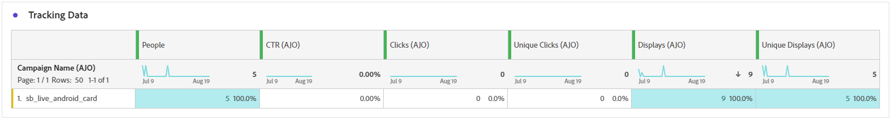

# Kampanjrapport {#campaign-global-report-cja}

**Kampanjrapporten** fungerar som en omfattande kontrollpanel, som ger en detaljerad analys av nyckeltal som är kopplade till kampanjen. Den innehåller data som klickräkning, levererade meddelanden, profilnummer och vidtagna åtgärder. Genom att erbjuda en fullständig översikt över kampanjens effektivitet och engagemangsnivåer säkerställer rapporten en grundlig förståelse för kampanjens övergripande resultat.

Kampanjrapporter kan nås direkt från din kampanj med knappen **[!UICONTROL Reports]**.

Sidan **Kampanjrapport** visas med följande flikar beroende på vald kanal:

* [Campaign](#campaign-global)
* [Experimentation](#experimentation)
* [E-post](#email-global)
* [SMS](#sms)
* [Push-meddelande](#push-notification)
* [Direktmeddelande](#direct-mail)
* [Webb](#web)
* [Innehållskort](#content-card)

Mer information om Customer Journey Analytics Workspace och hur du filtrerar och analyserar data finns på [den här sidan](https://experienceleague.adobe.com/en/docs/analytics-platform/using/cja-workspace/home).

## Campaign {#campaign-global}

### KPI:er för kampanj {#campaign-kpis}

**[!UICONTROL Campaign]** KPI:er (Key Performance Indicators) fungerar som en heltäckande kontrollpanel, som tillhandahåller en analys av viktig statistik som är kopplad till din kampanj. Detta omfattar detaljer som antalet klick och antalet levererade meddelanden, vilket ger en heltäckande inblick i kampanjens effektivitet och nivå av engagemang.

KPI:erna varierar beroende på vilka kanaler som används i kampanjen.

+++ Läs mer om KPI:er för Campaign

* **[!UICONTROL Click through rate]**: Procentandel användare som interagerade med meddelandet.

* **[!UICONTROL Clicks]**: Antal gånger som ett innehåll klickades på i meddelandet.

* **[!UICONTROL Delivered]**: Antal e-postmeddelanden som har skickats, i relation till det totala antalet skickade meddelanden.

* **[!UICONTROL Displays]**: Antal gånger som meddelandet öppnades.

+++

### Översikt över Campaign {#delivery-global}

Tabellen **[!UICONTROL Campaign overview]** fungerar som en omfattande kontrollpanel med en detaljerad beskrivning av nyckeltal relaterade till kampanjen. Detta inkluderar viktig information som antalet profiler och de åtgärder som utförts, vilket ger en grundlig förståelse för kampanjens resultat och engagemang.

Observera att mätvärdena varierar beroende på vilka kanaler som används i kampanjen.

+++ Läs mer om mätvärden för Campaign-översikt

* **[!UICONTROL People]**: Antal användarprofiler som kvalificerar sig som målprofiler för dina meddelanden.

* **[!UICONTROL Click through rate]**: Procentandel användare som interagerade med meddelandet.

* **[!UICONTROL Clicks]**: Antal gånger som ett innehåll klickades på i meddelandet.

* **[!UICONTROL Unique Clicks]**: Antal profiler som klickade på ett innehåll i meddelandet.

* **[!UICONTROL Delivered]**: Antal e-postmeddelanden som har skickats, i relation till det totala antalet skickade meddelanden.

* **[!UICONTROL Bounces for outbound channels]**: Totalt antal fel som har ackumulerats under sändningsprocessen och automatisk returbearbetning i relation till totalt antal skickade meddelanden.

* **[!UICONTROL Outbound Errors]**: Totalt antal fel som uppstod under sändningsprocessen och som förhindrar att den skickas till profiler.

* **[!UICONTROL Outbound Exclusions]**: Antal profiler som har undantagits av Adobe Journey Optimizer.

* **[!UICONTROL Displays]**: Antal gånger som meddelandet öppnades.

* **[!UICONTROL Unique displays]**: Det antal gånger som meddelandet öppnades tas ingen hänsyn till flera interaktioner för en profil.

+++

### Kampanjtrattresultat {#campaign-funnel}

Diagrammet **[!UICONTROL Campaign funnel results]** innehåller en detaljerad analys av hur era profiler interagerar med dina meddelanden, och ger värdefulla insikter om hur olika profiler interagerade med ditt innehåll.

+++ Läs mer om resultatstatistik för kampanjtrattar

* **[!UICONTROL Delivered]**: Antal e-postmeddelanden som har skickats, i relation till det totala antalet skickade meddelanden.

* **[!UICONTROL Clicks]**: Antal gånger som ett innehåll klickades på i meddelandet.
+++

### Etikett för spårad länk {#campaign-track}

Tabellen **[!UICONTROL Tracked link label]** ger viktiga insikter i besökarnas engagemang med de URL:er som ingår i dina meddelanden, och ger värdefull information om vilka länkar som lockar mest interaktion.

+++ Läs mer om spårning av etikettmått för länkar

* **[!UICONTROL Unique Clicks]**: Antal profiler som klickade på ett innehåll i meddelandet.

* **[!UICONTROL Clicks]**: Antal gånger som ett innehåll klickades på i meddelandet.

+++

## Experimentation {#experimentation}

Fliken **[!UICONTROL Experimentation]** ger viktiga insikter om prestanda för varje variant och identifierar den som fungerar bäst.

Observera att det kan ta en stund att definiera den bästa utföraren. Om ditt experiment inte lyckas ställs det in på **Ofullständig**.

### KPI:er för experiment {#experimentation-kpis}

**[!UICONTROL Experimentation]** KPI:er (Key Performance Indicators) fungerar som en heltäckande kontrollpanel som levererar en analys av viktiga mått som är kopplade till dina experiment.

+++ Läs mer om KPI:er för experiment

* **[!UICONTROL Lift]**: Mät den procentuella förbättringen av konverteringsgraden för en given behandling över baslinjen.

* **[!UICONTROL Confidence]**: Bevis på att en viss behandling är densamma som den initiala behandlingen. [Läs mer](../content-management/experiment-calculations.md#understand-confidence)

+++

### Variant efter inkommande klick {#variant-inbound}

Widgeten **[!UICONTROL Variant by Inbound clicks]** visar prestanda för varje variant.
En djupdykning i dessa resultat och hur du tolkar dem finns på [den här sidan](../content-management/get-started-experiment.md#interpret-results).

+++ Läs mer om Mätvärden för inkommande klick för Variant

* **[!UICONTROL People]**: Antal användarprofiler som kvalificerar sig som målprofiler för dina meddelanden.

* **[!UICONTROL Inbound Clicks]**: Totalt antal klick över utgående kanaler.

* **[!UICONTROL Conversion rate]**: Det totala värdet för resultatmåttet, som tidigare valdes när du skapade dina experiment, delat med antalet profiler.

* **[!UICONTROL Lift]**: Mät den procentuella förbättringen av konverteringsgraden för en given behandling över baslinjen.

* **[!UICONTROL Confidence]**: Bevis på att en viss behandling är densamma som den initiala behandlingen. [Läs mer](../content-management/experiment-calculations.md#understand-confidence)

<!--
* **[!UICONTROL Confidence Upper bound]**:

* **[!UICONTROL Confidence Lower bound]**:
-->
+++

### Konverteringsgrad för inkommande klick {#conversion-rate}

Diagrammet **[!UICONTROL Confidence interval]** mäter osäkerheten kring förbättringen. Här anges den procentuella skillnaden i prestanda mellan baslinjen och den bästa behandlingen. [Läs mer](../content-management/experiment-calculations.md#confidence-intervals).

## E-post {#email-global}

### Levererat kontra klicktrend {#delivered-click}

Diagrammet **[!UICONTROL Delivered vs Click trend]** innehåller en detaljerad analys av hur dina profiler interagerar med dina e-postmeddelanden, och ger värdefulla insikter om hur profiler interagerar med ditt innehåll.

+++ Läs mer om Levererat jämfört med Click-trendstatistik

* **[!UICONTROL Delivered]**: Antal e-postmeddelanden som har skickats, i relation till det totala antalet skickade e-postmeddelanden.

* **[!UICONTROL Clicks]**: Antal gånger som ett innehåll klickades på i dina e-postmeddelanden.

+++

### Leveransstatus {#delivery-status}

Diagrammet **[!UICONTROL Delivery status]** ger en heltäckande bild av data relaterade till skickade e-postmeddelanden i kampanjen, och ger insikter i viktiga mått som levererade och studsade. Detta möjliggör en detaljerad analys av e-postsändningsprocessen och ger värdefull information om effektiviteten och resultatet för era kampanjer.

+++ Läs mer om leveransstatusvärden

* **[!UICONTROL Delivered]**: Antal e-postmeddelanden som har skickats, i relation till det totala antalet skickade e-postmeddelanden.

* **[!UICONTROL Bounces for outbound channels]**:Totalt antal fel som har ackumulerats under sändningsprocessen och automatisk returbearbetning i relation till det totala antalet skickade meddelanden.

* **[!UICONTROL Outbound errors]**: Totalt antal fel som uppstod under en sändningsprocess och som förhindrar att den skickas till profiler.

* **[!UICONTROL Outbound exclusions]**: Antal profiler som har undantagits av Adobe Journey Optimizer.

+++

### Skicka statistik {#sending-statistics-email}

Tabellen **[!UICONTROL Sending Statistics]** innehåller en omfattande sammanfattning av viktiga data om e-postmeddelanden i dina kampanjer. Den innehåller viktiga mätvärden som interaktionen med e-postmeddelanden och antalet e-postmeddelanden som levererats, vilket ger värdefulla insikter om effektiviteten och räckvidden för era e-postmeddelanden och kampanjer.

+++ Läs mer om Skicka statistik-statistik

* **[!UICONTROL People]**: Antal användarprofiler som kvalificerar sig som målprofiler för dina meddelanden.

* **[!UICONTROL Targeted]**: Totalt antal e-postmeddelanden som bearbetats under sändningsprocessen.

* **[!UICONTROL Sends]**: Totalt antal skickade meddelanden för din e-post.

* **[!UICONTROL Delivered]**: Antal e-postmeddelanden som har skickats, i relation till det totala antalet skickade meddelanden.

* **[!UICONTROL Bounces for outbound channels]**: Totalt antal fel som har ackumulerats under sändningsprocessen och automatisk returbearbetning i relation till totalt antal skickade meddelanden.

* **[!UICONTROL Outbound Errors]**: Totalt antal fel som uppstod under sändningsprocessen och som förhindrar att den skickas till profiler.

* **[!UICONTROL Outbound Exclusions]**: Antal profiler som har undantagits av Adobe Journey Optimizer.

+++

### Spårningsstatistik {#tracking-statistics-email}

Tabellen **[!UICONTROL Email - Tracking statistics]** innehåller ett detaljerat konto för profilaktivitet som är relaterad till e-postmeddelanden som ingår i kampanjen. Detta inkluderar mätvärden för öppningar, klick och andra relevanta interaktionsindikatorer, som ger en heltäckande bild av hur profiler interagerar med ert e-postinnehåll.

+++ Läs mer om statistik för spårning

* **[!UICONTROL Click through rate (CTR)]**: Procentandel användare som interagerade med e-postmeddelandet.

* **[!UICONTROL Click through open rate (CTOR)]**: Antal gånger som e-postmeddelandet öppnades.

* **[!UICONTROL Clicks]**: Antal gånger som ett innehåll klickades på i dina e-postmeddelanden.

* **[!UICONTROL Unique Clicks]**: Antal profiler som klickat på ett innehåll i ett e-postmeddelande.

* **[!UICONTROL Email Opens]**: Antal gånger som dina e-postmeddelanden öppnats i en kampanj.

* **[!UICONTROL Unique Email Opens]**: Procentandel öppnade e-postmeddelanden.

* **[!UICONTROL Spam complaints]**: Antal gånger ett meddelande har deklarerats som skräppost eller skräppost.

* **[!UICONTROL Unsubscribes]**: Antal klick på länken för att avbryta prenumerationen.

+++

### E-postdomäner {#email-domains}

Tabellen **[!UICONTROL Email Domains]** innehåller en detaljerad beskrivning av e-postmeddelanden kategoriserade efter domän, vilket ger omfattande insikter om prestandamätningarna för dina e-postkampanjer. Denna omfattande analys gör att ni kan förstå beteendet hos olika domäner som svar på ert e-postinnehåll.

+++ Läs mer om mätvärden för e-postdomäner

* **[!UICONTROL Sends]**: Totalt antal skickade meddelanden för din e-post.

* **[!UICONTROL Delivered]**: Antal e-postmeddelanden som har skickats, i relation till det totala antalet skickade e-postmeddelanden.

* **[!UICONTROL Email Opens]**: Antal gånger som dina e-postmeddelanden öppnats i en kampanj.

* **[!UICONTROL Clicks]**: Antal gånger som ett innehåll klickades på i dina e-postmeddelanden.

* **[!UICONTROL Bounces for outbound channels]**: Totalt antal fel som har ackumulerats under sändningsprocessen och automatisk returbearbetning i relation till totalt antal skickade e-postmeddelanden.

* **[!UICONTROL Outbound Errors]**: Totalt antal fel som uppstod under sändningsprocessen och som förhindrar att den skickas till profiler.
+++

### Spårade länketiketter {#track-link-label}

Tabellen **[!UICONTROL Tracked link labels]** innehåller en omfattande översikt över länketiketterna i dina e-postmeddelanden, som visar vilka som genererar störst besökstrafik. Med den här funktionen kan du identifiera och prioritera de mest populära länkarna.

+++ Läs mer om mätvärden för spårade länketiketter

* **[!UICONTROL Unique Clicks]**: Antal profiler som klickat på ett innehåll i ett e-postmeddelande.

* **[!UICONTROL Clicks]**: Antal gånger som ett innehåll klickades på i dina e-postmeddelanden.

+++

### URL för spårad länk {#track-link-url}

Tabellen **[!UICONTROL Tracked link URLs]** innehåller en omfattande översikt över de URL:er i ditt e-postmeddelande som lockar den högsta besökstrafiken. På så sätt kan ni identifiera och prioritera de mest populära länkarna och öka er förståelse för hur proffsen interagerar med specifikt innehåll i era e-postmeddelanden.

+++ Läs mer om URL:er för spårade länkar

* **[!UICONTROL Unique Clicks]**: Antal profiler som klickat på ett innehåll i ett e-postmeddelande.

* **[!UICONTROL Clicks]**: Antal gånger som ett innehåll klickades på i dina e-postmeddelanden.

* **[!UICONTROL Displays]**: Antal gånger som e-postmeddelandet öppnades.

* **[!UICONTROL Unique displays]**: Det antal gånger som e-postmeddelandet öppnades tas ingen hänsyn till flera interaktioner för en profil.

+++

### E-postämnen {#email-subjects}

Tabellen **[!UICONTROL Email subjects]** innehåller en grundlig översikt över e-postämnen som har fått den högsta besökstrafiken. Den här resursen ger värdefulla insikter om målgruppsengagemangets dynamik.

+++ Läs mer om ämnesstatistik för e-post

* **[!UICONTROL People]**: Antal användarprofiler som kvalificerar sig som målprofiler för dina e-postmeddelanden.

+++

### Undantagna orsaker {#excluded-reasons}

Tabellen **[!UICONTROL Excluded reasons]** ger en heltäckande bild av de olika faktorer som har lett till att användarprofiler har exkluderats från målgruppen, vilket leder till att meddelandet inte tas emot.

Se [den här sidan](exclusion-list.md) för en utförlig lista över orsaker till undantag.

### Brytningsorsaker {#bounce-reasons-email}

Tabellen **[!UICONTROL Bounce Reasons]** kompilerar tillgängliga data som är relaterade till studsade meddelanden och ger detaljerade insikter om de specifika orsakerna bakom e-poststudsar.

Mer information om studsar finns på sidan [Suppressionslista](../reports/suppression-list.md).

### Felorsaker {#error-reasons-email}

Tabellen **[!UICONTROL Error Reasons]** ger synlighet för de specifika fel som uppstod under sändningsprocessen, vilket ger värdefull information om felens art och förekomst.

## SMS {#sms}

### Levererat kontra klicktrend {#delivered-click-sms}

Diagrammet **[!UICONTROL Delivered vs Click trend]** innehåller en detaljerad analys av hur dina profiler interagerar med dina e-postmeddelanden, och ger värdefulla insikter om hur profiler interagerar med ditt innehåll.

+++ Läs mer om Levererat jämfört med Click-trendstatistik

* **[!UICONTROL Delivered]**: Antal SMS-meddelanden som har skickats, i relation till totalt antal SMS-meddelanden.

* **[!UICONTROL Clicks]**: Antal gånger som ett innehåll klickades på i dina SMS-meddelanden.

+++

### Leveransstatus {#delivery-status-sms}

Tabellen **[!UICONTROL Delivery status]** innehåller en detaljerad redovisning av profilaktivitet som är relaterad till dina SMS-kampanjer. Detta inkluderar mätvärden för levererade data, klickningar och andra relevanta interaktionsindikatorer, som ger en heltäckande bild av hur profiler interagerar med ert SMS-innehåll.

+++ Läs mer om leveransstatusvärden

* **[!UICONTROL Delivered]**: Antal SMS-meddelanden som har skickats, i relation till totalt antal SMS-meddelanden.

* **[!UICONTROL Bounces for outbound channels]**: Totalt antal fel som har ackumulerats under sändningsprocessen och automatisk returbearbetning i relation till det totala antalet skickade SMS-meddelanden.

* **[!UICONTROL Outbound errors]**: Totalt antal fel som har inträffat som förhindrar att den skickas till profiler.

* **[!UICONTROL Outbound exclusions]**: Antal profiler som har undantagits av Adobe Journey Optimizer.

+++

### Spårade länketiketter {#track-link-label-sms}

Tabellen **[!UICONTROL Tracked link labels]** innehåller en omfattande översikt över länketiketterna i dina SMS-meddelanden, som visar vilka som genererar den högsta besökstrafiken. Med den här funktionen kan du identifiera och prioritera de mest populära länkarna.

+++ Läs mer om mätvärden för spårade länketiketter

* **[!UICONTROL Unique Clicks]**: Antal profiler som klickade på ett innehåll i SMS-meddelandet.

* **[!UICONTROL Clicks]**: Antal gånger som ett innehåll klickades på i dina SMS-meddelanden.

+++

### URL för spårad länk {#track-link-url-sms}

Tabellen **[!UICONTROL Tracked link URLs]** innehåller en omfattande översikt över de URL:er i dina SMS-meddelanden som lockar den högsta besökstrafiken. På så sätt kan ni identifiera och prioritera de mest populära länkarna och öka er förståelse för hur proffsen interagerar med specifikt innehåll i era SMS-meddelanden.

+++ Läs mer om URL:er för spårade länkar

* **[!UICONTROL Unique Clicks]**: Antal profiler som klickade på ett innehåll i SMS-meddelandet.

* **[!UICONTROL Clicks]**: Antal gånger som ett innehåll klickades på i dina SMS-meddelanden.

* **[!UICONTROL Displays]**: Antal gånger som meddelandet öppnades.

* **[!UICONTROL Unique displays]**: Det antal gånger som meddelandet öppnades tas ingen hänsyn till flera interaktioner för en profil.

+++

### SMS inkommande meddelande {#sms-inbound}

Tabellen **[!UICONTROL SMS inbound message]** innehåller en detaljerad översikt över vilka SMS-meddelanden som har dragit till sig den högsta besökstrafiken. Den här resursen ger värdefulla insikter om målgruppsengagemangets dynamik.

+++ Läs mer om mätvärden för inkommande SMS-meddelanden

* **[!UICONTROL People]**: Antal användarprofiler som kvalificerar sig som målprofiler för dina SMS-meddelanden.

+++

### SMS-meddelandetyp {#sms-message-type}

Tabellen **[!UICONTROL SMS Message type]** innehåller en detaljerad översikt över vilken SMS-meddelandetyp som har dragit till sig den högsta besökstrafiken. Den här resursen ger värdefulla insikter om målgruppsengagemangets dynamik.

+++ Läs mer om mätvärden för SMS-meddelandetyp

* **[!UICONTROL People]**: Antal användarprofiler som kvalificerar sig som målprofiler för dina SMS-meddelanden.

+++

### SMS-leverantörer {#sms-providers}

Tabellen **[!UICONTROL SMS providers]** innehåller en detaljerad översikt över vilka SMS-leverantörer som har dragit till sig den högsta besökstrafiken. Den här resursen ger värdefulla insikter om målgruppsengagemangets dynamik.

+++ Läs mer om mätvärden för SMS-leverantörer

* **[!UICONTROL People]**: Antal användarprofiler som kvalificerar sig som målprofiler för dina SMS-meddelanden.

+++

### Brytningsorsaker {#bounce-reasons-sms}

Tabellen **[!UICONTROL Bounces Reasons]** innehåller en omfattande översikt över data relaterade till avvisade SMS-meddelanden och ger värdefull information om de specifika orsakerna bakom instanser av SMS-meddelandegränser.

### Felorsaker {#error-reasons-sms}

I tabellen **[!UICONTROL Error Reasons]** kan du identifiera de specifika fel som uppstod under sändningsprocessen för dina SMS-meddelanden, vilket underlättar en grundlig analys av eventuella problem som påträffas.

### Exkludera orsaker {#excluded-reasons-sms}

Tabellen **[!UICONTROL Exclude Reasons]** visar de olika faktorer som ledde till att användarprofiler exkluderades från målgruppen, vilket förhindrar dem från att ta emot dina SMS-meddelanden.

Se [den här sidan](exclusion-list.md) för en utförlig lista över orsaker till undantag.

## Push-meddelande {#push-notification}

### Skicka statistik {#sending-statistics-push}

Tabellen **[!UICONTROL Sending Statistics]** innehåller en omfattande sammanfattning av viktiga data om push-meddelandekampanjer. Den innehåller viktiga mätvärden, som målgruppens storlek och antalet push-meddelanden som levererats, och ger värdefulla insikter om hur effektivt och relevant ditt push-meddelande är.

+++ Läs mer om Skicka statistik-statistik

* **[!UICONTROL People]**: Antal användarprofiler som är kvalificerade som målprofiler för dina push-meddelanden.

* **[!UICONTROL Targeted]**: Totalt antal push-meddelanden som bearbetats under analysen.

* **[!UICONTROL Sends]**: Totalt antal skickade för push-meddelandet.

* **[!UICONTROL Delivered]**: Antal push-meddelanden som har skickats, i relation till det totala antalet skickade push-meddelanden.

* **[!UICONTROL Bounces for outbound channels]**: Totalt antal fel som har ackumulerats under sändningsprocessen och automatisk returbearbetning i relation till totalt antal push-meddelanden.

* **[!UICONTROL Outbound errors]**: Totalt antal fel som har inträffat som förhindrar att den skickas till profiler.

* **[!UICONTROL Outbound exclusions]**: Antal profiler som har undantagits av Adobe Journey Optimizer.

+++

### Spårningsstatistik {#tracking-statistics-push}

Tabellen **[!UICONTROL Tracking statistics]** erbjuder en detaljerad ögonblicksbild av profilaktivitet som är kopplad till dina push-meddelanden, vilket ger viktiga insikter om engagemang och push-meddelandenas effektivitet.

+++ Läs mer om statistik för spårning

* **[!UICONTROL Click through rate (CTR)]**: Procentandel användare som interagerade med push-meddelanden.

* **[!UICONTROL Click through open rate (CTOR)]**: Antal gånger som push-meddelanden öppnades.

* **[!UICONTROL Clicks]**: Antal gånger som ett innehåll klickades på i dina push-meddelanden.

* **[!UICONTROL Unique Clicks]**: Antal profiler som klickat på ett innehåll i dina push-meddelanden.

<!--
* **[!UICONTROL Push custom actions]**: 
-->
+++

### Spårade länketiketter {#track-link-label-push}

Tabellen **[!UICONTROL Tracked link labels]** innehåller en omfattande översikt över länketiketterna i dina push-meddelanden, som visar de som genererar den högsta besökstrafiken. Med den här funktionen kan du identifiera och prioritera de mest populära länkarna.

+++ Läs mer om mätvärden för spårade länketiketter

* **[!UICONTROL Unique Clicks]**: Antal profiler som klickat på ett innehåll i dina push-meddelanden.

* **[!UICONTROL Clicks]**: Antal gånger som ett innehåll klickades på i dina push-meddelanden.

+++

### URL för spårad länk {#track-link-url-push}

Tabellen **[!UICONTROL Tracked link URLs]** innehåller en omfattande översikt över de URL:er i dina push-meddelanden som lockar den högsta besökstrafiken. På så sätt kan ni identifiera och prioritera de populäraste länkarna och öka er förståelse för hur proffsen interagerar med specifikt innehåll i era push-meddelanden.

+++ Läs mer om URL:er för spårade länkar

* **[!UICONTROL Unique Clicks]**: Antal profiler som klickat på ett innehåll i dina push-meddelanden.

* **[!UICONTROL Clicks]**: Antal gånger som ett innehåll klickades på i dina push-meddelanden.

+++

### Brytningsorsaker {#bounce-reasons-push}

Tabellen **[!UICONTROL Bounces Reasons]** innehåller en omfattande översikt över data relaterade till studsade push-meddelanden, vilket ger värdefulla insikter om de specifika orsakerna bakom instanser av push-meddelanden.

### Felorsaker {#error-reasons-push}

I tabellen **[!UICONTROL Error Reasons]** kan du identifiera de specifika fel som uppstod under sändningsprocessen för dina push-meddelanden, vilket underlättar en grundlig analys av eventuella problem som uppstått.

### Undantagna orsaker {#exclude-reasons-push}

Tabellen **[!UICONTROL Exclude Reasons]** visar de olika faktorer som ledde till att användarprofiler exkluderades från målgruppen, vilket förhindrar dem från att ta emot push-meddelanden.

Se [den här sidan](exclusion-list.md) för en utförlig lista över orsaker till undantag.

## I appen {#in-app}

### Trend för tryck och klickning {#impression-click-trend}

Diagrammet **[!UICONTROL Impression & Click trend]** innehåller en detaljerad analys av hur dina profiler interagerar med dina meddelanden i appen och ger värdefulla insikter om hur profilerna interagerar med ditt innehåll.

+++ Läs mer om intryckt- och klicktrendstatistik

* **[!UICONTROL Clicks]**: Antal gånger som ett innehåll klickades på i dina meddelanden i appen.

* **[!UICONTROL Displays]**: Antal gånger som meddelandet öppnades.

+++

### Klickningar {#clicks-inapp}

Diagrammet **[!UICONTROL Clicks]** visar klickvärden i appen, som visar både det totala antalet innehållsklickningar och antalet unika profiler som klickade på innehållet.

+++ Läs mer om klickningsstatistik

* **[!UICONTROL Unique Clicks]**: Antal profiler som klickat på ett innehåll i meddelanden i appen

* **[!UICONTROL Clicks]**: Antal gånger som ett innehåll klickades på i dina meddelanden i appen.

+++

### Visa {#display-inapp}

Diagrammet **[!UICONTROL Displays]** hjälper dig att förstå både meddelandets övergripande räckvidd och antalet unika profiler som är kopplade till det.

+++ Läs mer om visningsmått

* **[!UICONTROL Displays]**: Antal gånger som meddelandet öppnades.

* **[!UICONTROL Unique displays]**: Det antal gånger som meddelandet öppnades tas ingen hänsyn till flera interaktioner för en profil.

+++

### Spårningsdata {#tracking-data-inapp}

Tabellen **[!UICONTROL Tracking data]** innehåller en detaljerad ögonblicksbild av profilaktiviteten som är kopplad till dina meddelanden i appen, vilket ger viktiga insikter i hur engagemanget och i appmeddelanden fungerar.

+++ Läs mer om att spåra datamätningar

* **[!UICONTROL People]**: Antal användarprofiler som kvalificerar som målprofiler för meddelanden i appen.

* **[!UICONTROL Click through rate (CTR)]**: Procentandel användare som interagerade med meddelanden i appen.

* **[!UICONTROL Click through open rate (CTOR)]**: Antal gånger som meddelanden i programmet öppnades.

* **[!UICONTROL Clicks]**: Antal gånger som ett innehåll klickades på i dina meddelanden i appen.

* **[!UICONTROL Unique Clicks]**: Antal profiler som klickat på ett innehåll i meddelanden i appen.

* **[!UICONTROL Displays]**: Antal gånger som meddelandet öppnades.

* **[!UICONTROL Unique displays]**: Det antal gånger som meddelandet öppnades tas ingen hänsyn till flera interaktioner för en profil.

* **[!UICONTROL Sends]**: Totalt antal skickade meddelanden i appen.

<!--
* **[!UICONTROL Inbound triggered]**: 

* **[!UICONTROL Inbound dismisses]**: 
-->
+++

### Spårade länketiketter {#track-link-label-inapp}

Tabellen **[!UICONTROL Tracked link labels]** innehåller en omfattande översikt över länketiketterna i dina meddelanden i appen, som visar de som genererar den högsta besökstrafiken. Med den här funktionen kan du identifiera och prioritera de mest populära länkarna.

+++ Läs mer om mätvärden för spårade länketiketter

* **[!UICONTROL Unique Clicks]**: Antal profiler som klickat på ett innehåll i meddelanden i appen.

* **[!UICONTROL Clicks]**: Antal gånger som ett innehåll klickades på i dina meddelanden i appen.

* **[!UICONTROL Displays]**: Antal gånger som meddelandet öppnades.

* **[!UICONTROL Unique displays]**: Det antal gånger som meddelandet öppnades tas ingen hänsyn till flera interaktioner för en profil.

+++

### URL för spårad länk {#track-link-url-inapp}

Tabellen **[!UICONTROL Tracked link URLs]** innehåller en omfattande översikt över de URL:er i dina meddelanden i appen som lockar den högsta besökstrafiken. På så sätt kan ni identifiera och prioritera de populäraste länkarna och öka er förståelse för hur proffsen interagerar med specifikt innehåll i era meddelanden i appen.

+++ Läs mer om URL:er för spårade länkar

* **[!UICONTROL Unique Clicks]**: Antal profiler som klickat på ett innehåll i meddelanden i appen.

* **[!UICONTROL Clicks]**: Antal gånger som ett innehåll klickades på i dina meddelanden i appen.

+++

## Direktmeddelande {#direct-mail}

### Skicka statistik {#sending-statistics-directmail}

Tabellen **[!UICONTROL Sending Statistics]** innehåller en omfattande sammanfattning av viktiga data om dina direktreklamkampanjer. Här finns viktiga mätvärden, till exempel storleken på målgruppen och antalet direktutskick som levererats, och där finns värdefulla insikter om direktutskickens effektivitet och räckvidd.

+++ Läs mer om Skicka statistik-statistik

* **[!UICONTROL People]**: Antal användarprofiler som kvalificerar sig som målprofiler för dina meddelanden.

* **[!UICONTROL Targeted]**: Totalt antal direktmeddelandemeddelanden som bearbetats under sändningsprocessen.

* **[!UICONTROL Sends]**: Totalt antal skickade meddelanden för dina direktutskick.

* **[!UICONTROL Delivered]**: Antal skickade direktmeddelanden i relation till det totala antalet skickade meddelanden.

* **[!UICONTROL Outbound Errors]**: Totalt antal fel som uppstod under sändningsprocessen och som förhindrar att den skickas till profiler.

* **[!UICONTROL Outbound Exclusions]**: Antal profiler som har undantagits av Adobe Journey Optimizer.

+++

### Leveransstatus {#delivery-status-directmail}

Diagrammet **[!UICONTROL Delivery status]** ger en heltäckande bild av data relaterade till skickade direktutskick i kampanjen, och ger insikter i viktiga mått som levererade och fel. Detta möjliggör en detaljerad analys av sändningsprocessen för direktreklam, vilket ger värdefull information om kampanjernas effektivitet och resultat.

+++ Läs mer om leveransstatusvärden

* **[!UICONTROL Delivered]**: Antal direktmeddelandemeddelanden som har skickats, i relation till det totala antalet skickade direktmeddelandemeddelanden.

* **[!UICONTROL Outbound errors]**: Totalt antal fel som uppstod under en sändningsprocess och som förhindrar att dina direktmeddelanden skickas till profiler.

* **[!UICONTROL Ountbound exclusions]**: Antal profiler som har undantagits av Adobe Journey Optimizer.

+++

### Felorsaker {#error-reasons-directmail}

I tabellen **[!UICONTROL Error Reasons]** kan du identifiera de specifika fel som uppstod under sändningsprocessen för dina direktutskick, vilket underlättar en grundlig analys av eventuella problem som uppstått.

### Undantagna orsaker {#exclude-reasons-directmail}

Tabellen **[!UICONTROL Exclude Reasons]** visar de olika faktorer som ledde till att användarprofiler exkluderades från målgruppen, vilket förhindrar dem från att ta emot dina direktutskick.

Se [den här sidan](exclusion-list.md) för en utförlig lista över orsaker till undantag.

## Webb {#web}

### Trend för tryck och klickning {#impressions-web}

Diagrammet **[!UICONTROL Impression & Click trend]** innehåller en detaljerad analys av hur dina profiler interagerar med dina webbsidor, och ger värdefulla insikter om hur profiler interagerar med ditt innehåll.

+++ Läs mer om intryckt- och klicktrendstatistik

* **[!UICONTROL Clicks]**: Antal gånger som ett innehåll har klickats på på dina webbsidor.

* **[!UICONTROL Displays]**: Antal gånger som meddelandet öppnades.

+++

### Klickningar {#clicks-web}

Diagrammet **[!UICONTROL Clicks]** visar klickvärden för webbsidor, som visar både det totala antalet innehållsklickningar och antalet unika profiler som klickade på innehållet.

+++ Läs mer om klickningsstatistik

* **[!UICONTROL Unique Clicks]**: Antal profiler som klickat på ett innehåll på dina webbsidor.

* **[!UICONTROL Clicks]**: Antal gånger som ett innehåll har klickats på på dina webbsidor.

+++

### Visar {#displays-web}

Diagrammet **[!UICONTROL Displays]** hjälper dig att förstå både meddelandets övergripande räckvidd och antalet unika profiler som är kopplade till det.

+++ Läs mer om visningsmått

* **[!UICONTROL Displays]**: Antal gånger som meddelandet öppnades.

* **[!UICONTROL Unique displays]**: Det antal gånger som meddelandet öppnades tas ingen hänsyn till flera interaktioner för en profil.

+++

### Spårningsdata {#track-data-web}

Tabellen **[!UICONTROL Tracking data]** innehåller en detaljerad ögonblicksbild av profilaktiviteten som är kopplad till dina webbsidor, vilket ger viktiga insikter i hur engagemanget och webbsidorna fungerar.

+++ Läs mer om att spåra datamätningar

* **[!UICONTROL People]**: Antal användarprofiler som kvalificerar sig som målprofiler för dina webbsidor.

* **[!UICONTROL Click through rate (CTR)]**: Procentandel användare som interagerade med webbsidorna.

* **[!UICONTROL Clicks]**: Antal gånger som ett innehåll har klickats på på dina webbsidor.

* **[!UICONTROL Unique Clicks]**: Antal profiler som klickat på ett innehåll på dina webbsidor.

* **[!UICONTROL Displays]**: Antal gånger som webbsidan öppnades.

* **[!UICONTROL Unique displays]**: Antal gånger webbsidan öppnades, flera interaktioner i en profil beaktas inte.

+++

### Spårade länketiketter {#track-link-web}

Tabellen **[!UICONTROL Tracked link labels]** innehåller en omfattande översikt över länketiketterna på dina webbsidor, och här framhävs de som genererar störst besökstrafik. Med den här funktionen kan du identifiera och prioritera de mest populära länkarna.

+++ Läs mer om mätvärden för spårade länketiketter

* **[!UICONTROL Unique Clicks]**: Antal profiler som klickat på ett innehåll på dina webbsidor.

* **[!UICONTROL Clicks]**: Antal gånger som ett innehåll har klickats på på dina webbsidor.

* **[!UICONTROL Displays]**: Antal gånger som meddelandet öppnades.

* **[!UICONTROL Unique displays]**: Det antal gånger som meddelandet öppnades tas ingen hänsyn till flera interaktioner för en profil.

+++

### URL för spårad länk {#track-url-web}

Tabellen **[!UICONTROL Tracked link URLs]** innehåller en omfattande översikt över de webbadresser på dina webbsidor som tillför den högsta besökstrafiken. På så sätt kan du identifiera och prioritera de populäraste länkarna och öka din förståelse för hur proffsen interagerar med specifikt innehåll på dina webbsidor.

+++ Läs mer om URL:er för spårade länkar

* **[!UICONTROL Unique Clicks]**: Antal profiler som klickat på ett innehåll på dina webbsidor.

* **[!UICONTROL Clicks]**: Antal gånger som ett innehåll har klickats på på dina webbsidor.

* **[!UICONTROL Displays]**: Antal gånger som meddelandet öppnades.

* **[!UICONTROL Unique displays]**: Det antal gånger som meddelandet öppnades tas ingen hänsyn till flera interaktioner för en profil.

+++

## Innehållskort {#content-card}

### Visa och klicka på trend {#display-click}

Diagrammen **[!UICONTROL Display & click trend]** hjälper dig att förstå både meddelandets övergripande räckvidd och antalet unika profiler som är kopplade till det.

+++ Läs mer om Visa och klicka på mätvärden

* **[!UICONTROL Clicks]**: Antal gånger som ett innehåll klickades på på i innehållskortet.

* **[!UICONTROL Displays]**: Antal gånger som meddelandet öppnades.

* **[!UICONTROL Unique displays]**: Det antal gånger som meddelandet öppnades tas ingen hänsyn till flera interaktioner för en profil.

+++

### Spårningsdata {#tracking-data}

Tabellen **[!UICONTROL Tracking data]** innehåller en detaljerad ögonblicksbild av profilaktiviteten som är kopplad till dina innehållskort, vilket ger viktiga insikter i engagemanget och innehållskortets effektivitet.

+++ Läs mer om att spåra datamätningar

* **[!UICONTROL People]**: Antal användarprofiler som kvalificerar som målprofiler för dina innehållskort.

* **[!UICONTROL Click through rate (CTR)]**: Procentandel användare som interagerade med innehållskortet.

* **[!UICONTROL Clicks]**: Antal gånger som ett innehåll har klickats på på ditt innehållskort.

* **[!UICONTROL Unique Clicks]**: Antal profiler som klickat på ett innehåll på ditt innehållskort.

* **[!UICONTROL Displays]**: Antal gånger som meddelandet öppnades.

* **[!UICONTROL Unique displays]**: Det antal gånger som meddelandet öppnades tas ingen hänsyn till flera interaktioner för en profil.

+++

### Spårade etiketter {#tracked-labels}

Tabellen **[!UICONTROL Tracked labels]** innehåller en omfattande översikt över länketiketterna på dina innehållskort, som visar de som genererar den högsta besökstrafiken. Med den här funktionen kan du identifiera och prioritera de mest populära länkarna.

+++ Läs mer om mätvärden för spårade etiketter

* **[!UICONTROL Unique Clicks]**: Antal profiler som klickat på ett innehåll i dina innehållskort.

* **[!UICONTROL Clicks]**: Antal gånger som ett innehåll klickades på i dina innehållskort.

* **[!UICONTROL Displays]**: Antal gånger som meddelandet öppnades.

* **[!UICONTROL Unique displays]**: Det antal gånger som meddelandet öppnades tas ingen hänsyn till flera interaktioner för en profil.

+++

