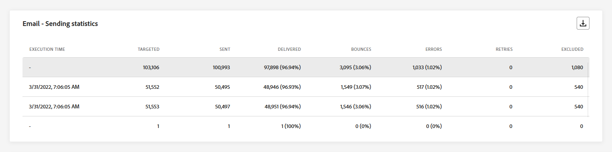
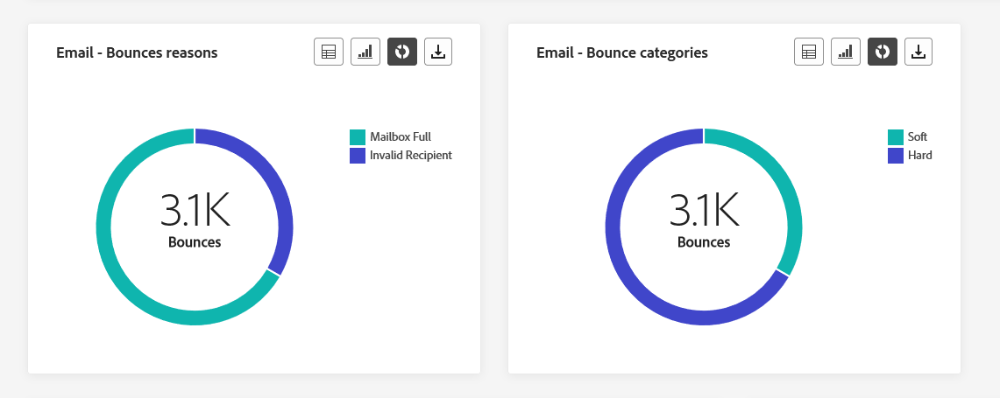
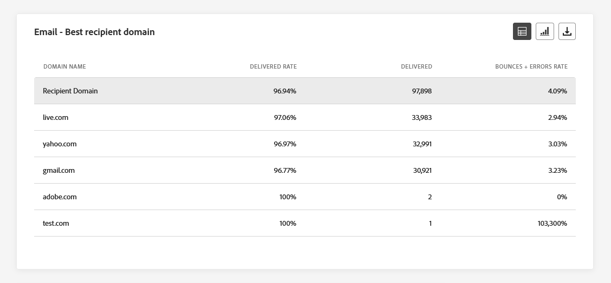
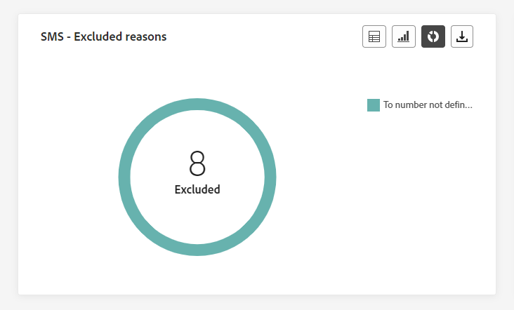
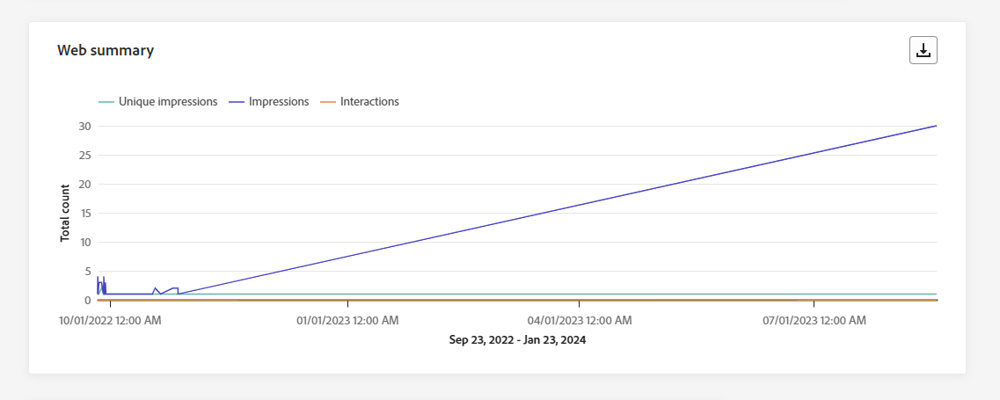

# Global kampanjrapport {#campaign-global-report}

>[!CONTEXTUALHELP]
>id="ajo_campaign_global_report"
>title="Global kampanjrapport"
>abstract="Med den globala rapporten Campaign kan ni mäta effekten av era kampanjer under en viss tidsperiod. Din rapport är uppdelad i olika widgetar som detaljerat beskriver kampanjens framgångar och fel. Varje rapportkontrollpanel kan ändras genom att widgetar storleksändras eller tas bort."

Globala rapporter, tillgängliga från **Alltid** visar du händelser som inträffade för minst två timmar sedan och täcker händelser under en viss tidsperiod. Live-rapporter fokuserar på händelser som har inträffat under de senaste 24 timmarna, med ett tidsintervall på minst två minuter från händelseförekomsten.

Kampanjens globala rapport kan nås direkt från er Campaign via **[!UICONTROL View report]** -knappen.

Kampanjen **[!UICONTROL Global report]** visas med följande flikar:

* [Campaign](#campaign-global)
* [E-post](#email-global)
* [I appen](#inapp-global)
* [Push](#push-global)
* [SMS](#sms-global)
* [Webb](#web-tab)
* [Direktmeddelande](#direct-mail-global)

Kampanjen **[!UICONTROL Global report]** är uppdelat i olika widgetar som detaljerat beskriver kampanjens framgångar och fel. Varje widget kan storleksändras och tas bort vid behov. Mer information finns i [section](../reports/global-report.md#modify-dashboard).

En detaljerad lista över alla mätvärden som är tillgängliga i Adobe Journey Optimizer finns på [den här sidan](global-report.md#list-of-components-global.md)

## Fliken Kampanj {#campaign-global}

### Leverans {#delivery-global}

>[!CONTEXTUALHELP]
>id="ajo_campaign_delivery_global"
>title="Kampanjstatistik"
>abstract="Widgeten Statistik för Campaign visar huvudinformationen i förhållande till din kampanj, t.ex. Angivna profiler och levererade åtgärder."

The **[!UICONTROL Campaign's Statistics]** KPI:er fungerar som en omfattande kontrollpanel med en detaljerad beskrivning av nyckeltal relaterade till kampanjen. Detta inkluderar viktig information som antalet profiler och de åtgärder som utförts, vilket ger en grundlig förståelse för kampanjens resultat och engagemang.

+++ Läs mer om statistik för Campaign

* **[!UICONTROL Audience]**: Antal målprofiler.

* **[!UICONTROL Actions delivered]**: Totalt antal unika gånger en åtgärd har levererats.

* **[!UICONTROL Actions failed in %]**: Procentandel unika gånger en åtgärd misslyckades jämfört med det totala antalet unika gånger en åtgärd har levererats.

+++

<!--
### Objectives report {#objectives-global}

The **[!UICONTROL Objectives]** tab allows you to better fine-tune your deliveries' reports by targeting one specific metric.

The **[!UICONTROL Objectives]** listed are linked to **[!UICONTROL Datasets]** that define a connection to a system in order to retrieve additional information. A list of built-in **[!UICONTROL Objectives]** is available but you can add your own by adding new **[!UICONTROL Dataset]**. For the detailed procedure, refer to this [section](../content-management/reporting-configuration.md).

After selecting the Objectives you want to target on, the two **[!UICONTROL Performance overview]** and **[!UICONTROL Campaign objective]** widgets will provide a detailed summary of your delivery performance. 

With the **[!UICONTROL Campaign objective]** widget, you can also choose to compare your main objective with another metric.
-->

### Experimentationsrapport {#experimentation-global}

>[!CONTEXTUALHELP]
>id="ajo_campaigns_content_experiment_click"
>title="Resultatmått"
>abstract="Det totala värdet för resultatmåttet, som tidigare valts när du skapade dina experiment, delat med antalet profiler."

The **[!UICONTROL Experimentation]** ger viktiga insikter om prestanda för varje variant och identifierar den mest framgångsrika.

Observera att det kan ta en stund att definiera den bästa utföraren, men den representeras av den här ikonen .

+++Läs mer om de olika mätvärden och widgetar som är tillgängliga för rapporten Experimentation.

The **[!UICONTROL Experiment result]** widgeten anger prestanda för varje variant. Du kan ändra din baslinje genom att välja en av behandlingarna i **[!UICONTROL Baseline]** listrutan. Den bästa behandlingen visas med en stjärnikon.

En djupdykning i dessa resultat och hur du tolkar dem finns i [den här sidan](../content-management/get-started-experiment.md#interpret-results).

Tabellen visar följande mått:

* **[!UICONTROL Lift over baseline]**: Mät den procentuella förbättringen av konverteringsgraden för en viss behandling jämfört med baslinjen.

* **[!UICONTROL Confidence]** Bevis på att en viss behandling är densamma som den initiala behandlingen. [Läs mer](../content-management/experiment-calculations.md#understand-confidence)

* **[!UICONTROL Unique outbound clicks]**: Totalt antal klick i utgående kanaler.

* **[!UICONTROL Profiles]**: Antal profiler som är avsedda för den här behandlingen.

* **[!UICONTROL Unique outbound clicks/profiles]**: Totalt värde för resultatmåttet, som tidigare valdes när du skapade dina experiment, delat med antalet profiler.

The **[!UICONTROL Confidence interval]** graf mäter osäkerheten kring förbättringen. Här anges den procentuella skillnaden i prestanda mellan baslinjen och den bästa behandlingen. [Läs mer](../content-management/experiment-calculations.md#confidence-intervals).

Den sista widgeten innehåller data relaterade till **[!UICONTROL Success metric]** du tidigare valde för dina behandlingar. Du kan välja ett annat målmått på menyn **[!UICONTROL Metric]** för att spåra alternativa data.

>[!CAUTION]
>
>När du arbetar med experimentellt filtrerade mätvärden bör du tänka på att om du ändrar måttvalet från listrutan på jämförelsesidan för experimenterande behålls inte filtervärdet. Om du till exempel växlar från&quot;Klickningar&quot; till&quot;Unika klickningar&quot; kommer det använda filtret att gå förlorat, vilket gör jämförelsen felaktig eller ogiltig.

+++

## Fliken E-post {#email-global}

### E-post - Sändande statistik {#sending-statistics-email}

>[!CONTEXTUALHELP]
>id="ajo_campaign_global_email_sending_statistics"
>title="E-post - Sändande statistik"
>abstract="Registret E-post - Skicka statistik innehåller en sammanfattning av viktiga data om din e-post, som Riktat eller Levererat."

The **[!UICONTROL Email Sending Statistics]** tabellen innehåller en omfattande sammanfattning av viktiga data om era e-postkampanjer. Den innehåller viktiga mätvärden som målgruppens storlek och antalet e-postmeddelanden som levererats, vilket ger värdefulla insikter om hur effektiva och omfattande era e-postmeddelanden är.

+++ Läs mer om statistik för e-postsändning

* **[!UICONTROL Targeted]**: Totalt antal bearbetade e-postmeddelanden under sändningsprocessen.

* **[!UICONTROL Sent]**: Totalt antal skickade meddelanden för din e-post.

* **[!UICONTROL Delivered]**: Antal e-postmeddelanden som har skickats, i relation till det totala antalet skickade meddelanden.

* **[!UICONTROL Delivery Rate]**: Procentandel e-postmeddelanden som skickades.

* **[!UICONTROL Bounces]**: Totalt antal fel som har ackumulerats under sändningsprocessen och automatisk returbearbetning i relation till det totala antalet skickade meddelanden.

* **[!UICONTROL Bounce Rate]**: Procentandel e-postmeddelanden som studsade jämfört med skickade e-postmeddelanden.

* **[!UICONTROL Errors]**: Totalt antal fel som uppstod under sändningsprocessen och som förhindrar att den skickas till profiler.

* **[!UICONTROL Error Rate]**: Procentandel fel som uppstod under sändningsprocessen och som förhindrade att den skickades jämfört med skickade e-postmeddelanden.

* **[!UICONTROL Retries]**: Antal e-postmeddelanden i kön för återförsök.

* **[!UICONTROL Excluded]**: Antal profiler som har uteslutits av Adobe Journey Optimizer.

+++

### E-post - Spårningsstatistik {#tracking-statistics-email}

>[!CONTEXTUALHELP]
>id="ajo_campaign_global_email_tracking_statistics"
>title="E-post - Spårningsstatistik"
>abstract="Registret E-post - Spårningsstatistik innehåller data om profilaktivitet för din e-post."

The **[!UICONTROL Email - Tracking statistics]** tabellen ger en detaljerad redovisning av profilaktivitet som rör dina e-postkampanjer. Detta inkluderar mätvärden för öppningar, klick och andra relevanta interaktionsindikatorer, som ger en heltäckande bild av hur profiler interagerar med ert e-postinnehåll.

+++ Läs mer om e-post - statistik för spårning

* **[!UICONTROL Opens]**: Antal gånger som e-postmeddelandet öppnades.

* **[!UICONTROL Unique Opens]**: Procentandel öppnade e-postmeddelanden.

* **[!UICONTROL Open Rate]**: Totalt antal öppnade e-postmeddelanden jämfört med antalet levererade e-postmeddelanden.

* **[!UICONTROL Clicks]**: Antal gånger som ett innehåll klickades på i dina e-postmeddelanden.

* **[!UICONTROL Unique Clicks]**: Antal profiler som klickat på ett innehåll i ett e-postmeddelande.

* **[!UICONTROL Unique Click Rate]**: Procentandel användare som interagerade med dina e-postmeddelanden.

* **[!UICONTROL Unsubscriptions]**: Antal klick på länken för att avbryta prenumerationen.

* **[!UICONTROL Spam complaints]**: Antal gånger ett meddelande har deklarerats som skräppost eller skräppost.

+++

### E-post - Sändande prestanda {#sending-performance-email}

>[!CONTEXTUALHELP]
>id="ajo_campaign_global_email_sending_performance"
>title="E-post - Sändande prestanda"
>abstract="Prestandadiagrammet E-post - sändning innehåller omfattande data om skickade e-postmeddelanden, som ger insikter i viktiga mätvärden som levererade och studsade, vilket möjliggör en detaljerad analys av e-postleveransprocessen."

The **[!UICONTROL Email - Sending Performance]** graf ger en heltäckande bild av data relaterade till skickade e-postmeddelanden, som ger insikter i viktiga mätvärden som levererade och studsade. Detta möjliggör en detaljerad analys av e-postsändningsprocessen och ger värdefull information om effektiviteten och resultatet för era e-postkampanjer.

+++ Läs mer om e-post - Sändande prestandamått

* **[!UICONTROL Delivered]**: Antal e-postmeddelanden som skickats, i relation till det totala antalet skickade e-postmeddelanden.

* **[!UICONTROL Bounces]**: Totalt antal fel som sammanställts under sändningsprocessen och automatisk returbehandling i relation till det totala antalet skickade e-postmeddelanden.

* **[!UICONTROL Retries]**: Antal e-postmeddelanden i kön för återförsök.

* **[!UICONTROL Errors]**: Totalt antal fel som uppstod under sändningsprocessen och som förhindrar att den skickas till profiler.

+++

### E-post - studsorsaker och kategorier {#bounces-email}

>[!CONTEXTUALHELP]
>id="ajo_campaign_global_email_bounce_categories"
>title="E-post - studskategorier"
>abstract="Diagram och tabell för kategorierna E-post - studsa ger data om både tillfälliga och permanenta fel."

>[!CONTEXTUALHELP]
>id="ajo_campaign_global_email_bounce_reasons"
>title="E-post - studsar orsaker"
>abstract="E-post - studsar orsaksdiagram och tabell innehåller tillgängliga data som relaterar till studsade meddelanden."

The **[!UICONTROL Email - Bounce Reasons]** och **[!UICONTROL Email - Bounce categories]** widgetar sammanställer tillgängliga data för studsade meddelanden, och ger detaljerade insikter om de specifika orsakerna och kategorierna bakom e-postgränserna.

Mer information om studsar finns i [Undertryckningslista](../reports/suppression-list.md) sida.

+++ Läs mer om e-post - statistik om studskategorier

* **[!UICONTROL Hard bounce]**: Det totala antalet permanenta fel, t.ex. fel e-postadress. Detta inbegriper ett felmeddelande som uttryckligen anger att adressen är ogiltig, till exempel Okänd användare.

* **[!UICONTROL Soft bounce]**: Det totala antalet tillfälliga fel, till exempel en fullständig inkorg.

* **[!UICONTROL Ignored]**: Det totala antalet tillfälliga, t.ex. frånvaro, eller ett tekniskt fel, t.ex. om avsändartypen är postmaster.

+++

### E-post - felorsaker {#errors-email}

>[!CONTEXTUALHELP]
>id="ajo_campaign_global_email_error_reasons"
>title="E-post - felorsaker"
>abstract="Med diagrammen E-post - felorsaker och tabellen kan du identifiera de specifika fel som uppstod under sändningsprocessen."

The **[!UICONTROL Error Reasons]** diagram och tabeller ger synlighet i de specifika fel som uppstod under sändningsprocessen och ger värdefull information om felens art och förekomst.

Du kan välja att växla från en tabell, ett stapeldiagram eller en munk.

### E-post - orsaker som inte tas med {#excluded-email}

>[!CONTEXTUALHELP]
>id="ajo_campaign_global_email_excluded_reasons"
>title="E-post - orsaker som inte tas med"
>abstract="I diagrammen och tabellen Exkluderade orsaker visas de olika faktorer som ledde till att användarprofiler exkluderades från målgruppen och inte fick meddelandet."

The **[!UICONTROL Excluded reasons]** diagram och tabeller ger en heltäckande bild av de olika faktorer som har lett till att användarprofiler har tagits bort från målgruppen, vilket leder till att meddelandet inte tas emot.

Se [den här sidan](exclusion-list.md) En fullständig förteckning över orsaker till uteslutning.

### Skickat och levererat av domäner {#sent-domains}

>[!CONTEXTUALHELP]
>id="ajo_campaign_global_email_sent_domains"
>title="Skickat och levererat av domäner"
>abstract="Tabellen och grafen Skickat och levererat per domän ger en detaljerad beskrivning av e-postmeddelanden kategoriserade efter domäner och ger djupgående insikter om hur e-postkommunikationen fungerar generellt."

The **[!UICONTROL Sent & delivered by domains]** tabellen och diagrammet ger en detaljerad beskrivning av e-postmeddelanden på domännivå, med omfattande insikter om hur dina e-postmeddelanden fungerar.

+++ Läs mer om Sänd och levererad via domänmått

* **[!UICONTROL Sent]**: Totalt antal skickade meddelanden för din e-post.

* **[!UICONTROL Delivered]**: Antal e-postmeddelanden som skickats, i relation till det totala antalet skickade e-postmeddelanden.

+++

### Begränsningar och fel per domäner {#bounces-domains}

>[!CONTEXTUALHELP]
>id="ajo_campaign_global_email_bounces_domains"
>title="Begränsningar och fel per domäner"
>abstract="Diagrammet och tabellen studsar och fel per domän ger en detaljerad fördelning på domännivå och ger insikter om specifika fel som uppstått under e-postsändningsprocessen."

The **[!UICONTROL Bounces & errors by domains]** diagram och tabeller ger en beskrivning på domännivå av specifika fel som påträffats under sändningsprocessen, vilket ger en detaljerad analys av problem som uppstått.

+++ Läs mer om studsar och fel per domänmått

* **[!UICONTROL Bounces]**: Totalt antal fel som sammanställts under sändningsprocessen och automatisk returbehandling i relation till det totala antalet skickade e-postmeddelanden.

* **[!UICONTROL Errors]**: Totalt antal fel som uppstod under sändningsprocessen och som förhindrar att din e-post skickas till profiler.

+++

### Öppna och klicka efter domäner {#opens-domains}

>[!CONTEXTUALHELP]
>id="ajo_campaign_global_email_open_domains"
>title="Öppna och klicka efter domäner"
>abstract="Diagrammet Öppna och klicka per domän och tabellen innehåller en detaljerad beskrivning på domännivå och en heltäckande bild av hur målgruppen interagerar med e-postmeddelanden."

The **[!UICONTROL Open & clicks by domains]** diagram och tabeller visar en sammanställning på domännivå av era profilers engagemang i ert e-postmeddelande, vilket ger värdefulla insikter om hur olika domäner interagerar med ert innehåll.

+++ Läs mer om Öppna och klickningar efter domänstatistik

* **[!UICONTROL Opens]**: Antal gånger som e-postmeddelandet öppnades.

* **[!UICONTROL Clicks]**: Antal gånger ett innehåll klickades på i ett e-postmeddelande.

+++

### Studsa orsaker efter domän {#bounce-reasons-domains}

>[!CONTEXTUALHELP]
>id="ajo_campaign_global_email_bounces_reasons_domains"
>title="Studsa orsaker efter domän"
>abstract="Studsorsaker per domän - diagram och tabell ger en nedbrytning på domännivå som ger omfattande insikter om både tillfälliga och permanenta fel. Denna detaljerade analys ger värdefull information om de specifika orsakerna bakom studsade meddelanden."

The **[!UICONTROL Bounce reasons by domain]** diagram och tabeller ger en uppdelning på domännivå av data om både tillfälliga och permanenta fel, vilket ger detaljerade insikter om orsakerna bakom studsade meddelanden.

+++ Läs mer om studsorsaker efter domänmått

* **[!UICONTROL Opens]**: Antal gånger som e-postmeddelandet öppnades.

* **[!UICONTROL Clicks]**: Antal gånger ett innehåll klickades på i ett e-postmeddelande.

+++

### E-post - övre URL {#top-url-email}

>[!CONTEXTUALHELP]
>id="ajo_campaign_global_email_top_url"
>title="E-post - övre URL"
>abstract="Diagrammet E-post - övre URL och tabellen ger en omfattande översikt över de URL:er i ditt e-postmeddelande som tar emot mest besökstrafik, så att du kan identifiera de mest populära länkarna."

The **[!UICONTROL Email - Top Url]** diagram och tabeller ger en omfattande översikt över de URL:er i e-postmeddelandet som lockar den högsta besökstrafiken. På så sätt kan ni identifiera och prioritera de mest populära länkarna och öka er förståelse för hur proffsen interagerar med specifikt innehåll i era e-postmeddelanden.

### E-post - Bästa mottagardomän {#top-recipient-email}

>[!CONTEXTUALHELP]
>id="ajo_campaign_global_email_best_recipient"
>title="E-post - Bästa mottagardomän"
>abstract="Diagrammet E-post - Bästa mottagardomän och tabellen ger en detaljerad beskrivning av de domäner som mottagarna oftast använder för att öppna e-postmeddelandet, och ger värdefulla insikter om mottagarnas beteende."

>[!CAUTION]
>
> The **[!UICONTROL Email - Best recipient domain]** widgeten har en noggrannhetshastighet på 99,95 %.

The **[!UICONTROL Email - Best recipient domain]** diagram och tabeller ger en detaljerad beskrivning av de domäner som används mest för att öppna e-postmeddelanden. Detta ger värdefulla insikter om profilbeteendet och hjälper er att förstå vilka plattformar ni föredrar.

+++ Läs mer om e-post - Bästa mottagardomänmått

* **[!UICONTROL Delivered]**: Antal e-postmeddelanden som skickats, i relation till det totala antalet skickade e-postmeddelanden.

* **[!UICONTROL Delivery Rate]**: Procentandel e-postmeddelanden som skickades.

* **[!UICONTROL Bounces + Errors Rate]**: Procentandel e-postmeddelanden som studsade jämfört med skickade e-postmeddelanden.

+++

### E-post - optimering {#optimized-email}

>[!NOTE]
>
>The **[!UICONTROL Optimized vs non optimized]** och **[!UICONTROL Send time optimization]** widgetar är bara tillgängliga om alternativet Sändningsoptimering är aktiverat för ditt e-postmeddelande. Mer information om optimering av sändningstid finns i [den här sidan](../building-journeys/journeys-message.md#send-time-optimization).

The **[!UICONTROL Optimized vs non optimized]** och **[!UICONTROL Send time optimization]** widgetar anger huvudinformationen i förhållande till meddelandet, oavsett om de är optimerade eller inte.

+++ Läs mer om optimeringsmått för sändningstid

* **[!UICONTROL Sent]**: Totalt antal överföringar.

* **[!UICONTROL Opens]**: Antal gånger som meddelandet öppnades.

* **[!UICONTROL Clicks]**: Antal gånger ett innehåll klickades i ett e-postmeddelande.

* **[!UICONTROL Delivered]**: Antal meddelanden som har skickats, i relation till det totala antalet skickade meddelanden.

* **[!UICONTROL Bounces]**: Totalt antal fel som har ackumulerats under sändningsprocessen och automatisk returbearbetning i relation till det totala antalet skickade meddelanden.

+++

### E-post - erbjudanden {#email-offers}

The **[!UICONTROL Offers statistics]**, **[!UICONTROL Offers statistics over time]** och **[!UICONTROL Offers detailed statistic]** widgetar mäter hur väl erbjudandet har lyckats och vilken effekt det har på er målgrupp.

+++ Läs mer om e-post - ger statistik

* **[!UICONTROL Offer sent]**: Totalt antal utskick för erbjudandet.

* **[!UICONTROL Offer impression]**: Antal gånger som erbjudandet öppnades i e-postmeddelanden.

* **[!UICONTROL Offer clicks]**: Antal gånger ett erbjudande klickades på i dina e-postmeddelanden.

* **[!UICONTROL Placement name]**: Namnet på den placering som användes för att visa ditt erbjudande. Mer information om placering finns i [page](../offers/offer-library/creating-placements.md).

* **[!UICONTROL Offer name]**: Namn på erbjudandet som lagts till i leveransen. Mer information om placering finns i [page](../offers/offer-library/creating-personalized-offers.md).

* **[!UICONTROL Offer sent]**: Totalt antal utskick för erbjudandet.

* **[!UICONTROL Offer impression rate]**: Andel öppnade erbjudanden jämfört med antalet skickade erbjudanden.

+++

## Fliken I appen {#inapp-global}

Från er kampanj **[!UICONTROL Global report]**, **[!UICONTROL In-app]** -fliken innehåller information om huvudinformationen i förhållande till de meddelanden i appen som skickas i kampanjen.

### Prestanda i appen {#in-app-performance}

>[!CONTEXTUALHELP]
>id="ajo_campaign_global_inapp_performance"
>title="Prestanda i appen"
>abstract="KPI:erna för prestanda i appen ger viktiga insikter i besökarnas engagemang med meddelanden i appen."

The **[!UICONTROL In-app performance]** Nyckeltal ger viktiga insikter i besökarnas engagemang med meddelanden i appen, vilket ger viktiga mätvärden för att utvärdera effektiviteten och effekten av era kampanjer i appen.

+++ Läs mer om prestandamätningar i appen

* **[!UICONTROL Unique impressions]**: antal unika användare som meddelandet i appen levererades till.

* **[!UICONTROL Impressions]**: totalt antal meddelanden i appen som levereras till alla användare.

* **[!UICONTROL Interactions]**: totalt antal ärenden för meddelandet i appen. Detta inkluderar alla åtgärder som användaren utför, t.ex. klickningar, uppsägningar eller annan interaktion.

+++

### Interaktioner per typ {#interactions-type}

>[!CONTEXTUALHELP]
>id="ajo_campaign_global_inapp_interactions"
>title="Interaktioner per typ"
>abstract="Interaktionen per typ av diagram och tabell visar hur användarna interagerade med meddelandet i appen genom att spåra varje klick, avbruten eller interaktion."

The **[!UICONTROL Interactions by type]** diagram och tabeller ger en detaljerad beskrivning av hur profiler interagerade med meddelanden i appen, spårningsåtgärder som klickningar, uppsägningar eller andra former av engagemang.

### Sammanfattning i appen {#in-app-summary}

>[!CONTEXTUALHELP]
>id="ajo_campaign_global_inapp_summary"
>title="Sammanfattning i appen"
>abstract="I sammanfattningsdiagrammet i appen visas utvecklingen för dina visningar och interaktioner i appen under den angivna perioden."

The **[!UICONTROL In-app summary]** graf visar utvecklingen av dina visningar och interaktioner i appen under den angivna perioden, vilket ger en omfattande översikt över hur dina meddelanden i appen fungerar.

+++ Läs mer om sammanfattningsstatistik i appar

* **[!UICONTROL Unique impressions]**: antal unika användare som meddelandet i appen levererades till.

* **[!UICONTROL Impressions]**: totalt antal meddelanden i appen som levereras till alla användare.

* **[!UICONTROL Interactions]**: totalt antal ärenden för meddelandet i appen. Detta inkluderar alla åtgärder som användaren utför, t.ex. klickningar, uppsägningar eller annan interaktion.

+++

## Fliken Push-meddelanden {#push-global}

Från er kampanj **[!UICONTROL Global report]**, **[!UICONTROL Push notification]** -fliken anger huvudinformationen i förhållande till push-meddelanden som skickas i kampanjen.

### Push-meddelande - skicka statistik {#push-sending-statistics}

>[!CONTEXTUALHELP]
>id="ajo_campaign_global_push_sending_statistics"
>title="Push-meddelande - skicka statistik"
>abstract="Registret Push Notification Sending Statistics sammanfattar viktiga data om dina push-meddelanden, som riktade eller levererade meddelanden."

The **[!UICONTROL Push notification - Sending statistics]** tabellen ger en kortfattad sammanfattning av viktiga data relaterade till dina push-meddelanden, inklusive nyckeltal som antalet riktade meddelanden och antalet lyckade meddelanden.

+++ Läs mer om push-meddelanden - Skicka statistik

* **[!UICONTROL Execution time]**: Starttid för varje körning av ditt återkommande push-meddelande. Om du bara vill ange ett eller flera återkommande push-meddelanden som mål väljer du det på menyn **[!UICONTROL Execution time]** nedrullningsbar meny.

* **[!UICONTROL Targeted]**: Totalt antal push-meddelanden som bearbetats under analysen.

* **[!UICONTROL Sent]**: Totalt antal överföringar för push-meddelanden.

* **[!UICONTROL Delivered]**: Antal push-meddelanden som har skickats, i relation till det totala antalet skickade push-meddelanden.

* **[!UICONTROL Delivery Rate]**: Procentandel skickade push-meddelanden.

* **[!UICONTROL Bounces]**: Totalt antal fel som har ackumulerats under sändningsprocessen och automatisk returbearbetning i relation till totalt antal push-meddelanden.

* **[!UICONTROL Bounce Rate]**: Procentandel push-meddelanden som studsade jämfört med skickade push-meddelanden.

* **[!UICONTROL Errors]**: Totalt antal fel som har inträffat som förhindrar att den skickas till profiler.

* **[!UICONTROL Error Rate]**: Procentandel fel som inträffade när det inte gick att skicka den jämfört med skickade push-meddelanden.

* **[!UICONTROL Excluded]**: Antal profiler som har uteslutits av Adobe Journey Optimizer.

+++

### Push-meddelande - Spårningsstatistik {#push-tracking-statistics}

>[!CONTEXTUALHELP]
>id="ajo_campaign_global_push_tracking_statistics"
>title="Push-meddelande - Spårningsstatistik"
>abstract="Statistik för push-spårning innehåller data om profilaktivitet för push-meddelanden."

The **[!UICONTROL Push notification- Tracking statistics]** widgeten erbjuder en detaljerad ögonblicksbild av profilaktivitet som är kopplad till dina push-meddelanden, vilket ger viktiga insikter i engagemanget och push-meddelandenas effektivitet.

+++ Läs mer om push-meddelanden - Spåra statistik

* **[!UICONTROL Execution time]**: Starttid för varje körning av ditt återkommande push-meddelande. Om du bara vill ange ett eller flera återkommande push-meddelanden som mål väljer du det på menyn **[!UICONTROL Execution time]** nedrullningsbar meny.

* **[!UICONTROL Opens]**: Antal gånger ditt push-meddelande öppnades.

* **[!UICONTROL Actions]**: Totalt antal åtgärder för push-meddelandet som levererats, t.ex. knappklickning eller avvisning.

+++

### Push-meddelande - Skickar sammanfattning {#push-summary}

>[!CONTEXTUALHELP]
>id="ajo_campaign_global_push_sending_summary"
>title="Push-meddelande - Skickar sammanfattning"
>abstract="I diagrammet Översikt över sändning av push-meddelanden visas tillgängliga data för skickade push-meddelanden."

The **[!UICONTROL Push notification - Sending summary]** graph erbjuder en dynamisk representation som visar en analys av din push-meddelandeaktivitet. Denna grafiska representation ger en omfattande beskrivning av skickade push-meddelanden.

+++ Läs mer om push-meddelanden - Skicka sammanfattningsmått

* **[!UICONTROL Opens]**: Antal gånger ditt push-meddelande öppnades.

* **[!UICONTROL Actions]**: Totalt antal åtgärder för push-meddelandet som levererats, t.ex. knappklickning eller avvisning.

* **[!UICONTROL Bounces]**: Totalt antal fel som ackumulerats och automatisk returbehandling i relation till totalt antal skickade push-meddelanden.

* **[!UICONTROL Delivered]**: Antal push-meddelanden som har skickats, i relation till det totala antalet skickade push-meddelanden.

* **[!UICONTROL Errors]**: Totalt antal fel som har inträffat som förhindrar att den skickas till profiler.

+++

### Push-meddelande - Optimering {#push-optimized}

>[!NOTE]
>
>The **[!UICONTROL Optimized vs non optimized]** och **[!UICONTROL Send time optimization]** widgetar är bara tillgängliga om alternativet för optimering av sändningstid är aktiverat för ditt push-meddelande. Mer information om optimering av sändningstid finns i [den här sidan](../building-journeys/journeys-message.md#send-time-optimization).

The **[!UICONTROL Optimized vs non optimized]** och **[!UICONTROL Send time optimization]** widgetar anger huvudinformationen i förhållande till meddelandet, oavsett om de är optimerade eller inte.

+++ Läs mer om push-meddelanden - Tidsoptimeringsmått för sändning

* **[!UICONTROL Delivered]**: Antal push-meddelanden som har skickats, i relation till det totala antalet skickade push-meddelanden.

* **[!UICONTROL Opens]**: Antal gånger ditt push-meddelande öppnades.

* **[!UICONTROL Actions]**: Totalt antal åtgärder för push-meddelandet som levererats, t.ex. knappklickning eller avvisning.

* **[!UICONTROL Bounces]**: Totalt antal fel som har ackumulerats under sändningsprocessen och automatisk returbearbetning i relation till det totala antalet skickade push-meddelanden.

+++

### Push-meddelande - felorsaker {#error-reasons-push}

>[!CONTEXTUALHELP]
>id="ajo_campaign_global_push_error_reasons"
>title="Push-meddelande - felorsaker"
>abstract="Med hjälp av diagrammen och tabellen Felorsaker kan du identifiera de specifika fel som uppstod under sändningsprocessen."

The **[!UICONTROL Error Reasons]** Med tabeller och diagram kan du identifiera de specifika fel som uppstod under sändningsprocessen för push-meddelanden, och du får detaljerade insikter om eventuella problem som påträffas under själva sändningsprocessen.

### Push-meddelande - Undantagna orsaker {#excluded-push}

>[!CONTEXTUALHELP]
>id="ajo_campaign_global_push_excluded_reasons"
>title="Push-meddelande - Undantagna orsaker"
>abstract="I diagrammen och tabellen Exkluderade orsaker visas de olika faktorer som ledde till att användarprofiler exkluderades från målgruppen och inte fick meddelandet."

The **[!UICONTROL Excluded reasons]** I diagram och tabeller visas de olika anledningar som gjorde att användarprofiler som inte ingår i målprofilerna inte kunde ta emot push-meddelanden.

Se [den här sidan](exclusion-list.md) En fullständig förteckning över orsaker till uteslutning.

### Push-meddelande - uppdelning efter plattform {#breakdown-platform-push}

>[!CONTEXTUALHELP]
>id="ajo_campaign_global_push_breakdown_platform"
>title="Push-meddelande - uppdelning efter plattform"
>abstract="Push-meddelandet - Uppdelning efter plattform - diagram och tabell visar hur väl push-meddelandena lyckades baserat på profilens operativsystem."

The **[!UICONTROL Push notification - Breakdown by platform]** diagram och tabeller ger en detaljerad analys av hur väl push-meddelandena fungerar och ger insikter baserat på din profils operativsystem. Den här nedbrytningen ger en bättre förståelse för hur bra dina push-meddelanden fungerar på olika plattformar.

+++ Läs mer om push-meddelanden - Uppdelning efter plattformsmått

* **[!UICONTROL Targeted]**: Totalt antal push-meddelanden som bearbetats under analysen.

* **[!UICONTROL Delivered]**: Antal push-meddelanden som har skickats, i relation till det totala antalet skickade push-meddelanden.

* **[!UICONTROL Opens]**: Antal gånger ditt push-meddelande öppnades.

* **[!UICONTROL Actions]**: Totalt antal åtgärder för push-meddelandet som levererats, t.ex. knappklickning eller avvisning.

* **[!UICONTROL Bounces]**: Totalt antal fel som ackumulerats och automatisk returbehandling i relation till totalt antal skickade push-meddelanden.

* **[!UICONTROL Errors]**: Totalt antal fel som har inträffat som förhindrar att den skickas till profiler.

* **[!UICONTROL Excluded]**: Antal profiler som har uteslutits av Adobe Journey Optimizer.

+++

## fliken SMS {#sms-global}

Från er kampanj **[!UICONTROL Global report]**, **[!UICONTROL SMS]** -fliken innehåller information om huvudinformationen i förhållande till SMS-meddelanden som skickas i kampanjen.

### SMS - Sändande statistik {#sms-sending-statistics}

>[!CONTEXTUALHELP]
>id="ajo_campaign_global_sms_sending_statistics"
>title="SMS - Sändande statistik"
>abstract="Registret SMS - Sändande statistik sammanfattar viktiga data om dina SMS-meddelanden, som riktade eller levererade meddelanden."

The **[!UICONTROL SMS - Sending statistics]** tabellen ger en kortfattad sammanfattning av viktiga data relaterade till dina SMS-meddelanden, med nyckelmått som antalet riktade meddelanden och antalet lyckade meddelanden.

+++ Läs mer om SMS - Skicka statistik

* **[!UICONTROL Execution time]**: Starttid för varje körning av ditt återkommande SMS-meddelande. Om du bara vill rikta in dig på ett eller flera återkommande SMS-meddelanden väljer du det i dialogrutan **[!UICONTROL Execution time]** nedrullningsbar meny.

* **[!UICONTROL Targeted]**: Antal användarprofiler som kvalificerar sig som målprofiler.

* **[!UICONTROL Excluded]**: Antal användarprofiler, exkluderade från målprofilerna, som inte fick meddelandet.

* **[!UICONTROL Sent]**: Totalt antal utskick för dina SMS-meddelanden.

* **[!UICONTROL Bounces]**: Totalt antal fel som sammanställts under sändningsprocessen och automatisk returbehandling i relation till det totala antalet skickade SMS-meddelanden.

* **[!UICONTROL Errors]**: Totalt antal fel som har inträffat som förhindrar att den skickas till profiler.

+++

### SMS - Spårningsstatistik {#sms-tracking-statistics}

>[!CONTEXTUALHELP]
>id="ajo_campaign_sms_tracking_statistics"
>title="SMS - Spårningsstatistik"
>abstract="Widgeten SMS - Spårningsstatistik ger en omfattande översikt över viktig information som rör besökarnas interaktion med din URL."

The **[!UICONTROL SMS - Tracking statistics]** widgeten ger en detaljerad översikt över viktig information om besökarnas engagemang i era URL:er, och ger insikter om hur effektiva era SMS-meddelanden är.

+++ Läs mer om SMS - Spåra statistik

* **[!UICONTROL Execution time]**: Starttid för varje körning av ditt återkommande SMS. Om du bara vill ange ett eller flera återkommande SMS som mål väljer du det i dialogrutan **[!UICONTROL Execution time]** nedrullningsbar meny.

* **[!UICONTROL Clicks]**: Antal gånger ett innehåll klickades i ett SMS-meddelande.

+++

### SMS - Prestanda per datum {#sms-perfomance-date}

>[!CONTEXTUALHELP]
>id="ajo_campaign_global_sms_performance"
>title="SMS - Prestanda per datum"
>abstract="Widgeten - SMS Performance by Date (SMS-prestanda efter datum) ger viktig information om dina meddelanden via en grafisk representation."

The **[!UICONTROL SMS Performance by date]** widgeten innehåller en detaljerad översikt över viktig information om dina meddelanden, som presenteras i ett diagram, och ger insikter om prestandatrender under specifika tidsperioder.

+++ Läs mer om SMS - Prestanda efter datummått

* **[!UICONTROL Sent]**: Totalt antal utskick för dina SMS-meddelanden.

* **[!UICONTROL Bounces]**: Totalt antal fel som sammanställts under sändningsprocessen och automatisk returbehandling i relation till det totala antalet skickade SMS-meddelanden.

* **[!UICONTROL Errors]**: Totalt antal fel som har inträffat som förhindrar att den skickas till profiler.

+++

### SMS - Felorsaker {#sms-error}

>[!CONTEXTUALHELP]
>id="ajo_campaign_global_sms_error_reasons"
>title="SMS - Felorsaker"
>abstract="Med hjälp av diagram och tabeller för felorsaker kan du identifiera de specifika fel som uppstod under sändningsprocessen."

The **[!UICONTROL Error Reasons]** Med diagram och tabeller kan du identifiera de specifika fel som uppstod under sändningsprocessen för SMS-meddelanden, vilket underlättar en grundlig analys av eventuella problem som uppstått.

### SMS - Undantagna orsaker {#sms-excluded-reasons}

>[!CONTEXTUALHELP]
>id="ajo_campaign_global_sms_excluded_reasons"
>title="SMS - Undantagna orsaker"
>abstract="I diagrammen och tabellen Exkluderade orsaker visas de olika faktorer som ledde till att användarprofiler exkluderades från målgruppen och inte fick meddelandet."

The **[!UICONTROL Excludes Reasons]** grafer och tabeller visar visuellt de olika faktorer som ledde till att användarprofiler exkluderades från målgruppen, vilket förhindrar dem från att ta emot SMS-meddelanden.

Se [den här sidan](exclusion-list.md) En fullständig förteckning över orsaker till uteslutning.

### SMS - studsar orsaker {#sms-bounces-reasons}

>[!CONTEXTUALHELP]
>id="ajo_campaign_global_sms_bounces_reasons"
>title="SMS - studsar orsaker"
>abstract="Diagram över studentorsaker och tabellen innehåller tillgängliga data om studsade meddelanden."

The **[!UICONTROL Bounces Reasons]** diagram och tabeller ger en omfattande översikt över data relaterade till studsade SMS-meddelanden och ger värdefulla insikter om de specifika orsakerna bakom instanser av SMS-meddelandegränser.

### SMS - Klicka på länkar {#sms-clicks-links}

>[!CONTEXTUALHELP]
>id="ajo_campaign_global_sms_clicks_links"
>title="SMS - Klicka på länkar"
>abstract="Widgeten SMS - Klicka på länkar ger viktiga insikter i besökarnas engagemang med URL:erna i dina meddelanden."

The **[!UICONTROL SMS - Clicks by links]** widgeten ger viktiga insikter i besökarnas engagemang med de URL:er som finns i dina meddelanden, och ger värdefull information om vilka länkar som lockar mest interaktion.

## Fliken Webb {#web-tab}

Från er kampanj **[!UICONTROL Global report]**, **[!UICONTROL Web]** -fliken anger huvudinformationen för dina webbsidor.

### Webbprestanda {#web-performance}

>[!CONTEXTUALHELP]
>id="ajo_campaign_global_web_performance"
>title="Webbprestanda"
>abstract="KPI:erna för Web Performance ger omfattande information om besökarnas engagemang i era webbupplevelser."

The **[!UICONTROL Web performance]** KPI:er ger omfattande insikter om besökarnas engagemang för era webbsidor, och omfattar viktiga mätvärden som Impressions och Interactions.

+++ Läs mer om mätvärden för webbprestanda

* **[!UICONTROL Unique impressions]**: antal unika användare som webbupplevelsen levererades till.

* **[!UICONTROL Impressions]**: totalt antal webbupplevelser som levereras till alla användare.

* **[!UICONTROL Interaction rate]**: procent av engagemanget på webbsidan. Detta inkluderar alla åtgärder som användaren utför, t.ex. klickningar eller andra interaktioner.

+++

### Webbsammanfattning {#web-summary}

>[!CONTEXTUALHELP]
>id="ajo_campaign_global_web_summary"
>title="Webbsammanfattning"
>abstract="I webbsammanfattningsdiagrammet visas hur webbupplevelserna fortskrider, inklusive visningar, unika visningar och interaktioner under den angivna perioden."

The **[!UICONTROL Web summary]** diagram visar hur era webbupplevelser har utvecklats (visningar, unika intryck och interaktioner) under den aktuella perioden.

+++ Läs mer om webbsammanfattningsstatistik

* **[!UICONTROL Unique impressions]**: antal unika användare som webbupplevelsen levererades till.

* **[!UICONTROL Impressions]**: totalt antal webbupplevelser som levereras till alla användare.

* **[!UICONTROL Interaction]**: totalt antal interaktioner med din webbsida. Detta inkluderar alla åtgärder som användaren utför, t.ex. klickningar eller andra interaktioner.

+++

### Interaktioner per element {#web-interactions}

>[!CONTEXTUALHELP]
>id="ajo_campaign_global_web_interactions"
>title="Interaktioner per element"
>abstract="Tabellen Interaktioner per element innehåller viktig information om besökarnas engagemang med olika element på webbsidorna."

The **[!UICONTROL Interactions by element]** tabellen innehåller omfattande information om besökarnas engagemang med de olika elementen på era webbsidor, med värdefulla insikter om användarinteraktioner och -preferenser.

+++ Läs mer om interaktioner per elementmått

* **[!UICONTROL Interaction]**: totalt antal interaktioner med din webbsida. Detta inkluderar alla åtgärder som användaren utför, t.ex. klickningar eller andra interaktioner.

* **[!UICONTROL Interaction rate]**: procent av engagemanget på webbsidan. Detta inkluderar alla åtgärder som användaren utför, t.ex. klickningar eller andra interaktioner.

+++

## Fliken Direktreklam {#direct-mail-global}

Från er kampanj **[!UICONTROL Global report]**, **[!UICONTROL Direct mail]** -fliken anger huvudinformationen i förhållande till dina Direct-postmeddelanden.

### Direktreklam - skicka statistik {#direct-mail-sending-statistics}

>[!CONTEXTUALHELP]
>id="ajo_campaign_global_direct_sending_statistics"
>title="Direktreklam - skicka statistik"
>abstract="Registret Skicka direkt e-post - statistik sammanfattar viktiga data om dina Direct Mail-meddelanden, till exempel riktade eller levererade meddelanden."

The **[!UICONTROL Direct Mail - Sending statistics]** tabellen ger en kortfattad sammanfattning av viktiga data relaterade till dina Direct Mail-meddelanden, med nyckeltal som antalet målmeddelanden och antalet lyckade meddelanden.

+++ Läs mer om direktreklam - statistik skickas

* **[!UICONTROL Execution time]**: Starttid för varje körning av din återkommande direktpost. Om du bara vill ange en eller flera återkommande direktmeddelanden som mål, markerar du dem på menyn **[!UICONTROL Execution time]** nedrullningsbar meny.

* **[!UICONTROL Targeted]**: Antal användarprofiler som kvalificerar sig som målprofiler för dina direktutskick.

* **[!UICONTROL Sent]**: Totalt antal direktutskick.

* **[!UICONTROL Errors]**: Totalt antal fel som uppstod under sändningsprocessen och som förhindrar att den skickas till profiler.

* **[!UICONTROL Excluded]**: Antal användarprofiler, exkluderade från målprofilerna, som inte fick dina direktutskick.

+++

### Direktreklam - felorsaker {#direct-mail-error}

>[!CONTEXTUALHELP]
>id="ajo_campaign_global_direct_error_reasons"
>title="Direktreklam - felorsaker"
>abstract="Med diagrammen och tabellen Direktreklam - Felorsaker kan du identifiera de specifika fel som uppstod under sändningsprocessen."

The **[!UICONTROL Direct Mail - Error reasons]** Med diagram och tabeller kan du identifiera specifika fel som har uppstått under sändningsprocessen för dina direktmeddelanden, vilket gör det möjligt att göra en detaljerad analys av eventuella problem som har uppstått.

### Direktreklam - orsaker som inte ingår {#direct-mail-excluded}

>[!CONTEXTUALHELP]
>id="ajo_campaign_global_direct_excluded_reasons"
>title="Direktreklam - orsaker som inte ingår"
>abstract="Diagram och tabell över orsaker till varför direktreklam exkluderats visar de olika faktorer som ledde till att användarprofiler exkluderades från målgruppen och inte fick meddelandet."

The **[!UICONTROL Direct Mail - Excluded reasons]** diagram och tabeller som illustrerar de olika faktorer som har lett till att användarprofiler har utelämnats från målgruppen, vilket förhindrar dem från att ta emot direktreklam.

Se [den här sidan](exclusion-list.md) En fullständig förteckning över orsaker till uteslutning.

## Ytterligare resurser

* [Kom igång med kampanjer](../campaigns/get-started-with-campaigns.md)
* [Skapa en kampanj](../campaigns/create-campaign.md)
* [Skapa API-utlösta kampanjer](../campaigns/api-triggered-campaigns.md)
* [Ändra eller stoppa en kampanj](../campaigns/modify-stop-campaign.md)
* [Kampanjrapport](campaign-live-report.md)
