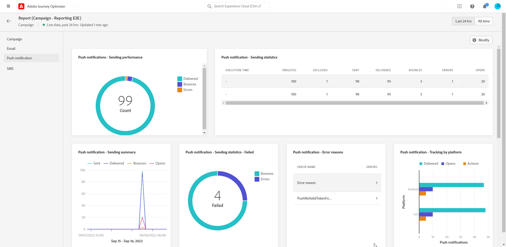

# Kampanjrapport {#campaign-live-report}

>[!CONTEXTUALHELP]
>id="ajo_campaign_live_report"
>title="Kampanjrapport"
>abstract="Med rapporten Campaign live kan ni i realtid mäta och visualisera effekten och resultatet av era kampanjer bara under de senaste 24 timmarna. Din rapport är uppdelad i olika widgetar som detaljerat beskriver kampanjens framgångar och fel. Varje rapportkontrollpanel kan ändras genom att widgetar storleksändras eller tas bort."

Kampanjens live-rapport kan nås direkt från kampanjen med **[!UICONTROL Live view]** -knappen.

Kampanjen **[!UICONTROL Live report]** visas med följande flikar:

* [Campaign](#campaign-live)
* [E-post](#email-live)
* [Push](#push-live)
* [SMS](#sms-live)
* [Webb](#web-tab)

Kampanjen **[!UICONTROL Live report]** är uppdelat i olika widgetar som detaljerat beskriver kampanjens framgångar och fel. Varje widget kan storleksändras och tas bort vid behov. Mer information finns i [section](../reports/live-report.md#modify-dashboard).

En detaljerad lista över alla mätvärden som är tillgängliga i Adobe Journey Optimizer finns på [den här sidan](live-report.md#list-of-components-live).

## Fliken Kampanj {#campaign-global}

### Leverans {#delivery-global}

The **[!UICONTROL Campaign Statistics]** widgetinformation om huvudinformationen i förhållande till kampanjen:

* **[!UICONTROL Entered profiles]**: Antal profiler som påbörjade resan.

<!--
### Experimentation tab (#experimentation-live)

From your Campaign **[!UICONTROL Live report]**, the **[!UICONTROL Experimentation]** tab details the main information relative to how each variant is performing and if there is was winner during the test.
-->

## Fliken E-post {#email-live}

Från er kampanj **[!UICONTROL Live report]**, **[!UICONTROL Email]** -fliken innehåller huvudinformationen om de e-postleveranser som skickas i kampanjen.

+++Läs mer om de olika mätvärden och widgetar som är tillgängliga för e-postrapporten.

The **[!UICONTROL Email Sending Statistics]** widgeten innehåller information om den viktigaste informationen i förhållande till ditt meddelande:

* **[!UICONTROL Delivered]**: Antal meddelanden som har skickats.

* **[!UICONTROL Bounces]**: Totalt antal fel som ackumulerats under leverans och automatisk returbearbetning.

* **[!UICONTROL Errors]**: Totalt antal fel som uppstod under en leverans och som förhindrar att den skickas till profiler.

The **[!UICONTROL Sending metrics by Email]** tabell och **[!UICONTROL Email Summary]** diagram visar hur framgångsrik leveransen är:

* **[!UICONTROL Sent]**: Totalt antal försändelser för leveransen.

* **[!UICONTROL Delivered]**: Antal meddelanden som har skickats.

* **[!UICONTROL Bounces]**: Totalt antal fel som ackumulerats under leverans och automatisk returbearbetning.

* **[!UICONTROL Errors]**: Totalt antal fel som uppstod under en leverans och som förhindrar att den skickas till profiler.

* **[!UICONTROL Opens]**: Antal gånger ett meddelande öppnades i en leverans.

* **[!UICONTROL Clicks]**: Antal gånger som ett innehåll klickades i en leverans.

* **[!UICONTROL Unsubscribe]**: Antal klick på länken för att avbryta prenumerationen.

* **[!UICONTROL Spam complaints]**: Antal gånger ett meddelande har deklarerats som skräppost eller skräppost.

The **[!UICONTROL Bounce Reasons]**, **[!UICONTROL Bounce categories]** och **[!UICONTROL Hard and bounce - by Email]** widgetar innehåller tillgängliga data som är relaterade till studsade meddelanden, som:

* **[!UICONTROL Hard bounce]**: Det totala antalet permanenta fel, t.ex. fel e-postadress. Detta inbegriper ett felmeddelande som uttryckligen anger att adressen är ogiltig, till exempel Okänd användare.

* **[!UICONTROL Soft bounce]**: Det totala antalet tillfälliga fel, t.ex. en fullständig inkorg.

* **[!UICONTROL Ignored]**: Det totala antalet tillfälliga, t.ex. frånvaro, eller ett tekniskt fel, t.ex. om avsändartypen är postmaster.

The **[!UICONTROL Error Reasons]** och **[!UICONTROL Exclude Reasons]** Med diagram och tabeller kan du se vilka fel och undantag som inträffade under leveransen.

The **[!UICONTROL Email - Top recipient domain]** diagram och tabeller visar vilka domäner som är de mest använda av mottagarna för att öppna e-postmeddelandet.
+++

## Fliken Push-meddelanden {#push-live}

Från er kampanj **[!UICONTROL Live report]**, **[!UICONTROL Push notification]** -fliken innehåller huvudinformationen i förhållande till push-leveranser som skickas i kampanjen.

+++Läs mer om de olika mätvärden och widgetar som finns för rapporten Push.

**[!UICONTROL Push notification sending performance]**, **[!UICONTROL Push notification summary]** och **[!UICONTROL Sending metrics - by Push]** widgetar anger huvudinformationen i förhållande till meddelandet:

* **[!UICONTROL Sent]**: Totalt antal försändelser för leveransen.

* **[!UICONTROL Delivered]**: Antal meddelanden som har skickats.

* **[!UICONTROL Bounces]**: Totalt antal fel som ackumulerats under leverans och automatisk returbearbetning.

* **[!UICONTROL Errors]**: Totalt antal fel som uppstod under en leverans och som förhindrar att den skickas till profiler.

* **[!UICONTROL Opens]**: Antal gånger ett meddelande öppnades i en leverans.

* **[!UICONTROL Actions]**: Totalt antal åtgärder för push-meddelandet som levererats, t.ex. knappklickning eller avbruten.

* **[!UICONTROL Engagements]**: Totalt antal öppningar och åtgärder för det här push-meddelandet, dvs om profilen öppnade push-meddelandet eller om någon klickade på en knapp.

The **[!UICONTROL Error Reasons]** och **[!UICONTROL Exclude Reasons]** Med diagram och tabeller kan du se vilka fel och undantag som inträffade under leveransen.

The **[!UICONTROL Sending statistics - Failed]** kan du se hur många fel och studsar som har inträffat.

The **[!UICONTROL Tracking by platform]**, **[!UICONTROL Sending by platform]** och **[!UICONTROL Breakdown by platform]** diagram och tabeller visar hur bra push-meddelandena är beroende på vilket operativsystem som används.
+++

## fliken SMS {#sms-live}

Från er kampanj **[!UICONTROL Live report]**, **[!UICONTROL SMS]** -fliken innehåller huvudinformationen om SMS-leveranser som skickas i kampanjen.

+++Läs mer om de olika mätvärden och widgetar som är tillgängliga för SMS-rapporten.

The **[!UICONTROL SMS - Statistics]** tabellen visar hur framgångsrik leveransen är:

* **[!UICONTROL Targeted]**: Antal användarprofiler som kvalificerar sig som målprofiler för den här leveransen.

* **[!UICONTROL Excluded]**: Antal användarprofiler, exkluderade från målprofilerna, som inte fick meddelandet.

* **[!UICONTROL Sent]**: Totalt antal försändelser för leveransen.

* **[!UICONTROL Delivered]**: Antal meddelanden som har skickats.

* **[!UICONTROL Bounces]**: Totalt antal fel som ackumulerats under leverans och automatisk returbearbetning.

* **[!UICONTROL Errors]**: Totalt antal fel som uppstod under en leverans och som förhindrar att den skickas till profiler.

* **[!UICONTROL Clicks]**: Totalt antal URL-besök.

The **[!UICONTROL SMS Performance by date]** widgeten visar huvudinformationen i förhållande till meddelandet med ett diagram:

* **[!UICONTROL Sent]**: Totalt antal försändelser för leveransen.

* **[!UICONTROL Delivered]**: Antal meddelanden som har skickats.

* **[!UICONTROL Bounces]**: Totalt antal fel som ackumulerats under leverans och automatisk returbearbetning.

* **[!UICONTROL Errors]**: Totalt antal fel som uppstod under en leverans och som förhindrar att den skickas till profiler.

The **[!UICONTROL Exclude Reasons]**, **[!UICONTROL Bounces Reasons]** och **[!UICONTROL Error Reasons]** Med diagram och tabeller kan du se vilka fel och undantag som inträffade under leveransen.
+++

## Fliken Webb {#web-tab}

Från er kampanj **[!UICONTROL Global report]**, **[!UICONTROL Web]** -fliken anger huvudinformationen för dina webbsidor.

+++Läs mer om de olika mätvärden och widgetar som finns för webbrapporten.

The **[!UICONTROL Web performance]** Nyckeltal anger den viktigaste informationen i relation till besökarnas engagemang i era webbupplevelser, till exempel:

* **[!UICONTROL Unique impressions]**: antal unika användare som webbupplevelsen levererades till.

* **[!UICONTROL Impressions]**: det totala antalet webbupplevelser som levereras till alla användare.

* **[!UICONTROL Clicks]**: totalt antal URL-besök.

The **[!UICONTROL Web summary]** diagram visar hur webbupplevelserna har utvecklats (visningar, unika intryck och klickningar) under den aktuella perioden.

The **[!UICONTROL Clicks by element]** tabellen innehåller huvudinformationen om besökarnas engagemang för de olika elementen på webbsidorna.
+++

## Ytterligare resurser

* [Kom igång med kampanjer](../campaigns/get-started-with-campaigns.md)
* [Skapa en kampanj](../campaigns/create-campaign.md)
* [Skapa API-utlösta kampanjer](../campaigns/api-triggered-campaigns.md)
* [Ändra eller stoppa en kampanj](../campaigns/modify-stop-campaign.md)
* [Global kampanjrapport](campaign-global-report.md)
