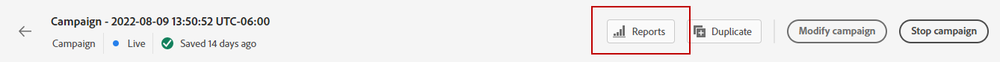

# Kampanjrapport {#campaign-live-report}

Kampanjens live-rapport kan nås direkt från kampanjen med **[!UICONTROL Reports]** -knappen.

När du har valt **[!UICONTROL Last 24hrs]** -fliken, Campaign **[!UICONTROL Live report]** visas med följande flikar:

* [Campaign](#campaign-live)
* [E-post](#email-live)
* [Push](#push-live)

Kampanjen **[!UICONTROL Live report]** är uppdelat i olika widgetar som detaljerat beskriver kampanjens framgångar och fel. Varje widget kan storleksändras och tas bort vid behov. Mer information finns i [section](../reports/live-report.md#modify-dashboard).

## Fliken Kampanj {#campaign-global}

### Leverans {#delivery-global}

The **[!UICONTROL Campaign Statistics]** widgetinformation om huvudinformationen i förhållande till kampanjen:

* **[!UICONTROL Entered profiles]**: Antal profiler som påbörjade resan.

<!--
### Experimentation tab (#experimentation-live)

From your Campaign **[!UICONTROL Live report]**, the **[!UICONTROL Experimentation]** tab details the main information relative to how each variant is performing and if there is was winner during the test.
-->
## Fliken E-post {#email-live}

Från er kampanj **[!UICONTROL Live report]**, **[!UICONTROL Email]** -fliken innehåller huvudinformationen om de e-postleveranser som skickas i kampanjen.

The **[!UICONTROL Email Sending Statistics]** widgeten innehåller information om den viktigaste informationen i förhållande till ditt meddelande:

* **[!UICONTROL Delivered]**: Antal meddelanden som har skickats, i relation till det totala antalet skickade meddelanden.

* **[!UICONTROL Bounces]**: Totalt antal fel som sammanställts under leverans och automatisk returbehandling i relation till totalt antal skickade meddelanden.

* **[!UICONTROL Errors]**: Totalt antal fel som uppstod under en leverans och som förhindrar att den skickas till profiler.

The **[!UICONTROL Sending metrics by Email]** tabell och **[!UICONTROL Email Summary]** diagram visar hur framgångsrik leveransen är:

* **[!UICONTROL Sent]**: Totalt antal försändelser för leveransen.

* **[!UICONTROL Delivered]**: Antal meddelanden som har skickats, i relation till det totala antalet skickade meddelanden.

* **[!UICONTROL Bounces]**: Totalt antal fel som sammanställts under leverans och automatisk returbehandling i relation till totalt antal skickade meddelanden.

* **[!UICONTROL Errors]**: Totalt antal fel som uppstod under en leverans och som förhindrar att den skickas till profiler.

* **[!UICONTROL Opens]**: Antal gånger ett meddelande öppnades i en leverans.

* **[!UICONTROL Clicks]**: Antal gånger som ett innehåll klickades i en leverans.

* **[!UICONTROL Unsubscribe]**: Antal klick på länken för att avbryta prenumerationen.

* **[!UICONTROL Spam complaints]**: Antal gånger ett meddelande har deklarerats som skräppost eller skräppost.

The **[!UICONTROL Bounce Reasons]**, **[!UICONTROL Bounce categories]** och **[!UICONTROL Hard and bounce - by Email]** widgetar innehåller tillgängliga data som är relaterade till studsade meddelanden, som:

* **[!UICONTROL Hard bounce]**: Det totala antalet permanenta fel, t.ex. fel e-postadress. Detta inbegriper ett felmeddelande som uttryckligen anger att adressen är ogiltig, till exempel Okänd användare.

* **[!UICONTROL Soft bounce]**: Det totala antalet tillfälliga fel, t.ex. en fullständig inkorg.

* **[!UICONTROL Ignored]**: Det totala antalet tillfälliga, t.ex. frånvaro, eller ett tekniskt fel, t.ex. om avsändartypen är postmaster.

The **[!UICONTROL Error Reasons]** och **[!UICONTROL Exclude Reasons]** Med diagram och tabeller kan du se vilka fel och undantag som inträffade under leveransen.

The **[!UICONTROL Email - Top recipient domain]** diagram och tabeller visar vilka domäner som är de mest använda av mottagarna för att öppna e-postmeddelandet.

## Push-flik {#push-live}

Från er kampanj **[!UICONTROL Live report]**, **[!UICONTROL Push]** -fliken innehåller huvudinformationen i förhållande till push-leveranser som skickas i kampanjen.

**[!UICONTROL Push notification sending performance]**, **[!UICONTROL Push notification summary]** och **[!UICONTROL Sending metrics - by Push]** widgetar anger huvudinformationen i förhållande till meddelandet:

* **[!UICONTROL Sent]**: Totalt antal försändelser för leveransen.

* **[!UICONTROL Delivered]**: Antal meddelanden som har skickats, i relation till det totala antalet skickade meddelanden.

* **[!UICONTROL Bounces]**: Totalt antal fel som sammanställts under leverans och automatisk returbehandling i relation till totalt antal skickade meddelanden.

* **[!UICONTROL Errors]**: Totalt antal fel som uppstod under en leverans och som förhindrar att den skickas till profiler.

* **[!UICONTROL Opens]**: Antal gånger ett meddelande öppnades i en leverans.

* **[!UICONTROL Actions]**: Totalt antal åtgärder för push-meddelandet som levererats, t.ex. knappklickning eller avbruten.

* **[!UICONTROL Engagements]**: Totalt antal öppningar och åtgärder för det här push-meddelandet, dvs om profilen öppnade push-meddelandet eller om någon klickade på en knapp.

The **[!UICONTROL Error Reasons]** och **[!UICONTROL Exclude Reasons]** Med diagram och tabeller kan du se vilka fel och undantag som inträffade under leveransen.

The **[!UICONTROL Sending statistics - Failed]** kan du se hur många fel och studsar som har inträffat.

The **[!UICONTROL Tracking by platform]**, **[!UICONTROL Sending by platform]** och **[!UICONTROL Breakdown by platform]** diagram och tabeller visar hur bra push-meddelandena är beroende på vilket operativsystem som används.
