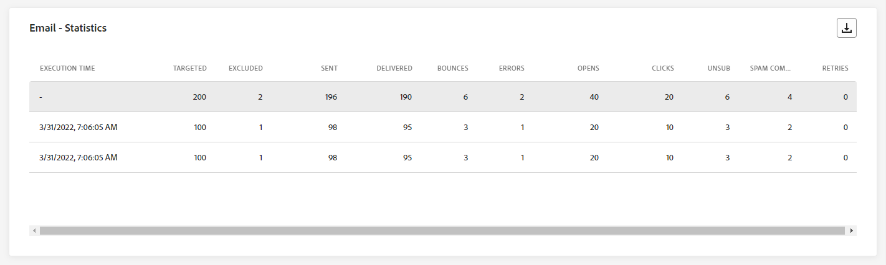
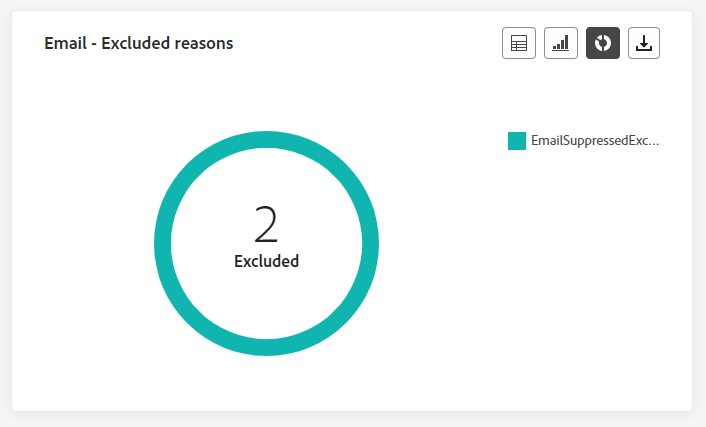
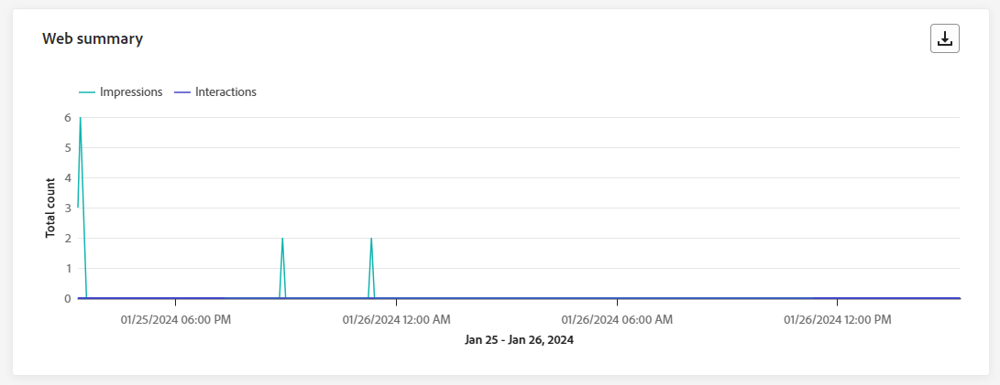
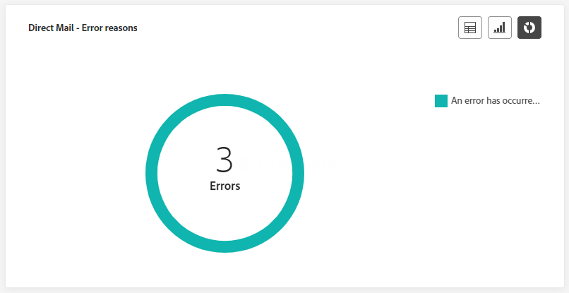

# Kampanjrapport {#campaign-live-report}

>[!CONTEXTUALHELP]
>id="ajo_campaign_live_report"
>title="Kampanjrapport"
>abstract="Med rapporten Campaign live kan ni i realtid mäta och visualisera effekten och resultatet av era kampanjer bara under de senaste 24 timmarna. Din rapport är uppdelad i olika widgetar som detaljerat beskriver kampanjens framgångar och fel. Varje rapportkontrollpanel kan ändras genom att widgetar storleksändras eller tas bort."

Live-rapporter, som du kommer åt från fliken Senaste 24 timmarna, visar händelser som har inträffat under de senaste 24 timmarna, med ett tidsintervall på minst två minuter från händelseförekomsten. Som jämförelse rapporterar Customer Journey Analytics fokus på händelser som inträffade för minst två timmar sedan och täcker händelser under en viss tidsperiod.

Du kan komma åt den aktiva kampanjrapporten direkt från din kampanj genom att klicka på knappen **[!UICONTROL Reports]** och sedan välja **[!UICONTROL View last 24hrs report]**.

Sidan Campaign **[!UICONTROL Live report]** visas med följande flikar:

* [Campaign](#campaign-live)
* [E-post](#email-live)
* [I appen](#inapp-live)
* [Push](#push-live)
* [SMS](#sms-live)
* [Webb](#web-tab)
* [Direktmeddelande](#direct-mail-tab)

>[!AVAILABILITY]
>Samordnade kampanjer har endast stöd för kanalerna SMS, Email och Push. Andra kanaler (i appen, på webben, via direktreklam osv.) är inte tillgängliga i samordnade kampanjer och visas inte i rapporteringen.

Campaign **[!UICONTROL Live report]** är uppdelad i olika widgetar som beskriver kampanjens framgångar och fel. Varje widget kan storleksändras och tas bort vid behov. Mer information finns i [avsnittet](../reports/live-report.md#modify-dashboard).

En detaljerad lista över alla mätvärden som är tillgängliga i Adobe Journey Optimizer finns på [den här sidan](live-report.md#live-report).

## Fliken Kampanj {#campaign-live}

### Leverans {#delivery-live}

KPI:erna för **[!UICONTROL Campaign's Statistics]** fungerar som en omfattande instrumentpanel med en detaljerad beskrivning av nyckeltal från de senaste 24 timmarna för din kampanj. Detta inkluderar viktig information som antalet profiler och de åtgärder som utförts, vilket ger en grundlig förståelse för kampanjens resultat och engagemang.

+++ Läs mer om statistik för Campaign

* **[!UICONTROL Audience]**: Antal målprofiler.

* **[!UICONTROL Actions delivered]**: Totalt antal unika gånger en åtgärd har levererats.

* **[!UICONTROL Errors]**: Totalt antal fel som uppstod under sändningsprocessen och som förhindrar att den skickas till profiler.

+++

<!--
### Experimentation tab (#experimentation-live)

From your Campaign **[!UICONTROL Live report]**, the **[!UICONTROL Experimentation]** tab details the main information relative to how each variant is performing and if there is was winner during the test.
-->

## Fliken E-post {#email-live}

Från din kampanj **[!UICONTROL Live report]** anger fliken **[!UICONTROL Email]** huvudinformationen i relation till e-postmeddelandet som skickas i kampanjen.

### E-post - Sändande prestanda {#email-sending-performance}

>[!CONTEXTUALHELP]
>id="ajo_campaign_live_email_sending_statistics"
>title="E-post - Sändande statistik"
>abstract="Diagrammet E-post - Skicka statistik sammanfattar viktiga data om din e-post, som Målinriktad eller Levererad under de senaste 24 timmarna."

**[!UICONTROL Email - Sending Performance]** erbjuder en detaljerad översikt över data relaterade till e-postmeddelanden som skickats de senaste 24 timmarna. Den ger insikter i viktiga mätvärden som levererade och studsade, vilket möjliggör en detaljerad granskning av e-postsändningsprocessen.

+++ Läs mer om prestandamått för e-postsändning

* **[!UICONTROL Delivered]**: Antal e-postmeddelanden som har skickats.

* **[!UICONTROL Bounces]**: Totalt antal fel som ackumulerats under sändningsprocessen och automatisk returbearbetning.

* **[!UICONTROL Retries]**: Antal e-postmeddelanden i kön för nya försök.

* **[!UICONTROL Errors]**: Totalt antal fel som uppstod under sändningsprocessen och som förhindrar att den skickas till profiler.
+++

### E-post - statistik

>[!CONTEXTUALHELP]
>id="ajo_campaign_live_email_statistics"
>title="E-post - statistik"
>abstract="Registret E-post - statistik innehåller data om profilaktivitet för din e-post de senaste 24 timmarna."

Tabellen **[!UICONTROL Sending metrics by Email]** innehåller en omfattande sammanfattning av data från de senaste 24 timmarna. Den sammanfattar viktiga mätvärden, inklusive målgruppens storlek och antalet lyckade e-postmeddelanden. Detta ger värdefulla insikter om hur effektiva och relevanta era e-postkampanjer är.

+++ Läs mer om e-post - statistik

* **[!UICONTROL Execution time]**: Starttid för varje körning av ditt återkommande e-postmeddelande. Om du bara vill ange ett eller flera återkommande e-postmeddelanden som mål väljer du det i listrutan **[!UICONTROL Execution time]**.

* **[!UICONTROL Targeted]**: Totalt antal meddelanden som bearbetats under sändningsprocessen.

* **[!UICONTROL Excluded]**: Antal användarprofiler, exkluderade från målprofilerna, som inte fick meddelandet.

* **[!UICONTROL Sent]**: Totalt antal skickade meddelanden.

* **[!UICONTROL Delivered]**: Antal meddelanden som har skickats.

* **[!UICONTROL Bounces]**: Totalt antal fel som ackumulerats under sändningsprocessen och automatisk returbearbetning.

* **[!UICONTROL Errors]**: Totalt antal fel som uppstod under sändningsprocessen och som förhindrar att den skickas till profiler.

* **[!UICONTROL Opens]**: Antal gånger ett meddelande öppnades.

* **[!UICONTROL Clicks]**: Antal gånger som användaren klickade på ett innehåll.

* **[!UICONTROL Unsubscribe]**: Antal klick på länken för att avbryta prenumerationen.

* **[!UICONTROL Spam complaints]**: Antal gånger ett meddelande har deklarerats som skräppost eller skräppost.

* **[!UICONTROL Retries]**: Antal e-postmeddelanden i kön för nya försök.
+++

### E-post - studskategorier och orsaker {#bounce-categories}

>[!CONTEXTUALHELP]
>id="ajo_campaign_live_email_bounce_categories"
>title="E-post - studskategorier"
>abstract="Diagram och tabell för kategorierna E-post - studsa ger data om både tillfälliga och permanenta fel från de senaste 24 timmarna."

>[!CONTEXTUALHELP]
>id="ajo_campaign_live_email_bounce_reasons"
>title="E-post - studsar orsaker"
>abstract="E-post - studsar orsaksdiagram och tabell innehåller tillgängliga data som relaterar till studsade meddelanden från de senaste 24 timmarna."

Widgetarna **[!UICONTROL Bounce reasons]** och **[!UICONTROL Bounce categories]** kompilerar tillgängliga data från de senaste 24 timmarna som är relaterade till studsade meddelanden, och ger detaljerade insikter om de specifika orsakerna och kategorierna bakom e-poststudenterna.

Mer information om studsar finns på sidan [Suppressionslista](../reports/suppression-list.md).

+++ Läs mer om e-post - studskategorier och orsaker

* **[!UICONTROL Hard bounce]**: Det totala antalet permanenta fel, till exempel en felaktig e-postadress. Detta inbegriper ett felmeddelande som uttryckligen anger att adressen är ogiltig, till exempel Okänd användare.

* **[!UICONTROL Soft bounce]**: Det totala antalet tillfälliga fel, till exempel en fullständig inkorg.

* **[!UICONTROL Ignored]**: Det totala antalet tillfälliga, till exempel frånvaro, eller ett tekniskt fel, till exempel om avsändartypen är postmaster.

+++

### E-post - Prestanda efter datum {#email-performance-date}

>[!CONTEXTUALHELP]
>id="ajo_campaign_live_email_performance_bydate"
>title="E-post - Prestanda efter datum"
>abstract="Diagrammet E-post - prestation efter datum visar omfattande data från de senaste 24 timmarna när det gäller skickade e-postmeddelanden och ger insikter i viktiga mätvärden som levererade och studsade, vilket möjliggör en detaljerad analys av e-postsändningsprocessen."

Widgeten **[!UICONTROL Email - Performance by date]** ger en detaljerad översikt över viktig information som rör dina meddelanden, som presenteras i ett diagram, och ger insikter om prestandatrender under de senaste 24 timmarna.

+++ Läs mer om e-post - Mätning av prestanda efter datum och orsaker

* **[!UICONTROL Sent]**: Totalt antal skickade meddelanden.

* **[!UICONTROL Delivered]**: Antal meddelanden som har skickats.

* **[!UICONTROL Bounces]**: Totalt antal fel som ackumulerats under sändningsprocessen och automatisk returbearbetning.

* **[!UICONTROL Errors]**: Totalt antal fel som uppstod under sändningsprocessen och som förhindrar att den skickas till profiler.

* **[!UICONTROL Opens]**: Antal gånger ett meddelande öppnades.

* **[!UICONTROL Clicks]**: Antal gånger som användaren klickade på ett innehåll.

* **[!UICONTROL Unsubscriptions]**: Antal klick på länken för att avbryta prenumerationen.

* **[!UICONTROL Spam complaints]**: Antal gånger ett meddelande har deklarerats som skräppost eller skräppost.

+++

### Felorsaker {#email-error-reasons}

>[!CONTEXTUALHELP]
>id="ajo_campaign_live_email_error_reasons"
>title="E-post - felorsaker"
>abstract="Med diagrammen E-post - felorsaker och tabellen kan du identifiera de specifika fel som uppstod under sändningsprocessen de senaste 24 timmarna."

Diagram och tabeller från **[!UICONTROL Error Reasons]** ger insikt i de specifika fel som uppstod under sändningsprocessen de senaste 24 timmarna. Denna information är värdefull för att förstå felens art och frekvens.

### Undantagna orsaker {#email-exclude-reasons}

>[!CONTEXTUALHELP]
>id="ajo_campaign_live_email_excluded_reasons"
>title="E-post - orsaker som inte tas med"
>abstract="I diagrammen och tabellen Exkluderade orsaker visas de olika faktorer som ledde till att användarprofiler exkluderades från målgruppen och inte fick meddelandet under de senaste 24 timmarna."

Diagrammen och tabellen **[!UICONTROL Excluded Reasons]** har ett omfattande perspektiv på de olika faktorer som har lett till att användarprofiler har tagits bort från målgruppen de senaste 24 timmarna.

Se [den här sidan](exclusion-list.md) för en utförlig lista över orsaker till undantag.

### E-post - Bästa mottagardomän {#email-best-recipient}

>[!CONTEXTUALHELP]
>id="ajo_campaign_live_email_best_recipient"
>title="E-post - Bästa mottagardomän"
>abstract="Diagrammet E-post - Bästa mottagardomän och tabellen ger en detaljerad beskrivning av de domäner som mottagarna oftast använder för att öppna e-postmeddelandet, och ger värdefulla insikter om mottagarnas beteende de senaste 24 timmarna."

Diagrammet och tabellen **[!UICONTROL Email - Best recipient domain]** innehåller en detaljerad beskrivning av de domäner som används mest av profiler för att öppna e-postmeddelanden de senaste 24 timmarna. Detta ger värdefulla insikter om profilbeteendet och hjälper er att förstå vilka plattformar ni föredrar.

### E-posterbjudanden {#email-offers}

>[!NOTE]
>
>Widgetarna och mätvärdena för erbjudanden är bara tillgängliga om ett beslut har infogats i ett e-postmeddelande. Mer information om beslutshantering finns på [sidan](../offers/get-started/starting-offer-decisioning.md).

Widgetarna **[!UICONTROL Offers statistic]** och **[!UICONTROL Offers statistics over time]** mäter hur väl erbjudandet lyckats och påverkat målgruppen. Den innehåller detaljerad huvudinformation om meddelandet med KPI:er.

+++ Läs mer om e-post - ger mätvärden

* **[!UICONTROL Offer sent]**: Totalt antal utskick för erbjudandet.

* **[!UICONTROL Offer impression]**: Antal gånger som erbjudandet öppnades i dina e-postmeddelanden.

* **[!UICONTROL Offer clicks]**: Antal gånger som ett erbjudande klickades på i dina e-postmeddelanden.

+++

## Fliken I appen {#inapp-live}

Från din kampanj **[!UICONTROL Live report]** anger fliken **[!UICONTROL In-app]** huvudinformationen i förhållande till de meddelanden i appen som skickas i din kampanj.

### Prestanda i appen {#inapp-performance}

>[!CONTEXTUALHELP]
>id="ajo_campaign_live_inapp_performance"
>title="Prestanda i appen"
>abstract="KPI:erna för prestanda i appen ger viktiga insikter i besökarnas engagemang med meddelanden i appen de senaste 24 timmarna."

KPI:erna för **[!UICONTROL In-app performance]** ger viktiga insikter i hur era profiler interagerar med meddelanden i appen de senaste 24 timmarna, vilket ger viktiga mätvärden för att utvärdera effektiviteten och effekten av era kampanjer i appen.

+++ Läs mer om prestandamätningar i appen

* **[!UICONTROL Impressions]**: Totalt antal meddelanden i appen som skickats till alla användare.

* **[!UICONTROL Interactions]**: Totalt antal ärenden för meddelandet i appen. Detta inkluderar alla åtgärder som användaren utför, t.ex. klickningar, uppsägningar eller annan interaktion.

+++

### Sammanfattning i appen {#inapp-summary}

>[!CONTEXTUALHELP]
>id="ajo_campaign_live_inapp_summary"
>title="Sammanfattning i appen"
>abstract="I sammanfattningsdiagrammet i appen visas utvecklingen av dina visningar och interaktioner i appen under de senaste 24 timmarna."

Diagrammet **[!UICONTROL In-app summary]** visar utvecklingen av dina visningar och interaktioner i appen de senaste 24 timmarna, vilket ger en omfattande översikt över hur dina meddelanden i appen fungerar.

+++ Läs mer om sammanfattningsstatistik i appar

* **[!UICONTROL Impressions]**: Totalt antal meddelanden i appen som har levererats till alla användare.

* **[!UICONTROL Interactions]**: Totalt antal ärenden för meddelandet i appen. Detta inkluderar alla åtgärder som användaren utför, t.ex. klickningar, uppsägningar eller annan interaktion.

+++

### Interaktioner per typ {#inapp-interactions}

>[!CONTEXTUALHELP]
>id="ajo_campaign_live_inapp_interactions"
>title="Interaktioner per typ"
>abstract="Interaktionen per typ av diagram och tabell visar hur användarna interagerade med meddelandet i appen genom att spåra varje klick, avbruten eller interaktion de senaste 24 timmarna."

Diagrammen och tabellen **[!UICONTROL Interactions by type]** innehåller en detaljerad beskrivning av hur profilerna interagerade med meddelandet i appen under de senaste 24 timmarna, spårningsåtgärder som klickningar, uppsägningar eller andra former av engagemang.

## Fliken Push-meddelanden {#push-live}

Från din kampanj **[!UICONTROL Live report]** anger fliken **[!UICONTROL Push notification]** huvudinformationen i relation till push-meddelandet som skickas i din kampanj.

### Push-meddelande - Sändande prestanda {#push-sending-performance}

>[!CONTEXTUALHELP]
>id="ajo_campaign_live_push_sending_performance"
>title="Push-meddelande - Sändande prestanda"
>abstract="Prestandadiagrammet för push-meddelandesändning sammanfattar viktiga data om ditt push-meddelande, till exempel fel eller levererade meddelanden från de senaste 24 timmarna."

Diagrammet **[!UICONTROL Push notification sending performance]** ger en grundlig översikt över data relaterade till push-meddelanden som skickats de senaste 24 timmarna. Den ger insikter i viktiga mätvärden som levererade och studsade, vilket möjliggör en detaljerad granskning av sändningsprocessen för push-meddelanden.

+++ Läs mer om push-meddelanden - Skicka prestandamått

* **[!UICONTROL Delivered]**: Antal meddelanden som har skickats.

* **[!UICONTROL Bounces]**: Totalt antal fel som ackumulerats under sändningsprocessen och automatisk returbearbetning.

* **[!UICONTROL Errors]**: Totalt antal fel som uppstod under sändningsprocessen och som förhindrar att den skickas till profiler.

+++

### Push-meddelande - statistik {#push-statistics}

>[!CONTEXTUALHELP]
>id="ajo_campaign_live_push_statistics"
>title="Push-meddelande - statistik"
>abstract="Tabellen Push-statistik innehåller data om mottagaraktivitet för ditt push-meddelande från de senaste 24 timmarna."

Tabellen **[!UICONTROL Push notification - Statistics]** innehåller en kortfattad sammanfattning av viktiga data relaterade till dina push-meddelanden under de senaste 24 timmarna, inklusive nyckelmått som antalet riktade meddelanden och antalet meddelanden som levererats.

+++ Läs mer om push-meddelanden - statistik

* **[!UICONTROL Execution time]**: Starttid för varje körning av ditt återkommande push-meddelande. Om du bara vill ange ett eller flera återkommande push-meddelanden som mål väljer du det i listrutan **[!UICONTROL Execution time]**.

* **[!UICONTROL Targeted]**: Totalt antal meddelanden som bearbetats under sändningsprocessen.

* **[!UICONTROL Excluded]**: Antal användarprofiler, exkluderade från målprofilerna, som inte fick meddelandet.

* **[!UICONTROL Sent]**: Totalt antal skickade meddelanden.

* **[!UICONTROL Delivered]**: Antal meddelanden som har skickats.

* **[!UICONTROL Bounces]**: Totalt antal fel som ackumulerats under sändningsprocessen och automatisk returbearbetning.

* **[!UICONTROL Errors]**: Totalt antal fel som uppstod under sändningsprocessen och som förhindrar att den skickas till profiler.

* **[!UICONTROL Opens]**: Antal gånger ett meddelande öppnades.

+++

### Push-meddelande - Skickar sammanfattning {#push-sending-summary}

>[!CONTEXTUALHELP]
>id="ajo_campaign_live_push_sending_summary"
>title="Push-meddelande - Skickar sammanfattning"
>abstract="I diagrammet Översikt över sändning av push-meddelanden visas tillgängliga data för skickade push-meddelanden från de senaste 24 timmarna."

Diagrammet **[!UICONTROL Push notification - Statistics]** erbjuder en dynamisk representation som visar en analys av din push-meddelandeaktivitet under de senaste 24 timmarna. Denna grafiska representation ger en omfattande beskrivning av skickade push-meddelanden.

+++ Läs mer om push-meddelanden - Skicka sammanfattningsmått

* **[!UICONTROL Opens]**: Antal gånger ditt push-meddelande öppnades.

* **[!UICONTROL Actions]**: Totalt antal åtgärder för det skickade push-meddelandet, t.ex. knappklickning eller avbruten.

* **[!UICONTROL Bounces]**: Totalt antal kumulerade fel och automatisk returbearbetning i relation till totalt antal skickade meddelanden.

* **[!UICONTROL Delivered]**: Antal meddelanden som har skickats, i relation till det totala antalet skickade meddelanden.

* **[!UICONTROL Errors]**: Totalt antal fel som har inträffat som förhindrar att den skickas till profiler.

+++

### Push-meddelande - Undantagna orsaker {#push-excluded}

>[!CONTEXTUALHELP]
>id="ajo_campaign_live_push_excluded_reasons"
>title="Push-meddelande - Undantagna orsaker"
>abstract="I diagrammen och tabellen Exkluderade orsaker visas de olika faktorer som ledde till att användarprofiler exkluderades från målgruppen och inte fick meddelandet under de senaste 24 timmarna."

Diagrammen och tabellen **[!UICONTROL Excluded Reasons]** visar olika orsaker som hindrade användarprofiler, exkluderade från målprofilerna, från att ta emot push-meddelanden de senaste 24 timmarna.

Se [den här sidan](exclusion-list.md) för en utförlig lista över orsaker till undantag.

### Push-meddelande - felorsaker {#push-error}

>[!CONTEXTUALHELP]
>id="ajo_campaign_live_push_error_reasons"
>title="Push-meddelande - felorsaker"
>abstract="Med diagrammen och tabellen Felorsaker kan du identifiera de specifika fel som inträffade de senaste 24 timmarna under sändningsprocessen."

Tabellen och diagrammen **[!UICONTROL Error Reasons]** ger dig möjlighet att identifiera de specifika fel som uppstod under sändningsprocessen för dina push-meddelanden inom de senaste 24 timmarna, med detaljerade insikter om eventuella problem som påträffats längs vägen.

### Push-meddelande - uppdelning efter plattform {#push-breakdown-platform}

>[!CONTEXTUALHELP]
>id="ajo_campaign_live_push_breakdown_platform"
>title="Push-meddelande - uppdelning efter plattform"
>abstract="Diagram och tabell över uppdelningar per plattform visar hur väl push-meddelandena lyckades under de senaste 24 timmarna baserat på mottagarens operativsystem."

Diagrammet och tabellen **[!UICONTROL Push notification - Breakdown by platform]** innehåller en detaljerad analys av om dina push-meddelanden har lyckats de senaste 24 timmarna, och ger insikter baserat på din profils operativsystem. Den här nedbrytningen ger en bättre förståelse för hur bra dina push-meddelanden fungerar på olika plattformar.

+++ Läs mer om push-meddelanden - Uppdelning efter plattformsmått

* **[!UICONTROL Targeted]**: Totalt antal meddelanden som bearbetats under analysen.

* **[!UICONTROL Delivered]**: Antal meddelanden som har skickats, i relation till det totala antalet skickade meddelanden.

* **[!UICONTROL Opens]**: Antal gånger ditt push-meddelande öppnades.

* **[!UICONTROL Actions]**: Totalt antal åtgärder för det skickade push-meddelandet, t.ex. knappklickning eller avbruten.

* **[!UICONTROL Bounces]**: Totalt antal kumulerade fel och automatisk returbearbetning i relation till totalt antal skickade meddelanden.

* **[!UICONTROL Errors]**: Totalt antal fel som har inträffat som förhindrar att den skickas till profiler.

* **[!UICONTROL Excluded]**: Antal profiler som har undantagits av Adobe Journey Optimizer.

+++

## fliken SMS {#sms-live}

Från din kampanj **[!UICONTROL Live report]** anger fliken **[!UICONTROL SMS]** huvudinformationen i relation till SMS-meddelandet som skickas i din kampanj.

### SMS - statistik {#sms-statistics}

>[!CONTEXTUALHELP]
>id="ajo_campaign_live_sms_statistics"
>title="SMS - statistik"
>abstract="Registret SMS Sending Statistics sammanfattar viktiga data om dina SMS-meddelanden som riktade eller levererade meddelanden från de senaste 24 timmarna."

Tabellen **[!UICONTROL SMS - Statistics]** innehåller en kortfattad sammanfattning av viktiga data relaterade till dina SMS-meddelanden under de senaste 24 timmarna. Den innehåller viktiga mått som antalet målmeddelanden och antalet meddelanden som levererats.

+++ Läs mer om SMS - statistik

* **[!UICONTROL Execution time]**: Starttid för varje körning av ditt återkommande SMS-meddelande. Om du bara vill rikta in dig på ett eller flera återkommande SMS-meddelanden väljer du det i listrutan **[!UICONTROL Execution time]**.

* **[!UICONTROL Targeted]**: Antal användarprofiler som kvalificerar sig som målprofiler.

* **[!UICONTROL Excluded]**: Antal användarprofiler, exkluderade från målprofilerna, som inte fick meddelandet.

* **[!UICONTROL Sent]**: Totalt antal skickade meddelanden.

* **[!UICONTROL Bounces]**: Totalt antal fel som ackumulerats under sändningsprocessen och automatisk returbearbetning.

* **[!UICONTROL Errors]**: Totalt antal fel som uppstod under sändningsprocessen och som förhindrar att den skickas till profiler.

* **[!UICONTROL Clicks]**: Totalt antal URL-besök.

+++

### SMS - Prestanda per datum {#sms-perfomance-date}

>[!CONTEXTUALHELP]
>id="ajo_campaign_live_sms_performance"
>title="SMS - Prestanda per datum"
>abstract="Widgeten SMS Performance by Date (SMS-prestanda efter datum) innehåller viktig information om dina meddelanden under de senaste 24 timmarna via en grafisk representation."

Widgeten **[!UICONTROL SMS Performance by date]** ger en detaljerad översikt över viktig information som rör dina meddelanden, som presenteras i ett diagram, och ger insikter om prestandatrender under de senaste 24 timmarna.

+++ Läs mer om SMS - Prestanda efter datummått

* **[!UICONTROL Sent]**: Totalt antal skickade meddelanden.

* **[!UICONTROL Bounces]**: Totalt antal fel som ackumulerats under sändningsprocessen och automatisk returbearbetning.

* **[!UICONTROL Errors]**: Totalt antal fel som uppstod under sändningsprocessen och som förhindrar att den skickas till profiler.

+++

### SMS - Felorsaker {#sms-error-reasons}

>[!CONTEXTUALHELP]
>id="ajo_campaign_live_sms_error_reasons"
>title="SMS - Felorsaker"
>abstract="Med hjälp av diagram och tabeller för felorsaker kan du identifiera de specifika fel som uppstått under de senaste 24 timmarna under sändningsprocessen."

Med diagrammen och tabellen **[!UICONTROL Excluded Reasons]** kan du identifiera de specifika fel som uppstod under sändningsprocessen för SMS-meddelanden inom de senaste 24 timmarna, vilket gör det enklare att göra en grundlig analys av eventuella problem som uppstått.

### SMS - Undantagna orsaker {#sms-excluded-reasons}

>[!CONTEXTUALHELP]
>id="ajo_campaign_live_sms_excluded_reasons"
>title="SMS - Undantagna orsaker"
>abstract="I diagrammen och tabellen Exkluderade orsaker visas de olika faktorer som ledde till att användarprofiler exkluderades från målgruppen och inte fick meddelandet under de senaste 24 timmarna."

Diagrammen och tabellen **[!UICONTROL Excluded Reasons]** visar visuellt de olika faktorer som ledde till att användarprofiler exkluderades från målgruppen, vilket hindrade dem från att ta emot SMS-meddelanden de senaste 24 timmarna.

Se [den här sidan](exclusion-list.md) för en utförlig lista över orsaker till undantag.

### SMS - studsar orsaker {#sms-bounces-reasons}

>[!CONTEXTUALHELP]
>id="ajo_campaign_live_sms_bounces_reasons"
>title="SMS - studsar orsaker"
>abstract="Diagram och tabell över studentorsaker innehåller tillgängliga data från de senaste 24 timmarna för studsade meddelanden."

Diagrammen och tabellen **[!UICONTROL Bounces Reasons]** ger en omfattande översikt över data som är relaterade till studsade SMS-meddelanden och ger värdefulla insikter om de specifika orsakerna bakom instanserna av SMS-meddelandestudsar under de senaste 24 timmarna.

## Fliken Webb {#web-tab}

Från din kampanj **[!UICONTROL Live report]** anger fliken **[!UICONTROL Web]** huvudinformationen i förhållande till dina webbsidor.

### Webbprestanda {#web-performance}

>[!CONTEXTUALHELP]
>id="ajo_campaign_live_web_performance"
>title="Webbprestanda"
>abstract="KPI:erna för Web Performance ger omfattande information om besökarnas engagemang med dina webbupplevelser de senaste 24 timmarna."

KPI:erna för **[!UICONTROL Web performance]** ger omfattande insikter om besökarnas engagemang för dina webbsidor de senaste 24 timmarna, med nyckeltal som Impressions och Interactions.

+++ Läs mer om mätvärden för webbprestanda

* **[!UICONTROL Impressions]**: Totalt antal webbupplevelser som levereras till alla användare.

* **[!UICONTROL Interactions]**: totalt antal ärenden för din webbsida. Detta inkluderar alla åtgärder som användaren utför, t.ex. klickningar eller andra interaktioner.

+++ 

### Webbsammanfattning {#web-summary}

>[!CONTEXTUALHELP]
>id="ajo_campaign_live_web_summary"
>title="Webbsammanfattning"
>abstract="I webbsammanfattningsdiagrammet visas hur webbupplevelserna har utvecklats, inklusive visningar, unika intryck och interaktioner från de senaste 24 timmarna."

Diagrammet **[!UICONTROL Web summary]** visar hur dina webbupplevelser har utvecklats (visningar, unika visningar och interaktioner) under de senaste 24 timmarna.

+++ Läs mer om webbsammanfattningsstatistik

* **[!UICONTROL Impressions]**: Totalt antal webbupplevelser som levereras till alla användare.

* **[!UICONTROL Interactions]**: totalt antal ärenden för din webbsida. Detta inkluderar alla åtgärder som användaren utför, t.ex. klickningar eller andra interaktioner.

+++ 

### Interaktioner per element {#web-interactions}

>[!CONTEXTUALHELP]
>id="ajo_campaign_live_web_interactions"
>title="Interaktioner per element"
>abstract="Tabellen Interaktioner per element innehåller viktig information om besökarnas engagemang med olika element på webbsidorna de senaste 24 timmarna."

Tabellen **[!UICONTROL Interactions by element]** innehåller omfattande information om besökarnas engagemang för de olika elementen på dina webbsidor de senaste 24 timmarna, och ger värdefulla insikter om användarinteraktioner och -inställningar.

## Fliken Direktreklam {#direct-mail-tab}

Från din kampanj **[!UICONTROL Live report]** anger fliken **[!UICONTROL Direct mail]** huvudinformationen i förhållande till din direktpost.

### Direktreklam - skicka statistik {#direct-mail-sending}

>[!CONTEXTUALHELP]
>id="ajo_campaign_live_direct_sending_statistics"
>title="Direktreklam - skicka statistik"
>abstract="Registret Skicka direkt e-post - statistik sammanfattar viktiga data från de senaste 24 timmarna om dina Direct-e-postmeddelanden, som riktade eller levererade meddelanden."

Tabellen **[!UICONTROL Direct Mail - Sending statistics]** innehåller en kortfattad sammanfattning av viktiga data relaterade till dina Direct Mail-meddelanden. Den innehåller nyckeltal som antalet målmeddelanden och antalet lyckade meddelanden som levererats under de senaste 24 timmarna.

+++ Läs mer om Direct Mail - Sending Statistics metrics

* **[!UICONTROL Targeted]**: Antal användarprofiler som kvalificerar sig som målprofiler.

* **[!UICONTROL Sent]**: Totalt antal skickade meddelanden.

* **[!UICONTROL Errors]**: Totalt antal fel som uppstod under sändningsprocessen och som förhindrar att den skickas till profiler.

* **[!UICONTROL Excluded]**: Antal användarprofiler, exkluderade från målprofilerna, som inte fick ditt direktmeddelande.

+++

### Direktreklam - felorsaker {#direct-mail-error-reasons}

>[!CONTEXTUALHELP]
>id="ajo_campaign_live_direct_error_reasons"
>title="Direktreklam - felorsaker"
>abstract="Med diagrammen och tabellen Direktreklam - Felorsaker kan du identifiera de specifika fel som har uppstått under de senaste 24 timmarna."

Diagrammen och tabellen **[!UICONTROL Direct Mail - Error reasons]** ger möjlighet att identifiera specifika fel som uppstod under sändningsprocessen för dina direktutskick, vilket ger en detaljerad analys av eventuella problem som uppstått under de senaste 24 timmarna.

### Direktreklam - orsaker som inte ingår {#direct-mail-excluded-reasons}

>[!CONTEXTUALHELP]
>id="ajo_campaign_live_direct_excluded_reasons"
>title="Direktreklam - orsaker som inte ingår"
>abstract="Diagram och tabell över orsaker till varför direktreklam exkluderades visar de olika faktorer som ledde till användarprofiler, som uteslöts från målgruppen och inte fick meddelandet de senaste 24 timmarna."

Diagrammen och tabellen **[!UICONTROL Direct Mail - Excluded reasons]** illustrerar visuellt de olika faktorer som resulterade i att användarprofiler exkluderades från målgruppen, vilket förhindrar dem från att ta emot dina direktutskick de senaste 24 timmarna.

Se [den här sidan](exclusion-list.md) för en utförlig lista över orsaker till undantag.

## Ytterligare resurser

* [Kom igång med kampanjer](../campaigns/get-started-with-campaigns.md)
* [Skapa en kampanj](../campaigns/create-campaign.md)
* [Skapa API-utlösta kampanjer](../campaigns/api-triggered-campaigns.md)
* [Ändra eller stoppa en kampanj](../campaigns/manage-campaigns.md)
* [Kampanjrapport](campaign-global-report-cja.md)
