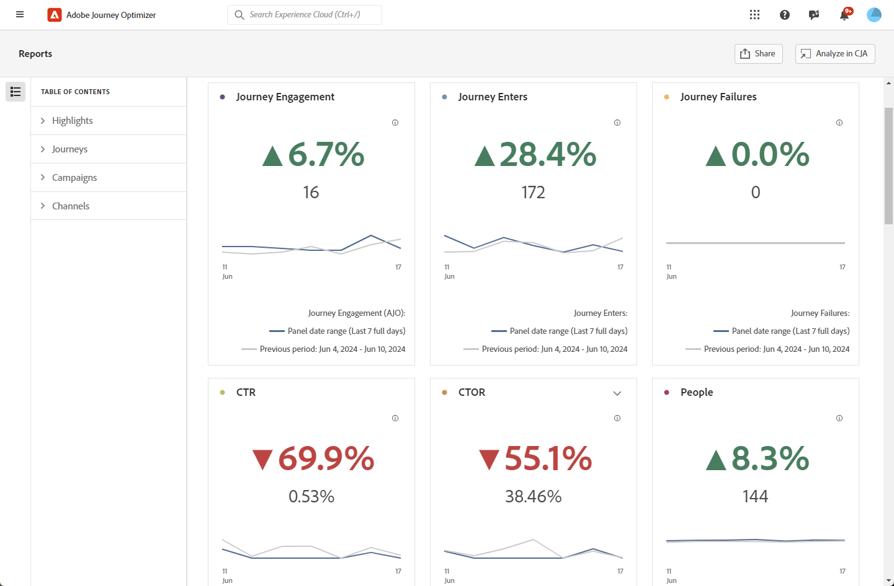
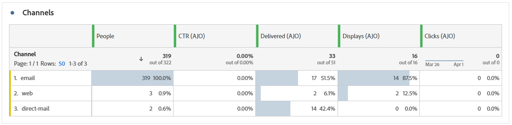

# Översiktsrapport {#channel-report-cja}

Översiktsrapporten ger användarna en detaljerad sammanfattning av trafik- och engagemangsmätningar för alla kampanjer och resor inom er miljö. Dessa mätvärden kombineras för att presentera enhetliga värden för åtgärder som kommer från olika kanaler, vilket omfattar olika kampanjer och resor.

Du kommer åt översiktsrapporten genom att gå till menyn **Rapporter** i avsnittet **Resehantering** .

Rapportsidan visas med följande flikar:

* [Resor](#journey)
* [Kampanjer](#campaign)
* [Kanaler](#channel)

Mer information om Customer Journey Analytics Workspace och hur du filtrerar och analyserar data finns på [den här sidan](https://experienceleague.adobe.com/sv/docs/analytics-platform/using/cja-workspace/home).

## Högdagrar {#highlights}

KPI:erna för **[!UICONTROL Highlights]** fungerar som en omfattande kontrollpanel med en detaljerad beskrivning av nyckeltal för alla kampanjer och resor i din miljö, så att du snabbt kan utvärdera prestanda och identifiera områden som ska förbättras.

+++ Läs mer om Highlights metrics

* **[!UICONTROL Journey engagement]**: Totalt antal unika personer som tagit emot meddelanden som skickats genom resan, vilket representerar distinkta profiler som nått en angiven åtgärdspunkt under resan.

* **[!UICONTROL Journey Enters]**: Totalt antal personer som har nått resans anmälningshändelse.

* **[!UICONTROL Journey Failures]**: Totalt antal enskilda resor som inte kördes korrekt.

* **[!UICONTROL Click through rate]**: Procentandel klick i dina meddelanden.

* **[!UICONTROL Click-through open rate (CTOR)]**: Antal gånger som meddelandet öppnades.

* **[!UICONTROL People]**: Antal användarprofiler som kvalificerar sig som målprofiler för dina meddelanden.

* **[!UICONTROL Clicks]**: Antal gånger som ett innehåll klickades på i dina meddelanden.

* **[!UICONTROL Spam complaints]**: Antal gånger ett meddelande har deklarerats som skräppost eller skräppost.

* **[!UICONTROL Unsubscribes]**: Antal klick på länken för att avbryta prenumerationen.

+++

## Resa {#journey}

Tabellen **[!UICONTROL Journey]** fungerar som en omfattande kontrollpanel som ger en analys av nyckeltal relaterade till din resa. Det innehåller detaljer som antalet profiler som angetts och antalet misslyckade enskilda resor, vilket ger en grundlig förståelse för hur effektiv resan är och hur hög den är.

Genom att klicka på namnet på en resa som listas i tabellen kan du enkelt utforska varje resa individuellt och få omedelbar tillgång till den fullständiga rapporten på en ny flik.

+++ Läs mer om Journey-statistik

* **[!UICONTROL Journey Enters]**: Totalt antal personer som har nått resans anmälningshändelse.

* **[!UICONTROL Journey Exits]**: Totalt antal personer som avbrutit resan.

* **[!UICONTROL Journey Failures]**: Totalt antal enskilda resor som inte kördes korrekt.

+++

## Kampanjer {#campaign}

Tabellen **[!UICONTROL Campaign]** fungerar som en heltäckande kontrollpanel, med en detaljerad översikt över viktiga mätvärden för kampanjen. Det innehåller viktiga data som antal profiler och utskick, vilket ger er en heltäckande insikt i kampanjens resultat och engagemangsnivåer.

Genom att klicka på namnet på en kampanj i den här tabellen kan du enkelt utforska varje enskild kampanj och få omedelbar tillgång till den fullständiga rapporten på en ny flik.

+++ Läs mer om Campaign-statistik

* **[!UICONTROL People]**: Antal användarprofiler som kvalificerar sig som målprofiler för dina meddelanden.

* **[!UICONTROL Click through rate (CTR)]**: Procentandel klick i dina meddelanden.

* **[!UICONTROL Sends]**: Totalt antal skickade meddelanden för varje kampanj.

* **[!UICONTROL Delivered]**: Antal meddelanden som har skickats.

* **[!UICONTROL Displays]**: Antal gånger som meddelandet öppnades.

* **[!UICONTROL Clicks]**: Antal gånger som ett innehåll klickades på i dina meddelanden.

+++

## Kanaler {#channel}

### Kanaler

Tabellen **[!UICONTROL Channels]** innehåller en detaljerad beskrivning av hur dina profiler interagerar med dina meddelanden på kanalnivå. På så sätt kan ni få djupare insikter i hur olika kanaler fungerar.

+++ Läs mer om kanalstatistik

* **[!UICONTROL People]**: Antal användarprofiler som kvalificerar sig som målprofiler för dina meddelanden.

* **[!UICONTROL Click through rate (CTR)]**: Procentandel klick i dina meddelanden.

* **[!UICONTROL Delivered]**: Antal meddelanden som har skickats.

* **[!UICONTROL Displays]**: Antal gånger som meddelandet öppnades.

* **[!UICONTROL Clicks]**: Antal gånger som ett innehåll klickades på i dina meddelanden.

+++

### Utgående fel

Tabellen **[!UICONTROL Outbound errors]** ger dig möjlighet att identifiera de exakta fel som uppstod under sändningsprocessen, vilket ger en tydlig förståelse för eventuella problem som påträffas.

### Utgående undantag

Tabellen **[!UICONTROL Outbound exclusions]** innehåller en heltäckande vy över de olika faktorer som ledde till att användarprofiler exkluderades från målgruppen, vilket ledde till att meddelandet inte togs emot.
