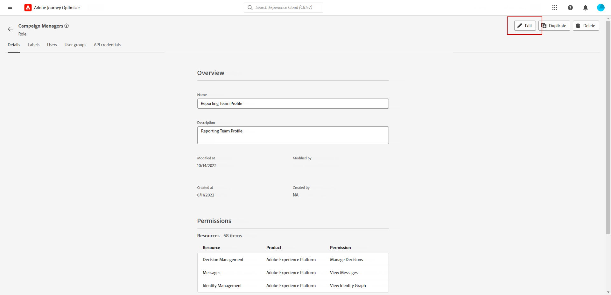

# Kom igång med kanalrapporter {#channel-report-gs}

Kanalrapporterna är ett kraftfullt verktyg som ger en omfattande översikt över trafik- och engagemangsmått i en enhetlig rapport för varje kanal, som omfattar alla åtgärder från alla kampanjer och resor. Den delas in i olika widgetar, som vart och ett ger en specifik bild av hur kampanjen eller resan fungerar.

Kanalrapporterna är helt anpassningsbara, så du kan ändra storlek på eller ta bort widgetar och skapa en instrumentpanel som passar dina specifika behov. Du kan också exportera rapportdata till en PDF- eller CSV-fil för ytterligare analys.

Läs mer om olika mätvärden och widgetar som är tillgängliga för kanalrapporter i det här [page](channel-report.md).

## Före start {#manage-reports-prereq}

Kontrollera att du har åtkomst till **[!UICONTROL Reports]** -menyn.

Om du inte kan se **[!UICONTROL Reports]** måste dina åtkomsträttigheter utökas till att omfatta **[!UICONTROL View Channel Reports]** behörighet. Du kan utöka dina egna behörigheter om du har tillgång till Adobe Experience Platform [Behörigheter](https://experienceleague.adobe.com/docs/experience-platform/access-control/home.html){target="_blank"} för er organisation. Om inte, kontakta Adobe Journey Optimizer-administratören.

+++Lär dig hur du tilldelar rapportbehörigheter

Observera att denna behörighet ingår i följande inbyggda **[!UICONTROL Roles]**: Campaign Manager, Campaign Approver, Campaign Viewer och Campaign Administrator.

Så här tilldelar du motsvarande behörighet till **[!UICONTROL Role]**:

1. Från [!DNL Permissions] -produkt, navigera till **[!UICONTROL Roles]** och välj den roll som du vill uppdatera med den nya **[!UICONTROL View Channel Reports]** behörighet.

1. Från **[!UICONTROL Role]** kontrollpanel, klicka **[!UICONTROL Edit]**.

   

1. Dra och släpp **[!UICONTROL Reports]** resurs för att tilldela behörighet.

   Från **[!UICONTROL Report]** nedrullningsbar resurs, välj **[!UICONTROL View Channel Reports]** behörighet.

   

1. Klicka på **[!UICONTROL Save]**.

Användare som tilldelats denna **[!UICONTROL Role]** har nu åtkomst till **[!UICONTROL Reports]** -menyn.

+++

## Hantera rapportinstrumentpanelen {#manage-reports}

Följ de här stegen för att få åtkomst till och hantera dina kanalrapporter:

1. Navigera till **[!UICONTROL Reports]** menyn i **[!UICONTROL Journey Management]** -avsnitt.

   

1. Välj en **Starta** och **[!UICONTROL End time]** för att rikta in specifika data.

1. Från **[!UICONTROL Action from]** väljer du om du vill ha kampanjer, resor eller båda som mål.

   

1. Klicka **[!UICONTROL Modify]** för att ändra storlek på eller ta bort widgetar för att skapa en instrumentpanel som uppfyller dina specifika behov.

   

1. När du är nöjd med visningsordningen och widgetarnas storlek klickar du på **[!UICONTROL Save]**.

1. Beroende på widgeten kan du välja att växla från en tabell, ett stapeldiagram eller en munk.

1. Klicka på procentikonen om du vill visa data som frekvenser.

   

## Exportera rapporter {#export-reports}

Du kan enkelt exportera dina olika rapporter till PDF eller CSV-format så att du kan dela, ändra och skriva ut dem. Detaljerade anvisningar för hur du exporterar kanalrapporter finns på följande flikar:

>[!BEGINTABS]

>[!TAB Exportera rapporten som en PDF-fil]

1. Klicka på **[!UICONTROL Export]** och markera **[!UICONTROL PDF file]**.

1. Konfigurera dokumentet i utskriftsfönstret efter behov. Observera att alternativen kan variera beroende på vilken webbläsare du använder.

1. Skriv ut eller spara rapporten som PDF.

1. Leta reda på mappen där du vill spara filen, byt namn på den om det behövs och klicka på Spara.

Din rapport är nu tillgänglig för visning eller delning i en PDF-fil.

>[!TAB Exportera rapporten som en CSV-fil]

1. Klicka på **[!UICONTROL Export]** och markera **[!UICONTROL CSV file]** för att generera en CSV-fil på övergripande rapportnivå.

1. Du kan också välja att exportera data från en viss widget. Klicka **[!UICONTROL Export widget data to CSV]** bredvid den valda widgeten.

1. Filen hämtas automatiskt och kan finnas i dina lokala filer.

   Om du genererade filen på rapportnivå innehåller den detaljerad information för varje widget, inklusive dess titel och data.

   Om du genererade filen på widgetnivå, innehåller den specifikt data för den valda widgeten.

>[!ENDTABS]
