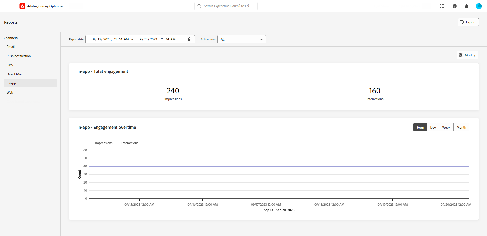

# Kanalrapporter {#channel-report}

>[!CONTEXTUALHELP]
>id="ajo_channel_level_report"
>title="Rapport på kanalnivå"
>abstract="Kanalrapporterna ger en omfattande översikt över trafik- och engagemangsmätningar i alla kanaler. Dina rapporter är uppdelade i olika widgetar som detaljerat beskriver er kampanj och dina kundresor och fel. Varje rapportkontrollpanel kan ändras genom att widgetar storleksändras eller tas bort."

>[!IMPORTANT]
>
> Så här öppnar du **Rapport** måste du ha **[!UICONTROL View Channel Reports]** behörighet. [Läs mer](channel-report-gs.md#before-starting-manage-reports-prereq)

Kanalrapporterna ger användarna en heltäckande översikt över trafik- och engagemangsmätningar på kanalnivå. Mätvärdena sammanställs för att presentera konsoliderade värden för åtgärder som kommer från den valda kanalen och som omfattar olika kampanjer och resor.

Du kommer åt kanalrapporterna genom att gå till **Rapporter** menyn i **Resehantering** -avsnitt. Den är helt anpassningsbar, du kan filtrera dina data beroende på rapportdatumet eller åtgärden. [Läs mer](channel-report-gs.md)

Rapportsidan visas med följande flikar:

* [E-post](#email)
* [Push-meddelanden](#push)
* [SMS](#sms)
* [I appen](#inapp)
* [Webb](#web)
* [Direktmeddelande](#direct-mail)

➡️ [Upptäck den här funktionen i en video](#channel-report-video)

## E-post {#email}

Från kanalrapporter visar e-postmenyn huvudinformationen om e-postmeddelanden som skickas i kampanjer och resor. Mätvärdena anges nedan.

+++  Läs mer om de olika mätvärden och widgetar som är tillgängliga för e-postrapporten.

The **[!UICONTROL Email Total Sending Statistics]** diagram visar hur bra dina e-postmeddelanden är:

* **[!UICONTROL Targeted]**: Totalt antal bearbetade e-postmeddelanden.

* **[!UICONTROL Sent]**: Totalt antal överföringar.

* **[!UICONTROL Delivered]**: Antal e-postmeddelanden som har skickats, i relation till det totala antalet skickade meddelanden.

* **[!UICONTROL Delivery Rate]**: Procentandel e-postmeddelanden som skickades.

* **[!UICONTROL Bounces]**: Totalt antal fel som ackumulerats och automatisk returbehandling i relation till totalt antal skickade meddelanden.

* **[!UICONTROL Bounce Rate]**: Procentandel e-postmeddelanden som studsade jämfört med skickade e-postmeddelanden.

* **[!UICONTROL Errors]**: Totalt antal fel som har inträffat som förhindrar att den skickas till profiler.

* **[!UICONTROL Error Rate]**: Procentandel fel som förhindrade att det skickades jämfört med skickade e-postmeddelanden.

* **[!UICONTROL Excluded]**: Antal profiler som har uteslutits av Adobe Journey Optimizer.

* **[!UICONTROL Exclude rate]**: Procentandel profiler som har uteslutits av Adobe Journey Optimizer.

The **[!UICONTROL Email Total Tracking statistics]** widgeten innehåller tillgängliga data för mottagaraktivitet för dina e-postmeddelanden:

* **[!UICONTROL Opens]**: Antal gånger som meddelandet öppnades.

* **[!UICONTROL Open Rate]**: Totalt antal öppnade e-postmeddelanden jämfört med antalet levererade e-postmeddelanden.

* **[!UICONTROL Clicks]**: Antal gånger ett innehåll klickades i ett meddelande.

* **[!UICONTROL Click rate]**: Procentandel användare som interagerade med e-postmeddelandet.

* **[!UICONTROL Spam complaints]**: Antal gånger ett meddelande har deklarerats som skräppost eller skräppost.

* **[!UICONTROL Spam complaint rate]**: Procentandel av meddelanden som deklarerats som skräppost eller skräppost jämfört med antalet skickade e-postmeddelanden.

* **[!UICONTROL Unsubscribes]**: Antal klick på prenumerationslänken.

* **[!UICONTROL Unsubscribe rate]**: Procentandel av avanmälan jämfört med antalet skickade e-postmeddelanden.

The **[!UICONTROL Sending Statistics over time]** diagrammet innehåller de data som är tillgängliga för skickade e-postmeddelanden, som:

* **[!UICONTROL Sent]**: Totalt antal överföringar.

* **[!UICONTROL Delivered]**: Antal e-postmeddelanden som skickats, i relation till det totala antalet skickade e-postmeddelanden.

* **[!UICONTROL Bounces]**: Totalt antal fel som har ackumulerats och automatisk returbehandling i relation till totalt antal skickade e-postmeddelanden.

* **[!UICONTROL Errors]**: Totalt antal fel som har inträffat som förhindrar att den skickas till profiler.

The **[!UICONTROL Email tracking statistics overtime]** diagrammet innehåller de data som är tillgängliga för att öppna och klicka.

The **[!UICONTROL Bounce Reasons]** och **[!UICONTROL Bounce categories]** widgetar innehåller tillgängliga data som är relaterade till studsade meddelanden, som:

* **[!UICONTROL Hard bounce]**: Det totala antalet permanenta fel, t.ex. fel e-postadress. Detta inbegriper ett felmeddelande som uttryckligen anger att adressen är ogiltig, till exempel Okänd användare.

* **[!UICONTROL Soft bounce]**: Det totala antalet tillfälliga fel, till exempel en fullständig inkorg.

* **[!UICONTROL Ignored]**: Det totala antalet tillfälliga, t.ex. frånvaro, eller ett tekniskt fel, t.ex. om avsändartypen är postmaster.

Mer information om studsar finns i [Undertryckningslista](../reports/suppression-list.md) sida.

The **[!UICONTROL Error Reasons]** i diagram och tabeller kan du se vilket fel som inträffade.

The **[!UICONTROL Excluded reasons]** I diagram och tabeller visas de olika anledningar som gjorde att användarprofiler som inte ingår i målprofilerna inte kunde ta emot meddelandet.

The **[!UICONTROL Bounce Reasons by domain]**, **[!UICONTROL Sent & delivered by domains]**, **[!UICONTROL Opens & Clicks by domain]**  och **[!UICONTROL Bounce & errors by domain]** tabeller och diagram representerar domännivåuppdelning av alla viktiga e-postleveranser och spårningsdata.
+++

## Push-meddelande {#push}

Från dina kanalrapporter anger menyn Push-meddelanden huvudinformationen i relation till push-meddelanden som skickas i dina kampanjer och resor. Mätvärdena anges nedan.

+++  Läs mer om de olika mätvärden och widgetar som finns för rapporten Push.

The **[!UICONTROL Push notifications - Total sending statistics]** tabellen visar huvudinformationen i förhållande till push-meddelanden med diagram och KPI:er:

* **[!UICONTROL Targeted]**: Totalt antal bearbetade push-meddelanden.

* **[!UICONTROL Sent]**: Totalt antal skickade push-meddelanden.

* **[!UICONTROL Delivered]**: Antal push-meddelanden som har skickats, i relation till det totala antalet skickade push-meddelanden.

* **[!UICONTROL Delivery Rate]**: Procentandel skickade push-meddelanden.

* **[!UICONTROL Bounces]**: Totalt antal fel som ackumulerats och automatisk returbehandling i relation till totalt antal skickade meddelanden.

* **[!UICONTROL Bounce Rate]**: Procentandel push-meddelanden som studsade jämfört med skickade push-meddelanden.

* **[!UICONTROL Errors]**: Totalt antal fel som har inträffat som förhindrar att den skickas till profiler.

* **[!UICONTROL Error Rate]**: Procentandel fel som förhindrade att det skickades jämfört med skickade push-meddelanden.

* **[!UICONTROL Excluded]**: Antal profiler som har uteslutits av Adobe Journey Optimizer.

* **[!UICONTROL Exclude rate]**: Procentandel profiler som har uteslutits av Adobe Journey Optimizer.

The **[!UICONTROL Push notification - Total tracking statistics]** innehåller tillgängliga data för mottagaraktivitet för push-meddelanden:

* **[!UICONTROL Opens]**: Antal gånger ett push-meddelande öppnades.

* **[!UICONTROL Open Rate]**: Procentandel öppnade push-meddelanden.

* **[!UICONTROL Actions]**: Totalt antal åtgärder för push-meddelandet som levererats, t.ex. knappklickning eller avvisning.

* **[!UICONTROL Action rate]**: Procentandel åtgärder för push-meddelanden som levereras jämfört med push-meddelanden som skickas.

* **[!UICONTROL Engagement Rate]**: Procentandel öppningar och åtgärder för det här push-meddelandet, dvs. om profilen öppnade push-meddelandet eller om någon klickade på en knapp.

The **[!UICONTROL Push notifications - Sending statistics over time]** diagrammet innehåller data som är tillgängliga för skickade push-meddelanden, som:

* **[!UICONTROL Sent]**: Totalt antal skickade push-meddelanden.

* **[!UICONTROL Delivered]**: Antal push-meddelanden som har skickats, i relation till det totala antalet skickade push-meddelanden.

* **[!UICONTROL Bounces]**: Totalt antal fel som ackumulerats och automatisk returbehandling i relation till totalt antal skickade meddelanden.

* **[!UICONTROL Errors]**: Totalt antal fel som har inträffat som förhindrar att den skickas till profiler.

The **[!UICONTROL Excluded reasons]** I diagram och tabeller visas de olika anledningar som gjorde att användarprofiler som inte ingår i målprofilerna inte kunde ta emot meddelandet.

The **[!UICONTROL Error Reasons]** i diagram och tabeller kan du se vilket fel som inträffade.

The **[!UICONTROL Tracking by platform]** och **[!UICONTROL Sending by platform]** diagram och tabeller visar hur bra push-meddelandena är beroende på mottagarens operativsystem.
+++

## SMS {#sms}

Från kanalrapporter visar SMS-menyn huvudinformationen som är relativ till SMS som skickas i era kampanjer och resor. Mätvärdena anges nedan.

+++ Läs mer om de olika mätvärden och widgetar som är tillgängliga för SMS-rapporten.

The **[!UICONTROL SMS - Total sending statistics]** tabellen visar hur ditt SMS fungerar:

* **[!UICONTROL Targeted]**: Antal användarprofiler som kvalificerar sig som målprofiler för SMS-kanal.

* **[!UICONTROL Sent]**: Totalt antal skickade SMS-meddelanden.

* **[!UICONTROL Delivered]**: Antal SMS-meddelanden som har skickats, i relation till det totala antalet skickade SMS-meddelanden.

* **[!UICONTROL Delivery Rate]**: Procentandel SMS-meddelanden har skickats.

* **[!UICONTROL Bounces]**: Totalt antal kumulerade fel och automatisk returbehandling i relation till totalt antal skickade SMS-meddelanden.

* **[!UICONTROL Bounce Rate]**: Procentandel SMS-meddelanden som studsade jämfört med skickade SMS-meddelanden.

* **[!UICONTROL Errors]**: Totalt antal fel som har inträffat som förhindrar att den skickas till profiler.

* **[!UICONTROL Error Rate]**: Procentandel fel som förhindrade att det skickades jämfört med skickade SMS-meddelanden.

* **[!UICONTROL Excluded]**: Antal användarprofiler, exkluderade från målprofilerna, som inte fick meddelandet.

* **[!UICONTROL Exclude rate]**: Procentandel profiler som har uteslutits av Adobe Journey Optimizer.

The **[!UICONTROL SMS - Total tracking statistics]** widgeten innehåller detaljerad information om den viktigaste informationen i förhållande till besökarnas interaktion med dina URL-adresser:

* **[!UICONTROL Clicks]**: Antal gånger ett innehåll klickades i SMS-meddelandet.

* **[!UICONTROL Click rate]**: Procentandel användare som interagerade med SMS-meddelandet.

The **[!UICONTROL SMS - Sending statistics over time]** widgeten visar huvudinformationen i förhållande till meddelandet med ett diagram:

* **[!UICONTROL Sent]**: Totalt antal skickade SMS-meddelanden.

* **[!UICONTROL Delivered]**: Antal SMS-meddelanden som har skickats, i relation till det totala antalet skickade SMS-meddelanden.

* **[!UICONTROL Bounces]**: Totalt antal kumulerade fel och automatisk returbehandling i relation till totalt antal skickade SMS-meddelanden.

* **[!UICONTROL Errors]**: Totalt antal fel som har inträffat som förhindrar att den skickas till profiler.

The **[!UICONTROL Exclude Reasons]**, **[!UICONTROL Bounces Reasons]** och **[!UICONTROL Error Reasons]** Med diagram och tabeller kan du se vilka fel och undantag som har inträffat.

+++

## I appen {#in-app}

Från kanalrapporterna visar menyn i appen huvudinformationen i förhållande till meddelanden i appen som skickas i era kampanjer och resor. Mätvärdena anges nedan.

+++  Läs mer om de olika mätvärden och widgetar som finns för rapporten i appen.

The **[!UICONTROL In-app total engagement]** Nyckeltal anger den viktigaste informationen i relation till besökarnas engagemang i era meddelanden i appen, som:

* **[!UICONTROL Impressions]**: Totalt antal meddelanden i appen som levereras till alla användare.

* **[!UICONTROL Interactions]**: Totalt antal ärenden i ditt meddelande i appen. Detta inkluderar alla åtgärder som användaren utför, t.ex. klickningar, uppsägningar eller annan interaktion.

* **[!UICONTROL Dismisses]**: Totalt antal meddelanden i appen som mottagarna stängt antingen genom att klicka på stängningsknappen eller genom att stänga automatiskt.

* **[!UICONTROL Dismiss rate]**: Procentandel meddelanden i appen som mottagarna avvisade.

The **[!UICONTROL In-app engagement overtime]** I diagrammet visas hur dina visningar och interaktioner i appen har utvecklats under den aktuella perioden genom att du kan spåra alla exponeringar, avvisningar eller interaktioner.

+++

## Webb {#web}

Från kanalrapporter visar webbmenyn huvudinformationen om de webbsidor som ingår i dina kampanjer och resor. Mätvärdena anges nedan.

+++ Läs mer om de olika mätvärden och widgetar som finns för webbrapporten.

The **[!UICONTROL Web total engagement]** Nyckeltal anger den viktigaste informationen i relation till besökarnas engagemang i era webbupplevelser, till exempel:

* **[!UICONTROL Impressions]**: Totalt antal webbupplevelser som levereras till alla användare.

* **[!UICONTROL Interactions]**: Totalt antal ärenden på din webbsida. Detta inkluderar alla åtgärder som användaren utför, t.ex. klickningar eller andra interaktioner.

* **[!UICONTROL Dismisses]**: Totalt antal webbsidor som mottagarna har stängt.

* **[!UICONTROL Dismiss rate]**: Procentandel av webbsidor som mottagarna avvisade.

The **[!UICONTROL Web engagement overtime]** diagram visar huvudinformationen i förhållande till besökarnas engagemang på webbsidorna.

+++

## Direktmeddelande {#direct-mail}

Från kanalrapporter visar menyn Direktreklam huvudinformationen i relation till de direktmeddelanden som skickas i dina kampanjer och resor. Metrucs anges nedan.

+++ Läs mer om de olika mätvärden och widgetar som finns för rapporten Direct mail.
The **[!UICONTROL Direct mail - Total sending statistics]** tabellen visar hur bra dina meddelanden är:

* **[!UICONTROL Targeted]**: Antal användarprofiler som kvalificerar sig som målprofiler för dina Direct-postmeddelanden.

* **[!UICONTROL Sent]**: Totalt antal överföringar.

* **[!UICONTROL Errors]**: Totalt antal fel som har inträffat som förhindrar att den skickas till profiler.

* **[!UICONTROL Error Rate]**: Procentandel fel som förhindrade att det skickades jämfört med skickade push-meddelanden.

* **[!UICONTROL Excluded]**: Antal användarprofiler, exkluderade från målprofilerna, som inte fick meddelandet.

* **[!UICONTROL Exclude rate]**: Procentandel profiler som har uteslutits av Adobe Journey Optimizer.

The **[!UICONTROL Exclude Reasons]** och **[!UICONTROL Error Reasons]** Med diagram och tabeller kan du se vilka fel och undantag som har inträffat.
+++

## Instruktionsvideo {#channel-report-video}

Lär dig hur du får åtkomst till, navigerar och exporterar rapporter på kanalnivå i den här videon

>[!VIDEO](https://video.tv.adobe.com/v/3424537?quality=12)
