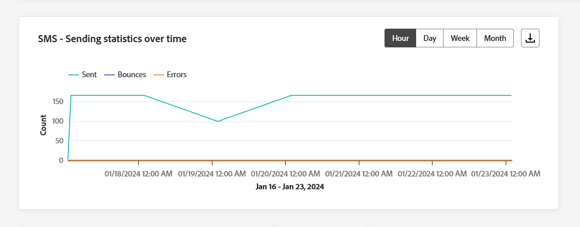

# Kanalrapporter {#channel-report}

>[!CONTEXTUALHELP]
>id="ajo_channel_level_report"
>title="Rapport på kanalnivå"
>abstract="Kanalrapporterna ger en omfattande översikt över trafik- och engagemangsmätningar i alla kanaler. Dina rapporter är uppdelade i olika widgetar som detaljerat beskriver er kampanj och dina kundresor och fel. Varje rapportkontrollpanel kan ändras genom att widgetar storleksändras eller tas bort."

>[!IMPORTANT]
>
> Så här öppnar du **Rapport** måste du ha **[!UICONTROL View Channel Reports]** behörighet. [Läs mer](channel-report-gs.md#before-starting-manage-reports-prereq)

Kanalrapporterna ger användarna en heltäckande översikt över trafik- och engagemangsmätningar på kanalnivå. Mätvärdena sammanställs för att presentera konsoliderade värden för åtgärder som kommer från den valda kanalen och som omfattar olika kampanjer och resor.

Du kommer åt kanalrapporterna genom att gå till **Rapporter** menyn i **Resehantering** -avsnitt. Den är helt anpassningsbar, du kan filtrera dina data beroende på rapportdatumet eller åtgärden. [Läs mer](channel-report-gs.md)

Rapportsidan visas med följande flikar:

* [E-post](#email)
* [Push-meddelanden](#push)
* [SMS](#sms)
* [I appen](#inapp)
* [Webb](#web)
* [Direktmeddelande](#direct-mail)

➡️ [Upptäck den här funktionen i video](#channel-report-video)

## E-post {#email}

Från kanalrapporter visar e-postmenyn huvudinformationen om e-postmeddelanden som skickas i kampanjer och resor. Mätvärdena anges nedan.

### E-post - total sändningsstatistik {#email-total-sending}

>[!CONTEXTUALHELP]
>id="ajo_channel_email_sending_statistics"
>title="E-post - total sändningsstatistik"
>abstract="KPI:erna för sändning av statistik för e-post - totalt sammanfattar viktiga data om dina e-postmeddelanden, som riktade eller levererade meddelanden."

The **[!UICONTROL Email Total Sending Statistics]** widgeten ger en omfattande översikt över din e-postprestanda och visar nyckeltal (KPI) som sammanfattar viktiga data om dina e-postmeddelanden.

+++ Läs mer om statistik för sändning via e-post

* **[!UICONTROL Targeted]**: Totalt antal bearbetade e-postmeddelanden.

* **[!UICONTROL Sent]**: Totalt antal överföringar.

* **[!UICONTROL Delivered]**: Antal e-postmeddelanden som har skickats, i relation till det totala antalet skickade meddelanden.

* **[!UICONTROL Delivery Rate]**: Procentandel e-postmeddelanden som skickades.

* **[!UICONTROL Bounces]**: Totalt antal fel som ackumulerats och automatisk returbehandling i relation till totalt antal skickade meddelanden.

* **[!UICONTROL Bounce Rate]**: Procentandel e-postmeddelanden som studsade jämfört med skickade e-postmeddelanden.

* **[!UICONTROL Errors]**: Totalt antal fel som har inträffat som förhindrar att den skickas till profiler.

* **[!UICONTROL Error Rate]**: Procentandel fel som förhindrade att det skickades jämfört med skickade e-postmeddelanden.

* **[!UICONTROL Excluded]**: Antal profiler som har uteslutits av Adobe Journey Optimizer.

* **[!UICONTROL Exclude rate]**: Procentandel profiler som har uteslutits av Adobe Journey Optimizer.

+++

### E-post - Total spårningsstatistik {#email-total-tracking}

>[!CONTEXTUALHELP]
>id="ajo_channel_email_tracking_statistics"
>title="E-post - Total spårningsstatistik"
>abstract="KPI:erna för e-post - total spårningsstatistik tillhandahåller data om profilaktiviteten för dina e-postmeddelanden."

The **[!UICONTROL Email Total Tracking statistics]** widgeten erbjuder en detaljerad ögonblicksbild av profilaktivitet som är kopplad till dina e-postmeddelanden, och ger viktiga insikter i engagemang och e-posteffektivitet.

+++ Läs mer om statistik för uppföljning av totalt e-postmeddelande

* **[!UICONTROL Opens]**: Antal gånger som meddelandet öppnades.

* **[!UICONTROL Open Rate]**: Totalt antal öppnade e-postmeddelanden jämfört med antalet levererade e-postmeddelanden.

* **[!UICONTROL Clicks]**: Antal gånger ett innehåll klickades i ett meddelande.

* **[!UICONTROL Click rate]**: Procentandel användare som interagerade med e-postmeddelandet.

* **[!UICONTROL Spam complaints]**: Antal gånger ett meddelande har deklarerats som skräppost eller skräppost.

* **[!UICONTROL Spam complaint rate]**: Procentandel av meddelanden som deklarerats som skräppost eller skräppost jämfört med antalet skickade e-postmeddelanden.

* **[!UICONTROL Unsubscribes]**: Antal klick på prenumerationslänken.

* **[!UICONTROL Unsubscribe rate]**: Procentandel av avanmälan jämfört med antalet skickade e-postmeddelanden.

+++

### E-post - skicka statistik över tid {#email-sending-statistics-overtime}

>[!CONTEXTUALHELP]
>id="ajo_channel_email_sending_statistics_overtime"
>title="E-post - skicka statistik över tid"
>abstract="Diagrammet E-post - skicka statistik över tid visar data om skickade e-postmeddelanden, uppdelade per timme, dag, vecka eller månad."

The **[!UICONTROL Email - Sending Statistics over time]** graf ger en dynamisk representation som visar en analys av din e-postaktivitet. Den grafiska representationen ger en omfattande beskrivning av skickade e-postmeddelanden, så att du kan följa trender och mönster på en tim-, daglig-, vecko- eller månadsnivå.

+++ Läs mer om e-post - Skicka statistik över tidsvärden

* **[!UICONTROL Sent]**: Totalt antal överföringar.

* **[!UICONTROL Delivered]**: Antal e-postmeddelanden som skickats, i relation till det totala antalet skickade e-postmeddelanden.

* **[!UICONTROL Bounces]**: Totalt antal fel som har ackumulerats och automatisk returbehandling i relation till totalt antal skickade e-postmeddelanden.

* **[!UICONTROL Errors]**: Totalt antal fel som har inträffat som förhindrar att den skickas till profiler.

+++

### E-post - Spårningsstatistik över tid {#email-tracking-statistics-overtime}

>[!CONTEXTUALHELP]
>id="ajo_channel_email_tracking_statistics_overtime"
>title="E-post - Spårningsstatistik över tid"
>abstract="Diagrammet E-post - Spårningsstatistik över tid visar data om profilaktiviteten för dina e-postmeddelanden, uppdelade per timme, dag, vecka eller månad."

The **[!UICONTROL Email - Tracking statistics over time]** diagrammet ger en detaljerad översikt över profilaktiviteter som är relaterade till dina e-postmeddelanden. Den grafiska representationen delar upp informationen varje timme, dag, vecka eller månad, och ger värdefulla insikter om hur mottagarengagemanget utvecklas över olika tidsintervall.

+++ Läs mer om e-post - Spåra statistik över tidsvärden

* **[!UICONTROL Opens]**: Antal gånger som meddelandet öppnades.

* **[!UICONTROL Clicks]**: Antal gånger ett innehåll klickades i ett meddelande.

+++

### E-post - studskategorier och orsaker {#bounce-categories}

>[!CONTEXTUALHELP]
>id="ajo_channel_email_bounce_categories"
>title="Studskategorier"
>abstract="Diagram och tabell för studskategorier innehåller data om både temporära och permanenta fel."

>[!CONTEXTUALHELP]
>id="ajo_channel_email_bounce_reasons"
>title="Brytningsorsaker"
>abstract="Diagram över studentorsaker och tabellen innehåller tillgängliga data om studsade meddelanden."

The **[!UICONTROL Bounce categories]** och **[!UICONTROL Bounce reasons]** widgetar kapslar in data som är kopplade till studsade meddelanden, vilket ger en omfattande översikt över de olika kategorierna och specifika orsaker bakom meddelandestudsar

Mer information om studsar finns i [Undertryckningslista](../reports/suppression-list.md) sida.

+++ Läs mer om statistik för studskategorier

* **[!UICONTROL Hard bounce]**: Det totala antalet permanenta fel, t.ex. fel e-postadress. Detta inbegriper ett felmeddelande som uttryckligen anger att adressen är ogiltig, till exempel Okänd användare.

* **[!UICONTROL Soft bounce]**: Det totala antalet tillfälliga fel, till exempel en fullständig inkorg.

* **[!UICONTROL Ignored]**: Det totala antalet tillfälliga, t.ex. frånvaro, eller ett tekniskt fel, t.ex. om avsändartypen är postmaster.

+++

### Felorsaker {#error-reasons}

>[!CONTEXTUALHELP]
>id="ajo_channel_email_error_reasons"
>title="Felorsaker"
>abstract="Med hjälp av diagrammen och tabellen Felorsaker kan du identifiera de specifika fel som uppstod under sändningsprocessen."

The **[!UICONTROL Error Reasons]** Med diagram och tabeller kan du identifiera de exakta fel som har inträffat under sändningsprocessen, vilket ger en tydlig förståelse för de problem som har uppstått.

### Undantagna orsaker {#excluded-reasons}

>[!CONTEXTUALHELP]
>id="ajo_channel_email_excluded_reasons"
>title="Undantagna orsaker"
>abstract="I diagrammen och tabellen Exkluderade orsaker visas de olika faktorer som ledde till att användarprofiler exkluderades från målgruppen och inte fick meddelandet."

The **[!UICONTROL Excluded reasons]** diagram och tabeller ger en heltäckande bild av de olika faktorer som har lett till att användarprofiler har tagits bort från målgruppen, vilket leder till att meddelandet inte tas emot.

Se [den här sidan](exclusion-list.md) En fullständig förteckning över orsaker till uteslutning.

### Skickat och levererat av domäner {#sent-delivered-domains}

>[!CONTEXTUALHELP]
>id="ajo_channel_email_sending_delivered_domains"
>title="Skickat och levererat av domäner"
>abstract="Diagrammet och tabellen för Skickat och levererat per domän representerar domännivåuppdelning av alla viktiga e-postmeddelanden som skickar data."

The  **[!UICONTROL Sent & delivered by domains]** tabellen och diagrammet ger en detaljerad beskrivning av e-postleveranser på domännivå, med omfattande insikter om hur e-postmeddelandena fungerar.

+++ Läs mer om Sänd och levererad via domänmått

* **[!UICONTROL Sent]**: Totalt antal skickade meddelanden för din e-post.

* **[!UICONTROL Delivered]**: Antal meddelanden som har skickats, i relation till det totala antalet skickade meddelanden.

+++

### Begränsningar och fel per domäner {#bounces-errors-domains}

>[!CONTEXTUALHELP]
>id="ajo_channel_email_bounces_errors_domains"
>title="Begränsningar och fel per domäner"
>abstract="Diagram och tabell över studsar och fel per domän representerar domännivåuppdelning av specifika fel som inträffade under sändningsprocessen."

The  **[!UICONTROL Bounces & errors by domains]** diagram och tabeller ger en beskrivning på domännivå av specifika fel som påträffats under sändningsprocessen, vilket ger en detaljerad analys av problem som uppstått.

+++ Läs mer om studsar och fel per domänmått

* **[!UICONTROL Bounces]**: Totalt antal fel som har ackumulerats under sändningsprocessen och automatisk returbearbetning i relation till det totala antalet skickade meddelanden.

* **[!UICONTROL Errors]**: Totalt antal fel som uppstod under sändningsprocessen och som förhindrar att den skickas till profiler.

+++

### Öppna och klicka efter domäner {#open-clicks-domains}

>[!CONTEXTUALHELP]
>id="ajo_channel_email_open_clicks_domains"
>title="Öppna och klicka efter domäner"
>abstract="Grafen och tabellen Öppna och klicka per domän visar en domännivåuppdelning av besökarnas engagemang i e-postmeddelandet."

The  **[!UICONTROL Open & clicks by domains]** diagram och tabeller visar en sammanställning på domännivå av besökarnas engagemang i ert e-postmeddelande, vilket ger värdefulla insikter om hur olika domäner interagerar med ert innehåll.

+++ Läs mer om Öppna och klickningar efter domänstatistik

* **[!UICONTROL Opens]**: Antal gånger som e-postmeddelandet öppnades.

* **[!UICONTROL Clicks]**: Antal gånger ett innehåll klickades i ett e-postmeddelande.

+++

### Studsa orsaker efter domän {#bounce-reasons-domains}

>[!CONTEXTUALHELP]
>id="ajo_channel_email_bounce_reasons_domains"
>title="Studsa orsaker efter domän"
>abstract="Studsorsaker per domän per domändiagram och tabell representerar domännivåuppdelning av data för både temporära och permanenta fel."

The  **[!UICONTROL Bounce reasons by domain]** diagram och tabeller ger en uppdelning på domännivå av data om både tillfälliga och permanenta fel, vilket ger detaljerade insikter om orsakerna bakom studsade meddelanden.

Mer information om studsar finns i [Undertryckningslista](../reports/suppression-list.md) sida.

## Push-meddelande {#push}

Från dina kanalrapporter finns **Push-meddelande** -menyn innehåller huvudinformationen om push-meddelanden som skickas i dina kampanjer och resor. Mätvärdena anges nedan.

### Push-meddelanden - totalt antal utskicksstatistik {#push-total-sending}

>[!CONTEXTUALHELP]
>id="ajo_channel_push_sending_statistics"
>title="Push-meddelanden - totalt antal utskicksstatistik"
>abstract="Push-meddelanden - Totalt antal KPI:er för sändning av statistik sammanfattar viktiga data om dina push-meddelanden, som Target eller Delivery."

The **[!UICONTROL Push notifications - Total sending statistics]** KPI:er fungerar som en omfattande sammanfattning, som innehåller viktiga data relaterade till dina push-meddelanden. Dessa mätvärden inkluderar detaljerade insikter om målgruppen och leveransstatus, vilket ger en detaljerad bild av hur effektiva och omfattande push-meddelandena är.

+++ Lär dig mer om push-meddelanden - statistik för totalt skickade meddelanden

* **[!UICONTROL Targeted]**: Totalt antal bearbetade push-meddelanden.

* **[!UICONTROL Sent]**: Totalt antal skickade push-meddelanden.

* **[!UICONTROL Delivered]**: Antal push-meddelanden som har skickats, i relation till det totala antalet skickade push-meddelanden.

* **[!UICONTROL Delivery Rate]**: Procentandel skickade push-meddelanden.

* **[!UICONTROL Bounces]**: Totalt antal fel som ackumulerats och automatisk returbehandling i relation till totalt antal skickade meddelanden.

* **[!UICONTROL Bounce Rate]**: Procentandel push-meddelanden som studsade jämfört med skickade push-meddelanden.

* **[!UICONTROL Errors]**: Totalt antal fel som har inträffat som förhindrar att den skickas till profiler.

* **[!UICONTROL Error Rate]**: Procentandel fel som förhindrade att det skickades jämfört med skickade push-meddelanden.

* **[!UICONTROL Excluded]**: Antal profiler som har uteslutits av Adobe Journey Optimizer.

* **[!UICONTROL Exclude rate]**: Procentandel profiler som har uteslutits av Adobe Journey Optimizer.

+++

### Push-meddelande - Total spårningsstatistik {#push-total-tracking}

>[!CONTEXTUALHELP]
>id="ajo_channel_push_tracking_statistics"
>title="Push-meddelande - Total spårningsstatistik"
>abstract="Push-meddelandet - Total spårningsstatistik innehåller data om profilaktivitet för dina push-meddelanden."

The **[!UICONTROL Push notification - Total tracking statistics]** widgeten erbjuder en detaljerad ögonblicksbild av profilaktivitet som är kopplad till dina push-meddelanden, vilket ger viktiga insikter i engagemanget och push-meddelandenas effektivitet.

+++ Läs mer om push-meddelanden - statistik för total spårning

* **[!UICONTROL Opens]**: Antal gånger ett push-meddelande öppnades.

* **[!UICONTROL Open Rate]**: Procentandel öppnade push-meddelanden.

* **[!UICONTROL Actions]**: Totalt antal åtgärder för push-meddelandet som levererats, t.ex. knappklickning eller avvisning.

* **[!UICONTROL Action rate]**: Procentandel åtgärder för push-meddelanden som levereras jämfört med push-meddelanden som skickas.

+++

### Push-meddelanden - skicka statistik över tid {#push-sending-overtime}

>[!CONTEXTUALHELP]
>id="ajo_channel_push_sending_statistics_overtime"
>title="Push-meddelanden - skicka statistik över tid"
>abstract="I diagrammet Push Notification Sending för tid visas data om skickade push-meddelanden, uppdelade per timme, dag, vecka eller månad."

The **[!UICONTROL Push notifications - Sending statistics over time]** graph erbjuder en dynamisk representation som visar en analys av din push-meddelandeaktivitet. Denna grafiska representation ger en omfattande beskrivning av skickade push-meddelanden, så att du kan observera trender och mönster varje timme, dag, vecka eller månad.

+++ Läs mer om push-meddelanden - Skicka statistik över tid

* **[!UICONTROL Sent]**: Totalt antal skickade push-meddelanden.

* **[!UICONTROL Delivered]**: Antal push-meddelanden som har skickats, i relation till det totala antalet skickade push-meddelanden.

* **[!UICONTROL Bounces]**: Totalt antal fel som ackumulerats och automatisk returbehandling i relation till totalt antal skickade meddelanden.

* **[!UICONTROL Errors]**: Totalt antal fel som har inträffat som förhindrar att den skickas till profiler.

+++

### Push-meddelanden - Spåra statistik över tid {#push-tracking-overtime}

>[!CONTEXTUALHELP]
>id="ajo_channel_push_tracking_statistics_overtime"
>title="Push-meddelanden - Spåra statistik över tid"
>abstract="Push-meddelandena - Spårningsstatistik över tid-diagrammet ger data om profilaktiviteten för dina push-meddelanden, uppdelade per timme, dag, vecka eller månad."

The **[!UICONTROL Push notifications - Tracking statistics over time]** diagrammet ger en detaljerad översikt över profilaktivitet som är relaterad till dina push-meddelanden. Den grafiska representationen delar upp informationen varje timme, dag, vecka eller månad, och ger värdefulla insikter om hur mottagarengagemanget utvecklas över olika tidsintervall.

+++ Läs mer om push-meddelanden - Spåra statistik över tid

* **[!UICONTROL Opens]**: Antal gånger ditt push-meddelande öppnades.

* **[!UICONTROL Actions]**: Totalt antal åtgärder för push-meddelandet som levererats, t.ex. knappklickning eller avvisning.

+++

### Push-meddelanden - Undantagna orsaker {#push-excluded-reasons}

>[!CONTEXTUALHELP]
>id="ajo_channel_push_excluded_reasons"
>title="Undantagna orsaker"
>abstract="I diagrammen och tabellen Exkluderade orsaker visas de olika faktorer som ledde till att användarprofiler exkluderades från målgruppen och inte fick meddelandet."

The **[!UICONTROL Excluded reasons]** I diagram och tabeller visas de olika orsaker som gjorde att användarprofiler som inte ingår i målprofilerna kunde ta emot push-meddelanden.

Se [den här sidan](exclusion-list.md) En fullständig förteckning över orsaker till uteslutning.

### Push-meddelanden - felorsaker {#push-error-reasons}

>[!CONTEXTUALHELP]
>id="ajo_channel_push_error_reasons"
>title="Felorsaker"
>abstract="Med hjälp av diagrammen och tabellen Felorsaker kan du identifiera de specifika fel som uppstod under sändningsprocessen."

The **[!UICONTROL Error Reasons]** diagram och tabeller ger dig möjlighet att identifiera de specifika fel som uppstod under sändningsprocessen för push-meddelanden och ge dig detaljerad information om eventuella problem som påträffas under sändningsprocessen.

### Push-meddelanden - Spårning per plattform {#push-tracking-platform}

>[!CONTEXTUALHELP]
>id="ajo_channel_push_tracking_statistics_platform"
>title="Spårningsstatistik per plattform"
>abstract="Spårningsstatistiken per plattform - diagram och tabell visar data om profilaktiviteten för dina push-meddelanden beroende på vilken profil du har."

The **[!UICONTROL Push notifications - Tracking by platform]** diagram och tabeller innehåller information om mottagaraktiviteten för push-meddelanden beroende på vilken profil du använder.

### Push-meddelanden - Skicka efter plattform {#push-sending-platform}

>[!CONTEXTUALHELP]
>id="ajo_channel_push_sending_statistics_platform"
>title="Skicka statistik per plattform"
>abstract="Diagram och tabell för att skicka statistik per plattform visar data om skickade push-meddelanden."

The **[!UICONTROL Push notifications - Sending by platform]** diagram och tabeller ger en omfattande beskrivning av hur bra push-meddelandena är i förhållande till profilernas operativsystem. Denna grundliga analys ger värdefulla insikter om hur effektiva era push-meddelanden är på olika plattformar.

## SMS {#sms}

Från **Kanal** på SMS-menyn finns information om den viktigaste informationen om SMS som skickas i kampanjer och resor. Mätvärdena anges nedan.

### SMS - Total sändningsstatistik {#sms-sending-statistics}

>[!CONTEXTUALHELP]
>id="ajo_channel_sms_sending_statistics"
>title="SMS - Total sändningsstatistik"
>abstract="SMS - Totalt antal KPI:er för sändning av statistik sammanfattar viktiga data om dina SMS-meddelanden, som Riktat eller Levererat."

The **[!UICONTROL SMS - Total sending statistics]** KPI:er fungerar som en omfattande sammanfattning, som innehåller viktiga data relaterade till ditt SMS. Dessa mätvärden inkluderar detaljerade insikter om målgruppen och leveransstatus, vilket ger en detaljerad bild av effektiviteten och räckvidden i era SMS-meddelanden.

+++ Lär dig mer om push-meddelanden - statistik för totalt skickade meddelanden

* **[!UICONTROL Targeted]**: Antal användarprofiler som kvalificerar sig som målprofiler för SMS-kanal.

* **[!UICONTROL Sent]**: Totalt antal skickade SMS-meddelanden.

* **[!UICONTROL Delivered]**: Antal SMS-meddelanden som har skickats, i relation till det totala antalet skickade SMS-meddelanden.

* **[!UICONTROL Delivery Rate]**: Procentandel SMS-meddelanden har skickats.

* **[!UICONTROL Bounces]**: Totalt antal kumulerade fel och automatisk returbehandling i relation till totalt antal skickade SMS-meddelanden.

* **[!UICONTROL Bounce Rate]**: Procentandel SMS-meddelanden som studsade jämfört med skickade SMS-meddelanden.

* **[!UICONTROL Errors]**: Totalt antal fel som har inträffat som förhindrar att den skickas till profiler.

* **[!UICONTROL Error Rate]**: Procentandel fel som förhindrade att det skickades jämfört med skickade SMS-meddelanden.

* **[!UICONTROL Excluded]**: Antal användarprofiler, exkluderade från målprofilerna, som inte fick meddelandet.

* **[!UICONTROL Exclude rate]**: Procentandel profiler som har uteslutits av Adobe Journey Optimizer.

+++

### SMS - Total spårningsstatistik {#sms-tracking-statistics}

>[!CONTEXTUALHELP]
>id="ajo_channel_sms_tracking_statistics"
>title="SMS - Total spårningsstatistik"
>abstract="SMS - Total spårningsstatistik ger data om profilaktivitet för dina SMS-meddelanden."

The **[!UICONTROL SMS - Total tracking statistics]** widgeten ger en detaljerad översikt över viktig information om besökarnas engagemang i era URL:er, och ger insikter om hur effektiva era SMS-meddelanden är:

* **[!UICONTROL Clicks]**: Antal gånger ett innehåll klickades i SMS-meddelandet.

### SMS - Skicka statistik över tid {#sms-sending-statistics-overtime}

>[!CONTEXTUALHELP]
>id="ajo_channel_sms_sending_statistics_overtime"
>title="SMS - Skicka statistik över tid"
>abstract="Diagrammet SMS - Skicka statistik över tid visar data om skickade SMS-meddelanden, uppdelade per timme, dag, vecka eller månad."

The **[!UICONTROL SMS - Sending statistics over time]** diagram ger en heltäckande bild av skickade SMS-meddelanden och ger data uppdelade per timme, dag, vecka eller månad. Med den här grafiska representationen kan du spåra och analysera trender i SMS-meddelandeaktiviteten över olika tidsintervall.

+++ Läs mer om SMS - Skicka statistik över tidsvärden

* **[!UICONTROL Sent]**: Totalt antal skickade SMS-meddelanden.

* **[!UICONTROL Bounces]**: Totalt antal kumulerade fel och automatisk returbehandling i relation till totalt antal skickade SMS-meddelanden.

* **[!UICONTROL Errors]**: Totalt antal fel som har inträffat som förhindrar att den skickas till profiler.

+++

### SMS - Spårningsstatistik över tid {#sms-tracking-statistics-overtime}

>[!CONTEXTUALHELP]
>id="ajo_channel_sms_tracking_statistics_overtime"
>title="SMS - Spårningsstatistik över tid"
>abstract="Diagrammet SMS - Spårningsstatistik över tid visar data om profilaktiviteten för dina SMS-meddelanden, uppdelat per timme, dag, vecka eller månad."

The **[!UICONTROL SMS - Tracking statistics over time]** diagrammet innehåller data om profilaktivitet som är relaterad till dina SMS-meddelanden och ger en detaljerad uppdelning per timme, dag, vecka eller månad. Denna grafiska representation gör att ni kan analysera och förstå mönster i användarinteraktionen över olika tidsintervall.

* **[!UICONTROL Clicks]**: Antal gånger ett innehåll klickades i SMS-meddelandet.

### Undantagna orsaker {#sms-excluded-reasons}

>[!CONTEXTUALHELP]
>id="ajo_channel_sms_excluded_reasons"
>title="Undantagna orsaker"
>abstract="I diagrammen och tabellen Exkluderade orsaker visas de olika faktorer som ledde till att användarprofiler exkluderades från målgruppen och inte fick meddelandet."

The **[!UICONTROL Excludes Reasons]** grafer och tabeller visar visuellt de olika faktorer som ledde till att användarprofiler exkluderades från målgruppen, vilket förhindrar dem från att ta emot SMS-meddelanden.

Se [den här sidan](exclusion-list.md) En fullständig förteckning över orsaker till uteslutning.

### Brytningsorsaker {#sms-bounce-reasons}

>[!CONTEXTUALHELP]
>id="ajo_channel_sms_bounce_reasons"
>title="Brytningsorsaker"
>abstract="Diagram över studentorsaker och tabellen innehåller tillgängliga data om studsade meddelanden."

The **[!UICONTROL Bounces Reasons]** diagram och tabeller ger en omfattande översikt över data relaterade till studsade SMS-meddelanden och ger värdefulla insikter om de specifika orsakerna bakom instanser av SMS-meddelandegränser.

### Felorsaker {#sms-error-reasons}

>[!CONTEXTUALHELP]
>id="ajo_channel_sms_error_reasons"
>title="Felorsaker"
>abstract="Med hjälp av diagrammen och tabellen Felorsaker kan du identifiera de specifika fel som uppstod under sändningsprocessen."

The **[!UICONTROL Error Reasons]** Med diagram och tabeller kan du identifiera de specifika fel som uppstod under sändningsprocessen för SMS-meddelanden, vilket underlättar en grundlig analys av eventuella problem som uppstått.

## Direktmeddelande {#direct-mail}

Från **Kanal** rapporter, **Direktreklam** på menyn finns information om den viktigaste informationen i förhållande till de direktmeddelanden som skickas i **Kampanjer** och **Resor**. Metrucs anges nedan.

### Direktutskick - totalt utskicksstatistik {#direct-mail-total-sending}

>[!CONTEXTUALHELP]
>id="ajo_channel_direct_sending_statistics"
>title="Direktutskick - totalt utskicksstatistik"
>abstract="KPI:er för direktutskick - Totalt antal utskickande av statistik sammanfattar viktiga data om dina direktutskick, till exempel riktad eller levererad."

The **[!UICONTROL Direct mail - Total sending statistics]** widgeten ger en omfattande översikt över hur dina direktutskick fungerar och visar nyckeltal (KPI) som sammanfattar viktiga data om dina direktutskick.

+++ Läs mer om direktreklam - statistik som skickas totalt

* **[!UICONTROL Targeted]**: Antal användarprofiler som kvalificerar sig som målprofiler för dina Direct-postmeddelanden.

* **[!UICONTROL Sent]**: Totalt antal överföringar.

* **[!UICONTROL Errors]**: Totalt antal fel som har inträffat som förhindrar att den skickas till profiler.

* **[!UICONTROL Error Rate]**: Procentandel fel som förhindrade att det skickades jämfört med skickade push-meddelanden.

* **[!UICONTROL Excluded]**: Antal användarprofiler, exkluderade från målprofilerna, som inte fick meddelandet.

* **[!UICONTROL Exclude rate]**: Procentandel profiler som har uteslutits av Adobe Journey Optimizer.

+++

### Undantagna orsaker {#direct-mail-excluded-reasons}

>[!CONTEXTUALHELP]
>id="ajo_channel_direct_excluded_reasons"
>title="Undantagna orsaker"
>abstract="I diagrammen och tabellen Exkluderade orsaker visas de olika faktorer som ledde till att användarprofiler exkluderades från målgruppen och inte fick meddelandet."

The **[!UICONTROL Direct Mail - Excluded reasons]** diagram och tabeller som illustrerar de olika faktorer som har lett till att användarprofiler har utelämnats från målgruppen, vilket förhindrar dem från att ta emot direktreklam.

Se [den här sidan](exclusion-list.md) En fullständig förteckning över orsaker till uteslutning.

### Felorsaker {#direct-mail-error-reasons}

>[!CONTEXTUALHELP]
>id="ajo_channel_direct_error_reasons"
>title="Felorsaker"
>abstract="Med hjälp av diagrammen och tabellen Felorsaker kan du identifiera de specifika fel som uppstod under sändningsprocessen."

The **[!UICONTROL Direct Mail - Error reasons]** ger möjlighet att identifiera specifika fel som uppstått under sändningsprocessen för dina direktmeddelanden, så att du kan göra en detaljerad analys av eventuella problem som uppstått.

## I appen {#in-app}

Från kanalrapporterna visar menyn i appen huvudinformationen i förhållande till meddelanden i appen som skickas i era kampanjer och resor. Mätvärdena anges nedan.

### Totalt engagemang i appar {#inapp-total-engagement}

>[!CONTEXTUALHELP]
>id="ajo_channel_inapp_engagement"
>title="Intern användning - totalt engagemang"
>abstract="KPI:erna för engagemang i appen - totalt ger omfattande information om besökarnas engagemang i era meddelanden i appen, inklusive mått som Impressions och Interactions."

The **[!UICONTROL In-app total engagement]** nyckeltal ger omfattande insikter om besökarnas engagemang i era meddelanden i appen, och omfattar viktiga mätvärden som **Impressions** och **Interaktioner**.

+++ Läs mer om totala engagemangsmått i appar

* **[!UICONTROL Impressions]**: Totalt antal meddelanden i appen som levereras till alla användare.

* **[!UICONTROL Interactions]**: Totalt antal ärenden i ditt meddelande i appen. Detta inkluderar alla åtgärder som användaren utför, t.ex. klickningar, uppsägningar eller annan interaktion.

+++

### Interaktionsövertid i appen {#inapp-engagement-overtime}

>[!CONTEXTUALHELP]
>id="ajo_channel_inapp_engagement_overtime"
>title="Intern aktivering - övertid"
>abstract="I appen - Engagement-övertidsdiagram kan man se intryck och interaktioner i appen, vilket ger fördelning per timme, dag, vecka och månad."

The **[!UICONTROL In-app engagement overtime]** I diagrammet visas hur dina visningar och interaktioner i appen har utvecklats under den aktuella perioden genom att du kan spåra alla exponeringar, avvisningar eller interaktioner.

+++ Läs mer om interaktionsövertidstatistik i appen

* **[!UICONTROL Impressions]**: Totalt antal meddelanden i appen som levereras till alla användare.

* **[!UICONTROL Interactions]**: Totalt antal ärenden i ditt meddelande i appen. Detta inkluderar alla åtgärder som användaren utför, t.ex. klickningar, uppsägningar eller annan interaktion.

+++

## Webb {#web}

Från **Kanal** rapporter, visar webbmenyn huvudinformationen om de webbsidor som finns i **Kampanjer** och **Resor**. Mätvärdena anges nedan.

### Webb - Totalt engagemang {#web-engagement-total}

>[!CONTEXTUALHELP]
>id="ajo_channel_web_engagement"
>title="Webb - Totalt engagemang"
>abstract="Webben - Total engagemangs-KPI:er ger omfattande information om besökarnas interaktion med era webbsidor, inklusive mått som Impressions och Interactions."

The **[!UICONTROL Web total engagement]** KPI:er ger omfattande insikter om besökarnas engagemang för era webbsidor, och omfattar viktiga mätvärden som Impressions och Interactions.

+++ Läs mer om totala engagemangsmått på webben

* **[!UICONTROL Impressions]**: Totalt antal webbupplevelser som levereras till alla användare.

* **[!UICONTROL Interactions]**: Totalt antal ärenden på din webbsida. Detta inkluderar alla åtgärder som användaren utför, t.ex. klickningar eller andra interaktioner.

+++

### Webb - Total engagemangsövertid {#web-engagement-total-overtime}

>[!CONTEXTUALHELP]
>id="ajo_channel_web_engagement_overtime"
>title="Webb - Total engagemangsövertid"
>abstract="Webben - Engagement overtime-diagram visar hur webbsidorna ser ut och hur de interagerar. Du kan dela upp dem varje timme, dag, vecka och månad."

The **[!UICONTROL Web engagement overtime]** graf övervakar **Impressions** och **Interaktioner** av dina webbsidor, med detaljerade uppdelningar per timme, dag, vecka och månad.

+++ Läs mer om mätvärden för webbengagemang

* **[!UICONTROL Impressions]**: Totalt antal webbupplevelser som levereras till alla användare.

* **[!UICONTROL Interactions]**: Totalt antal ärenden på din webbsida. Detta inkluderar alla åtgärder som användaren utför, t.ex. klickningar eller andra interaktioner.

+++

## Kanalrapport (video) {#channel-report-video}

Lär dig hur du får åtkomst till, navigerar och exporterar rapporter på kanalnivå i den här videon

>[!VIDEO](https://video.tv.adobe.com/v/3424537?quality=12)
