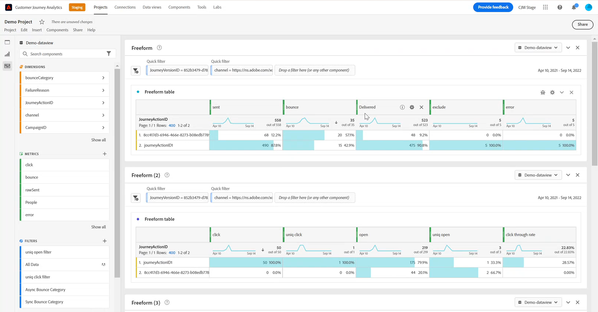

# Konfigurera [!DNL Customer Journey Analytics] manuellt {#cja-ajo}

Integrationen av [!DNL Journey Optimizer] med [!DNL Customer Journey Analytics] ger en helhetsbild av alla dina resor med automatiserad rapportdistribution och anpassade visualiseringar av data.

I följande avsnitt beskrivs hur du manuellt kan utnyttja Journey Optimizer-genererade data för en djupgående analys i Customer Journey Analytics. Observera att denna integrering kan konfigureras automatiskt. [Läs mer](report-gs-cja.md)

När du har skapat din resa i [!DNL Journey Optimizer] kan du importera dina kunddata till [!DNL Customer Journey Analytics] för att starta rapporter och förstå effekten av varje interaktion en kund har med dina resor.

➡️ [Upptäck Customer Journey Analytics](https://experienceleague.adobe.com/en/docs/analytics-platform/using/integrations/ajo#manually-configure-a-data-view-to-be-used-with-journey-optimizer){target="_blank"}

>[!NOTE]
>
>Förutom den här integreringen kan du även exportera innehållet i Adobe Journey Optimizer datamängder till molnlagringsplatser och använda informationen i rapporterings- eller analyssyfte. [Lär dig hur du exporterar datauppsättningar till molnlagringsplatser](../data/export-datasets.md)
>
>Observera att exportfunktionen för datauppsättningar för närvarande är i betaversion och tillgänglig för alla Adobe Journey Optimizer-användare. Kontakta din Adobe-representant om du vill få åtkomst till mål om du inte redan har åtkomst.

Innan du använder [!DNL Customer Journey Analytics] för dina resor måste du konfigurera den här integreringen:

1. [Skapa en anslutning](https://experienceleague.adobe.com/docs/analytics-platform/using/cja-connections/create-connection.html) i [!DNL Customer Journey Analytics] med de **[!UICONTROL Dataset]** som du vill skicka till Adobe Experience Platform.

   Följande [!DNL Journey Optimizer] kan konfigureras:
   * [Resestegshändelse](../data/datasets-query-examples.md#journey-step-event): gör att du kan visa vem som kommer in på dina resor och hur långt de kommer.
   * [Datauppsättningar för meddelandefeedback/spårning](../data/datasets-query-examples.md#message-feedback-event-dataset): gör att du kan visa leveransinformation om meddelanden som skickas via [!DNL Journey Optimizer].
   * [Enhet- och resedatamängder](../data/datasets-query-examples.md#entity-dataset): gör att du kan söka efter egna namn och använda dem i din rapportering.

1. [Skapa en datavy](https://experienceleague.adobe.com/docs/analytics-platform/using/cja-dataviews/create-dataview.html) för att konfigurera de dimensioner och mått som du vill använda för rapporten.

   Ni kan skapa Journey Optimizer-specifika mätvärden för att bättre återspegla era resedata. [Läs mer](https://experienceleague.adobe.com/docs/analytics-platform/using/integrations/ajo.html#configure-the-data-view-to-accommodate-journey-optimizer-dimensions-and-metrics)

Användning av [!DNL Journey Optimizer] med [!DNL Customer Journey Analytics] kan leda till vissa avvikelser i rapporteringsdata som orsakas av:

* **Både [!DNL Journey Optimizer] och [!DNL Customer Journey Analytics] synkroniserar data från Azure Data Lake Storage (ADLS) för rapportering.**

  Bearbetningstiden för inkommande data kan skilja sig något mellan produkterna. På grund av detta kanske data inte matchar när rapporter från ett visst datum visas till den aktuella dagen. Använd datumintervall exklusive den aktuella dagen om du vill minska avvikelsen.

* **I [!DNL Journey Optimizer]-rapporter inkluderar Skickat även Försök igen-mått.**

  **[!UICONTROL Retries]** kommer inte att inkluderas i **[!UICONTROL Sent]**-måttet i [!DNL Customer Journey Analytics]. Detta gör att [!DNL Customer Journey Analytics] **[!UICONTROL Sent]**-mätvärden visar lägre värden än [!DNL Journey Optimizer]. Återförsöksdata konverteras emellertid till **[!UICONTROL Messages successfully sent]**- eller **[!UICONTROL Bounces]**-måttet.
Använd datumintervall från en vecka sedan eller till och med senare för att minska diskrepansen.

* **Rapporter skickas från en annan datakälla.**

  Detta kan leda till dataavvikelser på 1-2 % mellan produkterna.
