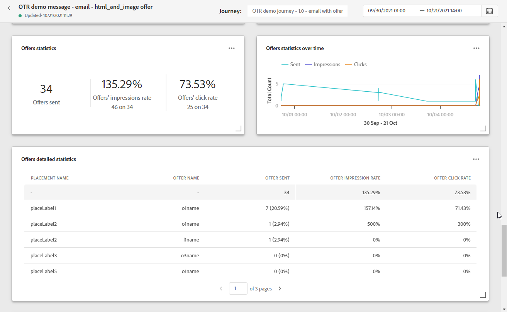

# Global e-postrapport {#email-global-report}

E-postmeddelandet **[!UICONTROL Global report]** avser endast en viss e-postleverans.

Från **[!UICONTROL Executions]** -fliken i **[!UICONTROL Messages]** meny, välja **[!UICONTROL Global view]** väljer du på den avancerade menyn för den valda leveransen **[!UICONTROL Global report]**.

E-postmeddelandet **[!UICONTROL Global report]** är uppdelat i olika widgetar som detaljerat beskriver leveransens framgångar och fel. Varje widget kan storleksändras och tas bort vid behov. Mer information finns i [section](global-report.md#modify-dashboard).

**[!UICONTROL Email performance]** anger huvudinformationen i förhållande till meddelandet med KPI:er:

* **[!UICONTROL Sent]**: Totalt antal försändelser för leveransen.

* **[!UICONTROL Delivery Rate]**: Procentandel meddelanden som har skickats.

* **[!UICONTROL Bounce Rate]**: Procentandel e-postmeddelanden som studsade jämfört med skickade e-postmeddelanden.

* **[!UICONTROL Error Rate]**: Procentandel fel som uppstod under en leverans och som förhindrar att den skickas jämfört med skickade e-postmeddelanden.

* **[!UICONTROL Open Rate]**: Procentandel öppnade meddelanden.

* **[!UICONTROL Click Rate]**: Procentandel klick i en leverans.

* **[!UICONTROL Spam Complaint Rate]**: Procentandel e-postmeddelanden som har markerats som skräppost av mottagare jämfört med levererade meddelanden. Mer information om klagomål finns i [Handbok om bästa praxis för leverans](https://experienceleague.adobe.com/docs/deliverability-learn/deliverability-best-practice-guide/metrics-for-deliverability/complaints.html#metrics-for-deliverability){target=&quot;_blank&quot;}.

* **[!UICONTROL Unsubscribe Rate]**: Procent av unika avbeställningar jämfört med antalet levererade meddelanden. Den här indikatorn är inte beroende av antalet klick på länken för att avbryta prenumerationen, utan baseras på antalet prenumerationer som initierats av mottagarna. Läs mer om hur du säger upp prenumerationen i det här [page](../messages/consent.md).

The **[!UICONTROL Email - Tracking statistics]** innehåller tillgängliga data för mottagaraktivitet för leveransen:

* **[!UICONTROL Opens]**: Antal gånger som leveransen öppnades i en leverans.

* **[!UICONTROL Unique Opens]**: Procent av öppnade leveranser.

* **[!UICONTROL Open Rate]**: Totalt antal öppnade e-postmeddelanden jämfört med antalet levererade e-postmeddelanden.

* **[!UICONTROL Clicks]**: Antal gånger ett innehåll klickades i ett e-postmeddelande.

* **[!UICONTROL Unique Clicks]**:Antal mottagare som klickat på ett innehåll i ett e-postmeddelande.

* **[!UICONTROL Click through rate]**: Procentandel användare som interagerade med resan.

The **[!UICONTROL Sending Statistics]** diagram visar hur framgångsrik leveransen är:

* **[!UICONTROL Delivered]**: Antal meddelanden som har skickats, i relation till det totala antalet skickade meddelanden.

* **[!UICONTROL Bounces]**: Totalt antal fel som sammanställts under leverans och automatisk returbehandling i relation till totalt antal skickade meddelanden.

* **[!UICONTROL Errors]**: Totalt antal fel som uppstod under en leverans och som förhindrar att den skickas till profiler.

The **[!UICONTROL Bounce Reasons]** och **[!UICONTROL Bounce categories]** widgetar innehåller tillgängliga data som är relaterade till studsade meddelanden, som:

* **[!UICONTROL Hard bounce]**: Det totala antalet permanenta fel, t.ex. fel e-postadress. Detta inbegriper ett felmeddelande som uttryckligen anger att adressen är ogiltig, till exempel Okänd användare.

* **[!UICONTROL Soft bounce]**: Det totala antalet tillfälliga fel, t.ex. en fullständig inkorg.

* **[!UICONTROL Ignored]**: Det totala antalet tillfälliga, t.ex. frånvaro, eller ett tekniskt fel, t.ex. om avsändaren är postmaster.

Mer information om studsar finns i [Undertryckningslista](../messages/suppression-list.md) sida.

The **[!UICONTROL Error Reasons]** Med diagram och tabeller kan du se vilket fel som inträffade under leveransen.

The **[!UICONTROL Email - Top recipient domain]** diagram och tabeller visar vilka domäner som är de mest använda av mottagarna för att öppna e-postmeddelandet.

The **[!UICONTROL Email - Top Url]** diagram- och tabellinformation om vilka URL:er från leveransen som är mest besökta.

The **[!UICONTROL Open vs Click]** identifierar mottagarnas interaktion med leveransen:

* **[!UICONTROL Unique Clicks]**:Antal mottagare som klickat på ett innehåll i ett e-postmeddelande.

* **[!UICONTROL Unique Opens]**: Antal mottagare som öppnade leveransen.

<!--

>[!NOTE]
>
>The Offers widgets and metrics are only available if a decision was inserted in an email. For more information on Decision Management, refer to this [page](../offers/get-started/starting-offer-decisioning.md).

The **[!UICONTROL Offers statistic]** and **[!UICONTROL Offers statistics]** over time widgets measure your offer's success and impact on your targeted audience. It detail the main information relative to your message with KPIs:

* **[!UICONTROL Offer sent]**: Total number of sends for the offer.

* **[!UICONTROL Offer impression]**: Number of times the offer was opened in a delivery.

* **[!UICONTROL Offer clicks]**: Number of times an offer was clicked on in a delivery.

The **[!UICONTROL Offers detailed statistic]** table contains the available data for recipient activity with your offer:

* **[!UICONTROL Placement name]**: Name of your placement used to display your offer. For more information on placement, refer to this [page](../offers/offer-library/creating-placements.md).

* **[!UICONTROL Offer name]**: Name of the offer added in the delivery. For more information on placement, refer to this [page](../offers/offer-library/creating-personalized-offers.md).

* **[!UICONTROL Offer sent]**: Total number of sends for the offer.

* **[!UICONTROL Offer impression rate]**: Percentage of opened offers compared to the number of sent offers.

* **[!UICONTROL Offer click rate]**: Percentage of users who interacted with the offer.
-->
>[!NOTE]
>
>Profilerna med **[!UICONTROL Suppressed]** eller **[!UICONTROL Not allowed]** status utelämnas under meddelandesändningsprocessen. Därför är **Reserapporter** visar att dessa profiler har flyttats genom resan ([Läs segment](../building-journeys/read-segment.md) och [Meddelande](../building-journeys/journeys-message.md) verksamhet), **E-postrapporter** kommer inte att inkludera dem i **[!UICONTROL Sent]** mätvärden när de filtreras ut innan e-postmeddelanden skickas.
>
>Läs mer på [Undertryckningslista](../messages/suppression-list.md) och [Tillåtelselista](../messages/allow-list.md). Om du vill ta reda på orsaken till alla undantagsfall kan du använda [Adobe Experience Platform Query Service](https://experienceleague.adobe.com/docs/experience-platform/query/api/getting-started.html){target=&quot;_blank&quot;}.
