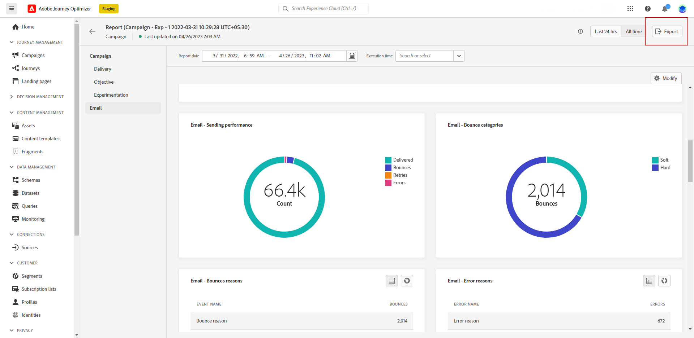

# Kom igång med global rapport {#global-report}

>[!NOTE]
>
> Om anpassade frågor ställs via API:er när du använder frågetjänsten kan du vänta dig en viss fördröjning för dina rapporter.

Använd **[!UICONTROL Global report]** för att mäta effekten av resor och leveranser under en viss tidsperiod.

* Om du vill rikta in dig på en resa eller leveranser i samband med en resa, från **[!UICONTROL Journeys]** -menyn, få åtkomst till din resa och klicka på **[!UICONTROL View report]** -knappen. Du kan sedan hitta de globala rapporterna Resa, E-post, SMS och Push.

  

* Om du vill rikta in en kampanj går du till **[!UICONTROL Campaigns]** öppnar du kampanjen och klickar på **[!UICONTROL Reports]** -knappen.

  

* Om du vill växla från **[!UICONTROL Live report]** till **[!UICONTROL Global report]** för leverans klickar du **[!UICONTROL All time]** i flikväxlaren.

  

En detaljerad lista över alla mätvärden som är tillgängliga i Adobe Journey Optimizer finns på [den här sidan](#list-of-components-global)

## Anpassa kontrollpanelen {#modify-dashboard}

Varje rapportkontrollpanel kan ändras genom att tidsperioden ändras och widgetar storleksändras eller tas bort. Om du ändrar widgetarna påverkas bara den aktuella användarens kontrollpanel. Andra användare ser sina egna kontrollpaneler eller de som har angetts som standard.

1. Välj en start- och sluttid från din globala rapport för att ange specifika data som mål.

   

1. För dina reserapporter som omfattar flera konfigurerade **[!UICONTROL Actions]** väljer du en specifik **[!UICONTROL Action]** i listrutan.

1. Om du bara vill rikta in dig på ett eller flera återkommande meddelanden väljer du det i dialogrutan **[!UICONTROL Execution time]** nedrullningsbar meny.

   

1. Välj om du vill utesluta testhändelser från dina rapporter med hjälp av alternativfältet. Mer information om testhändelser finns i [den här sidan](../building-journeys/testing-the-journey.md).

   Observera att **[!UICONTROL Exclude test events]** alternativet är bara tillgängligt för reserapporter.

   

1. Klicka **[!UICONTROL Modify]** för att börja anpassa kontrollpanelen.

   

1. Justera widgetarnas storlek genom att dra i det nedre högra hörnet.

   

1. Klicka **[!UICONTROL Remove]** för att ta bort widgetar du inte behöver.

   

1. När du är nöjd med visningsordningen och widgetarnas storlek klickar du på **[!UICONTROL Save]**.

1. Om du vill anpassa hur data visas kan du växla mellan olika visualiseringsalternativ, som diagram, tabeller och dondiagram.

   

Kontrollpanelen har sparats. Dina olika ändringar kommer att tillämpas på nytt för en senare användning av dina liverapporter. Använd **[!UICONTROL Reset]** för att återställa standardordningen för widgetar och widgetar.

## Exportera rapporter {#export-reports}

Du kan enkelt exportera dina olika rapporter till PDF eller CSV-format så att du kan dela och skriva ut dem. Hur du exporterar rapporter beskrivs på flikarna nedan.

➡️ [Upptäck den här funktionen i en video](#video-csv)

>[!BEGINTABS]

>[!TAB Exportera rapporten som en CSV-fil]

1. Klicka på **[!UICONTROL Export]** och markera **[!UICONTROL CSV file]** för att generera en CSV-fil på övergripande rapportnivå.

   

1. Du kan också välja att exportera data från en viss widget. Klicka **[!UICONTROL Export widget data to CSV]** bredvid den valda widgeten.

   

1. Filen hämtas automatiskt och kan finnas i dina lokala filer.

   Om du genererade filen på rapportnivå innehåller den detaljerad information för varje widget, inklusive dess titel och data.

   Om du genererade filen på widgetnivå, innehåller den specifikt data för den valda widgeten.

>[!TAB Exportera rapporten som en PDF-fil]

1. Klicka på **[!UICONTROL Export]** och markera **[!UICONTROL PDF file]**.

   

1. Konfigurera dokumentet i utskriftsfönstret efter behov. Observera att alternativen kan variera beroende på vilken webbläsare du använder.

1. Skriv ut eller spara rapporten som PDF.

1. Leta reda på mappen där du vill spara filen, byt namn på den om det behövs och klicka på Spara.

Din rapport är nu tillgänglig för visning eller delning i en PDF-fil.

>[!ENDTABS]

### Exportera rapporter (video) {#video-csv}

Lär dig hur du hämtar en CSV-rapport för en rapport och för en enda widget i följande instruktionsvideo.

>[!VIDEO](https://video.tv.adobe.com/v/3424603?quality=12)

