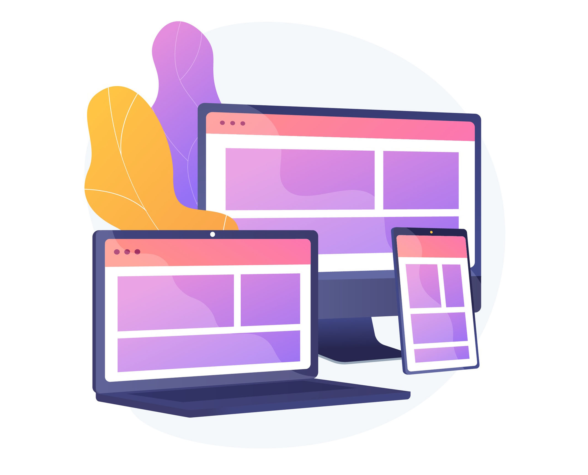

# Kom igång med rapportfunktioner {#get-started-report}

Adobe Journey Optimizer ger er åtgärdbara insikter genom sina kraftfulla rapporteringsfunktioner. Det finns rapporter om kampanjer, resor, landningssidor, prenumerationslistor och mycket annat. Tillgängliga rapporter visas nedan.

För att optimera leveransen av dina [!DNL Journey Optimizer]-upplevelser rekommenderar vi att du använder de bästa metoderna som listas [i det här avsnittet](deliverability.md).

## Typ av rapporter {#reporting-types}

* **De senaste 24 timmarna live-rapporter** - Använd **[!UICONTROL Live report]** för att i realtid mäta och visualisera påverkan och prestanda på dina resor och dina meddelanden i en inbyggd kontrollpanel. Data är tillgängliga i **[!UICONTROL Live report]** så snart din leverans har skickats eller din resa har körts från fliken **[!UICONTROL Last 24hrs]**. Läs mer om live-rapporter [i det här avsnittet](live-report.md).

  

* **Heltidsrapporter med Customer Journey Analytics** - Journey Optimizer rapportering är helt integrerad med Customer Journey Analytics-funktioner, vilket standardiserar rapporteringen på båda plattformarna och förbättrar datakonsekvensen och tillförlitligheten. Denna smidiga integrering mellan Journey Optimizer och Customer Journey Analytics ger en tydligare bild av prestandamätningarna, så att användarna kan fatta mer välgrundade beslut. Läs mer om heltidsrapporter [i det här avsnittet](report-gs-cja.md).

  

  Om du äger en Adobe Customer Journey Analytics-licens kan du analysera dina Journey Optimizer-rapporter till Customer Journey Analytics. Det här kraftfulla alternativet dirigerar dig smidigt om till Customer Journey Analytics-miljön och ger dig möjlighet att personalisera dina rapporter i stor omfattning. Ni kan berika era widgetar med specialiserade Customer Journey Analytics-mätvärden och ta era insikter till en helt ny nivå. [Läs mer](report-cja-manage.md)

## Låt oss dyka djupare

Nu när du har en förståelse för de olika typerna av rapporter i **[!DNL Journey Optimizer]** är det dags att gå djupare in i dessa dokumentationsavsnitt för att lära dig hur du får tillgång till och förstår rapportfunktioner.

<table style="table-layout:fixed"><tr style="border: 0;">
<td>

<strong>RESURSRAPPORTER</strong>

<a href="journey-live-report.md"><strong>Live-rapport</strong></a>

<a href="journey-global-report-cja.md"><strong>Heltidsrapport</strong></a>

<a href="sharing-overview.md"><strong>Skapa reserapporter</strong></a>

</td>
<td>

<strong>KAMPANJRAPPORTER</strong>

<a href="campaign-live-report.md"><strong>Live-rapport</strong></a>

<a href="campaign-global-report-cja.md"><strong>Heltidsrapport</strong></a>

</td>
<td>

<strong>RAPPORTER OM LANDNINGSSIDOR</strong>

<a href="lp-report-live.md"><strong>Live-rapport</strong></a>

<a href="lp-report-global-cja.md"><strong>Heltidsrapport</strong></a>

</td>
<td>

<strong>RAPPORTER OM PRENUMERATIONSLISTA</strong>

<a href="subscription-report-live.md"><strong>Live-rapport</strong></a>

<a href="subscription-report-global-cja.md"><strong>Heltidsrapport</strong></a>

</td>
</tr></table>

Alla globala rapporter är tillgängliga för alla era kanaler. Välj rapporten för den kanal du behöver för att få mer information.

### Rapporter för utgående kanaler

Välj en utgående kanal för att identifiera associerade **globala heltidsrapporter**.

<table style="table-layout:fixed"><tr style="border: 0;">
<td>

<strong>E-postkanal</strong>

<a href="campaign-global-report-cja-email.md"><strong>Kampanjrapport</strong></a>

<a href="journey-global-report-cja-email.md"><strong>Reserapport</strong></a>

</td>
<td>

<strong>SMS-kanal</strong>

<a href="campaign-global-report-cja-sms.md"><strong>Kampanjrapport</strong></a>

<a href="journey-global-report-cja-sms.md"><strong>Reserapport</strong></a>

</td>
<td>

<strong>Push-kanal</strong>

<a href="campaign-global-report-cja-push.md"><strong>Kampanjrapport</strong></a>

<a href="journey-global-report-cja-push.md"><strong>Reserapport</strong></a>

</td>
<td>

<strong>Direktpostkanal</strong>

<a href="campaign-global-report-cja-direct.md"><strong>Kampanjrapport</strong></a>

<a href="journey-global-report-cja-direct.md"><strong>Reserapport</strong></a>

</td>
</tr></table>

### Rapporter om inkommande upplevelser

Välj en inkommande upplevelse för att identifiera associerade **globala heltidsrapporter**.

<table style="table-layout:fixed"><tr style="border: 0;">
<td>

<strong>Kanal i appen</strong>

<a href="campaign-global-report-cja-inapp.md"><strong>Kampanjrapport</strong></a>

<a href="journey-global-report-cja-inapp.md"><strong>Reserapport</strong></a>

</td>
<td>

<strong>Webbkanal</strong>

<a href="campaign-global-report-cja-web.md"><strong>Kampanjrapport</strong></a>

<a href="journey-global-report-cja-web.md"><strong>Reserapport</strong></a>

</td>
<td>

<strong>Kodbaserade upplevelser</strong>

<a href="campaign-global-report-cja-code.md"><strong>Kampanjrapport</strong></a>

<a href="campaign-global-report-cja-code.md"><strong>Reserapport</strong></a>

</td>
<td>

<strong>Innehållskort</strong>

<a href="campaign-global-report-cja-content.md"><strong>Kampanjrapport</strong></a>

<a href="journey-global-report-cja-content.md"><strong>Reserapport</strong></a>

</td>
</tr></table>

### Instruktionsvideo {#video}

Lär dig hur du effektivt använder Heltidsrapporten i Adobe Journey Optimizer.

+++Se videon

>[!VIDEO](https://video.tv.adobe.com/v/3420509?learn=on)

+++

Utforska fler videosjälvstudiekurser om rapportering och analys i [Rapportturser](https://experienceleague.adobe.com/sv/docs/journey-optimizer-learn/tutorials/report-and-monitor/report-and-monitor){target="_blank"}
