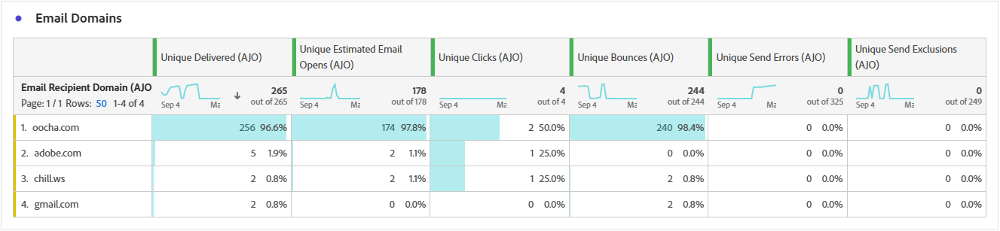

# Rapport om e-postresa {#journey-global-report}

>[!INFO]
>
>Eftersom Apple har infört nya funktioner för integritetsskydd för sin egen e-postapp, bland annat skydd av personuppgifter, kan avsändare inte längre använda spårningspixlar för att samla in data om profiler som har aktiverat Apple skydd av personuppgifter. Därför kan Adobe Journey Optimizer förmåga att spåra e-postöppningar med hjälp av spårningspixlar påverkas.
> [Läs mer](https://experienceleaguecommunities.adobe.com/t5/adobe-campaign-classic-blogs/the-impact-of-apple-ios-privacy-changes-on-email-marketing-and/ba-p/699780?profile.language=sv) om hur Apple iOS sekretessändringar påverkar e-postmarknadsföringen.
> 
> Vi rekommenderar att ni fokuserar på klick och konverteringsvärden i stället för öppna frekvenser för mer korrekta insikter.

>[!BEGINSHADEBOX]

Du kommer åt din e-postreserapport genom att klicka på knappen **[!UICONTROL View report]** under din resa. [Läs mer](report-gs-cja.md)

>[!ENDSHADEBOX]

## Levererat kontra klicktrend {#delivered-click}

Diagrammet **[!UICONTROL Delivered vs Click trend]** innehåller en detaljerad analys av hur era profiler interagerar med era e-postmeddelanden och ger värdefulla insikter om hur olika domäner interagerar med ert innehåll.

+++ Läs mer om Levererade jämfört med klicktrendstatistik

* **[!UICONTROL Delivered]**: Antal e-postmeddelanden som har skickats, i relation till det totala antalet skickade e-postmeddelanden.

* **[!UICONTROL Clicks]**: Antal gånger som ett innehåll klickades på i dina e-postmeddelanden.

+++

## Leveransstatus {#delivery-status}

I diagrammet **[!UICONTROL Delivery status]** kan du snabbt se hur dina e-postmeddelanden fungerar. Spåra viktiga mätvärden som leveranser och studsar, så att ni snabbt kan förstå hur effektiv e-postresan är.

+++ Läs mer om leveransstatusvärden

* **[!UICONTROL Delivered]**: Antal e-postmeddelanden som har skickats, i relation till det totala antalet skickade e-postmeddelanden.

* **[!UICONTROL Bounces for outbound channels]**: Totalt antal fel som har ackumulerats under sändningsprocessen och automatisk returbearbetning i relation till totalt antal skickade meddelanden.

* **[!UICONTROL Outbound errors]**: Totalt antal fel som uppstod under en sändningsprocess och som förhindrar att den skickas till profiler.

* **[!UICONTROL Excluded]**: Antal profiler som har undantagits av Adobe Journey Optimizer.

+++

## Skicka statistik {#email-sending-statistics}

Tabellen **[!UICONTROL Sending Statistics]** ger en tydlig bild av hur dina e-postmeddelanden fungerar på dina resor. Den håller koll på viktiga mätvärden som leveransfrekvenser och interaktioner och ger er värdefulla insikter för att optimera er e-poststrategi för bättre räckvidd och engagemang.

+++ Läs mer om att skicka statistik

* **[!UICONTROL Targeted]**: Totalt antal e-postmeddelanden som bearbetats under sändningsprocessen.

* **[!UICONTROL Sends]**: Totalt antal skickade meddelanden för din e-post.

* **[!UICONTROL Delivered]**: Antal e-postmeddelanden som har skickats, i relation till det totala antalet skickade meddelanden.

* **[!UICONTROL Unique Delivered]**: Antal profiler som har tagit emot minst ett e-postmeddelande.

* **[!UICONTROL Bounces for outbound channels]**: Totalt antal fel som har ackumulerats under sändningsprocessen och automatisk returbearbetning i relation till totalt antal skickade meddelanden.

* **[!UICONTROL Outbound Errors]**: Totalt antal fel som uppstod under sändningsprocessen och som förhindrar att den skickas till profiler.

* **[!UICONTROL Outbound Exclusions]**: Antal profiler som har undantagits av Adobe Journey Optimizer.

+++

## E-post - Spårningsstatistik {#email-tracking}

Tabellen **[!UICONTROL Email - Tracking statistics]** innehåller en detaljerad redovisning av profilaktivitet som rör e-postmeddelanden som ingår i din resa. Detta inkluderar mätvärden för öppningar, klick och andra relevanta interaktionsindikatorer, som ger en heltäckande bild av hur profiler interagerar med ert e-postinnehåll.

+++ Läs mer om statistik för spårning

* **[!UICONTROL Click through rate (CTR)]**: Procentandel användare som interagerade med e-postmeddelandet.

* **[!UICONTROL Click through open rate (CTOR)]**: Antal gånger som e-postmeddelandet öppnades.

* **[!UICONTROL Clicks]**: Antal gånger som ett innehåll klickades på i dina e-postmeddelanden.

* **[!UICONTROL Unique Clicks]**: Antal profiler som klickat på ett innehåll i ett e-postmeddelande.

* **[!UICONTROL Email Opens]**: Antal gånger som dina e-postmeddelanden öppnats i en kampanj.

* **[!UICONTROL Unique Email Opens]**: Antal profiler som öppnade e-postmeddelanden.

* **[!UICONTROL Spam complaints]**: Antal gånger ett meddelande har deklarerats som skräppost eller skräppost.

* **[!UICONTROL Unsubscribes]**: Antal klick på länken för att avbryta prenumerationen.

* **[!UICONTROL Unique Email Unsubscribes]**: Antal profiler som avbröt prenumerationen på dina e-postmeddelanden.
+++

## E-postdomäner {#email-domains}

Tabellen **[!UICONTROL Email Domains]** innehåller en detaljerad beskrivning av e-postmeddelanden kategoriserade efter domän, vilket ger omfattande insikter om prestandamätningarna för dina e-postresor. Denna omfattande analys gör att ni kan förstå beteendet hos olika domäner som svar på ert e-postinnehåll.

+++ Läs mer om mätvärden för e-postdomäner

* **[!UICONTROL Sends]**: Totalt antal skickade meddelanden för din e-post.

* **[!UICONTROL Delivered]**: Antal e-postmeddelanden som har skickats, i relation till det totala antalet skickade e-postmeddelanden.

* **[!UICONTROL Email Opens]**: Antal gånger som dina e-postmeddelanden öppnats under en resa.

* **[!UICONTROL Clicks]**: Antal gånger som ett innehåll klickades på i dina e-postmeddelanden.

* **[!UICONTROL Bounces for outbound channels]**: Totalt antal fel som har ackumulerats under sändningsprocessen och automatisk returbearbetning i relation till totalt antal skickade e-postmeddelanden.

* **[!UICONTROL Outbound Errors]**: Totalt antal fel som uppstod under sändningsprocessen och som förhindrar att den skickas till profiler.

* **[!UICONTROL Outbound Exclusions]**: Antal profiler som har undantagits av Adobe Journey Optimizer.

+++

## Spårade länketiketter {#track-link-label}

Tabellen **[!UICONTROL Tracked link labels]** innehåller en omfattande översikt över länketiketterna i dina e-postmeddelanden, som visar vilka som genererar störst besökstrafik. Med den här funktionen kan du identifiera och prioritera de mest populära länkarna.

+++ Läs mer om mätvärden för spårade länketiketter

* **[!UICONTROL Unique Clicks]**: Antal profiler som klickat på ett innehåll i ett e-postmeddelande.

* **[!UICONTROL Clicks]**: Antal gånger som ett innehåll klickades på i dina e-postmeddelanden.

+++

## URL för spårad länk {#track-link-url}

Tabellen **[!UICONTROL Tracked link URLs]** innehåller en omfattande översikt över de URL:er i ditt e-postmeddelande som lockar den högsta besökstrafiken. På så sätt kan ni identifiera och prioritera de mest populära länkarna och öka er förståelse för hur proffsen interagerar med specifikt innehåll i era e-postmeddelanden.

+++ Läs mer om URL-mått för spårad länk

* **[!UICONTROL Unique Clicks]**: Antal profiler som klickat på ett innehåll i ett e-postmeddelande.

* **[!UICONTROL Clicks]**: Antal gånger som ett innehåll klickades på i dina e-postmeddelanden.

+++

## E-postämnen {#email-subject}

Tabellen **[!UICONTROL Email subjects]** innehåller en grundlig översikt över e-postämnen som har fått den högsta besökstrafiken. Den här resursen ger värdefulla insikter om målgruppsengagemangets dynamik.

+++ Läs mer om ämnesstatistik för e-post

* **[!UICONTROL Delivered]**: Antal e-postmeddelanden som har skickats, i relation till det totala antalet skickade e-postmeddelanden.

* **[!UICONTROL Unique Delivered]**: Antal distinkta profiler som lyckades ta emot minst ett e-postmeddelande, vilket säkerställer att dubbletter inte räknas.
+++

## Brytningsorsaker {#email-bounce-reasons}

Tabellen **[!UICONTROL Bounce Reasons]** kompilerar tillgängliga data som är relaterade till studsade meddelanden och ger detaljerade insikter om de specifika orsakerna bakom e-poststudsar.

Mer information om studsar finns på sidan [Suppressionslista](../reports/suppression-list.md).

## Undantagna orsaker {#email-excluded}

Tabellen **[!UICONTROL Excluded reasons]** ger en heltäckande bild av de olika faktorer som har lett till att användarprofiler har exkluderats från målgruppen, vilket leder till att meddelandet inte tas emot.

Se [den här sidan](exclusion-list.md) för en utförlig lista över orsaker till undantag.

## Felorsaker {#email-errors}

Tabellen **[!UICONTROL Error Reasons]** ger synlighet för de specifika fel som uppstod under sändningsprocessen, vilket ger värdefull information om felens art och förekomst.
