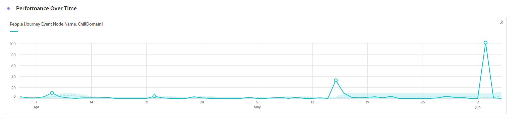
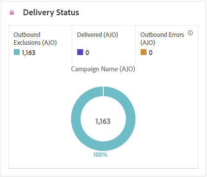

# Reserapport {#journey-global-report}

The **Reserapport** fungerar som en heltäckande kontrollpanel, som tillhandahåller en analys av viktig information som hör till din resa. Detta omfattar detaljer som antalet inskrivna profiler och förekomster av misslyckade enskilda resor, vilket ger en heltäckande insikt i hur effektiv resan är och hur hög engagemanget är.

**Reserapport** kan nås direkt från din resa med **[!UICONTROL View report]** -knappen.

The **[!UICONTROL Journey report]** Sidan visas med följande flikar beroende på vilka meddelanden som visas under din resa:

* [Resa](#journey-global)
* [E-post](#email-global)
* [Push](#push-global)
* [SMS](#sms-global)
* [I appen](#in-app-global)
* [Webb](#web-cja)
* [Direktmeddelande](#direct-mail-cja)

Mer information om arbetsytan i Customer Journey Analytics och hur du filtrerar och analyserar data finns i [den här sidan](https://experienceleague.adobe.com/en/docs/analytics-platform/using/cja-workspace/home).

## Reseöversikt {#journey-global}

The **[!UICONTROL Journey]** rapporten ger en tydlig bild av de viktigaste spårningsdata som rör kundresan.

### KPI:er för resan {#journey-perfomance}

The **[!UICONTROL Journey]** KPI (Key Performance Indicators) fungerar som en heltäckande kontrollpanel som ger en analys av viktig statistik som är kopplad till din resa. Detta omfattar detaljer som antalet inskrivna profiler och förekomster av misslyckade enskilda resor, vilket ger en heltäckande insikt i hur effektiv resan är och hur hög engagemanget är.

+++ Läs mer om nyckeltal för resan

* **[!UICONTROL Journey engagement]**: Totalt antal personer som interagerat med de meddelanden som skickats från resan

* **[!UICONTROL Journey enters]**: Totalt antal personer som har nått ingångshändelsen för resan.

* **[!UICONTROL Journey exits]**: Totalt antal personer som avbrutit resan.

* **[!UICONTROL Journey failures]**: Totalt antal enskilda resor som inte slutfördes.

+++

### Resestatistik {#journey-stats}

The **[!UICONTROL Journey Statistics]** tabellen innehåller en detaljerad sammanfattning av viktiga uppgifter om era resor. Det innehåller viktiga mätvärden som antalet misslyckanden och lyckade tävlingsbidrag, som ger värdefulla insikter om hur väl era e-postmeddelanden och resor fungerar och når ut.

+++ Läs mer om statistik om resan

* **[!UICONTROL Journey engagement]**: Totalt antal personer som interagerat med de meddelanden som skickats från resan.

* **[!UICONTROL Journey enters]**: Totalt antal personer som har nått ingångshändelsen för resan.

* **[!UICONTROL Journey exits]**: Totalt antal personer som avbrutit resan.

* **[!UICONTROL Journey failures]**: Totalt antal enskilda resor som inte slutfördes.

* **[!UICONTROL Unique Journey enters]**: Totalt antal individer som har nått ingångshändelsen för resan tas inte hänsyn till flera interaktioner för en profil.

* **[!UICONTROL Unique Journey exits]**: Totalt antal personer som avbrutit resan tas ingen hänsyn till flera interaktioner i en profil.

* **[!UICONTROL Unique Journey failures]**: Totalt antal enskilda resor som inte har utförts, flera interaktioner i en profil beaktas inte.

+++

## Reseduk {#journey-canvas}

The **[!UICONTROL Journey Canvas]** Med widgeten kan du visuellt spåra sökvägen för dina målprofiler när de navigerar genom din resa.

Förbättra anpassningen av arbetsytan med följande alternativ:

* Lägg till eller ta bort önskad aktivitetstyp, till exempel meddelanden eller villkor, från **[!UICONTROL Node type]** listruta.
* Justera **[!UICONTROL Percentage value]** fastställa flödesfördelningen mellan olika resvägar.
* Anpassa **[!UICONTROL Arrow settings]** om du vill inkludera etiketter, villkor eller välja en ren skärm.
* Aktivera **[!UICONTROL Show fallout]** för att visualisera profiler som slutade din resa direkt på arbetsytan.

## Åtgärdens prestanda {#action-performance}

### Prestanda över tid {#action-overtime}

The **[!UICONTROL Performance Over time]** Med diagram kan du identifiera och analysera antalet profiler som uppfyller kriterierna för att betraktas som målprofiler för dina åtgärder. Denna visualisering ger värdefulla insikter om hur effektiva era strategier är och hjälper er att fatta datadrivna beslut för att optimera er prestanda.

### Åtgärdsöversikt {#action-overview}

The **[!UICONTROL Action overview]** tabellen fungerar som en omfattande kontrollpanel som innehåller en analys av viktiga mätvärden som är relaterade till kundresan. Detta inkluderar viktiga detaljer som antalet interaktioner och klickfrekvensen

+++ Läs mer om mätvärden i Åtgärdsöversikt

* **[!UICONTROL People]**: Antal användarprofiler som kvalificerar sig som målprofiler för dina åtgärder.

* **[!UICONTROL Click trough rate]**: Procentandel användare som interagerade med åtgärden.

* **[!UICONTROL Clicks]**: Antal gånger ett innehåll klickades på i dina åtgärder.

* **[!UICONTROL Delivered]**: Antal åtgärder som har skickats, i relation till det totala antalet skickade åtgärder.

+++

## Händelseprestanda {#events-performance}

### Prestanda över tid {#event-overtime}

The **[!UICONTROL Performance over time]** Med diagram kan du identifiera och analysera antalet profiler som kvalificerar sig som målprofiler för dina händelser. Detta kraftfulla verktyg hjälper er att spåra trender och mönster över tid och ger värdefulla insikter för att optimera era era händelsestrategier.

### Översikt över händelser {#event-overview}

The **[!UICONTROL Event overview]** tabellen visar hur många profiler som uppfyller dina händelsekriterier över tid. Det här verktyget hjälper dig att identifiera mönster i kvalificeringsgrader för att förfina din händelsestrategi.

+++ Läs mer om statistik om resan

* **[!UICONTROL People]**: Antal användarprofiler som kvalificerar sig som målprofiler för dina händelser.

+++

## E-postinformation {#email-global}

Från din reserapport **[!UICONTROL Email]** fliken innehåller huvudinformationen om de e-postmeddelanden som skickas under din resa.

### Levererat kontra klicktrend {#delivered-click}

The **[!UICONTROL Delivered vs Click trend]** diagram ger en detaljerad analys av hur era profiler interagerar med era e-postmeddelanden, och ger värdefulla insikter om hur olika domäner interagerar med ert innehåll.

+++ Läs mer om Levererat jämfört med Click-trendstatistik

* **[!UICONTROL Delivered]**: Antal e-postmeddelanden som skickats, i relation till det totala antalet skickade e-postmeddelanden.

* **[!UICONTROL Clicks]**: Antal gånger som ett innehåll klickades på i dina e-postmeddelanden.

+++

### Leveransstatus {#delivery-status}

The **[!UICONTROL Delivery status]** Med diagram kan du snabbt se hur e-postmeddelanden fungerar. Spåra viktiga mätvärden som leveranser och studsar, så att ni snabbt kan förstå hur effektiv e-postresan är.

+++ Läs mer om leveransstatusvärden

* **[!UICONTROL Delivered]**: Antal e-postmeddelanden som skickats, i relation till det totala antalet skickade e-postmeddelanden.

* **[!UICONTROL Bounces for outbound channels]**: Totalt antal fel som har ackumulerats under sändningsprocessen och automatisk returbearbetning i relation till det totala antalet skickade meddelanden.

* **[!UICONTROL Outbound errors]**: Totalt antal fel som uppstod under en sändningsprocess och som förhindrar att den skickas till profiler.

* **[!UICONTROL Excluded]**: Antal profiler som har uteslutits av Adobe Journey Optimizer.

+++

### Skicka statistik {#email-sending-statistics}

The **[!UICONTROL Sending Statistics]** tabellen ger en tydlig bild av hur era e-postmeddelanden fungerar på era resor. Den håller koll på viktiga mätvärden som leveransfrekvenser och interaktioner och ger er värdefulla insikter för att optimera er e-poststrategi för bättre räckvidd och engagemang.

+++ Läs mer om Skicka statistik-statistik

* **[!UICONTROL People]**: Antal användarprofiler som kvalificerar sig som målprofiler för dina meddelanden.

* **[!UICONTROL Targeted]**: Totalt antal bearbetade e-postmeddelanden under sändningsprocessen.

* **[!UICONTROL Sends]**: Totalt antal skickade meddelanden för din e-post.

* **[!UICONTROL Delivered]**: Antal e-postmeddelanden som har skickats, i relation till det totala antalet skickade meddelanden.

* **[!UICONTROL Bounces]**: Totalt antal fel som har ackumulerats under sändningsprocessen och automatisk returbearbetning i relation till det totala antalet skickade meddelanden.

* **[!UICONTROL Outbound Errors]**: Totalt antal fel som uppstod under sändningsprocessen och som förhindrar att den skickas till profiler.

* **[!UICONTROL Outbound Exclusions]**: Antal profiler som har uteslutits av Adobe Journey Optimizer.

+++

### E-post - Spårningsstatistik {#email-tracking}

The **[!UICONTROL Email - Tracking statistics]** tabellen ger en detaljerad redovisning av profilaktivitet som rör e-post som ingår i din resa. Detta inkluderar mätvärden för öppningar, klick och andra relevanta interaktionsindikatorer, som ger en heltäckande bild av hur profiler interagerar med ert e-postinnehåll.

+++ Läs mer om statistik för spårning

* **[!UICONTROL Click through rate (CTR)]**: Procentandel användare som interagerade med e-postmeddelandet.

* **[!UICONTROL Click-through open rate (CTOR)]**: Antal gånger som e-postmeddelandet öppnades.

* **[!UICONTROL Clicks]**: Antal gånger som ett innehåll klickades på i dina e-postmeddelanden.

* **[!UICONTROL Unique Clicks]**: Antal profiler som klickat på ett innehåll i ett e-postmeddelande.

* **[!UICONTROL Email Opens]**: Antal gånger dina e-postmeddelanden öppnats under en resa.

* **[!UICONTROL Unique Email Opens]**: Procentandel öppnade e-postmeddelanden.

* **[!UICONTROL Spam complaints]**: Antal gånger ett meddelande har deklarerats som skräppost eller skräppost.

* **[!UICONTROL Unsubscribes]**: Antal klick på länken för att avbryta prenumerationen.

+++

### E-postdomäner {#email-domains}

The **[!UICONTROL Email Domains]** tabellen ger en detaljerad beskrivning av e-postmeddelanden kategoriserade efter domän, vilket ger omfattande insikter om prestandamätningarna i era e-postresor. Denna omfattande analys gör att ni kan förstå beteendet hos olika domäner som svar på ert e-postinnehåll.

+++ Läs mer om mätvärden för e-postdomäner

* **[!UICONTROL Sends]**: Totalt antal skickade meddelanden för din e-post.

* **[!UICONTROL Delivered]**: Antal e-postmeddelanden som skickats, i relation till det totala antalet skickade e-postmeddelanden.

* **[!UICONTROL Email Opens]**: Antal gånger dina e-postmeddelanden öppnats under en resa.

* **[!UICONTROL Clicks]**: Antal gånger som ett innehåll klickades på i dina e-postmeddelanden.

* **[!UICONTROL Bounces for outbound channels]**: Totalt antal fel som sammanställts under sändningsprocessen och automatisk returbehandling i relation till det totala antalet skickade e-postmeddelanden.

* **[!UICONTROL Outbound Errors]**: Totalt antal fel som uppstod under sändningsprocessen och som förhindrar att den skickas till profiler.
+++

### Spårade länketiketter {#track-link-label}

The **[!UICONTROL Tracked link labels]** tabellen ger en omfattande översikt över länketiketterna i e-postmeddelandena, som visar vilka som genererar störst besökstrafik. Med den här funktionen kan du identifiera och prioritera de mest populära länkarna.

+++ Läs mer om mätvärden för spårade länketiketter

* **[!UICONTROL Unique Clicks]**: Antal profiler som klickat på ett innehåll i ett e-postmeddelande.

* **[!UICONTROL Clicks]**: Antal gånger som ett innehåll klickades på i dina e-postmeddelanden.

+++

### URL för spårad länk {#track-link-url}

The **[!UICONTROL Tracked link URLs]** tabellen innehåller en omfattande översikt över de URL:er i e-postmeddelandet som lockar till sig den högsta besökstrafiken. På så sätt kan ni identifiera och prioritera de mest populära länkarna och öka er förståelse för hur proffsen interagerar med specifikt innehåll i era e-postmeddelanden.

+++ Läs mer om URL:er för spårade länkar

* **[!UICONTROL Unique Clicks]**: Antal profiler som klickat på ett innehåll i ett e-postmeddelande.

* **[!UICONTROL Clicks]**: Antal gånger som ett innehåll klickades på i dina e-postmeddelanden.

* **[!UICONTROL Displays]**: Antal gånger som meddelandet öppnades.

* **[!UICONTROL Unique displays]**: Antal gånger som meddelandet öppnades beaktas inte flera interaktioner för en profil.

+++

### E-postämnen {#email-subject}

The **[!UICONTROL Email subjects]**  tabellen innehåller en detaljerad översikt över e-postämnen som har fått den högsta besökstrafiken. Den här resursen ger värdefulla insikter om målgruppsengagemangets dynamik.

+++ Läs mer om ämnesstatistik för e-post

* **[!UICONTROL People]**: Antal användarprofiler som kvalificerar sig som målprofiler för dina e-postmeddelanden.

+++

### Brytningsorsaker {#email-bounce-reasons}

The **[!UICONTROL Bounce Reasons]** tabellen sammanställer tillgängliga data för studsade meddelanden och ger detaljerade insikter om de specifika orsakerna till e-poststudenterna.

Mer information om studsar finns i [Undertryckningslista](../reports/suppression-list.md) sida.

### Undantagna orsaker {#email-excluded}

The **[!UICONTROL Excluded reasons]** tabellen ger en heltäckande bild av de olika faktorer som ledde till att användarprofiler exkluderades från målgruppen, vilket ledde till att meddelandet inte togs emot.

Se [den här sidan](exclusion-list.md) En fullständig förteckning över orsaker till uteslutning.

### Felorsaker {#email-errors}

The **[!UICONTROL Error Reasons]** tabellen ger dig insyn i de specifika fel som uppstod under sändningsprocessen och ger värdefull information om felens art och förekomst.

## Fliken Push-meddelanden {#push-global}

Från din reserapport **[!UICONTROL Push notification]** -fliken innehåller huvudinformationen i förhållande till push-meddelanden som skickas under din resa.

## Push-meddelande {#push-notification}

### Skicka statistik {#sending-statistics-push}

The **[!UICONTROL Sending Statistics]** tabellen hjälper dig att förstå hur push-meddelanden fungerar. Det innehåller viktiga mätvärden som leveransfrekvens och målgruppsstorlek som ger er värdefulla insikter om hur effektiva och omfattande era resor är.

+++ Läs mer om Skicka statistik-statistik

* **[!UICONTROL People]**: Antal användarprofiler som kvalificerar sig som målprofiler för dina SMS-meddelanden.

* **[!UICONTROL Targeted]**: Totalt antal push-meddelanden som bearbetats under analysen.

* **[!UICONTROL Sends]**: Totalt antal överföringar för push-meddelanden.

* **[!UICONTROL Delivered]**: Antal push-meddelanden som har skickats, i relation till det totala antalet skickade push-meddelanden.

* **[!UICONTROL Bounces for outbound channels]**: Totalt antal fel som har ackumulerats under sändningsprocessen och automatisk returbearbetning i relation till totalt antal push-meddelanden.

* **[!UICONTROL Outbound errors]**: Totalt antal fel som har inträffat som förhindrar att den skickas till profiler.

* **[!UICONTROL Outbound exclusions]**: Antal profiler som har uteslutits av Adobe Journey Optimizer.

+++

### Spårningsstatistik {#tracking-statistics-push}

The **[!UICONTROL Tracking statistics]** tabellen ger en detaljerad ögonblicksbild av profilaktivitet som är kopplad till dina push-meddelanden, och ger viktiga insikter om engagemang och push-meddelandenas effektivitet.

+++ Läs mer om statistik för spårning

* **[!UICONTROL Click through rate (CTR)]**: Procentandel användare som interagerade med push-meddelandet.

* **[!UICONTROL Clickthrough open rate (CTOR)]**: Antal gånger push-meddelandet öppnades.

* **[!UICONTROL Clicks]**: Antal gånger som ett innehåll klickades på i ditt push-meddelande.

* **[!UICONTROL Unique Clicks]**: Antal profiler som klickat på ett innehåll i ditt push-meddelande.

<!--
* **[!UICONTROL Push custom actions]**: 
-->
+++

### Spårade länketiketter {#track-link-label-push}

The **[!UICONTROL Tracked link labels]** tabellen ger en omfattande översikt över de länketiketter som finns i push-meddelandena, och markerar de som genererar den högsta besökstrafiken. Med den här funktionen kan du identifiera och prioritera de mest populära länkarna.

+++ Läs mer om mätvärden för spårade länketiketter

* **[!UICONTROL Unique Clicks]**: Antal profiler som klickat på ett innehåll i dina push-meddelanden.

* **[!UICONTROL Clicks]**: Antal gånger som ett innehåll klickades på i dina push-meddelanden.

+++

### URL för spårad länk {#track-link-url-push}

The **[!UICONTROL Tracked link URLs]** tabellen ger en omfattande översikt över de URL:er i push-meddelanden som lockar till sig den högsta besökstrafiken. På så sätt kan ni identifiera och prioritera de populäraste länkarna och öka er förståelse för hur proffsen interagerar med specifikt innehåll i era push-meddelanden.

+++ Läs mer om URL:er för spårade länkar

* **[!UICONTROL Unique Clicks]**: Antal profiler som klickat på ett innehåll i dina push-meddelanden.

* **[!UICONTROL Clicks]**: Antal gånger som ett innehåll klickades på i dina push-meddelanden.

+++

### Brytningsorsaker {#bounce-reasons-push}

The **[!UICONTROL Bounces Reasons]** tabellen ger en omfattande översikt över data relaterade till studsade push-meddelanden, och ger värdefulla insikter om de specifika orsakerna bakom instanser av push-meddelanden.

### Felorsaker {#error-reasons-push}

The **[!UICONTROL Error Reasons]** I tabellen kan du identifiera de specifika fel som uppstod under sändningsprocessen för push-meddelanden, vilket underlättar en grundlig analys av eventuella problem som uppstått.

### Undantagna orsaker {#exclude-reasons-push}

The **[!UICONTROL Exclude Reasons]** tabellen visar de olika faktorer som ledde till att användarprofiler exkluderades från målgruppen, vilket förhindrar dem från att ta emot push-meddelanden.

Se [den här sidan](exclusion-list.md) En fullständig förteckning över orsaker till uteslutning.

## SMS {#sms}

### Levererat kontra klicktrend {#delivered-click-sms}

The **[!UICONTROL Delivered vs Click trend]** diagram ger en detaljerad analys av hur era profiler interagerar med ert SMS-meddelande och ger värdefulla insikter om hur olika domäner interagerar med ert innehåll.

+++ Läs mer om Levererat jämfört med Click-trendstatistik

* **[!UICONTROL Delivered]**: Antal SMS-meddelanden som skickats, i relation till totalt antal SMS-meddelanden.

* **[!UICONTROL Clicks]**: Antal gånger som ett innehåll klickades på i SMS-meddelanden.

+++

### Leveransstatus {#delivery-status-sms}

The **[!UICONTROL Delivery status]** tabellen ger en detaljerad redovisning av profilaktivitet som rör dina SMS-meddelanden. Detta inkluderar mätvärden för levererade data, klickningar och andra relevanta interaktionsindikatorer, som ger en heltäckande bild av hur profiler interagerar med ert SMS-innehåll.

+++ Läs mer om leveransstatusvärden

* **[!UICONTROL Delivered]**: Antal SMS-meddelanden som skickats, i relation till totalt antal SMS-meddelanden.

* **[!UICONTROL Bounces for outbound channels]**: Totalt antal fel som sammanställts under sändningsprocessen och automatisk returbehandling i relation till det totala antalet skickade SMS-meddelanden.

* **[!UICONTROL Outbound errors]**: Totalt antal fel som har inträffat som förhindrar att den skickas till profiler.

* **[!UICONTROL Outbound exclusions]**: Antal profiler som har uteslutits av Adobe Journey Optimizer.

+++

### Spårade länketiketter {#track-link-label-sms}

The **[!UICONTROL Tracked link labels]** tabellen ger en omfattande översikt över de länketiketter som finns i SMS-meddelanden, där de som genererar störst besökstrafik markeras. Med den här funktionen kan du identifiera och prioritera de mest populära länkarna.

+++ Läs mer om mätvärden för spårade länketiketter

* **[!UICONTROL Unique Clicks]**: Antal profiler som klickade på ett innehåll i SMS-meddelandet.

* **[!UICONTROL Clicks]**: Antal gånger som ett innehåll klickades på i SMS-meddelanden.

+++

### URL för spårad länk {#track-link-url-sms}

The **[!UICONTROL Tracked link URLs]** tabellen ger en omfattande översikt över de URL:er i SMS-meddelanden som lockar den högsta besökstrafiken. På så sätt kan ni identifiera och prioritera de mest populära länkarna och öka er förståelse för hur proffsen interagerar med specifikt innehåll i era SMS-meddelanden.

+++ Läs mer om URL:er för spårade länkar

* **[!UICONTROL Unique Clicks]**: Antal profiler som klickade på ett innehåll i SMS-meddelandet.

* **[!UICONTROL Clicks]**: Antal gånger som ett innehåll klickades på i SMS-meddelanden.

* **[!UICONTROL Displays]**: Antal gånger som meddelandet öppnades.

* **[!UICONTROL Unique displays]**: Antal gånger som meddelandet öppnades beaktas inte flera interaktioner för en profil.

+++

### SMS inkommande meddelande {#sms-inbound}

The **[!UICONTROL SMS inbound message]** tabellen ger en detaljerad översikt över vilka SMS-meddelanden som har dragit till sig den högsta besökstrafiken. Den här resursen ger värdefulla insikter om målgruppsengagemangets dynamik.

+++ Läs mer om mätvärden för inkommande SMS-meddelanden

* **[!UICONTROL People]**: Antal användarprofiler som kvalificerar sig som målprofiler för dina SMS-meddelanden.

+++

### SMS-meddelandetyp {#sms-message-type}

The **[!UICONTROL SMS Message type]** tabellen ger en detaljerad översikt över vilken SMS-meddelandetyp som har dragit till sig den högsta besökstrafiken. Den här resursen ger värdefulla insikter om målgruppsengagemangets dynamik.

+++ Läs mer om mätvärden för SMS-meddelandetyp

* **[!UICONTROL People]**: Antal användarprofiler som kvalificerar sig som målprofiler för dina SMS-meddelanden.

+++

### SMS-leverantörer {#sms-providers}

The **[!UICONTROL SMS providers]** tabellen ger en detaljerad översikt över vilka SMS-leverantörer som har dragit till sig den högsta besökstrafiken. Den här resursen ger värdefulla insikter om målgruppsengagemangets dynamik.

+++ Läs mer om mätvärden för SMS-leverantörer

* **[!UICONTROL People]**: Antal användarprofiler som kvalificerar sig som målprofiler för dina SMS-meddelanden.

+++

### Brytningsorsaker {#bounce-reasons-sms}

The **[!UICONTROL Bounces Reasons]** tabellen ger en omfattande översikt över data relaterade till studsade SMS-meddelanden och ger värdefulla insikter om de specifika orsakerna bakom instanser av SMS-meddelandegränser.

### Felorsaker {#error-reasons-sms}

The **[!UICONTROL Error Reasons]** I tabellen kan du identifiera de specifika fel som uppstod under sändningsprocessen för dina SMS-meddelanden, vilket underlättar en grundlig analys av eventuella problem som uppstått.

### Exkludera orsaker {#excluded-reasons-sms}

The **[!UICONTROL Exclude Reasons]** tabellen visar visuellt de olika faktorer som ledde till att användarprofiler exkluderades från målgruppen, vilket förhindrar dem från att ta emot dina SMS-meddelanden.

Se [den här sidan](exclusion-list.md) En fullständig förteckning över orsaker till uteslutning.

## I appen

### Trend för tryck och klickning {#impression-click-trend}

The **[!UICONTROL Impression & Click trend]** I diagrammet presenteras en detaljerad analys av hur era profiler interagerar med era meddelanden i appen, som ger värdefulla insikter om hur profilerna interagerar med ert innehåll.

+++ Läs mer om intryckt- och klicktrendstatistik

* **[!UICONTROL Clicks]**: Antal gånger som ett innehåll klickades på i dina meddelanden i appen.

* **[!UICONTROL Displays]**: Antal gånger som meddelandet öppnades.

+++

### Klickningar {#clicks-inapp}

The **[!UICONTROL Clicks]** I diagrammet visas klickstatistik i appen, vilket visar både det totala antalet innehållsklickningar och antalet unika profiler som klickade på innehållet.

+++ Läs mer om klickningsstatistik

* **[!UICONTROL Unique Clicks]**: Antal profiler som klickat på ett innehåll i meddelanden i appen

* **[!UICONTROL Clicks]**: Antal gånger som ett innehåll klickades på i dina meddelanden i appen.

+++

### Visa {#display-inapp}

The **[!UICONTROL Displays]** graf hjälper dig att förstå både meddelandets allmänna räckvidd och antalet unika profiler som är kopplade till det.

+++ Läs mer om visningsmått

* **[!UICONTROL Displays]**: Antal gånger som meddelandet öppnades.

* **[!UICONTROL Unique displays]**: Antal gånger som meddelandet öppnades beaktas inte flera interaktioner för en profil.

+++

### Spårningsdata {#tracking-data-inapp}

The **[!UICONTROL Tracking data]** tabellen ger en detaljerad ögonblicksbild av profilaktivitet som är kopplad till meddelanden i appen, vilket ger viktiga insikter i hur engagemanget och i appmeddelanden är effektiva.

+++ Läs mer om att spåra datamätningar

* **[!UICONTROL People]**: Antal användarprofiler som kvalificerar sig som målprofiler för meddelanden i appen.

* **[!UICONTROL Click through rate (CTR)]**: Procentandel användare som interagerade med meddelanden i appen.

* **[!UICONTROL Click through open rate (CTOR)]**: Antal gånger som meddelanden i appen öppnades.

* **[!UICONTROL Clicks]**: Antal gånger som ett innehåll klickades på i dina meddelanden i appen.

* **[!UICONTROL Unique Clicks]**: Antal profiler som klickat på ett innehåll i meddelanden i appen.

* **[!UICONTROL Displays]**: Antal gånger som meddelandet öppnades.

* **[!UICONTROL Unique displays]**: Antal gånger som meddelandet öppnades beaktas inte flera interaktioner för en profil.

* **[!UICONTROL Sends]**: Totalt antal överföringar för meddelanden i appen.

<!--
* **[!UICONTROL Inbound triggered]**: 

* **[!UICONTROL Inbound dismisses]**: 
-->
+++

### Spårade länketiketter {#track-link-label-inapp}

The **[!UICONTROL Tracked link labels]** tabellen ger en omfattande översikt över länketiketterna i dina meddelanden i appen, där de som genererar den högsta besökstrafiken markeras. Med den här funktionen kan du identifiera och prioritera de mest populära länkarna.

+++ Läs mer om mätvärden för spårade länketiketter

* **[!UICONTROL Unique Clicks]**: Antal profiler som klickat på ett innehåll i meddelanden i appen.

* **[!UICONTROL Clicks]**: Antal gånger som ett innehåll klickades på i dina meddelanden i appen.

* **[!UICONTROL Displays]**: Antal gånger som meddelandet öppnades.

* **[!UICONTROL Unique displays]**: Antal gånger som meddelandet öppnades beaktas inte flera interaktioner för en profil.

+++

### URL för spårad länk {#track-link-url-inapp}

The **[!UICONTROL Tracked link URLs]** tabellen innehåller en omfattande översikt över de URL:er i dina meddelanden i appen som lockar till sig den högsta besökstrafiken. På så sätt kan ni identifiera och prioritera de populäraste länkarna och öka er förståelse för hur proffsen interagerar med specifikt innehåll i era meddelanden i appen.

+++ Läs mer om URL:er för spårade länkar

* **[!UICONTROL Unique Clicks]**: Antal profiler som klickat på ett innehåll i meddelanden i appen

* **[!UICONTROL Clicks]**: Antal gånger som ett innehåll klickades på i dina meddelanden i appen.

+++

## Webb {#web-cja}

### Trend för tryck och klickning {#impressions-web}

The **[!UICONTROL Impression & Click trend]** diagram ger en detaljerad analys av hur era profiler interagerar med era webbsidor och ger värdefulla insikter om hur profilerna interagerar med ert innehåll.

+++ Läs mer om intryckt- och klicktrendstatistik

* **[!UICONTROL Clicks]**: Antal gånger som ett innehåll klickades på på dina webbsidor.

* **[!UICONTROL Displays]**: Antal gånger som meddelandet öppnades.

+++

### Klickningar {#clicks-web}

The **[!UICONTROL Clicks]** I diagrammet visas klickningsstatistik för webbsidor, som visar både det totala antalet innehållsklickningar och antalet unika profiler som klickade på innehållet.

+++ Läs mer om klickningsstatistik

* **[!UICONTROL Unique Clicks]**: Antal profiler som klickat på ett innehåll på webbsidorna.

* **[!UICONTROL Clicks]**: Antal gånger som ett innehåll klickades på på dina webbsidor.

+++

### Visar {#displays-web}

The **[!UICONTROL Displays]** graf hjälper dig att förstå både meddelandets allmänna räckvidd och antalet unika profiler som är kopplade till det.

+++ Läs mer om visningsmått

* **[!UICONTROL Displays]**: Antal gånger som meddelandet öppnades.

* **[!UICONTROL Unique displays]**: Antal gånger som meddelandet öppnades beaktas inte flera interaktioner för en profil.

+++

### Spårningsdata {#track-data-web}

The **[!UICONTROL Tracking data]** tabellen ger en detaljerad översikt över de profiler som är kopplade till webbsidorna och ger viktiga insikter i hur engagemanget och webbsidorna fungerar.

+++ Läs mer om att spåra datamätningar

* **[!UICONTROL People]**: Antal användarprofiler som kvalificerar sig som målprofiler för dina webbsidor.

* **[!UICONTROL Click through rate (CTR)]**: Procentandel användare som interagerade med webbsidorna.

* **[!UICONTROL Clicks]**: Antal gånger som ett innehåll klickades på på dina webbsidor.

* **[!UICONTROL Unique Clicks]**: Antal profiler som klickat på ett innehåll på webbsidorna.

* **[!UICONTROL Displays]**: Antal gånger webbsidan öppnades.

* **[!UICONTROL Unique displays]**: Antal gånger webbsidan öppnades, tas inte hänsyn till flera interaktioner i en profil.

+++

### Spårade länketiketter {#track-link-web}

The **[!UICONTROL Tracked link labels]** tabellen innehåller en omfattande översikt över länketiketterna på webbsidorna, som visar vilka som genererar störst besökstrafik. Med den här funktionen kan du identifiera och prioritera de mest populära länkarna.

+++ Läs mer om mätvärden för spårade länketiketter

* **[!UICONTROL Unique Clicks]**: Antal profiler som klickat på ett innehåll på webbsidorna.

* **[!UICONTROL Clicks]**: Antal gånger som ett innehåll klickades på på dina webbsidor.

* **[!UICONTROL Displays]**: Antal gånger som meddelandet öppnades.

* **[!UICONTROL Unique displays]**: Antal gånger som meddelandet öppnades beaktas inte flera interaktioner för en profil.

+++

### URL för spårad länk {#track-url-web}

The **[!UICONTROL Tracked link URLs]** tabellen ger en omfattande översikt över de webbadresser på webbsidorna som drar till sig mest trafik. På så sätt kan du identifiera och prioritera de populäraste länkarna och öka din förståelse för hur proffsen interagerar med specifikt innehåll på dina webbsidor.

+++ Läs mer om URL:er för spårade länkar

* **[!UICONTROL Unique Clicks]**: Antal profiler som klickat på ett innehåll på webbsidorna.

* **[!UICONTROL Clicks]**: Antal gånger som ett innehåll klickades på på dina webbsidor.

* **[!UICONTROL Displays]**: Antal gånger som meddelandet öppnades.

* **[!UICONTROL Unique displays]**: Antal gånger som meddelandet öppnades beaktas inte flera interaktioner för en profil.

+++

## Direktmeddelande {#direct-mail-cja}

### Skicka statistik {#sending-statistics-directmail}

The **[!UICONTROL Sending Statistics]** tabellen ger dig en inblick i hur era direktpostresor fungerar. Se viktiga mätvärden, som antalet mottagare och levererade delar, som hjälper dig att mäta hur omfattande och effektiva utskicken är.

+++ Läs mer om Skicka statistik-statistik

* **[!UICONTROL People]**: Antal användarprofiler som kvalificerar sig som målprofiler för dina meddelanden.

* **[!UICONTROL Targeted]**: Totalt antal direktmeddelandemeddelanden som bearbetats under sändningsprocessen.

* **[!UICONTROL Sends]**: Totalt antal direktutskick.

* **[!UICONTROL Delivered]**: Antal direktutskick som har skickats, i relation till det totala antalet skickade meddelanden.

* **[!UICONTROL Outbound Errors]**: Totalt antal fel som uppstod under sändningsprocessen och som förhindrar att den skickas till profiler.

* **[!UICONTROL Outbound Exclusions]**: Antal profiler som har uteslutits av Adobe Journey Optimizer.

+++

### Leveransstatus {#delivery-status-directmail}

The **[!UICONTROL Delivery status]** diagram ger en heltäckande bild av data som rör skickade direktutskick under resan, och ger insikter i viktiga mått som levererade och fel. Detta möjliggör en detaljerad analys av sändningsprocessen för direktreklam och ger värdefull information om hur effektiva och effektiva era resor är.

+++ Läs mer om leveransstatusvärden

* **[!UICONTROL Delivered]**: Antal skickade direktpostmeddelanden i relation till det totala antalet skickade direktpostmeddelanden.

* **[!UICONTROL Outbound errors]**: Totalt antal fel som uppstod under sändningsprocessen och som förhindrar att dina direktmeddelanden skickas till profiler.

* **[!UICONTROL Outbound exclusions]**: Antal profiler som har uteslutits av Adobe Journey Optimizer.

+++

### Felorsaker {#error-reasons-directmail}

The **[!UICONTROL Error Reasons]** Med hjälp av en tabell kan du identifiera de specifika fel som uppstod under sändningsprocessen för dina direktmeddelanden, vilket underlättar en grundlig analys av eventuella problem som uppstått.

### Undantagna orsaker {#exclude-reasons-directmail}

The **[!UICONTROL Exclude Reasons]** tabellen visar på ett visuellt sätt de olika faktorer som ledde till att användarprofiler exkluderades från målgruppen, vilket förhindrar dem från att ta emot direktreklam.

Se [den här sidan](exclusion-list.md) En fullständig förteckning över orsaker till uteslutning.
