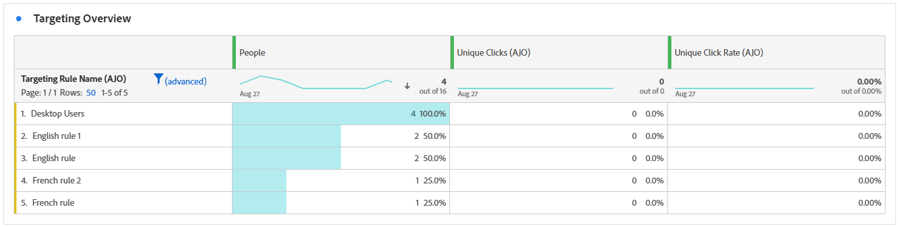

# Reserapport {#journey-global-report}

Resursrapporten **Journey** fungerar som en heltäckande kontrollpanel, som tillhandahåller en analys av viktig information som är kopplad till din resa. Detta omfattar detaljer som antalet inskrivna profiler och förekomster av misslyckade enskilda resor, vilket ger en heltäckande insikt i hur effektiv resan är och hur hög engagemanget är.

**Reserapporten** kan nås direkt från din resa med knappen **[!UICONTROL View report]** .

Mer information om Customer Journey Analytics Workspace och hur du filtrerar och analyserar data finns på [den här sidan](https://experienceleague.adobe.com/en/docs/analytics-platform/using/cja-workspace/home).

## Reseöversikt {#journey-global}

Rapporten **[!UICONTROL Journey]** ger dig en tydlig bild av de viktigaste spårningsdata som rör din resa.

### KPI:er för resan {#journey-perfomance}

**[!UICONTROL Journey]** KPI:er (Key Performance Indicators) fungerar som en heltäckande kontrollpanel, som tillhandahåller en analys av viktiga mått som är kopplade till din resa. Detta omfattar detaljer som antalet inskrivna profiler och förekomster av misslyckade enskilda resor, vilket ger en heltäckande insikt i hur effektiv resan är och hur hög engagemanget är.

+++ Läs mer om KPI:er för Journey

* **[!UICONTROL Journey engagement]**: Totalt antal unika personer som tagit emot meddelanden som skickats genom resan, vilket representerar distinkta profiler som nått en angiven åtgärdspunkt under resan.

* **[!UICONTROL Journey enters]**: Totalt antal personer som har nått resans anmälningshändelse.

* **[!UICONTROL Journey exits]**: Totalt antal personer som avbrutit resan.

+++

### Resestatistik {#journey-stats}

Tabellen **[!UICONTROL Journey Statistics]** innehåller en detaljerad sammanfattning av viktiga data om dina resor. Det innehåller viktiga mätvärden som antalet misslyckanden och lyckade tävlingsbidrag, som ger värdefulla insikter om hur väl era e-postmeddelanden och resor fungerar och når ut.

+++ Läs mer om statistik om resan

* **[!UICONTROL Journey exclusion]**: Totalt antal personer som har uteslutits från resan på grund av fördefinierade kriterier eller undertryckningsregler.

* **[!UICONTROL Journey engagement]**: Totalt antal unika personer som tagit emot meddelanden som skickats genom resan, vilket representerar distinkta profiler som nått en angiven åtgärdspunkt under resan.

* **[!UICONTROL Journey enters]**: Totalt antal personer som har nått resans anmälningshändelse.

* **[!UICONTROL Journey exits]**: Totalt antal personer som avbrutit resan.

* **[!UICONTROL Journey failures]**: Totalt antal enskilda resor som inte kördes korrekt.

* **[!UICONTROL Unique Journey enters]**: Totalt antal personer som har nått ingångshändelsen för resan, flera interaktioner för en profil beaktas inte.

* **[!UICONTROL Unique Journey exits]**: Totalt antal personer som avbrutit resan, flera interaktioner för en profil beaktas inte.

* **[!UICONTROL Unique Journey failures]**: Totalt antal enskilda resor som inte har utförts, flera interaktioner i en profil beaktas inte.

+++

## Uteslutning av resor {#journey-exclusion}

Tabellen **[!UICONTROL Journey exclusion]** innehåller en heltäckande bild av de olika faktorer som ledde till att användarprofiler exkluderades.

## Åtgärdsfel {#action-error}

Widgeten **[!UICONTROL Action errors]** innehåller information om de olika fel som uppstod för kundens åtgärder.

## Reseduk {#journey-canvas}

Med widgeten **[!UICONTROL Journey Canvas]** kan du visuellt spåra sökvägen för dina målprofiler när de navigerar genom din resa. [Läs mer i Customer Journey Analytics-dokumentationen](https://experienceleague.adobe.com/en/docs/analytics-platform/using/cja-workspace/visualizations/journey-canvas/journey-canvas)

Förbättra anpassningen av arbetsytan med följande alternativ:

* Lägg till eller ta bort önskad aktivitetstyp, till exempel meddelanden eller villkor, från den nedrullningsbara menyn **[!UICONTROL Node type]**.
* Justera **[!UICONTROL Percentage value]** för att fastställa flödesfördelningen mellan olika resevägar.
* Anpassa **[!UICONTROL Arrow settings]** så att den innehåller etiketter, villkor eller väljer en ren visning.
* Aktivera alternativet **[!UICONTROL Show fallout]** för att visualisera profiler som slutade din resa direkt på arbetsytan.

Följande regler gäller när **[!UICONTROL Node Type]**-filtrering används:

* När du skapar ett segment på en nod kommer det fortfarande att omfatta noder från tidigare faser av resan, även om dessa noder har uteslutits via filtret **[!UICONTROL Node type]**.

* Du kan inte skapa segment som har formats från en pil om noder i tidigare skeden av resan har uteslutits via filtret **[!UICONTROL Node type]**. I det här fallet inaktiveras högerklicksfunktionen på dessa pilar.

## Åtgärdens prestanda {#action-performance}

### Prestanda över tid {#action-overtime}

I diagrammet **[!UICONTROL Performance Over time]** kan du identifiera och analysera antalet profiler som uppfyller kriterierna som ska betraktas som målprofiler för dina åtgärder. Denna visualisering ger värdefulla insikter om hur effektiva era strategier är och hjälper er att fatta datadrivna beslut för att optimera er prestanda.

### Åtgärdsöversikt {#action-overview}

Tabellen **[!UICONTROL Action overview]** fungerar som en omfattande kontrollpanel som innehåller en analys av viktiga mått relaterade till åtgärderna under din resa. Detta inkluderar viktiga detaljer som antalet interaktioner och klickfrekvensen

+++ Läs mer om mätvärden för åtgärdsöversikt

* **[!UICONTROL Node enters]**: Totalt antal personer som har angett en specifik nod under resan.

* **[!UICONTROL Journey failure]**: Totalt antal enskilda resor som inte kördes korrekt.

* **[!UICONTROL Click through rate]**: Procentandel användare som interagerade med åtgärden.

* **[!UICONTROL Clicks]**: Antal gånger som ett innehåll klickades på i dina åtgärder.

* **[!UICONTROL Delivered]**: Antal åtgärder som har skickats, i relation till det totala antalet skickade åtgärder.

+++

## Händelseprestanda {#events-performance}

### Prestanda över tid {#event-overtime}

Med diagrammet **[!UICONTROL Performance over time]** kan du identifiera och analysera antalet profiler som kvalificerar som målprofiler för dina händelser. Detta kraftfulla verktyg hjälper er att spåra trender och mönster över tid och ger värdefulla insikter för att optimera era era händelsestrategier.

### Översikt över händelser {#event-overview}

Tabellen **[!UICONTROL Event overview]** visar hur många profiler som uppfyller dina händelsevillkor över tid. Det här verktyget hjälper dig att identifiera mönster i kvalificeringsgrader för att förfina din händelsestrategi.

+++ Läs mer om statistik om resan

* **[!UICONTROL People]**: Antal användarprofiler som kvalificerar sig som målprofiler för dina händelser.

+++

## Målöversikt {#targeting}

Om du har konfigurerat **[!UICONTROL Targeting rules]** för ditt innehåll ger tabellen **[!UICONTROL Targeting overview]** en detaljerad vy över viktiga engagemangsmått, som visar hur målprofilerna för varje regel interagerade med ditt innehåll.

➡️ [Läs mer om målregler](../campaigns/campaigns-message-optimization.md)

+++ Läs mer om mätvärden för målinriktning

* **[!UICONTROL People]**: Antal användarprofiler som kvalificerar sig som målprofiler för dina händelser.

* **[!UICONTROL Unique Clicks]**: Antal profiler som klickat på ett innehåll i ett e-postmeddelande.

* **[!UICONTROL Unique click rate]**: Procentandel målprofiler som klickade minst en gång.

+++
