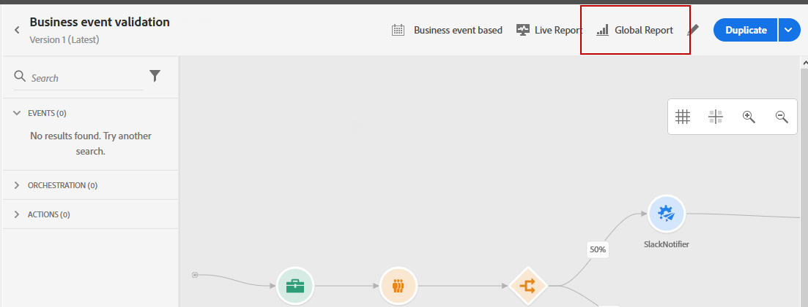

# Global reserapport {#journey-global-report}

Den globala reserapporten kan nås direkt från din resa med knappen **[!UICONTROL Global report]**.

Sidan **[!UICONTROL Global report]** för resan visas med följande flikar:

* [Resa](#journey-global)
* [E-post](#email-global)
* [Tryck](#push-global)

Resan **[!UICONTROL Global report]** är uppdelad i olika widgetar som anger hur framgångsrik och felfri din resa är. Varje widget kan storleksändras och tas bort vid behov. Mer information finns i [avsnittet](global-report.md#modify-dashboard).

## Reseflik {#journey-global}

Från din resa **[!UICONTROL Global report]** ger fliken **[!UICONTROL Journey]** en tydlig bild av de viktigaste spårningsdata som rör din resa.

Med widgeten **[!UICONTROL Journey`s performance]** kan du se sökvägen till dina målprofiler steg för steg under hela resan.

Widgeten **[!UICONTROL Journey`s statistics]** visar följande KPI:er:

* **[!UICONTROL Entered profiles]**: Totalt antal personer som har nått resans inträde.

* **[!UICONTROL Exited profiles]**: Totalt antal personer som avbrutit resan.

* **[!UICONTROL Failed individual journey]**: Totalt antal enskilda resor som inte har slutförts.

Med widgetarna **[!UICONTROL Event Performance]** och **[!UICONTROL Top events]** kan du se vilken av dina **[!UICONTROL Events]**-åtgärder som har utförts genom diagram och tabeller.

**[!UICONTROL Action Performance]** och  **[!UICONTROL Top Actions]** widgetar är de mest framgångsrika åtgärderna och felen som inträffade när dina  **[!UICONTROL Actions]** aktiverades. Tabellen **[!UICONTROL Top Actions]** innehåller data som är tillgängliga för **[!UICONTROL Actions]**, till exempel:

* **[!UICONTROL Actions successfully executed]**: Totalt antal  **[!UICONTROL Actions]** lyckade körningar för en resa.

* **[!UICONTROL Error in action]**: Totalt antal fel som uppstått för  **[!UICONTROL Actions]**.

Diagrammet **[!UICONTROL Error Reasons]** anger vilken typ av fel som inträffade för **[!UICONTROL Actions]**.

<!--Events by origin-->

## Fliken E-post {#email-global}

Från din resa **[!UICONTROL Global report]** anger fliken **[!UICONTROL Email]** huvudinformationen i relation till e-postleveranserna som skickas under din resa.

En detaljerad rapport om en viss e-postleverans finns i avsnittet [E-posta global rapport](#email-global-report).

I **[!UICONTROL Email Sending Statistics]**-diagrammet visas leveransframgången:

* **[!UICONTROL Sent]**: Totalt antal försändelser för leveransen.

* **[!UICONTROL Delivered]**: Antal meddelanden som har skickats, i relation till det totala antalet skickade meddelanden.

* **[!UICONTROL Delivery Rate]**: Procentandel meddelanden som har skickats.

* **[!UICONTROL Bounces]**: Totalt antal fel som sammanställts under leverans och automatisk returbehandling i relation till totalt antal skickade meddelanden.

* **[!UICONTROL Bounce Rate]**: Procentandel e-postmeddelanden som studsade jämfört med skickade e-postmeddelanden.

* **[!UICONTROL Errors]**: Totalt antal fel som uppstod under en leverans och som förhindrar att den skickas till profiler.

* **[!UICONTROL Error Rate]**: Procentandel fel som uppstod under en leverans och som förhindrar att den skickas jämfört med skickade e-postmeddelanden.

**[!UICONTROL Email - Tracking statistics]** innehåller tillgängliga data för mottagaraktivitet för din leverans:

* **[!UICONTROL Opens]**: Antal gånger som leveransen öppnades i en leverans.

* **[!UICONTROL Unique Opens]**: Procent av öppnade leveranser.

* **[!UICONTROL Open Rate]**: Totalt antal öppnade e-postmeddelanden jämfört med antalet levererade e-postmeddelanden.

* **[!UICONTROL Clicks]**: Antal gånger ett innehåll klickades i ett e-postmeddelande.

* **[!UICONTROL Unique Clicks]**:Antal mottagare som klickat på ett innehåll i ett e-postmeddelande.

* **[!UICONTROL Click through rate]**: Procentandel användare som interagerade med resan.

Diagrammet **[!UICONTROL Sending Statistics]** innehåller data som är tillgängliga för skickade e-postmeddelanden, som:

* **[!UICONTROL Delivered]**: Antal meddelanden som har skickats, i relation till det totala antalet skickade meddelanden.

* **[!UICONTROL Bounces]**: Totalt antal fel som sammanställts under leverans och automatisk returbehandling i relation till totalt antal skickade meddelanden.

* **[!UICONTROL Errors]**: Totalt antal fel som uppstod under en leverans och som förhindrar att den skickas till profiler.

Widgetarna **[!UICONTROL Bounce Reasons]** och **[!UICONTROL Bounce categories]** innehåller tillgängliga data för studsade meddelanden, till exempel:

* **[!UICONTROL Hard bounce]**: Det totala antalet permanenta fel, t.ex. fel e-postadress. Detta inbegriper ett felmeddelande som uttryckligen anger att adressen är ogiltig, till exempel Okänd användare.

* **[!UICONTROL Soft bounce]**: Det totala antalet tillfälliga fel, t.ex. en fullständig inkorg.

* **[!UICONTROL Ignored]**: Det totala antalet tillfälliga, t.ex. frånvaro, eller ett tekniskt fel, t.ex. om avsändartypen är postmaster.

Mer information om studsar finns på sidan [Suppressionslista](../suppression-list.md).

Diagrammet och tabellen **[!UICONTROL Email - Top Url]** visar vilka URL:er från din leverans som är mest besökta.

Diagrammet och tabellen **[!UICONTROL Email - Best recipient domain]** visar vilka domäner som är de mest använda av mottagarna för att öppna e-postmeddelandet.

## Skjut fliken {#push-global}

Från din resa **[!UICONTROL Global report]** anger fliken **[!UICONTROL Push]** huvudinformationen i relation till push-leveranserna som skickas under din resa.

En detaljerad rapport om en viss push-leverans finns i den här [push Global-rapporten](#push-global-report).

Tabellen **[!UICONTROL Push notification - Sending statistics]** innehåller huvudinformationen i förhållande till dina push-meddelanden med diagram och KPI:er:

* **[!UICONTROL Sent]**: Totalt antal försändelser för leveransen.

* **[!UICONTROL Delivered]**: Antal meddelanden som har skickats, i relation till det totala antalet skickade meddelanden.

* **[!UICONTROL Delivery Rate]**: Procentandel meddelanden som har skickats.

* **[!UICONTROL Bounces]**: Totalt antal fel som sammanställts under leverans och automatisk returbehandling i relation till totalt antal skickade meddelanden.

* **[!UICONTROL Bounce Rate]**: Procentandel push-meddelanden som studsade jämfört med skickade push-meddelanden.

* **[!UICONTROL Errors]**: Totalt antal fel som uppstod under en leverans och som förhindrar att den skickas till profiler.

* **[!UICONTROL Error Rate]**: Procentandel fel som uppstod under en leverans och som förhindrar att den skickas jämfört med push-meddelanden som skickas.

**[!UICONTROL Push - Tracking statistics]** innehåller tillgängliga data för mottagaraktivitet för din leverans:

* **[!UICONTROL Opens]**: Antal gånger ett meddelande öppnades i en leverans.

* **[!UICONTROL Open Rate]**: Procentandel öppnade push-meddelanden.

* **[!UICONTROL Actions]**: Totalt antal åtgärder för push-meddelandet som levererats, t.ex. knappklickning eller avbruten.

* **[!UICONTROL Engagements]**: Totalt antal öppningar och åtgärder för det här push-meddelandet, dvs om profilen öppnade push-meddelandet eller om någon klickade på en knapp.

* **[!UICONTROL Engagement Rate]**: Procentandel öppningar och åtgärder för det här push-meddelandet, dvs. om profilen öppnade push-meddelandet eller om någon klickade på en knapp.

Diagrammet **[!UICONTROL Push notification summary]** innehåller data som är tillgängliga för skickade push-meddelanden, som:

* **[!UICONTROL Opens]**: Antal gånger ett meddelande öppnades i en leverans.

* **[!UICONTROL Actions]**: Totalt antal åtgärder för push-meddelandet som levererats, t.ex. knappklickning eller avbruten.

* **[!UICONTROL Bounces]**: Totalt antal fel som sammanställts under leverans och automatisk returbehandling i relation till totalt antal skickade meddelanden.

* **[!UICONTROL Delivered]**: Antal meddelanden som har skickats, i relation till det totala antalet skickade meddelanden.

* **[!UICONTROL Errors]**: Totalt antal fel som uppstod under en leverans och som förhindrar att den skickas till profiler.

Med diagrammet och tabellen **[!UICONTROL Error Reasons]** kan du se vilket fel som uppstod under leveransen.

Diagram och tabeller för **[!UICONTROL Tracking by platform]**, **[!UICONTROL Sending by platform]** och **[!UICONTROL Breakdown by platform]** visar om push-meddelandet lyckades beroende på mottagarens operativsystem.
