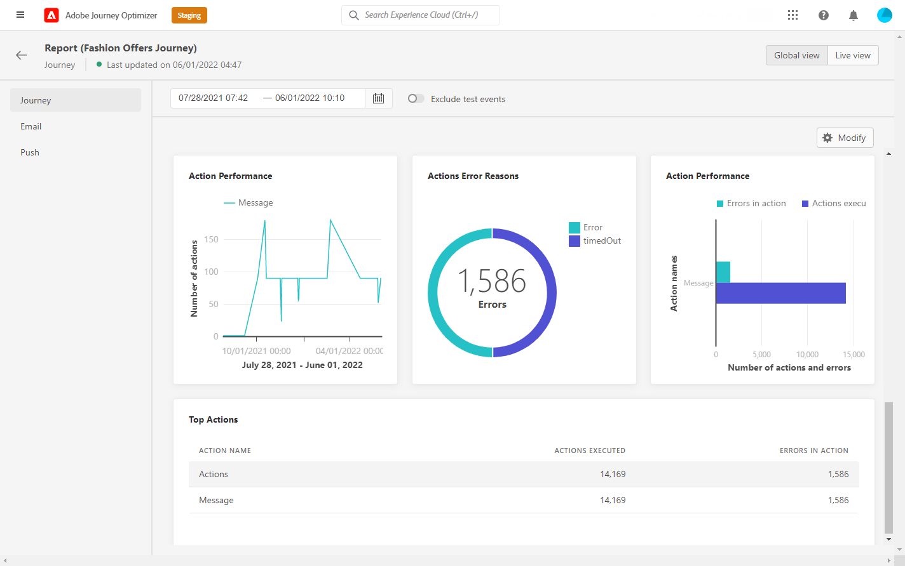
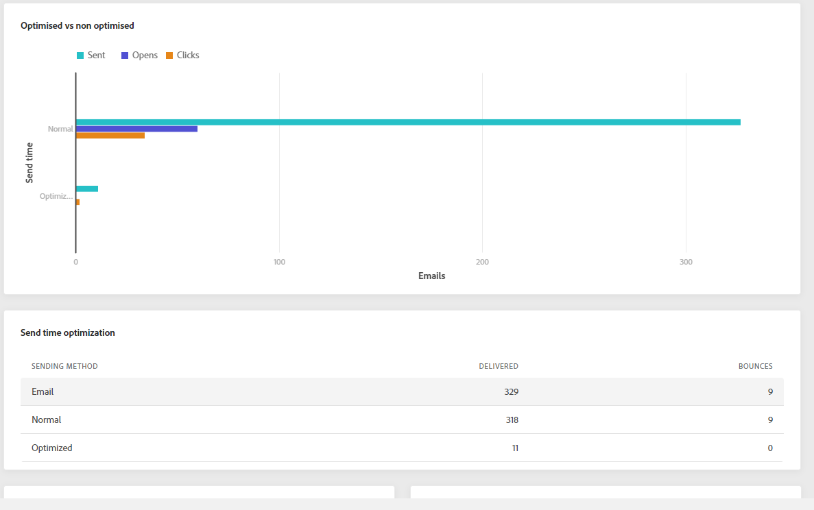

# Rapport om global resa {#journey-global-report}

Den globala reserapporten kan nås direkt från din resa med **[!UICONTROL Global report]** -knappen.

Resan **[!UICONTROL Global report]** visas med följande flikar:

* [Resa](#journey-global)
* [E-post](#email-global)
* [Push](#push-global)

Resan **[!UICONTROL Global report]** är uppdelat i olika widgetar som detaljerat beskriver hur framgångsrik och felfri din resa är. Varje widget kan storleksändras och tas bort vid behov. Mer information finns i [section](global-report.md#modify-dashboard).

## Fliken Resor {#journey-global}

Från din resa **[!UICONTROL Global report]**, **[!UICONTROL Journey]** -fliken ger en tydlig bild av de viktigaste spårningsdata som rör kundresan.

The **[!UICONTROL Journey Performance]** kan du se sökvägen till dina målprofiler steg för steg under hela kundresan.

The **[!UICONTROL Journey Statistics]** widgeten visar följande KPI:er:

* **[!UICONTROL Entered profiles]**: Totalt antal personer som har nått resans inträde.

* **[!UICONTROL Exited profiles]**: Totalt antal personer som avbrutit resan.

* **[!UICONTROL Failed individual journey]**: Totalt antal enskilda resor som inte har slutförts.

The **[!UICONTROL Events received by event]**, **[!UICONTROL Events by origin]** och **[!UICONTROL Top events]** kan du se vilken av dina **[!UICONTROL Events]** har körts via diagram och tabeller.

**[!UICONTROL Action Performance]**, **[!UICONTROL Action Error Reasons]** och **[!UICONTROL Top Actions]** -widgetar är den mest framgångsrika åtgärden och felen som inträffade när **[!UICONTROL Actions]** har utlösts.

The **[!UICONTROL Top Actions]** tabellen innehåller tillgängliga data för **[!UICONTROL Actions]**, till exempel:

* **[!UICONTROL Actions successfully executed]**: Totalt antal **[!UICONTROL Actions]** har slutförts för en resa.

* **[!UICONTROL Error in action]**: Totalt antal fel som uppstått för **[!UICONTROL Actions]**.

## Fliken E-post {#email-global}

Från din resa **[!UICONTROL Global report]**, **[!UICONTROL Email]** fliken innehåller huvudinformationen om de e-postleveranser som skickas under resan.

En detaljerad rapport om en viss e-postleverans finns i [E-posta global rapport](#email-global-report) -avsnitt.

The **[!UICONTROL Email Sending Statistics]** diagram visar hur framgångsrik leveransen är:

* **[!UICONTROL Sent]**: Totalt antal försändelser för leveransen.

* **[!UICONTROL Delivered]**: Antal meddelanden som har skickats, i relation till det totala antalet skickade meddelanden.

* **[!UICONTROL Delivery Rate]**: Procentandel meddelanden som har skickats.

* **[!UICONTROL Bounces]**: Totalt antal fel som sammanställts under leverans och automatisk returbehandling i relation till totalt antal skickade meddelanden.

* **[!UICONTROL Bounce Rate]**: Procentandel e-postmeddelanden som studsade jämfört med skickade e-postmeddelanden.

* **[!UICONTROL Errors]**: Totalt antal fel som uppstod under en leverans och som förhindrar att den skickas till profiler.

* **[!UICONTROL Error Rate]**: Procentandel fel som uppstod under en leverans och som förhindrar att den skickas jämfört med skickade e-postmeddelanden.

The **[!UICONTROL Email - Tracking statistics]** innehåller tillgängliga data för mottagaraktivitet för leveransen:

* **[!UICONTROL Opens]**: Antal gånger som leveransen öppnades i en leverans.

* **[!UICONTROL Unique Opens]**: Procent av öppnade leveranser.

* **[!UICONTROL Open Rate]**: Totalt antal öppnade e-postmeddelanden jämfört med antalet levererade e-postmeddelanden.

* **[!UICONTROL Clicks]**: Antal gånger ett innehåll klickades i ett e-postmeddelande.

* **[!UICONTROL Unique Clicks]**:Antal mottagare som klickat på ett innehåll i ett e-postmeddelande.

* **[!UICONTROL Click through rate]**: Procentandel användare som interagerade med resan.

* **[!UICONTROL Unsubscribe]**: Antal klick på länken för att avbryta prenumerationen.

* **[!UICONTROL Spam complaints]**: Antal gånger ett meddelande har deklarerats som skräppost eller skräppost.

The **[!UICONTROL Sending Statistics]** diagrammet innehåller de data som är tillgängliga för skickade e-postmeddelanden, som:

* **[!UICONTROL Delivered]**: Antal meddelanden som har skickats, i relation till det totala antalet skickade meddelanden.

* **[!UICONTROL Bounces]**: Totalt antal fel som sammanställts under leverans och automatisk returbehandling i relation till totalt antal skickade meddelanden.

* **[!UICONTROL Errors]**: Totalt antal fel som uppstod under en leverans och som förhindrar att den skickas till profiler.

The **[!UICONTROL Bounce Reasons]** och **[!UICONTROL Bounce categories]** widgetar innehåller tillgängliga data som är relaterade till studsade meddelanden, som:

* **[!UICONTROL Hard bounce]**: Det totala antalet permanenta fel, t.ex. fel e-postadress. Detta inbegriper ett felmeddelande som uttryckligen anger att adressen är ogiltig, till exempel Okänd användare.

* **[!UICONTROL Soft bounce]**: Det totala antalet tillfälliga fel, t.ex. en fullständig inkorg.

* **[!UICONTROL Ignored]**: Det totala antalet tillfälliga, t.ex. frånvaro, eller ett tekniskt fel, t.ex. om avsändartypen är postmaster.

Mer information om studsar finns i [Undertryckningslista](../messages/suppression-list.md) sida.

The **[!UICONTROL Error Reasons]** Med diagram och tabeller kan du se vilket fel som inträffade under leveransen.

The **[!UICONTROL Excluded reasons]** I diagram och tabeller visas de olika anledningar som gjorde att användarprofiler som inte ingår i målprofilerna inte kunde ta emot meddelandet.

The **[!UICONTROL Email - Top Url]** diagram- och tabellinformation om vilka URL:er från leveransen som är mest besökta.

The **[!UICONTROL Email - Top recipient domain]** diagram och tabeller visar vilka domäner som är de mest använda av mottagarna för att öppna e-postmeddelandet.

>[!NOTE]
>
>The **[!UICONTROL Optimized vs non optimized]** och **[!UICONTROL Send time optimization]**  widgetar är bara tillgängliga om alternativet för optimering av sändningstid är aktiverat för leverans. Mer information om optimering av sändningstid finns i [page](../building-journeys/journeys-message.md#send-time-optimization).

The **[!UICONTROL Optimized vs non optimized]** diagram anger huvudinformationen i förhållande till meddelandet, oavsett om de är optimerade eller inte:

* **[!UICONTROL Sent]**: Totalt antal försändelser för leveransen.
* **[!UICONTROL Opens]**: Antal gånger som leveransen öppnades i en leverans.
* **[!UICONTROL Clicks]**: Antal gånger ett innehåll klickades i ett e-postmeddelande.

The **[!UICONTROL Send time optimization]** information om leveransens framgångar beroende på sändningsmetod: optimerad eller normal.

* **[!UICONTROL Delivered]**: Antal meddelanden som har skickats, i relation till det totala antalet skickade meddelanden.
* **[!UICONTROL Bounces]**: Totalt antal fel som sammanställts under leverans och automatisk returbehandling i relation till totalt antal skickade meddelanden.

<!--

>[!NOTE]
>
>The Offers widgets and metrics are only available if a decision was inserted in an email. For more information on Decision Management, refer to this [page](../offers/get-started/starting-offer-decisioning.md).

The **[!UICONTROL Offers statistic]** and **[!UICONTROL Offers statistics]** over time widgets measure your offer's success and impact on your targeted audience. It detail the main information relative to your message with KPIs:

* **[!UICONTROL Offer sent]**: Total number of sends for the offer.

* **[!UICONTROL Offer impression]**: Number of times the offer was opened in a delivery.

* **[!UICONTROL Offer clicks]**: Number of times an offer was clicked on in a delivery.

The **[!UICONTROL Offers detailed statistic]** table contains the available data for recipient activity with your offer:

* **[!UICONTROL Placement name]**: Name of your placement used to display your offer. For more information on placement, refer to this [page](../offers/offer-library/creating-placements.md).

* **[!UICONTROL Offer name]**: Name of the offer added in the delivery. For more information on placement, refer to this [page](../offers/offer-library/creating-personalized-offers.md).

* **[!UICONTROL Offer sent]**: Total number of sends for the offer.

* **[!UICONTROL Offer impression rate]**: Percentage of opened offers compared to the number of sent offers.

* **[!UICONTROL Offer click rate]**: Percentage of users who interacted with the offer.
-->

## Push-flik {#push-global}

Från din resa **[!UICONTROL Global report]**, **[!UICONTROL Push]** fliken innehåller huvudinformationen i förhållande till de push-leveranser som skickas under resan.

En detaljerad rapport om en viss push-leverans finns i [Push Global-rapport](#push-global-report).

The **[!UICONTROL Push notification - Sending statistics]** tabellen visar huvudinformationen i förhållande till push-meddelanden med diagram och KPI:er:

* **[!UICONTROL Sent]**: Totalt antal försändelser för leveransen.

* **[!UICONTROL Delivered]**: Antal meddelanden som har skickats, i relation till det totala antalet skickade meddelanden.

* **[!UICONTROL Delivery Rate]**: Procentandel meddelanden som har skickats.

* **[!UICONTROL Bounces]**: Totalt antal fel som sammanställts under leverans och automatisk returbehandling i relation till totalt antal skickade meddelanden.

* **[!UICONTROL Bounce Rate]**: Procentandel push-meddelanden som studsade jämfört med skickade push-meddelanden.

* **[!UICONTROL Errors]**: Totalt antal fel som uppstod under en leverans och som förhindrar att den skickas till profiler.

* **[!UICONTROL Error Rate]**: Procentandel fel som uppstod under en leverans och som förhindrar att den skickas jämfört med push-meddelanden som skickas.

The **[!UICONTROL Push - Tracking statistics]** innehåller tillgängliga data för mottagaraktivitet för leveransen:

* **[!UICONTROL Opens]**: Antal gånger ett meddelande öppnades i en leverans.

* **[!UICONTROL Open Rate]**: Procentandel öppnade push-meddelanden.

* **[!UICONTROL Actions]**: Totalt antal åtgärder för push-meddelandet som levererats, t.ex. knappklickning eller avbruten.

* **[!UICONTROL Engagements]**: Totalt antal öppningar och åtgärder för det här push-meddelandet, dvs om profilen öppnade push-meddelandet eller om någon klickade på en knapp.

* **[!UICONTROL Engagement Rate]**: Procentandel öppningar och åtgärder för det här push-meddelandet, dvs. om profilen öppnade push-meddelandet eller om någon klickade på en knapp.

The **[!UICONTROL Push notification summary]** diagrammet innehåller data som är tillgängliga för skickade push-meddelanden, som:

* **[!UICONTROL Opens]**: Antal gånger ett meddelande öppnades i en leverans.

* **[!UICONTROL Actions]**: Totalt antal åtgärder för push-meddelandet som levererats, t.ex. knappklickning eller avbruten.

* **[!UICONTROL Bounces]**: Totalt antal fel som sammanställts under leverans och automatisk returbehandling i relation till totalt antal skickade meddelanden.

* **[!UICONTROL Delivered]**: Antal meddelanden som har skickats, i relation till det totala antalet skickade meddelanden.

* **[!UICONTROL Errors]**: Totalt antal fel som uppstod under en leverans och som förhindrar att den skickas till profiler.

>[!NOTE]
>
>The **[!UICONTROL Optimized vs non optimized]** och **[!UICONTROL Send time optimization]**  widgetar är bara tillgängliga om alternativet för optimering av sändningstid är aktiverat för leverans. Mer information om optimering av sändningstid finns i [page](../building-journeys/journeys-message.md#send-time-optimization).

The **[!UICONTROL Optimized vs non optimized]** diagram anger huvudinformationen i förhållande till meddelandet, oavsett om de är optimerade eller inte:

* **[!UICONTROL Delivered]**: Antal meddelanden som har skickats, i relation till det totala antalet skickade meddelanden.
* **[!UICONTROL Opens]**: Antal gånger som leveransen öppnades i en leverans.
* **[!UICONTROL Actions]**: Totalt antal åtgärder för push-meddelandet som levererats, t.ex. knappklickning eller avbruten.

The **[!UICONTROL Send time optimization]** information om leveransens framgångar beroende på sändningsmetod: optimerad eller normal.

* **[!UICONTROL Delivered]**: Antal meddelanden som har skickats, i relation till det totala antalet skickade meddelanden.
* **[!UICONTROL Bounces]**: Totalt antal fel som sammanställts under leverans och automatisk returbehandling i relation till totalt antal skickade meddelanden.

The **[!UICONTROL Error Reasons]** Med diagram och tabeller kan du se vilket fel som inträffade under leveransen.

The **[!UICONTROL Tracking by platform]**, **[!UICONTROL Sending by platform]** och **[!UICONTROL Breakdown by platform]** diagram och tabeller visar hur bra push-meddelandena är beroende på mottagarens operativsystem.
