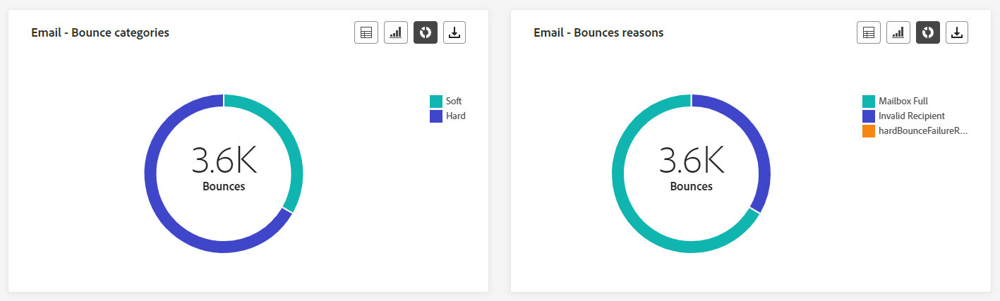
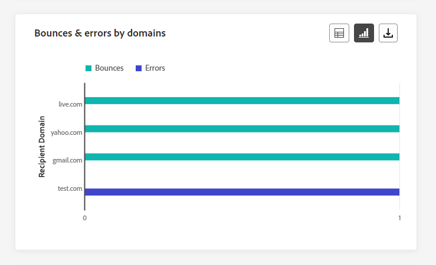
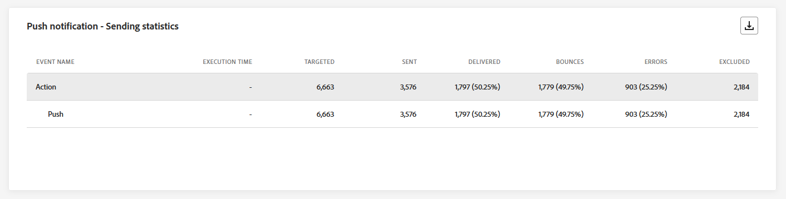
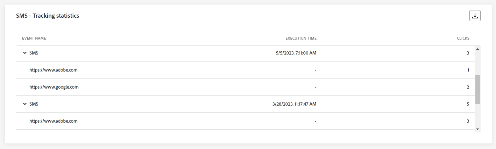
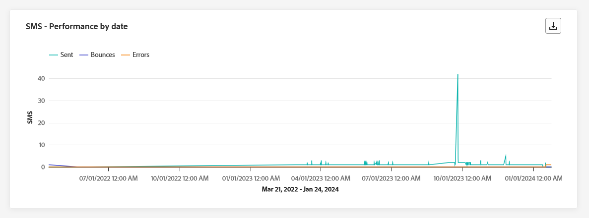

# Global reserapport {#journey-global-report}

>[!CONTEXTUALHELP]
>id="ajo_journey_global_report"
>title="Global reserapport"
>abstract="Med den globala rapporten om resan kan du mäta effekten av dina resor under en viss tidsperiod. Din rapport är uppdelad i olika widgetar som detaljerar hur framgångsrik och felfri din resa är. Varje rapportkontrollpanel kan ändras genom att widgetar storleksändras eller tas bort."

Globala rapporter, som du kommer åt från fliken All time, visar händelser som inträffat för minst två timmar sedan och täcker händelser under en vald tidsperiod. Live-rapporter fokuserar på händelser som har inträffat under de senaste 24 timmarna, med ett tidsintervall på minst två minuter från händelseförekomsten.

Den globala reserapporten kan nås direkt från din resa med **[!UICONTROL View report]** -knappen.

Resan **[!UICONTROL Global report]** visas med följande flikar:

* [Resa](#journey-global)
* [E-post](#email-global)
* [Push](#push-global)
* [SMS](#sms-global)
* [I appen](#in-app-global)

Resan **[!UICONTROL Global report]** är uppdelat i olika widgetar som detaljerat beskriver hur framgångsrik och felfri din resa är. Varje widget kan storleksändras och tas bort vid behov. Mer information finns i [section](global-report.md#modify-dashboard).

En detaljerad lista över alla mätvärden som är tillgängliga i Adobe Journey Optimizer finns på [den här sidan](global-report.md#list-of-components-global).

## Fliken Resor {#journey-global}

Från din resa **[!UICONTROL Global report]**, **[!UICONTROL Journey]** -fliken ger en tydlig bild av de viktigaste spårningsdata som rör kundresan.

### Reseprestanda {#journey-perfomance}

>[!CONTEXTUALHELP]
>id="ajo_journey_performance"
>title="Reseprestanda"
>abstract="Med widgeten Prestanda för resan kan du visuellt spåra sökvägen till dina målprofiler när de går igenom din resa."

The **[!UICONTROL Journey Performance]** Med widgeten kan du visuellt spåra sökvägen för dina målprofiler när de navigerar genom din resa.

Observera att antalet profiler för en nod endast uppdateras när profilen har slutfört noden, inte när den anges. Till exempel en profil på en **Vänta** noden räknas bara när det angivna datumet har nåtts och profilen har avslutat noden.

### Resestatistik {#journey-statistics}

>[!CONTEXTUALHELP]
>id="ajo_journey_statistics"
>title="Resestatistik"
>abstract="KPI:erna (Key Performance Indicators) för resestatistik fungerar som en omfattande kontrollpanel, som ger en ingående analys av viktiga mätvärden för resan."

The **[!UICONTROL Journey Statistics]** KPI (Key Performance Indicators) fungerar som en heltäckande kontrollpanel som ger en analys av viktig statistik som är kopplad till din resa. Detta omfattar detaljer som antalet inskrivna profiler och förekomster av misslyckade enskilda resor, vilket ger en heltäckande insikt i hur effektiv resan är och hur hög engagemanget är.

+++ Läs mer om statistik om resan

* **[!UICONTROL Entered profiles]**: Totalt antal personer som har nått ingångshändelsen för resan.

* **[!UICONTROL Exited profiles]**: Totalt antal personer som avbrutit resan.

* **[!UICONTROL Failed individual journey]**: Totalt antal enskilda resor som inte slutfördes.

+++

### Åtgärdens prestanda {#action-performance}

>[!CONTEXTUALHELP]
>id="ajo_journey_action_performance"
>title="Åtgärdens prestanda"
>abstract="Widgeten Åtgärdsprestanda visar de mest framgångsrika åtgärder som utfördes när dina åtgärder initierades."

The **[!UICONTROL Action Performance]** -widgeten representerar de mest framgångsrika åtgärderna som inträffade när **[!UICONTROL actions]** aktiverades.

### De vanligaste åtgärderna {#top-actions}

>[!CONTEXTUALHELP]
>id="ajo_journey_top_actions"
>title="De vanligaste åtgärderna"
>abstract="Tabellen Top actions sammanställer viktig information om dina åtgärder och ger kortfattade observationer av både frekvens och effekt för varje åtgärd."

The **[!UICONTROL Top Actions]** tabellen sammanställer viktiga data i **[!UICONTROL Actions]**. Det ger en god inblick i hur ofta och hur väl varje åtgärd fungerar.

+++ Läs mer om de viktigaste mätvärdena

* **[!UICONTROL Actions successfully executed]**: Totalt antal **[!UICONTROL Actions]** har slutförts för en resa.

* **[!UICONTROL Error in action]**: Totalt antal fel som uppstått för **[!UICONTROL Actions]**.

+++

### Orsaker till funktionsfel {#action-error}

>[!CONTEXTUALHELP]
>id="ajo_journey_actions_error_reasons"
>title="Orsaker till funktionsfel"
>abstract="I tabellen och diagrammet över orsaker till åtgärdsfel finns en detaljerad sammanfattning av fel som uppstod under utförandet av dina åtgärder. Den innehåller en omfattande översikt över problem som kan ha inträffat."

The **[!UICONTROL Action Error Reasons]** tabellen och diagrammet innehåller en omfattande översikt över fel som uppstod under körningen av **[!UICONTROL Actions]**.

### Händelser efter ursprung {#events-origin}

>[!CONTEXTUALHELP]
>id="ajo_journey_events_origin"
>title="Händelser efter ursprung"
>abstract="Tabellen och graferna Händelser efter ursprung visar hur du lyckades ta emot dina händelser. Dessa visuella representationer gör att ni kan identifiera de händelser som effektivt togs emot, och ge värdefulla insikter om resultatet och effekten av varje händelse under resan."

The **[!UICONTROL Events by origin]** tabellen och diagrammen ger ett detaljerat perspektiv på den lyckade mottagningen av **[!UICONTROL events]**. Genom dessa visuella representationer kan du se exakt vilken av dina **[!UICONTROL events]** har tagits emot effektivt och innehåller värdefulla insikter om hur enskilda händelser under resan fungerar och påverkas.

### Händelser som tagits emot av händelsen {#events-received}

>[!CONTEXTUALHELP]
>id="ajo_journey_events_received"
>title="Händelser som tagits emot av händelsen"
>abstract="Med händelsediagrammet Händelser som tagits emot kan du identifiera och analysera de specifika händelser under resan som har utförts effektivt och på så sätt få värdefulla insikter om enskilda händelsers prestanda och antal lyckade händelser."

The **[!UICONTROL Events received by event]** Med diagram kan du identifiera och analysera vilka specifika **[!UICONTROL event]** inom er resa har genomförts effektivt och ger värdefulla insikter om enskilda eventers resultat och framgångar.

### De vanligaste händelserna {#top-events}

>[!CONTEXTUALHELP]
>id="ajo_journey_top_events"
>title="De vanligaste händelserna"
>abstract="Tabellen Top Events sammanställer viktiga data om dina händelser och ger kortfattade observationer av både frekvens och prestanda för varje enskild händelse."

The **[!UICONTROL Top events]** tabellen sammanställer viktiga data i **[!UICONTROL Events]**. Det ger kortfattade insikter om frekvens och prestanda för varje **[!UICONTROL Event]**.

### Samtyckesprinciper {#consent-policies}

>[!CONTEXTUALHELP]
>id="ajo_journey_consent_policies"
>title="Samtyckesprinciper"
>abstract="Tabellen och diagrammet Samtyckesprinciper visar antalet profiler som har uteslutits från varje profil i dina anpassade åtgärder. Denna presentation ger en tydlig insikt i hur varje samtyckespolicy påverkar uteslutningar av profiler."

The **[!UICONTROL Consent policies]** tabell och diagram visar antalet profiler som har undantagits från varje princip i dina anpassade åtgärder. Detta ger en tydlig inblick i hur varje samtyckespolicy påverkar uteslutningar av profiler.

Mer information om anpassade åtgärder finns i [den detaljerade dokumentationen](../action/about-custom-action-configuration.md).

Observera att för att dessa widgetar ska visas i dina Journeys-rapporter måste du återställa dina instrumentpaneler. Om du vill göra det klickar du **[!UICONTROL Modify]** sedan **[!UICONTROL Reset]** överst i rapporten.

## Fliken E-post {#email-global}

Från din resa **[!UICONTROL Global report]**, **[!UICONTROL Email]** fliken innehåller huvudinformationen om de e-postmeddelanden som skickas under din resa.

### E-post - Sändande statistik {#email-sending-statistics}

>[!CONTEXTUALHELP]
>id="ajo_journey_email_sending_statistics"
>title="E-post - Sändande statistik"
>abstract="Registret E-post - Skicka statistik innehåller en sammanfattning av viktiga data om din e-post, som Riktat eller Levererat."

The **[!UICONTROL Email Sending Statistics]** tabellen innehåller en omfattande sammanfattning av viktiga uppgifter om e-post under dina resor. Den innehåller viktiga mätvärden som målgruppens storlek och antalet e-postmeddelanden som levererats, och ger värdefulla insikter om hur effektiva och omfattande era e-postmeddelanden och resor är.

+++ Läs mer om statistik för e-postsändning

* **[!UICONTROL Execution time]**: Starttid för varje körning av resan vid återkommande resor. Om du bara vill ange en eller flera återkommande händelser som mål, markerar du dem på menyn **[!UICONTROL Execution time]** nedrullningsbar meny.

* **[!UICONTROL Targeted]**: Antal profiler som ska användas för åtgärder som att skicka e-post eller SMS.

* **[!UICONTROL Sent]**: Totalt antal e-postmeddelanden som skickats för resan.

* **[!UICONTROL Delivered]**: Antal e-postmeddelanden som skickats, i relation till det totala antalet skickade e-postmeddelanden.

* **[!UICONTROL Delivery Rate]**: Procentandel e-postmeddelanden som skickades.

* **[!UICONTROL Bounces]**: Totalt antal fel som sammanställts under sändningsprocessen och automatisk returbehandling i relation till det totala antalet skickade e-postmeddelanden.

* **[!UICONTROL Bounce Rate]**: Procentandel e-postmeddelanden som studsade jämfört med skickade e-postmeddelanden.

* **[!UICONTROL Errors]**: Totalt antal fel som uppstod under sändningsprocessen och som förhindrar att den skickas till profiler.

* **[!UICONTROL Error Rate]**: Procentandel fel som uppstod under sändningsprocessen och som förhindrade att den skickades jämfört med skickade e-postmeddelanden.

* **[!UICONTROL Retries]**: Antal e-postmeddelanden i kön för återförsök.

* **[!UICONTROL Excluded]**: Antal profiler som har uteslutits av Adobe Journey Optimizer.

+++

### E-post - Spårningsstatistik {#email-tracking}

>[!CONTEXTUALHELP]
>id="ajo_journey_email_tracking_statistics"
>title="E-post - Spårningsstatistik"
>abstract="Registret E-post - Spårningsstatistik innehåller data om profilaktivitet för din e-post."

The **[!UICONTROL Email - Tracking statistics]** tabellen ger en detaljerad redovisning av profilaktivitet som rör e-post som ingår i din resa. Detta inkluderar mätvärden för öppningar, klick och andra relevanta interaktionsindikatorer, som ger en heltäckande bild av hur profiler interagerar med ert e-postinnehåll.

+++ Läs mer om e-post - statistik för spårning

* **[!UICONTROL Execution time]**: Starttid för varje körning av din återkommande e-post under resan. Om du bara vill rikta in dig på ett eller flera återkommande e-postmeddelanden väljer du det i dialogrutan **[!UICONTROL Execution time]** nedrullningsbar meny.

* **[!UICONTROL Opens]**: Antal gånger dina e-postmeddelanden öppnats under en resa.

* **[!UICONTROL Unique Opens]**: Procentandel öppnade e-postmeddelanden.

* **[!UICONTROL Unique Open Rate]**: Totalt antal öppnade e-postmeddelanden jämfört med antalet levererade e-postmeddelanden.

* **[!UICONTROL Clicks]**: Antal gånger som ett innehåll klickades på i dina e-postmeddelanden.

* **[!UICONTROL Unique Clicks]**:Antal mottagare som klickat på ett innehåll i dina e-postmeddelanden.

* **[!UICONTROL Click through rate]**: Procentandel användare som interagerade med resan.

* **[!UICONTROL Unsubscriptions]**: Antal klick på länken för att avbryta prenumerationen.

* **[!UICONTROL Spam complaints]**: Antal gånger som dina e-postmeddelanden har deklarerats som skräppost eller skräppost.

+++

### E-post - Sändande prestanda {#email-performance}

>[!CONTEXTUALHELP]
>id="ajo_journey_email_sending_performance"
>title="E-post - Sändande prestanda"
>abstract="Prestandadiagrammet E-post - sändning innehåller omfattande data om skickade e-postmeddelanden, som ger insikter i viktiga mätvärden som levererade och studsade, vilket möjliggör en detaljerad analys av e-postleveransprocessen."

The **[!UICONTROL Email - Sending performance]** graf ger en heltäckande bild av data relaterade till skickade e-postmeddelanden under din resa och ger insikter i viktiga mätvärden som levererade och studsade. Detta möjliggör en detaljerad analys av e-postsändningsprocessen och ger värdefull information om hur effektiva och effektiva era resor är.

+++ Läs mer om e-post - Sändande prestandamått

* **[!UICONTROL Delivered]**: Antal e-postmeddelanden som skickats, i relation till det totala antalet skickade e-postmeddelanden.

* **[!UICONTROL Bounces]**: Totalt antal fel som har ackumulerats under sändningsprocessen och automatisk returbearbetning i relation till det totala antalet skickade meddelanden.

* **[!UICONTROL Retries]**: Antal e-postmeddelanden i kön för återförsök.

* **[!UICONTROL Errors]**: Totalt antal fel som uppstod under en sändningsprocess och som förhindrar att den skickas till profiler.

+++

### E-post - studskategorier och orsaker {#email-bounce-categories}

>[!CONTEXTUALHELP]
>id="ajo_journey_email_bounces"
>title="E-post - studskategorier och orsaker"
>abstract="Med widgeten E-post - studskategorier och anledningar sammanställs data för studsade meddelanden, vilket ger djupgående insikter om de specifika orsaker och kategorier som bidrar till e-poststudenten"

The **[!UICONTROL Bounce Reasons]** och **[!UICONTROL Bounce categories]** widgetar sammanställer tillgängliga data för studsade meddelanden, och ger detaljerade insikter om de specifika orsakerna och kategorierna bakom e-postgränserna.

Mer information om studsar finns i [Undertryckningslista](../reports/suppression-list.md) sida.

+++ Läs mer om e-post - statistik om studskategorier

* **[!UICONTROL Hard bounce]**: Det totala antalet permanenta fel, t.ex. fel e-postadress. Detta inbegriper ett felmeddelande som uttryckligen anger att adressen är ogiltig, till exempel Okänd användare.

* **[!UICONTROL Soft bounce]**: Det totala antalet tillfälliga fel, till exempel en fullständig inkorg.

* **[!UICONTROL Ignored]**: Det totala antalet tillfälliga, t.ex. frånvaro, eller ett tekniskt fel, t.ex. om avsändartypen är postmaster.

+++

### E-post - felorsaker {#email-errors}

>[!CONTEXTUALHELP]
>id="ajo_journey_email_error_reasons"
>title="E-post - felorsaker"
>abstract="Med diagrammen E-post - felorsaker och tabellen kan du identifiera de specifika fel som uppstod under sändningsprocessen."

The **[!UICONTROL Error Reasons]** diagram och tabeller ger synlighet i de specifika fel som uppstod under sändningsprocessen och ger värdefull information om felens art och förekomst.

### E-post - orsaker som inte tas med {#email-excluded}

>[!CONTEXTUALHELP]
>id="ajo_journey_email_excluded_reasons"
>title="E-post - orsaker som inte tas med"
>abstract="I diagrammen och tabellen Exkluderade orsaker visas de olika faktorer som ledde till att användarprofiler exkluderades från målgruppen och inte fick meddelandet."

The **[!UICONTROL Excluded reasons]** diagram och tabeller ger en heltäckande bild av de olika faktorer som har lett till att användarprofiler har tagits bort från målgruppen, vilket leder till att meddelandet inte tas emot.

Se [den här sidan](exclusion-list.md) En fullständig förteckning över orsaker till uteslutning.

### Skickat och levererat av domäner {#sent-domains}

>[!CONTEXTUALHELP]
>id="ajo_journey_email_sent_delivered_domains"
>title="Skickat och levererat av domäner"
>abstract="Tabellen och grafen Skickat och levererat per domän ger en detaljerad beskrivning av e-postmeddelanden kategoriserade efter domäner och ger djupgående insikter om hur e-postkommunikationen fungerar generellt."

The **[!UICONTROL Sent & delivered by domains]** tabellen och diagrammet ger en detaljerad beskrivning av e-postmeddelanden på domännivå, med omfattande insikter om hur dina e-postmeddelanden fungerar.

+++ Läs mer om Sänd och levererad via domänmått

* **[!UICONTROL Sent]**: Totalt antal utskick för dina e-postmeddelanden.

* **[!UICONTROL Delivered]**: Antal e-postmeddelanden som skickats, i relation till det totala antalet skickade e-postmeddelanden.

+++

### Öppna och klicka efter domäner {#open-domains}

>[!CONTEXTUALHELP]
>id="ajo_journey_email_open_clicks_domains"
>title="Öppna och klicka efter domäner"
>abstract="Diagrammet Öppna och klicka per domän och tabellen innehåller en detaljerad beskrivning på domännivå och en heltäckande bild av hur målgruppen interagerar med e-postmeddelanden."

The **[!UICONTROL Open & clicks by domains]** diagram och tabeller visar en sammanställning på domännivå av era profilers engagemang i ert e-postmeddelande, vilket ger värdefulla insikter om hur olika domäner interagerar med ert innehåll.

+++ Läs mer om Öppna och klickningar efter domänstatistik

* **[!UICONTROL Opens]**: Antal gånger som e-postmeddelandet öppnades.

* **[!UICONTROL Clicks]**: Antal gånger ett innehåll klickades i ett e-postmeddelande.

+++

### Begränsningar och fel per domäner {#bounces-domains}

>[!CONTEXTUALHELP]
>id="ajo_journey_email_bounces_errors_domains"
>title="Begränsningar och fel per domäner"
>abstract="Diagrammet och tabellen studsar och fel per domän ger en detaljerad fördelning på domännivå och ger insikter om specifika fel som uppstått under e-postsändningsprocessen."

The **[!UICONTROL Bounces & errors by domains]** diagram och tabeller ger en beskrivning på domännivå av specifika fel som påträffats under sändningsprocessen, vilket ger en detaljerad analys av problem som uppstått.

+++ Läs mer om studsar och fel per domänmått

* **[!UICONTROL Bounces]**: Totalt antal fel som sammanställts under sändningsprocessen och automatisk returbehandling i relation till det totala antalet skickade e-postmeddelanden.

* **[!UICONTROL Errors]**: Totalt antal fel som uppstod under sändningsprocessen och som förhindrar att den skickas till profiler.

+++

### Studsa orsaker efter domän {#bounce-reasons-domains}

>[!CONTEXTUALHELP]
>id="ajo_journey_email_bounces_reasons_domains"
>title="Begränsar orsaker efter domäner"
>abstract="Studsorsaker per domän - diagram och tabell ger en nedbrytning på domännivå som ger omfattande insikter om både tillfälliga och permanenta fel. Denna detaljerade analys ger värdefull information om de specifika orsakerna bakom studsade meddelanden."

The **[!UICONTROL Bounce reasons by domain]** diagram och tabeller ger en uppdelning på domännivå av data om både tillfälliga och permanenta fel, vilket ger detaljerade insikter om orsakerna bakom studsade meddelanden.

### E-post - övre URL {#email-top}

>[!CONTEXTUALHELP]
>id="ajo_journey_email_top_url"
>title="E-post - övre URL"
>abstract="Diagrammet E-post - övre URL och tabellen ger en omfattande översikt över de URL:er i ditt e-postmeddelande som tar emot mest besökstrafik, så att du kan identifiera de mest populära länkarna."

The **[!UICONTROL Email - Top Url]** diagram och tabeller ger en omfattande översikt över de URL:er i e-postmeddelandet som lockar den högsta besökstrafiken. På så sätt kan ni identifiera och prioritera de mest populära länkarna och öka er förståelse för hur proffsen interagerar med specifikt innehåll i era e-postmeddelanden.

### E-post - optimering {#email-sto}

>[!CONTEXTUALHELP]
>id="ajo_journey_email_optimization"
>title="E-post - optimering"
>abstract="Optimering av sändningstiden och Optimerade widgetar jämfört med icke-optimerade widgetar ger detaljerad information om dina meddelanden och visar om de har optimerats eller inte."

>[!NOTE]
>
>The **[!UICONTROL Send time optimization]** och **[!UICONTROL Optimized vs non optimized]** widgetar är bara tillgängliga om alternativet för optimering av sändningstid är aktiverat för leverans. Mer information om optimering av sändningstid finns i [den här sidan](../building-journeys/journeys-message.md#send-time-optimization).

The **[!UICONTROL Send time optimization]** och **[!UICONTROL Optimized vs non optimized]** widgetar visar hur bra dina e-postmeddelanden är beroende på sändningsmetod: optimerad eller normal.

+++ Läs mer om optimering av sändningstid och optimerade jämfört med icke-optimerade mätvärden

* **[!UICONTROL Delivered]**: Antal meddelanden som har skickats, i relation till det totala antalet skickade meddelanden.
* **[!UICONTROL Bounces]**: Totalt antal fel som har ackumulerats under sändningsprocessen och automatisk returbearbetning i relation till det totala antalet skickade meddelanden.

* **[!UICONTROL Sent]**: Totalt antal e-postmeddelanden som skickats för resan.

* **[!UICONTROL Opens]**: Antal gånger som dina e-postmeddelanden öppnats under resan.

* **[!UICONTROL Clicks]**: Antal gånger ett innehåll klickades i e-postmeddelanden.

+++

### E-post - erbjudanden {#email-offers}

>[!CONTEXTUALHELP]
>id="ajo_journey_email_offers"
>title="E-post - erbjudanden"
>abstract="Statistikwidgetarna för erbjudanden och ger detaljerade statistikwidgetar ger omfattande insikter om hur era erbjudanden fungerar, med en detaljerad analys av deras effekt över tid och en detaljerad statistik som ger en mer djupgående förståelse."

>[!NOTE]
>
>Widgetarna och mätvärdena för erbjudanden är bara tillgängliga om ett beslut har infogats i ett e-postmeddelande. Mer information om beslutsförvaltning finns i denna [page](../offers/get-started/starting-offer-decisioning.md).

The **[!UICONTROL Offers statistic]** och **[!UICONTROL Offers detailed statistic]** med tidswidgetar mäter hur väl erbjudandet lyckats och påverkat er målgrupp. Den innehåller detaljerad huvudinformation om meddelandet med KPI:er.

+++ Läs mer om e-post - ger statistik

* **[!UICONTROL Offer sent]**: Totalt antal utskick för erbjudandet.

* **[!UICONTROL Offer impression]**: Antal gånger som erbjudandet öppnades i e-postmeddelanden.

* **[!UICONTROL Offer clicks]**: Antal gånger ett erbjudande klickades på i dina e-postmeddelanden.

* **[!UICONTROL Placement name]**: Namnet på den placering som användes för att visa ditt erbjudande. Mer information om placering finns i [page](../offers/offer-library/creating-placements.md).

* **[!UICONTROL Offer name]**: Namn på erbjudandet som lagts till i dina e-postmeddelanden. Mer information om placering finns i [page](../offers/offer-library/creating-personalized-offers.md).

* **[!UICONTROL Offer sent]**: Totalt antal utskick för erbjudandet.

* **[!UICONTROL Offer impression rate]**: Andel öppnade erbjudanden jämfört med antalet skickade erbjudanden.

* **[!UICONTROL Offer click rate]**: Procentandel användare som interagerade med erbjudandet.

+++

## Fliken Push-meddelanden {#push-global}

Från din resa **[!UICONTROL Global report]**, **[!UICONTROL Push notification]** -fliken innehåller huvudinformationen i förhållande till push-meddelanden som skickas under din resa.

### Push-meddelande - skicka statistik {#push-sending-stat}

>[!CONTEXTUALHELP]
>id="ajo_journey_push_sending_statistics"
>title="Push-meddelande - skicka statistik"
>abstract="Registret Push Notification Sending Statistics sammanfattar viktiga data om dina push-meddelanden, som riktade eller levererade meddelanden."

The **[!UICONTROL Push notification - Sending statistics]** tabellen ger en kortfattad sammanfattning av viktiga data relaterade till dina push-meddelanden, inklusive nyckeltal som antalet riktade meddelanden och antalet lyckade meddelanden.

+++ Läs mer om push-meddelanden - Skicka statistik

* **[!UICONTROL Execution time]**: Starttid för varje körning av resan vid återkommande resor. Om du bara vill ange en eller flera återkommande händelser som mål, markerar du dem på menyn **[!UICONTROL Execution time]** nedrullningsbar meny.

* **[!UICONTROL Targeted]**: Antal profiler som ska användas för åtgärder som att skicka e-post eller SMS.

* **[!UICONTROL Sent]**: Totalt antal skickade push-meddelanden.

* **[!UICONTROL Delivered]**: Antal push-meddelanden som har skickats, i relation till det totala antalet skickade push-meddelanden.

* **[!UICONTROL Delivery Rate]**: Procentandel skickade push-meddelanden.

* **[!UICONTROL Bounces]**: Totalt antal fel som har ackumulerats under sändningsprocessen och automatisk returbearbetning i relation till det totala antalet skickade push-meddelanden.

* **[!UICONTROL Bounce Rate]**: Procentandel push-meddelanden som studsade jämfört med skickade push-meddelanden.

* **[!UICONTROL Errors]**: Totalt antal fel som uppstod under sändningsprocessen och som förhindrar att den skickas till profiler.

* **[!UICONTROL Error Rate]**: Procentandel fel som uppstod under sändningsprocessen och som förhindrar att den skickas jämfört med skickade push-meddelanden.

* **[!UICONTROL Excluded]**: Antal profiler som har uteslutits av Adobe Journey Optimizer.

+++

### Push-meddelande - Spårningsstatistik {#push-tracking-stat}

>[!CONTEXTUALHELP]
>id="ajo_journey_push_tracking_statistics"
>title="Push-meddelande - Spårningsstatistik"
>abstract="Statistik för push-spårning innehåller data om profilaktivitet för push-meddelanden."

The **[!UICONTROL Push - Tracking statistics]** widgeten erbjuder en detaljerad ögonblicksbild av profilaktivitet som är kopplad till dina push-meddelanden, vilket ger viktiga insikter i engagemanget och push-meddelandenas effektivitet.

+++ Läs mer om push-meddelanden - Spåra statistik

* **[!UICONTROL Execution time]**: Starttid för varje körning av resan vid återkommande resor. Om du bara vill ange en eller flera återkommande händelser som mål, markerar du dem på menyn **[!UICONTROL Execution time]** nedrullningsbar meny.

* **[!UICONTROL Opens]**: Antal gånger dina push-meddelanden öppnades under resan.

* **[!UICONTROL Actions]**: Totalt antal åtgärder för push-meddelandet som levererats, t.ex. knappklickning eller avvisning.

+++

### Push-meddelande - Skickar sammanfattning {#push-summary}

>[!CONTEXTUALHELP]
>id="ajo_journey_push_sending_summary"
>title="Push-meddelande - Skickar sammanfattning"
>abstract="I diagrammet Översikt över sändning av push-meddelanden visas tillgängliga data för skickade push-meddelanden."

The **[!UICONTROL Push notification - Sending summary]** graph erbjuder en dynamisk representation som visar en analys av din push-meddelandeaktivitet. Denna grafiska representation ger en omfattande beskrivning av skickade push-meddelanden.

+++ Läs mer om push-meddelanden - Skicka sammanfattningsmått

* **[!UICONTROL Opens]**: Antal gånger dina push-meddelanden öppnades under resan.

* **[!UICONTROL Actions]**: Totalt antal åtgärder för push-meddelandet som levererats, t.ex. knappklickning eller avvisning.

* **[!UICONTROL Bounces]**: Totalt antal fel som har ackumulerats under sändningsprocessen och automatisk returbearbetning i relation till det totala antalet skickade push-meddelanden.

* **[!UICONTROL Delivered]**: Antal push-meddelanden som har skickats, i relation till det totala antalet skickade push-meddelanden.

* **[!UICONTROL Errors]**: Totalt antal fel som uppstod under sändningsprocessen och som förhindrar att den skickas till profiler.

+++

### Push-meddelande - felorsaker {#push-error-reasons}

>[!CONTEXTUALHELP]
>id="ajo_journey_push_error_reasons"
>title="Push-meddelande - felorsaker"
>abstract="I felbedömningsdiagrammen och tabellen kan du identifiera de specifika fel som uppstod under sändningsprocessen"

The **[!UICONTROL Error Reasons]** Med tabeller och diagram kan du identifiera de specifika fel som uppstod under sändningsprocessen för push-meddelanden, och du får detaljerade insikter om eventuella problem som påträffas under själva sändningsprocessen.

### Push-meddelande - Undantagna orsaker {#push-excluded}

>[!CONTEXTUALHELP]
>id="ajo_journey_push_excluded_reasons"
>title="Push-meddelande - Undantagna orsaker"
>abstract="Diagram och tabell över orsaker till uteslutna visar de olika faktorer som hindrade användarprofiler, som uteslutits från målgruppen, från att ta emot meddelandet."

The **[!UICONTROL Excluded reasons]** I diagram och tabeller visas de olika anledningar som gjorde att användarprofiler som inte ingår i målprofilerna inte kunde ta emot push-meddelanden.

Se [den här sidan](exclusion-list.md) En fullständig förteckning över orsaker till uteslutning.

### Push-meddelande - uppdelning efter plattform {#push-breakdown}

>[!CONTEXTUALHELP]
>id="ajo_journey_push_breakdown_platform"
>title="Push-meddelande - uppdelning efter plattform"
>abstract="Push-meddelandet - Uppdelning efter plattform - diagram och tabell visar hur väl push-meddelandena lyckades baserat på profilens operativsystem."

The **[!UICONTROL Breakdown by platform]** diagram och tabeller ger en detaljerad analys av hur väl push-meddelandena fungerar och ger insikter baserat på din profils operativsystem. Den här nedbrytningen ger en bättre förståelse för hur bra dina push-meddelanden fungerar på olika plattformar.

### Push-meddelande - Optimering {#push-sto}

>[!NOTE]
>
>The **[!UICONTROL Optimized vs non optimized]** och **[!UICONTROL Send time optimization]** widgetar är bara tillgängliga om alternativet för optimering av sändningstid är aktiverat för leverans. Mer information om optimering av sändningstid finns i [den här sidan](../building-journeys/journeys-message.md#send-time-optimization).

The **[!UICONTROL Optimized vs non optimized]** och **[!UICONTROL Send time optimization]** widgetar detaljerar huvudinformationen i förhållande till meddelandet, oavsett om de är optimerade eller inte.

+++ Läs mer om push-meddelanden - Optimeringsmått

* **[!UICONTROL Delivered]**: Antal meddelanden som har skickats, i relation till det totala antalet skickade meddelanden.

* **[!UICONTROL Opens]**: Antal gånger dina push-meddelanden öppnades under resan.

* **[!UICONTROL Actions]**: Totalt antal åtgärder för push-meddelandet som levererats, t.ex. knappklickning eller avvisning.

* **[!UICONTROL Delivered]**: Antal meddelanden som har skickats, i relation till det totala antalet skickade meddelanden.

* **[!UICONTROL Bounces]**: Totalt antal fel som har ackumulerats under sändningsprocessen och automatisk returbearbetning i relation till det totala antalet skickade meddelanden.

+++

## fliken SMS {#sms-global}

### SMS - Sändande statistik {#sms-sending-stat}

>[!CONTEXTUALHELP]
>id="ajo_journey_sms_sending_statistics"
>title="SMS - Sändande statistik"
>abstract="Registret SMS - Sändande statistik sammanfattar viktiga data om dina SMS-meddelanden, som riktade eller levererade meddelanden."

The **[!UICONTROL SMS - Sending statistics]** tabellen ger en kortfattad sammanfattning av viktiga data relaterade till dina SMS-meddelanden, med nyckelmått som antalet riktade meddelanden och antalet lyckade meddelanden.

+++ Läs mer om SMS - Skicka statistik

* **[!UICONTROL Execution time]**: Starttid för varje körning av resan vid återkommande resor. Om du bara vill ange en eller flera återkommande händelser som mål, markerar du dem på menyn **[!UICONTROL Execution time]** nedrullningsbar meny.

* **[!UICONTROL Targeted]**: Antal användarprofiler som kvalificerar sig som målprofiler för dina SMS-meddelanden.

* **[!UICONTROL Excluded]**: Antal användarprofiler, exkluderade från målprofilerna, som inte tog emot dina SMS-meddelanden.

* **[!UICONTROL Sent]**: Totalt antal SMS-meddelanden som skickats för resan.

* **[!UICONTROL Bounces]**: Totalt antal fel som sammanställts under sändningsprocessen och automatisk returbehandling i relation till det totala antalet skickade SMS-meddelanden.

* **[!UICONTROL Errors]**: Totalt antal fel som uppstod under sändningsprocessen och som förhindrar att den skickas till profiler.

+++

### SMS - Spårningsstatistik {#sms-tracking-stat}

>[!CONTEXTUALHELP]
>id="ajo_journey_sms_tracking_statistics"
>title="SMS - Spårningsstatistik"
>abstract="Widgeten SMS - Spårningsstatistik ger en omfattande översikt över viktig information som rör besökarnas interaktion med din URL."

The **[!UICONTROL SMS - Tracking statistics]** widgeten ger en detaljerad översikt över viktig information om besökarnas engagemang i era URL:er, och ger insikter om hur effektiva era SMS-meddelanden är.

* **[!UICONTROL Execution time]**: Starttid för varje körning av ditt återkommande SMS. Om du bara vill ange ett eller flera återkommande SMS som mål väljer du det i dialogrutan **[!UICONTROL Execution time]** nedrullningsbar meny.

* **[!UICONTROL Clicks]**: Antal gånger som ett innehåll klickades i SMS-meddelanden.

### SMS - Prestanda per datum {#sms-performance-date}

>[!CONTEXTUALHELP]
>id="ajo_journey_sms_perfomance_date"
>title="SMS - Prestanda per datum"
>abstract="Widgeten SMS - prestanda efter datum ger viktig information om dina meddelanden via en grafisk representation."

The **[!UICONTROL SMS - Performance by date]** widgeten innehåller en detaljerad översikt över viktig information om dina meddelanden, som presenteras i ett diagram, och ger insikter om prestandatrender under specifika tidsperioder.

+++ Läs mer om SMS - Prestanda efter datummått

* **[!UICONTROL Sent]**: Totalt antal SMS-meddelanden som skickats för resan

* **[!UICONTROL Bounces]**: Totalt antal fel som sammanställts under sändningsprocessen och automatisk returbehandling i relation till det totala antalet skickade SMS-meddelanden.

* **[!UICONTROL Errors]**: Totalt antal fel som uppstod under sändningsprocessen och som förhindrar att den skickas till profiler.

+++

### SMS - studsar orsaker {#sms-bounce}

>[!CONTEXTUALHELP]
>id="ajo_journey_sms_bounces_reasons"
>title="SMS - studsar orsaker"
>abstract="Diagram över studentorsaker och tabellen innehåller tillgängliga data om studsade meddelanden."

The **[!UICONTROL Bounces Reasons]** diagram och tabeller ger en omfattande översikt över data relaterade till studsade SMS-meddelanden och ger värdefulla insikter om de specifika orsakerna bakom instanser av SMS-meddelandegränser.

### SMS - Felorsaker {#sms-error}

>[!CONTEXTUALHELP]
>id="ajo_journey_sms_error_reasons"
>title="SMS - Felorsaker"
>abstract="Med hjälp av diagram och tabeller för felorsaker kan du identifiera de specifika fel som uppstod under sändningsprocessen."

The **[!UICONTROL Error Reasons]** Med diagram och tabeller kan du identifiera de specifika fel som uppstod under sändningsprocessen för SMS-meddelanden, vilket underlättar en grundlig analys av eventuella problem som uppstått.

### SMS - Undantagna orsaker {#sms-excluded}

>[!CONTEXTUALHELP]
>id="ajo_journey_sms_excluded_reasons"
>title="SMS - Undantagna orsaker"
>abstract="I diagrammen och tabellen Exkluderade orsaker visas de olika faktorer som ledde till att användarprofiler exkluderades från målgruppen och inte fick meddelandet."

The **[!UICONTROL Excluded Reasons]** grafer och tabeller visar visuellt de olika faktorer som ledde till att användarprofiler exkluderades från målgruppen, vilket förhindrar dem från att ta emot SMS-meddelanden.

Se [den här sidan](exclusion-list.md) En fullständig förteckning över orsaker till uteslutning.

### SMS - Klicka på länkar {#sms-clicks}

>[!CONTEXTUALHELP]
>id="ajo_journey_sms_clicks"
>title="SMS - Klicka på länkar"
>abstract="Widgeten SMS - Klicka på länkar ger viktiga insikter i besökarnas engagemang med URL:erna i dina meddelanden."

The **[!UICONTROL SMS - Clicks by links]** widgeten ger viktiga insikter i besökarnas engagemang med de URL:er som finns i dina meddelanden, och ger värdefull information om vilka länkar som lockar mest interaktion.

## Fliken I appen {#in-app-global}

Från din resa **[!UICONTROL Global report]**, **[!UICONTROL In-app]** på fliken anger huvudinformationen i förhållande till meddelanden i appen som skickas på dina resor.

### Prestanda i appen {#inapp-performance}

>[!CONTEXTUALHELP]
>id="ajo_journey_inapp_performance"
>title="Prestanda i appen"
>abstract="KPI:erna för prestanda i appen ger viktiga insikter i besökarnas engagemang med meddelanden i appen."

The **[!UICONTROL In-app performance]** KPI:er ger viktiga insikter i era profilers engagemang med meddelanden i appen, vilket ger viktiga mätvärden för att utvärdera effektiviteten och effekten av de meddelanden i appen som ingår i kundresan.

+++ Läs mer om prestanda i appen - datumstatistik

* **[!UICONTROL Unique impressions]**: antal unika användare som meddelandet i appen viserades till.

* **[!UICONTROL Impressions]**: totalt antal meddelanden i appen som visas för alla användare.

  >[!NOTE]
  >
  >För att säkerställa att en Impression räknas måste användaren uppfylla två kriterier:
  >* Kvalificering i upplevelsen i appen, som uppnås genom att man når den specifika aktiviteten i appen under resan.
  >* Uppfyller villkoren som anges i utlösarreglerna.
  > 
  >På grund av det andra kriteriet kan det finnas betydande variationer mellan antalet riktade profiler och antalet unika visningar.

* **[!UICONTROL Interaction]**: antal ärenden i meddelandet i appen. Detta inkluderar alla åtgärder som användaren utför, t.ex. klickningar, uppsägningar eller annan interaktion.
+++

### Sammanfattning i appen {#inapp-summary}

>[!CONTEXTUALHELP]
>id="ajo_journey_inapp_summary"
>title="Sammanfattning i appen"
>abstract="I sammanfattningsdiagrammet i appen visas utvecklingen för dina visningar och interaktioner i appen under den angivna perioden."

The **[!UICONTROL In-app summary]** graf visar utvecklingen av dina visningar och interaktioner i appen under den angivna perioden, vilket ger en omfattande översikt över hur dina meddelanden i appen fungerar.

### Interaktioner per typ {#interactions-type}

>[!CONTEXTUALHELP]
>id="ajo_journey_inapp_interactions"
>title="Interaktioner per typ"
>abstract="Interaktionen per typ av diagram och tabell visar hur användarna interagerade med meddelandet i appen genom att spåra varje klick, avbruten eller interaktion."

The **[!UICONTROL Interactions by type]** diagram och tabeller ger en detaljerad beskrivning av hur profiler interagerade med meddelanden i appen, spårningsåtgärder som klickningar, uppsägningar eller andra former av engagemang.
