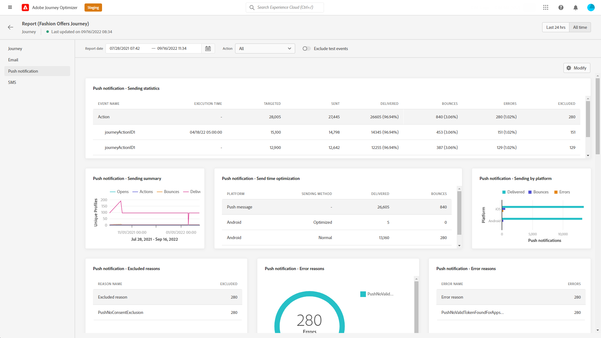

# Global reserapport {#journey-global-report}

>[!CONTEXTUALHELP]
>id="ajo_journey_global_report"
>title="Global reserapport"
>abstract="Med den globala rapporten om resan kan du mäta effekten av dina resor under en viss tidsperiod. Din rapport är uppdelad i olika widgetar som detaljerar hur framgångsrik och felfri din resa är. Varje rapportkontrollpanel kan ändras genom att widgetar storleksändras eller tas bort."

Globala rapporter, som du kommer åt från fliken All time, visar händelser som inträffat för minst två timmar sedan och täcker händelser under en vald tidsperiod. Live-rapporter fokuserar på händelser som har inträffat under de senaste 24 timmarna, med ett tidsintervall på minst två minuter från händelseförekomsten.

Den globala reserapporten kan nås direkt från din resa med **[!UICONTROL View report]** -knappen.

Resan **[!UICONTROL Global report]** visas med följande flikar:

* [Resa](#journey-global)
* [E-post](#email-global)
* [Push](#push-global)
* [SMS](#sms-global)
* [I appen](#in-app-global)

Resan **[!UICONTROL Global report]** är uppdelat i olika widgetar som detaljerat beskriver hur framgångsrik och felfri din resa är. Varje widget kan storleksändras och tas bort vid behov. Mer information finns i [section](global-report.md#modify-dashboard).

En detaljerad lista över alla mätvärden som är tillgängliga i Adobe Journey Optimizer finns på [den här sidan](global-report.md#list-of-components-global).

## Fliken Resor {#journey-global}

Från din resa **[!UICONTROL Global report]**, **[!UICONTROL Journey]** -fliken ger en tydlig bild av de viktigaste spårningsdata som rör kundresan.

+++Läs mer om de olika mätvärden och widgetar som finns för Journey-rapporten.

The **[!UICONTROL Journey Performance]** kan du se sökvägen till dina målprofiler steg för steg under hela kundresan.

The **[!UICONTROL Journey Statistics]** widgeten visar följande KPI:er:

* **[!UICONTROL Entered profiles]**: Totalt antal personer som har nått ingångshändelsen för resan.

* **[!UICONTROL Exited profiles]**: Totalt antal personer som avbrutit resan.

* **[!UICONTROL Failed individual journey]**: Totalt antal enskilda resor som inte slutfördes.

The **[!UICONTROL Events received by event]**, **[!UICONTROL Events by origin]** och **[!UICONTROL Top events]** kan du se vilken av dina **[!UICONTROL Events]** har körts via diagram och tabeller.

**[!UICONTROL Action Performance]**, **[!UICONTROL Action Error Reasons]** och **[!UICONTROL Top Actions]** -widgetar är den mest framgångsrika åtgärden och felen som inträffade när **[!UICONTROL Actions]** aktiverades.

The **[!UICONTROL Top Actions]** tabellen innehåller tillgängliga data för **[!UICONTROL Actions]**, till exempel:

* **[!UICONTROL Actions successfully executed]**: Totalt antal **[!UICONTROL Actions]** har slutförts för en resa.

* **[!UICONTROL Error in action]**: Totalt antal fel som uppstått för **[!UICONTROL Actions]**.

The **[!UICONTROL Consent policies]** tabellen och diagrammet visar antalet profiler som utesluts från varje princip i dina anpassade åtgärder.
Mer information om anpassade åtgärder finns i [den detaljerade dokumentationen](../action/about-custom-action-configuration.md).

Observera att för att dessa widgetar ska visas i dina Journeys-rapporter måste du återställa dina instrumentpaneler. Om du vill göra det klickar du **[!UICONTROL Modify]** sedan **[!UICONTROL Reset]** överst i rapporten.
+++

## Fliken E-post {#email-global}

Från din resa **[!UICONTROL Global report]**, **[!UICONTROL Email]** fliken innehåller huvudinformationen om de e-postleveranser som skickas under resan.

+++Läs mer om de olika mätvärden och widgetar som är tillgängliga för e-postrapporten.

The **[!UICONTROL Email Sending Statistics]** diagram visar hur framgångsrik leveransen är:

* **[!UICONTROL Execution time]**: Starttid för varje körning av resan vid återkommande resor. Om du bara vill ange en eller flera återkommande händelser som mål, markerar du dem på menyn **[!UICONTROL Execution time]** nedrullningsbar meny.

* **[!UICONTROL Targeted]**: Antal profiler som ska användas för åtgärder som att skicka e-post eller SMS.

* **[!UICONTROL Sent]**: Totalt antal försändelser för leveransen.

* **[!UICONTROL Delivered]**: Antal meddelanden som har skickats, i relation till det totala antalet skickade meddelanden.

* **[!UICONTROL Delivery Rate]**: Procentandel meddelanden som skickades.

* **[!UICONTROL Bounces]**: Totalt antal fel som har ackumulerats under leverans och automatisk returbehandling i relation till totalt antal skickade meddelanden.

* **[!UICONTROL Bounce Rate]**: Procentandel e-postmeddelanden som studsade jämfört med skickade e-postmeddelanden.

* **[!UICONTROL Errors]**: Totalt antal fel som uppstod under en leverans och som förhindrar att den skickas till profiler.

* **[!UICONTROL Error Rate]**: Procentandel fel som uppstod under en leverans och som förhindrar att den skickas jämfört med skickade e-postmeddelanden.

The **[!UICONTROL Email - Tracking statistics]** innehåller tillgängliga data för mottagaraktivitet för leveransen:

* **[!UICONTROL Execution time]**: Starttid för varje körning av din återkommande e-post under resan. Om du bara vill rikta in dig på ett eller flera återkommande e-postmeddelanden väljer du det i dialogrutan **[!UICONTROL Execution time]** nedrullningsbar meny.

* **[!UICONTROL Opens]**: Antal gånger som leveransen öppnades i en leverans.

* **[!UICONTROL Unique Opens]**: Procent av öppnade leveranser.

* **[!UICONTROL Unique Open Rate]**: Totalt antal öppnade e-postmeddelanden jämfört med antalet levererade e-postmeddelanden.

* **[!UICONTROL Clicks]**: Antal gånger ett innehåll klickades i ett e-postmeddelande.

* **[!UICONTROL Unique Clicks]**:Antal mottagare som klickat på ett innehåll i ett e-postmeddelande.

* **[!UICONTROL Click through rate]**: Procentandel användare som interagerade med resan.

* **[!UICONTROL Unsubscribe]**: Antal klick på länken för att avbryta prenumerationen.

* **[!UICONTROL Spam complaints]**: Antal gånger ett meddelande har deklarerats som skräppost eller skräppost.

The **[!UICONTROL Sending Statistics]** diagrammet innehåller de data som är tillgängliga för skickade e-postmeddelanden, som:

* **[!UICONTROL Delivered]**: Antal meddelanden som har skickats, i relation till det totala antalet skickade meddelanden.

* **[!UICONTROL Bounces]**: Totalt antal fel som har ackumulerats under leverans och automatisk returbehandling i relation till totalt antal skickade meddelanden.

* **[!UICONTROL Errors]**: Totalt antal fel som uppstod under en leverans och som förhindrar att den skickas till profiler.

The **[!UICONTROL Bounce Reasons]** och **[!UICONTROL Bounce categories]** widgetar innehåller tillgängliga data som är relaterade till studsade meddelanden, som:

* **[!UICONTROL Hard bounce]**: Det totala antalet permanenta fel, t.ex. fel e-postadress. Detta inbegriper ett felmeddelande som uttryckligen anger att adressen är ogiltig, till exempel Okänd användare.

* **[!UICONTROL Soft bounce]**: Det totala antalet tillfälliga fel, till exempel en fullständig inkorg.

* **[!UICONTROL Ignored]**: Det totala antalet tillfälliga, t.ex. frånvaro, eller ett tekniskt fel, t.ex. om avsändartypen är postmaster.

Mer information om studsar finns i [Undertryckningslista](../reports/suppression-list.md) sida.

The **[!UICONTROL Error Reasons]** Med diagram och tabeller kan du se vilket fel som inträffade under leveransen.

The **[!UICONTROL Excluded reasons]** I diagram och tabeller visas de olika anledningar som gjorde att användarprofiler som inte ingår i målprofilerna inte kunde ta emot meddelandet.

The **[!UICONTROL Email - Top Url]** diagram- och tabellinformation om vilka URL:er från leveransen som besöks mest.

The **[!UICONTROL Email - Top recipient domain]** diagram och tabeller visar vilka domäner som är de mest använda av mottagarna för att öppna e-postmeddelandet.

>[!NOTE]
>
>The **[!UICONTROL Optimized vs non optimized]** och **[!UICONTROL Send time optimization]**  widgetar är bara tillgängliga om alternativet för optimering av sändningstid är aktiverat för leverans. Mer information om optimering av sändningstid finns i [den här sidan](../building-journeys/journeys-message.md#send-time-optimization).

The **[!UICONTROL Optimized vs non optimized]** diagram anger huvudinformationen i förhållande till meddelandet, oavsett om de är optimerade eller inte:

* **[!UICONTROL Sent]**: Totalt antal försändelser för leveransen.
* **[!UICONTROL Opens]**: Antal gånger som leveransen öppnades i en leverans.
* **[!UICONTROL Clicks]**: Antal gånger ett innehåll klickades i ett e-postmeddelande.

The **[!UICONTROL Send time optimization]** innehåller information om leveransens framgångar beroende på sändningsmetod: optimerad eller normal.

* **[!UICONTROL Delivered]**: Antal meddelanden som har skickats, i relation till det totala antalet skickade meddelanden.
* **[!UICONTROL Bounces]**: Totalt antal fel som har ackumulerats under leverans och automatisk returbehandling i relation till totalt antal skickade meddelanden.

>[!NOTE]
>
>Widgetarna och mätvärdena för erbjudanden är bara tillgängliga om ett beslut har infogats i ett e-postmeddelande. Mer information om beslutsförvaltning finns i denna [page](../offers/get-started/starting-offer-decisioning.md).

The **[!UICONTROL Offers statistic]** och **[!UICONTROL Offers statistics]** med tidswidgetar mäter hur väl erbjudandet lyckats och påverkat er målgrupp. Den innehåller detaljerad huvudinformation om meddelandet med KPI:er:

* **[!UICONTROL Offer sent]**: Totalt antal utskick för erbjudandet.

* **[!UICONTROL Offer impression]**: Antal gånger som erbjudandet öppnades i en leverans.

* **[!UICONTROL Offer clicks]**: Antal gånger som någon klickade på ett erbjudande i en leverans.

The **[!UICONTROL Offers detailed statistic]** tabellen innehåller tillgängliga data för mottagaraktivitet med ditt erbjudande:

* **[!UICONTROL Placement name]**: Namnet på den placering som användes för att visa ditt erbjudande. Mer information om placering finns i [page](../offers/offer-library/creating-placements.md).

* **[!UICONTROL Offer name]**: Namn på erbjudandet som lagts till i leveransen. Mer information om placering finns i [page](../offers/offer-library/creating-personalized-offers.md).

* **[!UICONTROL Offer sent]**: Totalt antal utskick för erbjudandet.

* **[!UICONTROL Offer impression rate]**: Andel öppnade erbjudanden jämfört med antalet skickade erbjudanden.

* **[!UICONTROL Offer click rate]**: Procentandel användare som interagerade med erbjudandet.
+++

## Fliken Push-meddelanden {#push-global}

Från din resa **[!UICONTROL Global report]**, **[!UICONTROL Push notification]** fliken innehåller huvudinformationen i förhållande till de push-leveranser som skickas under resan.

+++Läs mer om de olika mätvärden och widgetar som är tillgängliga för rapporten Push.

The **[!UICONTROL Push notification - Sending statistics]** tabellen visar huvudinformationen i förhållande till push-meddelanden med diagram och KPI:er:

* **[!UICONTROL Execution time]**: Starttid för varje körning av resan vid återkommande resor. Om du bara vill ange en eller flera återkommande händelser som mål, markerar du dem på menyn **[!UICONTROL Execution time]** nedrullningsbar meny.

* **[!UICONTROL Targeted]**: Antal profiler som ska användas för åtgärder som att skicka e-post eller SMS.

* **[!UICONTROL Sent]**: Totalt antal försändelser för leveransen.

* **[!UICONTROL Delivered]**: Antal meddelanden som har skickats, i relation till det totala antalet skickade meddelanden.

* **[!UICONTROL Delivery Rate]**: Procentandel meddelanden som skickades.

* **[!UICONTROL Bounces]**: Totalt antal fel som har ackumulerats under leverans och automatisk returbehandling i relation till totalt antal skickade meddelanden.

* **[!UICONTROL Bounce Rate]**: Procentandel push-meddelanden som studsade jämfört med skickade push-meddelanden.

* **[!UICONTROL Errors]**: Totalt antal fel som uppstod under en leverans och som förhindrar att den skickas till profiler.

* **[!UICONTROL Error Rate]**: Procentandel fel som uppstod under en leverans och som förhindrar att den skickas jämfört med push-meddelanden som skickas.

The **[!UICONTROL Push - Tracking statistics]** innehåller tillgängliga data för mottagaraktivitet för leveransen:

* **[!UICONTROL Execution time]**: Starttid för varje körning av resan vid återkommande resor. Om du bara vill ange en eller flera återkommande händelser som mål, markerar du dem på menyn **[!UICONTROL Execution time]** nedrullningsbar meny.

* **[!UICONTROL Opens]**: Antal gånger ett meddelande öppnades i en leverans.

* **[!UICONTROL Open Rate]**: Procentandel öppnade push-meddelanden.

* **[!UICONTROL Actions]**: Totalt antal åtgärder för push-meddelandet som levererats, t.ex. knappklickning eller avvisning.

* **[!UICONTROL Engagements]**: Totalt antal öppningar och åtgärder för detta push-meddelande, dvs. om profilen öppnade push-meddelandet eller om någon klickade på en knapp.

* **[!UICONTROL Engagement Rate]**: Procentandel öppningar och åtgärder för det här push-meddelandet, dvs. om profilen öppnade push-meddelandet eller om någon klickade på en knapp.

The **[!UICONTROL Push notification summary]** diagrammet innehåller data som är tillgängliga för skickade push-meddelanden, som:

* **[!UICONTROL Opens]**: Antal gånger ett meddelande öppnades i en leverans.

* **[!UICONTROL Actions]**: Totalt antal åtgärder för push-meddelandet som levererats, t.ex. knappklickning eller avvisning.

* **[!UICONTROL Bounces]**: Totalt antal fel som har ackumulerats under leverans och automatisk returbehandling i relation till totalt antal skickade meddelanden.

* **[!UICONTROL Delivered]**: Antal meddelanden som har skickats, i relation till det totala antalet skickade meddelanden.

* **[!UICONTROL Errors]**: Totalt antal fel som uppstod under en leverans och som förhindrar att den skickas till profiler.

>[!NOTE]
>
>The **[!UICONTROL Optimized vs non optimized]** och **[!UICONTROL Send time optimization]**  widgetar är bara tillgängliga om alternativet för optimering av sändningstid är aktiverat för leverans. Mer information om optimering av sändningstid finns i [den här sidan](../building-journeys/journeys-message.md#send-time-optimization).

The **[!UICONTROL Optimized vs non optimized]** diagram anger huvudinformationen i förhållande till meddelandet, oavsett om de är optimerade eller inte:

* **[!UICONTROL Delivered]**: Antal meddelanden som har skickats, i relation till det totala antalet skickade meddelanden.
* **[!UICONTROL Opens]**: Antal gånger som leveransen öppnades i en leverans.
* **[!UICONTROL Actions]**: Totalt antal åtgärder för push-meddelandet som levererats, t.ex. knappklickning eller avvisning.

The **[!UICONTROL Send time optimization]** innehåller information om leveransens framgångar beroende på sändningsmetod: optimerad eller normal.

* **[!UICONTROL Delivered]**: Antal meddelanden som har skickats, i relation till det totala antalet skickade meddelanden.
* **[!UICONTROL Bounces]**: Totalt antal fel som har ackumulerats under leverans och automatisk returbehandling i relation till totalt antal skickade meddelanden.

The **[!UICONTROL Error Reasons]** Med diagram och tabeller kan du se vilket fel som inträffade under leveransen.

The **[!UICONTROL Excluded reasons]** I diagram och tabeller visas de olika anledningar som gjorde att användarprofiler som inte ingår i målprofilerna inte kunde ta emot meddelandet.

The **[!UICONTROL Tracking by platform]**, **[!UICONTROL Sending by platform]** och **[!UICONTROL Breakdown by platform]** diagram och tabeller visar hur bra push-meddelandena är beroende på mottagarens operativsystem.

SMS **[!UICONTROL Global report]** är uppdelat i olika widgetar som detaljerat beskriver leveransens framgångar och fel. Varje widget kan storleksändras och tas bort vid behov. Mer information om detta finns i [section](global-report.md#modify-dashboard).
+++

## fliken SMS {#sms-global}

+++Läs mer om de olika mätvärden och widgetar som är tillgängliga för SMS-rapporten.

The **[!UICONTROL SMS - Sending statistics]** tabellen visar hur framgångsrik leveransen är:

* **[!UICONTROL Execution time]**: Starttid för varje körning av resan vid återkommande resor. Om du bara vill ange en eller flera återkommande händelser som mål, markerar du dem på menyn **[!UICONTROL Execution time]** nedrullningsbar meny.

* **[!UICONTROL Targeted]**: Antal användarprofiler som kvalificerar sig som målprofiler för den här leveransen.

* **[!UICONTROL Excluded]**: Antal användarprofiler, exkluderade från målprofilerna, som inte fick meddelandet.

* **[!UICONTROL Sent]**: Totalt antal försändelser för leveransen.

* **[!UICONTROL Bounces]**: Totalt antal fel som har ackumulerats under leverans och automatisk returbehandling i relation till totalt antal skickade meddelanden.

* **[!UICONTROL Errors]**: Totalt antal fel som uppstod under en leverans och som förhindrar att den skickas till profiler.

The **[!UICONTROL SMS summary]** widgeten visar huvudinformationen i förhållande till meddelandet med ett diagram:

* **[!UICONTROL Sent]**: Totalt antal försändelser för leveransen.

* **[!UICONTROL Bounces]**: Totalt antal fel som har ackumulerats under leverans och automatisk returbehandling i relation till totalt antal skickade meddelanden.

* **[!UICONTROL Errors]**: Totalt antal fel som uppstod under en leverans och som förhindrar att den skickas till profiler.

The **[!UICONTROL Exclude Reasons]** Med diagram och tabeller kan du se vilka fel och undantag som inträffade under leveransen.

The **[!UICONTROL SMS - Clicks by links]** och **[!UICONTROL SMS - Tracking statistics]** widgetar detaljerar den viktigaste informationen i förhållande till besökarnas engagemang med dina URL:er.

+++

## Fliken I appen {#in-app-global}

Från din resa **[!UICONTROL Global report]**, **[!UICONTROL In-app]** på fliken anger huvudinformationen i förhållande till de leveranser i appen som skickas på dina resor.

+++Läs mer om de olika mätvärden och widgetar som är tillgängliga för rapporten i appen.

The **[!UICONTROL In-app performance]** Nyckeltal anger den viktigaste informationen i relation till besökarnas engagemang i era meddelanden i appen, som:

* **[!UICONTROL Unique impressions]**: antal unika användare som meddelandet i appen viserades till.

* **[!UICONTROL Impressions]**: totalt antal meddelanden i appen som visas för alla användare.

  >[!NOTE]
  >
  >För att säkerställa att en Impression räknas måste användaren uppfylla två kriterier:
  >* Kvalificering i upplevelsen i appen, som uppnås genom att man når den specifika aktiviteten i appen under resan.
  >* Uppfyller villkoren som anges i utlösarreglerna.
  > 
  >På grund av det andra kriteriet kan det finnas betydande variationer mellan antalet riktade profiler och antalet unika visningar.

* **[!UICONTROL Interaction]**: antal ärenden i meddelandet i appen. Detta inkluderar alla åtgärder som användaren utför, t.ex. klickningar, uppsägningar eller annan interaktion.

The **[!UICONTROL In-app summary]** diagram visar utvecklingen av dina visningar och interaktioner i appen för den aktuella perioden.

The **[!UICONTROL Interactions by type]** diagram och tabeller visar hur användare interagerade med meddelanden i appen genom att spåra varje klick, avgång eller interaktion.
+++
