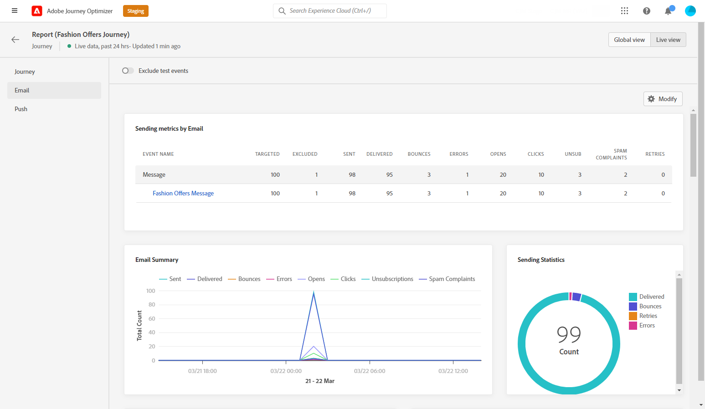

# Rapport om livesändning på resa {#journey-live-report}

Du kan få åtkomst till liverapporten från din resa med **[!UICONTROL Live report]** -knappen.

Resan **[!UICONTROL Live report]** visas med följande flikar:

* [Resa](#journey-live)
* [E-post](#email-live)
* [Push](#push-live)

Resan **[!UICONTROL Live report]** är uppdelat i olika widgetar som detaljerat beskriver hur framgångsrik och felfri din resa är. Varje widget kan storleksändras och tas bort vid behov. Mer information finns i [section](live-report.md#modify-dashboard).

## Fliken Resor {#journey-live}

Från din resa **[!UICONTROL Live report]**, **[!UICONTROL Journey]** -fliken ger en tydlig bild av de viktigaste spårningsdata som rör kundresan.

**[!UICONTROL Journey Performance]** gör att du kan se vägen för dina målprofiler steg för steg under hela kundresan.

The **[!UICONTROL Journey Statistics]** widgeten visar följande KPI:er:

* **[!UICONTROL Entered profiles]**: Totalt antal personer som har nått resans inträde.

* **[!UICONTROL Exited profiles]**: Totalt antal personer som avbrutit resan.

* **[!UICONTROL Failed individual journeys]**: Totalt antal enskilda resor som inte har slutförts.

The **[!UICONTROL Event executed over the last 24 hours]** och **[!UICONTROL Events]** Med -widgetar kan du se vilken av dina händelser som har utförts genom sammanfattningsnummer, diagram och tabell.

The **[!UICONTROL Action executed over the last 24 hours]** och **[!UICONTROL Actions executed and errors]** -widgetar är den mest framgångsrika åtgärden och de fel som inträffade när dina åtgärder utlöstes. Åtgärdsdiagrammet, tabellen och sammanfattningsnumren innehåller de data som är tillgängliga för åtgärder, till exempel:

* **[!UICONTROL Actions executed]**: Totalt antal genomförda åtgärder för en resa.

* **[!UICONTROL Error in actions]**: Totalt antal fel som uppstått för åtgärder.

## Fliken E-post {#email-live}

Från din resa **[!UICONTROL Live report]**, **[!UICONTROL Email]** fliken innehåller huvudinformationen om de e-postleveranser som skickas under resan.

En detaljerad rapport om en viss e-postleverans finns i [E-postlive-rapport](email-live-report.md) -avsnitt.

The **[!UICONTROL Email Sending Statistics]** widgeten innehåller information om den viktigaste informationen i förhållande till ditt meddelande:

* **[!UICONTROL Delivered]**: Antal meddelanden som har skickats, i relation till det totala antalet skickade meddelanden.

* **[!UICONTROL Bounces]**: Totalt antal fel som sammanställts under leverans och automatisk returbehandling i relation till totalt antal skickade meddelanden.

* **[!UICONTROL Errors]**: Totalt antal fel som uppstod under en leverans och som förhindrar att den skickas till profiler.

The **[!UICONTROL Sending metrics by Email]** tabell och **[!UICONTROL Email Summary]** diagram visar hur framgångsrik leveransen är:

* **[!UICONTROL Sent]**: Totalt antal försändelser för leveransen.

* **[!UICONTROL Delivered]**: Antal meddelanden som har skickats, i relation till det totala antalet skickade meddelanden.

* **[!UICONTROL Bounces]**: Totalt antal fel som sammanställts under leverans och automatisk returbehandling i relation till totalt antal skickade meddelanden.

* **[!UICONTROL Errors]**: Totalt antal fel som uppstod under en leverans och som förhindrar att den skickas till profiler.

* **[!UICONTROL Opens]**: Antal gånger ett meddelande öppnades i en leverans.

* **[!UICONTROL Clicks]**: Antal gånger som ett innehåll klickades i en leverans.

* **[!UICONTROL Unsubscribe]**: Antal klick på länken för att avbryta prenumerationen.

* **[!UICONTROL Spam complaints]**: Antal gånger ett meddelande har deklarerats som skräppost eller skräppost.

The **[!UICONTROL Bounce Reasons]**, **[!UICONTROL Bounce categories]** och **[!UICONTROL Hard and bounce - by Email]** widgetar innehåller tillgängliga data som är relaterade till studsade meddelanden, som:

* **[!UICONTROL Hard bounce]**: Det totala antalet permanenta fel, t.ex. fel e-postadress. Detta inbegriper ett felmeddelande som uttryckligen anger att adressen är ogiltig, till exempel Okänd användare.

* **[!UICONTROL Soft bounce]**: Det totala antalet tillfälliga fel, t.ex. en fullständig inkorg.

* **[!UICONTROL Ignored]**: Det totala antalet tillfälliga, t.ex. frånvaro, eller ett tekniskt fel, t.ex. om avsändartypen är postmaster.

The **[!UICONTROL Error Reasons]** och **[!UICONTROL Exclude Reasons]** Med diagram och tabeller kan du se vilka fel och undantag som inträffade under leveransen.

The **[!UICONTROL Email - Top recipient domain]** diagram och tabeller visar vilka domäner som är de mest använda av mottagarna för att öppna e-postmeddelandet.

>[!NOTE]
>
>Widgetarna och mätvärdena för erbjudanden är bara tillgängliga om ett beslut har infogats i ett e-postmeddelande. Mer information om beslutsförvaltning finns i denna [page](../offers/get-started/starting-offer-decisioning.md).

The **[!UICONTROL Offers statistic]** och **[!UICONTROL Offers statistics]** med tidswidgetar mäter hur väl erbjudandet lyckats och påverkat er målgrupp. Den innehåller detaljerad huvudinformation om meddelandet med nyckeltal:

* **[!UICONTROL Offer sent]**: Totalt antal utskick för erbjudandet.

* **[!UICONTROL Offer impression]**: Antal gånger som erbjudandet öppnades i en leverans.

* **[!UICONTROL Offer clicks]**: Antal gånger som man klickat på ett erbjudande i en leverans.

## Push-flik {#push-live}

Från din resa **[!UICONTROL Live report]**, **[!UICONTROL Push]** fliken innehåller huvudinformationen i förhållande till de push-leveranser som skickas under resan.

En detaljerad rapport om en viss push-leverans finns i [Publicera live-rapport](push-live-report.md) -avsnitt.

**[!UICONTROL Push notification sending performance]**, **[!UICONTROL Push notification summary]** och **[!UICONTROL Sending metrics - by Push]** widgetar anger huvudinformationen i förhållande till meddelandet:

* **[!UICONTROL Sent]**: Totalt antal försändelser för leveransen.

* **[!UICONTROL Delivered]**: Antal meddelanden som har skickats, i relation till det totala antalet skickade meddelanden.

* **[!UICONTROL Bounces]**: Totalt antal fel som sammanställts under leverans och automatisk returbehandling i relation till totalt antal skickade meddelanden.

* **[!UICONTROL Errors]**: Totalt antal fel som uppstod under en leverans och som förhindrar att den skickas till profiler.

* **[!UICONTROL Opens]**: Antal gånger ett meddelande öppnades i en leverans.

* **[!UICONTROL Actions]**: Totalt antal åtgärder för push-meddelandet som levererats, t.ex. knappklickning eller avbruten.

* **[!UICONTROL Engagements]**: Totalt antal öppningar och åtgärder för det här push-meddelandet, dvs om profilen öppnade push-meddelandet eller om någon klickade på en knapp.

The **[!UICONTROL Error Reasons]** och **[!UICONTROL Exclude Reasons]** Med diagram och tabeller kan du se vilka fel och undantag som inträffade under leveransen.

The **[!UICONTROL Sending statistics - Failed]** kan du se hur många fel och studsar som har inträffat.

The **[!UICONTROL Tracking by platform]**, **[!UICONTROL Sending by platform]** och **[!UICONTROL Breakdown by platform]** diagram och tabeller visar hur bra push-meddelandena är beroende på vilket operativsystem som används.
