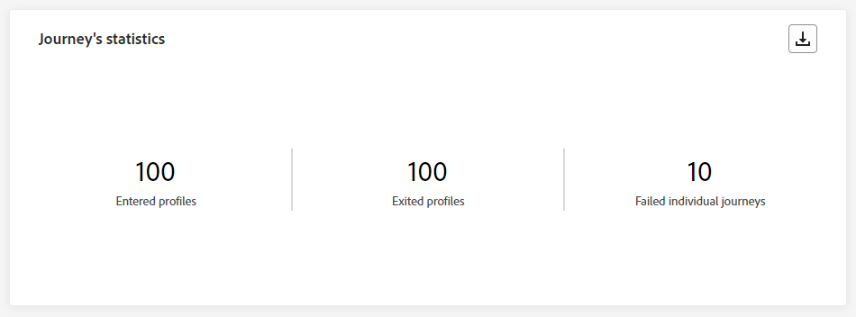
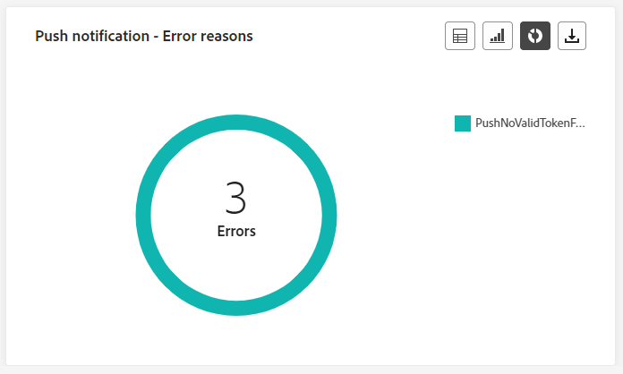
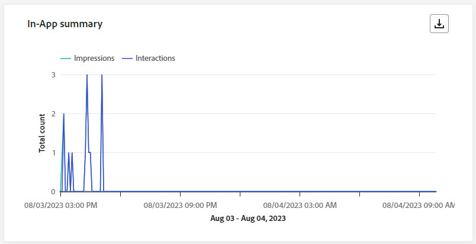

# Rapport om livesändning på resa {#journey-live-report}

>[!CONTEXTUALHELP]
>id="ajo_journey_live_report"
>title="Rapport om livesändning på resa"
>abstract="Med reserapporten kan ni i realtid mäta och visualisera påverkan och resultat av era resor bara under de senaste 24 timmarna. Din rapport är uppdelad i olika widgetar som detaljerar hur framgångsrik och felfri din resa är. Varje rapportkontrollpanel kan ändras genom att widgetar storleksändras eller tas bort."

Live-rapporter, som du kommer åt från fliken Senaste 24 timmarna, visar händelser som har inträffat under de senaste 24 timmarna, med ett tidsintervall på minst två minuter från händelseförekomsten. Som jämförelse rapporterar Customer Journey Analytics fokus på händelser som inträffade för minst två timmar sedan och täcker händelser under en viss tidsperiod.

Öppna livesändningsrapporten på menyn [!UICONTROL Journeys] genom att öppna kundens [!UICONTROL More actions]-meny och välja [!UICONTROL View last 24hrs report].

Sidan för resan **[!UICONTROL Live report]** visas med följande flikar:

* [Resa](#journey-live)
* [E-post](#email-live)
* [Push](#push-live)
* [SMS](#sms-live)
* [I appen](#in-app-live)

Resan **[!UICONTROL Live report]** är uppdelad i olika widgetar som anger hur framgångsrik och felfri din resa är. Varje widget kan storleksändras och tas bort vid behov. Mer information finns i [avsnittet](live-report.md#modify-dashboard).

En detaljerad lista över alla mätvärden som är tillgängliga i Adobe Journey Optimizer finns på [den här sidan](live-report.md#live-report).

## Fliken Resor {#journey-live}

Från din resa **[!UICONTROL Live report]** ger fliken **[!UICONTROL Journey]** en tydlig bild av de viktigaste spårningsdata som rör din resa.

### Resans resultat {#journey-performance}

>[!CONTEXTUALHELP]
>id="ajo_journey_performance_live"
>title="Resans resultat"
>abstract="Med widgeten Prestanda för resan kan du visuellt spåra sökvägen till dina målprofiler när de har passerat genom din resa de senaste 24 timmarna."

Med **[!UICONTROL Journey Performance]** kan du se sökvägen till dina målprofiler steg för steg under din resa.

Observera att antalet profiler för en nod endast uppdateras när profilen har slutfört noden, inte när den anges. En profil på en **Wait**-nod räknas till exempel bara när det angivna datumet har nåtts och profilen har avslutat noden.

### Resestatistik {#journey-statistics}

>[!CONTEXTUALHELP]
>id="ajo_journey_statistics_live"
>title="Resestatistik"
>abstract="KPI:erna (Journey Statistics Key Performance Indicators) fungerar som en omfattande kontrollpanel som ger en djupgående analys av viktiga mått från de senaste 24 timmarna i samband med din resa."

**[!UICONTROL Journey Statistics]** KPI:er (Key Performance Indicators) fungerar som en heltäckande kontrollpanel, som tillhandahåller en analys av viktig statistik som är kopplad till din resa under de senaste 24 timmarna. Detta omfattar detaljer som antalet inskrivna profiler och förekomster av misslyckade enskilda resor, vilket ger en heltäckande insikt i hur effektiv resan är och hur hög engagemanget är.

+++ Läs mer om Journeys statistik

* **[!UICONTROL Entered profiles]**: Totalt antal personer som har nått resans anmälningshändelse.

* **[!UICONTROL Exited profiles]**: Totalt antal personer som avbrutit resan.

* **[!UICONTROL Failed individual journeys]**: Totalt antal enskilda resor som inte kördes korrekt.
+++

### Åtgärd utförd de senaste 24 timmarna {#action-executed}

>[!CONTEXTUALHELP]
>id="ajo_journey_actions_executed_live"
>title="Åtgärd utförd de senaste 24 timmarna"
>abstract="Den åtgärd som har utförts under de senaste 24 timmars widgeten ger en ögonblicksbild av de senaste prestandan och visar hur effektiva de utförda åtgärderna har varit under de senaste 24 timmarna."

Widgeten **[!UICONTROL Action executed over the last 24 hours]** representerar den mest framgångsrika åtgärden som inträffade när dina åtgärder utlöstes.

+++ Läs mer om hur du använder Action under de senaste 24 timmarna

* **[!UICONTROL Actions executed]**: Totalt antal åtgärder som har utförts för en resa.

* **[!UICONTROL Error in actions]**: Totalt antal fel som uppstod för åtgärder.

+++

### Körda åtgärder och fel {#actions-errors}

>[!CONTEXTUALHELP]
>id="ajo_journey_actions_executed__errors_live"
>title="Körda åtgärder och fel"
>abstract="Widgeten Åtgärder och fel visar de mest framgångsrika åtgärderna och eventuella fel som inträffade under utlösandet av åtgärder de senaste 24 timmarna. Den här widgeten ger en omfattande översikt över både framgångsrika körningar och påträffade fel, vilket ger värdefulla insikter om hur dina åtgärder nyligen har utförts."

Widgeten **[!UICONTROL Actions executed and errors]** representerar den mest framgångsrika åtgärden och felen som inträffade när dina åtgärder utlöstes under de senaste 24 timmarna.

+++ Läs mer om utförda åtgärder och felmått

* **[!UICONTROL Actions executed]**: Totalt antal åtgärder som har utförts för en resa.

* **[!UICONTROL Error in actions]**: Totalt antal fel som uppstod för åtgärder.

+++

### Orsaker till funktionsfel {#actions-error-reasons}

>[!CONTEXTUALHELP]
>id="ajo_journey_actions_errors_live"
>title="Orsaker till funktionsfel"
>abstract="I tabellen och diagrammet över orsaker till åtgärdsfel finns en detaljerad sammanfattning av fel som uppstod under utförandet av dina åtgärder. Den innehåller en omfattande översikt över problem som kan ha inträffat under de senaste 24 timmarna."

Tabellen och diagrammet **[!UICONTROL Action error reasons]** innehåller en omfattande översikt över fel som uppstod under utförandet av dina åtgärder under de senaste 24 timmarna.

### Feltyp efter åtgärder {#error-type-actions}

>[!CONTEXTUALHELP]
>id="ajo_journey_actions_error_type_live"
>title="Feltyp efter åtgärder"
>abstract="I tabellen och diagrammet Error type by actions finns en detaljerad översikt över fel som inträffade under varje körning av dina åtgärder under de senaste 24 timmarna."

Tabellen och diagrammet **[!UICONTROL Error type by actions]** innehåller en omfattande översikt över fel som inträffat för varje körning av dina åtgärder under de senaste 24 timmarna.

### Händelse som har utförts under de senaste 24 timmarna {#event-executed-24hours}

>[!CONTEXTUALHELP]
>id="ajo_journey_event_24hours_live"
>title="Händelse som har utförts under de senaste 24 timmarna"
>abstract="Med den händelse som har körts under de senaste 24 timmarna kan du identifiera vilken av dina händelser som har slutförts under de senaste 24 timmarna. "

Med widgeten **[!UICONTROL Event executed over the last 24 hours]** kan du identifiera vilka av dina händelser som har slutförts under de senaste 24 timmarna.

### Händelser {#events}

>[!CONTEXTUALHELP]
>id="ajo_journey_events_live"
>title="Händelser"
>abstract="Widgeten Händelser innehåller en omfattande vy över vilka av dina händelser som har slutförts. Den innehåller ett sammanfattningsnummer, diagram och tabell med detaljerade insikter från de senaste 24 timmarna."

Widgeten **[!UICONTROL Events]** gör att du kan se vilken av dina händelser som utfördes med hjälp av sammanfattningsnummer, diagram och tabell.

### Händelser efter ursprung {#events-origin}

>[!CONTEXTUALHELP]
>id="ajo_journey_events_origin_live"
>title="Händelser efter ursprung"
>abstract="Tabellen och diagrammen Händelser efter ursprung visar hur du lyckades ta emot dina händelser de senaste 24 timmarna. Dessa visuella representationer gör att ni kan identifiera de händelser som effektivt togs emot, och ge värdefulla insikter om resultatet och effekten av varje händelse under resan."

Tabellen och diagrammen **[!UICONTROL Events by origin]** ger ett detaljerat perspektiv på hur dina händelser har tagits emot under de senaste 24 timmarna. Genom dessa visuella representationer kan ni ta reda på exakt vilka av era evenemang som har tagits emot effektivt och ge värdefulla insikter om hur enskilda händelser under resan fungerar och påverkas.

## Fliken E-post {#email-live}

Från din resa **[!UICONTROL Live report]** anger fliken **[!UICONTROL Email]** huvudinformationen i förhållande till e-postmeddelanden som skickas under din resa.

### E-post - Sändande prestanda {#email-sending-performance}

>[!CONTEXTUALHELP]
>id="ajo_journey_email_sending_performance_live"
>title="E-post - Sändande prestanda"
>abstract="Diagrammet E-post - Skicka statistik sammanfattar viktiga data om din e-post, som Målinriktad eller Levererad under de senaste 24 timmarna."

Diagrammet **[!UICONTROL Email - Sending performance]** ger en heltäckande bild av data relaterade till skickade e-postmeddelanden under din resa, och ger insikter i viktiga mått som levererade och studsar som har hänt under de senaste 24 timmarna. Detta möjliggör en detaljerad analys av e-postsändningsprocessen och ger värdefull information om hur effektiva och effektiva era resor är.

+++ Läs mer om e-post - Sändning av prestandamått

* **[!UICONTROL Delivered]**: Antal e-postmeddelanden som har skickats.

* **[!UICONTROL Bounces]**: Totalt antal fel som ackumulerats under sändningsprocessen och automatisk returbearbetning.

* **[!UICONTROL Errors]**: Totalt antal fel som uppstod under sändningsprocessen och som förhindrar att den skickas till profiler.

* **[!UICONTROL Retries]**: Antal e-postmeddelanden i kön för nya försök.

+++

### E-post - statistik {#email-stat}

>[!CONTEXTUALHELP]
>id="ajo_journey_email_statistics_live"
>title="E-post - statistik"
>abstract="Registret E-post - statistik innehåller data om profilaktivitet för din e-post de senaste 24 timmarna."

Tabellen **[!UICONTROL Email - Statistics]** innehåller en omfattande sammanfattning av viktiga data om e-post under dina resor de senaste 24 timmarna. Den innehåller viktiga mätvärden som målgruppens storlek och antalet e-postmeddelanden som levererats, och ger värdefulla insikter om hur effektiva och omfattande era e-postmeddelanden och resor är.

+++ Läs mer om statistik för e-postsändning

* **[!UICONTROL Targeted]**: Totalt antal meddelanden som bearbetats under sändningsprocessen.

* **[!UICONTROL Excluded]**: Antal profiler som har undantagits av Adobe Journey Optimizer.

* **[!UICONTROL Sent]**: Totalt antal skickade e-postmeddelanden.

* **[!UICONTROL Delivered]**: Antal e-postmeddelanden som har skickats, i relation till det totala antalet skickade meddelanden.

* **[!UICONTROL Bounces]**: Totalt antal fel som har ackumulerats under sändningsprocessen och automatisk returbearbetning i relation till totalt antal skickade meddelanden.

* **[!UICONTROL Errors]**: Totalt antal fel som uppstod under sändningsprocessen och som förhindrar att den skickas till profiler.

* **[!UICONTROL Opens]**: Antal gånger som dina e-postmeddelanden öppnats.

* **[!UICONTROL Clicks]**: Antal gånger som ett innehåll klickades i dina e-postmeddelanden.

* **[!UICONTROL Unsubscribe]**: Antal klick på länken för att avbryta prenumerationen.

* **[!UICONTROL Spam complaints]**: Antal gånger ett meddelande har deklarerats som skräppost eller skräppost.

* **[!UICONTROL Retries]**: Antal e-postmeddelanden i kön för nya försök.

+++

### E-post - Prestanda efter datum {#email-perf-date}

>[!CONTEXTUALHELP]
>id="ajo_journey_email_performance_bydate_live"
>title="E-post - Prestanda efter datum"
>abstract="Diagrammet E-post - prestation efter datum visar omfattande data från de senaste 24 timmarna när det gäller skickade e-postmeddelanden och ger insikter i viktiga mätvärden som levererade och studsade, vilket möjliggör en detaljerad analys av e-postsändningsprocessen."

Widgeten **[!UICONTROL Email - Performance by date]** ger en detaljerad översikt över viktig information om dina e-postmeddelanden, som presenteras i ett diagram, och ger insikter om prestandatrender under de senaste 24 timmarna.

+++ Läs mer om e-post - prestation efter datummått

* **[!UICONTROL Sent]**: Totalt antal skickade e-postmeddelanden.

* **[!UICONTROL Delivered]**: Antal e-postmeddelanden som har skickats.

* **[!UICONTROL Bounces]**: Totalt antal fel som ackumulerats under sändningsprocessen och automatisk returbearbetning.

* **[!UICONTROL Errors]**: Totalt antal fel som uppstod under sändningsprocessen och som förhindrar att den skickas till profiler.

* **[!UICONTROL Opens]**: Antal gånger som dina e-postmeddelanden öppnats.

* **[!UICONTROL Clicks]**: Antal gånger som ett innehåll klickades på i dina e-postmeddelanden.

* **[!UICONTROL Unsubscribe]**: Antal klick på länken för att avbryta prenumerationen.

* **[!UICONTROL Spam complaints]**: Antal gånger ett meddelande har deklarerats som skräppost eller skräppost.

+++

### E-post - studskategorier och orsaker {#email-bounce-categories}

>[!CONTEXTUALHELP]
>id="ajo_journey_email_bounces_live"
>title="E-post - studskategorier och orsaker"
>abstract="XX"

Widgetarna **[!UICONTROL Bounce Reasons]** och **[!UICONTROL Bounce categories]** kompilerar tillgängliga data som är relaterade till studsade meddelanden, och ger detaljerade insikter om de specifika orsakerna och kategorierna bakom e-poststudenten under de senaste 24 timmarna.

Mer information om studsar finns på sidan [Suppressionslista](../reports/suppression-list.md).

+++ Läs mer om e-post - studskategorier och orsaker

* **[!UICONTROL Hard bounce]**: Det totala antalet permanenta fel, till exempel en felaktig e-postadress. Detta inbegriper ett felmeddelande som uttryckligen anger att adressen är ogiltig, till exempel Okänd användare.

* **[!UICONTROL Soft bounce]**: Det totala antalet tillfälliga fel, till exempel en fullständig inkorg.

* **[!UICONTROL Ignored]**: Det totala antalet tillfälliga, till exempel frånvaro, eller ett tekniskt fel, till exempel om avsändartypen är postmaster.

+++

### E-post - felorsaker {#email-error-reasons}

>[!CONTEXTUALHELP]
>id="ajo_journey_email_errors_live"
>title="E-post - felorsaker"
>abstract="Med diagrammen E-post - felorsaker och tabellen kan du identifiera de specifika fel som uppstod under sändningsprocessen de senaste 24 timmarna."

Diagram och tabell **[!UICONTROL Error Reasons]** ger synlighet för de specifika fel som uppstod under sändningsprocessen de senaste 24 timmarna, vilket ger värdefull information om felens art och förekomst.

### E-post - orsaker som inte tas med {#email-excluded}

>[!CONTEXTUALHELP]
>id="ajo_journey_email_excluded_live"
>title="E-post - orsaker som inte tas med"
>abstract="I diagrammen och tabellen Exkluderade orsaker visas de olika faktorer som ledde till att användarprofiler exkluderades från målgruppen och inte fick meddelandet under de senaste 24 timmarna."

Diagrammen och tabellen **[!UICONTROL Excluded Reasons]** innehåller en heltäckande bild av de olika faktorer som har lett till att användarprofiler har tagits bort från målgruppen, vilket har lett till att meddelandet inte har tagits emot under de senaste 24 timmarna.

Se [den här sidan](exclusion-list.md) för en utförlig lista över orsaker till undantag.

### E-post - Bästa mottagardomän {#email-best-recipient}

>[!CONTEXTUALHELP]
>id="ajo_journey_email_best_recipient_live"
>title="E-post - Bästa mottagardomän"
>abstract="Diagrammet E-post - Bästa mottagardomän och tabellen ger en detaljerad beskrivning av de domäner som mottagarna oftast använder för att öppna e-postmeddelandet, och ger värdefulla insikter om mottagarnas beteende de senaste 24 timmarna."

Diagrammet och tabellen **[!UICONTROL Email - Best recipient domain]** innehåller en detaljerad beskrivning av de domäner som oftast används för att öppna e-postmeddelanden de senaste 24 timmarna. Detta ger värdefulla insikter om profilbeteendet och hjälper er att förstå vilka plattformar ni föredrar.

### E-posterbjudanden {#email-offers}

>[!CONTEXTUALHELP]
>id="ajo_journey_email_offers_live"
>title="E-post - erbjudanden"
>abstract="Statistikwidgetarna för erbjudanden och ger utförliga statistikwidgetar ger omfattande insikter om hur erbjudandena har fungerat under de senaste 24 timmarna. De ger en detaljerad analys av deras effekt över tid och ger en mer djupgående förståelse för hur de fungerar."

>[!NOTE]
>
>Widgetarna och mätvärdena för erbjudanden är bara tillgängliga om ett beslut har infogats i ett e-postmeddelande. Mer information om beslutshantering finns på [sidan](../offers/get-started/starting-offer-decisioning.md).

Widgetarna **[!UICONTROL Offers statistic]** och **[!UICONTROL Offers statistics over time]** mäter hur väl erbjudandet lyckats och påverkat målgruppen. Den innehåller detaljerad huvudinformation om meddelandet med KPI:er.

+++ Läs mer om e-post - ger mätvärden

* **[!UICONTROL Offer sent]**: Totalt antal utskick för erbjudandet.

* **[!UICONTROL Offer impression]**: Antal gånger som erbjudandet öppnades i dina e-postmeddelanden.

* **[!UICONTROL Offer clicks]**: Antal gånger som ett erbjudande klickades på i dina e-postmeddelanden.

+++

### E-post - optimering {#email-sto}

>[!CONTEXTUALHELP]
>id="ajo_journey_email_optimization_live"
>title="E-post - optimering"
>abstract="Optimering av sändningstiden och Optimerade och icke-optimerade widgetar ger detaljerad information om dina meddelanden från de senaste 24 timmarna, och visar om de har optimerats eller inte."

>[!NOTE]
>
>Widgetarna **[!UICONTROL Send time optimization]** och **[!UICONTROL Optimized vs non optimized]** är bara tillgängliga om alternativet för optimering av sändningstid är aktiverat för leveransen. Mer information om optimering av sändningstid finns på [den här sidan](../building-journeys/send-time-optimization.md).

Widgetarna **[!UICONTROL Send time optimization]** och **[!UICONTROL Optimized vs non optimized]** visar hur bra dina e-postmeddelanden är beroende på sändningsmetoden: optimerad eller normal.

+++ Läs mer om optimering av sändningstid och optimerade jämfört med icke-optimerade mätvärden

* **[!UICONTROL Delivered]**: Antal meddelanden som har skickats, i relation till det totala antalet skickade meddelanden.
* **[!UICONTROL Bounces]**: Totalt antal fel som har ackumulerats under sändningsprocessen och automatisk returbearbetning i relation till totalt antal skickade meddelanden.

* **[!UICONTROL Sent]**: Totalt antal e-postmeddelanden som skickats för resan.

* **[!UICONTROL Opens]**: Antal gånger som dina e-postmeddelanden öppnats under resan.

* **[!UICONTROL Clicks]**: Antal gånger som ett innehåll klickades i dina e-postmeddelanden.

+++

## Fliken Push-meddelanden {#push-live}

Från din resa **[!UICONTROL Live report]** anger fliken **[!UICONTROL Push notification]** huvudinformationen i förhållande till det push-meddelande som skickas under din resa.

### Push-meddelande - Sändande prestanda {#push-sending-performance}

>[!CONTEXTUALHELP]
>id="ajo_journey_push_sending_performance_live"
>title="Push-meddelande - Sändande prestanda"
>abstract="Prestandadiagrammet för push-meddelandesändning sammanfattar viktiga data om ditt push-meddelande, till exempel fel eller levererade meddelanden från de senaste 24 timmarna."

Diagrammet **[!UICONTROL Push notification sending performance]** ger en grundlig översikt över data relaterade till push-meddelanden som skickats de senaste 24 timmarna. Den ger insikter i viktiga mätvärden som levererade och studsade, vilket möjliggör en detaljerad granskning av sändningsprocessen för push-meddelanden.

+++ Läs mer om push-meddelanden - Skicka prestandamått

* **[!UICONTROL Delivered]**: Antal meddelanden som har skickats.

* **[!UICONTROL Bounces]**: Totalt antal fel som ackumulerats under sändningsprocessen och automatisk returbearbetning.

* **[!UICONTROL Errors]**: Totalt antal fel som uppstod under sändningsprocessen och som förhindrar att den skickas till profiler.

+++

### Push-meddelande - statistik {#push-statistics}

>[!CONTEXTUALHELP]
>id="ajo_journey_push_statistics_live"
>title="Push-meddelande - statistik"
>abstract="Tabellen Push-statistik innehåller data om mottagaraktivitet för ditt push-meddelande från de senaste 24 timmarna."

Tabellen **[!UICONTROL Push notification - Statistics]** innehåller en kortfattad sammanfattning av viktiga data relaterade till dina push-meddelanden, inklusive nyckelmått som antalet målmeddelanden och antalet lyckade meddelanden som levererats under de senaste 24 timmarna.

+++ Läs mer om push-meddelanden - statistik

* **[!UICONTROL Targeted]**: Antal profiler som är avsedda för åtgärder som att skicka e-post eller SMS.

* **[!UICONTROL Excluded]**: Antal profiler som har undantagits av Adobe Journey Optimizer.

* **[!UICONTROL Sent]**: Totalt antal skickade push-meddelanden.

* **[!UICONTROL Delivered]**: Antal push-meddelanden som har skickats.

* **[!UICONTROL Bounces]**: Totalt antal fel som ackumulerats under sändningsprocessen och automatisk returbearbetning.

* **[!UICONTROL Errors]**: Totalt antal fel som uppstod under sändningsprocessen och som förhindrar att den skickas till profiler.

* **[!UICONTROL Opens]**: Antal gånger ditt push-meddelande öppnades.
+++

### Push-meddelande - uppdelning efter plattform {#push-breakdown}

>[!CONTEXTUALHELP]
>id="ajo_journey_push_breakdown_live"
>title="Push-meddelande - uppdelning efter plattform"
>abstract="Diagram och tabell över uppdelningar per plattform visar hur väl push-meddelandena lyckades under de senaste 24 timmarna baserat på mottagarens operativsystem."

Diagrammet och tabellen **[!UICONTROL Push notification - Breakdown by platform]** innehåller en detaljerad analys av om push-meddelandena har lyckats och innehåller insikter baserade på din profils operativsystem. Den här nedbrytningen ger en bättre förståelse för hur bra dina push-meddelanden fungerar på olika plattformar.

### Push-meddelande - Skickar sammanfattning {#push-sending-summary}

>[!CONTEXTUALHELP]
>id="ajo_journey_push_sending_summary_live"
>title="Push-meddelande - Skickar sammanfattning"
>abstract="I diagrammet Översikt över sändning av push-meddelanden visas tillgängliga data för skickade push-meddelanden från de senaste 24 timmarna."

Diagrammet **[!UICONTROL Push notification summary]** erbjuder en dynamisk representation som visar en analys av din push-meddelandeaktivitet under de senaste 24 timmarna. Denna grafiska representation ger en omfattande beskrivning av skickade push-meddelanden.

+++ Läs mer om push-meddelanden - Skicka sammanfattningsmått

* **[!UICONTROL Sent]**: Totalt antal skickade push-meddelanden.

* **[!UICONTROL Delivered]**: Antal push-meddelanden som har skickats.

* **[!UICONTROL Bounces]**: Totalt antal fel som ackumulerats under sändningsprocessen och automatisk returbearbetning.

* **[!UICONTROL Errors]**: Totalt antal fel som uppstod under sändningsprocessen och som förhindrar att den skickas till profiler.

* **[!UICONTROL Opens]**: Antal gånger dina push-meddelanden öppnades.

* **[!UICONTROL Clicks]**: Antal gånger som ett innehåll klickades på i dina push-meddelanden.

+++

### Push-meddelande - felorsaker {#push-error}

>[!CONTEXTUALHELP]
>id="ajo_journey_push_error_reasons_live"
>title="Push-meddelande - felorsaker"
>abstract="Med diagrammen och tabellen Felorsaker kan du identifiera de specifika fel som inträffade de senaste 24 timmarna under sändningsprocessen."

Tabellen och diagrammen **[!UICONTROL Error Reasons]** ger dig möjlighet att identifiera de specifika fel som uppstod under sändningsprocessen för dina push-meddelanden, och ger dig detaljerade insikter om eventuella problem som uppstått under de senaste 24 timmarna.

### Push-meddelande - Undantagna orsaker {#push-excluded}

>[!CONTEXTUALHELP]
>id="ajo_journey_push_excluded_reasons_live"
>title="Push-meddelande - Undantagna orsaker"
>abstract="I diagrammen och tabellen Exkluderade orsaker visas de olika faktorer som ledde till att användarprofiler exkluderades från målgruppen och inte fick meddelandet under de senaste 24 timmarna."

Diagrammen och tabellen **[!UICONTROL Excluded Reasons]** visar olika orsaker som hindrade användarprofiler, exkluderade från målprofilerna, från att ta emot push-meddelanden under de senaste 24 timmarna.

Se [den här sidan](exclusion-list.md) för en utförlig lista över orsaker till undantag.

## fliken SMS {#sms-live}

### SMS - statistik {#sms-statistics}

>[!CONTEXTUALHELP]
>id="ajo_journey_sms_statistics_live"
>title="SMS - statistik"
>abstract="Registret SMS Sending Statistics sammanfattar viktiga data om dina SMS-meddelanden som riktade eller levererade meddelanden från de senaste 24 timmarna."

Tabellen **[!UICONTROL SMS - Statistics]** innehåller en kortfattad sammanfattning av viktiga data relaterade till dina SMS-meddelanden. Den innehåller nyckelmått som antalet målmeddelanden och antalet lyckade meddelanden som levererats de senaste 24 timmarna.

+++ Läs mer om SMS - statistik

* **[!UICONTROL Targeted]**: Antal användarprofiler som kvalificerar sig som målprofiler.

* **[!UICONTROL Excluded]**: Antal användarprofiler, exkluderade från målprofilerna, som inte fick meddelandet.

* **[!UICONTROL Sent]**: Totalt antal skickade SMS-meddelanden.

* **[!UICONTROL Clicks]**: Antal gånger som ett innehåll klickades på i dina SMS-meddelanden.

* **[!UICONTROL Bounces]**: Totalt antal fel som har ackumulerats under sändningsprocessen, sändningsprocessen och den automatiska returbearbetningen.

* **[!UICONTROL Errors]**: Totalt antal fel som uppstod under sändningsprocessen och som förhindrar att den skickas till profiler.

+++

### SMS - Prestanda per datum {#sms-performance}

>[!CONTEXTUALHELP]
>id="ajo_journey_sms_performance_live"
>title="SMS - Prestanda per datum"
>abstract="Widgeten SMS Performance by Date (SMS-prestanda efter datum) innehåller viktig information om dina meddelanden under de senaste 24 timmarna via en grafisk representation."

Widgeten **[!UICONTROL SMS - Performance by date]** ger en detaljerad översikt över viktig information som rör dina meddelanden, som presenteras i ett diagram, och ger insikter om prestandatrender under de senaste 24 timmarna.

+++ Läs mer om SMS - Prestanda efter datummått

* **[!UICONTROL Sent]**: Totalt antal skickade SMS-meddelanden.

* **[!UICONTROL Bounces]**: Totalt antal fel som ackumulerats under sändningsprocessen och automatisk returbearbetning.

* **[!UICONTROL Errors]**: Totalt antal fel som uppstod under sändningsprocessen och som förhindrar att den skickas till profiler.

+++

### SMS - studsar orsaker {#sms-bounces}

>[!CONTEXTUALHELP]
>id="ajo_journey_sms_bounces_live"
>title="SMS - studsar orsaker"
>abstract="Diagram och tabell över studentorsaker innehåller tillgängliga data från de senaste 24 timmarna för studsade meddelanden."

Diagrammen och tabellen **[!UICONTROL SMS - Bounces reasons]** ger en omfattande översikt över data som är relaterade till studsade SMS-meddelanden och ger värdefulla insikter om de specifika orsakerna bakom instanserna av SMS-meddelandestudsar under de senaste 24 timmarna.

### SMS - Felorsaker {#sms-error}

>[!CONTEXTUALHELP]
>id="ajo_journey_sms_error_live"
>title="SMS - Felorsaker"
>abstract="Med hjälp av diagram och tabeller för felorsaker kan du identifiera de specifika fel som uppstått under de senaste 24 timmarna under sändningsprocessen."

Med diagrammen och tabellen **[!UICONTROL SMS - Error Reasons]** kan du identifiera de specifika fel som uppstod under sändningsprocessen för dina SMS-meddelanden, vilket underlättar en grundlig analys av eventuella problem som påträffats under de senaste 24 timmarna.

### SMS - Undantagna orsaker {#sms-excluded}

>[!CONTEXTUALHELP]
>id="ajo_journey_sms_excluded_live"
>title="SMS - Undantagna orsaker"
>abstract="I diagrammen och tabellen Exkluderade orsaker visas de olika faktorer som ledde till att användarprofiler exkluderades från målgruppen och inte fick meddelandet under de senaste 24 timmarna."

Diagrammen och tabellen **[!UICONTROL SMS - Excluded Reasons]** visar visuellt de olika faktorer som ledde till att användarprofiler exkluderades från målgruppen, vilket förhindrar dem från att ta emot SMS-meddelanden.

Se [den här sidan](exclusion-list.md) för en utförlig lista över orsaker till undantag.

<!--
### SMS - Clicks by links {#sms-clicks}

The **[!UICONTROL SMS - Clicks by links]** widget offers essential insights into your visitors' engagement with the URLs included in your messages, providing valuable information about which links attract the most interaction within the last 24 hours.
-->

## Fliken I appen {#in-app-live}

### Prestanda i appen {#inapp-performance}

>[!CONTEXTUALHELP]
>id="ajo_journey_inapp_performance_live"
>title="Prestanda i appen"
>abstract="KPI:erna i appen ger viktiga insikter i besökarnas engagemang med meddelanden i appen de senaste 24 timmarna.&quot;"

KPI:erna för **[!UICONTROL In-app performance]** ger viktiga insikter i hur era profiler interagerar med meddelanden i appen de senaste 24 timmarna, och tillhandahåller viktiga mått för att utvärdera effektiviteten och effekten av meddelanden i appen som ingår i kundresan.

+++ Läs mer om prestandamått i appen

* **[!UICONTROL Impressions]**: Totalt antal meddelanden i appen som har levererats till alla användare.

  >[!NOTE]
  >
  >För att säkerställa att en Impression räknas måste användaren uppfylla två kriterier:
  >* Kvalificering i upplevelsen i appen, som uppnås genom att man når den specifika aktiviteten i appen under resan.
  >* Uppfyller villkoren som anges i utlösarreglerna.
  > 
  >På grund av det andra kriteriet kan det finnas betydande variationer mellan antalet riktade profiler och antalet unika visningar.

* **[!UICONTROL Interactions]**: Totalt antal ärenden för meddelandet i appen. Detta inkluderar alla åtgärder som användaren utför, t.ex. klickningar, uppsägningar eller annan interaktion.

+++

### Sammanfattning i appen {#inapp-summary}

>[!CONTEXTUALHELP]
>id="ajo_journey_inapp_summary_live"
>title="Sammanfattning i appen"
>abstract="I sammanfattningsdiagrammet i appen visas utvecklingen av dina visningar och interaktioner i appen under de senaste 24 timmarna."

Diagrammet **[!UICONTROL In-app summary]** visar utvecklingen av dina visningar och interaktioner i appen under de senaste 24 timmarna, vilket ger en omfattande översikt över hur dina meddelanden i appen fungerar.

+++ Läs mer om sammanfattningsstatistik i appar

* **[!UICONTROL Impressions]**: Totalt antal meddelanden i appen som har levererats till alla användare.

  >[!NOTE]
  >
  >För att säkerställa att en Impression räknas måste användaren uppfylla två kriterier:
  >* Kvalificering i upplevelsen i appen, som uppnås genom att man når den specifika aktiviteten i appen under resan.
  >* Uppfyller villkoren som anges i utlösarreglerna.
  > 
  >På grund av det andra kriteriet kan det finnas betydande variationer mellan antalet riktade profiler och antalet unika visningar.

* **[!UICONTROL Interactions]**: Totalt antal ärenden för meddelandet i appen. Detta inkluderar alla åtgärder som användaren utför, t.ex. klickningar, uppsägningar eller annan interaktion.

+++

### Interaktioner per typ {#interactions-type}

>[!CONTEXTUALHELP]
>id="ajo_journey_inapp_interactions_live"
>title="Interaktioner per typ"
>abstract="Interaktionen per typ av diagram och tabell visar hur användarna interagerade med meddelandet i appen genom att spåra varje klick, avbruten eller interaktion de senaste 24 timmarna."

Diagrammen och tabellen **[!UICONTROL Interactions by type]** visar hur användare interagerade med meddelandet i appen genom att spåra en klickning, stängning eller interaktion.
