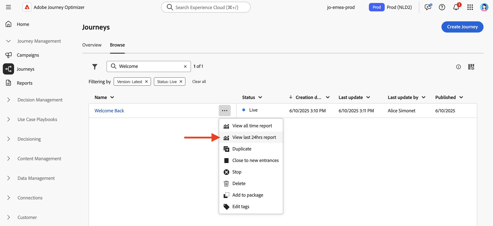

# Kom igång med Live Report {#live-report}

Använd **[!UICONTROL Live report]** att i realtid mäta och visualisera påverkan och resultat av era resor och era meddelanden i en inbyggd kontrollpanel.
Data finns i **[!UICONTROL Live report]** så snart leveransen har skickats eller din resa har körts från **[!UICONTROL Last 24hrs]** -fliken.

* Om du vill rikta in dig på en resa i samband med en resa, från **[!UICONTROL Journeys]** -menyn, få åtkomst till din resa och klicka på **[!UICONTROL View report]** -knappen.

   

* Om du vill rikta in en kampanj går du till **[!UICONTROL Campaigns]** öppnar du kampanjen och klickar på **[!UICONTROL Reports]** -knappen.

   

* Om du vill växla från **[!UICONTROL Global report]** till **[!UICONTROL Live report]** för leverans klickar du **[!UICONTROL Last 24hrs]** i flikväxlaren.

   

En detaljerad lista över alla mätvärden som är tillgängliga i Adobe Journey Optimizer finns på [den här sidan](#list-of-components-live).

## Anpassa kontrollpanelen {#modify-dashboard}

Varje rapportkontrollpanel kan ändras genom att widgetar storleksändras eller tas bort. Om du ändrar widgetarna påverkas bara den aktuella användarens kontrollpanel. Andra användare ser sina egna kontrollpaneler eller de som har angetts som standard.

1. Från **[!UICONTROL Actions]** väljer du om du vill rapportera en viss åtgärd på dina resor.

1. Välj om du vill utesluta testhändelser från dina rapporter med hjälp av alternativfältet. Mer information om testhändelser finns i [den här sidan](../building-journeys/testing-the-journey.md).

   Observera att **[!UICONTROL Exclude test events]** alternativet är bara tillgängligt för reserapporter.

   

1. Om du vill ändra storlek på eller ta bort widgetar klickar du på **[!UICONTROL Modify]**.

   

1. Justera widgetarnas storlek genom att dra i det nedre högra hörnet.

   

1. Klicka **[!UICONTROL Remove]** för att ta bort widgetar du inte behöver.

   

1. När du är nöjd med visningsordningen och widgetarnas storlek klickar du på **[!UICONTROL Save]**.

1. Om du vill anpassa hur data visas kan du växla mellan olika visualiseringsalternativ, som diagram, tabeller och dondiagram.

   

Instrumentpanelen har nu sparats. Dina olika ändringar kommer att tillämpas på nytt för senare användning av dina liverapporter. Använd **[!UICONTROL Reset]** för att återställa standardordningen för widgetar och widgetar.

## Lista över komponenter {#list-of-components-live}

Tabellerna nedan ger dig en lista över de mätvärden som används i rapporter och deras definitioner beroende på leveranstyp.

### Resemått {#journey-metrics}

<table> 
 <thead> 
  <tr> 
   <th> Mått  </th> 
   <th> Definition  </th> 
</tr>
 </thead> 
 <tbody> 
  <tr> 
   <td>Åtgärderna har körts  </td> 
   <td> Totalt antal slutförda åtgärder för en resa.  </td> 
</tr> 
  <tr> 
   <td> Angivna profiler  </td> 
   <td> Totalt antal personer som har nått resans inträde.  </td> 
</tr>
  <tr> 
   <td> Fel i åtgärd  </td> 
   <td>Totalt antal fel som uppstått för åtgärder.  </td> 
</tr> 
  <tr> 
   <td> Avslutade profiler  </td> 
   <td> Totalt antal personer som avbrutit resan.  </td> 
</tr> 
  <tr> 
   <td> Misslyckad enskild resa  </td> 
   <td> Totalt antal enskilda resor som inte har slutförts.  </td> 
</tr> 
 </tbody> 
</table>

### Dimensioner och mått för e-post och SMS {#email-and-sms-metrics}

<table> 
 <thead> 
  <tr> 
   <th> Mått  </th> 
   <th> Definition  </th> 
</tr>
 </thead> 
 <tbody>
  <tr> 
   <td> Studsar  </td> 
   <td> Totalt antal fel som ackumulerats under leverans och automatisk returbearbetning.  </td> 
</tr> 
  <tr> 
   <td> Studsfrekvens  </td> 
   <td> Procentandel e-postmeddelanden som studsade jämfört med skickade e-postmeddelanden.  </td> 
</tr>
  <tr> 
   <td> Klickningar  </td> 
   <td> Antal gånger ett innehåll klickades i ett e-postmeddelande.  </td> 
</tr> 
  <tr> 
   <td> Levererat   </td> 
   <td> Antal meddelanden som har skickats. </td> 
</tr> 
  <tr> 
   <td> Leveransnivå  </td> 
   <td> Procentandel meddelanden som har skickats.  </td> 
</tr>
  <tr> 
   <td> Fel  </td> 
   <td> Totalt antal fel som uppstod under en leverans och som förhindrar att den skickas till profiler.  </td> 
</tr> 
  <tr> 
   <td> Felfrekvens  </td> 
   <td> Procentandel fel som uppstod under en leverans och som förhindrar att den skickas jämfört med skickade e-postmeddelanden.  </td> 
</tr>
  <tr> 
   <td> Exkluderad  </td> 
   <td> Antal profiler som har uteslutits av Adobe Journey Optimizer.  </td> 
</tr>
  <tr> 
   <td> Hård studs  </td> 
   <td> Det totala antalet permanenta fel, t.ex. fel e-postadress. Detta inbegriper ett felmeddelande som uttryckligen anger att adressen är ogiltig, till exempel Okänd användare.  </td>
</tr>
  <tr> 
   <td> Ignorerad  </td> 
   <td> Det totala antalet tillfälliga, t.ex. frånvaro, eller ett tekniskt fel, t.ex. om avsändartypen är postmaster.  </td> 
</tr>
   <tr> 
   <td>Erbjud klickfrekvens  </td> 
   <td>Procentandel användare som interagerade med erbjudandet.  </td> 
</tr>
   <tr> 
   <td>Erbjud tittarfrekvens  </td> 
   <td>Procentandel öppnade erbjudanden jämfört med antalet skickade erbjudanden.  </td> 
</tr>
   <tr> 
   <td>Namn på erbjudande  </td> 
   <td> Namn på erbjudandet som lagts till i leveransen. Mer information om placering finns i <a href="../offers/offer-library/creating-personalized-offers.md">page</a>.  </td> 
</tr>
   <tr> 
   <td>Erbjudandet har skickats  </td> 
   <td>Totalt antal utskick för erbjudandet.  </td> 
</tr> 
  <tr>
   <td>Öppnar  </td> 
   <td> Antal gånger som meddelandet öppnades.  </td> 
</tr> 
  <tr> 
   <td> Öppen kurs  </td> 
   <td> Totalt antal öppnade e-postmeddelanden jämfört med antalet levererade e-postmeddelanden.  </td> 
</tr>
  <tr> 
   <td>Placeringsnamn  </td> 
   <td> Namn på den placering som användes för att visa ditt erbjudande. Mer information om placering finns i <a href="../offers/offer-library/creating-placements.md">page</a>. </td> 
</tr> 
  <tr> 
   <td> Återförsök  </td> 
   <td> Antal e-postmeddelanden i kön för återförsök.  </td> 
</tr> 
  <tr> 
   <td> Skickat  </td> 
   <td> Totalt antal försändelser för leveransen.  </td> 
</tr>
  <tr> 
   <td> Mjuk studsa  </td> 
   <td> Totalt antal tillfälliga fel, t.ex. en fullständig inkorg.  </td> 
</tr>
  <tr> 
   <td> Skräppost  </td> 
   <td> Antal gånger ett meddelande har deklarerats som skräppost eller skräppost.  </td> 
</tr>
  <tr> 
   <td> Målinriktad  </td> 
   <td> Totalt antal meddelanden som bearbetats under leveransanalysen.  </td> 
</tr> 
  <tr> 
   <td> Unika klick  </td> 
   <td> Antal mottagare som klickat på ett innehåll i ett e-postmeddelande.  </td> 
</tr> 
  <tr> 
   <td>Unik klickfrekvens  </td> 
   <td> Procentandel användare som interagerade med leveransen.  </td> 
</tr>
  <tr> 
   <td> Unika öppningar  </td> 
   <td>Antal mottagare som öppnade leveransen.  </td> 
</tr> 
  <tr> 
   <td> Avprenumerationer  </td> 
   <td> Antal klick på länken för att avbryta prenumerationen.  </td> 
</tr> 
 </tbody> 
</table>

### Mätvärden för landningssida {#landing-page-metrics}

<table> 
 <thead> 
  <tr> 
   <th> Mått  </th> 
   <th> Definition  </th> 
</tr>
 </thead> 
 <tbody>
 <tr> 
  <td>Studsar  </td> 
   <td>Antal personer som inte interagerade med landningssidan och inte slutförde prenumerationsåtgärden.  </td> 
</tr>
 <tr>
  <tr> 
   <td>Klickningar  </td> 
   <td>Antal gånger som ett innehåll klickades på på landningssidan.  </td> 
</tr>
<tr>
<td>Konvertering  </td> 
   <td>Antal personer som interagerat med landningssidan, t.ex. prenumererat på ett formulär.  </td> 
</tr>
 <tr> 
   <td>Resa(er)  </td> 
   <td>Antal besök på landningssidan som kommer från en resa.  </td> 
</tr>
 <tr> 
   <td>Andra källor  </td> 
   <td>Antal besök på landningssidan som kommer från en extern källa i stället för en resa.  </td> 
</tr>
 <tr> 
   <td>Totalt antal besök  </td> 
   <td> Totalt antal besök på din landningssida som kommer från resor och externa källor, inklusive flera besök av en mottagare.  </td> 
</tr>
 <tr> 
   <td>Unika besökare  </td> 
   <td>Antal personer som besökte landningssidan, varav flera besök av en mottagare inte beaktas.  </td> 
</tr>
 <tr> 
   <td>Besök  </td> 
   <td>Antal besök på landningssidan, inklusive flera besök av en mottagare.  </td> 
</tr>
 </tbody> 
</table>

### Mätvärden för push-meddelanden {#push-notification-metrics}

<table> 
 <thead> 
  <tr> 
   <th> Mått  </th> 
   <th> Definition  </th> 
</tr>
 </thead> 
 <tbody>
 <tr> 
   <td>Instruktioner  </td> 
   <td> Totalt antal åtgärder för push-meddelandet som levererats, t.ex. knappklickning eller avbruten.  </td> 
</tr>
  <tr> 
   <td>Studsar  </td> 
   <td> Totalt antal fel som ackumulerats under leverans och automatisk returbearbetning.  </td> 
</tr> 
  <tr> 
   <td> Levererat  </td> 
   <td> Antal meddelanden som har skickats.  </td> 
</tr> 
  <tr> 
   <td>Åtaganden  </td> 
   <td> Totalt antal öppningar och åtgärder för det här push-meddelandet, dvs om profilen öppnade push-meddelandet eller om någon klickade på en knapp.  </td> 
</tr> 
  <tr> 
   <td> Fel  </td> 
   <td> Totalt antal fel som uppstod under en leverans och som förhindrar att den skickas till profiler.  </td> 
</tr>
  <tr> 
   <td> Exkluderad  </td> 
   <td> Antal profiler som har uteslutits av Adobe Journey Optimizer.  </td> 
</tr>
  <tr> 
   <td> Öppnar  </td> 
   <td> Totalt antal push-meddelanden som levererats till enheten och användaren klickat på för att öppna appen. Detta liknar kommandot Push Click, men Push Open aktiveras inte om meddelandet stängs.  </td> 
</tr> 
  <tr> 
   <td> Skickat  </td> 
   <td> Totalt antal försändelser för leveransen.  </td> 
</tr> 
  <tr> 
   <td> Målinriktad  </td> 
   <td> Totalt antal push-meddelanden som bearbetats under leveransanalysen.  </td> 
</tr>  
 </tbody> 
</table>

<!--
### In-app metrics {#inapp-metrics}
<table> 
 <thead> 
  <tr> 
   <th> Metric  </th> 
   <th> Definition  </th> 
</tr>
 </thead> 
 <tbody>
 <tr> 
   <td>Clicks  </td> 
   <td>Total number of recipients who interacted with the buttons included in the In-app message.  </td> 
</tr>
  <tr> 
   <td>Impressions  </td> 
   <td> Total number of In-app messages delivered to all users.  </td>
</tr>
  <tr> 
   <td>Unique impressions  </td> 
   <td>Number of unique users to whom the In-app message was delivered.  </td>
</tr>
 </tbody> 
</table>
-->