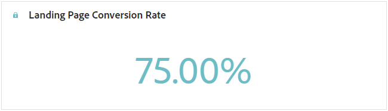

# Rapport om landningssida {#lp-report-global-cja}

Rapporten **Landningssida** ger värdefulla insikter om användarbeteende, engagemangsmönster, konverteringsgrader och andra viktiga mätvärden, så att du kan fatta välgrundade beslut och optimera landningssidans prestanda effektivt.

Om du vill få åtkomst till dina rapporter väljer du **[!UICONTROL Report]** på den avancerade menyn på den valda landningssidan.

Mer information om Customer Journey Analytics arbetsyta och hur du filtrerar och analyserar data finns på [den här sidan](https://experienceleague.adobe.com/sv/docs/analytics-platform/using/cja-workspace/home).

## Konverteringsgrad för landningssida {#lp-conversion}

Med KPI:n för **[!UICONTROL Landing page Conversion rate]** kan du bedöma hur effektiv din landningssida är baserat på antalet besök och interaktioner.

* **[!UICONTROL Landing page Conversion rate]**: Antal personer som interagerat med landningssidan, t.ex. prenumererat på ett formulär, i förhållande till det totala antalet besök.

## Studsfrekvens för landningssida {#lp-bounce-rate}

KPI:n **[!UICONTROL Landing page Bounce rate]** ger information om profiler som visade din landningssida utan att interagera eller klicka på några element.

* **[!UICONTROL Landing page Bounce rate]**: Antal personer som inte interagerade med landningssidan och inte slutförde prenumerationsåtgärden i förhållande till det totala antalet besök.

## Vyer för landningssida {#lp-views}

Med KPI:n för **[!UICONTROL Landing page Views]** kan du se effekten av din landningssida.

* **[!UICONTROL Landing page Views]**: Totalt antal besök på din landningssida som kommer från resor och externa källor, inklusive flera besök i en profil.

## Unika startsidesvyer {#lp-unique-views}

Med KPI:n för **[!UICONTROL Unique Landing page Views]** kan du mäta landningssidans påverkan genom att utesluta flera vyer från samma profil.

* **[!UICONTROL Unique Landing page Views]**: Antal personer som besökte din landningssida, flera besök i en profil beaktas inte.

## Landningssidans prestanda över tid {#lp-performance-overtime}

Diagrammet **[!UICONTROL Landing page performance over time]** mäter dina landningssidors framgång och påverkan på målgruppen.

* **[!UICONTROL Landing page Views]**: Totalt antal besök på din landningssida som kommer från resor och externa källor, inklusive flera besök i en profil.

* **[!UICONTROL Landing page Conversion]**: Antal personer som interagerat med landningssidan, t.ex. prenumererat på ett formulär, i förhållande till det totala antalet besök.

## Prestanda för landningssida {#lp-performance}

Tabellen **[!UICONTROL Landing page performance]** fungerar som en omfattande instrumentpanel med en detaljerad beskrivning av viktiga mått som relaterar till din landningssida.

* **[!UICONTROL Landing page Conversion rate]**: Antal personer som interagerat med landningssidan, t.ex. prenumererat på ett formulär, i förhållande till det totala antalet besök.

* **[!UICONTROL Landing page Bounce rate]**: Antal personer som inte interagerade med landningssidan och inte slutförde prenumerationsåtgärden i förhållande till det totala antalet besök.

* **[!UICONTROL Unique Landing page Views]**: Antal personer som besökte din landningssida, flera besök i en profil beaktas inte.

* **[!UICONTROL Unique Landing page Conversion]**: Antal personer som interagerade med landningssidan, flera interaktioner i en profil beaktas inte.

* **[!UICONTROL Landing page Views]**: Totalt antal besök på din landningssida som kommer från resor och externa källor, inklusive flera besök i en profil.

* **[!UICONTROL Landing page Conversion]**: Antal personer som interagerat med landningssidan, t.ex. prenumererade på ett formulär.

## Resor {#lp-journeys}

Tabellen **[!UICONTROL Journey]** innehåller en omfattande översikt med information om hur ofta besöken till din landningssida kommer in under en användares resa. Denna insiktsfulla representation ger värdefulla data om användarinteraktioner, så att ni kan förstå hur besökare navigerar på er webbplats och interagera med ert innehåll.

* **[!UICONTROL Landing page Views]**: Totalt antal besök på din landningssida som kommer från resor och externa källor, inklusive flera besök i en profil.

* **[!UICONTROL Landing page Conversion]**: Antal personer som interagerat med landningssidan, t.ex. prenumererade på ett formulär.

## Kampanjer {#lp-campaigns}

Tabellen **[!UICONTROL Campaigns]** ger insikter om antalet besök som dirigeras till din landningssida som ett resultat av specifika kampanjer, vilket ger en heltäckande bild av kampanjens effektivitet och engagemang med innehållet på landningssidan.

* **[!UICONTROL Landing page Views]**: Totalt antal besök på din landningssida som kommer från resor och externa källor, inklusive flera besök i en profil.

* **[!UICONTROL Landing page Conversion]**: Antal personer som interagerat med landningssidan, t.ex. prenumererade på ett formulär.

## Kanal {#lp-channels}

Tabellen **[!UICONTROL Channel]** visar antalet besök på din landningssida kategoriserade per kanal.

* **[!UICONTROL Landing page Views]**: Totalt antal besök på din landningssida som kommer från resor och externa källor, inklusive flera besök i en profil.

* **[!UICONTROL Landing page Conversion]**: Antal personer som interagerat med landningssidan, t.ex. prenumererade på ett formulär.

## Länkar som klickats överst {#lp-top-clicked}

Tabellen **[!UICONTROL Top Clicked Links]** ger insikter om hur besökarna interagerar med leveransen, och visar vilka länkar som får mest engagemang och uppmärksamhet från er målgrupp.

* **[!UICONTROL Landing page Clicks]**: Antal gånger som ett innehåll klickades på på landningssidan.
