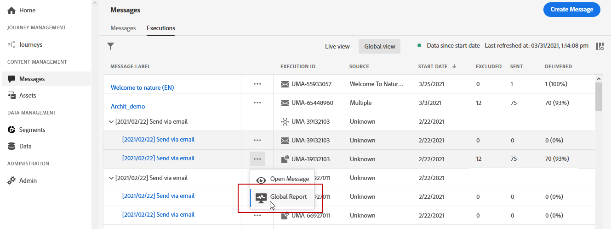

# Skicka global rapport {#push-global-report}

Push-åtgärden **[!UICONTROL Global report]** avser endast en specifik push-leverans.

Välj **[!UICONTROL Global view]** på fliken **[!UICONTROL Executions]** på menyn **[!UICONTROL Messages]** och välj sedan **[!UICONTROL Global report]** på den avancerade menyn för den valda leveransen.

Push-åtgärden **[!UICONTROL Global report]** är uppdelad i olika widgetar som anger leveransens framgång och fel. Varje widget kan storleksändras och tas bort vid behov. Mer information finns i [avsnittet](global-report.md#modify-dashboard).
