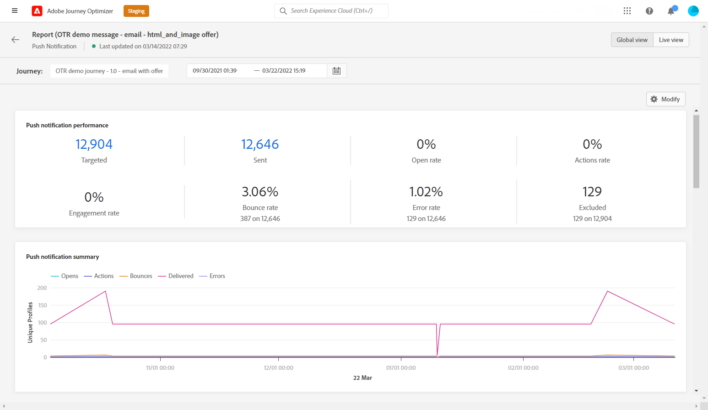

# Push Global-rapport {#push-global-report}

The push **[!UICONTROL Global report]** endast för en viss push-leverans.

Från **[!UICONTROL Executions]** -fliken i **[!UICONTROL Messages]** meny, välja **[!UICONTROL Global view]** väljer du på den avancerade menyn för den valda leveransen **[!UICONTROL Global report]**.

The push **[!UICONTROL Global report]** är uppdelat i olika widgetar som detaljerat beskriver leveransens framgångar och fel. Varje widget kan storleksändras och tas bort vid behov. Mer information finns i [section](global-report.md#modify-dashboard).

The **[!UICONTROL Push notification performance]** widgeten innehåller information om huvudinformationen i förhållande till dina push-meddelanden med KPI:er:

* **[!UICONTROL Sent]**: Totalt antal försändelser för leveransen.

* **[!UICONTROL Bounce Rate]**: Procentandel push-meddelanden som studsade jämfört med skickade push-meddelanden.

* **[!UICONTROL Error Rate]**: Procentandel fel som uppstod under en leverans och som förhindrar att den skickas jämfört med push-meddelanden som skickas.

* **[!UICONTROL Actions Rate]**: Procentandel åtgärder för push-meddelanden som levereras, t.ex. knappklickning eller avbruten.

* **[!UICONTROL Engagement Rate]**: Procentandel öppningar och åtgärder för det här push-meddelandet, dvs. om profilen öppnade push-meddelandet eller om någon klickade på en knapp.

The **[!UICONTROL Push notification summary]** diagrammet innehåller data som är tillgängliga för skickade push-meddelanden, som:

* **[!UICONTROL Opens]**: Antal gånger ett meddelande öppnades i en leverans.

* **[!UICONTROL Actions]**: Totalt antal åtgärder för push-meddelandet som levererats, t.ex. knappklickning eller avbruten.

* **[!UICONTROL Bounces]**: Totalt antal fel som sammanställts under leverans och automatisk returbehandling i relation till totalt antal skickade meddelanden.

* **[!UICONTROL Delivered]**: Antal meddelanden som har skickats, i relation till det totala antalet skickade meddelanden.

* **[!UICONTROL Errors]**: Totalt antal fel som uppstod under en leverans och som förhindrar att den skickas till profiler.

The **[!UICONTROL Error Reasons]** Med diagram och tabeller kan du se vilket fel som inträffade under leveransen.

The **[!UICONTROL Tracking by platform]**, **[!UICONTROL Sending by platform]** och **[!UICONTROL Breakdown by platform]** diagram och tabeller visar hur bra push-meddelandena är beroende på mottagarens operativsystem.
