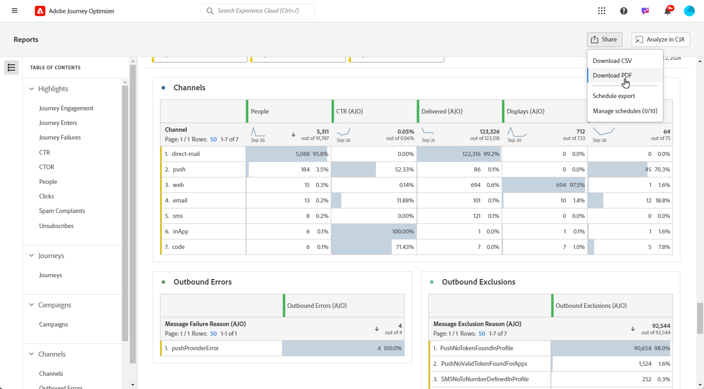
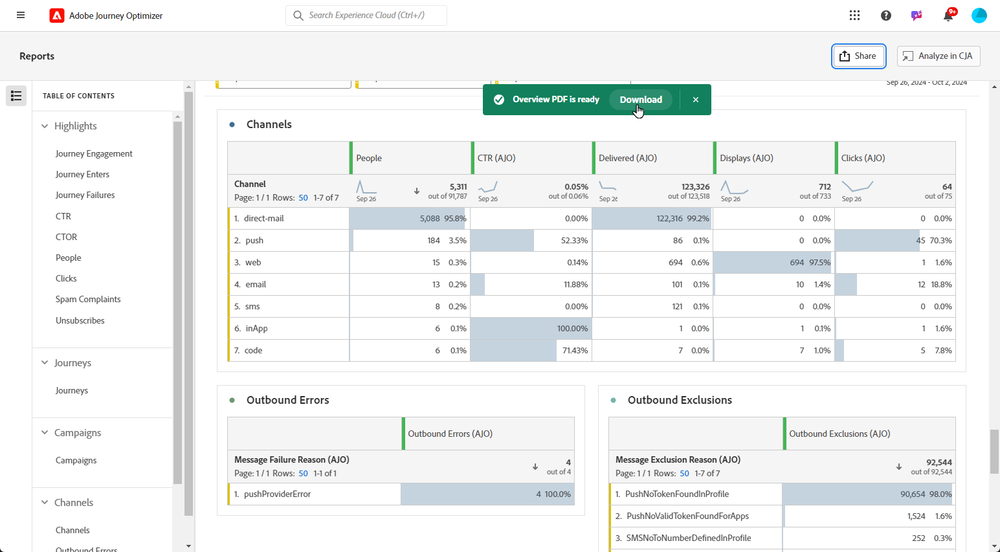

# Hantera dina rapporter {#channel-cja-manage}

## Analysera i Customer Journey Analytics {#analyze}

>[!AVAILABILITY]
>
> Funktionen **Analysera i CJA** är endast tillgänglig för användare med en [!DNL Customer Journey Analytics]-licens.

Förbättra dataanalysupplevelsen med din **[!DNL Customer Journey Analytics]**-licens genom att utnyttja funktionen **[!UICONTROL Analyze in CJA]** som finns i alla rapporter.

Det här kraftfulla alternativet dirigerar om dig till din **[!DNL Customer Journey Analytics]**-miljö, så att du kan anpassa dina rapporter i stor utsträckning. Ni kan berika era widgetar med specialiserade Customer Journey Analytics-mätvärden och ta era insikter till en helt ny nivå.

[Läs mer om Customer Journey Analytics gränssnitt.](https://experienceleague.adobe.com/sv/docs/analytics-platform/using/cja-overview/cja-getting-started)

## Definiera rapportperioden {#report-period}

När du öppnar en rapport kan du använda ett tidsperiodfilter som finns i rapportens övre högra hörn.

Som standard är filterperioden för en kampanj eller resa inställd på dess start- och slutdatum. Om det inte finns något slutdatum används det aktuella datumet som standard.

Om du vill ändra filtret kan du välja ett anpassat startdatum och en anpassad varaktighet, eller välja bland förinställda alternativ som den senaste veckan eller för två månader sedan.

Rapporten uppdateras automatiskt när filtret tillämpas eller ändras.

## Exportera rapporter {#export-reports}

Du kan enkelt exportera dina olika rapporter till PDF- eller CSV-format så att du kan dela och skriva ut dem. Hur du exporterar rapporter beskrivs på flikarna nedan.

>[!BEGINTABS]

>[!TAB Exportera rapporten som en CSV-fil]

1. Klicka på **[!UICONTROL Share]** i rapporten och välj **[!UICONTROL Download CSV]** för att generera en CSV-fil på den övergripande rapportnivån.

   

1. Filen hämtas automatiskt och kan finnas i dina lokala filer.

   Om du genererade filen på rapportnivå innehåller den detaljerad information för varje widget, inklusive dess titel och data.

>[!TAB Exportera rapporten som en PDF-fil]

1. Klicka på **[!UICONTROL Share]** i rapporten och välj **[!UICONTROL Downalod PDF]**.

   

1. När hämtningen har begärts klickar du på **[!UICONTROL Download]**.

   

1. Filen öppnas automatiskt i webbläsaren.

Din rapport är nu tillgänglig för visning, hämtning eller delning i en PDF-fil.

>[!ENDTABS]

## Schemalägg export {#schedule-export}

Med **Schemalägg export** kan du automatisera leveransen av upp till 10 rapporter varje vecka, månad eller år. Du kan också enkelt hantera dina schemalagda rapporter med alternativ för att uppdatera, redigera, avbryta eller ta bort någon av dina schemalagda exporter.

1. Klicka på **[!UICONTROL Share]** i rapporten och välj **[!UICONTROL Schedule export]**.

   

1. Välj **[!UICONTROL File type]** mellan CSV och PDF.

1. Om det behövs kan du lägga till en **[!UICONTROL Description]** i din export.

1. Ange namnet på mottagarna som ska få den här automatiska leveransen.

   

1. Välj **[!UICONTROL Frequency]**.

1. Baserat på vald frekvens, ange relevant schemaläggningsinformation, till exempel:

   * Start- och slutdatum

   * Intervall (t.ex. var vecka)

   * Specifik veckodag

   * Vecka inom månaden

   * Dag inom månaden

   * Månad på året

1. Klicka på **[!UICONTROL Send on schedule]**.

1. Om du vill redigera tidigare skapad schemalagd export klickar du på **[!UICONTROL Share]** och väljer **[!UICONTROL Manage schedules]**.

   

1. I listan över schemalagda exporter väljer du den som du vill uppdatera och gör de nödvändiga ändringarna.

1. Om du vill ta bort en schemalagd rapport markerar du en i listan med hanterade scheman och klickar på **[!UICONTROL Delete]**.

   

## Skapa ett enkelt mått {#create-simple-metric}

Du kan skapa anpassade beräknade mätvärden direkt i dina rapporter. Ni kan generera mer skräddarsydda insikter och bättre analysera era data genom att kombinera två befintliga mätvärden på sätt som passar just era rapporteringsbehov.

1. Börja med att gå till rapporten där du vill lägga till ett nytt mätvärde.

1. I tabellen i rapporten markerar du de mätvärden du vill ha genom att hålla ned tangenterna `Shift` eller `CTRL/CMD` samtidigt som du klickar på dem. Högerklicka sedan och välj **[!UICONTROL Create metric from selection]**.

   Om du väljer mer än två mätvärden används bara de första två i metrisk generering.

   

1. I verktyget Beräknade mätvärden namnger du ditt nya mätresultat genom att skriva i fältet **[!UICONTROL Title]**. Du kan också lägga till en **[!UICONTROL Description]**.

   >[!NOTE]
   >
   >Om ni äger Customer Journey Analytics kan ni anpassa mätvärdena ytterligare med ytterligare alternativ. [Läs mer](https://experienceleague.adobe.com/sv/docs/analytics-platform/using/cja-components/cja-calcmetrics/cm-workflow/cm-build-metrics#areas-of-the-calculated-metrics-builder)

1. Välj lämplig **[!UICONTROL Decimal Places]** och välj en **[!UICONTROL Format]** (decimal, tid, procent eller valuta) baserat på hur du vill att måttet ska visas.

1. Välj den operator, t.ex. addition, subtraktion, multiplikation eller division, som bestämmer hur måttet beräknas.

   

1. Du kan ändra ordning på komponenterna om det behövs.

1. När du är nöjd med inställningarna klickar du på **[!UICONTROL Apply]** för att slutföra det nya måttet.

1. Dina nya mätvärden visas bredvid de ursprungliga mätvärdena i rapporten.

   

De nya mätvärdena inkluderas när du exporterar rapporten som en PDF eller CSV. Den tas dock bort från rapporten när du har avslutat den.

## Utforska data med Insight Builder {#exploratory}

Använd verktyget Insight builder för att enkelt skapa tabeller och visualiseringar från dina valda **[!UICONTROL Dimensions]** och **[!UICONTROL Metrics]**. Verktyget effektiviserar datautforskandet så att du automatiskt kan anpassa och analysera information. Läs mer i [den här dokumentationen](https://experienceleague.adobe.com/sv/docs/analytics/analyze/analysis-workspace/panels/quickinsight).

1. Börja med att gå till rapporten där du vill använda Insight Builder.

1. Välj menyn Insight builder på menyn till vänster.

   

1. Skapa en fråga genom att välja en **[!UICONTROL Dimension]** och en **[!UICONTROL Metric]** med hjälp av listrutorna. Du kan också välja en **[!UICONTROL Segment]** vid behov.

   

1. Definiera datumintervallet för analysen för att ange den period som du vill fokusera på. Som standard är datumintervallet det som används i rapportpanelen.

1. Använd alternativen **[!UICONTROL Add breakdown]** eller **[!UICONTROL Add metric]** om du vill inkludera ytterligare dimensioner, vilket ger en mer detaljerad datafördelning.

   Observera att du bara kan lägga till upp till tre **[!UICONTROL Dimensions]**, **[!UICONTROL Metrics]** och **[!UICONTROL Segments]**.

Nu kan du analysera data med hjälp av anpassade tabell- och visualiseringsverktyg.

<!--## Create a down-funnel metric {#down-funnel}

1. Create a new journey or open an existing one. [Learn more about journey creation](../building-journeys/journey-gs.md)

1. On the canvas editor, select the option to "add a metric".

c. In the metric selector, choose whichever conversion metric seems appropriate and publish your journey

d. Open the report for the journey that you added the metric to and ensure that the metric has been added to the table alongside all the other pre-configured metrics.
-->

## Skapa en publik utifrån rapportdata {#create-audience}

>[!IMPORTANT]
>
>Varje organisation är begränsad till att publicera 25 målgrupper. Dessutom kan användare publicera högst 5 målgrupper per timme och 20 per dag.
>&#x200B;> Engångspubliken har en livscykel på 48 timmar. Om 25 målgrupper publiceras inom den tidsramen kan ytterligare målgrupper därför bara publiceras när 48-timmarsperioden har gått ut.

Nu kan du markera specifika data i tabellen och direkt skapa en målgrupp utifrån dessa markeringar, vilket effektiviserar och förenklar processen för att skapa målgrupper.

1. Börja med att navigera till den rapporttabell som innehåller de data som du vill omvandla till en målgrupp.

1. Högerklicka på önskad cell och välj **[!UICONTROL Create audience]**.

   Du kan också börja skapa målgrupper från widgeten **[!UICONTROL Journey canvas]** genom att markera en nod och högerklicka på den.

1. I fönstret **[!UICONTROL Create audience]** anger du **[!UICONTROL Name]** och anger **[!UICONTROL One-time date range]** för den målgrupp du vill publicera.

   >[!NOTE]
   >
   >Om ni äger Customer Journey Analytics kan ni anpassa mätvärdena ytterligare med ytterligare alternativ. [Läs mer](https://experienceleague.adobe.com/sv/docs/analytics-platform/using/cja-components/audiences/publish)

   

1. Klicka på knappen **[!UICONTROL Create]** för att slutföra målgruppsgenereringen. Observera att processen kan ta lite tid att slutföra.

Du kan nu fortsätta att använda den nya målgruppen med en resa eller kampanj.

## Hantera mallar {#cja-template}

>[!AVAILABILITY]
>
> Funktionen **Template** introduceras stegvis, med fullständig allmän tillgänglighet planerad till slutet av januari och exklusivt tillgänglig för användare med en [!DNL Customer Journey Analytics]-licens.

Nu kan du förbättra dina Journey Optimizer-rapporter genom att använda Customer Journey Analytics-mallar. [Läs mer om Customer Journey Analytics-mallen](https://experienceleague.adobe.com/sv/docs/analytics-platform/using/cja-workspace/templates/use-templates#use-reports)

När du får åtkomst till dina rapporter kan du välja mellan två malltyper i listrutan **[!UICONTROL Select a template]**:

* Standardmall som tillhandahålls av Adobe
* Kundgenererade mallar

Om ingen mall har skapats visas inte listrutan **[!UICONTROL Select a template]** i rapportgränssnittet.

Så här skapar du en mall:

1. I [!DNL Customer Journey Analytics] går du till menyn **[!UICONTROL Workspace]** och väljer **[!UICONTROL Adobe templates]**. [Läs mer om tillgängliga mallar](https://experienceleague.adobe.com/sv/docs/analytics-platform/using/cja-workspace/templates/use-templates#available-templates)

1. Bläddra bland de tillgängliga färdiga mallarna och klicka på **[!UICONTROL Use template]** för att välja en.

   

1. Anpassa rapporten efter era behov. Läs [Customer Journey Analytics-dokumentationen](https://experienceleague.adobe.com/sv/docs/analytics-platform/using/cja-workspace/home).

1. När den anpassade mallen är klar går du till menyn **[!UICONTROL Project]** och väljer **[!UICONTROL Save as template]**.

   

1. Ange nödvändig information för mallen. Mer information finns i [Customer Journey Analytics-dokumentationen](https://experienceleague.adobe.com/sv/docs/analytics-platform/using/cja-workspace/templates/create-templates#edit-or-delete-a-template).

   >[!IMPORTANT]
   >
   > Välj **Journey Optimizer** under **[!UICONTROL Use cases]** och ange motsvarande **Journey Optimizer-aktivitetstyp** och **aktivitet**. Då kan din rapport visas i Journey Optimizer.

   

1. I [!DNL Journey Optimizer] öppnar du rapporten från din rapport och väljer en mall som du skapat tidigare i listrutan **[!UICONTROL Select a template]**.

   

Om du vill skapa en mall direkt från din Journey-optimeringsrapport öppnar du bara din kampanj- eller reserapport, väljer **[!UICONTROL Analyze in CJA]** och anpassar standardmallen genom att följa stegen ovan.
