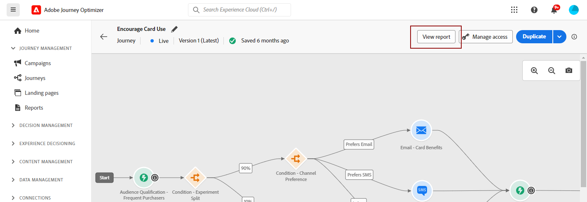

# Kom igång med hela tidsrapporten {#channel-report-gs-cja}

>[!CONTEXTUALHELP]
>id="cja_connections_enable_cja"
>title="Aktivera Customer Journey Analytics"
>abstract="Om du vill analysera den här rapporten i Customer Journey Analytics kontaktar du administratören för att kontrollera att din organisation har köpt Customer Journey Analytics och att integreringen är korrekt konfigurerad."
>additional-url="https://experienceleague.adobe.com/sv/docs/journey-optimizer/using/channels/email/design-email/add-content/content-components#add-content-components" text="Customer Journey Analytics"

Journey Optimizer rapportering har förbättrad interoperabilitet med Customer Journey Analytics funktioner, standardiserad rapportering på båda plattformarna och förbättrad datakonsekvens och tillförlitlighet. Denna smidiga integrering mellan Journey Optimizer och Customer Journey Analytics ger en tydligare bild av prestandamätningarna, så att användarna kan fatta mer välgrundade beslut.

Tillgång till dessa rapporteringsfunktioner beror på sammanhang och produktområden:

* **Resor** - Om du vill rikta in dig på en resa eller leveranser i samband med en resa går du till **[!UICONTROL Journeys]**-menyn och klickar på knappen **[!UICONTROL View report]**.

  I listan över befintliga resor kan du även välja **[!UICONTROL Report]** på den avancerade menyn för den valda resan. [Läs mer om reserapporten](journey-global-report-cja.md)

  

* **Kampanjer** - Om du vill rikta en kampanj går du till **[!UICONTROL Campaigns]** -menyn, öppnar kampanjen och klickar på **[!UICONTROL Reports]**-knappen och sedan **[!UICONTROL View all time report]**.

  I listan över befintliga kampanjer kan du även välja **[!UICONTROL Report]** på den avancerade menyn för den valda kampanjen. [Läs mer om Campaign-rapporten](campaign-global-report-cja.md)

  

* **Global** - Om du vill ange mätvärden för alla kampanjer och resor i din miljö, öppnar du **översiktsrapporten** genom att gå till **[!UICONTROL Reports]** -menyn i **[!UICONTROL Journey Management]** -avsnittet. [Läs mer om översiktsrapporten](channel-report-cja.md)

  

>[!IMPORTANT]
>
>Rapportering i Adobe Journey Optimizer är för närvarande standardiserat med UTC. Möjligheten att anpassa tidszonen för rapportering kommer att introduceras i en framtida version.

## Förhandskrav {#prerequisites}

* Om du **inte** äger Customer Journey Analytics, eller om du äger det men **inte** har tillgång till någon Customer Journey Analytics-produktprofil, hanteras behörigheter i Journey Optimizer. I det här fallet behöver du behörigheten **[!UICONTROL View channel reports]** eller relaterade roller. [Läs mer](../administration/permissions.md)

* Om du **äger** Customer Journey Analytics och har tillgång till en Customer Journey Analytics-produktprofil behöver du:

   * **[!UICONTROL Audience Creation]** och **[!UICONTROL Audience View]** behörigheter för Customer Journey Analytics. [Läs mer](https://experienceleague.adobe.com/sv/docs/analytics-platform/using/technotes/access-control){target="_blank"}

   * **[!UICONTROL Manage profiles]** behörighet för Adobe Journey Optimizer. [Läs mer](../administration/permissions.md)

* Dina Customer Journey Analytics-data måste konfigureras med följande inställning: **Ange som standarddatavy i Adobe Journey Optimizer**. [Läs mer om datavyer](https://experienceleague.adobe.com/sv/docs/analytics-platform/using/cja-dataviews/create-dataview){target="_blank"}

## Instruktionsvideo{#video}

I videon nedan visas hur du använder den förbättrade Journey Optimizer-rapporteringen med Customer Journey Analytics.

>[!VIDEO](https://video.tv.adobe.com/v/3430413)