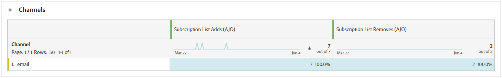

# Prenumerationsrapport {#subscription-report-global-cja}

**Prenumerationsrapporten** innehåller viktiga insikter om profilernas prenumerationer och avbeställningar som är kopplade till vissa listor, vilket hjälper dig att förstå hur effektiva olika prenumerationskampanjer och -initiativ är när det gäller att öka engagemanget och konverteringarna.

Om du vill få tillgång till dina rapporter klickar du på ikonen **[!UICONTROL Report]** i den valda prenumerationslistan på den avancerade menyn.

Mer information om Customer Journey Analytics arbetsyta och hur du filtrerar och analyserar data finns på [den här sidan](https://experienceleague.adobe.com/en/docs/analytics-platform/using/cja-workspace/home).

## Prenumerationslistan lägger till

KPI:n **[!UICONTROL Subscription list adds]** ger en omfattande översikt över det totala antalet prenumerationer som har förvärvats under den angivna perioden. Den här mätningen visar på tillväxten och förvärvet av nya prenumeranter, och ger värdefulla insikter om hur effektiva era prenumerationskampanjer eller -initiativ är.

## Prenumerationslistan tar bort

KPI:n för **[!UICONTROL Subscription list removes]** ger en beskrivning av det totala antalet prenumerationer som har avbrutits under den angivna perioden. Den här mätningen ger värdefulla insikter om att prenumeranter inte engagerar sig.

## Prenumerationstillväxt över tid

Diagrammet **[!UICONTROL Subscription growth over time]** visar visuellt hur prenumerationerna fortskrider under den angivna perioden, vilket ger en tydlig förståelse för hur din prenumerationsbas har utvecklats.

* **[!UICONTROL Subscription list adds]**: Totalt antal prenumerationer för den aktuella perioden.

* **[!UICONTROL Subscription list removes]**: Totalt antal prenumerationer för den aktuella perioden.

* **[!UICONTROL Subscription list growth]**: Den hastighet med vilken prenumerantlistan växer under en viss tidsperiod.

## Prenumerationslistor

Tabellen **[!UICONTROL Subscription lists]** ger viktiga insikter i dina profilers prenumerationer och avbeställningar som är kopplade till vissa prenumerationslistor. Denna information hjälper er att förstå hur effektiva olika prenumerationslistor är när det gäller att öka engagemanget och konverteringarna.

* **[!UICONTROL Subscription list adds]**: Totalt antal prenumerationer för den aktuella perioden.

* **[!UICONTROL Subscription list removes]**: Totalt antal prenumerationer för den aktuella perioden.

## Resor

Tabellen **[!UICONTROL Journey]** ger en utförlig vy, som visar komplicerade detaljer i besökarnas prenumerationer som en del av användarens resa.

* **[!UICONTROL Subscription list adds]**: Totalt antal prenumerationer för den aktuella perioden.

* **[!UICONTROL Subscription list removes]**: Totalt antal prenumerationer för den aktuella perioden.

## Kampanjer

Tabellen **[!UICONTROL Campaigns]** innehåller värdefulla insikter om dina profilers prenumerationer och upphörande av prenumerationer som utlöses av specifika kampanjer. Med den här heltäckande vyn kan ni mäta effektiviteten i era kampanjer och effektivt spåra engagemanget med innehållet på era landningssidor.

* **[!UICONTROL Subscription list adds]**: Totalt antal prenumerationer för den aktuella perioden.

* **[!UICONTROL Subscription list removes]**: Totalt antal prenumerationer för den aktuella perioden.

## Kanal

Tabellen **[!UICONTROL Channel]** visar antalet profiler, prenumerationer och avprenumerationer, kategoriserade efter varje kanal.

* **[!UICONTROL Subscription list adds]**: Totalt antal prenumerationer för den aktuella perioden.

* **[!UICONTROL Subscription list removes]**: Totalt antal prenumerationer för den aktuella perioden.
