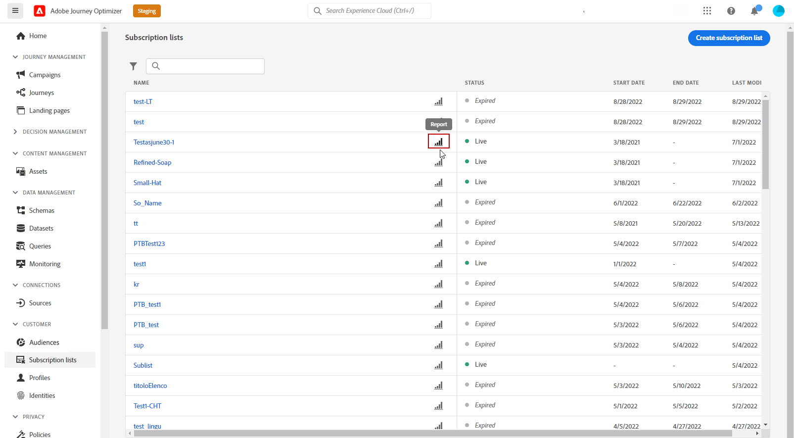

# Global prenumerationsrapport {#subscription-report-global}

>[!CONTEXTUALHELP]
>id="ajo_subscription_global_report"
>title="Global prenumerationsrapport"
>abstract="Med den globala prenumerationsrapporten kan du mäta och visualisera dina prenumeranters aktivitet under en viss tidsperiod. Din rapport är uppdelad i olika widgetar som detaljerar dina prenumerationer och avbeställningar. Varje rapportkontrollpanel kan ändras genom att widgetar storleksändras eller tas bort."

Prenumerationen **[!UICONTROL Global report]** visar information om din prenumerations aktivitet under en vald tidsperiod. Om du bara vill mäta dina prenumerationer under de senaste 24 timmarna kan du läsa [Direktprenumerationsrapport](subscription-report-live.md).

Klicka på **[!UICONTROL Report]** ikonen för den valda prenumerationslistan.

Prenumerationen **[!UICONTROL Global report]** är uppdelat i olika widgetar som detaljerat beskriver dina prenumerationer och avbeställningar. Varje widget kan storleksändras och tas bort vid behov. Mer information finns i [section](global-report.md).

The **[!UICONTROL Subscription performance]** KPI:er och **[!UICONTROL Subscriptions by journey]**/**[!UICONTROL Unsubscribes by journey]** tabellerna innehåller detaljerad information om besökarnas engagemang på landningssidan. Tabellerna och KPI:erna innehåller tillgängliga uppgifter om landningssidan, t.ex.:

* **[!UICONTROL Subscribes]**: Totalt antal prenumerationer för den berörda perioden.

* **[!UICONTROL Unsubscribes]**: Totalt antal avbeställningar under den berörda perioden.

The **[!UICONTROL Subscription performance]** Diagram visar hur prenumerationerna har utvecklats under den berörda perioden.

The **Prenumerationer - uppdelning** och **Avbeställ - Uppdelning** representerar det totala antalet personer som under den valda tidsperioden har tecknat eller avbrutit prenumerationen, beroende på meddelanden, landningssidor och kanaler.
