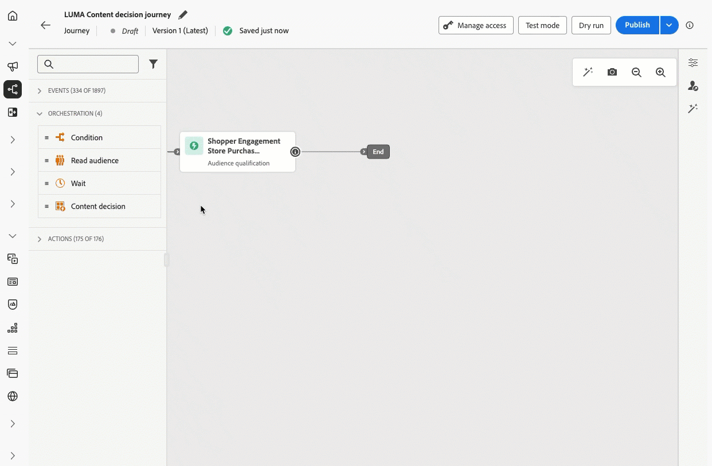

# Förhandsversionsinformation {#e-release-notes}

[!DNL Adobe Journey Optimizer] levererar kontinuerligt nya funktioner, förbättringar av befintliga funktioner och felkorrigeringar. Alla ändringar konsolideras i slutet av varje månad i [versionsinformationen](release-notes.md).

## Februari 26 förhandsversionsinformation {#feb-26-01-rn}

**Förhandsversionsinformationen nedan kan komma att ändras utan föregående meddelande till releasedatumet**. Länkar, skärmar och uppdaterad dokumentation publiceras i versionsinformationen på releasedatum.

Se även [Förhandsversionsinformation för Adobe Experience Platform](https://experienceleague.adobe.com/sv/docs/experience-platform/release-notes/pre-release-notes){target="_blank"}.

**Releasedatum**: 17 februari 2026

### Nya funktioner {#feb-26-01-features}

<table>
<thead>
<tr>
<th><strong>Påfyllnadssändning av utgående meddelanden</strong> </th>
</tr>
</thead>
<tbody>
<tr>
<td>

Du kan schemalägga utgående meddelanden från kampanjer eller resor som ska levereras i kontrollerade batchar över tid.

Wave-sändning ger följande fördelar:

<ul>
<li>Bättre leveransförmåga - Spridning skickar över tid för att bevara ett starkt avsändarrykte och minska risken för att flaggas som skräppost.</li>
<li>Belastningskontroll - Undvik överväldigande system längre fram i kedjan (t.ex. callcenters, landningssidor) genom att begränsa hur många meddelanden som skickas samtidigt.</li>
<li>Användningsfall med stor volym och tidskänslighet - Passar för stora målgrupper eller när du behöver styra timing (t.ex. callcenters kapacitet, uppfartsavtal eller tidsbundna erbjudanden).</li>
</ul>

<a href="https://jira.corp.adobe.com/browse/DOCAC-11533">Länka till DOCAC JIRA-aktivitet</a>

</td>
</tr>
</tbody>
</table>

<table>
<thead>
<tr>
<th><strong>Carbon copy (CC) for email</strong> </th>
</tr>
</thead>
<tbody>
<tr>
<td>

Nu kan du konfigurera ett valfritt CC-fält (kopia) i inställningarna för e-postkanalen. Till skillnad från CC är CC-mottagare synliga för den primära mottagaren, vilket möjliggör transparent kommunikation och tydligare ägarskap.

På så sätt kan ni automatiskt kopiera rätt intressenter för varje meddelande - t.ex. en relationshanterare eller kontoägare - och samtidigt se till att kunden vet vem som ska kontaktas för uppföljning.

CC-fältet har stöd för personalisering, så en enda konfiguration kan dynamiskt dirigera kopior baserat på profildata, vilket gör det skalbart för flera användningsfall utan ytterligare konfiguration.

<a href="https://jira.corp.adobe.com/browse/DOCAC-14051">Länka till DOCAC JIRA-aktivitet</a>

</td>
</tr>
</tbody>
</table>

<table>
<thead>
<tr>
<th><strong>Skiljeförfarande på resan</strong> </th>
</tr>
</thead>
<tbody>
<tr>
<td>

Nu kan ni använda formler och AI-modeller för att automatiskt öka prioritetspoängen för resor baserat på kundprofilattribut och sammanhangsberoende faktorer, så att kunderna kan komma in på de mest relevanta resorna.

Den här funktionen är endast tillgänglig för en uppsättning organisationer (begränsad tillgänglighet). Kontakta din Adobe-representant för att få åtkomst.

<a href="https://jira.corp.adobe.com/browse/DOCAC-13976">Länka till DOCAC JIRA-aktivitet</a>

</td>
</tr>
</tbody>
</table>

<table>
<thead>
<tr>
<th><strong>Journey Agent: Skapa kanalinnehåll</strong> </th>
</tr>
</thead>
<tbody>
<tr>
<td>

Journey Agent finns i Journey Optimizer och används av Adobe Experience Platform Agent Orchestrator för att analysera resor via ett naturligt språkgränssnitt. Nu kan du även generera och hantera kanalspecifikt innehåll direkt i Journey Agent, skapa innehåll för kanaler som e-post och push, tillämpa och förhandsgranska mallar, förfina ton och stil genom uppmaningar och öppna innehåll i Content Designer för kontextredigering.

<a href="https://jira.corp.adobe.com/browse/DOCAC-13980">Länka till DOCAC JIRA-aktivitet</a>

</td>
</tr>
</tbody>
</table>

<table>
<thead>
<tr>
<th><strong>Mobile Live-aktiviteter</strong> </th>
</tr>
</thead>
<tbody>
<tr>
<td>

Live Activity (Live-aktiviteter) ger realtidsuppdateringar och interaktiva upplevelser i mobilappar, så att användarna kan hålla sig informerade om pågående händelser eller uppgifter direkt på enhetens skärm. Den här funktionen förbättrar engagemanget genom att leverera live-information, som förloppsspårning, händelseuppdateringar eller interaktivt innehåll, utan att användarna behöver öppna appen.

Den här funktionen lanserades tidigare i betaversionen och är nu tillgänglig i alla miljöer (allmän tillgänglighet).

<a href="https://jira.corp.adobe.com/browse/DOCAC-13588">Länka till DOCAC JIRA-aktivitet</a>

</td>
</tr>
</tbody>
</table>

<table>
<thead>
<tr>
<th><strong>Verksamhet under resor</strong> </th>
</tr>
</thead>
<tbody>
<tr>
<td>

Journey Optimizer har stöd för en ny generisk Action-aktivitet som gör att du kan konfigurera både enskilda åtgärder och inkommande funktionsmakrogrupper för flera åtgärder, vilket ger en smidig åtgärdskonfiguration på arbetsytan. Den här nya funktionen gör det möjligt att:

<ul>
<li>En förenklad inbyggd åtgärdskonfiguration på arbetsytan för resan.</li>
<li>Kapaciteten för att skapa inkommande åtgärdsgrupper med flera åtgärder.</li>
<li>Möjlighet att lägga till optimering till alla inbyggda kanalåtgärder.</li>
<li>Möjlighet att lägga till både experimentella och flerspråkiga alternativ i alla funktionsmakron.</li>
</ul>

Den här funktionen är nu tillgänglig i alla miljöer (allmän tillgänglighet).

<a href="https://jira.corp.adobe.com/browse/DOCAC-13290">Länka till DOCAC JIRA-aktivitet</a>

</td>
</tr>
</tbody>
</table>

<table>
<thead>
<tr>
<th><strong>Meddelandekanal för Web Push</strong> </th>
</tr>
</thead>
<tbody>
<tr>
<td>

Adobe Journey Optimizer har nu stöd för Web Push-meddelanden, vilket gör att den här pushkanalen kan användas även utanför mobila enheter. Ni kan smidigt leverera meddelanden till både webbläsare för mobiler och datorer, så att ni kan nå kunder direkt på deras enheter utan att behöva använda en app. Den här förbättringen gör att ni kan engagera användarna med rätt, personaliserade meddelanden i realtid, och utnyttja samma arbetsflöden och målgruppsfunktioner som redan finns för mobilpush.

Den här funktionen lanserades tidigare i betaversionen och är nu tillgänglig i alla miljöer (allmän tillgänglighet).

Tillgänglighetsdatum: 12 februari 2026

<a href="https://jira.corp.adobe.com/browse/DOCAC-13581">Länka till DOCAC JIRA-aktivitet</a>

</td>
</tr>
</tbody>
</table>

<table>
<thead>
<tr>
<th><strong>Aktivitet för innehållsbeslut</strong> </th>
</tr>
</thead>
<tbody>
<tr>
<td>

Nu finns det en ny beslutsaktivitet för innehåll på arbetsytan för att integrera personaliserade erbjudanden direkt på kundresorna. Med den här aktiviteten kan ni leverera beslutsbaserat innehåll och hänvisa till dessa erbjudanden under hela kundresan, under villkor för att skapa kvalificeringsbaserade förgreningar, i anpassade åtgärder för att skicka erbjudandedata till externa system och i andra aktiviteter för att skapa helt personaliserade kundupplevelser.

Den här funktionen lanserades tidigare i begränsad tillgänglighet och är nu tillgänglig i alla miljöer (allmän tillgänglighet).

Mer information finns i den <a href="../building-journeys/content-decision.md">detaljerade dokumentationen</a>.

Tillgänglighetsdatum: 11 februari 2026

<a href="https://jira.corp.adobe.com/browse/DOCAC-12902">Länka till DOCAC JIRA-aktivitet</a>

</td>
</tr>
</tbody>
</table>

<table>
<thead>
<tr>
<th><strong>Verktyg-API:er för självbetjäningsmigrering</strong> </th>
</tr>
</thead>
<tbody>
<tr>
<td>

<strong>Migreringsverktygs-API:er</strong> är nu tillgängliga för programmässig migrering av beslutshanteringsenheter till Beslutsfattare, med följande innehåll:

<ul>
<li>Flexibla migreringsomfång (sandlåda, erbjudande eller beslutsnivå)</li>
<li>Automatisk beroendeanalys och validering</li>
<li>Återställningsstöd för slutförda migreringar</li>
<li>Detaljerade migreringsrapporter med objektmappningar</li>
</ul>

Mer information finns i den <a href="../experience-decisioning/decisioning-migration-api.md">detaljerade dokumentationen</a>.

Tillgänglighetsdatum: 3 februari 2026

<a href="https://jira.corp.adobe.com/browse/DOCAC-13837">Länka till DOCAC JIRA-aktivitet</a>

</td>
</tr>
</tbody>
</table>

<table>
<thead>
<tr>
<th><strong>Övervakning av anpassade åtgärder</strong> </th>
</tr>
</thead>
<tbody>
<tr>
<td>

Få djupare insikter i hälsa och prestanda för dina <strong>anpassade åtgärdsslutpunkter</strong> med en ny kontrollpanel och förbättrade händelsedata för kundsteg. Spåra lyckade samtal, fel, dataflöde, svarstider och väntetider för kön för att snabbt förstå när, var och varför avvikelser inträffar.

Den här funktionen lanserades tidigare i begränsad tillgänglighet och är nu tillgänglig i alla miljöer (allmän tillgänglighet).

Mer information finns i den <a href="../action/reporting.md">detaljerade dokumentationen</a>.

Tillgänglighetsdatum: 3 februari 2026

<a href="https://jira.corp.adobe.com/browse/DOCAC-13981">Länka till DOCAC JIRA-aktivitet</a>

</td>
</tr>
</tbody>
</table>

<table>
<thead>
<tr>
<th><strong>Beslutsstöd i SMS-kanal</strong> </th>
</tr>
</thead>
<tbody>
<tr>
<td>

Du kan nu anpassa och optimera innehållet i dina <strong>SMS-meddelanden</strong> med <strong>Beslutsfattande</strong>. Använd prioriteringspoäng, formler eller AI-modeller för att visa det bästa innehållet för era kunder.

Mer information finns i den <a href="../experience-decisioning/create-decision.md">detaljerade dokumentationen</a>.

Tillgänglighetsdatum: 2 februari 2026

<a href="https://jira.corp.adobe.com/browse/DOCAC-13426">Länka till DOCAC JIRA-aktivitet</a>

</td>
</tr>
</tbody>
</table>

### Förbättringar {#feb-26-01-improv}

Förbättringar i den här versionen visas nedan.

#### Konfiguration

* **Återkallning av upplevelsehändelsesökning** - Från och med 1 april 2026 kommer sökning efter upplevelsehändelser i redigeraren för resevillkorsuttryck att tas bort för organisationer som inte har använt sökning efter upplevelsehändelser de senaste 90 dagarna. Den här funktionen har redan varit otillgänglig för nya kundorganisationer sedan 8 juli 2025. Mer information finns i [Upplevelsesökning under resor](../building-journeys/exp-event-lookup.md).

  <a href="https://jira.corp.adobe.com/browse/DOCAC-14136">Länka till DOCAC JIRA-aktivitet</a>

* **Metoden för delegering av underdomäner** - Du kan nu växla från en delegeringsmetod för underdomäner till en annan. Detta gör att du kan migrera domäner med CNAME-delegeringsläget till den anpassade delegeringsmetoden för att följa företagets säkerhetsprofiler.

  <a href="https://jira.corp.adobe.com/browse/DOCAC-13610">Länka till DOCAC JIRA-aktivitet</a>

#### E-postdesigner

* **Använd ett varumärkestema för att konvertera en bild till en e-postmall** - När du konverterar en bild till en e-postmall i Journey Optimizer kan du nu använda ett tema som indata så att den genererade HTML följer dina varumärkesparametrar. Formatering som bakgrundsfärg, knappfärg, teckensnitt, radavstånd, marginaler och utfyllnad tillämpas automatiskt, vilket minskar det manuella arbetet och ger en mall som är klar att användas med minimala redigeringar.

  <a href="https://jira.corp.adobe.com/browse/DOCAC-14105">Länka till DOCAC JIRA-aktivitet</a>

* **Uppdatera varumärken med nya färgflikar** - Riktlinjer för varumärken hjälper dig att se till att ert varumärke presenteras på ett enhetligt sätt över alla kontaktytor. I det nya avsnittet Färger definieras standarderna för ert varumärkes färgsystem och de visar hur färger väljs, ordnas och används i olika upplevelser. Det säkerställer konsekvent användning av primära, sekundära, dekorativa och neutrala färger för att stödja en sammanhängande, tillgänglig och identifierbar varumärkesidentitet.

  <a href="https://jira.corp.adobe.com/browse/DOCAC-13811">Länka till DOCAC JIRA-aktivitet</a>

#### AI

* **Integrering av anpassade Firefly-modeller och tredjepartsmodeller för bildgenerering** - Möjliggör smidig integrering av Firefly-modeller och egna, tillsammans med godkända tredjepartsmodeller (t.ex. NanoBanana), för att ge större flexibilitet, kontroll och varumärkesjustering när bilder genereras. På så sätt kan du välja den bästa modellen för varje användningsfall: standardmodell för Firefly för allmänna behov, anpassad Firefly för varumärkesgenerering eller godkända tredjepartsmodeller för specialiserade eller experimentella scenarier.

  <a href="https://jira.corp.adobe.com/browse/DOCAC-13918">Länka till DOCAC JIRA-aktivitet</a>

#### Kampanjer

* **Mappar för resor och kampanjer** - Nu kan du ordna dina resor och kampanjer i mappar för att förbättra navigeringen och hanteringen i gränssnittet.

  <a href="https://jira.corp.adobe.com/browse/DOCAC-14038">Länka till DOCAC JIRA-aktivitet</a>

#### Experience Decision

* **Förhandsgranskning av Experience Decisioning i den kodbaserade Experience Channel** - Du kan nu förhandsgranska beslutsobjekt när du konfigurerar Experience Decision med den kodbaserade Experience Channel. Förhandsgranskningen är tillgänglig direkt i redigeringsgränssnittet innan den publiceras.

  <a href="https://jira.corp.adobe.com/browse/DOCAC-14082">Länka till DOCAC JIRA-aktivitet</a>

* **Erbjud prioriterad AI-modellövervakning** - Med Journey Optimizer kan du nu övervaka hälsa, utbildningsstatus och prestanda för dina AI-modeller i beslutet, så att du kan verifiera att kursen har lyckats, felsöka fel och förstå hur resultatet påverkas. Den här funktionen är endast tillgänglig för personaliserade optimeringsmodeller (inte automatisk optimering).

  <a href="https://jira.corp.adobe.com/browse/DOCAC-14040">Länka till DOCAC JIRA-aktivitet</a>

* **Koppla fragment till beslutsobjekt** - Journey Optimizer kan nu koppla fragment till beslutsobjekt som kan utnyttjas i kodbaserade upplevelsekampanjer via beslutspolicyer.

  **Obs!**: Den här förbättringen är nu tillgänglig för alla miljöer (allmän tillgänglighet).

  Tillgänglighetsdatum: 12 februari 2026.

  <a href="https://jira.corp.adobe.com/browse/DOCAC-13418">Länka till DOCAC JIRA-aktivitet</a>

#### Resor

* **Flera inkommande åtgärder under resor** - För att förenkla din resesamordning kan du nu definiera flera inkommande åtgärder under en enskild resa. Den här funktionen, som tidigare fanns i kampanjer, gör att ni kan leverera flera kodbaserade upplevelser, meddelanden i appen, innehållskort eller webbåtgärder till olika platser samtidigt, och varje åtgärd innehåller specifikt innehåll.

  **Obs!**: Den här förbättringen är nu tillgänglig för alla miljöer (allmän tillgänglighet).

  <a href="https://jira.corp.adobe.com/browse/DOCAC-13453">Länka till DOCAC JIRA-aktivitet</a>

* **SMS-webbhooks** - Webbhooks stöds nu av alla SMS-leverantörer. Du kan konfigurera varje webkrok baserat på dess avsedda syfte, inkommande webbhooks för att hämta inkommande meddelanden och Feedback-webbhooks för att ta emot leveranskvitton, statusuppdateringar och andra meddelanderelaterade händelser. [Läs mer](../sms/sms-webhook.md)

  Tillgänglighetsdatum: 2 februari 2026.

  <a href="https://jira.corp.adobe.com/browse/DOCAC-13978">Länka till DOCAC JIRA-aktivitet</a>

<!--
## January '26 pre-release notes {#jan-26-01-rn}

**The pre-release notes below are subject to change without prior notice until the release availability date**. Links, screens and updated documentation are published in the release notes, at the release date.

See also [Adobe Experience Platform Pre-release notes](https://experienceleague.adobe.com/sv/docs/experience-platform/release-notes/pre-release-notes){target="_blank"}.

**Release date**: January 27, 2026

### New capabilities {#jan-26-01-features}

<table>
<thead>
<tr>
<th><strong>Action activity in journeys</strong> </th>
</tr>
</thead>
<tbody>
<tr>
<td>

Journey Optimizer supports a new generic <strong>Action activity</strong> that enables you to configure both single actions and <strong>multi-action inbound action groups</strong>, allowing for streamlined action configuration within the journey canvas. In particular, this new feature allows for:

<ul>
<li>A simplified native action configuration within the journey canvas.</li>
<li>The capacity to create multi-action inbound action groups.</li>
<li>The ability to add optimization to any built-in channel action.</li>
<li>The ability to add both experimentation and multi-lingual options to any action.</li>
</ul>

Previously released in Limited Availability, this capability is now available to all environments (General Availability).

<a href="https://jira.corp.adobe.com/browse/DOCAC-13290">Link to DOCAC JIRA task</a> | <a href="https://jira.corp.adobe.com/browse/CJM-111916">Link to PRODUCT JIRA task</a>

</td>
</tr>
</tbody>
</table>

<table>
<thead>
<tr>
<th><strong>Custom action monitoring</strong> </th>
</tr>
</thead>
<tbody>
<tr>
<td>

Gain deeper insight into the health and performance of your custom action endpoints with a new <strong>monitoring dashboard</strong> and enriched journey step event data. Track successful calls, errors, throughput, response times, and queue wait times to quickly understand when, where, and why anomalies occur.

Previously released in Limited Availability, this capability is now available to all environments (General Availability).

<a href="https://jira.corp.adobe.com/browse/DOCAC-13981">Link to DOCAC JIRA task</a> | <a href="https://jira.corp.adobe.com/browse/CJM-126869">Link to PRODUCT JIRA task</a>

</td>
</tr>
</tbody>
</table>

<table>
<thead>
<tr>
<th><strong>Quiet Hours / Time Based Exclusions</strong> </th>
</tr>
</thead>
<tbody>
<tr>
<td>

Quiet hours let you define <strong>time-based exclusions</strong> for Email, SMS, Push, and WhatsApp channels. They ensure that no messages are sent during specific periods of time, helping you respect customer preferences and compliance requirements. You can apply quiet hours through <strong>rule sets</strong>, which can be assigned to individual actions in campaigns or journeys for precise control.

Previously released in Limited Availability, this feature is now available to all environments. With this General Availability release, the feature now includes the ability for customer to queue a campaign action until the completion of Quiet Hours, and the ability to preview the activated Quiet Hours rule.

<a href="https://jira.corp.adobe.com/browse/DOCAC-13986">Link to DOCAC JIRA task</a> | <a href="https://jira.corp.adobe.com/browse/CJM-63912">Link to PRODUCT JIRA task</a>

</td>
</tr>
</tbody>
</table>

<table>
<thead>
<tr>
<th><strong>Direct Mail channel in journeys</strong> </th>
</tr>
</thead>
<tbody>
<tr>
<td>

Previously limited to Campaigns, the <strong>Direct Mail channel</strong> is now available on the <strong>journey canvas</strong>, enabling you to incorporate Direct Mail into your journeys. Direct Mail can now be used in both batch and 1:1 journey scenarios, with support for file extraction configuration and time-based frequency settings.

Previously released in Limited Availability, this capability is now available to all environments (General Availability).

<a href="https://jira.corp.adobe.com/browse/DOCAC-13543">Link to DOCAC JIRA task</a> | <a href="https://jira.corp.adobe.com/browse/CJM-38399">Link to PRODUCT JIRA task</a>

</td>
</tr>
</tbody>
</table>

<table>
<thead>
<tr>
<th><strong>Web Push notifications channel</strong> </th>
</tr>
</thead>
<tbody>
<tr>
<td>

Adobe Journey Optimizer now supports <strong>Web Push notifications</strong>, expanding the push channel beyond mobile. You can seamlessly deliver notifications to both mobile and desktop browsers, enabling you to reach customers directly on their devices without requiring an app. This enhancement allows you to engage users with timely, personalized messages in real time, leveraging the same authoring workflows and targeting capabilities already available for mobile push.

Previously released in Limited Availability, this capability is now available to all environments (General Availability).

<a href="https://jira.corp.adobe.com/browse/DOCAC-13581">Link to DOCAC JIRA task</a> | <a href="https://jira.corp.adobe.com/browse/CJM-37866">Link to PRODUCT JIRA task</a>

</td>
</tr>
</tbody>
</table>

<table>
<thead>
<tr>
<th><strong>Decisioning support in Push and SMS channels</strong> </th>
</tr>
</thead>
<tbody>
<tr>
<td>

You can now add <strong>Decision policies</strong> into push and SMS journeys and campaigns. Decision policies are containers for your offers that leverage the Decisioning engine to dynamically return the best content to deliver for each audience member.

This capability is only available for a set of organizations (Limited Availability). To gain access, contact your Adobe representative.

<a href="https://jira.corp.adobe.com/browse/DOCAC-13426">Link to DOCAC JIRA task</a> | <a href="https://jira.corp.adobe.com/browse/DOCAC-13425">Link to DOCAC JIRA task</a> | <a href="https://jira.corp.adobe.com/browse/CJM-55817">Link to PRODUCT JIRA task</a> | <a href="https://jira.corp.adobe.com/browse/CJM-55818">Link to PRODUCT JIRA task</a>

</td>
</tr>
</tbody>
</table>

<table>
<thead>
<tr>
<th><strong>Direct mail channel in Orchestrated campaigns</strong> </th>
</tr>
</thead>
<tbody>
<tr>
<td>

Direct mail channel is now available in orchestrated campaigns. The <strong>Direct mail activity</strong> facilitates direct mail sending within your Orchestrated campaign, for both one-time and recurring messages. It serves to automate the process of generating the <strong>extraction file</strong> required by direct mail providers. You can combine channel activities into the Orchestrated campaign canvas to create cross-channel campaigns that can trigger actions based on customer behavior and data.

<a href="https://jira.corp.adobe.com/browse/DOCAC-13379">Link to DOCAC JIRA task</a> | <a href="https://jira.corp.adobe.com/browse/CJM-82584">Link to PRODUCT JIRA task</a>

</td>
</tr>
</tbody>
</table>

<table>
<thead>
<tr>
<th><strong>New source connectors for loyalty apps</strong> </th>
</tr>
</thead>
<tbody>
<tr>
<td>

New <strong>source connectors</strong> are now available in Adobe Experience Platform for the Talon.One, Capillary and Kobie loyalty Apps. These connectors let you seamlessly stream loyalty data into Adobe Experience Platform and leverage these data in Journey Optimizer.

<a href="https://jira.corp.adobe.com/browse/DOCAC-13372">Link to DOCAC JIRA task</a>

</td>
</tr>
</tbody>
</table>

<table>
<thead>
<tr>
<th><strong>Message Export</strong> </th>
</tr>
</thead>
<tbody>
<tr>
<td>

A new <strong>Message Export</strong> capability is now available for email and SMS channels. This feature allows you to automatically export sent message content to a dedicated Experience Platform dataset, enabling you to:

<ul>
<li>Meet regulatory compliance requirements (such as HIPAA)</li>
<li>Archive messages for legal claims and customer care inquiries</li>
<li>Retain copies of personalized content sent to individuals</li>
</ul>

Records are retained in the AJO Message Export Dataset for <strong>7 calendar days from ingestion</strong>. During this retention period, you can export the data to your own storage via Experience Platform destinations. The feature is enabled at the channel configuration level, giving you granular control over which messages are exported.

<a href="https://jira.corp.adobe.com/browse/DOCAC-12915">Link to DOCAC JIRA task</a> | <a href="https://jira.corp.adobe.com/browse/CJM-105313">Link to PRODUCT JIRA task</a>

</td>
</tr>
</tbody>
</table>

<table>
<thead>
<tr>
<th><strong>Journey Agent - Create a Journey</strong> </th>
</tr>
</thead>
<tbody>
<tr>
<td>

Journey Create Agent enables Journey Optimizer users to build and configure marketing journeys using a natural language interface. With Journey Create Agent, practitioners can quickly create journeys by describing their requirements in conversational prompts. The agent streamlines journey creation, allowing marketers to focus on strategy rather than technical configuration.

<a href="https://experienceleague.adobe.com/sv/docs/experience-cloud-ai/experience-cloud-ai/agents/ajo-agent#journey-create-agent-skill-overview-and-user-guide" target="_blank">Learn more</a>

<a href="https://jira.corp.adobe.com/browse/DOCAC-13747">Link to DOCAC JIRA task</a> | <a href="https://jira.corp.adobe.com/browse/CJM-95142">Link to PRODUCT JIRA task</a>

Availability date: January 12, 2026

</td>
</tr>
</tbody>
</table>

<table>
<thead>
<tr>
<th><strong>New API to retrieve Action Campaigns</strong> </th>
</tr>
</thead>
<tbody>
<tr>
<td>

A new <strong>Journey Optimizer API</strong> is now available, enabling you to programmatically retrieve and inspect campaign-related data such as details, versions, and configurations.

For more information, refer to the <a href="https://developer.adobe.com/journey-optimizer-apis/references/campaigns-retrieve/">detailed documentation</a>.

<a href="https://jira.corp.adobe.com/browse/DOCAC-13506">Link to DOCAC JIRA task</a> | <a href="https://jira.corp.adobe.com/browse/CJM-96195">Link to PRODUCT JIRA task</a>

Availability date: November 24, 2025

</td>
</tr>
</tbody>
</table>

<table>
<thead>
<tr>
<th><strong>New journey alerts</strong> </th>
</tr>
</thead>
<tbody>
<tr>
<td>

Three new <strong>journey alerts</strong> are now available to help you monitor and track journey lifecycle events and custom action performance:

<ul>
<li><strong>Journey Published</strong>: Receive notifications when a journey is published by a practitioner in the journey canvas.</li>
<li><strong>Journey Finished</strong>: Get alerts when a journey has finished, with specific definitions based on journey type (Read Audience or Event-triggered).</li>
<li><strong>Custom Action Capping Triggered</strong>: Be notified when capping is activated on a custom action endpoint.</li>
</ul>

These alerts can be subscribed to at the organization level or for specific journeys.

For more information, refer to the <a href="../reports/alerts.md#journey-alerts">detailed documentation</a>.

<a href="https://jira.corp.adobe.com/browse/DOCAC-13465">Link to DOCAC JIRA task</a>

Availability date: November 5, 2025

</td>
</tr>
</tbody>
</table>

<table>
<thead>
<tr>
<th><strong>Themes in the Email Designer</strong> </th>
</tr>
</thead>
<tbody>
<tr>
<td>

You can now quickly apply <strong>pre-approved themes</strong> to ensure brand consistency across all emails, speed up your campaign creation process, and independently produce high-quality emails while reducing dependency on design teams.

Previously released in beta version, this capability is now available for a set of organizations (Limited Availability). To gain access, contact your Adobe representative.

For more information, refer to the <a href="../email/apply-email-themes.md">detailed documentation</a>.

<a href="https://jira.corp.adobe.com/browse/DOCAC-12941">Link to DOCAC JIRA task</a> | <a href="https://jira.corp.adobe.com/browse/NEO-88838">Link to PRODUCT JIRA task</a>

Availability date: November 5, 2025

</td>
</tr>
</tbody>
</table>

### Improvements {#jan-26-01-improv}

Improvements coming with this release are listed below.

#### AI

* **AI Assistant Content Quality Checks** - In addition to brand alignment, you can now evaluate overall <strong>content quality</strong> to uncover potential issues with readability, cohesiveness, and effectiveness, independent of your brand guidelines. These automated checks help identify unclear messaging, inconsistent tone, or structural gaps.
  <a href="https://jira.corp.adobe.com/browse/DOCAC-13917">Link to DOCAC JIRA task</a> | <a href="https://jira.corp.adobe.com/browse/CJM-103238">Link to PRODUCT JIRA task</a>
* **Update brands with new color tab** - Brand guidelines help ensure your brand is presented consistently across all touchpoints. The new <strong>Colors section</strong> defines the standards for your brand's color system, outlining how colors are selected, organized, and applied across experiences. It ensures consistent use of primary, secondary, accent, and neutral colors to support a cohesive, accessible, and recognizable brand identity.
  <a href="https://jira.corp.adobe.com/browse/DOCAC-13811">Link to DOCAC JIRA task</a> | <a href="https://jira.corp.adobe.com/browse/CJM-121183">Link to PRODUCT JIRA task</a>

#### Campaigns

* **Schedule Campaign using Profile Time Zone** - Campaign scheduling can now use each profile's <strong>time zone</strong> to deliver messages at the intended local time.

  **Note**: This improvement is only available for a set of organizations (Limited Availability).
  <a href="https://jira.corp.adobe.com/browse/DOCAC-11534">Link to DOCAC JIRA task</a> | <a href="https://jira.corp.adobe.com/browse/CJM-43782">Link to PRODUCT JIRA task</a>

#### Channels

* **SMS Webhooks: Phase II** - Description to be provided.
  <a href="https://jira.corp.adobe.com/browse/DOCAC-13978">Link to DOCAC JIRA task</a> | <a href="https://jira.corp.adobe.com/browse/CJM-93914">Link to PRODUCT JIRA task</a>

#### Email Designer

* **In-place corrections in the Email designer** - <strong>AI-powered automatic content suggestions</strong> are now available in the Email Designer when violations are detected during content validation. If content is flagged as misaligned with brand guidelines or fails quality criteria, the system proactively generates corrected alternatives that can be reviewed and applied inline, improving compliance and accelerating production.
  <a href="https://jira.corp.adobe.com/browse/DOCAC-13979">Link to DOCAC JIRA task</a> | <a href="https://jira.corp.adobe.com/browse/CJM-95365">Link to PRODUCT JIRA task</a>

#### Experience Decisioning

* **Self-service migration tooling APIs** - A new set of <strong>migration tooling APIs</strong> is available to migrate Offer management entities to Experience Decisioning. The tooling enables seamless migration between sandboxes with dependency resolution and rollback capabilities.
  <a href="https://jira.corp.adobe.com/browse/DOCAC-13837">Link to DOCAC JIRA task</a> | <a href="https://jira.corp.adobe.com/browse/CJM-109695">Link to PRODUCT JIRA task</a>

* **Attach fragments to decision items** - Journey Optimizer now provides the ability to attach <strong>fragments</strong> to decision items which can be leveraged in code-based experience campaigns through decision policies.

  **Note**: Previously released in Limited Availability, this improvement is now available to all environments (General Availability).
  <a href="https://jira.corp.adobe.com/browse/DOCAC-13418">Link to DOCAC JIRA task</a> | <a href="https://jira.corp.adobe.com/browse/CJM-110282">Link to PRODUCT JIRA task</a>

#### Journeys

* **Leverage a failure response payload in journey Custom Actions** - You can now define an optional <strong>error response payload</strong> for custom actions. When a call fails, the error payload is exposed in the journey context and is available in the timeout/error branch to support richer fallback logic and debugging.
  <a href="https://jira.corp.adobe.com/browse/DOCAC-13977">Link to DOCAC JIRA task</a> | <a href="https://jira.corp.adobe.com/browse/CJM-113125">Link to PRODUCT JIRA task</a>

* **Combine native and Adobe Campaign message actions** - Journey Optimizer now lets you combine Adobe Campaign v7/v8 message actions with native channel actions in the same journey.
  <a href="https://jira.corp.adobe.com/browse/DOCAC-13974">Link to DOCAC JIRA task</a> | <a href="https://jira.corp.adobe.com/browse/CJM-113103">Link to PRODUCT JIRA task</a>

* **Journey payload size validation in journeys** - Journey Optimizer now provides <strong>payload size validation</strong> to help ensure optimal performance and system stability. When building or publishing journeys, you receive clear warnings and errors if payload sizes approach or exceed recommended limits, along with actionable guidance to optimize your journey configuration. This proactive validation helps you identify potential issues early and maintain journey performance.
  <a href="https://jira.corp.adobe.com/browse/DOCAC-13840">Link to DOCAC JIRA task</a> | <a href="https://jira.corp.adobe.com/browse/CJM-122236">Link to PRODUCT JIRA task</a>

* **Multiple inbound actions in journeys** - To simplify your journey orchestration, you can now define <strong>multiple inbound actions</strong> in a single journey. Previously available in campaigns, this capability enables you to deliver multiple code-based experiences, In-app messages, Content Cards or web actions to different locations at the same time, each action containing a specific content.

  **Note**: Previously released in Limited Availability, this improvement is now available to all environments (General Availability).
  <a href="https://jira.corp.adobe.com/browse/DOCAC-13453">Link to DOCAC JIRA task</a> | <a href="https://jira.corp.adobe.com/browse/CJM-111916">Link to PRODUCT JIRA task</a>

#### Orchestrated campaigns

* **Select attributes and copy distribution values** - You can now select or copy values directly from the distribution of values view in orchestrated campaigns.
  <a href="https://jira.corp.adobe.com/browse/DOCAC-13973">Link to DOCAC JIRA task</a> | <a href="https://jira.corp.adobe.com/browse/CJM-105244">Link to PRODUCT JIRA task</a>

* **Data usage label inheritance for audiences** - <strong>Data usage labels</strong> applied in Adobe Experience Platform now automatically carry over when saving audiences in orchestrated campaigns, reducing manual DULE tagging.
  <a href="https://jira.corp.adobe.com/browse/DOCAC-13972">Link to DOCAC JIRA task</a> | <a href="https://jira.corp.adobe.com/browse/CJM-120769">Link to PRODUCT JIRA task</a>

* **Predefined retargeting filters** - To support easier retargeting for orchestrated campaign use cases, this release introduces new <strong>retargeting filters</strong>. These filters let you directly target audiences based on message engagement, such as sent, opened only, opened or clicked, or opened and clicked, and select the specific campaign or in-transition campaign you want to retarget.
  <a href="https://jira.corp.adobe.com/browse/DOCAC-13971">Link to DOCAC JIRA task</a> | <a href="https://jira.corp.adobe.com/browse/CJM-116701">Link to PRODUCT JIRA task</a>

* **Predefined filters with parameters** - You can now create <strong>filters with parameters</strong> in orchestrated campaigns for reusable, editable rules.
  <a href="https://jira.corp.adobe.com/browse/DOCAC-13970">Link to DOCAC JIRA task</a> | <a href="https://jira.corp.adobe.com/browse/CJM-115431">Link to PRODUCT JIRA task</a>

* **Message confirmation before send** - A <strong>confirmation step</strong> is now enabled by default before sending orchestrated campaigns to reduce accidental sends.
  <a href="https://jira.corp.adobe.com/browse/DOCAC-13927">Link to DOCAC JIRA task</a> | <a href="https://jira.corp.adobe.com/browse/CJM-87219">Link to PRODUCT JIRA task</a>

* **User-generated metadata support** - The <strong>executionMetadata helper function</strong> is now available in the personalization editor for Orchestrated Campaigns, enabling you to attach contextual information to any native action and store it in a dataset for export to external systems.
  <a href="https://jira.corp.adobe.com/browse/DOCAC-13923">Link to DOCAC JIRA task</a> | <a href="https://jira.corp.adobe.com/browse/CJM-112697">Link to PRODUCT JIRA task</a>

* **Restart button** - Orchestrated campaigns now include a <strong>restart button</strong> so you can quickly re-launch runs when needed before publishing the campaign.
  <a href="https://jira.corp.adobe.com/browse/DOCAC-13920">Link to DOCAC JIRA task</a> | <a href="https://jira.corp.adobe.com/browse/CJM-106020">Link to PRODUCT JIRA task</a>

* **Rate control support** - Orchestrated campaigns now support <strong>rate control</strong> to help you pace deliveries and align with volume constraints.
  <a href="https://jira.corp.adobe.com/browse/DOCAC-13764">Link to DOCAC JIRA task</a> | <a href="https://jira.corp.adobe.com/browse/CJM-113254">Link to PRODUCT JIRA task</a>

#### Permissions

* **Prevent self-approval for journeys and campaigns** - You can now require that creators cannot approve their own journeys or campaigns, improving <strong>separation of duties</strong> in approval workflows.
  <a href="https://jira.corp.adobe.com/browse/DOCAC-13472">Link to DOCAC JIRA task</a> | <a href="https://jira.corp.adobe.com/browse/CJM-99957">Link to PRODUCT JIRA task</a> | <a href="https://jira.corp.adobe.com/browse/CJM-95676">Link to PRODUCT JIRA task</a>

## Coming soon {#jan-26-01-coming-soon}

In the next few days, the following capabilities and enhancements are scheduled for release. **Information is subject to change**. Updated links, screens, and documentation will be shared once these updates are live in production.

<table>
<thead>
<tr>
<th><strong>Content generation within Journey Agent</strong> </th>
</tr>
</thead>
<tbody>
<tr>
<td>

Powered by Adobe Experience Platform Agent Orchestrator, <strong>Journey Agent</strong> is available in Journey Optimizer and enables you to analyze journeys through a natural language interface. You can now also generate and manage channel-specific content directly in Journey Agent, creating content for channels such as email and push, applying and previewing templates, refining tone and style through prompts, and opening content in Content Designer for in-context editing.

<a href="https://jira.corp.adobe.com/browse/DOCAC-13980">Link to DOCAC JIRA task</a> | <a href="https://jira.corp.adobe.com/browse/CJM-111882">Link to PRODUCT JIRA task</a>

Availability date: February 2, 2026

</td>
</tr>
</tbody>
</table>

<table>
<thead>
<tr>
<th><strong>Content decision activity</strong> </th>
</tr>
</thead>
<tbody>
<tr>
<td>

You can now include <strong>personalized offers</strong> in your journeys through a dedicated Content decision activity in the journey canvas, and use them in journey activities, including conditions and custom actions.

<a href="https://jira.corp.adobe.com/browse/DOCAC-12902">Link to DOCAC JIRA task</a> | <a href="https://jira.corp.adobe.com/browse/CJM-99223">Link to PRODUCT JIRA task</a>

Availability date: February 3, 2026

</td>
</tr>
</tbody>
</table>
-->
