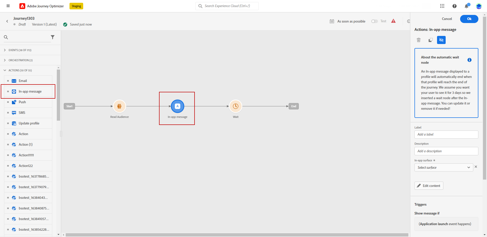

# Tidig versionsinformation {#e-release-notes}

[!DNL Adobe Journey Optimizer] levererar kontinuerligt nya funktioner, förbättringar av befintliga funktioner och felkorrigeringar. Alla ändringar konsolideras den sista veckan i varje månad i [versionsinformation](release-notes.md).

Noteringarna nedan kan ändras utan föregående meddelande fram till releasedatum. Länkar, skärmar och uppdaterad dokumentation publiceras i [versionsinformation](release-notes.md), på releasedatum.

## Versionsinformation augusti 2023 {#aug-rn-2023}

**Releasedatum**: 23-24 augusti 2023

### Nya funktioner{#aug-2023-features}

Den här versionen innehåller de nya funktionerna som listas nedan.

<table>
<thead>
<tr>
<th><strong>Skicka meddelanden i appen på dina resor</strong> </th>
</tr>
</thead>
<tbody>
<tr>
<td>

Du kan nu skicka personaliserade meddelanden i appen till appanvändarna under en resa. Använd Journey Optimizer för att utforma meddelanden och anpassa meddelandelayout, visning, text och knappar för att skapa en smidig upplevelse.

Mer information finns i den <a href="../in-app/get-started-in-app.md">detaljerade dokumentationen</a>.

</tr>
</tbody>
</table>

<table>
<thead>
<tr>
<th><strong>Validera dina e-postmeddelanden med dirigerade listor</strong> </th>
</tr>
</thead>
<tbody>
<tr>
<td>

Nu kan du skapa och hantera dirigerade listor i Journey Optimizer. En startvärdeslista består av testadresser som du skickar ett e-postmeddelande till innan du skickar det till den faktiska målgruppen. Använd den här funktionen för att övervaka skickade e-postkopior och se till att alla visningsformat, URL:er, bilder och länkar är korrekta.

<!--p>For more information, refer to the <a href="../audience/get-started-audience-orchestration.md">detailed documentation</a>.</p-->
</td>
</tr>
</tbody>
</table>

<table>
<thead>
<tr>
<th><strong>Generera text och bilder med Content Assist</strong> </th>
</tr>
</thead>
<tbody>
<tr>
<td>

När du väl har skapat och personaliserat ditt budskap tar du innehållet till nästa nivå med Content Assist. Nu kan du använda innehållsassistenten för att optimera budskapets effekt genom att experimentera med olika huvudtitlar och bilder. Varje variant hanteras som en unik behandling för att mäta och jämföra vilken titel som effektivt genererar fler klick.

Den här funktionen är för närvarande tillgänglig som en privat beta.

<!--p>For more information, refer to the <a href="../start/search-filter-categorize.md#tags">detailed documentation</a>.</p-->
</td>
</tr>
</tbody>
</table>

### Förbättringar {#aug-2023-improvements}

Den här versionen innehåller de förbättringar som anges nedan.

**API:er**

Det finns nu ett nytt API för att skapa och hantera innehållsfragment. [Läs mer](https://developer.adobe.com/journey-optimizer-apis/references/content-templates/#tag/Content-fragment-API){target="_blank"}.

**E-postkanal**

* Det finns ett nytt alternativ i inställningarna för e-postyta för att inkludera e-postadresser som inte har angetts på grund av skräppost i målgrupperna för transaktionsmeddelanden. Även om de har markerat marknadsföringsmeddelanden som skräppost kan dessa profiler sedan ta emot transaktionsmeddelanden, som lösenordsåterställning eller kontoutdrag. Det här alternativet är inaktiverat som standard.

**Resor**

* Nu kan du utnyttja API-anropssvar i anpassade åtgärder och samordna din resa baserat på dessa svar.
* En ny typ av systemvarning har införts. Du kan nu få meddelanden när en anpassad åtgärd misslyckas.

**Direktutskick**

* Stöd för Azure Blob som routningsmål.
* Stöd för `&amp;&quot;som en anpassad avgränsare.