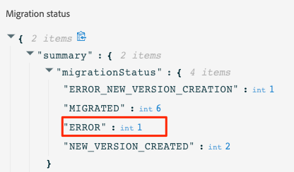

# Inline-redigeringssteg{#migration-steps}

Den nya processen för att skapa innehåll i Adobe Journey Optimizer beskrivs i detta [page](../rn/inline-messages.md). En automatisk omräkning av resor utförs åt dig. Vi behöver er hjälp med några steg.

>[!VIDEO](https://video.tv.adobe.com/v/344699)

Här följer de huvudsakliga faserna och stegen:

**[Före migreringen](../rn/inline-messages-steps.md#migration-step-1)**

1. På icke-produktionssandlådor ska alla pågående och slutna resor stoppas. [Läs mer](../rn/inline-messages-steps.md#migration-step-1-1)
1. I produktionssandlådan stoppar du alla direktsända ad hoc-resor utan någon profil. [Läs mer](../rn/inline-messages-steps.md#migration-step-1-2)

**[Efter den första upprepningen](../rn/inline-messages-steps.md#migration-step-2)**

1. Kontrollera om det finns några fel på dina migrerade direktresor. [Läs mer](../rn/inline-messages-steps.md#migration-step-2-1)
1. Lista alla nya versioner som skapas av migreringen. [Läs mer](../rn/inline-messages-steps.md#migration-step-2-2)
1. Testa och publicera dem en i taget. [Läs mer](../rn/inline-messages-steps.md#migration-step-2-3)
1. Lista alla liveversioner. [Läs mer](../rn/inline-messages-steps.md#migration-step-2-4)
1. Sök efter fel i migrerade utkastversioner. [Läs mer](../rn/inline-messages-steps.md#migration-step-2-5)

**[Efter den andra upprepningen](../rn/inline-messages-steps.md#migration-step-3)**

1. Kontrollera båda migreringsfaserna. [Läs mer](../rn/inline-messages-steps.md#migration-step-3-1)
1. Stoppa tidigare versioner. [Läs mer](../rn/inline-messages-steps.md#migration-step-3-2)

**[Före den tredje och sista upprepningen](../rn/inline-messages-steps.md#migration-step-4)**

Verifiera att allt har migrerats före borttagningen.

  

## Före migreringen (25 juli){#migration-step-1}

### 1. Stoppa alla pågående och stängda resor{#migration-step-1-1}

På **icke-produktionssandlådor**, stoppa alla resor live och stängda. Detta gör att den automatiserade migreringsprocessen kan migrera alla resor från dessa sandlådor utan att du behöver göra något. Efter migreringen kan du duplicera versioner av stoppade resor och använda dem.

### 2. Stoppa alla direktsända ad hoc-resor utan profil fortfarande i{#migration-step-1-2}

På **produktionssandlåda**, stoppa alla direktsända ad hoc-resor som inte längre innehåller profiler.

+++Hur hittar jag de här resorna?

Navigera till **Resor** och filtrera listan på&quot;Status = Live&quot; och&quot;Type = Read&quot;. Du kan också beställa resor kronologiskt från det tidigaste till det senaste publicerade datumet.

Öppna dem uppifrån och ned.

* Kontrollera att resan innehåller ett meddelande.
* Kontrollera att de inte är återkommande resor. Dessa är inte tillfälliga. Du vill antagligen hålla dem levande. Den här resan är till exempel en återkommande resa (inte ad hoc):

   

* Om du har använt väntetider eller händelseavlyssnare på dessa resor kan profiler fortfarande finnas inuti. Titta på körningsdatumet för resan och lägg till timmar/dagar som du har definierat i väntetider eller händelseavlyssnare för att definiera det faktiska datumet när inga profiler finns kvar inuti. Om det datumet redan har infallit kan du stoppa resan. I annat fall flyttas den här resan automatiskt till statusen&quot;Slutförd&quot; 30 dagar efter det att resan utfördes.

+++

**Viktiga anteckningar**

* Undvik att stänga resor före migreringsdatumet (25 juli). Eftersom det är känt att migreringsskriptet inte migrerar direktsända eller stängda resor kommer en begränsning av antalet stängda resor i produktionssandlådan att begränsa antalet manuella åtgärder som behövs efter migreringen.

* Om du har resor som inte är den senaste versionen, vilket innebär att du har skapat en ny version i utkast, kan du publicera den eller ta bort den.

* Om du har meddelanden som inte används på resor och som du vill behålla, sparar du dem som mallar. Se detta [page](../design/email-templates.md#save-as-template). Observera att du fortfarande kan komma åt dem tills de är borttagna.

## Efter migreringens första iteration (25 juli){#migration-step-2}

Migreringen sker i två faser: den automatiserade fasen (nattetid, mellan 25 juli och 26 juli) och den manuella fasen (med början 26 juli) som kräver åtgärder.

För den automatiska fasen, se [page](../rn/inline-messages.md#process). För den manuella fasen finns följande åtgärder att utföra på **produktionssandlåda**:

<!--
_On non-production sandboxes:_

**1. Check the migration status report for any error**

Click the **Check status** button in the top banner and check that there has been no error during the automatic migration and that there is nothing left to migrate. 

Look for the "ERROR" status. 

* If there is no error, you are good to go.
* If there are errors, look for the error by searching "errorMessage". The following error is expected as migration of multi-channel messages is not supported: "Migration of multi-channel messages is not supported". You will have to rebuild this journey.

    

_On the production sandbox:_

-->

### 1. Kontrollera om det finns några fel på dina migrerade liveresor{#migration-step-2-1}

Kontrollera om det finns fel på de automatiskt migrerade direktresorna i statusrapporten ([läs mer](../rn/inline-messages.md#status). Klicka på **Kontrollera status** i den övre banderollen.

Leta efter &quot;ERROR_NEW_VERSION_CREATION&quot;:

* Om det inte finns något fel innebär det att alla versioner av live-resor som kräver migrering har bearbetats och att ett nytt migrerat utkast har skapats automatiskt.

* Om du ser ett fel kan du söka efter &quot;errorMessage&quot; och kontrollera felmeddelandet i loggarna. Flerkanalsmeddelanden migreras inte. Du måste skapa en ny resa.

   

* Kontakta din CSM eller någon annan representant på Adobe för att få hjälp med andra fel.

### 2. Lista alla nya versioner som skapats vid migreringen{#migration-step-2-2}

De markeras som [MIGRERAD] i färdetiketten och när den skapades uppdateras.

### 3. Testa och publicera dem en i taget{#migration-step-2-3}

Se till att resan fortfarande behöver köras i produktionen. Om [förberedelse före migrering](../rn/inline-messages-steps.md#migration-step-1) inte utfördes korrekt. Du kan ha skapat en ny version för en enbildsresa som inte längre behövs.

Testa den utkastversion av resan som nu innehåller textbundna kanalåtgärder.

Publicera en ny version för resan. Din tidigare liveversion går sedan vidare till statusen&quot;Stängd&quot;.

### 4. Lista alla liveversioner{#migration-step-2-4}

De ska alla markeras som senaste. om inte, leta efter den nyare versionen, testa dem och publicera dem.

### 5. Kontrollera om det finns fel i migrerade utkastversioner {#migration-step-2-5}

Klicka på **Kontrollera status** i den övre banderollen ([läs mer](../rn/inline-messages.md#status) och kontrollera att det inte har uppstått något fel under den automatiska migreringen och att det inte finns något kvar att migrera. Observera att all felfri resa (med meddelanden) kommer att bli inaktuell efter 5 september (för alla sandlådor).

Leta efter statusen&quot;FEL&quot;.

* Om det inte finns något fel är du redo att gå.

* Om det finns fel söker du efter felet genom att söka efter &quot;errorMessage&quot;. Följande fel förväntas eftersom migrering av flerkanalsmeddelanden inte stöds: &quot;Migrering av flerkanalsmeddelanden stöds inte&quot;. Du måste bygga om den här resan.

## Efter den andra upprepningen (1 augusti){#migration-step-3}

Den andra upprepningen sker nattetid mellan 1 augusti och 2 augusti.

<!--
_On non-production sandboxes:_

**1. Check at the status report**

Click the **Check status** button in the top banner and check that all journeys have been migrated and there's nothing left to migrate. If there is an error or something left to migrate, please reach out to your CSM or Adobe representative for guidance.

-->

Om alla tidigare steg utfördes i tid har alla dina resor migrerats förutom de stängda och de med fel. Här är de steg som du ska följa på **produktionssandlåda**:

### 1. Kontrollera båda migreringsfaserna{#migration-step-3-1}

Om det inte finns några fel bör du inte ha några resor i&quot;eligibilityStatus&quot;, under&quot;toMigrate&quot; och&quot;createNewVersion&quot;. I följande exempel finns det ett&quot;ERROR&quot; och ett&quot;ERROR_NEW_VERSION_CREATION&quot;.

### 2. Stoppa tidigare versioner{#migration-step-3-2}

Om du inte har publicerat nyare reseversioner (se det här [section](../rn/inline-messages-steps.md#migration-step-2-3)) i tid före iteration 2 (1 augusti) och sedan publicera den nyare versionen.

>[!NOTE]
>
>Stoppa den tidigare versionen, annars förlorar du den och den tillhörande rapporteringen.

## Före den tredje och sista upprepningen (5 september){#migration-step-4}

Mellan 1 augusti och 5 september måste ni verifiera att allt har migrerats och att det inte finns några resor kvar med meddelanden, annars kommer de att bli inaktuella den 5 september.

