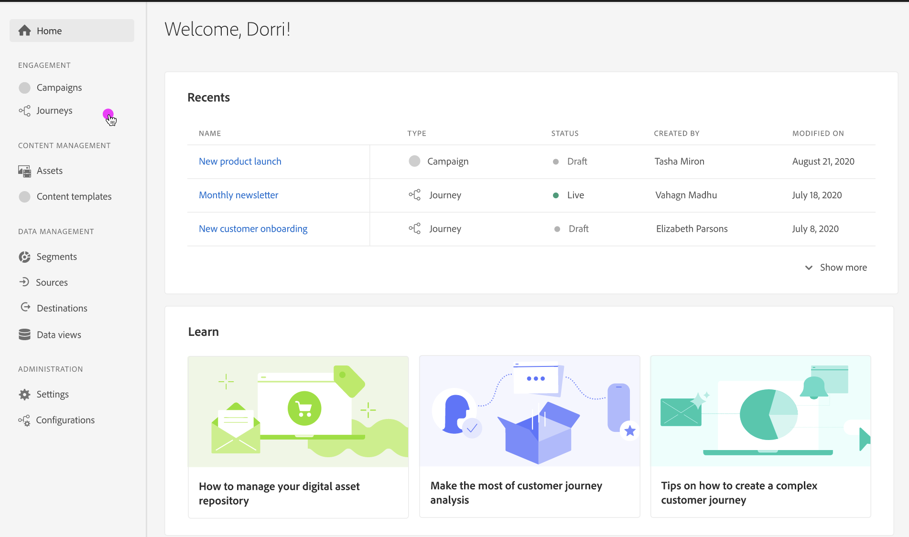

# Migrering till onlineframtagning av resan{#inline-authoring}

>[!CONTEXTUALHELP]
>id="ajo_messages_migration_before"
>title="Läs mer om det nya textbundna redigeringsmeddelandet"
>abstract="Från och med Journey Optimizer juliversion 22 skapas meddelanden direkt från en resa. Befintliga meddelanden migreras automatiskt till den nya modellen. Ytterligare åtgärder krävs efter migreringen."

>[!CONTEXTUALHELP]
>id="ajo_messages_migration_during"
>title="Lär dig vad som händer"
>abstract="Från och med Journey Optimizer juliversion 22 skapas meddelanden direkt från en resa. Din miljö migreras. Ytterligare åtgärder krävs efter migreringen."

>[!CONTEXTUALHELP]
>id="ajo_messages_migration_after"
>title="Lär dig hur du migrerar meddelanden"
>abstract="Från och med Journey Optimizer juliversion 22 skapas meddelanden direkt från en resa. Befintliga meddelanden har nu migrerats till den nya modellen. Som resehandledare krävs nu ytterligare åtgärder."

Adobe Journey Optimizer har släppt en ny funktion som förbättrar det sätt på vilket yrkesverksamma skapar upplevelser för Journey Optimizer levererade kanaler som e-post, push, SMS. Den här funktionen kräver en migrering av befintliga resor som använder meddelanden.

Som resehandledare kan du nu skapa och skriva meddelanden direkt från en resa.

De viktigaste ändringarna i användargränssnittet är:

* Reseåtgärden är 1:1 med meddelandet
* Meddelandekomponenten i den vänstra listen i Journey Optimizer är inte längre tillgänglig. Meddelanden skapas som åtgärder.
* Det finns inget separat meddelandebibliotek: centraliserar nu alla komponenter

