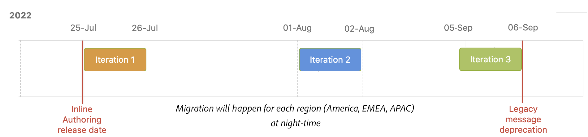
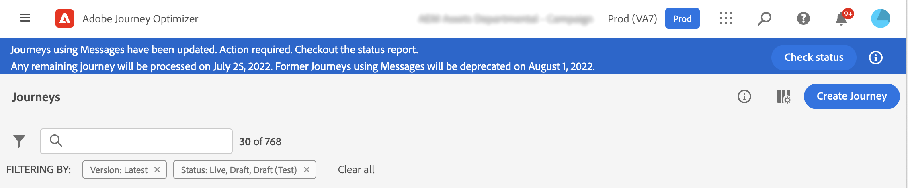

# Översikt över redigeringsmigrering online{#inline-authoring}

>[!CONTEXTUALHELP]
>id="ajo_messages_migration_before"
>title="Läs mer om den nya funktionen för textbunden redigering"
>abstract="Från och med 25 juli 2022 skapas meddelanden direkt från en resa. Befintliga meddelanden migreras automatiskt till den nya modellen. Ytterligare åtgärder krävs efter migreringen om du för närvarande använder meddelanden under dina resor."
>additional-url="https://experienceleague.adobe.com/docs/journey-optimizer/using/whats-new/inline-authoring/inline-messages-steps.html" text="Migreringssteg"

>[!CONTEXTUALHELP]
>id="ajo_messages_migration_during"
>title="Lär dig vad som händer"
>abstract="Från och med 25 juli 2022 skapas meddelanden direkt från en resa. Din miljö migreras. Ytterligare åtgärder krävs efter migreringen om du för närvarande använder meddelanden under dina resor."
>additional-url="https://experienceleague.adobe.com/docs/journey-optimizer/using/whats-new/inline-authoring/inline-messages-steps.html" text="Migreringssteg"

>[!CONTEXTUALHELP]
>id="ajo_messages_migration_after"
>title="Lär dig hur du migrerar meddelanden"
>abstract="Från och med 25 juli 2022 skapas meddelanden direkt från en resa. Befintliga meddelanden har nu migrerats till den nya modellen. Som resehandledare krävs nu ytterligare åtgärder för resor med meddelanden."
>additional-url="https://experienceleague.adobe.com/docs/journey-optimizer/using/whats-new/inline-authoring/inline-messages-steps.html" text="Migreringssteg"

>[!CONTEXTUALHELP]
>id="ajo_messages_depecrated_inventory"
>title="Lär dig hur du migrerar meddelanden"
>abstract="Från och med den 25 juli 2022 försvinner menyn Meddelanden och meddelanden skapas direkt från en resa. Om du vill återanvända dina gamla meddelanden under resor måste du spara dem som mallar."
>additional-url="https://experienceleague.adobe.com/docs/journey-optimizer/using/design/email-templates.html#save-as-template" text="Spara meddelanden som mallar"

Adobe Journey Optimizer släpper en ny funktion som förbättrar det sätt på vilket du skapar innehåll för Journey Optimizer-kanaler (e-post, push, SMS). Som Journey Optimizer-läkare kan du nu skapa och skriva meddelanden direkt från en resa.

Den här funktionen kräver en migrering av befintliga resor som använder meddelanden. På den här sidan hittar du nödvändig information om den här ändringen samt de steg som krävs av dig.

Mer information om vilka roller och ansvarsområden du har som Journey Optimizer-läkare finns i [page](../start/path/marketer.md).

<!--
Here are the main changes in the interface:

* Messages are created direcly from journeys.
* The **Messages** entry in the left navigation menu has been removed. 
* There is no separate library of messages, the journey now centralizes all components.

-->

>[!VIDEO](https://video.tv.adobe.com/v/344698)

## Viktiga starter{#keys}

* **Påverkas jag?**: du påverkas om du skapar meddelanden från **Meddelanden** menyn i den vänstra navigeringen och använd dem på dina resor. Om du använder ett system från en annan leverantör (t.ex. Adobe Campaign) påverkas inte migreringen.

* **Produktändringar**: på GA (25 juli) skapas och hanteras ditt kanalinnehåll under varje resa. The **Meddelanden** finns inte längre i den vänstra navigeringsmenyn ([läs mer](../rn/inline-messages.md#change)). Vi går vidare till en övergång för era befintliga resor.

* **Tidslinje**: migrering sker för varje region på natten, via flera [iterationer](../rn/inline-messages.md#iterations).

   

* **Nödvändiga åtgärder**: en automatisk omräkning av resorna utförs åt er. Vi behöver er hjälp med några steg. Läs mer om de steg som krävs i detta [page](../rn/inline-messages-steps.md).

* **Föråldring**: efter den 6 september stoppas alla resor som fortfarande använder äldre meddelanden och tas bort senare.

## Fördelar och produktändringar{#change}

Adobe förenklar produkten kontinuerligt för att ge effektiva och optimerade användarflöden. Detta nya sätt att skapa meddelanden ger en effektivare användarprocess.

Vi har utformat det nya arbetsflödet för att centralisera innehåll på ett och samma ställe, direkt där det används.

Nu kan du skapa innehåll direkt under resan. Den omedelbara **fördelar** får du:

* Snabbare resebyggande med Journey Optimizer-kanaler i ett enda flöde.
* Snabb visualisering av innehåll genom att smidigt växla mellan allt e-postinnehåll, push-innehåll och SMS-innehåll under en resa.
* Förbättrat flöde för e-post och push med hjälp av sammanhangsbaserad personalisering från arbetsytan.
* Reserapporter centraliserar detaljerad kanalrapporteringsinformation.

Här är **produktändringar** med den här nya funktionen:

<table>
<tr>
<th>Före migrering</th>
<th>Efter migrering</th>
</tr>
<tr>
<td>
Innan du skapade ditt meddelande från <strong>Meddelanden</strong> -menyn. 
</td>
<td>
Nu <strong>Meddelanden</strong> finns inte längre i den vänstra navigeringen. 
</td>
</tr>
<tr>
<td>
Sedan skapade du en resa och lade till en <strong>Meddelande</strong> och markerade det tidigare skapade meddelandet.
</td>
<td>
Nu behöver du bara lägga till den önskade kanalåtgärdsaktiviteten (e-post, SMS, push) på din resa. I aktiviteten konfigurerar du meddelandeparametrarna direkt och öppnar innehållsredigeraren.
</td>
</tr>
<tr>
<td>
Tidigare var rapporteringen tillgänglig både på meddelande- och resenivå. Du var tvungen att navigera mellan fliken för meddelandekörning och reserapporten.
</td>
<td>
All rapportering är nu centraliserad på resenivå. Detta förbättrar navigeringen och användarupplevelsen. När du har flera e-postmeddelanden på en resa kan du använda <strong>Åtgärd</strong> för att visa den relaterade rapporten.

</td>
</tr>
</table>

Vid GA (25 juli) gäller det nya användarflödet alla nya resor. The **Meddelanden** finns inte längre i den vänstra navigeringen.

## Tidslinje för migrering{#iterations}

Det krävs en migrering för att du ska kunna vända dina befintliga resor med **Meddelanden** till resor med textbundna åtgärder. En automatisk omräkning av resor utförs åt dig. Vi behöver er hjälp med några steg.

Migrering sker för varje region på natten, via flera iterationer. Här är migreringstidslinjen:

* 25 juli 2022: GA - första upprepningen
* 1 augusti 2022: Andra upprepningen
* 5 september 2022: 3:e upprepningen
* 6 september 2022: borttagning

Varför behöver vi flera iterationer?

Under en upprepning går vi igenom varje resa och migrerar dem när det är möjligt. Det finns fall där vi inte vill migrera automatiskt: när resan är live eller stängd (vilket innebär att det fortfarande kan finnas profiler i den). I dessa fall ber vi dig att utföra en åtgärd, och nästa iteration migrerar de här resorna som inte kunde migreras i tidigare iteration.

## Vanliga frågor och svar  {#faq}

### Hur får jag information om ändringen?{#inform}

Adobe kommunicerar med dig före första iterationen.

Ändringen genomförs över en natt, genom flera iterationer. Läs mer på [iterationer](../rn/inline-messages.md#inline-authoring).

Du informeras även av meddelanden i produkten som visas på Journeys-skärmar:

* Innan du ändrar distributionen

   

* Under en iteration

   

* Efter en iteration

   

   Efter en iteration **Kontrollera status** visas. På så sätt kan du visa alla dina resor i JSON-format och deras respektive migreringsstatus. Se det här [section](../rn/inline-messages.md#status).

* När banderollen försvinner är du redo att gå. Du behöver inte göra något mer.

### Vad är migreringsprocessen?{#process}

Migreringen är helt automatisk för resor som inte är direktsända eller stängda. Vi vill inte påverka pågående eller slutna resor för att undvika eventuella produktionseffekter. Vi ber dig publicera den nya versionen som vi har skapat åt dig.

Alla sandlådor för en kund-ORG bearbetas samtidigt. Under ändringsdistributionen utförs följande åtgärder:

**ALL resa som inte använder meddelanden**

Dessa påverkas inte av ändringen. Det är endast resor med meddelanden som är inriktade på migreringen. Du kommer dock fortfarande att kunna komma åt meddelanden som inte används i en resa via följande URL: https://experience.adobe.com/#/@[ORG]/sname:[SANDLÅDA]/travel-optimizer/messages/

**UTKAST till resor med minst ett meddelande**

Utkastversioner av meddelanden ändras under migreringen. De hänvisar inte längre till något meddelande. The **Meddelande** Verksamheter ersätts med lämpliga kanalåtgärder. Var och en av dem innehåller kanalparametrar och innehåll.

Som vanligt testar du utkastet innan du publicerar det.

**LIVE-resor med minst ett meddelande**

Live-versionen av en resa fortsätter att fungera för att undvika eventuella produktionseffekter.

Ett nytt utkast av den här resan skapas under migreringen. Den nya utkastversionen är en kopia av din liveversion, men meddelanden ersätts med inline-redigerade kanalåtgärder. Varje kanalåtgärd omfattar kanalparametrar och innehåll. Innehållet går inte förlorat. Rapporteringen går inte förlorad.

Vi förväntar oss att du granskar utkastet, testar det och publicerar det så att det blir den aktiva versionen.

**Färdigställda eller STOPPADE resor med minst ett meddelande**

Dessa resor migreras också.

När du tittar på reserapporten blir rapporterna nu mer omfattande och innehåller den informationsnivå som tidigare fanns tillgänglig i meddelanderapporten.

**AVSLUTADE resor med minst ett meddelande**

Den stängda versionen av en resa fortsätter att fungera för alla profiler inuti för att undvika eventuella produktionseffekter.

Stängda resor ändras automatiskt till statusen&quot;Slutförd&quot; efter 30 dagar. De kommer att beaktas vid nästa iteration, när de är klara.

**Flerkanalsresor**

De här är inte migrerade. Du måste återskapa dem.

### Vad är mina åtgärdsobjekt som kund?{#actions}

En automatisk omräkning av resor utförs åt dig, men några steg krävs. Läs mer om de steg som krävs i detta [page](../rn/inline-messages-steps.md).

<!--

The process timeline is indicated in a blue banner on the Journeys screen. See this [section](../rn/inline-messages.md#inform). 

**Before migration**

* Check the date indicated in the banner. 
* Stop non-critical journeys, on development, stage and production environments.
* If you have draft messages that you want to keep using, add them to a journey so they are migrated.

**During migration**

* Migration occurs at night-time
* Do not to create, edit or delete journeys.

**After migration**

* After each iteration, click the **Check status** button in the top banner. This page lists all journeys and their migration status. See this [section](../rn/inline-messages.md#status). 

* For each live journey, a new version is created. Review the new version, test it and publish it. 

* The **Messages** menu, in the left navigation is no longer available. You need to use the new in-line message feature. See this [section](../rn/inline-messages.md#change). 

* If you need to access a specific message which was not used in a journey, you can use this URL and save the content as a template: https://experience.adobe.com/#/@[ORG]/sname:[SANDBOX]/journey-optimizer/messages/

## How can I check the migration status?{#status}

Click the **Check status** button in the top banner. The following page is displayed.

The status report is at sandbox level. This report includes several useful sections:

**migrationStatus**

This section displays the migration information since the first iteration. Numbers are incremented after each iteration.

* MIGRATED: number of draft journeys migrated successfully.
* NEW_VERSION_CREATED: number of live journeys migrated. For each live journey, a new draft version is created: you must test and publish this version.
* ERROR: number of draft journeys not migrated because of a failure. You need to re-create them.
* ERROR_ON_NEW_VERSION_CREATION: number of live journeys not migrated because of a failure. new draft journey versions not migrated because of a failure. You need to re-create them.

**eligibilityStatus**

This section lists the remaining items after the last iteration:

* toMigrate: number of draft journeys that need to be migrated.
* createNewVersion: number of live journeys to migrate.
* noMigration_live: number of live journeys that do not need to be migrated
* noMigration: number of draft journeys that do not need to be migrated.

The **details** section gives, for each of the above indicators, the list of related journeys.

-->

### Hur kontrollerar jag migreringsstatusen?{#status}

Klicka på **Kontrollera status** i den övre banderollen. Följande sida visas.

Statusrapporten finns på sandlådenivå. Den här rapporten innehåller flera användbara avsnitt:

**migrationStatus**

I det här avsnittet visas migreringsinformationen sedan den första upprepningen. Siffror ökas stegvis efter varje iteration.

* MIGRERAD: Antal slutförda och avbrutna resor som migrerats utan fel.
* NEW_VERSION_CREATED: antal migrerade direktresor. För varje live-resa skapas ett nytt utkast: du måste testa och publicera den här versionen.
* FEL: Antal avbrutna, avslutade och avbrutna avgångar som inte migrerats på grund av ett fel. Du måste återskapa dem.
* ERROR_ON_NEW_VERSION_CREATION: Antal direktresor som inte flyttats på grund av ett fel. nya versioner av utkast som inte migrerats på grund av ett fel. Nya utkastversioner har inte skapats för dem. Du måste återskapa dem manuellt.

**eligibilityStatus**

I det här avsnittet visas de återstående objekten efter den senaste upprepningen:

* toMigrate: Antal utkast, avslutade och avbrutna resor som behöver migreras.
* createNewVersion: Antal direktresor att migrera.
* noMigration_live: Antal direktresor som inte behöver migreras. Här listas även stängda resor.
* noMigration: Antal resor som inte behöver migreras.

The **information** för vart och ett av de ovanstående avsnitten innehåller en förteckning över tillhörande resor.

### Kommer den här ändringen att orsaka avbrott i tjänsten?{#interruption}

Tjänsten kommer inte att avbrytas.

* Vid direktresor: utan påverkan, de fortsätter springa.
* Vid körning: under migreringen (nattetid) rekommenderar vi starkt att man inte skapar, redigerar eller tar bort resor.

### Kommer data att gå förlorade? {#data}

Inga dataförluster och ingen påverkan på direktresor kommer att förekomma. Du får kontroll över publiceringen av uppdaterade versioner av resan.

### Kommer funktionaliteten att gå förlorad?{#functionality}

Det kommer att bli en förändring i hur du redigerar meddelandet. Funktionsbortfall uppstår inte.

### Kommer det att finnas tillgång till miljön under migreringsprocessen?

Migreringen sker på natten. Du kommer att kunna använda produkten. Men skapa, redigera eller radera inte resor.

### Kommer meddelandena att fortsätta att skickas?

Ja, direktresor fortsätter.

### Hur vet jag att migreringen är klar?

Migreringen är klar när banderollen försvinner. Se det här [section](../rn/inline-messages.md#inform).

### Hur påverkas meddelanderelaterade behörigheter?

Funktionen för onlineredigering påverkar behörigheter. Alla meddelanderelaterade behörigheter, som [!DNL View Messages] eller [!DNL Manage Messages], kommer automatiskt att inkluderas i de tillstånd som är kopplade till möjligheten att resa.

Läs mer om detta [page](../administration/ootb-product-profiles.md).

<!--
* Improved authoring flow and navigation
* Personalization: improved contextual personalization flow
* Reporting: the message execution screen will no longer exist. Reporting is centralized in journeys.
* You will still be able to update content in a live journey.
->>
