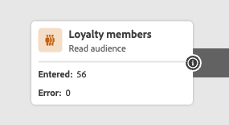

# Välkommen till den förbättrade resedesignern {#new-canvas}

Journey Optimizer erbjuder nu **förenklad resemodell** som syftar till att förbättra interna processer. Även om den här nya modellen är en backend-förbättring har vårt team tagit tillfället i akt att lägga till funktioner som är synliga och till nytta för Journey Optimizer-användare:

* A **omdesignad arbetsyta** för en moderniserad användarupplevelse
* A **live-rapportering** Gränssnitt som är direkt tillgängliga på arbetsytan

>[!NOTE]
>
>Tänk på att utrullningen för den här funktionen kommer att vara progressiv. Du kanske inte ser ändringarna direkt.

## Uppdateringar av resemodellen

Den nya resemodellen kommer att leva tillsammans med den befintliga, vilket innebär att det kommer att finnas resor som använder **två olika modeller**:

* Den äldre modellen
* Den nya modellen

Alla resor i den äldre modellen stannar kvar i den. Du kan fortfarande redigera, testa och publicera dem. Alla nya versioner som skapas från en resa i den äldre modellen behålls också i den. Det finns **inga funktionsändringar** runt de där resorna.

Som du ser på skärmbilden nedan är noderna rundformade, vilket är det gamla användargränssnittet för resor med den äldre modellen.

När du **skapa en ny resa** eller **duplicera en befintlig**, kommer den att finnas i den nya modellen. Resor i den äldre modellen stöds fortfarande tills en majoritet av kunderna går över till den nya.

Det finns en begränsning i den nya resemodellen som **det går inte att kopiera och klistra in aktiviteter från den äldre modellen till den nya och vice versa**. Om du vill göra det rekommenderar vi dig att duplicera din tidigare resa för att byta till den nya modellen och sedan kopiera dina aktiviteter.

På skärmbilden nedan ser du det omdesignade gränssnittet för arbetsytan (endast tillgängligt med den nya modellen):

**Alla nya funktioner som läggs till resedesignern (inklusive direktrapportering) kommer endast att vara tillgängliga för resor med den nya modellen från och med nu.**

## Förbättrad design av arbetsyta

Med den nya resemodellen introducerar vi en ny och förbättrad **arbetsytans gränssnitt**, som smidigt passar in i Adobe Experience Cloud lösningar och ekosystem, vilket ger en intuitiv och effektiv användarupplevelse. Alla resor i den nya modellen kommer att göras i den nya designen.

Aktiviteter visas nu med fyrkantiga rutor med följande funktioner:

* Den första raden som representerar aktivitetstypen, som ofta skrivs över av mer sammanhangsberoende information (t.ex.: på Läser målgrupper innehåller den namnet på den valda målgruppen), eller av en anpassad etikett om du definierar en sådan.
* Den andra raden representerar alltid aktivitetstypen.

Det nya användargränssnittet förbättrar läsbarheten på arbetsytan genom att tillhandahålla **tydligare aktivitetsetiketter och -typer**.

Det gör det även möjligt för produktteamet att lägga till mer information på arbetsytan med färre klick. Ett exempel på&quot;mer information&quot; kan vara att lägga in live-rapportering på arbetsytan där du kan se profiler som läggs in och avslutas på grund av fel.

## Live-rapportering på arbetsytan under resan

Tillsammans med den förbättrade utformningen av arbetsytan ger vi nu möjlighet att se **senaste 24 timmars rapportstatistik** (s.k.&quot;live reporting&quot;) direkt på arbetsytan.

Med varje live-resa på den nya modellen kommer du att kunna se **för varje aktivitet**, antalet profiler som gick in i aktiviteten och antalet som slutade på grund av ett fel:

<!--`
With every live journey on the new model, you will be able to see two types of "last 24 hours" reporting information:

* On a **new insert**, you will see:
    * The number of profiles that have been exported for audience-triggered journeys. You will see the number of profiles available in the last export job alongside the time when that export has been made.
    * The number of profiles who exited the journey
    * The percentage of errors
    
* **On each activity**, you will see the number of profiles who entered that activity and the number who exited because of an error:
    
-->

Användargränssnittet uppdateras automatiskt varje minut.

<!--
Please note that you may see differences between the number of exported profiles and the number of profiles flowing through the journey. The exported profiles count only provides information about the last export job being made while the number of profiles entering an activity only contains profiles who did it in the last 24 hours. This can especially be visible on recurring daily journeys as there could be a data overlap between two days.
-->
