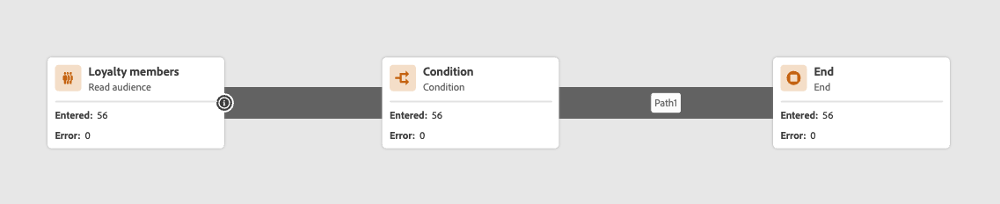

# Välkommen till den förbättrade resedesignern {#new-canvas}

>[!CONTEXTUALHELP]
>id="ajo_new_canvas"
>title="Nyheter?"
>abstract="Ny arbetsyta"

Välkommen till den förbättrade resedesignern!

Vi har utvecklat en **förenklad resemodell** som syftar till att förbättra interna processer. Även om den här nya modellen är en backend-förbättring har vårt team tagit tillfället i akt att lägga till funktioner som är synliga och till nytta för Journey Optimizer-användare:

* A **omdesignad arbetsyta** för en moderniserad användarupplevelse
* A **live-rapportering** Gränssnitt som är direkt tillgängliga på arbetsytan

## Uppdateringar av resemodellen

Den nya resemodellen kommer att leva tillsammans med den befintliga, vilket innebär att det kommer att finnas resor som använder **två olika modeller**:

* Den gamla, med namnet &quot;v1&quot;
* Och den nya som kallas &quot;v2&quot;

Alla resor i v1 stannar i v1. Du kan fortfarande redigera, testa och publicera dem. Alla nya versioner som skapas från en v1 behålls också i v1. Det finns **inga funktionsändringar** runt v1-resor.

Som du ser i skärmbilden nedan är noderna rundformade, vilket är det gamla användargränssnittet för resor med v1-modellen.

Men när du **skapa en ny resa** eller **duplicera en befintlig**, blir det en v2-resa.  Vi planerar att fortsätta stödja v1-resor tills en majoritet av kunderna går över till v2-resor.

Det finns en begränsning i den nya resemodellen som **det inte går att kopiera och klistra in aktiviteter från en v1-resa till en v2 och vice versa**. Om du vill göra detta rekommenderar vi att du duplicerar din v1-resa så att den blir v2-version och sedan kopierar dina aktiviteter.

På skärmbilden nedan ser du det omdesignade gränssnittet för arbetsytan (endast tillgängligt med v2-modellen):

**Alla nya funktioner som läggs till resedesignern (inklusive direktrapportering) är endast tillgängliga för v2-resor från och med nu.**

## Förbättrad design av arbetsyta

Med den nya resemodellen introducerar vi en ny och förbättrad **arbetsytans gränssnitt**, som smidigt passar in i Adobe Experience Cloud lösningar och ekosystem, vilket ger en intuitiv och effektiv användarupplevelse. Alla resor i v2-stacken kommer att finnas i den nya designen.

Aktiviteter visas nu med fyrkantiga rutor med följande funktioner:

* Den första raden som representerar aktivitetstypen, som ofta skrivs över av mer sammanhangsberoende information (t.ex.: på Läser målgrupper innehåller den namnet på den valda målgruppen), eller av en anpassad etikett om du definierar en sådan.
* Den andra raden representerar alltid aktivitetstypen.

Det nya användargränssnittet förbättrar läsbarheten på arbetsytan genom att tillhandahålla **tydligare aktivitetsetiketter och -typer**.

Det gör det även möjligt för produktteamet att lägga till mer information på arbetsytan med färre klick. Ett exempel på&quot;mer information&quot; kan vara att lägga in live-rapportering på arbetsytan där du kan se profiler som läggs in och avslutas på grund av fel.

## Live-rapportering på arbetsytan under resan

Tillsammans med den förbättrade utformningen av arbetsytan ger vi nu möjlighet att se **senaste 24 timmars rapportstatistik** (s.k.&quot;live reporting&quot;) direkt på arbetsytan.

Med varje live-resa i den nya modellen kan du se två typer av rapportinformation som är&quot;senaste dygnet&quot;:

* På en **new insert** kommer du att se:
   * Antalet profiler som har exporterats för målgruppsinlösta resor. Du ser antalet profiler som var tillgängliga i det senaste exportjobbet tillsammans med den tidpunkt då exporten gjordes.
   * Antalet profiler som lämnade resan
   * Procentandel fel
     
* **För varje aktivitet**visas antalet profiler som har gått in i aktiviteten och antalet som slutade på grund av ett fel:
  

Användargränssnittet uppdateras automatiskt varje minut.

Observera att du kan se skillnader mellan antalet exporterade profiler och antalet profiler som löper genom resan. Antalet exporterade profiler ger bara information om det senaste exportjobbet som gjorts, medan antalet profiler som anger en aktivitet endast innehåller profiler som har gjort det de senaste 24 timmarna. Detta kan särskilt vara synligt vid återkommande dagliga resor eftersom det kan finnas en datasamling mellan två dagar.
