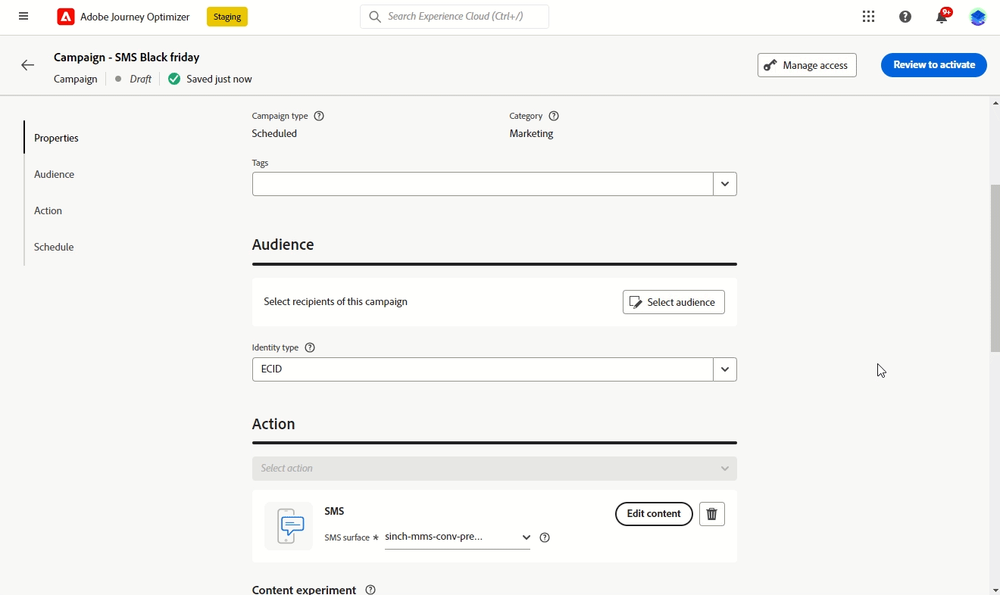
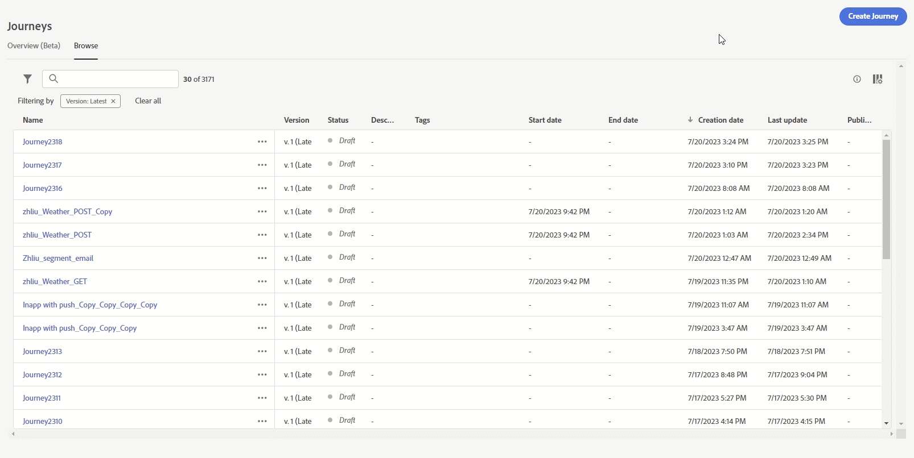
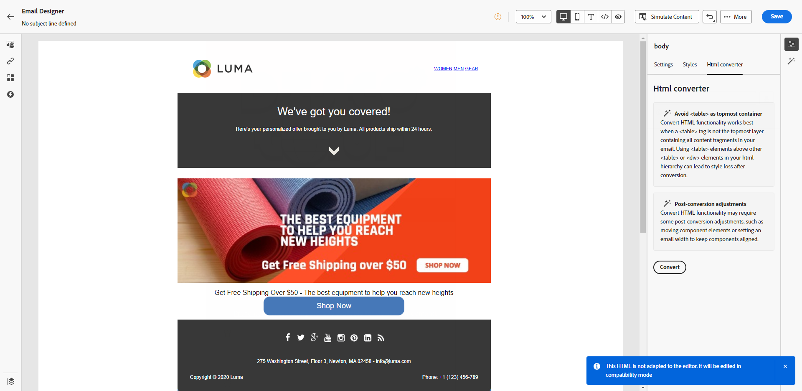

# Versionsinformation för 2023 {#release-notes-2023}

På den här sidan visas alla funktioner och förbättringar för [!DNL Journey Optimizer] som släpptes 2023.

## 23 oktober {#oct-rn-2023}

### Nya funktioner{#oct-2023-features}

Den här versionen innehåller de nya funktionerna som listas nedan.

<table>
<thead>
<tr>
<th><strong>Verktyg i sandlådan</strong> </th>
</tr>
</thead>
<tbody>
<tr>
<td>

Med sandlådeverktygen kan du kopiera objekt över flera sandlådor genom att utnyttja export och import av paket. Ett paket kan bestå av ett eller flera objekt. Alla objekt som ingår i ett paket måste komma från samma sandlåda.

<!--img src="../data/assets/dataset-export-setup.png"-->

Mer information finns i den <a href="../building-journeys/copy-to-sandbox.md">detaljerade dokumentationen</a>.

</td>
</tr>
</tbody>
</table>

<table>
<thead>
<tr>
<th><strong>MMS (Multimedia Message Service) i SMS</strong> </th>
</tr>
</thead>
<tbody>
<tr>
<td>

Med SMS-kanalen kan du nu förbättra kommunikationen genom att skicka MMS-meddelanden (Multimedia Message Service) som gör det möjligt att dela bilder, GIF-filer eller videor med dina kunder. Observera att den här funktionen för närvarande endast är tillgänglig för Sinch.

Mer information finns i den <a href="../sms/create-sms.md#mms-content">detaljerade dokumentationen</a>.

</tr>
</tbody>
</table>

### Förbättringar {#oct-2023-improvements}

Den här versionen innehåller de förbättringar som anges nedan.

**Publiker**

* Nu kan ni rikta in er på målgrupper som överförts från en CSV-fil till resor och kampanjer. [Läs mer](../audience/about-audiences.md#about-segments)
* Nu kan ni inrikta er på målgrupper som skapats genom målgruppssammansättning och utnyttja anrikningsattribut i Journeys. [Läs mer](../building-journeys/read-audience.md)

>[!AVAILABILITY]
>
>Dessa funktioner är för närvarande tillgängliga som en betaversion.

<!--
**Spam scoring for emails**

* When simulating an email content, a new option enables you to check how your content performs against inboxes spam filtering. This feature is currently proposed to a set of customers only (Limited Availability), and available for the Email channel.-->

**Kampanjer**

<!--* You can now stop a live one-time campaign, make modifications and resume it again. This improvement is available in Beta.-->
* När ett fel inträffar inom en av era kampanjer visas nu en varningsikon i kampanjlistan tillsammans med kampanjens status. [Läs mer](../campaigns/manage-campaigns.md#statuses)

**Resor**

* Den längsta väntetid du kan ange är nu 29 dagar i stället för 30. Denna förbättring har införts för att förhindra att väntetider överskrider den 30 dagar långa transporttiden. Detta gäller

   * fältet **Mängd tid** i [vänteaktiviteten](../building-journeys/wait-activity.md)
   * **Vänteperioden för återinträde** i [resans egenskaper](../building-journeys/journey-properties.md#entrance)
   * **Vänta på fältet** i timeoutdefinitionen för [händelseaktiviteter](../building-journeys/general-events.md#events-specific-time).

<!--
**Consent in channel configuration**

* You can now select a marketing action at the channel configuration level. When used in a surface, all consent policies associated with that marketing action are leveraged in order to respect the preferences of your customers.-->

**Beslutshantering**

* Flera etiketter som rör anbudsbegränsning i beslutsgränssnittet har uppdaterats. [Läs mer](../offers/offer-library/add-constraints.md#capping)

## 23 september {#sept-rn-2023}

### Nya funktioner{#sept-2023-features}

Den här versionen innehåller de nya funktionerna som listas nedan.

<table>
<thead>
<tr>
<th><strong>Beräknade attribut</strong> </th>
</tr>
</thead>
<tbody>
<tr>
<td>

Beräknade attribut gör det enkelt att sammanfatta händelsedata i profilattribut via ett intuitivt användargränssnitt för förbättrad beteendebaserad segmentering, personalisering och aktivering. Med den här funktionen kan du skapa beräknade attribut på ett självbetjäningssätt, hantera dem och använda dem vid segmentering, kundprofilmål i realtid eller Journey Optimizer.  
Beräknade attribut förenklar dessutom arbetsflödena för segmentering och resor så att ni smidigt kan leverera relevanta upplevelser. Läs mer i den <a href="../audience/computed-attributes.md">detaljerade dokumentationen</a>.

</tr>
</tbody>
</table>

<table>
<thead>
<tr>
<th><strong>Konsoliderade kanalrapporter</strong> </th>
</tr>
</thead>
<tbody>
<tr>
<td>

Med funktionen Kanalrapport kan analytiker och marknadsförare få en heltäckande översikt över trafik- och engagemangsmått på kanalnivå.

Om du vill få åtkomst till menyn <b>Rapport</b> måste du ha behörigheten <b>Visa kanalrapporter</b> .

Mer information finns i den <a href="../reports/channel-report-cja.md">detaljerade dokumentationen</a>.

</tr>
</tbody>
</table>

<table>
<thead>
<tr>
<th><strong>Målgrupper för datauppsättningsexport (GA)</strong> </th>
</tr>
</thead>
<tbody>
<tr>
<td>

Export av Journey Optimizer datamängder till molnlagringsmål är nu allmänt tillgängligt. Med den här funktionen kan du upprätta en direktanslutning till molnlagringsplatser för att kunna exportera innehållet i dina datauppsättningar.

Mer information finns i den <a href="../data/export-datasets.md">detaljerade dokumentationen</a>.

</td>
</tr>
</tbody>
</table>

<table>
<thead>
<tr>
<th><strong>Lagring av autentiseringsuppgifter för mobilprogram per sandbox</strong> </th>
</tr>
</thead>
<tbody>
<tr>
<td>

Med den här nya funktionen kan du enkelt hantera och associera push-autentiseringsuppgifter med en dedikerad sandlåda i appytor.

Mer information finns i den <a href="../in-app/inapp-configuration.md#channel-prerequisites">detaljerade dokumentationen</a>.

</tr>
</tbody>
</table>

### Förbättringar {#sept-2023-improvements}

Den här versionen innehåller de förbättringar som anges nedan.

**Beslutshantering**

* Nu finns nya API:er för att skapa och hantera beslutshanteringsobjekt. Dessa API:er ger bättre prestanda och en förbättrad användarupplevelse. Äldre API:er stöds till 2024-03-27. [Läs mer](../offers/api-reference/getting-started.md)

**Personalization**

* Förutom visuella fragment går det nu att skapa, spara och återanvända uttrycksfragment från Journey Optimizer-gränssnittet via uttrycksredigeraren. Uttrycksfragment ersätter uttryck som sparats tidigare. [Läs mer](../personalization/use-expression-fragments.md)

**Varning**

* En ny typ av systemvarning har införts. Du kan nu få ett meddelande när en **Läs målgrupp**-aktivitet misslyckas. [Läs mer](../reports/alerts.md).

**Webbkanal**

* Nu kan du skapa SPA-program (Single-page applications) i den visuella webbredigeraren, där du kan välja vilka specifika vyer du vill använda webbsidesändringarna på. En vy kan definieras som en hel webbplats eller som en grupp visuella element på en webbplats, till exempel hemsidan, hela produktwebbplatsen eller leveransinställningsramen på alla utcheckningssidor. Det krävs en engångsinstallation av utvecklare för att definiera vyerna i Adobe Experience Platform Web SDK-implementeringen, vilket gör det möjligt för marknadsförare att skapa och köra Adobe Journey Optimizer webbkampanjer på SPA-program. [Läs mer](../web/web-spa.md)

* När du redigerar en sida med webbdesignern kan du nu lägga till nya ändringar i innehållet direkt från panelen Ändringar, utan att du behöver markera en komponent och redigera den i designergränssnittet. [Läs mer](../web/manage-web-modifications.md#add-modifications)

* När du konfigurerar webbunderdomäner kan du nu lägga till en egen underdomän, förutom att använda en underdomän som redan har delegerats till Adobe. [Läs mer](../web/web-delegated-subdomains.md#web-configure-new-subdomain)

**Resor**

* När du duplicerar en resa kan du nu definiera namnet på kopian av resan. [Läs mer](../building-journeys/journey-gs.md#duplicate-a-journey)

* Stöd för anpassade åtgärdssvar är nu GA. Med den här funktionen kan ni utnyttja API-anropssvar i anpassade åtgärder och samordna er resa baserat på dessa svar. Dessutom har ett [nytt spärrskyddsutkast](../start/guardrails.md#custom-actions-g) lagts till för att automatiskt begränsa anpassade åtgärdsanrop. [Läs mer](../action/action-response.md)
<!--
* The maximum duration that you can define in the Wait activity is now 29 days instead of 30.
-->

**E-postkanal**

* Ett nytt alternativ i konfigurationen av e-postytan gör att du kan välja att skicka transaktionsmeddelanden till profiler även om deras e-postadresser finns i Adobe [!DNL Journey Optimizer]-listan. [Läs mer](../email/email-settings.md#send-to-suppressed-email-addresses)

**SMS-kanal**

* Två nya fält, **Opt-in message** och **Help message**, har lagts till i API-konfigurationsskärmen så att användarna kan anpassa svaren för inkommande nyckelord. Observera att det här endast är tillgängligt för SMS-providern för Sinch. [Läs mer](../sms/sms-configuration.md)

* SMS-avanmälan hanteras inte längre på kanalnivå. Det är nu nummerspecifikt, vilket innebär att om vissa profiler avanmäler sig från ett visst nummer eller en viss kort kod, kan du fortfarande skicka meddelanden från andra nummer som du använder för att skicka ut SMS-meddelanden. Med ett nytt alternativ kan du välja det **avankomstnummer** som du vill använda för en viss yta. [Läs mer](../sms/sms-configuration.md)

**Direktpostkanal**

* Nu kan du kryptera filer som är avsedda för direktreklamleverantörer när de överförs till en server. För att göra detta finns ett nytt fält tillgängligt på konfigurationsskärmen för filroutning, som gör att du kan kopiera och klistra in krypteringsnyckeln. [Läs mer](../direct-mail/direct-mail-configuration.md)

**Rapportering**

* Nu kan du exportera Journey Optimizer-rapporter som CSV-filer. Läs mer i den [detaljerade dokumentationen](../reports/report-gs-cja.md).

**Assets**

* Med ett nytt alternativ för Assets kan du välja databas för din Assets i Journey Optimizer. Du kan välja mellan en databas för Assets Essentials eller en Assets as a Cloud Service-databas, förutsatt att du äger den här lösningen. [Läs mer](../integrations/assets.md)

<!--**Decision management**

Enhancements have been made to the audience picker in journeys or campaigns, with the addition of new columns displaying the origin and update frequency of audiences.    -->

## Version 23 augusti {#aug-rn-2023}

### Nya funktioner{#aug-2023-features}

Den här versionen innehåller de nya funktionerna som listas nedan.

<table>
<thead>
<tr>
<th><strong>Skicka meddelanden i appen på dina resor</strong> </th>
</tr>
</thead>
<tbody>
<tr>
<td>

Du kan nu skicka personaliserade meddelanden i appen till appanvändarna under en resa. Använd Journey Optimizer för att utforma meddelanden och anpassa meddelandelayout, visning, text och knappar för att skapa en smidig upplevelse.

Mer information finns i den <a href="../in-app/create-in-app.md">detaljerade dokumentationen</a>.

</tr>
</tbody>
</table>

<table>
<thead>
<tr>
<th><strong>Validera dina e-postmeddelanden med dirigerade listor</strong> </th>
</tr>
</thead>
<tbody>
<tr>
<td>

Nu kan du skapa och hantera dirigerade listor i Journey Optimizer. En startvärdeslista består av interna adresser som kan läggas till för den faktiska målgruppen och få exakt samma meddelande som målprofilerna vid körningen. Använd den här funktionen för att övervaka skickade meddelanden och se till att alla visningsformat, URL:er, bilder och länkar är korrekta.

Mer information finns i den <a href="../configuration/seed-lists.md">detaljerade dokumentationen</a>.

</td>
</tr>
</tbody>
</table>

<!--table>
<thead>
<tr>
<th><strong>Generate text and images with the Content assistant</strong> </th>
</tr>
</thead>
<tbody>
<tr>
<td>

Once you have created and personalized your message, take your content to the next level with the Content assistant. You can now use the Content assistant to optimize your message's impact by experimenting with different main titles, and images. Each variant is managed as a unique Treatment, to measure and compare which title effectively generates more clicks.

This capability is currently available as a private beta.

For more information, refer to the <a href="../start/search-filter-categorize.md#tags">detailed documentation</a>.

</td>
</tr>
</tbody>
</table-->

### Förbättringar {#aug-2023-improvements}

Den här versionen innehåller de förbättringar som anges nedan.

<!--
**APIs**

A new API to create and manage Content Fragments is now available. [Learn more](https://developer.adobe.com/journey-optimizer-apis/references/content-templates/#tag/Content-fragment-API){target="_blank"}.-->

<!--**Email channel**

A new option is available in the email surface settings to include email addresses suppressed due to spam complaint in your transactional messages audiences. Even if they marked marketing messages as spam, these profiles can then receive transactional messages, such as password reset or account statements. This option is disabled by default.-->

**Resor**

* Nu kan du utnyttja API-anropssvar i anpassade åtgärder och samordna din resa baserat på dessa svar. Den här funktionen är för närvarande tillgänglig som en betaversion. [Läs mer](../action/action-response.md).
* En ny typ av systemvarning har införts. Du kan nu få meddelanden när en anpassad åtgärd misslyckas. [Läs mer](../reports/alerts.md).
  <!--* When duplicating a journey, you can now define the name of the journey copy.-->

**Direktutskick**

* Azure kan nu väljas som servertyp i filroutningskonfigurationen. [Läs mer](../direct-mail/direct-mail-configuration.md#file-routing-configuration)
* Et-tecknet är nu tillgängligt som kolumnavgränsarfält i inställningarna för direktreklamyta. [Läs mer](../direct-mail/direct-mail-configuration.md#direct-mail-surface)

## Version 23 juli {#july-rn-2023}

### Nya funktioner{#july-2023-features}

<table>
<thead>
<tr>
<th><strong>Målgruppskomposition</strong> </th>
</tr>
</thead>
<tbody>
<tr>
<td>

Nu kan du skapa arbetsflöden för kompositioner för att kombinera befintliga Adobe Experience Platform-målgrupper till en visuell arbetsyta och utnyttja olika aktiviteter (dela, berika...) för att skapa nya målgrupper. Nyligen skapade målgrupper sparas tillbaka i Adobe Experience Platform tillsammans med befintliga målgrupper och kan utnyttjas i Journey Optimizer kampanjer för att nå ut till kunder.

Mer information finns i den <a href="../audience/get-started-audience-orchestration.md">detaljerade dokumentationen</a>.

Målgruppsdispositionen är helt integrerad med den nya Adobe Experience Platform-menyn"Publiker", som fungerar som en central portal till målgrupper. Nu kan du använda en bläddringssida som innehåller en ny instrumentpanel med segmenttrender och överlappningar för att hitta nya insikter och utforska organisationsverktygen för mappning och taggning. Detta innefattar styrningskontroller för standardiserad målgruppsmärkning och funktioner för hantering av målgruppslivscykler för att hantera aktiveringsarbetsflöden. Med den nya hanteringsupplevelsen kan ni nu enkelt och säkert hantera målgrupper från ett och samma ställe. Mer information finns i <a href="https://experienceleague.adobe.com/docs/experience-platform/segmentation/ui/overview.html?lang=sv-SE" target="_blank">Adobe Experience Platform-dokumentationen</a>.

</td>
</tr>
</tbody>
</table>

<table>
<thead>
<tr>
<th><strong>Direktpostkanal</strong> </th>
</tr>
</thead>
<tbody>
<tr>
<td>

Nu kan du lägga till direktreklam i kampanjer. Direktreklam är en offlinekanal som gör att ni kan anpassa och generera de filer som direktreklamleverantörer behöver för att skicka e-post till era kunder.

När du förbereder en direktutskick skapar Journey Optimizer en fil med alla målprofiler och vald kontaktinformation (till exempel postadress). Du kan sedan skicka den här filen till din leverantör för direktmeddelanden som i sin tur tar hand om själva utskicket.

För närvarande är Direct mail channel inte tillgängligt för organisationer som har köpt tillägget Adobe Healthcare Shield.

Mer information finns i den <a href="../direct-mail/get-started-direct-mail.md">detaljerade dokumentationen</a>.

</tr>
</tbody>
</table>

<table>
<thead>
<tr>
<th><strong>Konvertera ditt HTML-innehåll för e-post-Designer</strong> </th>
</tr>
</thead>
<tbody>
<tr>
<td>

Nu kan du importera och konvertera allt HTML-innehåll i Journey Optimizer e-postredigerare. Innehållsblocken identifieras automatiskt och finns i Email Designer: använd de kraftfulla designfunktionerna för att uppdatera och personalisera dem!

Mer information finns i den <a href="../email/existing-content.md">detaljerade dokumentationen</a>.

</td>
</tr>
</tbody>
</table>

<table>
<thead>
<tr>
<th><strong>Använd taggar i Journey Optimizer</strong> </th>
</tr>
</thead>
<tbody>
<tr>
<td>

Förutom kampanjer och resor kan du nu tilldela enhetliga Adobe Experience Platform-taggar till landningssidor, innehållsmallar, fragment och prenumerationslistor. På så sätt kan du enkelt klassificera dem och förbättra sökning och navigering i alla listor. 

Mer information finns i den <a href="../start/search-filter-categorize.md#tags">detaljerade dokumentationen</a>.

</td>
</tr>
</tbody>
</table>

<table>
<thead>
<tr>
<th><strong>API:er för innehållsmallar</strong> </th>
</tr>
</thead>
<tbody>
<tr>
<td>

Nu kan du skapa och hantera Adobe Journey Optimizer-innehållsmallar med dedikerade API:er, vilket ger en smidig integrering med ditt befintliga innehållssystem.

Mer information finns i den <a href="https://developer.adobe.com/journey-optimizer-apis/references/content/">detaljerade dokumentationen</a>.

</td>
</tr>
</tbody>
</table>

### Förbättringar {#july-2023-improvements}

Den här versionen innehåller de förbättringar som anges nedan.

**Kampanjer**

Sammanhangsberoende händelser relaterade till kampanjer är nu tillgängliga för användning på menyn Sammanhangsberoende attribut i personaliseringsredigeraren.

**Publiker**

Målgruppsväljaren har förbättrats under resor eller kampanjer, med nya kolumner som visar målgruppernas ursprung och uppdateringsfrekvens. I och med lanseringen av målgruppsportalen har Adobe Experience Platform och Adobe Journey Optimizer uppdaterat användningen av&quot;målgrupper&quot; och&quot;segment&quot; i systemet och dokumentationen.

* Målgrupp: En uppsättning personer, konton, hushåll eller andra enheter som delar gemensamma egenskaper och beteenden.
* Segmentdefinition: I Adobe Experience Platform används reglerna för att beskriva nyckelegenskaper eller beteenden hos en målgrupp. Termen kallades tidigare bara&quot;segment&quot;.

Därför ersätts&quot;Segment&quot; i Adobe Journey Optimizer och Adobe Experience Platform användargränssnitt med&quot;Publiker&quot; för att återspegla den nya vägen när det gäller att skapa och hantera målgrupper.

**API:er**

JWT-metoden för att generera åtkomsttoken för Adobe Journey Optimizer APIsauthentication har tagits bort. Alla nya integreringar måste skapas med autentiseringsmetoden OAuth Server-till-server. Adobe rekommenderar också att du migrerar dina befintliga integreringar till OAuth-metoden. [Läs mer](https://developer.adobe.com/journey-optimizer-apis/references/authentication/){target="_blank"}.

**Andra ändringar**

Journey Optimizer datamängdsexport till molnlagringsdestinationer är nu tillgänglig för alla kunder som en offentlig betaversion. Med den här funktionen kan du upprätta en direktanslutning till molnlagringsplatser för att kunna exportera innehållet i dina datauppsättningar. [Läs mer](../data/export-datasets.md)

## Version 23 juni {#june-rn-2023}

<table>
<thead>
<tr>
<th><strong>API-utlösta kampanjer för användningsfall inom marknadsföring</strong> </th>
</tr>
</thead>
<tbody>
<tr>
<td>

Nu kan ni använda API:er för att utlösa marknadsföringskampanjer i Adobe Journey Optimizer från ett externt system.

Fram till den här versionen täckte kampanjer som utlöstes av API olika operativa och transaktionsrelaterade meddelandebehov, som lösenordsåterställning eller OTP-token, men kunde inte användas för att skapa marknadsföringskampanjer. Tillgängliga kanaler för API-utlösta kampanjer är: e-post, SMS och push-meddelanden.

Mer information finns i den <a href="../campaigns/api-triggered-campaigns.md">detaljerade dokumentationen</a>.
</td>
</tr>
</tbody>
</table>

<!--
### Improvements {#june-2023-improvements}

**Audiences**

Enhancements have been made to the audience picker in journeys or campaigns, with the addition of new columns displaying the origin and update frequency of audiences.

**Journeys**

You can now leverage API call responses in custom actions and orchestrate your journey based on these responses.
-->

<!--
## June 2023 early release notes {#june-rn-2023}

Information below is subject to change without prior notice until the release availability date. Updated documentation will be published at the release date, and direct links will be added on this page.

**Audiences**

Enhancements have been made to the audience picker in journeys or campaigns, with the addition of new columns displaying the origin and update frequency of audiences.    

**Journeys**

* You can now leverage API call responses in custom actions and orchestrate your journey based on these responses.     

* A new type of system alert has been introduced. You can now get notified when a custom action fails.
-->

## Version 23 maj {#may-rn-2023}

### Nya funktioner{#may-2023-features}

<table>
<thead>
<tr>
<th><strong>Experimentera med material i kampanjer</strong> </th>
</tr>
</thead>
<tbody>
<tr>
<td>

Adobe Journey Optimizer stöder nu experiment med kampanjer. Experimentella tester är randomiserade, vilket i samband med onlinetestning innebär att du exponerar vissa slumpmässigt utvalda användare för en viss variant av ett meddelande och en annan slumpmässigt utvald uppsättning användare för annan variation eller behandling. Efter exponering kan du mäta de resultatvärden du är intresserad av, som öppningar av e-post, prenumerationer eller inköp.

Mer information finns i den <a href="../content-management/content-experiment.md">detaljerade dokumentationen</a>.

</td>
</tr>
</tbody>
</table>

<!--
<table>
<thead>
<tr>
<th><strong>Objective reporting and performance measurement in campaigns</strong> </th>
</tr>
</thead>
<tbody>
<tr>
<td>

You can now measure the performance of your campaigns across inbound and outbound through dedicated reports. Adobe Journey Optimizer reports can retrieve additional metrics to use in the Objectives tab of your campaign reports.

For more information, refer to the <a href="../reports/campaign-global-report-cja.md">detailed documentation</a>.

</td>
</tr>
</tbody>
</table>
-->

<table>
<thead>
<tr>
<th><strong>Skapa och använda fragment i ditt e-postinnehåll</strong> </th>
</tr>
</thead>
<tbody>
<tr>
<td>

Nu kan du skapa, använda och hantera fragment för att snabbt sammanställa e-post och innehållsmallar. Ett fragment är en färdig återanvändbar komponent som kan refereras i flera e-postmeddelanden mellan Journey Optimizer kampanjer och resor för en förbättrad och snabbare designprocess.

Mer information finns i den <a href="../content-management/fragments.md">detaljerade dokumentationen</a>.

</td>
</tr>
</tbody>
</table>

<table>
<thead>
<tr>
<th><strong>Använd taggar i era kampanjer (Beta)</strong> </th>
</tr>
</thead>
<tbody>
<tr>
<td>

Nu kan ni tilldela enhetliga Adobe Experience Platform-taggar till era kampanjer. På så sätt kan ni enkelt klassificera dem och förbättra sökningen från kampanjlistan. Observera att funktionen för enhetliga taggar för närvarande är en betaversion.

Mer information finns i den <a href="../start/search-filter-categorize.md#tags">detaljerade dokumentationen</a>.

</td>
</tr>
</tbody>
</table>

<table>
<thead>
<tr>
<th><strong>Anpassad AI-rankningsmodell för optimering (allmän tillgänglighet)</strong> </th>
</tr>
</thead>
<tbody>
<tr>
<td>

Personaliserade AI-rankningsmodeller för optimering finns nu i allmänhet tillgängliga i Beslutshantering. Med den här nya typen av modell kan ni optimera och personalisera erbjudanden baserat på målgrupper och erbjuda resultat.

Mer information finns i den <a href="../offers/ranking/personalized-optimization-model.md">detaljerade dokumentationen</a>.

</td>
</tr>
</tbody>
</table>

### Förbättringar {#may-2023-improvements}

**Publiker**

* Som en förberedelse för den allmänt tillgängliga funktionen Audience Portal uppdaterar Adobe Experience Platform användningen av&quot;målgrupper&quot; och&quot;segment&quot; i systemet och dokumentationen.

   * Målgrupp: En uppsättning personer, konton, hushåll eller andra enheter som delar gemensamma egenskaper och beteenden.
   * Segmentdefinition: I Adobe Experience Platform används reglerna för att beskriva nyckelegenskaper eller beteenden hos en målgrupp. Termen kallades tidigare bara&quot;segment&quot;.

  I Adobe Journey Optimizer och Adobe Experience Platform kommer man att se&quot;Segments&quot; ersatt med&quot;Audiences&quot; för att visa den nya vägen för målgruppsframtagning och målgruppshantering.

  Översättningarna av termen&quot;publik&quot; när de avser en grupp profiler som är avsedda att ta emot ett meddelande harmoniserades för alla Digital Experience-produkter för vissa språk:

   * Tyska: Zielgruppe
   * Brasiliansk portugisiska: público-alvo
   * Spanska: público destinatario

<!--* Enhancements have been made to the audience picker in journeys or campaigns, with the addition of new columns displaying the origin and update frequency of audiences.-->

**SMS-kanal**

* Infobip har lagts till som leverantör när du konfigurerar dina SMS-kanalskonfigurationer. [Läs mer](../sms/sms-configuration.md)
* Twillio - API-autentiseringsuppgifterna innehåller nu möjligheten att lägga till SID för meddelandetjänst för smidig integrering med ditt Twilio-konto. [Läs mer](../sms/sms-configuration.md)

**Kanal i appen**

* Nya regler för utlösare för meddelanden har lagts till för tjänsten Adobe Places. [Läs mer](../in-app/inapp-configuration.md)
* Nya funktioner i Adobe Experience Platform Assurance för att fånga in enhetshändelser som ska läggas till som utlösarregler har lagts till.

<!--
**Journeys**

* You can now leverage API call responses in custom actions and orchestrate your journey based on these responses.
-->

**Kampanjer**

* Nu är det möjligt att duplicera en kampanj från lagerskärmen med hjälp av ellipsens åtgärdsmeny. [Läs mer](../campaigns/manage-campaigns.md#duplicate)
* Nu kan du ta bort utkast till ändringar i en Live-kampanj.
* Stegen för att aktivera en kampanj har nu effektiviserats. [Läs mer](../campaigns/manage-campaigns.md)

**Beslutshantering**

* Du kan nu redigera frekvensbegränsningen om erbjudandet har statusen **[!UICONTROL Draft]** och aldrig har publicerats tidigare med frekvensbegränsning aktiverad. [Läs mer](../offers/offer-library/add-constraints.md#frequency-capping)

**Personalization**

* Du kan nu välja och infoga resursreferenser direkt från Personalization Editor när du arbetar med HTML-innehåll.

### Korrigeringar{#may-2023-fixes}

* Meddelanden i appen - Korrigerade ett fel där kampanjplaneringen stod i konflikt med inställningarna för meddelandefrekvens.

## 23 april {#apr-rn-2023}

<!--Information below is subject to change without prior notice until the release availability date. Updated documentation will be published at the release date, and direct links will be added on this page.

**Release date**: April 27, 2023-->

### Nya funktioner{#apr-2023-features}

<table>
<thead>
<tr>
<th><strong>Webbkanal (allmän tillgänglighet)</strong> </th>
</tr>
</thead>
<tbody>
<tr>
<td>

Adobe Journey Optimizer utökar sina flerkanalsfunktioner genom att lägga till stöd för webbkanaler. Nu kan ni skapa, ändra och förhandsgranska webbupplevelser som vilken kanal som helst, via ett smart och intuitivt visuellt gränssnitt för att personalisera slutanvändarnas upplevelse. Observera att ni i Journey Optimizer för närvarande bara kan skapa webbupplevelser i kampanjer.

Mer information finns i den <a href="../web/get-started-web.md">detaljerade dokumentationen</a>.

</tr>
</tbody>
</table>

<table>
<thead>
<tr>
<th><strong>Snabbstart för introduktion av mobilappar (Beta)</strong> </th>
</tr>
</thead>
<tbody>
<tr>
<td>

Det nya arbetsflödet för att komma igång med mobilintroduktioner är nu tillgängligt. Använd den här nya produktfunktionen för att snabbt konfigurera Mobile SDK för att börja samla in och validera mobilhändelsedata och skicka push-meddelanden till Adobe Journey Optimizer. Den här funktionen är tillgänglig via startsidan för datainsamling som en betaversion.

Mer information finns i den <a href="../push/mobile-onboarding-wf.md">detaljerade dokumentationen</a>.

</td>
</tr>
</tbody>
</table>

<table>
<thead>
<tr>
<th><strong>Ny kontrollpanel för resan (Beta)</strong> </th>
</tr>
</thead>
<tbody>
<tr>
<td>

 Kontrollpanelen för resan är nu uppdelad på två flikar:

<ul><li>Använd fliken <strong>Översikt</strong> för att komma åt en ny instrumentpanel som visar viktiga mått för dina resor.</li>
<li>Använd fliken <strong>Bläddra</strong> för att få åtkomst till listan över alla resor.</li></ul>

Denna förmåga är tillgänglig på alla resor som en allmän betaversion.

Mer information finns i den <a href="../building-journeys/journey-gs.md#journey-access">detaljerade dokumentationen</a>.

</td>
</tr>
</tbody>
</table>

### Förbättringar {#april-2023-improvements}

**Resor**

* På arbetsytan för resan visas nu aktivitets-ID för meddelandeaktiviteter och sluttaggar. Detta förbättrar rapportering och återmarknadsföring.
* Konfigurationsrutans layout, som visas i åtgärder, datakällor, händelser och resor, har förbättrats.
* Nya insikter om antalet noder på arbetsytan med skydd för att hjälpa till att växa: håll resorna enkla att läsa, QA och felsöka med maximalt antal noder per resa vid 50. [Läs mer](../start/guardrails.md#journeys-guardrails-journeys)
* När du lägger till en [e-post](../email/create-email.md)-, [SMS](../sms/create-sms.md)- eller [push](../push/create-push.md)-åtgärd i en resa är ytan nu som standard förfylld med den senast använda ytan för den kanalen i den aktuella resan.
* Nu kan du definiera statiska eller dynamiska frågeparametrar i dina anpassade åtgärder. [Läs mer](../action/about-custom-action-configuration.md#url-configuration)

**Rapportering**

* Nu kan du exportera Journey Optimizer-rapporter som PDF. [Läs mer](../reports/report-gs-cja.md)

**Innehåll i Designer**

* Adobe Journey Optimizer Content Designer har uppdaterats och det är nu enklare att komma åt designformat och komponenter. Den nya versionen ger en förbättrad användarupplevelse och har bättre prestanda, partiell kompatibilitet i mörkt läge och stöd för nya tillgänglighetsstandarder.

## 23 mars-utgåvan {#mar-2023}

### Nya funktioner{#mar-2023-features}

<table>
<thead>
<tr>
<th><strong>Kanal i appen (allmän tillgänglighet)</strong> </th>
</tr>
</thead>
<tbody>
<tr>
<td>

Du kan nu skicka personaliserade meddelanden i appen till appanvändarna inom en kampanj. Använd Journey Optimizer för att utforma meddelanden och anpassa meddelandelayout, visning, text och knappar för att skapa en smidig upplevelse.

Mer information finns i den <a href="../../rp_landing_pages/in-app-landing-page.md">detaljerade dokumentationen</a>.

</tr>
</tbody>
</table>

<table>
<thead>
<tr>
<th><strong>SMS-klickspårning</strong> </th>
</tr>
</thead>
<tbody>
<tr>
<td>

Med SMS-klickspårning kan ni övervaka prestandan för era förkortade URL:er, identifiera vem som klickade på dem och använda dessa data för att rikta om kunderna med efterföljande kampanjer.

Mer information finns i den <a href="../sms/create-sms.md#sms-content">detaljerade dokumentationen</a>.

</td>
</tr>
</tbody>
</table>

<table>
<thead>
<tr>
<th><strong>Använd taggar i dina resor (Beta)</strong> </th>
</tr>
</thead>
<tbody>
<tr>
<td>

Som Journey Optimizer-behandlare kan du nu ordna dina affärsobjekt med hjälp av taggar. Taggar är ett snabbt och enkelt sätt att klassificera objekt för att förbättra sökningen. Den här funktionen är för närvarande i betaversion och endast tillgänglig för Journeys.

Mer information finns i den <a href="../start/search-filter-categorize.md#tags">detaljerade dokumentationen</a>.

</td>
</tr>
</tbody>
</table>

### Förbättringar {#mar-2023-improvements}

**Resor**

* Med det nya **Begränsnings-API:t** kan du ange en gräns för hur många händelser som skickas per sekund, vilket förhindrar överväldigande trafiktoppar på externa system eller API. När den angivna gränsen nås ställs alla efterföljande API-anrop i kö och behandlas så snart som möjligt, i den ordning som de togs emot. Observera att den här funktionen bara har stöd för en begränsad konfiguration i alla sandlådor. [Läs mer](../configuration/external-systems.md)
* Resans arbetsyta har förbättrats för en enklare och förbättrad användarupplevelse. I slutet av varje bana på arbetsytan har platshållarna tagits bort. Nu kan du enkelt lägga till dina aktiviteter genom att dra dem i slutet av en bana.
* På arbetsytan för resan ställs etiketten för taggen **End** inte längre in automatiskt med den föregående aktivitetens namn. Användarna kan lägga till en anpassad etikett manuellt vid behov.
* Standardtidsgränsen och fellängden för resans egenskaper har ändrats från 5 till 30 sekunder. [Läs mer](../configuration/external-systems.md#timeout)
* Standardbegränsningsfrekvensen för läsmålgruppsaktiviteter har ändrats från 20 000 till 5 000 meddelanden per sekund. [Läs mer](../building-journeys/read-audience.md#configuring-segment-trigger-activity)
* Ett skyddsutkast har lagts till i testläget för att endast lyssna på händelser som skickas via gränssnittet. Händelser som skickas via ett externt verktyg beaktas inte. [Läs mer](../building-journeys/testing-the-journey.md)

<!-- 
* When adding an Email, SMS or Push action in a journey, the surface is now pre-filled, by default, with the last used surface for that channel.
* A new type of system alert has been introduced. You can now get notified when a custom action fails. [Learn more](../reports/alerts.md)
* Timeout and error management has been improved in journeys. Timeout and error paths are now always added on the canvas. A new toolbar button is available to show/hide these paths. [Learn more](../building-journeys/journey-gs.md#timeout_and_error)
* The Journey dashboard is now split in two tabs:
    * Use the **Overview** tab to access a new dashboard which displays key metrics related to your journeys.
    * Use the **Browse** tab to access list of all journeys.
-->

**Beslutshantering**

* För att undvika eventuella problem med den senaste versionen av taggfunktionen i Adobe Experience Platform har taggarna för beslutshantering bytt namn till&quot;Samlingskvalificerare&quot;.

  Observera att även om termen&quot;tagg&quot; inte längre används i gränssnittet för beslutshantering används den fortfarande i serverdelstjänster som API:er och datauppsättningar.

* Nu kan du återställa antalet erbjudanden per dag, vecka eller månad. [Läs mer](../offers/offer-library/add-constraints.md#capping)

* Du kan också välja vilken Adobe Experience Platform-händelse som ska granskas för att hitta en beslutsgräns. [Läs mer](../offers/offer-library/add-constraints.md#capping)

* Ytterligare parametrar har lagts till på skärmen där placeringar skapas. De gör det möjligt för er att styra om ett erbjudande kan dupliceras över flera ersättningar och ange om erbjudandets innehåll och metadata ska inkluderas i API-svaret. [Läs mer](../offers/offer-library/creating-placements.md)

**Personalization**

* Du kan nu inkludera standardreservtext för strängbaserade profilattribut i uttrycksredigeraren. Dessa värden visas om de valda attributen inte ger något resultat. [Läs mer](../personalization/personalization-build-expressions.md#add)

**Rapportering**

* Rapportwidgetfunktionen har förbättrats med möjligheten att anpassa hur användarna visar sina data. Med den här förbättringen kan man nu välja mellan flera visualiseringsalternativ, inklusive diagram-, tabell- och dondiagram.

  Observera att du måste återställa de olika rapportinstrumentpanelerna för att få tillgång till de senaste widgetarna. Mer information om anpassning av kontrollpanelen finns i [den detaljerade dokumentationen](../reports/report-gs-cja.md).

## Version 23 februari {#feb-2023}

### Nya funktioner{#feb-2023-features}

<table>
<thead>
<tr>
<th><strong>Kanal i appen (Beta)</strong> </th>
</tr>
</thead>
<tbody>
<tr>
<td>

Du kan nu skicka personaliserade meddelanden i appen till appanvändarna inom en kampanj. Använd Journey Optimizer för att utforma meddelanden och anpassa meddelandelayout, visning, text och knappar för att skapa en smidig upplevelse.

<strong>Varning</strong> - Den här funktionen är för närvarande i betaversion och endast tillgänglig för betakunder. Om du vill gå med i betaprogrammet kontaktar du Adobe kundtjänst.

Mer information finns i den <a href="../../rp_landing_pages/in-app-landing-page.md">detaljerade dokumentationen</a>.

</td>
</tr>
</tbody>
</table>

<table>
<thead>
<tr>
<th><strong>Exportera Journey Optimizer-datauppsättningar till molnlagringsmål (Beta)</strong> </th>
</tr>
</thead>
<tbody>
<tr>
<td>

Nu kan du upprätta en direktanslutning till molnlagringsplatser för att exportera innehållet i dina datauppsättningar. Tillgängliga mål är: Amazon S3 Cloud Storage, Azure Blob, Azure Data Lake Gen 2, Data Landing Zone, Google Cloud Storage, SFTP.

<strong>Varning</strong> - Den här funktionen är för närvarande i betaversion och tillgänglig för alla Adobe Journey Optimizer-användare. Kontakta din Adobe-representant om du vill få åtkomst till mål om du inte redan har åtkomst.

Mer information finns i den <a href="../data/export-datasets.md">detaljerade dokumentationen</a>.

</td>
</tr>
</tbody>
</table>

<!--

<table>
<thead>
<tr>
<th><strong>Performance Measurement in campaigns</strong> </th>
</tr>
</thead>
<tbody>
<tr>
<td>

You can now measure the performance of your campaigns across inbound and outbound through dedicated reports. Adobe Journey Optimizer reports can retrieve additional metrics to use in the <strong>Objective</strong> tab of your campaign reports. 

For more information, refer to the <a href="../privacy/data-hygiene.md">detailed documentation</a>.

</td>
</tr>
</tbody>
</table>

+++ Learn more about Performance Measurement

The **[!UICONTROL Objective]** tab of your Campaign report allows you to better fine-tune your deliveries' reports by targeting one specific metric. With this feature, you can effectively track and analyze your campaign's performance and make informed decisions to improve your results.

The **[!UICONTROL Objectives]** listed are linked to **[!UICONTROL Datasets]** that define a connection to a system in order to retrieve additional information. A list of pre-configured **[!UICONTROL Objectives]** is available, but you can also customize your report by adding new **[!UICONTROL Datasets]** and defining your own objectives. 

By selecting the desired Objectives, the **[!UICONTROL Performance overview]** and **[!UICONTROL Campaign objective]** widgets provide a comprehensive and insightful summary of your delivery performance, allowing you to closely monitor and evaluate the success of your campaign.

With the **[!UICONTROL Campaign objective]** widget, you can also choose to compare your primary objective against another performance metric.

Note that each widget can be resized and deleted as needed.
+++

<table>
<thead>
<tr>
<th><strong>Use Tags in your Journeys</strong> </th>
</tr>
</thead>
<tbody>
<tr>
<td>

As a Journey Optimizer practitioner, you can now organize your business objects using tags. Tags are a quick and easy way of classifying objects to improve search. Tags are currently only available for Journeys.

</td>
</tr>
</tbody>
</table>

-->

### Förbättringar {#feb-2023-improvements}

**Resor**

* Fältet **Återkommande vänteperiod** har lagts till i reseegenskaperna. I det här fältet kan du definiera väntetiden innan du tillåter en profil att gå in på resan igen med en enda resa (med början från en händelse eller en målgruppskvalifikation). Detta förhindrar att resor utlöses felaktigt flera gånger för samma händelse. Som standard är fältet inställt på 5 minuter. [Läs mer](../building-journeys/journey-properties.md#entrance)

* Förbättringar har gjorts för **resans start- och slutdatum**. Om du inte har angett något startdatum läggs det nu till automatiskt vid publiceringstidpunkten. För **läsning av målgruppsresor** kan du nu lägga till ett slutdatum. Detta gör att profiler kan avslutas automatiskt när datumet nås. [Läs mer](../building-journeys/journey-gs.md#dates)

<!--

* The Journey canvas has been enhanced for a simpler and improved user experience. At the end of each path in the canvas, the empty placeholders have been removed. You can now simply add your activities by dragging them anywhere between nodes. [Learn more](../building-journeys/using-the-journey-designer.md)

* Timeout and error management has been improved in journeys. Timeout and error paths are now always added on the canvas. A new toolbar button is available to show/hide these paths. [Learn more](../building-journeys/journey-gs.md#timeout_and_error)

* A new type of system alert has been introduced. You can now get notified when a custom action fails. [Learn more](../reports/alerts.md)

* The Journey dashboard is now split in two tabs:
    * Use the **Overview** tab to access a new dashboard which displays key metrics related to your journeys.
    * Use the **Browse** tab to access list of all journeys.
-->

**Administration**

* **Tillåtelselista** - Nu kan du hämta tillåtelselista som en CSV-fil. [Läs mer](../configuration/allow-list.md#download-allowed-list)

* **E-postyta** - En extra kontroll har lagts till i inställningarna för e-postytan: om MX-posten för den underdomän som används i **svarsadressen** eller i **BCC-e-postadressen** inte är korrekt konfigurerad kan e-postytan inte längre skapas. Du måste ha den konfigurerad eller använda en annan. [Läs mer](../email/email-settings.md#send-to-suppressed-email-addresses)

* **E-postyta** - I avsnittet **URL-spårningsparametrar** i inställningarna för e-postytan har begränsningen för varje **Värde**-fält uppdaterats från 255 tecken till 5 kB för kompatibilitet med Adobe Analytics-spårning. [Läs mer](../email/email-settings.md#url-tracking)

**Beslutshantering**

* **Placements** - Ytterligare parametrar har lagts till på skärmen där placeringar skapas. De gör det möjligt för er att styra om ett erbjudande kan dupliceras över flera ersättningar och ange om erbjudandets innehåll och metadata ska inkluderas i API-svaret. [Läs mer](../offers/offer-library/creating-placements.md)

* **URL-personalisering** - När du lägger till URL:er som innehåll till dina erbjudanden kan du nu anpassa dessa URL:er med uttrycksredigeraren. [Läs mer](../offers/offer-library/add-representations.md)

## 23 januari-versionen {#jan-2023-release}

### Nya funktioner{#jan-2023-features}

<table>
<thead>
<tr>
<th><strong>Datahygien</strong> </th>
</tr>
</thead>
<tbody>
<tr>
<td>

Adobe Experience Platform har en serie funktioner för datthygien som gör att du kan hantera lagrade data genom att ta bort konsumentposter och datauppsättningar programmatiskt. Den här funktionen är nu tillgänglig för Adobe Journey Optimizer. 

Du kan hantera dina datalager för att se till att informationen används som förväntat, uppdateras när felaktiga data behöver korrigeras och tas bort när organisationsprofiler anser det nödvändigt.

<strong>Varning</strong> - Datahygienfunktionerna är för närvarande bara tillgängliga för organisationer som har köpt tilläggserbjudandena <strong>Hälsovårdssköld</strong> och <strong>Sekretess och säkerhetssköld</strong>.

Mer information finns i den <a href="../privacy/data-hygiene.md">detaljerade dokumentationen</a>.
</td>
</tr>
</tbody>
</table>

<table>
<thead>
<tr>
<th><strong>Mallar för e-postinnehåll</strong> </th>
</tr>
</thead>
<tbody>
<tr>
<td>

Nu kan ni skapa fristående innehållsmallar som kan utnyttjas på olika resor och i kampanjer för snabb återanvändning.
 

Lär dig hur du skapar, redigerar och använder innehållsmallar i <a href="https://experienceleague.adobe.com/docs/journey-optimizer-learn/tutorials/email-channel/content-templates.html?lang=sv-SE">den här videon</a>. Mer information finns i den <a href="../content-management/content-templates.md">detaljerade dokumentationen</a>.

</td>
</tr>
</tbody>
</table>

### Förbättringar {#jan-2023-improvements}

**Resor**

* När du lägger till en **målgruppskvalifikation** eller **Läser målgrupp** under en resa är namnutrymmet nu som standard förifyllt med det senast använda namnutrymmet. Se avsnitten [Målgruppskvalificering](../building-journeys/audience-qualification-events.md#about-segment-qualification) och [Läsa målgrupper](../building-journeys/read-audience.md#configuring-segment-trigger-activity).

* I arbetsytan på resan finns en ny knapp i verktygsfältet som gör att du kan hämta en skärmbild av din resa.

**Email Designer**

* Du kan nu exportera e-postinnehållet från menyn **Exportera HTML** . Exporterade filer är tillgängliga i en arkivfil (.ZIP).

**Administration**

* Ett nytt underavsnitt ger rekommendationer om hur du skapar adressen **Svar till (e-post)** och säkerställer korrekt svarshantering. [Läs mer](../email/email-settings.md#send-to-suppressed-email-addresses)

* När du skapar eller redigerar **IP-pooler** visas nu de associerade PTR-posterna i IP-listan och när du hovrar över de valda IP-adresserna. [Läs mer](../configuration/ip-pools.md#create-ip-pool)

* När en IP-pool har valts i en kanalkonfiguration visas PTR-postinformation när du hovrar över IP-adresserna. [Läs mer](../email/email-settings.md#ip-pools)

* Användargränssnittet för redigering av [PTR-poster](../configuration/ptr-records.md#edit-ptr-record) och [körningsfält](../configuration/primary-email-addresses.md) har uppdaterats.

* Användargränssnittet för att skapa och redigera underdomäner har förbättrats. [Läs mer](../configuration/delegate-subdomain.md)

* Skärmen **Senaste överföringar** av listan över inaktiveringar har uppdaterats. [Läs mer](../configuration/manage-suppression-list.md#recent-uploads)

**Kampanjer**

* Ett exempel på en cURL-begäran som tillåter körning av API-utlösta kampanjer genereras nu automatiskt och blir tillgänglig på kampanjskärmen. [Läs mer](../campaigns/api-triggered-campaigns.md)

**Personalization**

* Det finns nya hjälpfunktioner: formatCurrency, charCodeAt, stringToDate, toString, formatNumber och toHexString. Funktionen toDateTimeOnly accepterar nu även fälttyperna string, date, long och int. [Läs mer](../personalization/functions/functions.md)
