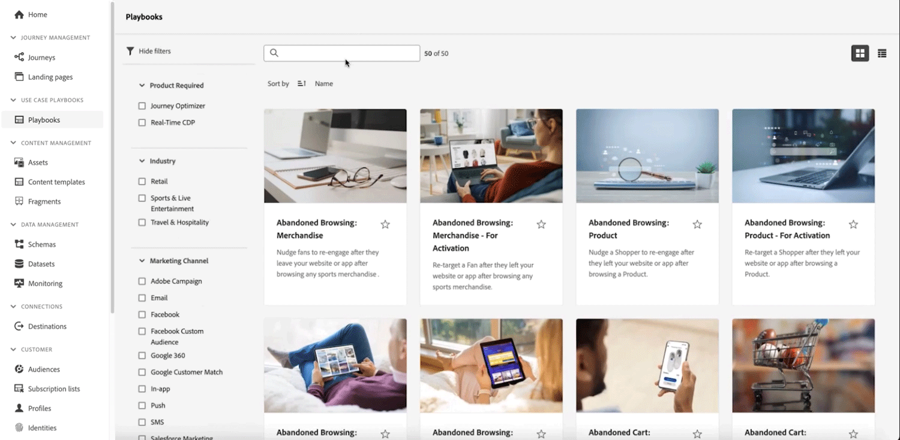

# Versionsinformation för 2024 {#release-notes-2024}

På den här sidan visas alla funktioner och förbättringar för [!DNL Journey Optimizer] släppt 2024.

## Versionsinformation maj 2024 {#may-2024}

**Releasedatum**: 21-22 maj 2024

### Nya funktioner {#e-features}

Den här versionen innehåller de nya funktionerna som beskrivs nedan.

<table>
<thead>
<tr>
<th><strong>Experience Decision - begränsad tillgänglighet</strong> </th>
</tr>
</thead>
<tbody>
<tr>
<td>

Experience Decision förenklar personaliseringen genom att erbjuda en centraliserad katalog med marknadsföringserbjudanden som kallas beslutsposter och en sofistikerad beslutsmotor. Den här motorn använder regler och rankningskriterier för att välja ut och presentera de mest relevanta beslutsobjekten för varje enskild person.

Dessa beslutsobjekt integreras smidigt i ett stort antal inkommande ytor via den nya kodbaserade upplevelsekanalen, som nu är tillgänglig inom Journey Optimizer-kampanjer. Policy för Experience Decision-beslut är endast tillgängliga för kodbaserade upplevelsekampanjer.

Experience Decision är för närvarande bara tillgängligt för en uppsättning organisationer (begränsad tillgänglighet). Kontakta din Adobe-representant för att få åtkomst.

Mer information finns i den <a href="../experience-decisioning/gs-experience-decisioning.md">detaljerade dokumentationen</a>.

</td>
</tr>
</tbody>
</table>

<table>
<thead>
<tr>
<th><strong>Personalisering av e-postyta - begränsad tillgänglighet</strong> </th>
</tr>
</thead>
<tbody>
<tr>
<td>

Nu kan du definiera dynamiska underdomäner och anpassade rubrikparametrar när du skapar e-postkanalsytor, vilket ger ökad flexibilitet och kontroll över e-postinställningarna.

Personalisering av e-postytor är för närvarande bara tillgängligt för en uppsättning organisationer (begränsad tillgänglighet). Kontakta din Adobe-representant för att få åtkomst.

Mer information finns i den <a href="../email/surface-personalization.md">detaljerade dokumentationen</a>.

</td>
</tr>
</tbody>
</table>

<!--table>
<thead>
<tr>
<th><strong>IP Warmup Workflow</strong> </th>
</tr>
</thead>
<tbody>
<tr>
<td>

If you are sending email on a brand new IP address, you can now easily perform IP warmup workflows directly from the user interface. Adobe Journey Optimizer offers a standardized and efficient way to warm up your IP adresses that follows the best practices for optimal deliverability.

For more information, refer to the <a href="../configuration/ip-warmup-gs.md">detailed documentation</a>.

</td>
</tr>
</tbody>
</table-->

<!--table>
<thead>
<tr>
<th><strong>Business rules - Beta</strong> </th>
</tr>
</thead>
<tbody>
<tr>
<td>

You can now create granular frequency capping rules, and apply them to different types of marketing communications through rule sets. This new capability lets you control how often your audiences receive a message by setting cross-channel rules, that automatically exclude over-solicited profiles from messages and actions.

Business rules capability is currently available as a beta. To join the beta program, contact your Adobe representative.

For more information, refer to the <a href="../configuration/business-rules.md">detailed documentation</a>.

</td>
</tr>
</tbody>
</table-->

<!--table>
<thead>
<tr>
<th><strong>Extended personalization data - Beta</strong> </th>
</tr>
</thead>
<tbody>
<tr>
<td>

You can now lookup and fetch data values within Adobe Experience Platform datasets, and use these values to build conditions in Adobe Journey Optimizer. You can leverage data from a lookup dataset when a relationship has been defined using an attribute inside of an array of objects. You can specify non-profile enabled datasets for lookup. Once enabled, you can use a profile attribute as a join key to the specified dataset to retrive further data for personalization.

This capability is currently available as a public beta.

</td>
</tr>
</tbody>
</table-->

### Förbättringar {#e-improvements}

Den här versionen innehåller de förbättringar som anges nedan.

**Experience Decision** (Begränsad tillgänglighet)

Från betaversion till den här versionen har följande förbättringar lagts till:

* **Experience Decision + Code-based experiences** - Nu kan ni utnyttja beslutsfunktionen i Experience för att använda beslutsobjekt i era kodbaserade kampanjer. Obs! Den kodbaserade upplevelsekanalen och Experience Decision är inte tillgängliga för organisationer som har köpt Adobe Healthcare Shield och tillägg till Privacy and Security Shield. [Läs mer](../code-based/get-started-code-based.md)
* **Kontextdata** - Nu kan du utnyttja kontextdata från Adobe Experience Platform i dina regler för beslutsfattande och rangordningsformler. [Läs mer](../experience-decisioning/context-data.md)
* **Ny behörighet** - Det finns nu en ny behörighet för att hantera Experience Decision Management-resursen. Det gör att ni kan hantera rättigheter för Experience Decision. [Läs mer](../experience-decisioning/gs-experience-decisioning.md)
* **Begränsningsregler** - Du kan nu lägga till flera regler för att sätta stopp för ett visst beslutsobjekt i Experience Decisioning. På så sätt kan ni öka kontrollen över hur erbjudandena skickas. [Läs mer](../experience-decisioning/items.md#capping)
* **Rapportering** - Nu kan du skapa anpassade rapportinstrumentpaneler för Experience Decision-kampanjer med [!DNL Customer Journey Analytics]. [Läs mer](../experience-decisioning/cja-reporting.md)

<!--**Decision Management**

* **Multi-rule support** - You can now add up to 10 capping rules for a given offer in Decision Management. This allows you to increase the level of control over the way offers are sent.
* **Audits** - The **Change log** tab allowing you to see all the changes that have been made to an offer or a decision has been removed. Changes related to offers and decisions can now be seen in the **Audits** menu. -->

**E-postkanal**

<!--
* **List-unsubscribe** - Following on the recent Gmail and Yahoo announcements for bulk senders, Journey Optimizer supports the "post/1-click" List-Unsubscribe option. Refer to the following pages: [Email opt-out management](../email/email-opt-out.md#unsubscribe-header) and [Configure email settings](../email/email-settings.md#list-unsubscribe)
-->

* **Skräddarsy poäng** (Beta) - Nu kan du kontrollera ditt innehåll som skräppost i en dedikerad skräppostrapport. Med SpamAssassin kan Adobe Journey Optimizer nu testa ditt e-postinnehåll och ge det ett poängvärde som anger om Internet-leverantörer eller postlådeleverantörer kommer att betrakta det som skräppost eller inte. [Läs mer](../content-management/spam-report.md)

  >[!AVAILABILITY]
  >
  >Funktionen finns för närvarande i betaversion och är endast tillgänglig för betatestare. Om du vill gå med i betaprogrammet kontaktar du Adobe.

<!--
**Audiences**

* The use of audiences and attributes from audience composition and custom upload (CSV file) is now available for use with Healthcare Shield or Privacy and Security Shield.-->

<!--**Personalization**

* **Expression fragment** - Expression fragments are now available for the **In-app channel**. [Read more](../personalization/use-expression-fragments.md)-->

**Resor**

<!--* **Merge policies** (Limited Availability)- Merge policies used by a journey are now visible and consistent throughout the journey.-->
* **Stöd för mTLS** - mTLS-autentisering stöds nu i anpassade åtgärder. Det krävs ingen ytterligare konfiguration i den anpassade åtgärden eller resan för att aktivera mTLS. Den sker automatiskt när en mTLS-aktiverad slutpunkt identifieras. [Läs mer](../action/about-custom-action-configuration.md#mtls-protocol-support)
* **Sök tabeller i händelser** - Du kan nu utnyttja data från en uppslagsdatauppsättning när en relation har definierats med ett attribut inuti en objektmatris. Uppslagsvärdena är tillgängliga i resor (villkor, anpassade åtgärder osv.) och personalisering av meddelanden. [Läs mer](../event/experience-event-schema.md#relationships_limitations)
* **Avancerad uttrycksredigerare i händelsekonfigurationen** (LA) - Du kan nu använda den avancerade uttrycksredigeraren när du konfigurerar en händelse, så att du kan definiera mer komplexa uttryck eller använda funktioner i händelse-id-villkoret. Den här funktionen lanseras i begränsad tillgänglighet för utvalda kunder. [Läs mer](../event/about-creating.md#adv-exp-editor)
* **Sammanfoga profiler** (LA) - Sammanslagningspolicyer som används av en resa är nu synliga och konsekventa under hela resan. Den här funktionen lanseras i begränsad tillgänglighet för utvalda kunder. [Läs mer](../building-journeys/journey-gs.md#merge-policies)

**Globalisering**

Som en del av vårt pågående arbete med att leverera en enhetlig användarupplevelse harmoniserar vi terminologin som används i Adobe Experience Cloud produkter och appar. Det här påverkar den tyska termen &quot;Titel&quot; som ändras till &quot;Label&quot; när det gäller namnet på ett objekt. Ändringarna införs stegvis i användargränssnittet och dokumentationen.

## Versionsinformation april 2024 {#apr-2024}

**Releasedatum**: 2 maj 2024

### Nya funktioner {#apr-features}

Den här versionen innehåller de nya funktionerna som beskrivs nedan.

<table>
<thead>
<tr>
<th><strong>Multimedia Message Service (MMS) - alla leverantörer</strong> </th>
</tr>
</thead>
<tbody>
<tr>
<td>

Med SMS-kanalen kan du nu förbättra kommunikationen genom att skicka MMS-meddelanden (Multimedia Message Service) som gör det möjligt att dela bilder, GIF eller videor med dina kunder. MMS finns nu endast i Sinch och finns nu även i Infobip och Twilio.

</td>
</tr>
</tbody>
</table>

<table>
<thead>
<tr>
<th><strong>Förbättrad resedesigner och liverapporter</strong> </th>
</tr>
</thead>
<tbody>
<tr>
<td>

I den här versionen finns ett förbättrat användargränssnitt på arbetsytan för resor och en mer intuitiv och effektiv användarupplevelse. Aktiviteterna blir tydligare och ger mer information om arbetsytan med färre klick.

Förutom den förbättrade utformningen av arbetsytan på resan introducerar vi möjligheten att se de senaste 24 timmarnas rapportvärden direkt i arbetsytan på resan. 

<strong>Anteckning</strong>: Dessa ändringar kommer gradvis att lanseras i alla miljöer från och med aprilversionen.

Mer information finns i den <a href="new-canvas.md">detaljerade dokumentationen</a>.

</td>
</tr>
</tbody>
</table>

<!-- table>
<thead>
<tr>
<th><strong>AI Assistant - Experience Variant Generation - Beta</strong> </th>
</tr>
</thead>
<tbody>
<tr>
<td>

Once you have created and personalized your message, take your content to the next level with the AI assistant. You can now use the AI assistant to optimize your message's impact by experimenting with different main titles, and images. Each variant is managed as a unique Treatment, to measure and compare which title effectively generates more clicks.

</td>
</tr>
</tbody>
</table-->

<!--table>
<thead>
<tr>
<th><strong>Email Surface Personalization - Private beta </strong> </th>
</tr>
</thead>
<tbody>
<tr>
<td>

You can now define dynamic subdomains and personalized header parameters when creating email channel surfaces, for increased flexibility and control over your email settings.

</td>
</tr>
</tbody>
</table-->

### Förbättringar {#apr-improvements}

Den här versionen innehåller de förbättringar som anges nedan.

<!--
* **Expression Fragments supported for Web and In-App**: Expression fragments are now available for the Web and In-app channels. 
-->

<!--
* **DULE for AJO Channel Surface**: It is now possible to apply a label on certain profile attributes to restrict their usage inside a channel surface through marketing actions.
-->

<!--
* **List-Unsubscribe updates**: Following on the recent Gmail and Yahoo announcements for bulk senders, Journey Optimizer supports the "post/1-click" List-Unsubscribe option. 
-->

**Konfiguration**

* Nu kan du välja en marknadsföringsåtgärd på kanalnivå. När de används på en yta används alla medgivandepolicyer som är kopplade till den marknadsföringsåtgärden för att ta hänsyn till kundernas önskemål. [Läs mer](../action/consent.md#surface-marketing-actions)
* Åtkomstkontrollen på objektnivå är nu tillgänglig för kanalytor. [Läs mer](../configuration/channel-surfaces.md#create-channel-surface)
* När du aktiverar avbrytande av prenumeration i en kanal kan du nu definiera medgivandenivån så att den överensstämmer med hur du hanterar samtycke från alla andra källor. [Läs mer](../email/email-settings.md#list-unsubscribe)

**Innehållshantering**

* Nu kan du simulera innehållsmallar för alla kanaler. [Läs mer](../content-management/content-templates.md#test-templates)

**Personalisering**

* Den nya **toInt** hjälpfunktionen är tillgänglig i uttrycksredigeraren. Du kan konvertera alla dessa typer (tal, double, int, long, float, short, byte, boolean, string) till ett heltal. [Läs mer](../personalization/functions/math.md#to-int)

## Versionsinformation mars 2024 {#mar-2024}

**Releasedatum**: 19-20 mars 2024

### Ny funktion {#mar-features}

Den här versionen innehåller de nya funktionerna som beskrivs nedan.

<table>
<thead>
<tr>
<th><strong>Kodbaserade upplevelser</strong> </th>
</tr>
</thead>
<tbody>
<tr>
<td>

Med den nya kodbaserade upplevelsekanalen kan du med Adobe Journey Optimizer utföra avancerad personalisering och testning för alla dina inkommande egenskaper, vilket möjliggör smidig leverans av skräddarsydda upplevelser över olika kontaktytor som webbappar, mobilappar, datorprogram, videokonsoler, tv-anslutna enheter, smarta tv-apparater, kioskdatorer, ATM-enheter, IoT-enheter med mera.

Viktiga funktioner:

<ul><li> Universell personalisering: utöka personaliserade upplevelser över alla kontaktytor för att säkerställa en sammanhängande och skräddarsydd användarresa</li>
<li>Detaljerad redigeringsprecision: redigera specifikt innehåll på enskilda platser i dina program eller webbsidor</li>
<li>Mångsidig implementering: stöd för implementeringsmetoder på serversidan, API-baserade eller SDK-baserade, för smidig integrering med utvecklingsmiljön.</li></ul>

Mer information finns i den <a href="../code-based/get-started-code-based.md">detaljerade dokumentationen</a>.

 
</tr>
</tbody>
</table>

### Förbättringar {#mar-improvements}

Den här versionen innehåller de förbättringar som anges nedan.

**Innehållsmallar**

* **Miniatyrbilder** - A **Stödrastervisning** läge är nu tillgängligt för innehållsmallar och visar miniatyrbilder för förbättrad visuell åtkomst. För närvarande stöds endast e-postmallar för HTML. [Läs mer](../content-management/content-templates.md#template-thumbnails)

  >[!AVAILABILITY]
  >
  >Den här funktionen lanseras i begränsad tillgänglighet (LA) för en liten grupp kunder.

**Resor**

Nya mellanliggande statusvärden har lagts till i reseutvecklingscykeln:

* **Publicering** status mellan **Utkast** status och **Live** status
* **Stoppar** status mellan **Live** status och **Stoppad** status
* **Aktiverar testläge** eller **Inaktiverar testläge** statusvärden mellan **Utkast** status och **Utkast (test)** status

När en resa befinner sig i ett mellanliggande tillstånd är den skrivskyddad. [Läs mer](../building-journeys/journey-gs.md#filter)

## Versionsinformation februari 2024 {#feb-2024}

**Releasedatum**: 21-22 feb 2024

### Nya funktioner{#feb-features}

Den här versionen innehåller de nya funktionerna som listas nedan.

<table>
<thead>
<tr>
<th><strong>Webb-meddelanden i appen</strong> </th>
</tr>
</thead>
<tbody>
<tr>
<td>

Nu kan du använda den nya meddelandefunktionen i Web In-App för att visa personaliserat innehåll direkt på webbplatser, via modala överläggsmeddelanden. Med den här funktionen kan ni interagera effektivt med webbbesökare och förbättra användarinteraktionen, kundlojaliteten och konverteringsgraden.  

Mer information finns i den <a href="../in-app/create-in-app-web.md">detaljerade dokumentationen</a>.  

</tr>
</tbody>
</table>

<table>
<thead>
<tr>
<th><strong>Mallar för flerkanalsinnehåll</strong> </th>
</tr>
</thead>
<tbody>
<tr>
<td>

Förutom e-post finns nu innehållsmallar för följande kanaler: push, in-app, SMS och Direct mail, där varje kanal har dedikerade malltyper. För E-post kan du nu välja innehållstypen, som gör att du kan spara ämnesraden som en del av din e-postmall.   

Mer information finns i den <a href="../content-management/content-templates.md">detaljerade dokumentationen</a>.  

 
</tr>
</tbody>
</table>

### Förbättringar {#feb-improvements}

Den här versionen innehåller de förbättringar som anges nedan.

**Publiker**

* **Utsändningslistor** - Varianter stöds nu när de använder **listor med startsidor**. Startadresserna får en kopia av alla varianter av samma budskap (t.ex. olika behandlingar av ett innehållsexperiment). [Läs mer](../configuration/seed-lists.md)

Tidigare som betaversion är följande förbättringar nu tillgängliga för alla användare:

* Nu kan du ange mål **målgrupper skapade genom målgruppssammansättning** och utnyttja anrikningsattributen i Journeys. [Läs mer](../building-journeys/read-audience.md)

* Nu kan du ange mål **målgrupper som överförts från en CSV-fil** på resor och kampanjer. [Läs mer](../audience/about-audiences.md#segments-in-journey-optimizer)

  >[!AVAILABILITY]
  >
  >* Användningen av målgrupper och attribut från målgruppssammansättning och anpassad uppladdning (CSV-fil) är för närvarande inte tillgänglig för användning med hälso- och sjukvårdsskölden eller skölden för skydd av privatlivet och säkerheten.
  >* The **målgruppsuppladdning från en CSV-fil** förbättring introduceras gradvis under flera dagar efter den första releasen. Vissa användare har omedelbar åtkomst, men andra kan uppleva en fördröjning innan den blir tillgänglig i sin miljö.

**Resor**

* **Filtrera dina resor** - Nu kan du använda **anpassade datum för att filtrera resorna** lager, utöver befintliga fördefinierade datumfilter. På så sätt kan du förfina listan genom att visa resor som skapats eller publicerats på ett visst datum, inom en viss månad, under ett helt år eller inom angivna tidsintervall. [Läs mer](../building-journeys/journey-gs.md#filter)
* **Anpassade åtgärder** - Du kan nu uppdatera **content-type** header. Den här nya **content-type** ska referera till JSON-innehåll. [Läs mer](../action/about-custom-action-configuration.md#url-configuration)
* **Konfiguration** - Attributet identityMap i stepEvents är nu förfyllt. Den primära identiteten definieras som &quot;primär = true&quot;. [Läs mer](../reports/sharing-field-list.md)
* **Användargränssnitt** - Den övre ribban på skärmar har omstrukturerats för en förbättrad upplevelse. Bland de olika uppdateringarna kan du lägga märke till att pennikonen som gör att du kan komma åt färgegenskaperna nu visas till vänster om det övre fältet, bredvid resans namn. [Läs mer](../building-journeys/journey-gs.md#change-properties)

**SMS-kanal**

* **Nyckelord för anmälan/avanmälan** - När du konfigurerar din SMS-kanal kan du nu anpassa **Nyckelord för deltagande och avanmälan** enligt dina önskemål. Journey Optimizer utlöser svaret baserat på dessa angivna nyckelord. [Läs mer](../sms/sms-configuration.md)

**Kampanjer**

* **API-utlösta kampanjer** - Den cURL-kod som genereras efter aktivering av en API-utlöst kampanj har förbättrats. Det innehåller nu alla personaliseringsvariabler (profil och kontext) som används i meddelandet. [Läs mer](../campaigns/api-triggered-campaigns.md#execute)

**Frekvensregler**

* Utöver E-post och push-meddelanden kan du nu skapa frekvensregler för SMS- och Direct Mail-kanaler. Frekvensreglerna exkluderar automatiskt överbegärda profiler från meddelanden och åtgärder när frekvensgränsen nås. [Läs mer](../configuration/frequency-rules.md)

<!--**Decision management**

* **Capping rules** - You can now add **multiple capping rules** for one offer. This allows you to increase the level of control over the way offers are sent.-->

## Versionsinformation januari 2024 {#jan-2024}

**Releasedatum**: 30-31 januari 2024

### Nya funktioner{#jan24-features}

Den här versionen innehåller de nya funktionerna som listas nedan.

<table>
<thead>
<tr>
<th><strong>Uppdateringar om leveransbarhet</strong> </th>
</tr>
</thead>
<tbody>
<tr>
<td>

Journey Optimizer stöder nu tekniken för DMARC-autentisering.

Från 1 februari 2024, Google och Yahoo! kräver att du har en DMARC-post för alla domäner som du använder för att skicka e-post till dem. Se till att du har ställt in DMARC-posten för alla underdomäner som du har delegerat eller delegerat till Adobe i Journey Optimizer.

Mer information finns i den <a href="../configuration/dmarc-record-update.md">detaljerade dokumentationen</a>.

 
</tr>
</tbody>
</table>

<table>
<thead>
<tr>
<th><strong>Spelböcker med användningsexempel</strong> </th>
</tr>
</thead>
<tbody>
<tr>
<td>

Använd en katalog med branschspecifika fallspelningsböcker i Real-Time CDP och Journey Optimizer för att ta itu med vanliga användningsområden som du kan använda Adobe Experience Platform och Adobe Journey Optimizer.

När du har valt den spelbok som bäst passar dina behov kan du aktivera den för att generera de resurser som behövs för att stödja ditt användningssätt, som resor, meddelanden, scheman eller segment, och anpassa dem till ditt schema för snabbare time-to-value.

Mer information finns i den <a href="../start/playbooks.md">detaljerade dokumentationen</a>.

 
</tr>
</tbody>
</table>

### Förbättringar {#jan24-improvements}

Den här versionen innehåller de förbättringar som anges nedan.

**Rapportering**

* **Nya domänbaserade uppdelningswidgetar** - Nya widgetar har lagts till för att förbättra kampanjrapporten och reserapporten. The **Studsa orsaker efter domän**, **Skickat och levererat av domäner**, **Öppnar och klickar per domän** och **Studsa och fel efter domän** widgetar ger en detaljerad beskrivning på domännivå för viktiga e-postleveranser och spårningsvärden. [Läs mer](../reports/channel-report.md)

**SMS-kanal**

* **Dubbel anmälan** - Arbetsflödet för dubbel anmälan för SMS garanterar att användare uttryckligen väljer att ta emot meddelanden när begäran initieras från sin enhet. Användarna initierar godkännandeprocessen genom att skicka ett inkommande SMS-meddelande. När de har bekräftat sitt samtycke skickas ett uppföljningsmeddelande med en begäran om slutlig verifiering. Om en användarprofil inte finns skapas den när den har bekräftats. [Läs mer](../sms/sms-configuration.md)

  Observera att den här funktionen är tillgänglig med SMS-leverantörer för Sinch och Infobip.

**Resor**

* **Varaktighet för reaktionshändelser** - Den maximala varaktighet som du kan definiera i **Reaktionshändelser** är nu 29 dagar i stället för 30. [Läs mer](../building-journeys/reaction-events.md)

<!--* **Date filters** - You can now use custom dates to filter the journeys inventory, in addition to the existing predefined date filters. This allows you to refine the list by displaying journeys published on a specific date, within a particular month, throughout an entire year, or within specified time ranges. [Learn more](../building-journeys/journey-gs.md#filter)-->

* **Läsa målgrupper**  - **Läs målgrupp** aktiviteten bygger nu på data för profilögonblicksbilder för batchsegment, som bara genereras en gång om dagen efter att det schemalagda dagliga batchjobbet har körts, och därför kommer data att uppdateras till det senaste dagliga batchjobbet. [Läs mer](../building-journeys/read-audience.md)

* **Fältgrupper** - Den här versionen åtgärdar ett problem som hindrade fältgrupper från att sparas i vissa fall.

* Stöd för `<listObject>` har ändrats i flera funktioner.

**Frekvensregler**

* **Frekvensgräns varje vecka** - Du kan nu ange maximalt antal meddelanden som skickas till en kundprofil per vecka, utöver månaden. Frekvensbegränsningen baseras på den valda kalenderperioden och återställs i början av motsvarande tidsram. [Läs mer](../configuration/frequency-rules.md#create-new-rule)

  >[!NOTE]
  >
  >Daglig frekvens finns också tillgänglig vid behov. Kontakta din Adobe-representant.

**Beslutsledning**

* **Frekvensbegränsning på Edge** - Räknaren för frekvensbegränsning har nu uppdaterats och är tillgänglig i ett beslut av Edge Decisioning API på mindre än 3 sekunder. [Läs mer](../offers/api-reference/offer-delivery-api/start-offer-delivery-apis.md)
