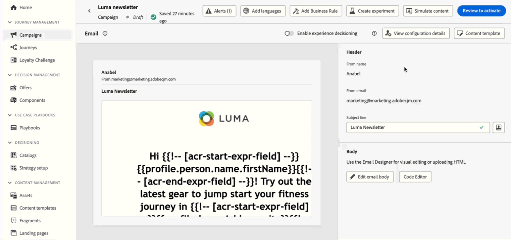
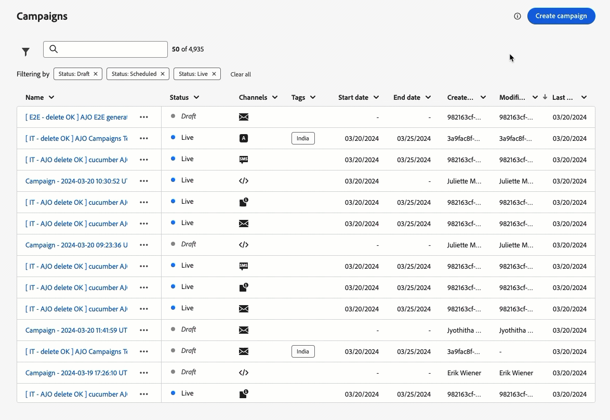

# Versionsinformation för 2024 {#release-notes-2024}

På den här sidan visas alla funktioner och förbättringar för [!DNL Journey Optimizer] som släpptes 2024.

## 24 oktober {#24-10-rn}

**Releasedatum**: 29-30 oktober 2024

### Nya funktioner {#24-10-features}

Den här versionen innehåller de nya funktionerna som beskrivs nedan:

<table>
<thead>
<tr>
<th><strong>Låsning av e-postinnehåll</strong> </th>
</tr>
</thead>
<tbody>
<tr>
<td>

Med Journey Optimizer kan du nu låsa innehåll i e-postmallar, antingen genom att låsa hela mallen eller specifika strukturer och komponenter. På så sätt kan ni förhindra oavsiktliga redigeringar och borttagningar, vilket ger er bättre kontroll över mallanpassning och förbättrar effektiviteten och tillförlitligheten i era e-postkampanjer.

Mer information finns i den <a href="../content-management/content-locking.md">detaljerade dokumentationen</a>.

Tillgänglig sedan 24 oktober 2024

</td>
</tr>
</tbody>
</table>

<table>
<thead>
<tr>
<th><strong>Kodbaserade upplevelser under resor</strong> </th>
</tr>
</thead>
<tbody>
<tr>
<td>

Med den kodbaserade upplevelsekanalen kan du med Adobe Journey Optimizer utföra avancerad personalisering och testning för alla dina inkommande egenskaper, vilket möjliggör smidig leverans av skräddarsydda upplevelser över olika kontaktytor som webbappar, mobilappar, datorprogram, videokonsoler, tv-anslutna enheter, smarta tv-apparater, kioskdatorer, ATM-enheter, IoT-enheter med mera. Den kodbaserade upplevelsekanalen är nu tillgänglig på arbetsytan för resan.

Mer information finns i den <a href="../code-based/create-code-based.md">detaljerade dokumentationen</a>.

Tillgänglig sedan 1 oktober 2024

</tr>
</tbody>
</table>

<table>
<thead>
<tr>
<th><strong>Webbupplevelser på resorna</strong> </th>
</tr>
</thead>
<tbody>
<tr>
<td>

Med webbkanalen kan Adobe Journey Optimizer personalisera webbupplevelsen som ni levererar till era kunder via inkommande webbresor. Webbkanalen är nu tillgänglig på arbetsytan.

Mer information finns i den <a href="../web/create-web.md">detaljerade dokumentationen</a>.

Tillgänglig sedan 1 oktober 2024

</tr>
</tbody>
</table>

<table>
<thead>
<tr>
<th><strong>Hantering av konflikter och prioritet (begränsad tillgänglighet)</strong> </th>
</tr>
</thead>
<tbody>
<tr>
<td>

I Journey Optimizer är det viktigt att hantera kampanjernas och resornas volym och tidpunkter för att undvika överväldigande kunder med alltför många interaktioner. Journey Optimizer har nu flera verktyg för konflikthantering och -prioritering. 
Mer information finns i den <a href="../conflict-prioritization/gs-conflict-prioritization.md">detaljerade dokumentationen</a>.

<ul><li><b>Resefrekvensbegränsning</b>: Nu kan du skapa regeluppsättningar som ska användas på dina resor, så att du kan begränsa antalet resor för en profil per dag, vecka eller månad, samt styra antalet samtidiga resor som körs samtidigt.</li>
<li><b>Prioritetspoäng</b>: Du kan nu tilldela en kampanj eller en resa ett prioritetspoäng, från 0 till 100. Ett högre tal anger en högre prioritet. När två kampanjer eller reseåtgärder använder samma kanalkonfiguration väljer Journey Optimizer den som har högst prioritet. Om kampanjerna har samma poäng väljs den kampanj som senast ändrades.</li>
<li><b>Visa potentiella konflikter</b>: Med en ny knapp för att visa potentiella konflikter under resor och kampanjer kan du nu identifiera överlappning med andra resor eller kampanjer, till exempel startdatum, målgrupp eller den valda kanalkonfigurationen.</li>
<li><b>Reseskiljeförfarande</b>: Med den här nya funktionen kan du prioritera de viktigaste kundresorna. Du kan skapa en regel som förhindrar inträde på en resa med lägre prioritet när en kund kvalificerar sig för en resa med högre prioritet.</li>
<li><b>Frekvensbegränsning per kommunikationstyp: </b>Med regeluppsättningar kan du nu ange detaljerade regler per kommunikationstyp (till exempel Försäljning, Kampanj) för att förhindra att kunder med liknande meddelanden överbelastas. Ni kan styra frekvensen över flera kanaler och automatiskt utesluta överbegärda profiler för att få en bättre kundupplevelse.</li></ul>

Funktioner för hantering av konflikter och prioriteter är tillgängliga i begränsad tillgänglighet för en viss kundgrupp. Observera att dessa funktioner gradvis kommer att lanseras för fler användare i framtiden. Kontakta ditt kontoteam om du vill bli tillagd i väntelistan för dessa funktioner.

</td>
</tr>
</tbody>
</table>

<table>
<thead>
<tr>
<th><strong>Integrering med Movable Ink och Adobe Journey Optimizer</strong> </th>
</tr>
</thead>
<tbody>
<tr>
<td>

Nu kan du integrera Movable Ink Da Vinci och Adobe Journey Optimizer. Med den nya integreringen kan du 

<ul><li>Utnyttja de kraftfulla funktionerna i Movable Inks Da Vinci-produkt för att sammanställa och personalisera e-postvarianter för gruppkampanjer</li>
<li>Snabba upp arbetsflödena för användare av Journey Optimizer med Da Vinci för framställning och Adobe Journey Optimizer för optimering och leverans</li>
<li>Optimera Da Vinci-modeller med Adobe-data.</li></ul>

Mer information finns i <a href="https://movableink.com/adobe-and-movable-ink">Dokumentationen för Da Vinci med flyttbara bläck</a>.

</tr>
</tbody>
</table>

Tidigare tillgängligt för en uppsättning organisationer (LA), men nu är följande funktioner tillgängliga för alla användare (GA):

<table>
<thead>
<tr>
<th><strong>Anpassning av e-postkonfiguration (allmän tillgänglighet) </strong> </th>
</tr>
</thead>
<tbody>
<tr>
<td>

För större flexibilitet och kontroll över e-postinställningarna kan du definiera dynamiska underdomäner och anpassade rubrikparametrar när du skapar e-postkanalskonfigurationer.

Mer information finns i den <a href="../email/surface-personalization.md">detaljerade dokumentationen</a>.

Tillgänglig sedan 23 oktober 2024

</tr>
</tbody>
</table>

<table>
<thead>
<tr>
<th><strong>Godkännanden av resor och kampanjer (allmän tillgänglighet)</strong> </th>
</tr>
</thead>
<tbody>
<tr>
<td>

Med godkännandepolicyer kan ni nu skapa en godkännandeprocess i Journey Optimizer som gör det möjligt för marknadsföringsteamen att se till att kampanjer och resor granskas och signeras av lämpliga intressenter innan de publiceras.

Mer information finns i den <a href="../test-approve/gs-approval.md">detaljerade dokumentationen</a>.

Tillgänglig sedan 22 oktober 2024

</td>
</tr>
</tbody>
</table>

<table>
<thead>
<tr>
<th><strong>Innehållsexperiment under resor (allmän tillgänglighet)</strong> </th>
</tr>
</thead>
<tbody>
<tr>
<td>

Adobe Journey Optimizer finns redan i kampanjer och stöder nu experiment på resor. Experimentella tester är randomiserade, vilket i samband med onlinetestning innebär att du exponerar vissa slumpmässigt utvalda användare för en viss variant av ett meddelande och en annan slumpmässigt utvald uppsättning användare för annan variation eller behandling. Efter exponering kan du mäta de resultatvärden du är intresserad av, som öppningar av e-post, prenumerationer eller inköp.

Mer information finns i den <a href="../content-management/content-experiment.md">detaljerade dokumentationen</a>.

</td>
</tr>
</tbody>
</table>

<table>
<thead>
<tr>
<th><strong>Beslut (allmän tillgänglighet)</strong> </th>
</tr>
</thead>
<tbody>
<tr>
<td>

Beslutsfattandet, som tidigare fanns tillgängligt för en uppsättning organisationer (LA) och som kallas Experience Decision, är nu tillgängligt för alla användare (GA), inklusive organisationer som har köpt Adobe Healthcare Shield eller tillägg till Privacy and Security Shield.

Beslutsfattandet förenklar personanpassningen genom att erbjuda en centraliserad katalog med marknadsföringserbjudanden som kallas Beslutsposter och en avancerad beslutsmotor. Den här motorn använder regler och rankningskriterier för att välja ut och presentera de mest relevanta beslutsobjekten för varje enskild person. Dessa beslutsobjekt integreras smidigt i ett stort antal inkommande ytor via den kodbaserade upplevelsekanalen.

Mer information finns i den <a href="../experience-decisioning/gs-experience-decisioning.md">detaljerade dokumentationen</a>.

</td>
</tr>
</tbody>
</table>

<table>
<thead>
<tr>
<th><strong>Flerspråkiga meddelanden under resor och kampanjer (allmän tillgänglighet)</strong> </th>
</tr>
</thead>
<tbody>
<tr>
<td>

Nu kan ni enkelt skapa innehåll på flera språk i en enda kampanj eller resa. Med den här funktionen kan ni växla mellan olika språk när ni redigerar kampanjer eller hela kundresan, effektivisera hela redigeringsprocessen och förbättra möjligheterna att effektivt hantera flerspråkigt innehåll.

Mer information finns i den <a href="../content-management/multilingual-gs.md">detaljerade dokumentationen</a>.

</td>
</tr>
</tbody>
</table>

<table>
<thead>
<tr>
<th><strong>Uppdaterad rapportupplevelse (allmän tillgänglighet)</strong> </th>
</tr>
</thead>
<tbody>
<tr>
<td>

Journey Optimizer rapportering är nu allmänt tillgänglig (GA) och har förbättrad interoperabilitet med Customer Journey Analytics-funktioner, standardiserad rapportering på båda plattformarna och förbättrad datakonsekvens och tillförlitlighet. Denna smidiga integrering mellan Journey Optimizer och Customer Journey Analytics ger en tydligare bild av prestandamätningarna, så att användarna kan fatta mer välgrundade beslut.

Med General Availability introduceras fyra nya funktioner: möjlighet att skapa enkla mätvärden, skapa och publicera målgrupper, ställa ad hoc-frågor med Insight Builder och schemalägga rapporter som automatiskt ska skickas till viktiga mottagare.

Mer information finns i den <a href="../reports/report-cja-manage.md">detaljerade dokumentationen</a>.

Viktigt: Den nuvarande rapportupplevelsen kommer att upphöra i januari 2025. Efter detta datum kommer den nya rapportupplevelsen att bli standard. Vi rekommenderar att du behärskar de nya funktionerna så att övergången blir smidig. <a href="../reports/report-gs-cja.md">Lär dig hur du kommer igång med Journey Optimizer nya rapporteringsgränssnitt</a>

Tillgänglig sedan 16 oktober 2024

</tr>
</tbody>
</table>

<!--The following capabilities are available to all customers in public beta:-->

<table>
<thead>
<tr>
<th><strong>Testa materialet med exempeldata (Beta)</strong> </th>
</tr>
</thead>
<tbody>
<tr>
<td>

Med reseoptimeraren kan du nu testa olika varianter av ditt innehåll genom att förhandsgranska det och skicka e-postkorrektur med exempelindata som överförts från en fil eller lagts till manuellt. Alla profilattribut som används i ditt innehåll för personalisering identifieras automatiskt av systemet och kan användas för dina tester för att skapa flera varianter.

Den här funktionen är för närvarande tillgänglig för alla kunder som en offentlig betaversion av meddelandekanalerna för e-post, SMS och push.

Mer information finns i den <a href="../test-approve/simulate-sample-input.md">detaljerade dokumentationen</a>.

</td>
</tr>
</tbody>
</table>

<table>
<thead>
<tr>
<th><strong>Använd Adobe Experience Platform-data för personalisering (Beta)</strong> </th>
</tr>
</thead>
<tbody>
<tr>
<td>

Utnyttja data från Adobe Experience Platform i personaliseringsredigeraren för att personalisera ert innehåll. För att göra detta måste datauppsättningar som behövs för sökpersonalisering först aktiveras via ett API-anrop. När du är klar kan du använda deras data för att anpassa ditt innehåll till [!DNL Journey Optimizer].

Den här funktionen är för närvarande tillgänglig för alla kunder som en betaversion.

Mer information finns i den <a href="../personalization/aep-data-perso.md">detaljerade dokumentationen</a>.

</td>
</tr>
</tbody>
</table>

### Förbättringar {#24-10-improvements}

Den här versionen innehåller de förbättringar som anges nedan.

**SMS-kanal**

* Nu kan du redigera eller ta bort en konfiguration för SMS API-kanal. [Läs mer](../sms/sms-configuration.md)

* Följande förbättringar har införts för att förbättra SMS-meddelandefunktionerna med Infobip och Sinch:

   * Ni kan definiera och hantera unika nyckelord för era SMS-kampanjer och resor, vilket möjliggör mer personaliserad och effektiv kommunikation.

   * Du kan skapa och leverera ett standard-SMS-meddelande när ett nyckelord inte känns igen.

  Läs mer om de här förbättringarna i SMS-konfigurationsdokumentationen för [Infobip](../sms/sms-configuration-infobip.md) och [Sinch](../sms/sms-configuration-sinch.md).

<!--**Journeys**-->

<!--* **Path experiment in journeys** - With the journey path experiment, you can now define and track key metrics for your journey paths, allowing you to measure the impact of your activities and to provide clearer insights into your performance. -->

<!--* **Max number of Live journeys** - Journey Optimizer now has a guardrail of 500 live journeys on production sandboxes, instead of 100. The number of live journeys is visible in the journey canvas. (DOCAC-10977) -->

**Webbkanal**

* **Icke-visuellt redigeringsläge för webbdesignern** - Som ett alternativ till Journey Optimizer webbdesigners kan du nu lägga till ändringar på webbplatsen med en icke-visuell redigerare. Du kan ange ändringarna manuellt utan att öppna sidorna i den visuella redigeraren. Det här icke-visuella redigeringsläget är användbart om du inte kan installera webbläsartillägg som Adobe Experience Cloud Visual Helper, som krävs för att läsa in sidorna i webbdesignern. [Läs mer](../web/web-non-visual-editor.md)

**Datauppsättningar**

* **Skicka och öppna händelser** - Med början 1 november 2024 har direktuppspelningssegmentering inte längre stöd för att skicka och öppna händelser från Journey Optimizer spårnings- och feedbackdatauppsättningar. Den här ändringen gäller för alla kundsandlådor och organisationer. [Läs mer](../data/datasets-ttl.md#segmentation-update)

* **Datauppsättning TTL (Time-to-live)** - Från och med februari 2025 introduceras ett TTL-skyddsprotokoll (time-to-live) i Journey Optimizer systemgenererade datauppsättningar i nya sandlådor och nya organ enligt följande:

   * 90 dagar för data i profilarkivet
   * 13 månader för data i sjön

  Den här ändringen kommer att introduceras i befintliga kundsandlådor i en efterföljande fas. [Läs mer](../data/datasets-ttl.md#ttl-guardrail)

* **Parametrar i anpassade åtgärder** - Tillgänglighetsdatum: 3 okt 2024 - NULL och valfria parametrar stöds nu i anpassade åtgärder. [Läs mer](../action/about-custom-action-configuration.md#define-the-message-parameters)

**Rapportering**

* **Nu finns det beslutsrapporter** som ger viktiga insikter i hur besökarna interagerar med upplevelserna. [Läs mer](../reports/campaign-global-report-cja-code.md#decisioning-kpis)

**Datastyrning och samtycke** - Tillgänglighetsdatum: 7 okt 2024

* **Tillämpning av datastyrningsprinciper** sker nu i alla kanaler i Journey Optimizer. För kunder som har skapat policyer i Adobe Experience Platform tillämpas dessa på marknadsföringsåtgärder som en del av kanalkonfigurationsinställningarna. När du skapar innehåll med en konfiguration kontrollerar systemet om det finns några datastyrningsfel i alla anpassningsfält. Om en överträdelse hittas går det inte att publicera en resa eller kampanj. [Läs mer](../action/action-privacy.md)

* **Egna medgivandeprinciper** gäller nu för alla Journey Optimizer-kanaler. Vid behov innan ett meddelande skickas eller en inkommande upplevelse levereras, kontrollerar systemet att användaren har gett sitt medgivande till att använda personaliseringsfält i innehållet som han/hon får. Om inget samtycke ges visas inte upplevelsen. [Läs mer](../action/consent.md)

  >[!NOTE]
  >
  >Samtyckespolicyer är för närvarande bara tillgängliga för organisationer som har köpt Adobe **Healthcare Shield** eller **Privacy and Security Shield** som tillägg.

**Publiker** - Tillgänglighetsdatum: 8 okt 2024

* När ni riktar er till en publik med CSV-filer kan ni nu använda attribut från filen i personaliseringsredigeraren och i regelbyggaren för resor och kampanjer. [Läs mer](../audience/about-audiences.md)

* Målgrupper och attribut från anpassad uppladdning (CSV-fil) kan nu användas med hälso- och sjukvårdsskölden eller skölden för skydd av privatlivet och säkerheten.

**Konfiguration** - Tillgänglighetsdatum: 23 okt 2024

* När du använder en anpassad konfiguration i en kampanj eller en resa kan du nu förhandsgranska ditt e-postinnehåll för att kontrollera om det finns potentiella fel med de dynamiska inställningar du har definierat. [Läs mer](../email/surface-personalization.md#check-configuration)

**Kodbaserad kanal**

* Innehållsmallar är nu tillgängliga. Ni kan snabba upp utvecklingen av era kodbaserade upplevelser med utgångspunkt i en innehållsmall som byggts av era utvecklare. Om du använder en innehållsmall kan marknadsföraren bara ändra vissa värden eller fält i stället för att disponera hela HTML- eller JSON-innehållets nyttolast. [Läs mer](../content-management/content-templates.md)

**Beslut**

* [Adobe Customer Journey Analytics](https://experienceleague.adobe.com/docs/analytics-platform/using/cja-overview/cja-overview.html?lang=sv-SE)-användare kan nu välja anpassade modeller att optimera när de ställer in en AI-modell i Decisioning (tidigare Experience Decisioning). På så sätt kan du till exempel optimera en anpassad&quot;inköps&quot;-tabell i stället för definierade begränsningar som klickfrekvens. [Läs mer](../experience-decisioning/ranking/ranking.md)

* När du lägger till en beslutspolicy till en kodbaserad kampanj med Beslutsfattning kan du nu välja enskilda beslutsposter manuellt, utöver urvalsstrategier. Dessutom kan du nu välja mer än ett reserverbjudande. Detta garanterar att det finns ett visst antal återlämnade beslutsposter. [Läs mer](../experience-decisioning/create-decision.md)

## 24 september {#24-9-rn}

<!--
>[!CAUTION]
>
>**Early release notes below are subject to change without prior notice until the release date**. Links, screens and updated documentation are published at the release date.
>
-->

**Releasedatum**: 24-26 september 2024

### Nya funktioner {#24-9-features}

Den här versionen innehåller de nya funktionerna som beskrivs nedan.

<table>
<thead>
<tr>
<th><strong>Innehållskort för mobilappar och webbplatser</strong> </th>
</tr>
</thead>
<tbody>
<tr>
<td>

Innehållskort är en ny funktion för digitala meddelanden i Adobe Journey Optimizer som levererar personaliserat och engagerande innehåll direkt inifrån mobilappar och webbplatser. Till skillnad från traditionella push-meddelanden integreras Content Cards smidigt i användargränssnittet med permanenta, icke-påträngande uppdateringar som förbättrar användarinteraktionen och upplevelsen.

Med den här funktionen kan marknadsförarna presentera relevant, multimediematerial för användarna, vilket ökar engagemanget och säkerställer att viktiga meddelanden syns utan att störa användarresan.

Mer information finns i den <a href="../../rp_landing_pages/content-card-landing-page.md">detaljerade dokumentationen</a>.

</td>
</tr>
</tbody>
</table>

<table>
<thead>
<tr>
<th><strong>Godkännanden av resor och kampanjer (LA)</strong> </th>
</tr>
</thead>
<tbody>
<tr>
<td>

Med godkännandepolicyer kan ni nu skapa en godkännandeprocess i Journey Optimizer som gör det möjligt för marknadsföringsteamen att se till att kampanjer och resor granskas och signeras av lämpliga intressenter innan de publiceras.

Godkännandepolicyer är för närvarande bara tillgängliga för en uppsättning organisationer (begränsad tillgänglighet). Kontakta din Adobe-representant för att få åtkomst.

Mer information finns i den <a href="../test-approve/gs-approval.md">detaljerade dokumentationen</a>.

</td>
</tr>
</tbody>
</table>

<!--<table>
<thead>
<tr>
<th><strong>Email Content Locking</strong> </th>
</tr>
</thead>
<tbody>
<tr>
<td>

Journey Optimizer now allows you to lock content in email templates, either by locking the entire template or specific structures and component. This allows you to prevent unintentional edits or deletions, giving you greater control over template customization, and improving the efficiency and reliability of your email campaigns.

For more information, refer to the <a href="../content-management/gs-generative.md">detailed documentation</a>.

</td>
</tr>
</tbody>
</table>-->

<table>
<thead>
<tr>
<th><strong>Kriterier för globalt utträde under resor</strong> </th>
</tr>
</thead>
<tbody>
<tr>
<td>

Nu definierar ni utträdeskriterier på resenivå. Genom att lägga till kriterier för att avsluta resan gör du så att profilerna avslutas så snart en händelse inträffar (t.ex. köp) eller så kvalificerar de sig för en viss målgrupp. Detta förhindrar användaren från att få ut mer information från resan.

Mer information finns i den <a href="../building-journeys/journey-properties.md#exit-criteria">detaljerade dokumentationen</a>.

</td>
</tr>
</tbody>
</table>

<table>
<thead>
<tr>
<th><strong>AI-assistenten</strong> </th>
</tr>
</thead>
<tbody>
<tr>
<td>

När du har skapat och personaliserat ditt budskap går du ett steg längre med AI Assistant i Journey Optimizer. Nu kan du använda AI Assistant för att optimera budskapets effekt genom att experimentera med olika huvudtitlar och bilder. Varje variant hanteras som en unik behandling för att mäta och jämföra vilken titel som effektivt genererar fler klick.

Fördjupa dig i en praktisk upplevelse med <a href="https://experienceleague.adobe.com/sv/apps/journey-optimizer/ai-assistant-content-accelerator">vår förhandsvisning av aktiva funktioner</a>, som är utformad för att du först ska kunna utforska dess funktioner och till fullo förstå dess funktioner.</a>.

Mer information finns i den <a href="../content-management/gs-generative.md">detaljerade dokumentationen</a>.

Tillgänglighetsdatum: 12 september 2024

</td>
</tr>
</tbody>
</table>

<table>
<thead>
<tr>
<th><strong>Inställningar för guidad kanal</strong> </th>
</tr>
</thead>
<tbody>
<tr>
<td>

Med Guided Channel Setup kan man automatisera och validera kanalkonfigurationen i en enhetlig upplevelse och därmed få igång Journey Optimizer snabbare. Denna nya guidade installation effektiviserar konfigurationen av kanaler så att alla nödvändiga resurser snabbt kan installeras och användas i Experience Platform, Journey Optimizer och Data Collection. På så sätt kan marknadsförings-, produkt- och datateknikteam snabbt börja med att skapa kampanjer och resor.

Mer information finns i den <a href="../configuration/set-mobile-config.md">detaljerade dokumentationen</a>.

Tillgänglighetsdatum: 3 september 2024

 
</td>
</tr>
</tbody>
</table>

### Förbättringar {#24-9-improvements}

Den här versionen innehåller de förbättringar som anges nedan.

**Publiker** - Tillgänglighetsdatum: 17 september 2024

**Licensanvändning** - Kontrollpanelen för licensanvändning visar nu de aktiveringsbara profilerna i stället för de engagerande målgrupperna. [Läs mer](../audience/license-usage.md)

**Innehållshantering**

Nu kan du exportera innehållsmallar och fragment mellan sandlådor. [Läs mer](../configuration/copy-objects-to-sandbox.md)

**Resor**

* **Förbättringar av Live-rapportering** - Live-rapportering ger insikter om hur dina resor har fungerat de senaste 24 timmarna. Vi har förbättrat den genom att lägga till nya mätvärden (som anges, utelämnas, tas bort och profiler av misstag) så att du får en djupare förståelse för användarbeteende och prestanda direkt från arbetsytan på resan. [Läs mer](../building-journeys/report-journey.md)

* (Tillgänglighetsdatum: 10 september) **Automatiska återförsök vid läsning av målgrupp** - återförsök används nu som standard på målgruppsinställda resor (med början från en **läsning** eller en **affärshändelse**) när exportjobbet hämtas. Om ett fel inträffar när exportjobbet skapas görs nya försök var 10:e minut (max 1 timme). Efter det kommer vi att betrakta det som ett misslyckande. Dessa typer av resor kan därför utföras upp till en timme efter den schemalagda tiden. [Läs mer](../building-journeys/read-audience.md#retries)

**E-postkanal**

* **Meddelanderubrik i skickat e-postmeddelande och BCC-kopia** - En ny rubrik har lagts till i alla e-postmeddelanden. Det här rubrikens värde är unikt för alla skickade e-postmeddelanden och för motsvarande BCC-e-postkopia. Den här rubriken lagras också i datamängderna för meddelanden och feedback från BCC, som gör att du kan stämma av BCC-kopian och motsvarande skickade e-postinformation. [Läs mer](../configuration/archiving-support.md#bcc-header)

* **Spam-poäng** (GA) - Nu kan du kontrollera ditt innehåll-spam-poäng i en dedikerad **Spam-rapport**. Med SpamAssassin kan Adobe Journey Optimizer nu testa ditt e-postinnehåll och ge det ett poängvärde som anger om Internet-leverantörer eller postlådeleverantörer kommer att betrakta det som skräppost eller inte. [Läs mer](../content-management/spam-report.md)

**SMS-kanal**

* **Redigera API-autentiseringsuppgifter** - Nu kan du redigera inställningar i SMS API-autentiseringsuppgifter, inklusive uppdateringar av nyckelord för avanmälan/utanmälan och svar.

**API:er**

* **API för kampanjsimulering** - Använd det här API:t för att utlösa ett korrekturjobb för en kampanj. Att skicka Campaign-korrektur är en asynkron process. API:t returnerar ett proofJobId som kan användas för att kontrollera korrekturets status. [Läs mer](https://developer.adobe.com/journey-optimizer-apis/references/simulations/){target="_blank"}

* (Tillgänglighetsdatum: 10 sept) [Adobe Journey Optimizer API-dokumentationen](https://developer.adobe.com/journey-optimizer-apis/references/simulations/){target="_blank"} är nu interaktiv. Utforska API-slutpunkterna direkt från dokumentationssidorna för att få omedelbar feedback och snabba upp den tekniska implementeringen.

  Alla API-referenssidor har nu en **Prova**-funktion som du kan använda för att testa API-anrop direkt på dokumentationswebbplatsen. [Hämta de nödvändiga autentiseringsuppgifterna](https://developer.adobe.com/journey-optimizer-apis/references/authentication/){target="_blank"} och börja använda funktionaliteten för att utforska API-slutpunkterna.

  Använd den här nya funktionen för att utforska förfrågningar och svar från API-slutpunkter, för att få omedelbar feedback och snabba upp den tekniska implementeringen.

  >[!CAUTION]
  >
  >Tänk på att du gör riktiga API-anrop till slutpunkterna när du använder den interaktiva API-funktionen på dokumentationssidorna. Tänk på detta när du experimenterar med produktionssandlådor.

**Konfiguration**

* **IP-beredskapsplaner** - Den här funktionen är nu tillgänglig för alla kunder, inklusive organisationer som har köpt Adobe **Healthcare Shield** eller **Privacy and Security Shield** som tillägg. [Läs mer](../configuration/ip-warmup-gs.md)

<!--
 Sign up for the [Adobe Journey Optimizer quarterly newsletter](https://www.adobe.com/subscription/Adobe_Journey_Optimizer_NL.html){target="_blank"} today, and receive the latest product updates, exciting stories, use cases, tips and more delivered directly to your inbox every quarter.-->

## Version 24 augusti {#8-2024}

**Releasedatum**: 20-21 augusti 2024

### Nya funktioner {#8-features}

Den här versionen innehåller de nya funktionerna som beskrivs nedan.

<!--
<table>
<thead>
<tr>
<th><strong>Content Cards (Limited Availability)</strong> </th>
</tr>
</thead>
<tbody>
<tr>
<td>

Content cards are a new digital messaging feature in Adobe Journey Optimizer that delivers personalized and engaging content directly within mobile apps and websites. Unlike traditional push notifications, Content Cards integrate seamlessly into the user interface, offering persistent, non-intrusive updates that enhance user interaction and experience.

This feature enables marketers to present relevant, rich media content to users, driving higher engagement and ensuring important messages are seen without disrupting the user journey.

 

Content card are currently only available for a set of organizations (Limited Availability). To gain access, contact your Adobe representative.

</td>
</tr>
</tbody>
</table-->

<table>
<thead>
<tr>
<th><strong>Förbättrade kanalkonfigurationer</strong> </th>
</tr>
</thead>
<tbody>
<tr>
<td>

De nuvarande kanalens ytfunktioner har förbättrats för att alla kanaler ska fungera enhetligt. Nu kan du definiera, hantera och återanvända dessa konfigurationer för alla kanaler, inklusive webb, meddelanden i appen eller kodbaserad upplevelse.

<ul>
<li>Kanalytorna har nu bytt namn till <strong>Kanalkonfigurationer</strong></li>
<li>Du kan bifoga en eller flera marknadsföringsåtgärder för att tillämpa policyer för samtycke och datastyrning</li>
<li>Åtkomstkontroll på objektnivå (OLAC) är nu tillgänglig för varje kanalkonfiguration, så att du kan bestämma vilka användare som får skapa eller använda specifika konfigurationer</li>
<li>För vissa kanaler kan du skapa kanalkonfigurationer för flera plattformar. Ett exempel här är en konfiguration för meddelandekanal i appen som kan användas för en webbsida, en iOS-app och en Android-app.</li>
</ul>

Mer information finns i den <a href="../configuration/channel-surfaces.md">detaljerade dokumentationen</a>.

</td>
</tr>
</tbody>
</table>

<table>
<thead>
<tr>
<th><strong>Anpassad åtgärd för Marketo Engage</strong> </th>
</tr>
</thead>
<tbody>
<tr>
<td>

Nu kan ni integrera Adobe Journey Optimizer med Adobe Marketo Engage för att skapa era B2B-användningsfall. Från en resa kan ni med en ny anpassad åtgärd importera data till Marketo.

Mer information finns i den <a href="../action/marketo-engage.md">detaljerade dokumentationen</a>.

</td>
</tr>
</tbody>
</table>

<table>
<thead>
<tr>
<th><strong>Variabler i innehållsfragment</strong> </th>
</tr>
</thead>
<tbody>
<tr>
<td>

Fragmentglobala variabler förbättrar befintliga fragmentfunktioner för att förbättra effektiviteten vid återanvändning av innehåll och skriptanvändning. Fragment kan nu använda indatavariabler och skapa utdatavariabler som kan användas i kampanj- och reseinnehåll. Fragment kan använda indatavariabler, både i <a href="../personalization/use-expression-fragments.md">uttrycksfragment</a> och <a href="../email/use-visual-fragments.md">visuella fragment</a>. Ni kan använda dessa variabler för att personalisera ert meddelandeinnehåll och era parametrar i era kampanjer och resor.

Mer information finns i den <a href="../personalization/use-expression-fragments.md">detaljerade dokumentationen</a>.

</td>
</tr>
</tbody>
</table>

<table>
<thead>
<tr>
<th><strong>Arbetsflöde för IP-förstärkning</strong> </th>
</tr>
</thead>
<tbody>
<tr>
<td>

Tillgänglighetsdatum: 13 aug

Om du skickar e-post till en helt ny IP-adress kan du nu enkelt utföra arbetsflöden för IP-värmare direkt från användargränssnittet. Adobe Journey Optimizer erbjuder ett standardiserat och effektivt sätt att värma upp era IP-adresser som följer de bästa metoderna för optimal leverans.

Mer information finns i den <a href="../configuration/ip-warmup-gs.md">detaljerade dokumentationen</a>.

</td>
</tr>
</tbody>
</table>

### Förbättringar {#8-improvements}

Den här versionen innehåller de förbättringar som anges nedan.

**Resor**

* I aktiviteten **Condition** anges nu **[!UICONTROL Time condition]** som standard per timme, från 00:00 till 12:00. [Läs mer](../building-journeys/condition-activity.md#time_condition)
* När du skapar dina resor visas nu varningar från knappen **Varningar** som anpassar sig till andra varningar och ger en konsekvent användarupplevelse. [Läs mer](../building-journeys/troubleshooting.md#activity-errors)
* Zoomalternativen i reseverktygsfältet har förbättrats: zoomprocenten är nu synlig och du kan nu enkelt återställa zoomvärdet.

**Skjut kanalen**

* Nu kan du lägga till dina push-autentiseringsuppgifter för mobilprogram i Adobe Journey Optimizer kanalkonfigurationsinställningar. Du behöver inte längre skapa en appyta i Adobe Experience Platform Data Collection.

### Andra ändringar {#changes}

**Rapportering**

* Nya användningsfall har lagts till i den nya rapportupplevelsen:

   * Skapa anpassade beräknade mätvärden direkt i dina rapporter.
   * Skapa en publik utifrån rapportdata.
   * Använd verktyget för experimentell analys för att enkelt skapa tabeller och visualiseringar från dina valda **[!UICONTROL Dimensions]** och **[!UICONTROL Metrics]**.

  Mer information finns i den [detaljerade dokumentationen](../reports/report-cja-manage.md).

## Version 24 juli {#24-7-2024}

**Releasedatum**: 30-31 juli 2024

### Nya funktioner {#27-4-features}

Den här versionen innehåller de nya funktionerna som listas nedan.

<table>
<thead>
<tr>
<th><strong>SMS-kanal med valfri leverantör (Beta)</strong> </th>
</tr>
</thead>
<tbody>
<tr>
<td>

Nu kan du konfigurera ytterligare SMS-leverantörer i Journey Optimizer, utöver standardleverantörerna Sinch, Infobip och Twilio.

Mer information finns i den <a href="../sms/sms-configuration-custom.md">detaljerade dokumentationen</a>.

</td>
</tr>
</tbody>
</table>

<table>
<thead>
<tr>
<th><strong>Federated Audience Composition (begränsad tillgänglighet)</strong> </th>
</tr>
</thead>
<tbody>
<tr>
<td>

Federated Audience Composition är nu tillgängligt i Adobe Journey Optimizer. Det gör det möjligt för företag att sammanställa data för bättre användning i olika användningsfall. Med detta nya tillvägagångssätt, som Adobe Real-Time Customer Data Platform- och/eller Adobe Journey Optimizer-användare, kan ni federera datauppsättningar direkt från ert befintliga datalager för att skapa och berika Adobe Experience Platform målgrupper och attribut i ett och samma system.

Mer information finns i den <a href="https://experienceleague.adobe.com/sv/docs/federated-audience-composition/using/home"  target="_blank">detaljerade dokumentationen</a>.

</td>
</tr>
</tbody>
</table>

### Förbättringar {#27-4-improvements}

Den här versionen innehåller de förbättringar som anges nedan.

**Resor**

* (Tillgänglighetsdatum: 8 juli) **Avancerad uttrycksredigerare i konfiguration av resthändelser** - Du kan nu utnyttja den avancerade uttrycksredigeraren när du konfigurerar en händelse, så att du kan definiera mer komplexa uttryck eller använda funktioner i händelse-ID-villkoret. [Läs mer](../event/about-creating.md#adv-exp-editor)

## 24 juni {#24-6-2024}

**Releasedatum**: 18-19 juni 2024

### Nya funktioner {#june-24-features}

Den här versionen innehåller de nya funktionerna som beskrivs nedan.

<table>
<thead>
<tr>
<th><strong>Anpassning av innehållsfragment</strong> </th>
</tr>
</thead>
<tbody>
<tr>
<td>

Nu kan du definiera specifika fält i ett fragment som kan redigeras när fragmentet läggs till i en kampanj eller resa. Detta gör det möjligt att justera innehållsdelar vid tiden för användningen, vilket ger flexibilitet att åsidosätta standardvärden med kontextspecifika detaljer.

Mer information finns i den <a href="../content-management/customizable-fragments.md">detaljerade dokumentationen</a>.

</td>
</tr>
</tbody>
</table>

<table>
<thead>
<tr>
<th><strong>Rapportering med Customer Journey Analytics (begränsad tillgänglighet)</strong> </th>
</tr>
</thead>
<tbody>
<tr>
<td>

Journey Optimizer rapportering har förbättrad interoperabilitet med Customer Journey Analytics funktioner, standardiserad rapportering på båda plattformarna och förbättrad datakonsekvens och tillförlitlighet. Denna smidiga integrering mellan Journey Optimizer och Customer Journey Analytics ger en tydligare bild av prestandamätningarna, så att användarna kan fatta mer välgrundade beslut.

Mer information finns i den <a href="../reports/report-gs-cja.md">detaljerade dokumentationen</a>.

</td>
</tr>
</tbody>
</table>

<table>
<thead>
<tr>
<th><strong>AI Assistant i Adobe Journey Optimizer</strong> </th>
</tr>
</thead>
<tbody>
<tr>
<td>

AI Assistant är en gränssnittsfunktion som du kan använda för att navigera bland och förstå Adobe-koncept och få driftsinsikter för just din miljö. Det finns i flera Adobe Experience Cloud-produkter, inklusive Adobe Journey Optimizer.

Mer information finns i den <a href="../start/ai-features.md#ai-assistant">detaljerade dokumentationen</a>.

</td>
</tr>
</tbody>
</table>

<table>
<thead>
<tr>
<th><strong>Flerspråkiga meddelanden under resor och kampanjer (begränsad tillgänglighet)</strong> </th>
</tr>
</thead>
<tbody>
<tr>
<td>

Nu kan ni enkelt skapa innehåll på flera språk i en enda kampanj eller resa. Med den här funktionen kan ni växla mellan olika språk när ni redigerar kampanjer eller hela kundresan, effektivisera hela redigeringsprocessen och förbättra möjligheterna att effektivt hantera flerspråkigt innehåll.

Flerspråkigt innehåll är för närvarande endast tillgängligt för en uppsättning organisationer (begränsad tillgänglighet). Kontakta din Adobe-representant för att få åtkomst.

</td>
</tr>
</tbody>
</table>

<table>
<thead>
<tr>
<th><strong>Experimentera med resor (begränsad tillgänglighet)</strong> </th>
</tr>
</thead>
<tbody>
<tr>
<td>

Adobe Journey Optimizer finns redan i kampanjer och stöder nu experiment på resor. Experimentella tester är randomiserade, vilket i samband med onlinetestning innebär att du exponerar vissa slumpmässigt utvalda användare för en viss variant av ett meddelande och en annan slumpmässigt utvald uppsättning användare för annan variation eller behandling. Efter exponering kan du mäta de resultatvärden du är intresserad av, som öppningar av e-post, prenumerationer eller inköp.

Experimentation i resor är för närvarande endast tillgängligt för en uppsättning organisationer (begränsad tillgänglighet). Kontakta din Adobe-representant för att få åtkomst.

</td>
</tr>
</tbody>
</table>

<!--table>
<thead>
<tr>
<th><strong>Extended personalization data - Beta</strong> </th>
</tr>
</thead>
<tbody>
<tr>
<td>

You can now lookup and fetch data values within Adobe Experience Platform datasets, and use these values to build conditions in Adobe Journey Optimizer. You can leverage data from a lookup dataset when a relationship has been defined using an attribute inside of an array of objects. You can specify non-profile enabled datasets for lookup. Once enabled, you can use a profile attribute as a join key to the specified dataset to retrive further data for personalization.

This capability is currently available as a public beta.

</td>
</tr>
</tbody>
</table-->

### Förbättringar {#june24-improvements}

Den här versionen innehåller de förbättringar som anges nedan.

#### Beslutshantering

* **Stöd för flera regler i beslutshantering** - Du kan nu lägga till upp till 10 appningsregler för ett visst erbjudande i beslutshantering. På så sätt kan ni öka kontrollen över hur erbjudandena skickas. [Läs mer](../offers/offer-library/add-constraints.md#capping)

<!--* **Audits** - The **Change log** tab allowing you to see all the changes that have been made to an offer or a decision has been removed. Changes related to offers and decisions can now be seen in the **Audits** menu. -->

#### Innehållsfragment

>[!AVAILABILITY]
>
>Observera att dessa förbättringar kommer att introduceras gradvis under flera dagar efter den första versionen. Vissa användare har omedelbar åtkomst, men andra kan uppleva en fördröjning innan den blir tillgänglig i deras miljöer.

* Fragment kan nu redigeras och ändringar kan spridas över alla liveresor och -kampanjer där de används.
* Nya statusar för innehållsfragment har introducerats: **Utkast**, **Live**, **Publicering** och **Arkiverat**.
* Om du vill använda ett fragment i en resa eller kampanj måste det nu ha statusen **Live**. Ett nytt steg har lagts till i processen för att skapa fragment, vilket gör att fragmentet kan publiceras och göras tillgängligt för användning under resor och kampanjer. Observera att fragmentpublicering kräver en ny behörighet.

  **VARNING** - Sedan statusvärdena **Utkast** och **Live** introducerades i Journey Optimizer Juniversion har alla fragment som skapats före den här versionen statusen **Utkast**, även om de används under en resa eller kampanj. Om du ändrar något i dessa fragment måste du [publicera dem](../content-management/create-fragments.md#publish) för att göra dem&quot;Live&quot; och sprida ändringarna till associerade kampanjer och resor. Ni måste också skapa en ny resa/kampanjversion och publicera den.

Läs mer i dokumentationen för [innehållsfragment](../content-management/fragments.md).

#### Resor

* Den globala tidsgränsen för resor har utökats till 91 dagar. [Läs mer](../building-journeys/journey-properties.md#global_timeout)

  Alla nya resor som skapas kommer att få den här nya tidsgränsen angiven. Läs [Frågor och svar](../building-journeys/journey-properties.md#timeout-faq) om du vill veta mer. Observera att dessa ändringar kommer att införas gradvis under juni månad.

* Adobe Journey Optimizer har nu stöd för förfrågningar om borttagning/åtkomst av sekretess samt livscykelhantering av data. [Läs mer](../privacy/requests.md)
* Du kan nu ändra storlek på kolumnerna i kundresans lager.
  <!--* **Advanced expression editor in Event configuration** is now GA - You can now leverage the advanced expression editor while configuring an event, allowing you to define more complex expressions or use functions in the event id condition. This capability is released in Limited Availability for selected customers. [Read more](../event/about-creating.md)-->
* **Sammanslagningsprinciper** är nu GA - Sammanslagningsprinciper som används av en resa är nu synliga och konsekventa under hela resan. [Läs mer](../building-journeys/journey-properties.md#merge-policies)

#### Kampanjer

* När du skapar en kampanj i Adobe Journey Optimizer kan du nu välja kampanjtyp (schemalagd eller utlöst) i en ny modal. [Läs mer](../campaigns/create-campaign.md)

#### E-postkanal

* **List-unsubscribe** - Efter de senaste Gmail- och Yahoo-meddelandena för massavsändare stöder Journey Optimizer alternativet &quot;post/1-click&quot; List-Unsubscribe. Se följande sidor: [Hantera avanmälan via e-post](../email/email-opt-out.md#unsubscribe-header) och [Konfigurera e-postinställningar](../email/email-settings.md#list-unsubscribe).

  **Obs!** - Som standard är alternativet för att avbryta prenumerationen aktiverat för alla nya kanalytor. För befintliga ytor är som standard alternativet för att avbryta prenumeration av URL-adress med ett klick i kanalytans inställningar avmarkerat. Om du använde en avanmälnings-URL med ett klick i e-postmeddelandets brödtext tidigare är den här inställningen fortfarande giltig. Om du markerar alternativet för att avbryta prenumerationen med ett klick i inställningarna för kanalens yta, använder Adobe Journey Optimizer den standardgenererade URL-adressen för att avbryta prenumerationen med ett klick i inställningarna för kanalens yta.

#### SMS-kanal

* Nu kan du lägga till unika korta koder för varje sandlåda med en enda API-konfiguration, vilket gör processen effektivare och smidigare. [Läs mer](../sms/sms-configuration.md)

* Efter skapandet maskeras fältet **API-token** på sidan **API-autentiseringsinformation**.

<!--* You can now modify existing SMS configurations.-->

#### Kanal i appen

<!--* **Expression fragment** - Expression fragments are now available for the **In-app channel**. [Read more](../personalization/use-expression-fragments.md)-->

* Nu kan du använda Edge Delivery plugin för att få information som behövs för att förstå och felsöka dina inkommande implementeringar. [Läs mer om Edge Delivery-vyn](https://experienceleague.adobe.com/sv/docs/experience-platform/assurance/view/edge-delivery){target="_blank"}.

#### Direktpostkanal

* Direktreklamkanalen är nu tillgänglig för alla kunder. [Läs mer](../direct-mail/get-started-direct-mail.md)

## Version 24 maj {#may-2024}

**Releasedatum**: 21-22 maj 2024

### Nya funktioner {#e-features}

Den här versionen innehåller de nya funktionerna som beskrivs nedan.

<table>
<thead>
<tr>
<th><strong>Experience Decision - begränsad tillgänglighet</strong> </th>
</tr>
</thead>
<tbody>
<tr>
<td>

Experience Decision förenklar personaliseringen genom att erbjuda en centraliserad katalog med marknadsföringserbjudanden som kallas beslutsposter och en sofistikerad beslutsmotor. Den här motorn använder regler och rankningskriterier för att välja ut och presentera de mest relevanta beslutsobjekten för varje enskild person.

Dessa beslutsobjekt integreras smidigt i ett stort antal inkommande konfigurationer via den nya kodbaserade upplevelsekanalen, som nu är tillgänglig inom Journey Optimizer-kampanjer. Policy för Experience Decision-beslut är endast tillgängliga för kodbaserade upplevelsekampanjer.

Experience Decision är för närvarande bara tillgängligt för en uppsättning organisationer (begränsad tillgänglighet). Kontakta din Adobe-representant för att få åtkomst.

Mer information finns i den <a href="../experience-decisioning/gs-experience-decisioning.md">detaljerade dokumentationen</a>.

</td>
</tr>
</tbody>
</table>

<table>
<thead>
<tr>
<th><strong>Anpassning av e-postkonfiguration - begränsad tillgänglighet</strong> </th>
</tr>
</thead>
<tbody>
<tr>
<td>

Nu kan du definiera dynamiska underdomäner och anpassade rubrikparametrar när du skapar e-postkanalskonfigurationer, vilket ger större flexibilitet och kontroll över e-postinställningarna.

Anpassning av e-postkonfiguration är för närvarande bara tillgängligt för en uppsättning organisationer (begränsad tillgänglighet). Kontakta din Adobe-representant för att få åtkomst.

Mer information finns i den <a href="../email/surface-personalization.md">detaljerade dokumentationen</a>.

</td>
</tr>
</tbody>
</table>

<!--table>
<thead>
<tr>
<th><strong>IP Warmup Workflow</strong> </th>
</tr>
</thead>
<tbody>
<tr>
<td>

If you are sending email on a brand new IP address, you can now easily perform IP warmup workflows directly from the user interface. Adobe Journey Optimizer offers a standardized and efficient way to warm up your IP adresses that follows the best practices for optimal deliverability.

For more information, refer to the <a href="../configuration/ip-warmup-gs.md">detailed documentation</a>.

</td>
</tr>
</tbody>
</table-->

<!--table>
<thead>
<tr>
<th><strong>Business rules - Beta</strong> </th>
</tr>
</thead>
<tbody>
<tr>
<td>

You can now create granular frequency capping rules, and apply them to different types of marketing communications through rule sets. This new capability lets you control how often your audiences receive a message by setting cross-channel rules, that automatically exclude over-solicited profiles from messages and actions.

Business rules capability is currently available as a beta. To join the beta program, contact your Adobe representative.

For more information, refer to the <a href="../configuration/business-rules.md">detailed documentation</a>.

</td>
</tr>
</tbody>
</table-->

<!--table>
<thead>
<tr>
<th><strong>Extended personalization data - Beta</strong> </th>
</tr>
</thead>
<tbody>
<tr>
<td>

You can now lookup and fetch data values within Adobe Experience Platform datasets, and use these values to build conditions in Adobe Journey Optimizer. You can leverage data from a lookup dataset when a relationship has been defined using an attribute inside of an array of objects. You can specify non-profile enabled datasets for lookup. Once enabled, you can use a profile attribute as a join key to the specified dataset to retrive further data for personalization.

This capability is currently available as a public beta.

</td>
</tr>
</tbody>
</table-->

### Förbättringar {#e-improvements}

Den här versionen innehåller de förbättringar som anges nedan.

**Experience Decision** (begränsad tillgänglighet)

Från betaversion till den här versionen har följande förbättringar lagts till:

* **Experience Decision + Code-based experiences** - Nu kan du använda funktionen Experience Decision för att använda beslutsobjekt i dina kodbaserade kampanjer. Obs! Den kodbaserade upplevelsekanalen och Experience Decision är inte tillgängliga för organisationer som har köpt Adobe Healthcare Shield och tillägg till Privacy and Security Shield. [Läs mer](../code-based/get-started-code-based.md)
* **Kontextdata** - Nu kan du utnyttja kontextdata från Adobe Experience Platform i dina beslutsregler och rangordningsformler. [Läs mer](../experience-decisioning/context-data.md)
* **Ny behörighet** - Det finns nu en ny behörighet för att hantera upplevelsebeslut för beslutshanteringsresursen. Det gör att ni kan hantera rättigheter för Experience Decision. [Läs mer](../experience-decisioning/gs-experience-decisioning.md)
* **Begränsningsregler** - Nu kan du lägga till flera appningsregler för ett visst beslutsobjekt i Experience Decision. På så sätt kan ni öka kontrollen över hur erbjudandena skickas. [Läs mer](../experience-decisioning/items.md#capping)
* **Rapportering** - Nu kan du skapa anpassade rapportinstrumentpaneler för Experience Decision-kampanjer med [!DNL Customer Journey Analytics]. [Läs mer](../experience-decisioning/cja-reporting.md)

<!--**Decision Management**

* **Multi-rule support** - You can now add up to 10 capping rules for a given offer in Decision Management. This allows you to increase the level of control over the way offers are sent.
* **Audits** - The **Change log** tab allowing you to see all the changes that have been made to an offer or a decision has been removed. Changes related to offers and decisions can now be seen in the **Audits** menu. -->

**E-postkanal**

<!--
* **List-unsubscribe** - Following on the recent Gmail and Yahoo announcements for bulk senders, Journey Optimizer supports the "post/1-click" List-Unsubscribe option. Refer to the following pages: [Email opt-out management](../email/email-opt-out.md#unsubscribe-header) and [Configure email settings](../email/email-settings.md#list-unsubscribe)
-->

* **Spam-poäng** (Beta) - Nu kan du kontrollera ditt innehåll-spam-poäng i en dedikerad spam-rapport. Med SpamAssassin kan Adobe Journey Optimizer nu testa ditt e-postinnehåll och ge det ett poängvärde som anger om Internet-leverantörer eller postlådeleverantörer kommer att betrakta det som skräppost eller inte. [Läs mer](../content-management/spam-report.md)

  >[!AVAILABILITY]
  >
  >Funktionen finns för närvarande i betaversion och är endast tillgänglig för betatestare. Kontakta din Adobe-representant om du vill delta i betaprogrammet.

<!--
**Audiences**

* The use of audiences and attributes from audience composition and custom upload (CSV file) is now available for use with Healthcare Shield or Privacy and Security Shield.-->

<!--**Personalization**

* **Expression fragment** - Expression fragments are now available for the **In-app channel**. [Read more](../personalization/use-expression-fragments.md)-->

**Resor**

<!--* **Merge policies** (Limited Availability)- Merge policies used by a journey are now visible and consistent throughout the journey.-->
* **mTLS-stöd** - mTLS-autentisering stöds nu i anpassade åtgärder. Det krävs ingen ytterligare konfiguration i den anpassade åtgärden eller resan för att aktivera mTLS. Den sker automatiskt när en mTLS-aktiverad slutpunkt identifieras. [Läs mer](../action/about-custom-action-configuration.md#mtls-protocol-support)
* **Uppslagstabeller i händelser** - Nu kan du utnyttja data från en uppslagsdatauppsättning när en relation har definierats med ett attribut inuti en objektmatris. Uppslagsvärdena är tillgängliga i resor (villkor, anpassade åtgärder osv.) och meddelandepersonalisering. [Läs mer](../event/experience-event-schema.md#relationships_limitations)
* **Avancerad uttrycksredigerare i händelsekonfiguration** (LA) - Du kan nu utnyttja den avancerade uttrycksredigeraren när du konfigurerar en händelse, så att du kan definiera mer komplexa uttryck eller använda funktioner i händelse-ID-villkoret. Den här funktionen lanseras i begränsad tillgänglighet för utvalda kunder. [Läs mer](../event/about-creating.md#adv-exp-editor)
* **Sammanslagningsprinciper** (LA) - Sammanslagningsprinciper som används av en resa är nu synliga och konsekventa under hela resan. Den här funktionen lanseras i begränsad tillgänglighet för utvalda kunder. [Läs mer](../building-journeys/journey-properties.md#merge-policies)

**Globalisering**

Som en del av vårt pågående arbete med att leverera en enhetlig användarupplevelse harmoniserar vi terminologin som används i Adobe Experience Cloud produkter och appar. Det här påverkar den tyska termen &quot;Titel&quot; som ändras till &quot;Label&quot; när det gäller namnet på ett objekt. Ändringarna införs stegvis i användargränssnittet och dokumentationen.

## 24 april {#apr-2024}

**Releasedatum**: 2 maj 2024

### Nya funktioner {#apr-features}

Den här versionen innehåller de nya funktionerna som beskrivs nedan.

<table>
<thead>
<tr>
<th><strong>Multimedia Message Service (MMS) - alla leverantörer</strong> </th>
</tr>
</thead>
<tbody>
<tr>
<td>

Med SMS-kanalen kan du nu förbättra kommunikationen genom att skicka MMS-meddelanden (Multimedia Message Service) som gör det möjligt att dela bilder, GIF-filer eller videor med dina kunder. MMS finns nu endast i Sinch och finns nu även i Infobip och Twilio.

</td>
</tr>
</tbody>
</table>

<table>
<thead>
<tr>
<th><strong>Förbättrad Journey Designer och liverapporter</strong> </th>
</tr>
</thead>
<tbody>
<tr>
<td>

I den här versionen finns ett förbättrat användargränssnitt på arbetsytan för resor och en mer intuitiv och effektiv användarupplevelse. Aktiviteterna blir tydligare och ger mer information om arbetsytan med färre klick.

Förutom den förbättrade utformningen av arbetsytan på resan introducerar vi möjligheten att se de senaste 24 timmarnas rapportvärden direkt i arbetsytan på resan. 

<strong>Obs!</strong> De här ändringarna kommer gradvis att lanseras i alla miljöer från och med aprilversionen.

Mer information finns i den <a href="new-canvas.md">detaljerade dokumentationen</a>.

</td>
</tr>
</tbody>
</table>

<!-- table>
<thead>
<tr>
<th><strong>AI Assistant - Experience Variant Generation - Beta</strong> </th>
</tr>
</thead>
<tbody>
<tr>
<td>

Once you have created and personalized your message, take your content to the next level with AI Assistant. You can now use AI Assistant to optimize your message's impact by experimenting with different main titles, and images. Each variant is managed as a unique Treatment, to measure and compare which title effectively generates more clicks.

</td>
</tr>
</tbody>
</table-->

<!--table>
<thead>
<tr>
<th><strong>Email Surface Personalization - Private beta </strong> </th>
</tr>
</thead>
<tbody>
<tr>
<td>

You can now define dynamic subdomains and personalized header parameters when creating email channel configurations, for increased flexibility and control over your email settings.

</td>
</tr>
</tbody>
</table-->

### Förbättringar {#apr-improvements}

Den här versionen innehåller de förbättringar som anges nedan.

<!--
* **Expression Fragments supported for Web and In-App**: Expression fragments are now available for the Web and In-app channels. 
-->

<!--
* **DULE for AJO channel configuration**: It is now possible to apply a label on certain profile attributes to restrict their usage inside a channel configuration through marketing actions.
-->

<!--
* **List-Unsubscribe updates**: Following on the recent Gmail and Yahoo announcements for bulk senders, Journey Optimizer supports the "post/1-click" List-Unsubscribe option. 
-->

**Konfiguration**

* Nu kan du välja en marknadsföringsåtgärd på kanalkonfigurationsnivå. När de används i en konfiguration används alla medgivandeprinciper som är kopplade till den marknadsföringsåtgärden för att ta hänsyn till kundernas önskemål. [Läs mer](../action/consent.md#surface-marketing-actions)
* Åtkomstkontroll på objektnivå är nu tillgänglig för kanalkonfigurationer. [Läs mer](../configuration/channel-surfaces.md#create-channel-surface)
* När du aktiverar avbrytande av prenumerationslista i en kanalkonfiguration kan du nu definiera medgivandenivån så att den anpassas till hur du hanterar samtycke från alla andra källor. [Läs mer](../email/email-settings.md#list-unsubscribe)

**Innehållshantering**

* Nu kan du simulera innehållsmallar för alla kanaler. [Läs mer](../content-management/content-templates.md#video-templates)

**Personalization**

* Den nya hjälpfunktionen **toInt** är tillgänglig i uttrycksredigeraren. Du kan konvertera alla dessa typer (tal, double, int, long, float, short, byte, boolean, string) till ett heltal. [Läs mer](../personalization/functions/math.md#to-int)

## Mars 24-utgåvan {#mar-2024}

**Releasedatum**: 19-20 mars 2024

### Ny funktion {#mar-features}

Den här versionen innehåller de nya funktionerna som beskrivs nedan.

<table>
<thead>
<tr>
<th><strong>Kodbaserade upplevelser</strong> </th>
</tr>
</thead>
<tbody>
<tr>
<td>

Med den nya kodbaserade upplevelsekanalen kan du med Adobe Journey Optimizer utföra avancerad personalisering och testning för alla dina inkommande egenskaper, vilket möjliggör smidig leverans av skräddarsydda upplevelser över olika kontaktytor som webbappar, mobilappar, datorprogram, videokonsoler, tv-anslutna enheter, smarta tv-apparater, kioskdatorer, ATM-enheter, IoT-enheter med mera.

Viktiga funktioner:

<ul><li> Universell personalisering: utöka personaliserade upplevelser över alla kontaktytor för att säkerställa en sammanhängande och skräddarsydd användarresa</li>
<li>Detaljerad redigeringsprecision: redigera specifikt innehåll på enskilda platser i dina program eller webbsidor</li>
<li>Mångsidig implementering: stöd för implementeringsmetoder på serversidan, API-baserade eller SDK-baserade, för smidig integrering med utvecklingsmiljön.</li></ul>

Mer information finns i den <a href="../code-based/get-started-code-based.md">detaljerade dokumentationen</a>.

 
</tr>
</tbody>
</table>

### Förbättringar {#mar-improvements}

Den här versionen innehåller de förbättringar som anges nedan.

**Innehållsmallar**

* **Miniatyrbilder** - **Stödrastervyn** är nu tillgänglig för innehållsmallar och visar miniatyrbilder för förbättrad visuell åtkomst. För närvarande stöds endast e-postmallar för HTML. [Läs mer](../content-management/content-templates.md#template-thumbnails)

  >[!AVAILABILITY]
  >
  >Den här funktionen lanseras i begränsad tillgänglighet (LA) för en liten grupp kunder.

**Resor**

Nya mellanliggande statusvärden har lagts till i reseutvecklingscykeln:

* **Publicering**-status mellan **Utkast**-status och **Live**-status
* **Stoppar**-status mellan **Live**-status och **Stoppad**-status
* **Aktiverar testläge** eller **Inaktiverar testläge** mellan statusen **Utkast** och statusen **Utkast (test)**

När en resa befinner sig i ett mellanliggande tillstånd är den skrivskyddad. [Läs mer](../building-journeys/journey-gs.md#filter)

## Version 24 februari {#feb-2024}

**Releasedatum**: 21-22 feb 2024

### Nya funktioner{#feb-features}

Den här versionen innehåller de nya funktionerna som listas nedan.

<table>
<thead>
<tr>
<th><strong>Webb-meddelanden i appen</strong> </th>
</tr>
</thead>
<tbody>
<tr>
<td>

Nu kan du använda den nya meddelandefunktionen i Web In-App för att visa personaliserat innehåll direkt på webbplatser, via modala överläggsmeddelanden. Med den här funktionen kan ni interagera effektivt med webbbesökare och förbättra användarinteraktionen, kundlojaliteten och konverteringsgraden.  

Mer information finns i den <a href="../in-app/create-in-app-web.md">detaljerade dokumentationen</a>.  

</tr>
</tbody>
</table>

<table>
<thead>
<tr>
<th><strong>Mallar för flerkanalsinnehåll</strong> </th>
</tr>
</thead>
<tbody>
<tr>
<td>

Förutom e-post finns nu innehållsmallar för följande kanaler: push, in-app, SMS och Direct mail, där varje kanal har dedikerade malltyper. För E-post kan du nu välja innehållstypen, som gör att du kan spara ämnesraden som en del av din e-postmall.   

Mer information finns i den <a href="../content-management/content-templates.md">detaljerade dokumentationen</a>.  

 
</tr>
</tbody>
</table>

### Förbättringar {#feb-improvements}

Den här versionen innehåller de förbättringar som anges nedan.

**Publiker**

* **Startlistor** - Varianter stöds nu när **startlistor** används. Startadresserna får en kopia av alla varianter av samma budskap (t.ex. olika behandlingar av ett innehållsexperiment). [Läs mer](../configuration/seed-lists.md)

Tidigare i Beta är följande förbättringar nu tillgängliga för alla användare:

* Nu kan du rikta in dig på **målgrupper som skapats med målgruppskomposition** och utnyttja anrikningsattribut i Journeys. [Läs mer](../building-journeys/read-audience.md)

* Du kan nu rikta in dig på **målgrupper som överförts från en CSV-fil** på resor och kampanjer. [Läs mer](../audience/about-audiences.md#about-segments)

  >[!AVAILABILITY]
  >
  >* Användningen av målgrupper och attribut från målgruppssammansättning och anpassad uppladdning (CSV-fil) är för närvarande inte tillgänglig för användning med hälso- och sjukvårdsskölden eller skölden för skydd av privatlivet och säkerheten.
  >* Förbättringen av **målgruppsuppladdningen från en CSV-fil** introduceras gradvis under flera dagar efter den första versionen. Vissa användare har omedelbar åtkomst, men andra kan uppleva en fördröjning innan den blir tillgänglig i sin miljö.

**Resor**

* **Filtrera dina resor** - Nu kan du använda **anpassade datum för att filtrera lagret för resor**, utöver de befintliga fördefinierade datumfiltren. På så sätt kan du förfina listan genom att visa resor som skapats eller publicerats på ett visst datum, inom en viss månad, under ett helt år eller inom angivna tidsintervall. [Läs mer](../building-journeys/journey-gs.md#filter)
* **Anpassade åtgärder** - Nu kan du uppdatera rubriken **content-type**. Den nya **innehållstypen** ska referera till JSON-innehåll. [Läs mer](../action/about-custom-action-configuration.md#url-configuration)
* **Configuration** - Attributet identityMap i stepEvents är nu förifyllt. Den primära identiteten definieras som &quot;primär = true&quot;. [Läs mer](../reports/sharing-field-list.md)
* **Användargränssnitt** - Det översta fältet på skärmar har organiserats om för en förbättrad upplevelse. Bland de olika uppdateringarna kan du lägga märke till att pennikonen som gör att du kan komma åt färgegenskaperna nu visas till vänster om det övre fältet, bredvid resans namn. [Läs mer](../building-journeys/journey-properties.md)

**SMS-kanal**

* **Nyckelord för avanmälan/avanmälan** - När du konfigurerar din SMS-kanal kan du nu anpassa nyckelorden **för avanmälan och avanmälan** enligt dina inställningar. Journey Optimizer utlöser svaret baserat på dessa angivna nyckelord. [Läs mer](../sms/sms-configuration.md)

**Kampanjer**

* **API-utlösta kampanjer** - Den cURL-kod som genereras efter aktivering av en API-utlöst kampanj har förbättrats. Det innehåller nu alla personaliseringsvariabler (profil och kontext) som används i meddelandet. [Läs mer](../campaigns/api-triggered-campaigns.md#execute)

**Frekvensregler**

* Utöver E-post och push-meddelanden kan du nu skapa frekvensregler för SMS- och Direct Mail-kanaler. Frekvensreglerna exkluderar automatiskt överbegärda profiler från meddelanden och åtgärder när frekvensgränsen nås. [Läs mer](../conflict-prioritization/rule-sets.md)

<!--**Decision management**

* **Capping rules** - You can now add **multiple capping rules** for one offer. This allows you to increase the level of control over the way offers are sent.-->

## Januari 24-versionen {#jan-2024}

**Releasedatum**: 30-31 januari 2024

### Nya funktioner{#jan24-features}

Den här versionen innehåller de nya funktionerna som listas nedan.

<table>
<thead>
<tr>
<th><strong>Uppdateringar om leveransbarhet</strong> </th>
</tr>
</thead>
<tbody>
<tr>
<td>

Journey Optimizer har nu stöd för DMARC autentiseringsteknik.

Från 1 februari 2024, Google och Yahoo! kräver att du har en DMARC-post för alla domäner som du använder för att skicka e-post till dem. Se till att du har ställt in DMARC-posten för alla underdomäner som du har delegerat eller delegerat till Adobe i Journey Optimizer.

Mer information finns i den <a href="../configuration/dmarc-record-update.md">detaljerade dokumentationen</a>.

 
</tr>
</tbody>
</table>

<table>
<thead>
<tr>
<th><strong>Use Case Playbooks</strong> </th>
</tr>
</thead>
<tbody>
<tr>
<td>

Använd en katalog med branschspecifika fallspelningsböcker i Real-Time CDP och Journey Optimizer för att ta itu med vanliga användningsområden som du kan använda Adobe Experience Platform och Adobe Journey Optimizer.

När du har valt den spelbok som bäst passar dina behov kan du aktivera den för att generera de resurser som behövs för att stödja ditt användningssätt, som resor, meddelanden, scheman eller segment, och anpassa dem till ditt schema för snabbare time-to-value.

Mer information finns i den <a href="../start/ai-features.md#playbooks">detaljerade dokumentationen</a>.

 
</tr>
</tbody>
</table>

### Förbättringar {#jan24-improvements}

Den här versionen innehåller de förbättringar som anges nedan.

**Rapportering**

* **Nya domänbaserade nedbrytningswidgetar** - Nya widgetar har lagts till för att förbättra dina Campaign- och Journey-rapporter. Widgetarna **Studsa orsaker efter domän**, **Skickat och levererat av domäner**, **Öppnar och klickar efter domän** och **Studsa och fel efter domän** ger en detaljerad fördelning på domännivå för viktiga e-postleveranser och spårningsmått. [Läs mer](../reports/channel-report-cja.md)

**SMS-kanal**

* **Dubbel anmälan** - Arbetsflödet för dubbel anmälan för SMS garanterar att användare uttryckligen väljer att ta emot meddelanden när begäran initieras från sin enhet. Användarna initierar godkännandeprocessen genom att skicka ett inkommande SMS-meddelande. När de har bekräftat sitt samtycke skickas ett uppföljningsmeddelande med en begäran om slutlig verifiering. Om en användarprofil inte finns skapas den när den har bekräftats. [Läs mer](../sms/sms-configuration.md)

  Observera att den här funktionen är tillgänglig med SMS-leverantörer för Sinch och Infobip.

**Resor**

* **Varaktighet för reaktionshändelser** - Den maximala varaktighet som du kan definiera i **reaktionshändelser** är nu 29 dagar i stället för 30. [Läs mer](../building-journeys/reaction-events.md)

<!--* **Date filters** - You can now use custom dates to filter the journeys inventory, in addition to the existing predefined date filters. This allows you to refine the list by displaying journeys published on a specific date, within a particular month, throughout an entire year, or within specified time ranges. [Learn more](../building-journeys/journey-gs.md#filter)-->

* **Läsa målgrupp** - Aktiviteten **Läs målgrupp** är nu beroende av data för profilögonblicksbilder för gruppsegment, som bara genereras en gång om dagen efter att det schemalagda dagliga batchjobbet har körts, så data uppdateras till det senaste dagliga batchjobbet. [Läs mer](../building-journeys/read-audience.md)

* **Fältgrupper** - Den här versionen åtgärdar ett fel som gjorde att fältgrupper inte kunde sparas i vissa fall.

* Stöd för `<listObject>` har ändrats i flera funktioner.

**Frekvensregler**

* **Veckointervall** - Du kan nu ange maximalt antal meddelanden som ska skickas till en kundprofil per vecka, utöver månaden. Frekvensbegränsningen baseras på den valda kalenderperioden och återställs i början av motsvarande tidsram. [Läs mer](../conflict-prioritization/rule-sets.md)

  >[!NOTE]
  >
  >Daglig frekvens finns också tillgänglig vid behov. Kontakta Adobe.

**Beslutshantering**

* **Frekvensbegränsning på Edge** - Räknaren för frekvensbegränsning uppdateras nu och är tillgänglig i ett beslut av Edge Decisioning API på mindre än 3 sekunder. [Läs mer](../offers/api-reference/offer-delivery-api/start-offer-delivery-apis.md)
