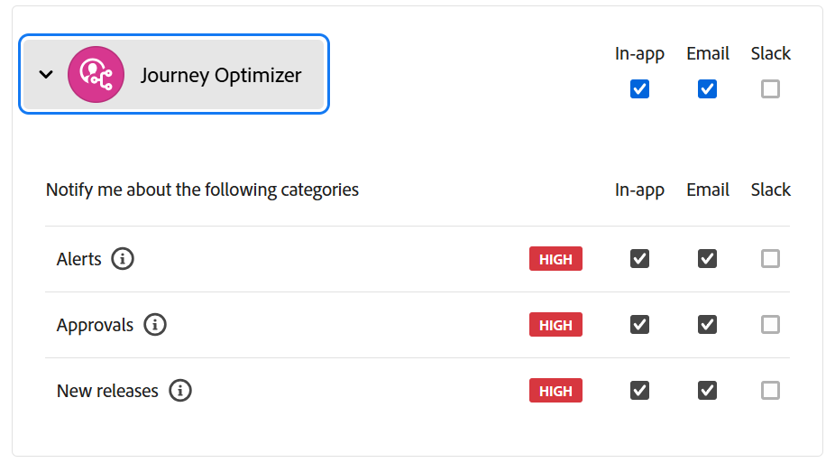
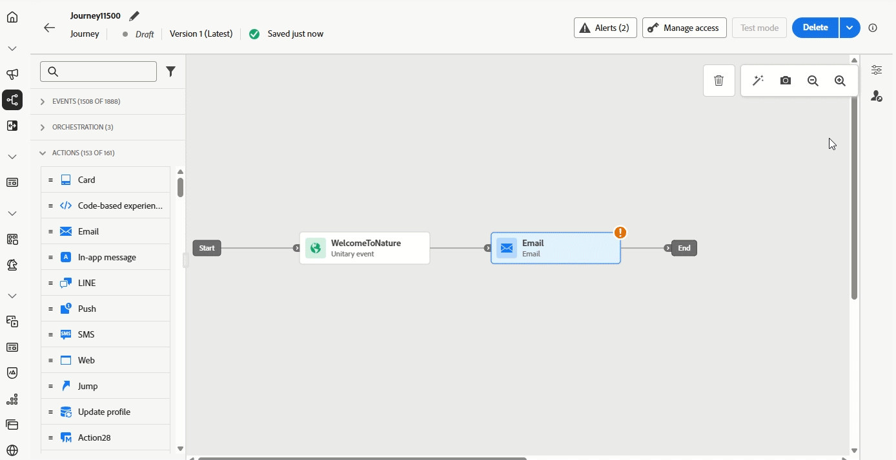

# Versionsinformation för 2025 {#release-notes-2025}

På den här sidan visas alla funktioner och förbättringar för [!DNL Journey Optimizer] som släpptes 2025.

## Versionsinformation 25 september {#25-9-rn}

**Releasedatum**: 23-24 september 2025

### Nya funktioner {#sept-25-9-features}

<table>
<thead>
<tr>
<th><strong>Journey Optimizer Experimentation Accelerator</strong> </th>
</tr>
</thead>
<tbody>
<tr>
<td>

Journey Optimizer Experimentation Accelerator är en AI-förstahandsprodukt som utformats för att ta dina experiment till nästa nivå. Det är byggt för användare av Adobe Journey Optimizer och Adobe Target och ger en enhetlig experimenthantering, AI-baserade insikter och möjligheter samt introducerar en ny experimentagent.

Du kan se fram emot att:

<ul>
<li><strong>Enhetlig experimentinventering:</strong> Visa, filtrera och hantera snabbt alla experiment från Adobe Journey Optimizer och Adobe Target på en central arbetsyta.</li>
<li><strong>AI Experimentera med insikter och möjligheter:</strong> Gå bortom statistiska avläsningar med GenAI-baserade insikter och rekommendationer. Varje experiment visar nu möjligheter att agera, med stöd för logiska funktioner, så att teamen kan bestämma vad som ska testas härnäst.</li>
<li><strong>Stöd för MAB (Multi-Armed Bandit) i Journey Optimizer:</strong> Maximera påverkan samtidigt som du minskar bortslösad trafik med Multi-Armed Bandit-experiment. I stället för att dela målgrupper jämnt tilldelar MAB automatiskt fler besökare till de mest effektiva variationerna i realtid så att ni kan leverera bättre upplevelser till fler kunder samtidigt som ni lär er vad som fungerar.</li></ul>

Mer information finns i <a href="https://experienceleague.adobe.com/en/docs/experimentation-accelerator/using/overview">detaljerad dokumentation</a>

Tillgänglighetsdatum: 3 okt 2025

</td>
</tr>
</tbody>
</table>

<table>
<thead>
<tr>
<th><strong>Journey Agent är här!</strong> </th>
</tr>
</thead>
<tbody>
<tr>
<td>

Journey Agent tillhandahålls av <a href="https://experienceleague.adobe.com/sv/docs/experience-cloud-ai/experience-cloud-ai/agents/agent-orchestrator" target="_blank">Adobe Experience Platform Agent Orchestrator</a> och finns i Journey Optimizer. Det gör att ni kan analysera resor via ett naturligt språkgränssnitt. Agenten kommer att upptäcka målgrupper eller schemalägga konflikter och bortfall av profiler under en resa för att hjälpa er att vidta åtgärder för att lösa dem. Snart kan du skapa resor med äkta stöd.

Mer information finns i <a href="https://experienceleague.adobe.com/en/docs/experience-cloud-ai/experience-cloud-ai/agents/ajo-agent-analyze" target="_blank">detaljerad dokumentation</a>

Tillgänglighetsdatum: 24 september 2025

</td>
</tr>
</tbody>
</table>

<table>
<thead>
<tr>
<th><strong>Mörkt läge i e-post-Designer</strong> </th>
</tr>
</thead>
<tbody>
<tr>
<td>

Journey Optimizer Email Designer erbjuder nu möjlighet att växla till vyn för mörkt läge, där du kan definiera ytterligare anpassade inställningar som bara ska visas för mottagare som läser deras e-post i mörkt läge.

Observera följande:

<ul>
<li>Den slutliga återgivningen i mörkt läge kan variera och beror på mottagarens e-postklient.</li>
<li>Alla e-postklienter stöder inte anpassat mörkt läge. Vissa e-postklienter använder dessutom bara sitt eget mörka standardläge för alla e-postmeddelanden som tas emot. I båda fallen går det inte att återge de anpassade inställningarna som du har definierat i e-post-Designer.</li>
</ul>

Mer information finns i <a href="../email/dark-mode.md">detaljerad dokumentation</a>

 
Tillgänglighetsdatum: 16 september 2025

</td>
</tr>
</tbody>
</table>

<table>
<thead>
<tr>
<th><strong>Optimering av resväg</strong> </th>
</tr>
</thead>
<tbody>
<tr>
<td>

Använd den nya Optimera-noden för att rikta in er på specifika målgrupper eller kör A/B-tester för att fastställa den bästa vägen för att uppfylla era affärsinriktade nyckeltal.

Med det här verktyget kan du testa och ändra, och anpassa kommunikation, sekvensering och timing för att nå dina kunder på bästa sätt.

Den här funktionen är tillgänglig med begränsad tillgänglighet. Kontakta din Adobe-representant för att få åtkomst.

Mer information finns i <a href="../building-journeys/optimize.md">detaljerad dokumentation</a>

Tillgänglighetsdatum: 4 september 2025

</td>
</tr>
</tbody>
</table>

<table>
<thead>
<tr>
<th><strong>Anpassad delegeringsmetod för underdomäner</strong> </th>
</tr>
</thead>
<tbody>
<tr>
<td>

Utöver den fullständiga delegeringen och CNAME-metoden finns nu en ny konfigurationsmetod för underdomäner: metoden för anpassad delegering, som gör att du kan ha fullständig kontroll över och underhålla alla aspekter av DNS som krävs för att leverera, återge och spåra meddelanden.

Den här funktionen är tillgänglig med begränsad tillgänglighet. Kontakta din Adobe-representant för att få åtkomst.

Mer information finns i <a href="../configuration/delegate-custom-subdomain.md">detaljerad dokumentation</a>

Tillgänglighetsdatum: 4 september 2025

</td>
</tr>
</tbody>
</table>

<table>
<thead>
<tr>
<th><strong>Använd Adobe Experience Platform-data för personalisering och beslutsfattande</strong> </th>
</tr>
</thead>
<tbody>
<tr>
<td>

Den här funktionen finns nu tillgänglig i alla miljöer, som tidigare lanserats i betaversioner. I den här versionen har följande förbättringar införts:

<ul><li>Stöd för personalisering av datasetsökningar i inkommande kanaler.</li>
<li>Hjälpfunktionen"datasetLookup" kan nu användas i uttrycksfragment. För närvarande är den här funktionen tillgänglig för ett begränsat antal kunder. Kontakta din Adobe-representant för att få åtkomst.</li>
<li>Med ett alternativ i datauppsättningsgränssnittet kan du nu aktivera postbaserade datauppsättningar för sökpersonalisering, utan att behöva utföra ett API-anrop.</li>
<li>Förbättrad övervakning för att spåra dataöverföringshastighet och veta när datauppsättningar är klara för sökning.</li>
<li>Uppdaterade riktlinjer och säkerhetsregler för optimala prestanda och tillförlitlighet.</li>
<li>Adobe Experience Platform-datauppsättningar kan nu utnyttjas i regler för beslutsplatsappning.</li></ul>

Mer information finns i <a href="../data/lookup-aep-data.md">detaljerad dokumentation</a>

Tillgänglighetsdatum: 1 september 2025

</td>
</tr>
</tbody>
</table>

### Förbättringar {#sept-25-9-improvements}

* **Webkrok-stöd för API-utlösta kampanjer**\
  API-utlösta kampanjer har nu stöd för webhooks. Konfigurera en webkros-URL för att få statusuppdateringar i realtid för varje meddelande, vilket förbättrar observerbarheten och möjliggör smidig övervakning och automatisering. [Läs mer](../configuration/feedback-webhooks.md)

  Tillgänglighetsdatum: 29 september 2025

* **mTLS-stöd för SMS-kanal**
När du konfigurerar en anpassad SMS-leverantör har du nu möjlighet att aktivera gemensam TLS-autentisering (mTLS), vilket kräver att både klienten och servern bekräftar varandras identiteter innan en säker anslutning upprättas. [Läs mer](../sms/sms-configuration-custom.md) - Tillgänglighetsdatum: 23 september 2025

* **Modellbaserade scheman**\
  Modellbaserade scheman kan nu användas av för att stödja dina relationsmodelleringsbehov i samordnade kampanjer. [Läs mer](../orchestrated/gs-schemas.md) - Tillgänglighetsdatum: 23 september 2025

* **Stöd för datauppsättningssökning på resor**\
  En ny aktivitet på resorna, **Datauppsättningssökning**, gör att du kan hämta data dynamiskt från Adobe Experience Platform postdatamängder under körning. Genom att utnyttja den här funktionen kan ni få tillgång till data som kanske inte finns i profilen eller händelsens nyttolast, vilket säkerställer att era kundinteraktioner är både relevanta och aktuella. [Läs mer](../building-journeys/dataset-lookup.md) - Tillgänglighetsdatum: 23 september 2025

  Den här aktiviteten är endast tillgänglig för en uppsättning organisationer (begränsad tillgänglighet). Kontakta din Adobe-representant för att få åtkomst.

* **Omdirigeringsstöd i anpassade åtgärder för resor**\
  Omdirigeringar (302) stöds nu i Anpassade åtgärder för resan. - Tillgänglighetsdatum: 23 september 2025

* **Varningar för kanalkonfigurationsövervakning** - Du kan nu prenumerera på systemvarningar, antingen via e-post eller i Journey Optimizer meddelandecenter, om ett konfigurationsfel för e-postkanal som använder den anpassade delegeringstypen inträffar. [Läs mer](../reports/alerts.md#alert-channel-config-failure) - Tillgänglighetsdatum: 23 september 2025

* **Begäranden om att avbryta prenumerationen med ett klick** - Vi har förbättrat hanteringen av begäranden om att avbryta prenumerationen som konfigurerats under Adobe Managed, vilket ger tillförlitlig och konsekvent behandling. - Tillgänglighetsdatum: 23 september 2025

* **Kapslade JSON-body-parametrar stöds nu i anpassad autentisering**\
  När anpassad autentisering konfigureras för en anpassad åtgärd stöds nu kapslade JSON-objekt (t.ex. underobjekt inom `bodyParams`). [Läs mer](../datasource/external-data-sources.md#custom-authentication-mode) - Tillgänglighetsdatum: 18 september 2025

* **Återställa begränsningsfrekvens per timme** - Du kan nu tillämpa begränsning per timme för kanalregeluppsättningar. Den här funktionen fanns tidigare i Begränsad tillgänglighet och är nu tillgänglig i alla miljöer. Du kan välja en timme (tidigare 3 timmar). [Läs mer](../conflict-prioritization/channel-capping.md) - Tillgänglighetsdatum: 17 september 2025

* **Simulera innehållsvariationer för alla inkommande kanaler**\
  Tidigare var det bara tillgängligt för meddelandekanalerna för e-post, SMS och push. Nu gäller även simulering av innehållsvarianter för alla inkommande kanaler. [Läs mer](../test-approve/simulate-sample-input.md) - Tillgänglighetsdatum: 17 september 2025

* **Uttryck för regler för beslutsavgränsning** - Du kan nu skapa egna uttryck för att definiera tröskelvärdet för en begränsningsregel för ett beslutsobjekt. [Läs mer](../experience-decisioning/items.md#capping) - Tillgänglighetsdatum: 16 september 2025

* **Stöd för dynamiska domäner** - Journey Optimizer har nu stöd för fullständig URL-anpassning/basanpassning för fördefinierade domäner som accepteras av Adobe. [Läs mer](../personalization/personalization-build-expressions.md#where) - Tillgänglighetsdatum: 12 september 2025

  Den här funktionen är tillgänglig i begränsad tillgänglighet för en uppsättning kunder.

* **Webhooks** - I den här versionen presenteras följande förbättringar för Webhooks när en anpassad SMS-provider konfigureras:

   * Du kan nu definiera webbhogens syfte, antingen inkommande eller feedback, beroende på vilken typ av data du vill hämta. [Läs mer](../sms/sms-configuration-custom.md#webhook) - Tillgänglighetsdatum: 23 september 2025

   * Gränssnittet för att konfigurera nyckelord har förbättrats för enklare konfiguration. [Läs mer](../sms/sms-configuration-custom.md#webhook) - Tillgänglighetsdatum: 23 september 2025

* **SMS**

   * När du konfigurerar en anpassad SMS-provider kan du nu definiera nyckelordet **Default** som används när ett inkommande SMS innehåller ett okänt nyckelord. Du kan också skapa **anpassade**-nyckelord för specifika åtgärder. [Läs mer](../sms/sms-configuration-custom.md) - Tillgänglighetsdatum: 23 september 2025

   * Du kan nu komma åt odefinierade inkommande nyckelordssvar som skickas via ett SMS-meddelande, inklusive typos, ord eller meningar som inte uttryckligen definieras i konfigurationen. De lagras i datamängden **AJO Email Tracking Experience Event** under **InboundMessage** i 13 månader. Endast tillgängligt med Sinch, Infobip och anpassad SMS-leverantör. - Tillgänglighetsdatum: 23 september 2025

## Versionsinformation 25 augusti {#25-8-rn}

**Releasedatum**: 19 augusti 2025

### Nya funktioner {#Aug-25-8-features}

De nya funktionerna i den här versionen beskrivs nedan.

<table>
<thead>
<tr>
<th><strong>Pausa och återuppta resor</strong> </th>
</tr>
</thead>
<tbody>
<tr>
<td>

Nu kan du pausa och återuppta dina resor. Denna förmåga ger resenärerna större kontroll och flexibilitet genom att göra det möjligt att tillfälligt avbryta pågående resor utan att störa kundupplevelsen. När det är pausat skickas ingen kommunikation och profilerna förblir i ett uppehåll tills resan återupptas.

Du kan bara pausa och återuppta en resa, eller utföra grupppausningar och återuppta åtgärder på en grupp resor.

Dessutom kan du använda globala filter på pausade resor för att exkludera profiler baserat på deras attribut.

Den här funktionen lanserades tidigare i begränsad tillgänglighet och är nu tillgänglig i alla miljöer (allmän tillgänglighet).

Mer information finns i <a href="../building-journeys/journey-pause.md">detaljerad dokumentation</a>

</td>
</tr>
</tbody>
</table>

<table>
<thead>
<tr>
<th><strong>Kalendervy</strong> </th>
</tr>
</thead>
<tbody>
<tr>
<td>

Nu finns en kalendervy tillgänglig i rese- och kampanjlistorna. Ni kan visualisera alla resor och kampanjaktiveringar i respektive lista.

Den här funktionen fanns tidigare i Begränsad tillgänglighet och är nu tillgänglig i alla miljöer. I den här allmänna tillgänglighetsversionen innehåller funktionen:

<ul>
<li>Designförbättringar för navigering i datum,</li>
<li>Möjlighet att se utkast till kampanjer om du har angett ett start- och slutdatum,</li>
<li>En ny inställning som döljer och visar kalenderobjekt som körs länge.</li>
</ul>

Mer information finns i <a href="../building-journeys/journey-ui.md#calendar">detaljerad dokumentation</a>

</td>
</tr>
</tbody>
</table>

<!--table>
<thead>
<tr>
<th><strong>Use Adobe Experience Platform data for personalization</strong> </th>
</tr>
</thead>
<tbody>
<tr>
<td>

Leverage data from [!DNL Adobe Experience Platform] in the personalization editor to personalize your content and decision attributes. In particular, this allows you to extend the definition of your attributes to additional data in datasets for bulk updates that change periodically without having to manually update the attributes one at a time.

With this release, the following enhancements have been introduced:

<ul>
<li>Support of inbound channels,</li>
<li>The "datasetLookup" helper function can now be used within expression and visual fragments to personalize content using data from Adobe Experience Platform datasets,</li>
<li>An option in the dataset now allows you to enable datasets for lookup personalization, without having to perform an API call.</li>
</ul>

This capability is available in Limited Availability. Contact your Adobe representative to gain access.

For more information, refer to the <a href="../personalization/aep-data-perso.md">detailed documentation</a>

</td>
</tr>
</tbody>
</table-->

<!--table>
<thead>
<tr>
<th><strong>Use Decisioning in email channel</strong> </th>
</tr>
</thead>
<tbody>
<tr>
<td>

You can now add Decision policies into email journeys and campaigns. Decision policies are containers for your offers that leverage the Decisioning engine to dynamically return the best content to deliver for each audience member.

Previously released in Limited Availability, this capability is now available to all environments (General Availability).

<For more information, refer to the <a href="../FILE.md">detailed documentation</a>

</td>
</tr>
</tbody>
</table-->

<table>
<thead>
<tr>
<th><strong>Verksamhet under resor</strong> </th>
</tr>
</thead>
<tbody>
<tr>
<td>

Journey Optimizer har stöd för en ny generisk Action-aktivitet som gör att du kan konfigurera både enskilda åtgärder och inkommande funktionsmakrogrupper för flera åtgärder, vilket ger en smidig åtgärdskonfiguration på arbetsytan. Den här nya funktionen gör det möjligt att:

<ul>
<li>En förenklad inbyggd åtgärdskonfiguration på arbetsytan för resan.</li>
<li>Kapaciteten för att skapa inkommande åtgärdsgrupper med flera åtgärder.</li>
<li>Möjlighet att lägga till optimering till alla inbyggda kanalåtgärder.</li>
<li>Möjlighet att lägga till både experimentella och flerspråkiga alternativ i alla funktionsmakron.</li>
</ul>

Den här funktionen är tillgänglig med begränsad tillgänglighet. Kontakta din Adobe-representant för att få åtkomst.

Mer information finns i <a href="../building-journeys/journey-action.md">detaljerad dokumentation</a>

</td>
</tr>
</tbody>
</table>

<table>
<thead>
<tr>
<th><strong>PDF bilagor till e-postmeddelanden</strong> </th>
</tr>
</thead>
<tbody>
<tr>
<td>

Du kan nu bifoga en statisk PDF-fil i ett e-postmeddelande som skickas med Journey Optimizer.

<ul>
<li>Du kan skicka upp till 6 meddelanden med en PDF-bilaga per profil och år.</li>
<li>Den största tillåtna filstorleken för varje bifogad fil är 5 MB.</li>
<li>För ytterligare storlekar och volymer kan du köpa ett tilläggspaket. Mer information får du av Adobe.</li>
</ul>

Den här funktionen är tillgänglig med begränsad tillgänglighet. Kontakta din Adobe-representant för att få åtkomst.

Mer information finns i <a href="../email/pdf-attachments.md">detaljerad dokumentation</a>

</td>
</tr>
</tbody>
</table>

<!--
<table>
<thead>
<tr>
<th><strong>Landing page custom forms</strong> </th>
</tr>
</thead>
<tbody>
<tr>
<td>

With [!DNL Journey Optimizer], you can now capture profile attributes though your landing pages.

Create, design and manage custom forms tailored to your needs based on a specific dataset. You can then leverage these forms in landing pages to add the profile attributes of your choice into the dataset defined for each form.

This capability is currently in beta version and only available to beta customers. To join the beta program, contact your Adobe representative.

For more information, refer to the <a href="../FILE.md">detailed documentation</a>

</td>
</tr>
</tbody>
</table>
-->

<table>
<thead>
<tr>
<th><strong>Optimering av kampanjer</strong> </th>
</tr>
</thead>
<tbody>
<tr>
<td>

Journey Optimizer ger er nu de verktyg ni behöver för att leverera personaliserat och optimerat innehåll till er målgrupp, så att ni kan köra innehållsexperiment, skapa regelbaserad målinriktning och använda avancerade kombinationer av båda för att maximera effektiviteten i era kampanjer och resor.

Med optimering kan man

<ul>
<li>Testa olika innehållsvariationer för att identifiera de mest effektiva budskapen.</li>
<li>Leverera personaliserat innehåll baserat på användarattribut och sammanhangsbaserade data.</li>
<li>Kombinera målinriktning och experimenterande för avancerade strategier.</li>
<li>Filtrera bort användare som inte matchar variantvillkor.</li>
<li>Se till att reservmekanismer upprätthåller användarengagemanget.</li>
</ul>

När resan eller kampanjen är live utvärderas profiler mot de definierade kriterierna, och baserat på matchningskriterier levereras de med rätt upplevelse eller innehåll.

Tidigare släppt den 8 augusti endast i kampanjer, är denna kapacitet nu även tillgänglig på resor från och med den 22 augusti.

Mer information finns i <a href="../campaigns/campaigns-message-optimization.md">detaljerad dokumentation</a>

</td>
</tr>
</tbody>
</table>

### Förbättringar {#Aug-25-8-improv}

Förbättringar i den här versionen visas nedan.

* **Administration**

   * **Varningar för kanalkonfigurationsövervakning** - Du kan nu prenumerera för att ta emot systemvarningar, antingen via e-post eller i Journey Optimizer meddelandecenter, om <!--a channel configuration failure happens or if --> en DNS-post saknas. [Läs mer](../reports/alerts.md#alert-dns-record-missing)

* **AI-assistenten**

   * **Innehållsgenerering på flera språk** - Innehållet kan nu genereras på franska, spanska, tyska, italienska, japanska, svenska, nederländska och norska. [Läs mer](../content-management/generative-uc.md#languages)

     Tillgänglighetsdatum: 25 augusti

* **Kampanjer**

   * **Hastighetskontroll för utgående kampanjer** - Nu kan du aktivera hastighetskontroll för utgående kampanjer (e-post, SMS, push-meddelanden), så att du kan förhindra överbelastning i efterföljande system, som landningssidor eller kundtjänstplattformar. [Läs mer](../campaigns/campaign-schedule.md#rate-control)

   * **Schemaläggning av åtgärdskampanjer** - Schemaläggaren för kampanjen dagligen, veckovis och månadsvis har uppdaterats för att ge mer detaljerad kontroll över återkommande scheman:

      * **Återkommande varje vecka**: Du kan nu välja att upprepa kampanjen varje vecka eller varannan vecka och välja vilka veckodagar den ska köras på.

      * **Månadsvis återkommande**: Du kan nu välja att upprepa kampanjen varje månad eller varannan månad och välja den dag i månaden som den ska köras.

      * **Dagliga, veckovisa eller månadsvisa scheman**: Du kan ange om det återkommande schemat ska stoppas ett visst datum eller efter ett visst antal förekomster.

   * **Schemalagda transaktionsåtgärdskampanjer** - Schemalagda transaktionsåtgärdskampanjer är nu tillgängliga för sändning av batchbaserad, målgruppsbaserad transaktionskommunikation via e-post-, SMS- och push-kanaler.

* **Kanal - Innehållskort**

   * **Mallar för innehållskortslayout** - Innehållskortskanalen innehåller nu OTB-meddelandelayouter som effektiviserar redigeringsupplevelsen. Den här versionen innehåller layoutmallarna Liten bild, Stor bild och Endast bild. [Läs mer](../content-card/design-content-card.md)

* **Kanal - tryck**

   * **Förfallodatum för push-meddelanden** - Nu kan du ange ett förfallodatum för varje push-meddelande, vilket förhindrar att tidskänsliga meddelanden (som Black Friday Sale) skickas efter ett visst datum, vilket förhindrar att dina kunder får en dålig upplevelse.

* **Kanal - SMS**

   * **Fuzzy Opt-out** - När alternativet **Fuzzy Opt-out** är aktiverat upptäcks inkommande meddelanden som liknar definierade avanmälningsnyckelord (t.ex. CANCIL) och ett bekräftelsemeddelande skickas automatiskt för att bekräfta användarens avanmälan. Om användaren bekräftar via den definierade uppmaningen, avbeställs prenumerationen. [Läs mer](../sms/sms-configuration-sinch.md)

     >[!NOTE]
     >
     >**Fuzzy Opt-out** är bara tillgängligt med Sinch och Infobip.

   * **Verifiera SMS-anslutning** - Nu kan du enkelt testa och verifiera dina SMS API-autentiseringsuppgifter i Adobe Journey Optimizer genom att skicka ett exempelmeddelande till en angiven enhet. [Läs mer](../sms/sms-configuration-sinch.md)

* **Konfiguration**

   * **Stöd för anpassade attribut med en klickning för att avbryta prenumeration-URL** - Om du hanterar samtycke utanför Adobe kan du ange en extern anpassad slutpunkt genom att definiera en egen länk för att avbryta prenumeration i e-postkonfigurationen med ett enda klick. När mottagarna klickar på länken för att avbryta prenumerationen lägger Journey Optimizer till vissa standardprofilspecifika parametrar i händelsen för att skicka medgivandeuppdatering.

     Om du vill anpassa länken för att avbryta prenumerationen med ett klick ytterligare kan du nu definiera anpassade attribut som även läggs till i medgivandehändelsen. [Läs mer](../email/list-unsubscribe.md#custom-attributes)

* **Datauppsättningar**

   * **Objektarkiv för Experience Decisioning - personaliserade erbjudandeobjekt** - Inbyggd exportdatauppsättning hämtar nu alla erbjudandeattribut och livscykelstatus, vilket möjliggör fullständig personalisering och rapportering. [Läs mer](../data/export-datasets.md)

   * Introducerade versionskontroll via fältet `etag` för att förbättra konsekvensen och spåra ändringar av erbjudandeobjekt mer tillförlitligt.

* **Beslut**

   * **Koppla fragment till beslutsobjekt** - Journey Optimizer kan nu koppla fragment till beslutsobjekt som kan utnyttjas i kodbaserade upplevelsekampanjer via beslutspolicyer. Den här funktionen är tillgänglig i begränsad tillgänglighet för en uppsättning kunder. [Läs mer](../experience-decisioning/create-decision.md#fragments)

* **Resor**

   * **Resemassåtgärder** - I listan över dina resor kan du nu välja flera objekt. När du har valt det här alternativet kan du pausa eller återuppta upp till 10 resor i taget.

   * **Stöd för omdirigering (302) i anpassade åtgärder** - Anpassade åtgärder kan nu hantera HTTP 302-omdirigeringar per begäran. På så sätt kan resor integreras med API:er som omdirigerar begäranden till lokaliserade eller regionspecifika URL:er. Omdirigeringar utförs automatiskt så att rätt innehåll levereras utan extra konfiguration.

   * **Flera inkommande åtgärder under resor** - För att förenkla din resesamordning kan du nu definiera flera inkommande åtgärder under en enskild resa. Den här funktionen, som tidigare fanns i kampanjer, gör att ni kan leverera flera kodbaserade upplevelser, meddelanden i appen, innehållskort eller webbåtgärder till olika platser samtidigt, och varje åtgärd innehåller ett visst innehåll. [Läs mer](../building-journeys/journey-action.md#multi-action)

## Kampanjsamordning

**Tillgänglighetsdatum**: 4 augusti 2025

Journey Optimizer innehåller nu **Kampanjsamordning**, en ny funktion som är avsedd för varumärkesinitierade gruppkampanjer. I den här versionen introduceras en kampanjsamordningsyta och förbättrad datamodellering, som fungerar tillsammans för att marknadsförarna ska kunna planera, målinrikta och leverera personaliserade flerkanalskampanjer.

>[!IMPORTANT]
>
>För att få åtkomst till kampanjsamordning måste din licens innehålla antingen paketet **Journey Optimizer - Campaigns &amp; Journeys** eller paketet **Journey Optimizer - Campaigns**. Kontakta din Adobe-representant för att bekräfta din licens och uppdatera vid behov.

Den innehåller [Relationsscheman och datauppsättningar](#oc-relational) och [Kampanjarbetsyta](#oc-canvas). Tillsammans sätter dessa två innovationer en ny standard för att samordna batchkampanjer i Journey Optimizer. Viktiga funktioner listas nedan.

### Nyckelfunktioner {#oc-capabilities}

* **Flerstegsarbetsflöden**

  Skapa sofistikerade gruppkampanjer i flera kanaler med den nya, specialbyggda arbetsytan för kampanjhantering.

* **On demand-målgrupper**

  Segmentera målgrupper på begäran för omedelbar aktivering.

* **Segmentering för flera enheter**

  Bygg målgrupper med hjälp av företagskontext (icke-personella dimensioner) som produkt, butiker, förnyelser, reservationer med mera.

* **Synlighet före sändning**

  Granska, förfina och optimera målgrupper och kampanjer före lansering och medan kampanjer körs

### Kampanjarbetsyta {#oc-canvas}

Ett helt nytt gränssnitt för visuell samordning som är konstruerat för gruppkampanjer. På arbetsytan kan du

* Visuell planering av flerstegskampanjer för flera kanaler

* Stöd för on demand-målgrupper som bygger på relationsfrågor

* Avancerad målgruppsdelning, väntetider och villkorslogik

* Exakt antal före sändning när affärsregler och filter har tillämpats

### Relationsscheman och datauppsättningar {#oc-relational}

Adobe Journey Optimizer har nu stöd för relationsenheter (t.ex. produkter, butiker, bokningar, kontrakt) som är kopplade till personbaserade profiler. Detta möjliggör segmentering och personalisering över flerdimensionella datastrukturer, vilket möjliggör exempelvis följande:

* Ett meddelande per bokning, prenumeration eller kontrakt

* Segmentering baserad på relaterade entitetsattribut (t.ex. produktkategori eller butiksplats)

* Förbättrad adressering (t.ex. skicka till alla kända kontakter som är kopplade till en enhet)

### Varför det spelar någon roll

Den här versionen ger marknadsförarna full kontroll över varumärkesinitierad, målgruppsbaserad batchmarknadsföring, vilket kombinerar flexibel datamodellering med en specialbyggd orkestreringsupplevelse. Den är särskilt utformad för gruppkampanjsamordning från realtidsresor, samtidigt som den erbjuder avancerad personalisering och skalbarhet.

### Läs mer

Läs mer i [dokumentationen för kampanjsamordning](../orchestrated/gs-orchestrated-campaigns.md).

## Versionsinformation juli 25 {#25-7-rn}

**Releasedatum**: 29 juli 2025

### Nya funktioner {#features-25-7}

De nya funktionerna i den här versionen beskrivs nedan.

#### Funktioner

<table>
<thead>
<tr>
<th><strong>Varumärken</strong> </th>
</tr>
</thead>
<tbody>
<tr>
<td>

Nu kan ni skapa och anpassa era egna varumärken för att tydligt definiera er visuella och verbala identitet i alla slags kommunikation. Med varumärkesjusteringspoängen kan ni få feedback i realtid om hur väl ert innehåll speglar ert varumärkes ton, stil och riktlinjer, så att ni kan hålla er enhetliga med varje budskap ni skickar.

Den här funktionen lanserades tidigare i Beta och är nu tillgänglig i alla miljöer (allmän tillgänglighet).

Mer information finns i den <a href="../content-management/brands.md">detaljerade dokumentationen</a>.

</td>
</tr>
</tbody>
</table>

<table>
<thead>
<tr>
<th><strong>Använd beslut i e-postkanal</strong> </th>
</tr>
</thead>
<tbody>
<tr>
<td>

Nu kan ni lägga till beslutsprinciper i e-postresor och -kampanjer. Beslutspolicyer är behållare för era erbjudanden som utnyttjar beslutsmotorn för att dynamiskt returnera det bästa innehållet för varje målgruppsmedlem.

Den här funktionen är tillgänglig med begränsad tillgänglighet. Kontakta din Adobe-representant för att få åtkomst.

Mer information finns i <a href="../experience-decisioning/create-decision.md">detaljerad dokumentation</a>

</td>
</tr>
</tbody>
</table>

<table>
<thead>
<tr>
<th><strong>LINE-kanal</strong> </th>
</tr>
</thead>
<tbody>
<tr>
<td>

Adobe Journey Optimizer har utökat sina flerkanalsfunktioner så att de har stöd för LINE-kanalen. Den här förbättringen gör att du kan skapa, redigera och förhandsgranska LINE-upplevelser, vilket möjliggör mer personaliserade och engagerande interaktioner. Med LINE kan ni få kontakt med fler kunder, skicka relevant innehåll och förbättra engagemanget.

LINE-kanalen är nu tillgänglig för alla användare (General Availability), som tidigare endast var tillgänglig för begäran.

Mer information finns i den <a href="../../rp_landing_pages/line-landing-page.md">detaljerade dokumentationen</a>.
</td>
</tr>
</tbody>
</table>

<table>
<thead>
<tr>
<th><strong>Körning av resetorr</strong> </th>
</tr>
</thead>
<tbody>
<tr>
<td>

Körning på resa Dry är ett särskilt publiceringsläge för resor i Adobe Journey Optimizer som gör det möjligt för resenärer att testa en resa med hjälp av verkliga produktionsdata utan att behöva kontakta riktiga kunder eller uppdatera profilinformation. Den här funktionen hjälper resenärer att få förtroende för sin resedesign och målgruppsanpassning innan de publicerar den live.

Den här funktionen lanserades tidigare i begränsad tillgänglighet och är nu tillgänglig i alla miljöer (allmän tillgänglighet).

Mer information finns i <a href="../building-journeys/journey-dry-run.md">detaljerad dokumentation</a>

</td>
</tr>
</tbody>
</table>

<table>
<thead>
<tr>
<th><strong>Kompletterande ID för resor</strong> </th>
</tr>
</thead>
<tbody>
<tr>
<td>

Nu kan du utlösa resor med ett profil-ID tillsammans med en annan identifierare, till exempel ett order-ID, ett prenumerations-ID eller ett förskrivnings-ID, vilket gör att samma profil kan finnas på samma resa flera gånger samtidigt. Detta möjliggör scenarier som att hantera flera order eller prenumerationer parallellt, där varje instans följer sin egen väg genom resan.

Tidigare släppt i Begränsad tillgänglighet är användningen av extra ID:n på resor nu tillgänglig för alla miljöer. I den här allmänna tillgänglighetsversionen har funktionen nu stöd för målgruppsresor för läsning.

Mer information finns i <a href="../building-journeys/supplemental-identifier.md">detaljerad dokumentation</a>

</td>
</tr>
</tbody>
</table>

### Varningar i produkten

Du kan nu prenumerera på **e-postmeddelanden och produktmeddelanden** för Journey Optimizer produktreleaser.

Så här prenumererar du:

* Navigera till **Adobe Experience Cloud-inställningar**
* Under **Notifications**, sök efter **Journey Optimizer New Relases**
* Aktivera meddelanden i programmet och e-postmeddelanden

{width="70%" align="left"}

### Förändringar i resevillkor {#ee-change@}

Från och med den 8 juli stöds inte längre skapande av uttryck med upplevelsehändelser i den uttrycksredigerare som används i resevillkor i nya kundorganisationer. Därför kan upplevelsehändelser i [Experience Platform-datakällan](../datasource/adobe-experience-platform-data-source.md) inte användas för att skapa uttryck. Alternativa metoder och bästa praxis för att skapa uttryck/logik med upplevelsehändelser refereras [här](../building-journeys/exp-event-lookup.md).

Det finns ingen förändring i hur händelsedata om resans kontext nås på enstaka resor. I redigeringsprogram för uttryck och personalisering kan användarna fortsätta att komma åt data som skickas in vid den första resehändelsen.

Läs mer [i de här vanliga frågorna](../building-journeys/exp-event-lookup.md#faq-ee).

### Förbättringar {#25-7-improv}

Förbättringar i den här versionen visas nedan.

* **Kampanjer**

   * **Flera inkommande åtgärder i kampanjer** - För att förenkla kampanjhanteringen kan du nu definiera flera inkommande åtgärder i en enda kampanj. Med den här funktionen kan ni leverera flera kodbaserade upplevelser, meddelanden i appen, innehållskort eller webbåtgärder till olika platser samtidigt, och varje åtgärd innehåller ett visst innehåll.
     [Läs mer](../campaigns/campaign-action.md#multi-action)

   * **Omorganisation av kampanjinventering** - Schemalagda och API-utlösta kampanjer delas nu upp på separata flikar i kampanjlagret för enklare navigering och hantering.

[Läs mer](../campaigns/manage-campaigns.md)

* **Datahantering**
   * **Datauppsättningar för beslutshanteringssystem** - De borttagna personliga erbjudandena och reserverbjudandena har nu markerats som arkiverade i datamängderna &quot;Decision_object_database_personalized_offers&quot; och &quot;Decision_object_database_fallback_offers&quot;. Befintliga poster i datauppsättningen ändras inte.

[Läs mer](../offers/export-catalog/access-dataset.md)

* **Resor**
   * **Förbättringar av verktygslådan Resesandlåda** - När du kopierar resor över flera sandlådor med hjälp av funktionerna för paketexport och import är nu även följande funktioner tillgängliga:
      * Välja en befintlig händelse på målet
      * Kopiera över en händelse oberoende av en resa
      * Identifiera fältgrupps-/datakällrelationer, länka till dem vid målet om de finns, och skapa dem om de inte gör det.

[Läs mer](../configuration/copy-objects-to-sandbox.md)

* **Kanal - i appen**
   * **Nyckel-/värdepar i appen** - Med meddelanden i appen kan du definiera nyckel- och värdepar som ska innehålla anpassade variabler i meddelandets nyttolast. Dessa nyckelvärdepar gör att du kan skicka ytterligare data baserat på din specifika konfiguration och användningsfall. [Läs mer](../in-app/design-in-app.md)

* **Kanal - Innehållskort**

   * **Regelbaserad kampanjavvikelse** - Vid redigering av ytterligare leveransregler har det tidigare alternativet Leveransregler ersatts med tre olika regeltyper för bättre kontroll av meddelandetiming och synlighet:
      * Visa meddelande om: Villkor som bestämmer när innehållskortet visas.
      * Stäng meddelandet om: Villkor som tillfälligt döljer innehållskortet. Den kan visas igen om visningsvillkoren uppfylls igen.
      * Diskvalificera meddelandet om: Villkor som permanent förhindrar att innehållskortet visas igen.

[Läs mer](../content-card/design-content-card.md)

* **Beslut**
   * **API:er för migreringsverktyg** - Journey Optimizer-teamet arbetar för närvarande med migreringsverktygs-API:er för att migrera beslutshanteringsenheter till beslut. Detta verktyg möjliggör sömlös migrering mellan sandlådor med beroendeupplösning och återställningsfunktioner. Kontakta Adobe om du är intresserad.

* **Personalization**
   * En ny hjälpfunktion, &quot;SHA256&quot;, har lagts till i personaliseringsredigeraren. Den här funktionen används för att beräkna och returnera sha256-hash för en sträng.

[Läs mer](../personalization/functions/string.md#sha256)

## Versionsinformation 25 juni {#25-6-rn}

**Releasedatum**: 18 juni 2025

### Nya funktioner {#25-06-features}

De nya funktionerna i den här versionen beskrivs nedan.

<table>
<thead>
<tr>
<th><strong>Adobe Experience Platform datasets in decisioning (beta)</strong> </th>
</tr>
</thead>
<tbody>
<tr>
<td>

Adobe Experience Platform datamängder fanns tidigare för personalisering och kan nu utnyttjas för beslut. Detta gör att du kan utöka definitionen av dina beslutsattribut till ytterligare data i datauppsättningar för bulkuppdateringar som ändras regelbundet utan att du behöver uppdatera attributen manuellt en i taget. Till exempel tillgänglighet, väntetider osv.

Den här funktionen är för närvarande tillgänglig för alla kunder som en betaversion. Kontakta din kontorepresentant om du vill ha tillgång till tjänsten.

Mer information finns i den <a href="../experience-decisioning/aep-data-exd.md">detaljerade dokumentationen</a>.

Tillgänglighetsdatum: 20 juni 2025

</td>
</tr>
</tbody>
</table>

<table>
<thead>
<tr>
<th><strong>RCS-meddelanden</strong> </th>
</tr>
</thead>
<tbody>
<tr>
<td>

Nu kan du konfigurera, anpassa och leverera RCS-meddelanden (Rich Communication Services) via en tredjepartsleverantör genom att integrera med en anpassad SMS-leverantörslösning.

Mer information finns i den <a href="../sms/sms-configuration-custom.md">detaljerade dokumentationen</a>.

</td>
</tr>
</tbody>
</table>

<table>
<thead>
<tr>
<th><strong>Formulärfält i kodbaserat upplevelseinnehåll</strong> </th>
</tr>
</thead>
<tbody>
<tr>
<td>

Nu kan du definiera specifika redigerbara fält i JSON- eller HTML-innehållsmallar, som gör det möjligt för icke-tekniska användare att enkelt redigera innehåll i en formulärvy i den kodbaserade upplevelsekanalutvecklingen, utan att behöva ändra någon kod. Mer än så när du definierar kodbaserade innehållsmallar för upplevelser kan du nu infoga beslutsprinciper i mallen, vilket ökar återanvändbarheten och användarvänligheten.

Mer information finns i den <a href="../code-based/code-based-form-fields.md">detaljerade dokumentationen</a>.

</td>
</tr>
</tbody>
</table>

<!--
<table>
<thead>
<tr>
<th><strong>Custom delegation method for subdomains</strong> </th>
</tr>
</thead>
<tbody>
<tr>
<td>

In addition to the full delegation and the CNAME method, a new subdomain configuration method is now available: the Custom delegation method, which enables you to fully own controlling and maintaining all aspects of DNS that are required for delivering, rendering and tracking messages.

</td>
</tr>
</tbody>
</table>
-->

<table>
<thead>
<tr>
<th><strong>Innehållsbeslutsaktivitet på resor</strong> </th>
</tr>
</thead>
<tbody>
<tr>
<td>

Nu kan ni inkludera personaliserade erbjudanden på era resor genom en särskild innehållsbeslutsaktivitet på arbetsytan och använda dem i reseaktiviteter, inklusive villkor och anpassade åtgärder.

Den här funktionen är bara tillgänglig för en uppsättning organisationer (begränsad tillgänglighet) och kommer att lanseras globalt i en framtida version.

Mer information finns i den <a href="../building-journeys/content-decision.md">detaljerade dokumentationen</a>.

</td>
</tr>
</tbody>
</table>

<table>
<thead>
<tr>
<th><strong>Körning av resetorr</strong> </th>
</tr>
</thead>
<tbody>
<tr>
<td>

Körning på resa Dry är ett särskilt publiceringsläge för resor i Adobe Journey Optimizer som gör det möjligt för resenärer att testa en resa med hjälp av verkliga produktionsdata utan att behöva kontakta riktiga kunder eller uppdatera profilinformation. Den här funktionen hjälper resenärer att få förtroende för sin resedesign och målgruppsanpassning innan de publicerar den live.

Den här funktionen är bara tillgänglig för en uppsättning organisationer (begränsad tillgänglighet) och kommer att lanseras globalt i en framtida version.

Mer information finns i den <a href="../building-journeys/journey-dry-run.md">detaljerade dokumentationen</a>.

</td>
</tr>
</tbody>
</table>

<table>
<thead>
<tr>
<th><strong>Pausa och återuppta resor</strong> </th>
</tr>
</thead>
<tbody>
<tr>
<td>

Nu kan du pausa och återuppta dina resor. Denna förmåga ger resenärerna större kontroll och flexibilitet genom att göra det möjligt att tillfälligt avbryta pågående resor utan att störa kundupplevelsen. När det är pausat skickas ingen kommunikation och profilerna förblir i ett uppehåll tills resan återupptas.

Du kan bara pausa och återuppta en resa, eller utföra grupppausningar och återuppta åtgärder på en grupp resor.

Dessutom kan du använda globala filter på pausade resor för att exkludera profiler baserat på deras attribut.

Den här funktionen är bara tillgänglig för en uppsättning organisationer (begränsad tillgänglighet) och kommer att lanseras globalt i en framtida version.

Mer information finns i den <a href="../building-journeys/journey-pause.md">detaljerade dokumentationen</a>.

</td>
</tr>
</tbody>
</table>

<table>
<thead>
<tr>
<th><strong>Skala din vinnare av experiment</strong> </th>
</tr>
</thead>
<tbody>
<tr>
<td>

Skala din vinnare av experiment så att du automatiskt eller manuellt kan lansera den vinnande varianten av ett experiment till din fulla publik. Den här funktionen ser till att du när en topprestanda har identifierats kan maximera dess räckvidd och effektivitet utan ständig manuell tillsyn.

Mer information finns i den <a href="../content-management/content-experiment.md">detaljerade dokumentationen</a>.

Tillgänglighetsdatum: 2 juni 2025
</td>
</tr>
</tbody>
</table>

<table>
<thead>
<tr>
<th><strong>Konflikt och prioritering</strong> </th>
</tr>
</thead>
<tbody>
<tr>
<td>

I Journey Optimizer är det viktigt att hantera kampanjernas och resornas volym och tidpunkter för att undvika överväldigande kunder med alltför många interaktioner. Journey Optimizer har nu flera verktyg för konflikthantering och -prioritering - som tidigare bara fanns för LA-organisationer (limited-access) - som nu är allmänt tillgängliga (GA).

Den här funktionen lanserades tidigare i begränsad tillgänglighet och är nu tillgänglig i alla miljöer. I den här allmänna tillgänglighetsversionen har följande förbättringar införts:

<ul>
<li>Utökat stöd: Konflikthanteringsverktygen har nu stöd för både Unitary Journeys och Audience Qualification Journeys, utöver Läs målgruppsresor.</li>
<li>Förbättrad felsökning: Det finns nu två nya händelsefält tillgängliga i frågetjänsten, så att du kan analysera varför en profil avvisades från en resa eller kampanj.</li>
<li>Förbättrad rapportering: Rapporterna visar nu vilken specifik regel som uteslöt en profil från en resa eller kampanj, vilket ger större transparens och åtgärdbara insikter.</li></ul>

Mer information finns i den <a href="../conflict-prioritization/gs-conflict-prioritization.md">detaljerade dokumentationen</a>.

Tillgänglighetsdatum: 3 juni 2025

</td>
</tr>
</tbody>
</table>

### Förbättringar {#25-06-improv}

Förbättringar i den här versionen visas nedan.

* **Kanalregeluppsättningar**

   * **Anpassat varaktighetsfönster** för capping - Ett nytt **Varje**-fält är nu tillgängligt i konfigurationsskärmen för kanalregeluppsättningar, så att du kan tillämpa regler för frekvensbegränsning över flera dagar, veckor eller månader, beroende på den angivna varaktigheten.

   * **Återställa begränsningsfrekvens per timme** - Du kan nu tillämpa begränsning per timme för kanalregeluppsättningar. Den här funktionen är endast tillgänglig för en uppsättning organisationer (begränsad tillgänglighet). Kontakta kundtjänst för att aktivera det.

   * **Daglig varaktighet** - Tidigare i begränsad tillgänglighet är frekvensbegränsningen &quot;Dagligen&quot; i kanalregeluppsättningar nu tillgänglig för alla kunder.

  Mer information finns i den [detaljerade dokumentationen](../conflict-prioritization/channel-capping.md).

* **Kodbaserade upplevelser**

   * Det finns nu en beslutsprofil i mallar för kodbaserat upplevelseinnehåll, där den kan användas för att utnyttja erbjudanden i redigerbara formulärfält. [Läs mer](../code-based/code-based-form-fields.md)

   * Från den kodbaserade upplevelseresan eller kampanjutgåvan kan ni nu lägga till en beslutspolicy direkt, utan att behöva öppna personaliseringsredigeraren. [Läs mer](../code-based/create-code-based.md#edit-code)

* **Anpassat CSS-stöd i Designer för e-post**

  Med Journey Optimizer kan du nu lägga till anpassad CSS i e-postinnehåll direkt i e-post-Designer. [Läs mer](../email/custom-css.md)

* **Ny fliknavigering för kampanjer**

  Ett nytt navigeringsmönster ger snabbare åtkomst till innehållsutveckling och stöd för ytterligare expansion av inställningar mellan kampanjer. [Läs mer](../campaigns/create-campaign.md)

* **Beslut**

   * **Sandbox copy &amp; Decisioning** (tillgänglighetsdatum: 3 juni 2025) - Beslutsobjekt kan nu kopieras mellan sandlådor, vilket effektiviserar arbetsflödena för testning och distribution. [Läs mer](../configuration/copy-objects-to-sandbox.md#decisioning)

   * **Stöd för beslutsobjektattribut för beslutsregler** (tillgänglighetsdatum: 4 juni 2025) * Du kan nu använda beslutsobjektattribut för att skapa beslutsregler. [Läs mer](../experience-decisioning/rules.md#create)

* **API-uppdatering för interaktiv meddelandekörning** - tillgänglighetsdatum: 6 juni 2025

  Med API:t för interaktiv meddelandekörning kan du nu ta bort schemat för kommande kampanjkörningar. [Läs mer](https://developer.adobe.com/journey-optimizer-apis/references/messaging/){target="_blank"}

## Versionsinformation 25 maj {#25-5-rn}

<!--**Release date**: May 20-21, 2025-->

### Nya funktioner {#25-05-features}

De nya funktionerna i den här versionen beskrivs nedan.

<table>
<thead>
<tr>
<th><strong>Kalendervy för Kampanj- och Resurslager</strong> </th>
</tr>
</thead>
<tbody>
<tr>
<td>

Nu finns en kalendervy tillgänglig i rese- och kampanjlistorna. Ni kan visualisera alla resor och kampanjaktiveringar i respektive lista.

Den här ändringen är för närvarande bara tillgänglig för en uppsättning organisationer (begränsad tillgänglighet). Använd <a href="https://forms.cloud.microsoft/r/FC49afuJVi" target="_blank">det här formuläret</a> om du vill begära åtkomst.

Mer information finns i följande avsnitt: <a href="../building-journeys/journey-ui.md">Bläddra och filtrera dina resor</a>, <a href="../campaigns/manage-campaigns.md">Åtkomstkampanjer</a>.

Tillgänglighetsdatum: 28 maj 2025

</td>
</tr>
</tbody>
</table>

<table>
<thead>
<tr>
<th><strong>Integrering av Adobe Experience Manager Content fragment</strong> </th>
</tr>
</thead>
<tbody>
<tr>
<td>

Tack vare integreringen av Adobe Experience Manager och Adobe Journey Optimizer kan du nu enkelt använda Adobe Experience Manager Content Fragments i ditt Journey Optimizer-innehåll. Denna smidiga anslutning gör det enklare att komma åt och använda AEM-material direkt i Journey Optimizer.

Den här funktionen, som tidigare fanns för en begränsad uppsättning organisationer (LA), är nu GA med följande förbättring: du kan nu definiera platshållare och mappa personaliseringsvärden inom fragmentsignaturen i redigeringsläget.

<ul>
<!--li>Create offers by directly selecting an AEM Content Fragment.</li>
<li>Define placeholders and map personalization values within the fragment signature using the Editor mode.</li-->
</ul>
 

Mer information finns i den <a href="../integrations/aem-fragments.md">detaljerade dokumentationen</a>.

Tillgänglighetsdatum: 23 maj 2025

</td>
</tr>
</tbody>
</table>

<table>
<thead>
<tr>
<th><strong>Adobe Experience Manager Dynamic Media-integrering</strong> </th>
</tr>
</thead>
<tbody>
<tr>
<td>

Dynamiska medieresurser är nu tillgängliga direkt i Journey Optimizer. Integreringen gör att du kan:

<ul>
<li>Hantera resurser centralt med uppdateringar i realtid.</li>
<li>Ändra inställningar för resurser som bredd och höjd direkt.</li>
<li>Anpassa dynamiska mediamallar genom att uppdatera innehållet och lägga till anpassningsfält.</li>
</ul>
 

Den här funktionen lanserades tidigare i begränsad tillgänglighet och är nu tillgänglig i alla miljöer (allmän tillgänglighet).

Mer information finns i den <a href="../integrations/aem-dynamic.md">detaljerade dokumentationen</a>.

Tillgänglighetsdatum: 23 maj 2025

</td>
</tr>
</tbody>
</table>

<table>
<thead>
<tr>
<th><strong>Kompletterande ID för händelseutlösta resor</strong> </th>
</tr>
</thead>
<tbody>
<tr>
<td>

Nu kan du utlösa resor med ett profil-ID tillsammans med en annan identifierare, till exempel ett order-ID, ett prenumerations-ID eller ett förskrivnings-ID, vilket gör att samma profil kan finnas på samma resa flera gånger samtidigt. Detta möjliggör scenarier som att hantera flera order eller prenumerationer parallellt, där varje instans följer sin egen väg genom resan.

Mer information finns i den <a href="../building-journeys/supplemental-identifier.md">detaljerade dokumentationen</a>.

Den här funktionen är endast tillgänglig för en uppsättning organisationer (begränsad tillgänglighet). Kontakta din Adobe-representant för att få åtkomst.

Tillgänglighetsdatum: 23 maj 2025

</td>
</tr>
</tbody>
</table>

<table>
<thead>
<tr>
<th><strong>Simulera innehållsvariationer</strong> </th>
</tr>
</thead>
<tbody>
<tr>
<td>
<!--p>Previously available in beta, content variations simulation is now generally available (GA). It allows you to preview different variations of your content using sample input data uploaded from a CSV or JSON file or added manually. All the attributes used in your content for personalization are automatically detected by the system and can be used for your tests to create multiple variants.</p-->

Den här funktionen lanserades tidigare i begränsad tillgänglighet och är nu tillgänglig i alla miljöer. I den här allmänna tillgänglighetsversionen har funktionen nu stöd för flerspråkigt innehåll och innehållsexperiment, vilket gör att du kan testa variationer mellan olika språk och behandlingar. Dessutom har det nu stöd för sammanhangsbaserade attribut (utöver profilattribut), vilket möjliggör ännu mer dynamisk och situationsstyrd innehållstestning.

Mer information finns i den <a href="../test-approve/simulate-sample-input.md">detaljerade dokumentationen</a>.

Tillgänglighetsdatum: 23 maj 2025

</td>
</tr>
</tbody>
</table>

<table>
<thead>
<tr>
<th><strong>Synkronisera läsmålgruppsschema med batchsegmenteringsjobb</strong> </th>
</tr>
</thead>
<tbody>
<tr>
<td>

Nu kan du utlösa dagliga körningar efter gruppsegmentering. Det här alternativet är nu tillgängligt i dagliga schemalagda resor till alla kunder. Med den kan ni definiera för en tidsperiod på upp till 6 timmar för att vänta på målgruppsdata från batchsegmenteringsjobb, vilket säkerställer att resorna körs med de senaste data eller hoppas över om de inte är klara.

Den här funktionen lanserades tidigare i begränsad tillgänglighet och är nu tillgänglig i alla miljöer (allmän tillgänglighet).

Mer information finns i den <a href="../building-journeys/read-audience.md#schedule">detaljerade dokumentationen</a>.

Tillgänglighetsdatum: 20 maj 2025

</td>
</tr>
</tbody>
</table>

<table>
<thead>
<tr>
<th><strong>Anpassad SMS-provider</strong> </th>
</tr>
</thead>
<tbody>
<tr>
<td>

Nu kan du konfigurera fler SMS-leverantörer än standardalternativen i Journey Optimizer: Sinch, Infobip och Twilio. Med anpassad SMS-providerkonfiguration kan du integrera tredjepartsleverantörer direkt, utnyttja avancerad anpassning av nyttolasten för dynamiska meddelanden och hantera medgivandeinställningar (anmälan/avanmälan) för att säkerställa regelefterlevnad.

Mer information finns i den <a href="../sms/sms-configuration-custom.md">detaljerade dokumentationen</a>.

Den här funktionen lanserades tidigare i begränsad tillgänglighet och är nu tillgänglig i alla miljöer (allmän tillgänglighet).

Tillgänglighetsdatum: 20 maj 2025

</td>
</td>
</tr>
</tbody>
</table>

<table>
<thead>
<tr>
<th><strong>Teman i e-post-Designer</strong> </th>
</tr>
</thead>
<tbody>
<tr>
<td>

Nu kan ni snabbt tillämpa förgodkända teman för att säkerställa ett enhetligt varumärke i alla e-postmeddelanden, snabba upp kampanjprocessen och oberoende producera högkvalitativa e-postmeddelanden samtidigt som ni minskar beroendet av designteam.

Funktionen finns för närvarande i betaversion och är endast tillgänglig för betatestare. Kontakta din Adobe-representant om du vill delta i betaprogrammet.

Mer information finns i den <a href="../email/apply-email-themes.md">detaljerade dokumentationen</a>.

Tillgänglighetsdatum: 14 maj 2025

</td>
</tr>
</tbody>
</table>

<table>
<thead>
<tr>
<th><strong>Beslut - ny AI-formelbyggare</strong> </th>
</tr>
</thead>
<tbody>
<tr>
<td>

Nu kan du skapa särskilda bedömningsformler genom att definiera och kombinera villkor från ett nytt förbättrat gränssnitt. I stället för att bara förlita dig på en statisk erbjudandeprioritet kan du definiera anpassade rankningsformler som kombinerar AI-modellpoäng, erbjudandeprioriteringar, profilattribut, erbjudandeattribut och sammanhangsbaserade signaler via ett guidat gränssnitt.

Mer information finns i den <a href="../experience-decisioning/ranking/ranking-formulas.md">detaljerade dokumentationen</a>.

Tillgänglighetsdatum: 14 maj 2025

</td>
</tr>
</tbody>
</table>

### Förbättringar {#25-05-improv}

Förbättringar i den här versionen visas nedan.

* **Nytt kampanjobjekt har stöd för sandlådekopia** - Tillgänglighetsdatum: 15 maj 2025

  När du kopierar kampanjer i flera sandlådor med hjälp av funktionerna för paketexport och -import kopieras nu även följande beroenden: kanalkonfigurationer, experimentera med varianter och inställningar, beslutsprinciper och objekt. [Läs mer](../configuration/copy-objects-to-sandbox.md)

* **Mappar för landningssidor** - Tillgänglighetsdatum: 9 maj 2025

  För att enkelt hantera dina landningssidor kan du nu använda mappar för att ordna dem mer effektivt i en strukturerad hierarki. [Läs mer](../landing-pages/manage-lp.md)

* **Direktreklam: Stöd för SSH-nyckel för SFTP-anslutningar** - Tillgänglighetsdatum: 5 maj 2025

  Förutom den befintliga SFTP-servern med lösenordsautentiseringstypen kan du nu exportera din direktmeddelandefil till en SFTP-server med SSH-nyckelautentisering i konfigurationen för filroutning för direkt e-post. [Läs mer](../direct-mail/direct-mail-configuration.md)

* **Fyller i aktivering för personalisering** - Tillgänglighetsdatum: 5 maj 2025

  En ny Pills-knapp har lagts till i personaliseringsredigeraren. När det här alternativet är aktiverat visas profil- och kontextuella attribut som tabletter, vilket förbättrar läsbarheten för koden. [Läs mer](../personalization/personalization-build-expressions.md#options)

  >[!AVAILABILITY]
  >
  >Denna kapacitet kommer gradvis att byggas ut till alla miljöer under de kommande 30 dagarna.

* **&#39;Stöd för omdirigering till URL&#39; i webbkanal** - Tillgänglighetsdatum: 20 maj 2025

  Journey Optimizer webbkanal ger dig nu möjlighet att dirigera om besökare till en annan befintlig URL i stället för att skapa en ny variant i den visuella redigeraren. Den här funktionen kan användas för att experimentera med två helt olika sidor i stället för att bara ändra ett fåtal element på en sida. [Läs mer](../web/create-web.md#web-redirect-to-url)

* **Mappar för mallar och fragment** - Tillgänglighetsdatum: 20 maj 2025

  Med mappar kan du ordna dina objekt enklare och effektivare i en strukturerad hierarki. Tidigare var mappar tillgängliga för en uppsättning organisationer (LA), och nu är de tillgängliga för alla användare (GA) att hantera sina innehållsmallar och fragment. Läs mer i avsnitten [Innehållsmallar](../content-management/access-content-templates.md#folders) och [Fragment](../content-management/manage-fragments.md#folders) .

* **Klickspårning i e-postmallar** - Tillgänglighetsdatum: 20 maj 2025

  Klickspårning på `<area>` element i bildscheman i e-postinnehåll stöds nu internt i [!DNL Journey Optimizer]. Detta är för att säkerställa att bildschemaområden får samma spårningsomslutning, spårningsdata och tillagda parametrar som standardhyperlänkar. [Läs mer om meddelandespårning](../email/message-tracking.md#manage-tracking)

<!--
* **Decisioning - Leverage Adobe Experience Platform datasets** 
  
  Journey Optimizer now allows you to leverage Adobe Experience Platform datasets in the following Decisioning objects: eligibility rules, ranking formulas, and capping rules.-->

* **Högerspåret i kampanjlistan** - Tillgänglighetsdatum: 20 maj 2025

  Om du väljer en kampanj i kampanjlistan öppnas nu en ruta med information om kampanjen.

<!--* **Form fields in code-based experience content**

  In content templates, you can now define specific JSON or HTML fields which enable non-technical users to easily edit content in code-based experiences without the need to manipulate code.-->

<!--* **Subdomains - 'Custom delegation' method**  
  In addition to the full delegation and the CNAME method, a new subdomain configuration method is now available: the Custom delegation method, which enables you to fully own controlling and maintaining all aspects of DNS that are required for delivering, rendering, and tracking messages.
  -->

## Versionsinformation 25 april {#25-4-rn}

**Releasedatum**: 29-30 april 2025

### Nya funktioner {#25-04-features}

Nya funktioner i den här versionen visas nedan.

<table>
<thead>
<tr>
<th><strong>Personalization Editor - Learn by Doing</strong> </th>
</tr>
</thead>
<tbody>
<tr>
<td>

Nu finns det en personaliseringsmiljö där du kan experimentera med personaliseringsuttryck. Du kan utforska exempelmallar och nyttolaster för att komma igång och testa dina egna personaliseringsuttryck.

Mer information finns i den <a href="../personalization/personalize.md#playground">detaljerade dokumentationen</a>.

Tillgänglighetsdatum: 24 april 2025

</td>
</tr>
</tbody>
</table>

<!--table>
<thead>
<tr>
<th><strong>Adobe Experience Manager as a Cloud Service integration</strong> </th>
</tr>
</thead>
<tbody>
<tr>
<td>

The integration between Adobe Journey Optimizer and Adobe Experience Manager as a Cloud Service is now released in General Availability (GA). This integration enables seamless content sourcing and management for personalized customer journeys.

For more information, refer to the <a href="../integrations/aem-templates.md">detailed documentation</a>.

</td>
</tr>
</tbody>
</table-->

<!--<table>
<thead>
<tr>
<th><strong>Simulate content variations (General Availability)</strong> </th>
</tr>
</thead>
<tbody>
<tr>
<td>

Previously available in beta, content variations simulation is now generally available (GA). It allows you to preview different variations of your content using sample input data uploaded from a CSV or JSON file or added manually. All the attributes used in your content for personalization are automatically detected by the system and can be used for your tests to create multiple variants.

With the General Availability release, the feature now includes support for multilingual content and content experiments, enabling you to test variations across different languages and treatments. Additionally, it now supports contextual attributes (in addition to profile attributes), allowing for even more dynamic and situational content testing.

</td>
</tr>
</tbody>
</table>-->

<table>
<thead>
<tr>
<th><strong>LINE-kanal</strong> </th>
</tr>
</thead>
<tbody>
<tr>
<td>

Adobe Journey Optimizer har utökat sina flerkanalsfunktioner så att de har stöd för LINE-kanalen. Den här förbättringen gör att du kan skapa, redigera och förhandsgranska LINE-upplevelser, vilket möjliggör mer personaliserade och engagerande interaktioner. Med LINE kan ni få kontakt med fler kunder, skicka relevant innehåll och förbättra engagemanget.

LINE-kanalen aktiveras på begäran av Adobe Journey Optimizer-kunder. Kontakta Adobe kundtjänst eller en Adobe-representant för att aktivera funktionen för din organisation.

Mer information finns i den <a href="../../rp_landing_pages/line-landing-page.md">detaljerade dokumentationen</a>.
</td>
</tr>
</tbody>
</table>

<!--table>
<thead>
<tr>
<th><strong>Custom SMS provider (General Availability)</strong> </th>
</tr>
</thead>
<tbody>
<tr>
<td>

Adobe Journey Optimizer now supports custom SMS providers, allowing you to integrate your preferred SMS services for enhanced communication flexibility.

For more information, refer to the <a href="../sms/sms-configuration-custom.md">detailed documentation</a>.
</td>
</tr>
</tbody>
</table-->

<table>
<thead>
<tr>
<th><strong>Resemått</strong> </th>
</tr>
</thead>
<tbody>
<tr>
<td>

Nu finns det resestatistik som gör det möjligt att mäta effekten av dina aktiviteter över nyckeltalen i ditt företag och att ge tydligare insikter i hur det fungerar.

 

Mer information finns i den <a href="../building-journeys/success-metrics.md">detaljerade dokumentationen</a>.

Tillgänglighetsdatum: 9 april 2025

</td>
</tr>
</tbody>
</table>

<!--<table>
<thead>
<tr>
<th><strong>Calendar view for campaign and journey inventory (Limited Availability)</strong> </th>
</tr>
</thead>
<tbody>
<tr>
<td>

A new calendar view is now available for campaigns and journey activations. This feature provides a visual representation of scheduled activities, allowing you to view and manage your campaigns and journeys more effectively. Selecting a calendar item opens a right rail with detailed information. This feature is currently in Limited Availability.

</td>
</tr>
</tbody>
</table>-->

<table>
<thead>
<tr>
<th><strong>Adobe Express-integrering (begränsad tillgänglighet)</strong> </th>
</tr>
</thead>
<tbody>
<tr>
<td>

Adobe Journey Optimizer kan nu integreras med Adobe Express så att ni smidigt kan koppla samman ert kreativa material med resesamordning. Den här integreringen förenklar processen att utforma och distribuera personaliserat innehåll mellan kampanjer. 

Denna integrering är för närvarande inte tillgänglig för användning med hälso- och sjukvårdsskölden eller skölden för skydd av privatlivet och säkerheten.

Mer information finns i den <a href="../integrations/express.md">detaljerade dokumentationen</a>.

</td>
</tr>
</tbody>
</table>

<table>
<thead>
<tr>
<th><strong>Utlös den dagliga resan efter gruppsegmentering (begränsad tillgänglighet)</strong> </th>
</tr>
</thead>
<tbody>
<tr>
<td>

För dagliga schemalagda resor kan du med ett nytt alternativ definiera ett tidsintervall på upp till 6 timmar för att vänta på målgruppsdata från batchsegmenteringsjobb, vilket säkerställer att resorna körs med de senaste data eller hoppas över om de inte är klara. Utlösaren efter grupputvärdering är bara tillgänglig för en uppsättning organisationer (begränsad tillgänglighet). Kontakta din Adobe-representant för att få åtkomst.

Mer information finns i den <a href="../building-journeys/read-audience.md#schedule">detaljerade dokumentationen</a>.

</td>
</tr>
</tbody>
</table>

<!--table>
<thead>
<tr>
<th><strong>Themes in the Email Designer (Beta)</strong> </th>
</tr>
</thead>
<tbody>
<tr>
<td>

You can now quickly apply pre-approved styling themes to your email content to ensure brand consistency across all emails, speed up your campaign creation process and independently produce hight-quality emails while reducing dependency on design teams.

This capability is currently in beta version and only available to beta customers. To join the beta program, contact your Adobe representative.

For more information, refer to the <a href="../content-management/brands-score.md">detailed documentation</a>.

Availability date: May 5, 2025

</td>
</tr>
</tbody>
</table-->

<table>
<thead>
<tr>
<th><strong>Poäng för varumärkesjustering (Beta)</strong> </th>
</tr>
</thead>
<tbody>
<tr>
<td>

Med funktionen för varumärkesjustering får du tydlig feedback direkt i e-postprogrammet Designer, som hjälper dig att se om ditt innehåll överensstämmer med varumärkets ton, stil och riktlinjer. Den här funktionen är tillgänglig i Beta.

Mer information finns i den <a href="../content-management/brands-score.md">detaljerade dokumentationen</a>.

</td>
</tr>
</tbody>
</table>

<!--
<table>
<thead>
<tr>
<th><strong>Decisioning - New AI formula builder</strong> </th>
</tr>
</thead>
<tbody>
<tr>
<td>

You can now create specific Decisioning ranking formulas by defining and combining criteria from a new improved interface. Ranking formulas allow you to define rules that will determine which decision items should be presented first, rather than taking into account the priority scores.

For more information, refer to the <a href="../content-management/brands-score.md">detailed documentation</a>.

Availability date: May 5, 2025

</td>
</tr>
</tbody>
</table>
-->

### Förbättringar {#25-04-improv}

**API för förhandsgranskning av kampanjer**

Det finns nya API:er för att förhandsgranska kampanjer, utöver befintliga funktioner för att skicka korrektur. [Läs mer](https://developer.adobe.com/journey-optimizer-apis/references/simulations/#operation/createCampaignPreview){target="_blank"}.

**Verktyg för sandlåda**

* **Verktyg i sandlådan för anpassade åtgärder**

  Anpassade åtgärder ingår nu i listan över Adobe Journey Optimizer-objekt som kan kopieras med sandlådeverktygen, vilket effektiviserar testning och driftsättning. [Läs mer](../configuration/copy-objects-to-sandbox.md)

* **Sandlådeverktyg för kampanjer** - Tillgänglighetsdatum: 3 april 2025

  Nu kan ni kopiera kampanjer över flera sandlådor med hjälp av funktioner för paketexport och -import. Kampanjer kopieras tillsammans med alla objekt som hör till profilen, målgruppen, schemat, textbundna meddelanden och beroende objekt. Vissa objekt kopieras inte, t.ex. beslutsobjekt, dataanvändningsetiketter och språkinställningar. [Läs mer](../configuration/copy-objects-to-sandbox.md#custom-actions)

**Personalization**

* **Nytt sammanhangsberoende attribut**

  Ett nytt sammanhangsberoende attribut, **Profil-ID**, är nu tillgängligt att välja i personaliseringsredigeraren. Det här är ett meddelandeorienterat attribut som unikt identifierar varje meddelande som skickas till varje målprofil i en leverans. Den här unika identifieraren kan till exempel användas som en URL-spårningsparameter för att särskilja varje länk som öppnats eller klickats av mottagarna.

* **Fyllda attribut i attributrutan** - Tillgänglighetsdatum: 2 april 2025

  Attributrutan i anpassningsredigeraren visar nu endast ifyllda attribut som standard. Om du vill visa alla attribut använder du inställningsknappen för att inaktivera alternativet **[!UICONTROL Show only populated attributes]**. [Läs mer](../personalization/personalization-build-expressions.md)

**E-postkanal**

* **Anpassad URL-spårning** - Tillgänglighetsdatum: 30 april 2025

  För ökad flexibilitet och kontroll över e-postinställningarna kan du nu anpassa alla URL-spårningsparametrar samtidigt på e-postkanalens konfigurationsnivå, i stället för att göra det i e-post-Designer för varje länk i ditt innehåll. [Läs mer](../email/surface-personalization.md#personalize-url-tracking)

* **E-posta Designer** - Tillgänglighetsdatum: 1 april 2025

  För att förbättra tillgängligheten i Journey Optimizer finns nu två nya fält tillgängliga i e-post-Designer: de motsvarar elementet `<title>` och attributet `lang` i elementet `<html>` i ditt e-postinnehåll. Du kan definiera dessa inställningar utöver fältet **[!UICONTROL Preheader]** i e-postavsnittet **[!UICONTROL Body]**. [Läs mer](../email/email-metadata.md)

**Använd fallspelningsböcker**

* **Skapa och dela spelböcker (privat beta)** - Nu kan du skapa, hantera och dela egna fallspelningsböcker. Den här funktionen är för närvarande bara tillgänglig för en uppsättning organisationer som en privat betaversion. Kontakta din Adobe-representant för att få åtkomst. [Läs mer](../start/playbooks.md)

**Navigering**

* **Innehållshantering** - Tillgänglighetsdatum: 2 april 2025

  För att enkelt hantera dina innehållsmallar och fragment kan du nu använda mappar för att ordna dem mer effektivt i en strukturerad hierarki. Läs mer i avsnitten [Innehållsmallar](../content-management/access-content-templates.md#folders) och [Fragment](../content-management/manage-fragments.md#folders).

  >[!AVAILABILITY]
  >
  >Den här förbättringen är endast tillgänglig för en uppsättning organisationer (begränsad tillgänglighet).

<!--- **Folders for content templates and fragments** - Availability date: May 5, 2025

  Previously available for a set of organizations (LA), folders are now available to all users (GA) to manage their content templates and fragments. Folders let you organize your content templates and fragments more easily and effectively into a structured hierarchy.

<!--- **Right rail in campaigns list**  

  A right rail has been added to the campaigns list, providing detailed information when a campaign is selected.-->

<!--**Playbooks**

- **Create your own playbooks (Beta)**
  
  You can now create your own playbooks in Adobe Journey Optimizer, enabling greater customization and flexibility in journey planning.-->

## Versionsinformation 25 mars {#25-3-rn}

### Nya funktioner {#25-03-features}

De nya funktionerna i den här versionen beskrivs nedan.

<!--table>
<thead>
<tr>
<th><strong>Integration with Adobe Express (Limited Availability)</strong> </th>
</tr>
</thead>
<tbody>
<tr>
<td>

The Adobe Express integration in Adobe Journey Optimizer lets you use Adobe Express's editing tools directly during content creation, enabling you to resize, remove backgrounds, crop, and convert assets to JPEG or PNG.

Adobe Express integration in Adobe Journey Optimizer is currently only available for a set of organizations (Limited Availability). It cannot be deployed for use with Healthcare Shield or Privacy and Security Shield.

For more information, refer to the <a href="../integrations/express.md">detailed documentation</a>.

 

</td>
</tr>
</tbody>
</table-->

<!--table>
<thead>
<tr>
<th><strong>Journey metrics</strong> </th>
</tr>
</thead>
<tbody>
<tr>
<td>

Journey metrics are now available, allowing you to measure the impact of your activities across the key metrics of your business and to provide clearer insights into your performance.

For more information, refer to the <a href="../building-journeys/success-metrics.md">detailed documentation</a>.

</td>
</tr>
</tbody>
</table-->

<!-- table>
<thead>
<tr>
<th><strong>Calendar view for journeys (Limited Availability)</strong> </th>
</tr>
</thead>
<tbody>
<tr>
<td>

A calendar view is now available in Journey Optimizer to visualize all journeys activations. From this view, you can browse your journeys and check details and properties.

This change is only available for a set of organizations (Limited Availability). To gain access, contact your Adobe representative.

For more information, refer to the <a href="../conflict-prioritization/rule-sets.md">detailed documentation</a>.

</td>
</tr>
</tbody>
</table-->

<table>
<thead>
<tr>
<th><strong>Integrering med Dynamic Media (begränsad tillgänglighet)</strong> </th>
</tr>
</thead>
<tbody>
<tr>
<td>

Dynamiska medieresurser är nu tillgängliga direkt i Journey Optimizer. Integreringen gör att du kan:
<ul>
<li>Hantera resurser centralt med uppdateringar i realtid</li>
<li>Ändra inställningar för resurser som bredd och höjd direkt</li>
<li>Anpassa dynamiska mediamallar genom att uppdatera innehållet och lägga till anpassningsfält</li>
</ul>

Den här integreringen är endast tillgänglig för en uppsättning organisationer (begränsad tillgänglighet). Kontakta din Adobe-representant för att få åtkomst.

Mer information finns i den <a href="../integrations/aem-dynamic.md">detaljerade dokumentationen</a>.

</td>
</tr>
</tbody>
</table>

<table>
<thead>
<tr>
<th><strong>Integrering med Adobe GenStudio (begränsad tillgänglighet)</strong> </th>
</tr>
</thead>
<tbody>
<tr>
<td>

För att effektivisera marknadsföringen och bibehålla varumärkets enhetlighet kan ni nu smidigt integrera GenStudio for Performance Marketing-upplevelser med Journey Optimizer. På så sätt kan du utnyttja GenStudio AI-kraftfulla funktioner för att skapa innehåll tillsammans med Journey Optimizer avancerade orkestreringsfunktioner.

Användningen av GenStudio integrering i Journey Optimizer är för närvarande inte tillgänglig för användning med hälso- och sjukvårdsskölden eller skölden för skydd av privatlivet och säkerheten (begränsad tillgänglighet).

Mer information finns i den <a href="../integrations/genstudio.md">detaljerade dokumentationen</a>.

</td>
</tr>
</tbody>
</table>

<table>
<thead>
<tr>
<th><strong>Flexibel målgruppsutvärdering (GA)</strong> </th>
</tr>
</thead>
<tbody>
<tr>
<td>

Tidigare fanns en uppsättning organisationer (LA), och nu är alla användare (GA) tillgängliga för att utvärdera den flexibla målgruppen. Med den här funktionen kan ni köra ett segmenteringsjobb på begäran för utvalda målgrupper, vilket säkerställer att ni alltid har de senaste målgruppsdata innan ni kan inrikta er på dem på Journey Optimizer resor och kampanjer.

Mer information finns i den <a href="../audience/creating-a-segment-definition.md#flexible">detaljerade dokumentationen</a>.

</tr>
</tbody>
</table>
</table>

<!--table>
<thead>
<tr>
<th><strong>LINE channel (Limited Availability)</strong> </th>
</tr>
</thead>
<tbody>
<tr>
<td>

Adobe Journey Optimizer has expanded its cross-channel capabilities to include support for the LINE channel. This enhancement allows you to create, edit, and preview LINE experiences enabling more personalized and engaging interactions. With LINE, you can connect with more customers, send relevant content, and improve your engagement.

This capability is only available for a set of organizations (Limited Availability). To gain access, contact your Adobe representative.

For more information, refer to the <a href="../conflict-prioritization/rule-sets.md">detailed documentation</a>.

</td>
</tr>
</tbody>
</table-->

### Förbättringar {#25-03-improv}

**Personalization-redigerare** (tillgänglighetsdatum: 12 mars)

Journey Optimizer personaliseringsredigerare har uppdaterats med nya funktioner:

* **Uppdaterad design för kodredigeraren** - ett renare och modernt gränssnitt för förbättrad användbarhet och fokus.
* **Sök och ersätt** - Funktioner har lagts till för att snabbt hitta och ersätta innehåll i redigeraren.
* **Stöd för Ångra och Gör om** - Gör det enkelt att ångra eller göra om ändringar.
* **Anpassningsbar teckensnittsstorlek** - Aktiverar justering av redigerarens teckensnittsstorlek för bättre läsbarhet.
* **Inline JSON-validering** - Tillhandahåller realtidsvalidering på klientsidan för JSON-innehåll för att påskynda felidentifieringen.
* **Komplettera automatiskt för profil- och kontextattribut** - erbjuder smarta förslag för att effektivisera skapandet av innehåll.
* **Förbättrad syntaxmarkering** - Förbättrar läsbarheten genom att göra kodstrukturen mer visuellt tydlig.

Mer information finns i den [detaljerade dokumentationen](../personalization/personalization-build-expressions.md).

**Godkännanden**

När du definierar villkoren för en godkännandeprincip kan du nu välja att filtrera efter tagg och/eller objektkategori.

Mer information finns i den [detaljerade dokumentationen](../test-approve/approval-policies.md).

**Konfiguration**

* Nu kan du tilldela enhetliga Adobe Experience Platform-taggar till kanalkonfigurationer. På så sätt kan du enkelt klassificera dem och förbättra sökning och navigering i alla listor. [Läs mer](../configuration/channel-surfaces.md#channel-config-tags)

* När du konfigurerar eller redigerar en e-postunderdomän i Journey Optimizer kan du nu välja att hantera den associerade DMARC-posten på egen hand, om den är tillgänglig på den överordnade domänen. [Läs mer](../configuration/dmarc-record.md#set-up-dmarc)

**Affärsregler**

Nu kan ni använda daglig frekvensbegränsning i resor och kampanjer med batchsegmentering. Se till att du väljer det namnutrymme som har högst prioritet när du skapar en kampanj eller resa, så att reglerna för den dagliga takten är korrekta. Läs mer om namnområdesprioritet i [Handboken för Platform Identity Service](https://experienceleague.adobe.com/en/docs/experience-platform/identity/features/identity-graph-linking-rules/namespace-priority){target="_blank"}

Som påminnelse är den dagliga frekvensbegränsningen i regeluppsättningar bara tillgänglig för en uppsättning organisationer (begränsad tillgänglighet). Kontakta din Adobe-representant för att få åtkomst.

Mer information om affärsregler finns i [detaljerad dokumentation](../conflict-prioritization/rule-sets.md).

**Innehållsmallar**

HTML-mallar för typograferat innehåll är nu föråldrade. Observera att du fortfarande kan använda befintliga HTML-innehållsmallar som tidigare skapats i [!DNL Journey Optimizer]. [Läs mer om innehållsmallar](../content-management/content-templates.md)

<!--**Deliverability**

You can now choose to have your emails relayed to your SMTP servers instead of being sent directly from Journey Optimizer to ISPs. This allows you to route final email deliveries through your own Mail Transfer Agents and IPs, or to perform final validations on the emails before sending them to your recipients. The SMTP relay capacity is available on demand - contact your Adobe representative.-->

## Versionsinformation 25 februari {#25-02-rn}

**Releasedatum**: 18-19 februari 2025

### Nya funktioner {#25-02-features}

De nya funktionerna i den här versionen beskrivs nedan.

<table>
<thead>
<tr>
<th><strong>Skapa och hantera affärsregler</strong> </th>
</tr>
</thead>
<tbody>
<tr>
<td>

Nu kan du skapa affärsregler med hjälp av regeluppsättningar. Regeluppsättningar är grupper av regler som hjälper er att begränsa skickade meddelanden inom kampanjer och reseåtgärder över flera kanaler, och att kontrollera profilinmatningar under resor.

<ul><li>Skapa kanalregeluppsättningar för att begränsa antalet meddelanden som skickas över en eller flera kanaler. Använd dem på kampanjer eller reseåtgärder för att tillämpa de regler som definieras i regeluppsättningen. Med kanalregeluppsättningen kan du tillämpa regler för appning baserat på kommunikationstyper. Ange till exempel en regeluppsättning som begränsar"kampanjmeddelanden" och en annan för"nyhetsbrev". Använd rätt regeluppsättning i kampanjen eller reseåtgärden beroende på vilken typ av kommunikation du skickar.</li>
<li> Skapa uppsättningar av resegler för att styra profilposter till resor. Begränsa hur ofta en profil kan ta sig in på en resa inom en viss period eller hur många resor en profil kan registreras samtidigt. Använd dessa på resenivå för att säkerställa en korrekt hantering av inträde på arbetsmarknaden.</li></ul>

Affärsreglerna fanns tidigare för en uppsättning organisationer (LA) och är nu tillgängliga för alla användare (GA). Affärsreglerna för resedomäner är fortfarande bara tillgängliga för ett begränsat antal organisationer (LA).

Mer information finns i den <a href="../conflict-prioritization/rule-sets.md">detaljerade dokumentationen</a>.

</td>
</tr>
</tbody>
</table>

<table>
<thead>
<tr>
<th><strong>Generera landningssidor med AI Assistant</strong> </th>
</tr>
</thead>
<tbody>
<tr>
<td>

Med hjälp av AI Assistant kan du nu skapa övertygande innehåll för landningssidor, inklusive helsidesdesign, skräddarsydd text och anpassade bilder.

Mer information finns i den <a href="../content-management/generative-lp.md">detaljerade dokumentationen</a>.

</td>
</tr>
</tbody>
</table>

<table>
<thead>
<tr>
<th><strong>Varumärken med AI Assistant (Beta)</strong> </th>
</tr>
</thead>
<tbody>
<tr>
<td>

Nu kan ni skapa egna varumärken för att definiera ert varumärkes visuella och verbala identitet. 

Den här funktionen lanseras som en privat betaversion för en begränsad uppsättning kunder. Den kommer att finnas tillgänglig successivt för alla kunder i framtida versioner.

Mer information finns i den <a href="../content-management/brands.md">detaljerade dokumentationen</a>.

</td>
</tr>
</tbody>
</table>

<table>
<thead>
<tr>
<th><strong>Felsöka anpassade åtgärder</strong> </th>
</tr>
</thead>
<tbody>
<tr>
<td>

Nu kan du validera en anpassad åtgärdskonfiguration genom att göra riktiga API-anrop direkt från Adobe Journey Optimizer. Den här nya funktionen hjälper dig att felsöka anpassade åtgärder före eller efter det att du har använt dem under en resa. 

Mer information finns i den <a href="../action/troubleshoot-custom-action.md">detaljerade dokumentationen</a>.

<!--p> This capability is only available for a set of organizations (Limited Availability). To gain access, contact your Adobe representative.</p-->
</td>
</tr>
</tbody>
</table>

<table>
<thead>
<tr>
<th><strong>Flexibel utvärdering av målgruppen (begränsad tillgänglighet)</strong> </th>
</tr>
</thead>
<tbody>
<tr>
<td>

Med flexibel målgruppsutvärdering kan ni köra ett segmenteringsjobb på begäran för utvalda målgrupper, vilket säkerställer att ni alltid har de senaste målgruppsdata innan ni inriktar dem på Journey Optimizer resor och kampanjer.

Mer information finns i den <a href="../audience/creating-a-segment-definition.md#flexible">detaljerade dokumentationen</a>.

Den här funktionen är endast tillgänglig för en uppsättning organisationer (begränsad tillgänglighet). Kontakta din Adobe-representant för att få åtkomst.

Tillgänglighetsdatum: 28 januari 2025

</tr>
</tbody>
</table>
</table>

### Förbättringar {#25-02-improvements}

Förbättringarna nedan följer med uppdateringen från februari.

* **Datauppsättning TTL (Time-to-live)** - Från och med den här månaden kommer ett TTL-skyddsprotokoll att introduceras i Journey Optimizer systemgenererade datauppsättningar i nya sandlådor och nya orgs enligt följande:

   * 90 dagar för data i profilarkivet
   * 13 månader för data i sjön

  Den här ändringen kommer att introduceras i befintliga kundsandlådor i en efterföljande fas.

  Läs mer om den här uppdateringen i [de dedikerade vanliga frågorna](../data/datasets-ttl.md#frequently-asked-questions).

<!--* **Playbooks** - You can now create and publish your own Use Case Playbooks in Journey Optimizer.-->

* **Direktutskick** - En ny servertyp, Datalandningszon, stöds nu för filroutning i konfigurationen för direktutskick. [Läs mer](../direct-mail/direct-mail-configuration.md#file-routing-configuration)

* **SMS** - Nu kan du hantera SMS-meddelandeleverans från flerregionala slutpunkter genom att åsidosätta URL:er för leverans, feedback, inkommande och återanrop. För att detta ska fungera har en ny åsidosättnings-URL lagts till i konfigurationen för API-autentiseringsuppgifter. Den här ändringen är endast tillgänglig för SINK-providern. [Läs mer](../sms/sms-configuration-sinch.md)

* **Personalization** (Tillgänglighetsdatum: 29 januari 2025) - Det finns nya hjälpfunktioner för datum/tid som kan användas i personaliseringsredigeraren. [Läs mer](../personalization/functions/dates.md)

<!--
* The personalization editor has been enhanced with new capabilities such as Auto-complete, Search, and filtering options. You can also show or hide deprecated attributes.-->

* **E-postkonfiguration** - Om du hanterar samtycke utanför Adobe kan du nu ange en anpassad e-postadress för att avbryta prenumerationen och en anpassad URL för att avbryta prenumerationen som en del av konfigurationsinställningarna för e-postkanalen. [Läs mer](../email/list-unsubscribe.md#custom-managed)

  {width="80%"}

* **Beslut** (Tillgänglighetsdatum: 28 januari 2025) - Beslut stöder nu objekttyper när objektkatalogens schema redigeras. [Läs mer](../experience-decisioning/catalogs.md)
