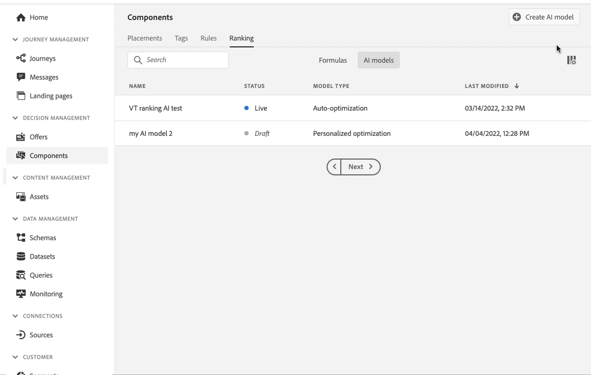

# Versionsinformation {#release-notes}

På den här sidan listas alla nya funktioner och förbättringar i [!DNL Journey Optimizer]. Du kan även läsa [senaste dokumentationsuppdateringar](documentation-updates.md) sida för fler ändringar.

[!DNL Adobe Journey Optimizer] är inbyggd i [!DNL Adobe Experience Platform] och ärver av sina senaste innovationer och förbättringar. Läs mer om de här ändringarna i [Versionsinformation för Adobe Experience Platform](https://experienceleague.adobe.com/docs/experience-platform/release-notes/latest.html){target=&quot;_blank&quot;}.

 Registrera dig för [Adobe Journey Optimizer kvartalsvis nyhetsbrev](https://www.adobe.com/subscription/Adobe_Journey_Optimizer_NL.html){target=&quot;_blank&quot;} idag och få de senaste produktuppdateringarna, spännande historier, användningsexempel, tips och mycket annat levererat direkt till inkorgen varje kvartal.

## Version från maj 2022 {#may-2022-release}

### Nya funktioner

<table>
<thead>
<tr>
<th><strong>Regler för meddelandefrekvens</strong> </th>
</tr>
</thead>
<tbody>
<tr>
<td>

Nu kan du ange affärsregler för flera kanaler som automatiskt utesluter överbegärda profiler från meddelanden och åtgärder.

Mer information finns i den <a href="../configuration/frequency-rules.md">detaljerade dokumentationen</a>.

</td>
</tr>
</tbody>
</table>

<!--table>
<thead>
<tr>
<th><strong>Email BCC</strong> </th>
</tr>
</thead>
<tbody>
<tr>
<td>

Availability date: <strong>May, 31</strong>

You can now use the Email BCC (blind carbon copy) capability to store emails sent by Adobe Journey Optimizer. Enable this option in your email presets so that every email sent is blind-copied to your BCC address.

For more information, refer to the <a href="../configuration/email-settings.md#bcc-email">detailed documentation</a>.

</td>
</tr>
</tbody>
</table-->

<table>
<thead>
<tr>
<th><strong>Beslutshantering - Automatisk optimeringsmodell för AI-rankning</strong> </th>
</tr>
</thead>
<tbody>
<tr>
<td>

Du kan nu använda utbildade modellsystem i Beslutshantering. Den nya funktionen rankar erbjudanden som kan visas för en viss profil.

Mer information finns i den <a href="../offers/offer-activities/configure-offer-selection.md#use-ranking-strategy">detaljerade dokumentationen</a>.

</td>
</tr>
</tbody>
</table>

<!--table>
<thead>
<tr>
<th><strong>Attribute-based Access Control (ABAC)</strong> </th>
</tr>
</thead>
<tbody>
<tr>
<td>

Permission management in Journey Optimizer has been extended to data access. You can now manage data access for specific teams or groups of users (i.e. internal, external, 3rd parties) ​and manage access to specific types of data (i.e. Sensitive Personal Data/SPD).

This capability is available for a limited set of customers.

For more information, refer to the <a href="../landing-pages/create-lp.md">detailed documentation</a>.

</td>
</tr>
</tbody>
</table-->

<table>
<thead>
<tr>
<th><strong>Journey Optimizer granskningsloggar</strong> </th>
</tr>
</thead>
<tbody>
<tr>
<td>

Nu kan du övervaka åtgärder som utförs av användare på Adobe Journey Optimizer-resurser.

Mer information finns i den <a href="../reports/audit-logs.md">detaljerade dokumentationen</a>.

</td>
</tr>
</tbody>
</table>

### Förbättringar

**Personalisering**

* **Ny hjälpfunktion för dolda tecken** - `mask` hjälpfunktionen gör att du kan ersätta en del av en sträng med&quot;X&quot;-tecken. [Läs mer](../personalization/functions/string.md#mask)

**Landningssidor**

* **Landningssidor utan formulär** - Nu kan du skapa och publicera en landningssida som inte innehåller något formulär och som inte kräver någon åtgärd från besökarna.
* **Mallar för landningssidor** - Du kan nu spara en landningssida som en mall och återanvända den när du skapar andra landningssidor. [Läs mer](../landing-pages/lp-templates.md)
* **Tillbaka till den primära sidan** - Du kan nu lägga till en länk till den primära sidan från en undersida på samma landningssida.
* **Anpassat JavaScript-stöd** - Du kan nu lägga till egen JavaScript-kod i innehållet på landningssidan för att utföra avancerad formatering eller lägga till anpassade beteenden på landningssidorna.	[Läs mer](../landing-pages/lp-custom-js.md)

**Resor**

* **Lässegment** - Enbildsresor för Läs segment har flyttats till slutstatus 30 dagar efter det att resan körts. För schemalagda läs-segment är det 30 dagar efter körningen av den sista förekomsten. [Läs mer](../building-journeys/read-segment.md)
* **Uttrycksredigerare** - [limit](../building-journeys/functions/functionlimit.md) -funktionen har lagts till så att du kan begränsa antalet objekt i en lista. The [sortera](../building-journeys/functions/functionsort.md) kan du nu sortera ut ett listobjekt. Stödet för listObject har också lagts till i [urskilja](../building-journeys/functions/functiondistinct.md) och [clearWithNull](../building-journeys/functions/functiondistinctwithnull.md) funktioner.

**Administrering**

* **Uppdatering av kontrollpanelen för licensanvändning** - Kontrollpanelen för licensanvändning finns i [!DNL Adobe Journey Optimizer] användargränssnittet återspeglar nu det korrekta värdet för **Licensierad** Genomsnittlig profilrikedom. Du kommer att se en minskning i den här måttvisningen, vilket innebär att licensgränsen nu rapporteras korrekt. [Läs mer](../segment/licence-usage.md)
