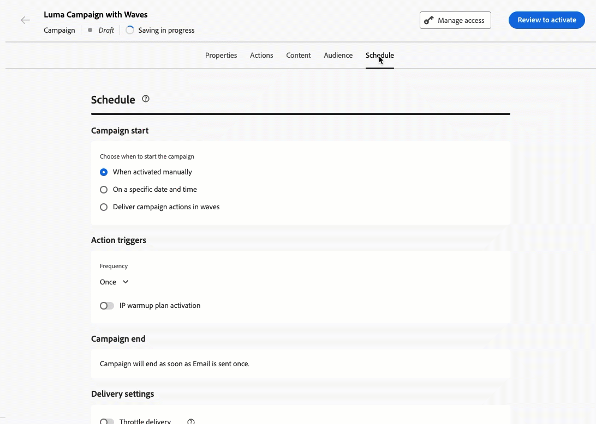
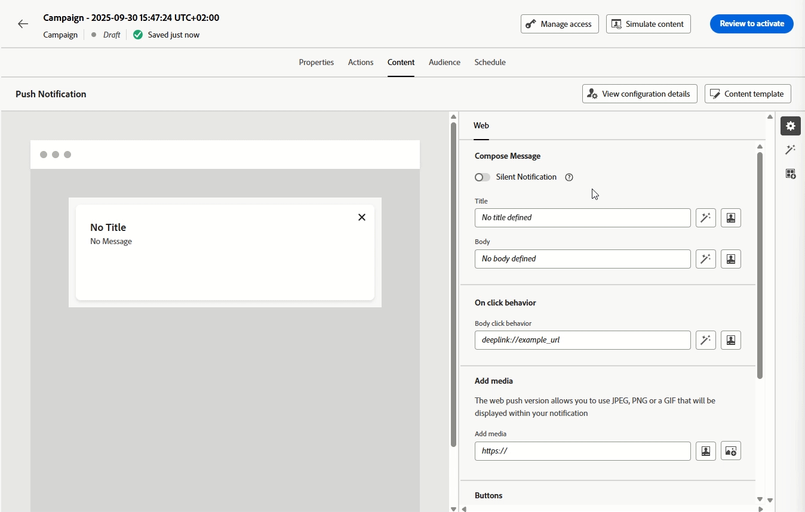

# Versionsinformation {#release-notes}

>[!CONTEXTUALHELP]
>id="ajo_homepage_card1"
>title="Nyheter?"
>abstract="**Adobe Journey Optimizer** levererar kontinuerligt nya funktioner, förbättringar av befintliga funktioner och felkorrigeringar. Alla ändringar konsolideras den sista veckan i varje månad i versionsinformationen."

[!DNL Adobe Journey Optimizer] följer en kontinuerlig leveransmodell som gör att Adobe kan leverera nya funktioner, förbättringar och korrigeringar kontinuerligt. Detta tillvägagångssätt möjliggör en skalbar, fasad driftsättning av funktioner för att säkerställa prestanda och stabilitet i alla miljöer.

På grund av den här modellen uppdateras versionsinformationen mellan månadsversionerna. Fullständig information om frisläppningscykeln och tillgänglighetsfaserna finns i [Journey Optimizer versionscykel](releases.md).

[!DNL Adobe Journey Optimizer] är inbyggd i [!DNL Adobe Experience Platform] och ärver från de senaste innovationerna och förbättringarna. Läs mer om de här ändringarna i [Adobe Experience Platform versionsinformation](https://experienceleague.adobe.com/docs/experience-platform/release-notes/latest.html){target="_blank"}.

## Mars 26 förhandsversionsinformation {#march-26-rn}

**Förhandsversionsinformationen nedan kan komma att ändras utan föregående meddelande till releasedatumet**. Länkar, skärmar och uppdaterad dokumentation publiceras i versionsinformationen på releasedatum.

Se även [Förhandsversionsinformation för Adobe Experience Platform](https://experienceleague.adobe.com/en/docs/experience-platform/release-notes/pre-release-notes){target="_blank"}.

**Releasedatum**: 24-25 mars 2026

### Nya funktioner {#march-26-features}

<!--
<table>
<thead>
<tr>
<th><strong>LLM email optimizer</strong> </th>
</tr>
</thead>
<tbody>
<tr>
<td>

You can now optimize your email content for deliverability using large language model (LLM) technology. The LLM email optimizer analyzes your email content and provides actionable recommendations to improve sender reputation, avoid spam filters, and enhance overall deliverability performance.

</td>
</tr>
</tbody>
</table>
-->

<table>
<thead>
<tr>
<th><strong>Journey Agent: Skapa en välstrukturerad kampanj</strong> </th>
</tr>
</thead>
<tbody>
<tr>
<td>

<strong>Journey Agent</strong>, som drivs av Adobe Experience Platform Agent Orchestrator, kan nu skapa kompletta <strong>Samordnade kampanjer</strong> med ett naturligt språkgränssnitt. Beskriv kampanjens mål och krav på ett enkelt språk så konfigurerar Journey Agent kampanjstrukturen, aktiviteterna och målgruppsanpassningen åt er.

</td>
</tr>
</tbody>
</table>

<table>
<thead>
<tr>
<th><strong>Journey Agent: Skapa kanalinnehåll</strong> </th>
</tr>
</thead>
<tbody>
<tr>
<td>

<strong>Adobe Experience Platform Agent Orchestrator</strong>, <strong>Journey Agent</strong> är tillgängligt i Journey Optimizer och gör att du kan analysera resor via ett naturligt språkgränssnitt. Nu kan du även generera och hantera kanalspecifikt innehåll direkt i Journey Agent, skapa innehåll för kanaler som e-post och push, tillämpa och förhandsgranska mallar, förfina ton och stil genom uppmaningar och öppna innehåll i <strong>Content Designer</strong> för kontextredigering.

Den här funktionen är endast tillgänglig för en uppsättning organisationer (begränsad tillgänglighet). Kontakta din Adobe-representant för att få åtkomst.

Mer information finns i den <a href="https://experienceleague.adobe.com/docs/experience-cloud-ai/experience-cloud-ai/agents/ajo-agent.html">detaljerade dokumentationen</a>.

Tillgänglighetsdatum: 4 mars 2026

</td>
</tr>
</tbody>
</table>

<table>
<thead>
<tr>
<th><strong>Journey Arbitration - AI Models</strong> </th>
</tr>
</thead>
<tbody>
<tr>
<td>

Nu kan ni använda AI-modeller i era rankningsformler för att automatiskt öka poängen för reseprioritet baserat på kundprofilattribut och sammanhangsberoende faktorer, så att kunderna kan komma in på de mest relevanta resorna.

Den här funktionen är endast tillgänglig för en uppsättning organisationer (begränsad tillgänglighet). Kontakta din Adobe-representant för att få åtkomst.

</td>
</tr>
</tbody>
</table>

<table>
<thead>
<tr>
<th><strong>Transaktionsmeddelanden i samordnade kampanjer</strong> </th>
</tr>
</thead>
<tbody>
<tr>
<td>

Samordnade kampanjer har nu stöd för <strong>transaktionsmeddelanden</strong>, vilket gör att du kan utlösa händelsestyrda meddelanden i realtid, till exempel orderbekräftelser, bokningsmeddelanden och kontouppdateringar, direkt i kampanjarbetsflödet.

</td>
</tr>
</tbody>
</table>

<table>
<thead>
<tr>
<th><strong>Utlösa samordnade kampanjer med API</strong> </th>
</tr>
</thead>
<tbody>
<tr>
<td>

Nu kan du utlösa en orkestrerad kampanj via API. Konfigurera målkampanjen som"utlöst av en signal" och publicera den. Använd sedan ett API-anrop för att starta kampanjen. API-anropet kan innehålla parametrar som ska vara tillgängliga som variabler i den utlösta kampanjen.

</td>
</tr>
</tbody>
</table>

<table>
<thead>
<tr>
<th><strong>Inkrementell frågeaktivitet i samordnade kampanjer</strong> </th>
</tr>
</thead>
<tbody>
<tr>
<td>

En ny <strong>inkrementell frågeaktivitet</strong> är nu tillgänglig i Orchestrated Campaigns. Den här aktiviteten efterfrågar endast nya eller uppdaterade poster sedan den senaste arbetsflödeskörningen, vilket avsevärt minskar bearbetningstiden och förbättrar effektiviteten för återkommande kampanjer som riktar sig mot stora datauppsättningar.

</td>
</tr>
</tbody>
</table>

<table>
<thead>
<tr>
<th><strong>Testaktivitet i samordnade kampanjer</strong> </th>
</tr>
</thead>
<tbody>
<tr>
<td>

En ny <strong>Test</strong>-aktivitet är nu tillgänglig i Orchestrated Campaigns. Den här aktiviteten dirigerar arbetsflödeskörningen till olika grenar baserat på definierade villkor, vilket gör att du kan validera kampanjlogik och konfigurationer innan du aktiverar liveleveranser.

</td>
</tr>
</tbody>
</table>

<table>
<thead>
<tr>
<th><strong>Kryptering av URL-parametrar</strong> </th>
</tr>
</thead>
<tbody>
<tr>
<td>

URL-parametrar för spårning av länkar och landningssidor kan nu krypteras, vilket ger ett extra säkerhetslager för känsliga parameterdata.

<ul>
<li>Registrera och hantera krypteringsnycklar i ett dedikerat <strong>Administration</strong> -register.</li>
<li>Använd den nya krypteringshjälpen i uttryck för att kryptera känsliga data i spårningslänkar och URL:er för landningssidor för de frågeparametrar som du vill skydda vid återgivningen.</li>
</ul>

Den här funktionen är endast tillgänglig för en uppsättning organisationer (begränsad tillgänglighet). Kontakta din Adobe-representant för att få åtkomst.

</td>
</tr>
</tbody>
</table>

<table>
<thead>
<tr>
<th><strong>Optimering av resväg</strong> </th>
</tr>
</thead>
<tbody>
<tr>
<td>

Använd den nya Optimera-noden för att rikta in er på specifika målgrupper eller kör A/B-tester för att fastställa den bästa vägen för att uppfylla era affärsinriktade nyckeltal.
Med det här verktyget kan du testa och ändra, och anpassa kommunikation, sekvensering och timing för att nå dina kunder på bästa sätt.

Den här funktionen lanserades tidigare i begränsad tillgänglighet och är nu tillgänglig i alla miljöer (allmän tillgänglighet). <a href="../building-journeys/optimize.md">Läs mer</a>

</td>
</tr>
</tbody>
</table>

<table>
<thead>
<tr>
<th><strong>Stöd för datauppslagssökning på resor</strong> </th>
</tr>
</thead>
<tbody>
<tr>
<td>

Med en ny aktivitet på resorna, Dataset Lookup, kan du dynamiskt hämta data från Adobe Experience Platform postdatauppsättningar under körning. Genom att utnyttja den här funktionen kan ni få tillgång till data som kanske inte finns i profilen eller händelsens nyttolast, vilket säkerställer att era kundinteraktioner är både relevanta och aktuella. Den här funktionen lanserades tidigare i begränsad tillgänglighet och är nu tillgänglig i alla miljöer (allmän tillgänglighet). Mer information finns i den <a href="../building-journeys/dataset-lookup.md">detaljerade dokumentationen</a>.

</td>
</tr>
</tbody>
</table>

<table>
<thead>
<tr>
<th><strong>Åtgärdsaktiviteter för inbyggda kanaler har tagits bort</strong> </th>
</tr>
</thead>
<tbody>
<tr>
<td>

Efter den allmänna tillgängligheten för aktiviteten <strong>Åtgärd</strong> i februari 2026 har tidigare inbyggda kanalaktiviteter (e-post, push, SMS, in-app, webb, kodbaserad upplevelse och innehållskort) på arbetsytan nu tagits bort.

Du använder nu en enda <strong>åtgärdsaktivitet</strong> för att konfigurera alla kanalåtgärder och ersätta behovet av separata kanalspecifika noder.

Befintliga resor som använder äldre kanalaktiviteter fortsätter att fungera utan några ändringar eller migrering.

Mer information finns i den <a href="../building-journeys/journey-action.md">detaljerade dokumentationen</a>.

</td>
</tr>
</tbody>
</table>

<table>
<thead>
<tr>
<th><strong>Beslutsstöd i e-postkanal</strong> </th>
</tr>
</thead>
<tbody>
<tr>
<td>

Du kan nu använda <strong>Beslutsfattning</strong> för att anpassa och optimera innehållet i dina e-postmeddelanden. Utnyttja Priority Scores, Formulas eller AI Models för att visa de mest relevanta erbjudandena och innehållet för varje mottagare.

Den här funktionen lanserades tidigare i begränsad tillgänglighet och är nu tillgänglig i alla miljöer (allmän tillgänglighet). I den här allmänna tillgänglighetsversionen stöds nu spegelsidor.

Mer information finns i den <a href="../experience-decisioning/create-decision-policy.md">detaljerade dokumentationen</a>.

</td>
</tr>
</tbody>
</table>

<table>
<thead>
<tr>
<th><strong>AI-modellövervakning</strong> </th>
</tr>
</thead>
<tbody>
<tr>
<td>

Nu kan du övervaka hälsa, utbildningsstatus och prestanda för dina AI-modeller för beslut. På så sätt kan ni verifiera att kursen har lyckats, felsöka och förstå hur resultatet blir för att kunna välja de bästa erbjudandena för varje kund med hjälp av AI. Observera att den här funktionen endast är tillgänglig för <strong>Decision</strong> (inte för äldre beslutsmodeller).

Den här funktionen är för närvarande endast tillgänglig för <strong>personaliserade optimeringsmodeller</strong> (inte automatisk optimering).

Mer information finns i den <a href="../experience-decisioning/ranking/ai-model-observability.md">detaljerade dokumentationen</a>.

Tillgänglighetsdatum: 9 mars 2026

</td>
</tr>
</tbody>
</table>

<table>
<thead>
<tr>
<th><strong>Anpassade formulär på landningssidor</strong> </th>
</tr>
</thead>
<tbody>
<tr>
<td>

Nu kan du skapa <strong>anpassade formulär</strong> på landningssidor för att samla in specifika prenumerationsdata utöver vanliga anmälningsfält. Definiera egna formulärfält, valideringsregler och överföringsbeteenden för att stödja fler användningsområden för prenumeration och profiler.

Den här funktionen lanserades tidigare i begränsad tillgänglighet och är nu tillgänglig i alla miljöer (allmän tillgänglighet). <a href="../landing-pages/lp-forms.md">Läs mer</a>

</td>
</tr>
</tbody>
</table>

<table>
<thead>
<tr>
<th><strong>Inkorgen för meddelanden</strong> </th>
</tr>
</thead>
<tbody>
<tr>
<td>

En ny <strong>meddelandeinkorg</strong> är nu tillgänglig i Adobe Journey Optimizer, vilket ger en centraliserad vy över mottagna meddelanden i appen, push och SMS. Mottagarna kan få tillgång till och interagera med alla sina meddelanden på ett och samma ställe, vilket möjliggör ett större engagemang och scenarier för återengagemang.

</td>
</tr>
</tbody>
</table>

<table>
<thead>
<tr>
<th><strong>Konvertera bilder till e-postmallar</strong> </th>
</tr>
</thead>
<tbody>
<tr>
<td>

Nu kan du konvertera bilder till e-postmallar direkt i Journey Optimizer. Använd AI-baserad analys för att automatiskt generera strukturerade HTML-mallar från visuella referenser, vilket avsevärt minskar tiden för e-postdesign.

Den här funktionen lanserades tidigare i begränsad tillgänglighet och är nu tillgänglig i alla miljöer (allmän tillgänglighet). <a href="../content-management/image-to-html.md">Läs mer</a>

</td>
</tr>
</tbody>
</table>

<table>
<thead>
<tr>
<th><strong>Avancerad HTML-editor för e-postmallar</strong> </th>
</tr>
</thead>
<tbody>
<tr>
<td>

Med det avancerade HTML-läget för mallar för e-postinnehåll kan du redigera HTML-källan för ditt innehåll i e-postprogrammet Designer, lägga till avancerade uttryck (t.ex. villkor) i källan och växla mellan HTML-vyn och skrivbordsvyn utan att ändringarna går förlorade.

Den här funktionen är endast tillgänglig i innehållsmallar för e-postkanalen. Det finns för närvarande i begränsad tillgänglighet - kontakta din Adobe-representant för att få åtkomst.

Mer information finns i den <a href="../content-management/email-template-expert-mode.md">detaljerade dokumentationen</a>.

Tillgänglighetsdatum: 10 mars 2026

</td>
</tr>
</tbody>
</table>

<table>
<thead>
<tr>
<th><strong>Integrering av anpassade Firefly-modeller och tredjepartsmodeller för bildgenerering</strong> </th>
</tr>
</thead>
<tbody>
<tr>
<td>

Möjliggör smidig integrering av standardmodeller och anpassade Firefly-modeller, tillsammans med godkända bildmodeller från tredje part, för att ge större flexibilitet, kontroll och varumärkesanpassning vid generering av bilder.

Välj rätt modell för dina behov:

<ul><li> <strong>Adobe-modell</strong> (från Firefly Image Model 4) för omedelbar bildgenerering utan ytterligare konfiguration</li><li> <strong>Partnermodell</strong> (från Gemini 2.5 Flash) för specialfunktioner</li><li><strong>Anpassade modeller</strong> (varumärkesspecifika modeller som utbildats utifrån dina egna resurser) för varumärkesgenerering som exakt överensstämmer med din varumärkesidentitet, stil och visuella riktlinjer.</li></ul>

Mer information finns i den <a href="../content-management/generative-models.md">detaljerade dokumentationen</a>.

Tillgänglighetsdatum: 2 mars 2026

</td>
</tr>
</tbody>
</table>

<table>
<thead>
<tr>
<th><strong>Live Activity for iOS</strong> </th>
</tr>
</thead>
<tbody>
<tr>
<td>

Ge realtidsupplevelserna direkt till kundens Lock Screens och Dynamic Island med iOS Live Activity i Adobe Journey Optimizer. Leverera live-uppdateringar, från orderspårning och flygstatus till händelseräkningar, livepoäng och leveransförlopp, utan att användarna behöver öppna er app. Håll er målgrupp informerad och engagerad i precis rätt ögonblick, precis där de är.

Den här funktionen lanserades tidigare i betaversionen och är nu tillgänglig i alla miljöer (allmän tillgänglighet).

Mer information finns i den <a href="../mobile-live/get-started-mobile-live.md">detaljerade dokumentationen</a>.

Tillgänglighetsdatum: 3 mars 2026

</td>
</tr>
</tbody>
</table>

### Förbättringar {#march-26-improv}

Förbättringar i den här versionen visas nedan.

#### Resor

* **Påfyllnadssändning av utgående meddelanden på resor** - Du kan nu schemalägga att meddelanden från Journey Optimizer-resor levereras i kontrollerade batchar över tid. [Läs mer](../building-journeys/send-using-waves.md)

  Tidigare släppt i Begränsad tillgänglighet för användning under resor är den här funktionen nu tillgänglig i alla miljöer (allmän tillgänglighet).

  Tillgänglighetsdatum: 16 mars 2026

* **Pausa och återuppta detaljer i färdens tekniska detaljer** - Resan **teknisk information** innehåller nu ytterligare information om paus och återupptagning: datum och tid för senaste paus och återupptagning, visningsnamnet och den interna identifieraren för den användare som utförde varje åtgärd samt en fullständig uppsättning pausade reseinställningar som pausbeteende, maximal paustid och automatiskt återupptagningstillstånd. [Läs mer](../building-journeys/journey-properties.md)

  Tillgänglighetsdatum: 2 mars 2026

#### Rapportering

* **Uteslut båda klickningarna för e-post- och SMS-rapportering** - E-post- och SMS-rapportering filtrerar nu automatiskt bort båda klickningarna från klickmätvärden, vilket ger mer korrekta interaktionsdata och förhindrar att automatiserad trafik ökar prestandamängderna.

* **Sändningsoptimering: Uppdaterad kontrollplats och ny lyftrapport** - STO-kontroller (Send-Time Optimization) har flyttats till Åtgärdskonfigurationsmenyn. Dessutom finns det nu en ny avbrottsrapport i Journeys-rapporter som mäter effekten av STO på kampanjens resultatstatistik.

#### E-postdesigner

* **Anpassning i öppen tid med Dynamic Media (Beta)** - Nu kan du anpassa e-postinnehåll i öppen tid med Adobe Dynamic Media-resurser, vilket aktiverar mottagarspecifika bilder och bilder i realtid som genereras dynamiskt baserat på varje mottagares attribut när e-postmeddelandet öppnas. Den här funktionen finns för närvarande i Beta.

* **E-post-Designer visas i Unified Shell** - E-post-Designer visas nu i Unified Shell-upplevelsen, vilket ger en konsekvent navigerings- och rubrikupplevelse som överensstämmer med andra Adobe-program.

* **Stöd för textläge i fragment** - Om du vill ha stöd för textbaserade e-postarbetsflöden kan du nu skapa och hantera textversioner av dina visuella fragment för optimal användning i den oformaterade textversionen av e-postmeddelanden som innehåller det fragmentet.

  **Varning!** När du använder ett fragment som skapades före den aktuella versionen kan fragmenttextversionen återges felaktigt, både i e-postmeddelandet och i det slutliga e-postmeddelandet som skickas till mottagarna. För bästa resultat med äldre fragment kan du redigera, spara och publicera om varje fragment.

#### Beslut

* **Referensfeed för uttrycksfragmentsreferens i Edge Decisioning** - Den här förbättringen tillåter att ändringar i fragmentreferenser automatiskt återspeglas i alla objekt som refererar till fragment, utan att något behöver uppdateras manuellt (kampanjen eller beslutsprincipen publiceras om).

* **Valfria fragment i beslutsobjekt** - När du använder fragment i beslutsobjekt kan du nu göra ett fragment valfritt så att om det inte är tillgängligt för tillfället på Edge hoppas det över och resan eller kampanjen fortsätter att återge i stället för att misslyckas.

#### Konfiguration

* **Mappar för resor och kampanjer** - Nu kan du ordna dina resor och kampanjer i mappar, vilket möjliggör strukturerad navigering och enklare hantering för team som arbetar med stora innehållsvolymer. Den här funktionen är endast tillgänglig för en uppsättning organisationer (begränsad tillgänglighet). Kontakta din Adobe-representant för att få åtkomst.

* **Datauppsättningen för den sekundära mottagarfeedbacken för AJO byter namn** - datauppsättningen `AJO Email BCC Feedback Event` har bytt namn till datauppsättningen `AJO Secondary Recipient Feedback Event`. Effekten varierar beroende på din situation:

   * **Befintliga användare**: Endast visningsnamnet uppdateras. Det underliggande tabellnamnet ändras inte.
   * **Nya användare och sandlådor**: Både visningsnamnet och tabellnamnet återspeglar det nya namnet.
   * **Befintliga användare med nya sandlådor**: Både visningsnamnet och tabellnamnet uppdateras till det nya namnet.

  Tillgänglighetsdatum: 2 mars 2026

#### Samordnade kampanjer

* **Globala variabler i samordnade kampanjer** - Orchestrated Campaigns har nu stöd för globala variabler som kan definieras en gång och återanvändas i alla aktiviteter i ett arbetsflöde, vilket förenklar konfigurationen och säkerställer konsekvens i dynamiska värden, uttryck och innehållspersonalisering.

* **Förenklad målgruppsdimension i samordnade kampanjer** - Nu kan du enkelt välja eller automatiskt minska rätt målgruppsanpassning och sekundära dimensioner i samordnade kampanjer för korrekt och effektiv målgruppsaktivering.

## Versionsinformation 26 februari {#feb-26-01-rn}

Avsnitten [Nya funktioner](#feb-26-01-features) och [Förbättringar](#feb-26-01-improv) omfattar funktioner som redan är tillgängliga. <!--The [Coming soon](#coming-soon) section lists features and improvements scheduled for release later in February.-->

<!--**The pre-release notes below are subject to change without prior notice until the release availability date**. Links, screens and updated documentation are published in the release notes, at the release date.

See also [Adobe Experience Platform Pre-release notes](https://experienceleague.adobe.com/en/docs/experience-platform/release-notes/pre-release-notes){target="_blank"}.-->

<!--**Release date**: February 17-18, 2026-->

### Nya funktioner {#feb-26-01-features}

<table>
<thead>
<tr>
<th><strong>Skiljeförfarande på resan</strong> </th>
</tr>
</thead>
<tbody>
<tr>
<td>

Du kan nu använda <strong>rankningsformler</strong> för att automatiskt öka prioritetspoängen för resan baserat på kundprofilattribut och sammanhangsberoende faktorer, så att kunderna kan komma in på de mest relevanta resorna.

Den här funktionen är endast tillgänglig för en uppsättning organisationer (begränsad tillgänglighet). Kontakta din Adobe-representant för att få åtkomst.

Mer information finns i den <a href="../conflict-prioritization/journey-ranking-formulas.md">detaljerade dokumentationen</a>.

Tillgänglighetsdatum: 24 februari 2026

</td>
</tr>
</tbody>
</table>

<table>
<thead>
<tr>
<th><strong>Verksamhet under resor</strong> </th>
</tr>
</thead>
<tbody>
<tr>
<td>

Journey Optimizer har stöd för en ny generisk <strong>åtgärdsaktivitet</strong> som gör att du kan konfigurera både enskilda åtgärder och inkommande åtgärdsgrupper för flera åtgärder, vilket ger en smidig åtgärdskonfiguration på arbetsytan. Den här nya funktionen gör det möjligt att:

<ul>
<li>En förenklad inbyggd åtgärdskonfiguration på arbetsytan för resan.</li>
<li>Kapaciteten för att skapa inkommande åtgärdsgrupper med flera åtgärder.</li>
<li>Möjlighet att lägga till optimering till alla inbyggda kanalåtgärder.</li>
<li>Möjlighet att lägga till både experimentella och flerspråkiga alternativ i alla funktionsmakron.</li>
</ul>

Den här funktionen lanserades tidigare i begränsad tillgänglighet och är nu tillgänglig i alla miljöer (allmän tillgänglighet).

Mer information finns i den <a href="../building-journeys/journey-action.md">detaljerade dokumentationen</a>.

Tillgänglighetsdatum: 20 februari 2026

<strong>Obs!</strong> Alla inbyggda kanaler är nu tillgängliga via åtgärdsreseaktiviteten. Gamla inbyggda kanalaktiviteter kommer att bli inaktuella i mars-versionen. Befintliga resor med äldre åtgärder kommer att fortsätta att fungera som de är - ingen migrering krävs.

</td>
</tr>
</tbody>
</table>

<table>
<thead>
<tr>
<th><strong>Påfyllnadssändning av utgående meddelanden</strong> </th>
</tr>
</thead>
<tbody>
<tr>
<td>

Nu kan ni schemalägga meddelanden från Journey Optimizer kampanjer eller resor som ska levereras i kontrollerade omgångar över tid.

Wave-sändning ger följande fördelar:

<ul>
<li>Bättre leveransförmåga - Spridning skickar över tid för att bevara ett starkt avsändarrykte och minska risken för att flaggas som skräppost.</li>
<li>Belastningskontroll - Undvik överväldigande system längre fram i kedjan (t.ex. callcenters, landningssidor) genom att begränsa hur många meddelanden som skickas samtidigt.</li>
<li>Användningsfall med stor volym och tidskänslighet - Passar för stora målgrupper eller när du behöver styra timing (t.ex. callcenters kapacitet, uppfartsavtal eller tidsbundna erbjudanden).</li>
</ul>

I <strong>kampanjer</strong> är den här funktionen tillgänglig för alla miljöer (allmän tillgänglighet). Mer information finns i den <a href="../campaigns/send-using-waves.md">detaljerade dokumentationen</a>.

På <strong>resor</strong> är den här funktionen bara tillgänglig för en uppsättning organisationer (begränsad tillgänglighet) - Kontakta din Adobe-representant för att få åtkomst. Mer information finns i den <a href="../building-journeys/send-using-waves.md">detaljerade dokumentationen</a>.

Tillgänglighetsdatum: 19 februari 2026

</td>
</tr>
</tbody>
</table>

<table>
<thead>
<tr>
<th><strong>Migrera underdomäner till anpassad delegering</strong> </th>
</tr>
</thead>
<tbody>
<tr>
<td>

Nu kan du migrera underdomäner med CNAME-delegeringsläget till anpassad delegering direkt från gränssnittet, så att du kan följa striktare säkerhetsregler i enlighet med företagets riktlinjer utan att behöva skapa kanalkonfigurationer på nytt.

Den här funktionen är endast tillgänglig för en uppsättning organisationer (begränsad tillgänglighet). Kontakta din Adobe-representant för att få åtkomst.

Mer information finns i den <a href="../configuration/custom-subdomain-migration.md">detaljerade dokumentationen</a>.

Tillgänglighetsdatum: 19 februari 2026

</td>
</tr>
</tbody>
</table>

<table>
<thead>
<tr>
<th><strong>Webbpush-meddelandekanal</strong> </th>
</tr>
</thead>
<tbody>
<tr>
<td>

Adobe Journey Optimizer har nu stöd för <strong>webb-push-meddelanden</strong>, vilket utökar push-kanalen bortom mobilen. Du kan enkelt leverera meddelanden till både <strong>mobilwebbläsare och datorwebbläsare</strong>, så att du kan nå kunder direkt på deras enheter utan att behöva använda en app. Den här förbättringen gör att ni kan engagera användarna med rätt, personaliserade meddelanden i realtid, och utnyttja samma arbetsflöden och målgruppsfunktioner som redan finns för mobilpush.

Den här funktionen lanserades tidigare i Beta och är tillgänglig i alla miljöer (allmän tillgänglighet).

Mer information finns i den <a href="../push/push-configuration-web.md">detaljerade dokumentationen</a>.

Tillgänglighetsdatum: 13 februari 2026

</td>
</tr>
</tbody>
</table>

<table>
<thead>
<tr>
<th><strong>Aktivitet för innehållsbeslut</strong> </th>
</tr>
</thead>
<tbody>
<tr>
<td>

En ny <strong>aktivitet för innehållsbeslut</strong> är nu tillgänglig på arbetsytan för att integrera personaliserade erbjudanden direkt i kundresorna. Med den här aktiviteten kan ni leverera beslutsbaserat innehåll och hänvisa till dessa erbjudanden under hela kundresan, under villkor för att skapa kvalificeringsbaserade förgreningar, i anpassade åtgärder för att skicka erbjudandedata till externa system och i andra aktiviteter för att skapa helt personaliserade kundupplevelser.

Den här funktionen lanserades tidigare i begränsad tillgänglighet och är nu tillgänglig i alla miljöer (allmän tillgänglighet).

Mer information finns i den <a href="../building-journeys/content-decision.md">detaljerade dokumentationen</a>.

Tillgänglighetsdatum: 10 februari 2026

</td>
</tr>
</tbody>
</table>

<table>
<thead>
<tr>
<th><strong>Verktyg-API:er för självbetjäningsmigrering</strong> </th>
</tr>
</thead>
<tbody>
<tr>
<td>

Migreringsverktygs-API:er är nu tillgängliga för programmatisk migrering av <strong>beslutshantering</strong>-entiteter till <strong>beslutshantering</strong>, med:

<ul>
<li>Flexibla migreringsomfång (sandlåda, erbjudande eller beslutsnivå)</li>
<li>Automatisk beroendeanalys och validering</li>
<li>Återställningsstöd för slutförda migreringar</li>
<li>Detaljerade migreringsrapporter med objektmappningar</li>
</ul>

Mer information finns i den <a href="../experience-decisioning/decisioning-migration-api.md">detaljerade dokumentationen</a>.

Tillgänglighetsdatum: 3 februari 2026

</td>
</tr>
</tbody>
</table>

<table>
<thead>
<tr>
<th><strong>Övervakning av anpassade åtgärder</strong> </th>
</tr>
</thead>
<tbody>
<tr>
<td>

Få djupare insikter i hälsa och prestanda för era anpassade åtgärdsslutpunkter med en ny kontrollpanel och förbättrade händelsedata för kundsteg. Spåra lyckade samtal, fel, dataflöde, svarstider och väntetider för kön för att snabbt förstå när, var och varför avvikelser inträffar.

Den här funktionen lanserades tidigare i begränsad tillgänglighet och är nu tillgänglig i alla miljöer (allmän tillgänglighet).

Mer information finns i den <a href="../action/reporting.md">detaljerade dokumentationen</a>.

Tillgänglighetsdatum: 3 februari 2026

</td>
</tr>
</tbody>
</table>

<table>
<thead>
<tr>
<th><strong>Beslutsstöd i SMS-kanal</strong> </th>
</tr>
</thead>
<tbody>
<tr>
<td>

Ni kan nu personalisera och optimera innehållet i era SMS-meddelanden med Beslutsfattning. Använd prioriteringspoäng, formler eller AI-modeller för att visa det bästa innehållet för era kunder.

Mer information finns i den <a href="../experience-decisioning/create-decision.md">detaljerade dokumentationen</a>.

Tillgänglighetsdatum: 2 februari 2026

</td>
</tr>
</tbody>
</table>

### Förbättringar {#feb-26-01-improv}

Förbättringar i den här versionen visas nedan.

#### Konfiguration

* **Upplev händelseanvändning i reseuttryck** - Från och med 1 april 2026 stöds inte längre användningen av upplevelsehändelseattribut i reseuttryck för organisationer som inte har använt den här funktionen de senaste 90 dagarna. Den här funktionen har redan varit otillgänglig för nya kundorganisationer sedan 8 juli 2025. Mer information finns i [Upplevelsesökning under resor](../building-journeys/exp-event-lookup.md).

#### Innehållshantering

<!--
* **Update brands with new color tab** - Brand guidelines help ensure your brand is presented consistently across all touchpoints. The new <strong>Colors</strong> section defines the standards for your brand's color system, outlining how colors are selected, organized, and applied across experiences. It ensures consistent use of primary, secondary, accent, and neutral colors to support a cohesive, accessible, and recognizable brand identity. [Read more](../content-management/brands.md)
-->

* **Använd teman för att konvertera bilder till e-postmallar** - När du konverterar en bild till en e-postmall i Journey Optimizer kan du nu använda ett tema som indata så att den genererade HTML följer varumärkesparametrarna. Formatering som bakgrundsfärg, knappfärg, teckensnitt, radavstånd, marginaler och utfyllnad tillämpas automatiskt, vilket minskar det manuella arbetet och ger en mall som är klar att användas med minimala redigeringar. [Läs mer](../content-management/image-to-html.md)

  Tillgänglighetsdatum: 17 februari 2026.

<!--* **Text mode for fragments** - You can now create and manage text versions of your fragments, supporting workflows that rely on plain text content and providing the same flexibility as in email content. [Read more](../content-management/create-fragments.md)-->

#### E-postdesigner

* **Textindrag** - Du kan nu använda anpassningsbara vänsterindrag på den första raden med stycken i textkomponenter direkt från egenskapspanelen. <!--The new **Indentation** control lets you define indentation in pixels or percentage via a numeric input or slider, with live preview on the canvas. -->Detta förbättrar läsbarheten för innehåll i lång form, t.ex. redigeringar och artiklar. [Läs mer](../email/get-started-email-style.md)

  Tillgänglighetsdatum: 18 februari 2026.

#### Beslut

* **Stöd för inkommande trafik från Edge för användning av Adobe Experience Platform-data i beslut** - Om du använder Adobe Experience Platform-data i beslut stöds nu även kantinkommande användningsfall, förutom e-post och anpassade åtgärder på resor. [Läs mer](../experience-decisioning/aep-data-exd.md)

  Den här funktionen är endast tillgänglig för en uppsättning organisationer (begränsad tillgänglighet). Kontakta din Adobe-representant för att få åtkomst.

* **Koppla fragment till beslutsobjekt** - Journey Optimizer kan nu koppla fragment till beslutsobjekt som kan utnyttjas i kodbaserade upplevelsekampanjer via beslutspolicyer. [Läs mer](../experience-decisioning/fragments-decision-policies.md)

  Den här funktionen lanserades tidigare i begränsad tillgänglighet och är nu tillgänglig i alla miljöer (allmän tillgänglighet).

  Tillgänglighetsdatum: 12 februari 2026.

#### Personalisering

* **Hjälp för körningsmetadata** - Hjälpfunktionen `executionMetadata` är nu tillgänglig för alla Journey Optimizer-kunder. Använd den för att dynamiskt lägga till sammanhangsbaserad information till alla interna åtgärder och hämta in den i en datauppsättning för export till externa system. [Läs mer](../personalization/functions/helpers.md#execution-metadata)

  Den här funktionen lanserades tidigare i begränsad tillgänglighet och är nu tillgänglig i alla miljöer (allmän tillgänglighet).

  Tillgänglighetsdatum: 20 februari 2026.

#### SMS

* **SMS-webbhooks** - Webbhooks stöds nu av alla SMS-leverantörer. Du kan konfigurera varje webkrok baserat på dess avsedda syfte: inkommande webbhooks för att fånga inkommande meddelanden och Feedback-webbhooks för att ta emot leveranskvitton, statusuppdateringar och andra meddelanderelaterade händelser. [Läs mer](../sms/sms-webhook.md)

  Tillgänglighetsdatum: 2 februari 2026.

<!--## Coming soon {#coming-soon}

The features and improvements below are planned for release later in February. Release dates and scope may change without prior notice.

### Improvements {#coming-soon-improv}

* **Decisioning preview in Code-based Experience channel** - You can now preview decision items when configuring Decisioning with the Code-based Experience channel. Preview is available directly in the authoring interface before going live.

  Availability date: February 18, 2026
-->

