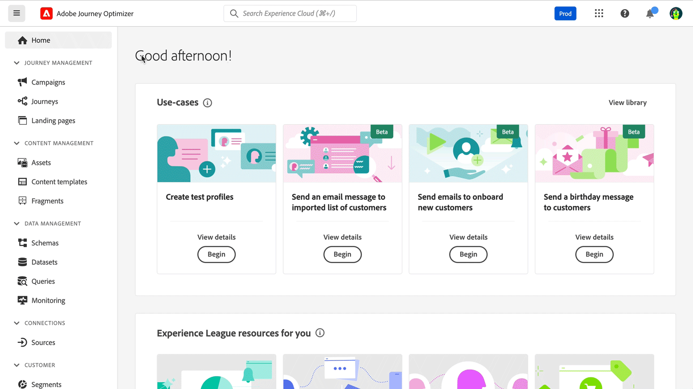

# Versionsinformation {#release-notes}

[!DNL Adobe Journey Optimizer] levererar kontinuerligt nya funktioner, förbättringar av befintliga funktioner och felkorrigeringar. Alla ändringar konsolideras den sista veckan i varje månad i versionsinformationen.

Tidigare versionsinformation finns i [den här sidan](release-notes-2022.md). Du kan även läsa [senaste dokumentationsuppdateringar](documentation-updates.md) sida för fler ändringar.

[!DNL Adobe Journey Optimizer] är inbyggd i [!DNL Adobe Experience Platform] och ärver av sina senaste innovationer och förbättringar. Läs mer om de här ändringarna i [Versionsinformation för Adobe Experience Platform](https://experienceleague.adobe.com/docs/experience-platform/release-notes/latest.html){target="_blank"}.

 Registrera dig för [Adobe Journey Optimizer kvartalsvis nyhetsbrev](https://www.adobe.com/subscription/Adobe_Journey_Optimizer_NL.html){target="_blank"} idag och få de senaste produktuppdateringarna, spännande historier, användningsexempel, tips och mycket annat levererat direkt till din inkorg varje kvartal.

## Uppdateringar juli 2023

<table>
<thead>
<tr>
<th><strong>Målgruppssammansättning</strong> </th>
</tr>
</thead>
<tbody>
<tr>
<td>

Nu kan du skapa arbetsflöden för kompositioner för att kombinera befintliga Adobe Experience Platform-målgrupper till en visuell arbetsyta och använda olika aktiviteter (dela, berika...) för att skapa nya målgrupper. Nyligen skapade målgrupper sparas i Adobe Experience Platform tillsammans med befintliga målgrupper och kan utnyttjas i Journey Optimizer kampanjer för att nå ut till kunder.

Mer information finns i den <a href="../audience/get-started-audience-orchestration.md">detaljerade dokumentationen</a>.

</td>
</tr>
</tbody>
</table>

## Versionsinformation juni 2023 {#june-rn-2023}

<table>
<thead>
<tr>
<th><strong>API-utlösta kampanjer för användningsfall inom marknadsföring</strong> </th>
</tr>
</thead>
<tbody>
<tr>
<td>

Nu kan ni använda API:er för att utlösa marknadsföringskampanjer i Adobe Journey Optimizer från ett externt system.

Fram till den här versionen täckte kampanjer som utlöstes av API olika operativa och transaktionsrelaterade meddelandebehov, som lösenordsåterställning eller OTP-token, men kunde inte användas för att skapa marknadsföringskampanjer. Tillgängliga kanaler för API-utlösta kampanjer är: E-post, SMS och push-meddelanden.

Mer information finns i den <a href="../campaigns/api-triggered-campaigns.md">detaljerade dokumentationen</a>.
</td>
</tr>
</tbody>
</table>

<!--
### Improvements {#june-2023-improvements}

**Audiences**

Enhancements have been made to the audience picker in journeys or campaigns, with the addition of new columns displaying the origin and update frequency of audiences.

**Journeys**

You can now leverage API call responses in custom actions and orchestrate your journey based on these responses.
-->

<!--
## June 2023 early release notes {#june-rn-2023}

Information below is subject to change without prior notice until the release availability date. Updated documentation will be published at the release date, and direct links will be added in this page.

**Audiences**

Enhancements have been made to the audience picker in journeys or campaigns, with the addition of new columns displaying the origin and update frequency of audiences.    

**Journeys**

* You can now leverage API call responses in custom actions and orchestrate your journey based on these responses.     

* A new type of system alert has been introduced. You can now get notified when a custom action fails.
-->

## Versionsinformation maj 2023 {#may-rn-2023}

### Nya funktioner{#may-2023-features}

<table>
<thead>
<tr>
<th><strong>Experimentera med material i kampanjer</strong> </th>
</tr>
</thead>
<tbody>
<tr>
<td>

Adobe Journey Optimizer stöder nu experiment med kampanjer. Experimentella tester är randomiserade, vilket i samband med onlinetestning innebär att du exponerar vissa slumpmässigt utvalda användare för en viss variant av ett meddelande och en annan slumpmässigt utvald uppsättning användare för annan variation eller behandling. Efter exponering kan du mäta de resultatvärden du är intresserad av, som öppningar av e-post, prenumerationer eller inköp.

Mer information finns i den <a href="../campaigns/content-experiment.md">detaljerade dokumentationen</a>.

</td>
</tr>
</tbody>
</table>

<!--
<table>
<thead>
<tr>
<th><strong>Objective reporting and performance measurement in campaigns</strong> </th>
</tr>
</thead>
<tbody>
<tr>
<td>

You can now measure the performance of your campaigns across inbound and outbound through dedicated reports. Adobe Journey Optimizer reports can retrieve additional metrics to use in the Objectives tab of your campaign reports.

For more information, refer to the <a href="../reports/campaign-global-report.md">detailed documentation</a>.

</td>
</tr>
</tbody>
</table>
-->

<table>
<thead>
<tr>
<th><strong>Skapa och använda fragment i ditt e-postinnehåll</strong> </th>
</tr>
</thead>
<tbody>
<tr>
<td>

Nu kan du skapa, använda och hantera fragment för att snabbt sammanställa e-post och innehållsmallar. Ett fragment är en färdig återanvändbar komponent som kan refereras i flera e-postmeddelanden mellan Journey Optimizer kampanjer och resor för en förbättrad och snabbare designprocess.

Mer information finns i den <a href="../email/fragments.md">detaljerade dokumentationen</a>.

</td>
</tr>
</tbody>
</table>

<table>
<thead>
<tr>
<th><strong>Använd taggar i era kampanjer (beta)</strong> </th>
</tr>
</thead>
<tbody>
<tr>
<td>

Nu kan ni tilldela enhetliga Adobe Experience Platform-taggar till era kampanjer. På så sätt kan ni enkelt klassificera dem och förbättra sökningen från kampanjlistan. Observera att funktionen för enhetliga taggar för närvarande är en betaversion.

Mer information finns i den <a href="../start/search-filter-categorize.md#tags">detaljerade dokumentationen</a>.

</td>
</tr>
</tbody>
</table>

<table>
<thead>
<tr>
<th><strong>Anpassad AI-rankningsmodell för optimering (allmän tillgänglighet)</strong> </th>
</tr>
</thead>
<tbody>
<tr>
<td>

Personaliserade AI-rankningsmodeller för optimering finns nu i allmänhet tillgängliga i Beslutshantering. Med den här nya typen av modell kan ni optimera och personalisera erbjudanden baserat på målgrupper och erbjuda resultat.

Mer information finns i den <a href="../offers/ranking/personalized-optimization-model.md">detaljerade dokumentationen</a>.

</td>
</tr>
</tbody>
</table>

### Förbättringar {#may-2023-improvements}

**Publiker**

* Som en förberedelse för den allmänt tillgängliga funktionen Audience Portal uppdaterar Adobe Experience Platform användningen av&quot;målgrupper&quot; och&quot;segment&quot; i systemet och dokumentationen.

   * Målgrupp: En uppsättning personer, konton, hushåll eller andra enheter som delar gemensamma egenskaper och beteenden.
   * Segmentdefinition: I Adobe Experience Platform används de regler som beskriver en målgrupps viktigaste egenskaper eller beteenden. Termen kallades tidigare bara&quot;segment&quot;.

  I Adobe Journey Optimizer och Adobe Experience Platform kommer man att se&quot;Segments&quot; ersatt med&quot;Audiences&quot; för att visa den nya vägen för målgruppsframtagning och målgruppshantering.

  Översättningarna av termen&quot;publik&quot; när de avser en grupp profiler som är avsedda att ta emot ett meddelande harmoniserades för alla Digital Experience-produkter för vissa språk:

   * Tyska: Zielgruppe
   * Brasiliansk portugisiska: público-alvo
   * Spanska: público destinatario

<!--* Enhancements have been made to the audience picker in journeys or campaigns, with the addition of new columns displaying the origin and update frequency of audiences.-->

**SMS-kanal**

* Infobip har lagts till som leverantör när du konfigurerar dina SMS-kanalytor. [Läs mer](../sms/sms-configuration.md)
* Twillio - API-autentiseringsuppgifterna innehåller nu möjligheten att lägga till SID för meddelandetjänst för smidig integrering med ditt Twilio-konto. [Läs mer](../sms/sms-configuration.md)

**Kanal i appen**

* Nya regler för meddelandeutlösare för tjänsten Adobe Places har lagts till. [Läs mer](../in-app/inapp-configuration.md)
* Nya Adobe Experience Platform Assurance-funktioner har lagts till för att fånga in enhetshändelser som ska läggas till som utlösarregler.

<!--
**Journeys**

* You can now leverage API call responses in custom actions and orchestrate your journey based on these responses.
-->

**Kampanjer**

* Nu är det möjligt att duplicera en kampanj från lagerskärmen med hjälp av ellipsens åtgärdsmeny. [Läs mer](../campaigns/modify-stop-campaign.md#duplicate)
* Nu kan du ta bort utkast till ändringar i en Live-kampanj.
* Stegen för att aktivera en kampanj har nu effektiviserats. [Läs mer](../campaigns/modify-stop-campaign.md)

**Beslutshantering**

* Du kan nu redigera frekvensbegränsningen om erbjudandet innehåller **[!UICONTROL Draft]** status och har aldrig publicerats tidigare med frekvensbegränsning aktiverad. [Läs mer](../offers/offer-library/add-constraints.md#frequency-capping)

**Personalisering**

* Du kan nu välja och infoga resursreferenser direkt från personaliseringsredigeraren när du arbetar i HTML-innehåll.

### Korrigeringar{#may-2023-fixes}

* Meddelanden i appen - Korrigerade ett fel där kampanjplaneringen stod i konflikt med inställningarna för meddelandefrekvens.

## Versionsinformation april 2023 {#apr-rn-2023}

<!--Information below is subject to change without prior notice until the release availability date. Updated documentation will be published at the release date, and direct links will be added in this page.

**Release date**: April 27, 2023-->

### Nya funktioner{#apr-2023-features}

<table>
<thead>
<tr>
<th><strong>Webbkanal (allmän tillgänglighet)</strong> </th>
</tr>
</thead>
<tbody>
<tr>
<td>

Adobe Journey Optimizer utökar sina flerkanalsfunktioner genom att lägga till stöd för webbkanaler. Nu kan ni skapa, ändra och förhandsgranska webbupplevelser som vilken kanal som helst, via ett smart och intuitivt visuellt gränssnitt för att personalisera slutanvändarnas upplevelse. Observera att ni i Journey Optimizer för närvarande bara kan skapa webbupplevelser i kampanjer.

Mer information finns i den <a href="../web/get-started-web.md">detaljerade dokumentationen</a>.

</tr>
</tbody>
</table>

<table>
<thead>
<tr>
<th><strong>Snabbstart för introduktion av mobilappar (beta)</strong> </th>
</tr>
</thead>
<tbody>
<tr>
<td>

Det nya arbetsflödet för att komma igång med mobilintroduktioner är nu tillgängligt. Använd den här nya produktfunktionen för att snabbt konfigurera Mobile SDK för att börja samla in och validera mobilhändelsedata och skicka push-meddelanden till Adobe Journey Optimizer. Den här funktionen är tillgänglig via startsidan för datainsamling som en betaversion.

Mer information finns i den <a href="../push/mobile-onboarding-wf.md">detaljerade dokumentationen</a>.

</td>
</tr>
</tbody>
</table>

<table>
<thead>
<tr>
<th><strong>Ny kontrollpanel för resan (beta)</strong> </th>
</tr>
</thead>
<tbody>
<tr>
<td>

 Kontrollpanelen för resan är nu uppdelad på två flikar:

<ul><li>Använd <strong>Översikt</strong> för att få tillgång till en ny kontrollpanel som visar viktiga mått för dina resor.</li>
<li>Använd <strong>Bläddra</strong> för att få tillgång till listan över alla resor.</li></ul>

Denna förmåga är tillgänglig på alla resor som en betaversion.

Mer information finns i den <a href="../building-journeys/journey-gs.md#journey-access">detaljerade dokumentationen</a>.

</td>
</tr>
</tbody>
</table>

### Förbättringar {#april-2023-improvements}

**Resor**

* På arbetsytan för resan visas nu aktivitets-ID för meddelandeaktiviteter och sluttaggar. Detta förbättrar rapportering och återmarknadsföring.
* Konfigurationsrutans layout, som visas i åtgärder, datakällor, händelser och resor, har förbättrats.
* Nya insikter om antalet noder på arbetsytan med skydd för tillväxt: att hålla resorna enkla att läsa, köra QA och felsöka med maximalt antal noder per resa vid 50. [Läs mer](../start/guardrails.md#journeys-guardrails-journeys)
* När du lägger till en [E-post](../email/create-email.md), [SMS](../sms/create-sms.md) eller [Push](../push/create-push.md) åtgärder på en resa är ytan nu förfylld som standard med den senast använda ytan för den kanalen under den aktuella resan.
* Nu kan du definiera statiska eller dynamiska frågeparametrar i dina anpassade åtgärder. [Läs mer](../action/about-custom-action-configuration.md#url-configuration)

**Rapportering**

* Nu kan du exportera Journey Optimizer-rapporter som PDF. [Läs mer](../reports/global-report.md#export-reports)

**Content Designer**

* Adobe Journey Optimizer Content Designer har uppdaterats och det är nu enklare att komma åt designformat och komponenter. Den nya versionen ger en förbättrad användarupplevelse och har bättre prestanda, partiell kompatibilitet i mörkt läge och stöd för nya tillgänglighetsstandarder.

## Versionsinformation mars 2023 {#mar-2023}

### Nya funktioner{#mar-2023-features}

<table>
<thead>
<tr>
<th><strong>Kanal i appen (allmän tillgänglighet)</strong> </th>
</tr>
</thead>
<tbody>
<tr>
<td>

Du kan nu skicka personaliserade meddelanden i appen till appanvändarna inom en kampanj. Använd Journey Optimizer för att utforma meddelanden och anpassa meddelandelayout, visning, text och knappar för att skapa en smidig upplevelse.

Mer information finns i den <a href="../in-app/get-started-in-app.md">detaljerade dokumentationen</a>.

</tr>
</tbody>
</table>

<table>
<thead>
<tr>
<th><strong>SMS-klickspårning</strong> </th>
</tr>
</thead>
<tbody>
<tr>
<td>

Med SMS-klickspårning kan ni övervaka prestandan för era förkortade URL:er, identifiera vem som klickade på dem och använda dessa data för att rikta om kunderna med efterföljande kampanjer.

Mer information finns i den <a href="../sms/create-sms.md#sms-content">detaljerade dokumentationen</a>.

</td>
</tr>
</tbody>
</table>

<table>
<thead>
<tr>
<th><strong>Använd taggar i dina resor (beta)</strong> </th>
</tr>
</thead>
<tbody>
<tr>
<td>

Som Journey Optimizer-behandlare kan du nu ordna dina affärsobjekt med hjälp av taggar. Taggar är ett snabbt och enkelt sätt att klassificera objekt för att förbättra sökningen. Den här funktionen är för närvarande i betaversion och endast tillgänglig för Journeys.

Mer information finns i den <a href="../start/search-filter-categorize.md#tags">detaljerade dokumentationen</a>.

</td>
</tr>
</tbody>
</table>

### Förbättringar {#mar-2023-improvements}

**Resor**

* Den nya **Begränsnings-API** gör att du kan ange en gräns för hur många händelser som skickas per sekund, vilket förhindrar överväldigande trafiktoppar i externa system eller API. När den angivna gränsen nås ställs alla efterföljande API-anrop i kö och behandlas så snart som möjligt, i den ordning som de togs emot. Observera att den här funktionen bara har stöd för en begränsad konfiguration i alla sandlådor. [Läs mer](../configuration/external-systems.md)
* Resans arbetsyta har förbättrats för en enklare och förbättrad användarupplevelse. I slutet av varje bana på arbetsytan har de tomma platshållarna tagits bort. Nu kan du enkelt lägga till dina aktiviteter genom att dra dem i slutet av en bana.
* På arbetsytan är etiketten för **End** -taggen anges inte längre automatiskt med den föregående aktivitetens namn. Användarna kan lägga till en anpassad etikett manuellt vid behov.
* Standardtidsgränsen och fellängden för resans egenskaper har ändrats från 5 till 30 sekunder. [Läs mer](../configuration/external-systems.md#timeout)
* Standardbegränsningsfrekvensen för läsmålgruppsaktiviteter har ändrats från 20 000 till 5 000 meddelanden per sekund. [Läs mer](../building-journeys/read-audience.md#configuring-segment-trigger-activity)
* Ett skyddsutkast har lagts till i testläget för att endast lyssna på händelser som skickas via gränssnittet. Händelser som skickas via ett externt verktyg beaktas inte. [Läs mer](../building-journeys/testing-the-journey.md)

<!-- 
* When adding an Email, SMS or Push action in a journey, the surface is now pre-filled, by default, with the last used surface for that channel.
* A new type of system alert has been introduced. You can now get notified when a custom action fails. [Learn more](../reports/alerts.md)
* Timeout and error management has been improved in journeys. Timeout and error paths are now always added on the canvas. A new toolbar button is available to show/hide these paths. [Learn more](../building-journeys/journey-gs.md#timeout_and_error)
* The Journey dashboard is now split in two tabs:
    * Use the **Overview** tab to access a new dashboard which displays key metrics related to your journeys.
    * Use the **Browse** tab to access list of all journeys.
-->

**Beslutshantering**

* För att undvika eventuella problem med den senaste versionen av taggfunktionen i Adobe Experience Platform har taggarna för beslutshantering bytt namn till&quot;Samlingskvalificerare&quot;.

  Observera att även om termen&quot;tagg&quot; inte längre används i gränssnittet för beslutshantering används den fortfarande i serverdelstjänster som API:er och datauppsättningar.

* Nu kan du återställa antalet erbjudanden per dag, vecka eller månad. [Läs mer](../offers/offer-library/add-constraints.md#capping)

* Du kan också välja vilken Adobe Experience Platform-händelse som ska användas för att söka efter offer decisioning capping. [Läs mer](../offers/offer-library/add-constraints.md#capping)

* Ytterligare parametrar har lagts till på skärmen där placeringar skapas. De gör det möjligt för er att styra om ett erbjudande kan dupliceras över flera ersättningar och ange om erbjudandets innehåll och metadata ska inkluderas i API-svaret. [Läs mer](../offers/offer-library/creating-placements.md)

**Personalisering**

* Du kan nu inkludera standardreservtext för strängbaserade profilattribut i uttrycksredigeraren. Dessa värden visas om de valda attributen inte ger något resultat. [Läs mer](../personalization/personalization-build-expressions.md#add)

**Rapportering**

* Rapportwidgetfunktionen har förbättrats med möjligheten att anpassa hur användarna visar sina data. Med den här förbättringen kan man nu välja mellan flera visualiseringsalternativ, inklusive diagram-, tabell- och dondiagram.

  Observera att du måste återställa de olika rapportinstrumentpanelerna för att få tillgång till de senaste widgetarna. Mer information om anpassning av kontrollpanelen finns i [detaljerad dokumentation](../reports/global-report.md#modify-dashboard).

## Versionsinformation februari 2023 {#feb-2023}

### Nya funktioner{#feb-2023-features}

<table>
<thead>
<tr>
<th><strong>Kanal i appen (beta)</strong> </th>
</tr>
</thead>
<tbody>
<tr>
<td>

Du kan nu skicka personaliserade meddelanden i appen till appanvändarna inom en kampanj. Använd Journey Optimizer för att utforma meddelanden och anpassa meddelandelayout, visning, text och knappar för att skapa en smidig upplevelse.

<strong>Varning</strong> - Den här funktionen är för närvarande i betaversion och endast tillgänglig för betakunder. Om du vill gå med i betaprogrammet kontaktar du Adobe kundtjänst.

Mer information finns i den <a href="../in-app/get-started-in-app.md">detaljerade dokumentationen</a>.

</td>
</tr>
</tbody>
</table>

<table>
<thead>
<tr>
<th><strong>Exportera Journey Optimizer-datauppsättningar till molnlagringsmål (beta)</strong> </th>
</tr>
</thead>
<tbody>
<tr>
<td>

Nu kan du upprätta en direktanslutning till molnlagringsplatser för att exportera innehållet i dina datauppsättningar. Tillgängliga destinationer är: Amazon S3 Cloud-lagring, Azure Blob, Azure Data Lake Gen 2, Data Landing Zone, Google Cloud-lagring, SFTP.

<strong>Varning</strong> - Den här funktionen är för närvarande i betaversion och tillgänglig för alla Adobe Journey Optimizer-användare. Kontakta din Adobe-representant om du vill få åtkomst till mål om du inte redan har åtkomst.

Mer information finns i den <a href="../data/export-datasets.md">detaljerade dokumentationen</a>.

</td>
</tr>
</tbody>
</table>

<!--

<table>
<thead>
<tr>
<th><strong>Performance Measurement in campaigns</strong> </th>
</tr>
</thead>
<tbody>
<tr>
<td>

You can now measure the performance of your campaigns across inbound and outbound through dedicated reports. Adobe Journey Optimizer reports can retrieve additional metrics to use in the <strong>Objective</strong> tab of your campaign reports. 

For more information, refer to the <a href="../privacy/data-hygiene.md">detailed documentation</a>.

</td>
</tr>
</tbody>
</table>

+++ Learn more about Performance Measurement

The **[!UICONTROL Objective]** tab of your Campaign report allows you to better fine-tune your deliveries' reports by targeting one specific metric. With this feature, you can effectively track and analyze your campaign's performance and make informed decisions to improve your results.

The **[!UICONTROL Objectives]** listed are linked to **[!UICONTROL Datasets]** that define a connection to a system in order to retrieve additional information. A list of pre-configured **[!UICONTROL Objectives]** is available, but you can also customize your report by adding new **[!UICONTROL Datasets]** and defining your own objectives. 

By selecting the desired Objectives, the **[!UICONTROL Performance overview]** and **[!UICONTROL Campaign objective]** widgets provide a comprehensive and insightful summary of your delivery performance, allowing you to closely monitor and evaluate the success of your campaign.

With the **[!UICONTROL Campaign objective]** widget, you can also choose to compare your primary objective against another performance metric.

Note that each widget can be resized and deleted as needed.
+++

<table>
<thead>
<tr>
<th><strong>Use Tags in your Journeys</strong> </th>
</tr>
</thead>
<tbody>
<tr>
<td>

As a Journey Optimizer practitioner, you can now organize your business objects using tags. Tags are a quick and easy way of classifying objects to improve search. Tags are currently only available for Journeys.

</td>
</tr>
</tbody>
</table>

-->

### Förbättringar {#feb-2023-improvements}

**Resor**

* The **Vänteperiod för återinträde** fältet har lagts till i reseegenskaperna. I det här fältet kan du definiera väntetiden innan du tillåter en profil att gå in på resan igen med en enda resa (med början från en händelse eller en målgruppskvalifikation). Detta förhindrar att resorna felaktigt aktiveras flera gånger för samma händelse. Som standard är fältet inställt på 5 minuter. [Läs mer](../building-journeys/journey-gs.md#entrance)

* Förbättringar har gjorts för **start- och slutdatum för resan**. Om du inte har angett något startdatum läggs det nu till automatiskt vid publiceringstidpunkten. För **Läsa målgrupper** på resor kan du nu lägga till ett slutdatum. Detta gör att profiler kan avslutas automatiskt när datumet nås. [Läs mer](../building-journeys/journey-gs.md#dates)

<!--

* The Journey canvas has been enhanced for a simpler and improved user experience. At the end of each path in the canvas, the empty placeholders have been removed. You can now simply add your activities by dragging them anywhere between nodes. [Learn more](../building-journeys/using-the-journey-designer.md)

* Timeout and error management has been improved in journeys. Timeout and error paths are now always added on the canvas. A new toolbar button is available to show/hide these paths. [Learn more](../building-journeys/journey-gs.md#timeout_and_error)

* A new type of system alert has been introduced. You can now get notified when a custom action fails. [Learn more](../reports/alerts.md)

* The Journey dashboard is now split in two tabs:
    * Use the **Overview** tab to access a new dashboard which displays key metrics related to your journeys.
    * Use the **Browse** tab to access list of all journeys.
-->

**Administrering**

* **Tillåtelselista** - Du kan nu hämta tillåtelselista som en CSV-fil. [Läs mer](../configuration/allow-list.md#download-allowed-list)

* **E-postyta** - Ytterligare en kontroll har lagts till i inställningarna för e-postytan: om MX-posten för den underdomän som används i **Svara på (e-postadress)** eller i **E-postadress för hemlig kopia** är inte korrekt konfigurerad. Det går inte att skapa e-postytan längre. Du måste ha den konfigurerad eller använda en annan. [Läs mer](../email/email-settings.md#reply-to-email)

* **E-postyta** - I **URL-spårningsparametrar** av inställningarna för e-postytan, gränsen för varje **Värde** har uppdaterats från 255 tecken till 5 kB för kompatibilitet med Adobe Analytics tracking. [Läs mer](../email/email-settings.md#url-tracking)

**Beslutshantering**

* **Placeringar** - Ytterligare parametrar har lagts till på skärmen där placeringar skapas. De gör det möjligt för er att styra om ett erbjudande kan dupliceras över flera ersättningar och ange om erbjudandets innehåll och metadata ska inkluderas i API-svaret. [Läs mer](../offers/offer-library/creating-placements.md)

* **URL-personalisering** - När du lägger till URL:er som innehåll till offerternas representationer kan du nu anpassa dessa URL:er med Uttrycksredigeraren. [Läs mer](../offers/offer-library/add-representations.md)

## Versionsinformation januari 2023{#jan-2023-release}

### Nya funktioner{#jan-2023-features}

<table>
<thead>
<tr>
<th><strong>Datahygien</strong> </th>
</tr>
</thead>
<tbody>
<tr>
<td>

Adobe Experience Platform har en serie funktioner för datthygien som gör att du kan hantera lagrade data genom att ta bort konsumentposter och datauppsättningar programmatiskt. Den här funktionen är nu tillgänglig för Adobe Journey Optimizer. 

Du kan hantera dina datalager för att se till att informationen används som förväntat, uppdateras när felaktiga data behöver korrigeras och tas bort när organisationsprofiler anser det nödvändigt.

<strong>Varning</strong> - Datahygienfunktionerna är för närvarande bara tillgängliga för organisationer som har köpt <strong>Hälsovårdssköld</strong> och <strong>Sköld för skydd av privatlivet och säkerheten</strong> tilläggserbjudanden.

Mer information finns i den <a href="../privacy/data-hygiene.md">detaljerade dokumentationen</a>.
</td>
</tr>
</tbody>
</table>

<table>
<thead>
<tr>
<th><strong>Mallar för e-postinnehåll</strong> </th>
</tr>
</thead>
<tbody>
<tr>
<td>

Nu kan ni skapa fristående innehållsmallar som kan utnyttjas på olika resor och i kampanjer för snabb återanvändning.
 

Lär dig hur du skapar, redigerar och använder innehållsmallar i <a href="https://experienceleague.adobe.com/docs/journey-optimizer-learn/tutorials/email-channel/content-templates.html">den här videon</a>. Mer information finns i den <a href="../email/content-templates.md">detaljerade dokumentationen</a>.

</td>
</tr>
</tbody>
</table>

### Förbättringar {#jan-2023-improvements}

**Resor**

* När du lägger till en **Målgruppskvalifikation** eller **Läsa målgrupper** I en resa är namnutrymmet nu som standard förfyllt med det senast använda namnutrymmet. Se [Målgruppskvalifikation](../building-journeys/audience-qualification-events.md#about-segment-qualification) och [Läsa målgrupper](../building-journeys/read-audience.md#configuring-segment-trigger-activity) -avsnitt.

* I arbetsytan på resan finns en ny knapp i verktygsfältet som gör att du kan hämta en skärmbild av din resa.

**Email Designer**

* Du kan nu exportera e-postinnehållet från **Exportera HTML** -menyn. Exporterade filer är tillgängliga i en arkivfil (.ZIP).

**Administrering**

* Ett nytt underavsnitt ger rekommendationer om hur du skapar **Svara (e-post)** adressera och säkerställa en korrekt svarshantering. [Läs mer](../email/email-settings.md#reply-to-email)

* När du skapar eller redigerar **IP-pooler** visas nu de associerade PTR-posterna i IP-listan och när du hovrar över de valda IP-adresserna. [Läs mer](../configuration/ip-pools.md#create-ip-pool)

* När en IP-pool har valts på en kanal visas nu PTR-postinformation när du hovrar över IP-adresserna. [Läs mer](../email/email-settings.md#subdomains-and-ip-pools)

* Användargränssnittet för redigering [PTR-poster](../configuration/ptr-records.md#edit-ptr-record) och [körningsfält](../configuration/primary-email-addresses.md) har uppdaterats.

* Användargränssnittet för att skapa och redigera underdomäner har förbättrats. [Läs mer](../configuration/delegate-subdomain.md)

* Undertryckningslistan **Senaste överföringar** skärmen har uppdaterats. [Läs mer](../configuration/manage-suppression-list.md#recent-uploads)

**Kampanjer**

* Ett exempel på en cURL-begäran som tillåter körning av API-utlösta kampanjer genereras nu automatiskt och blir tillgänglig på kampanjskärmen. [Läs mer](../campaigns/api-triggered-campaigns.md)

**Personalisering**

* Det finns nya hjälpfunktioner: formatCurrency, charCodeAt, stringToDate, toString, formatNumber och toHexString. Funktionen toDateTimeOnly accepterar nu även fälttyperna string, date, long och int. [Läs mer](../personalization/functions/functions.md)
