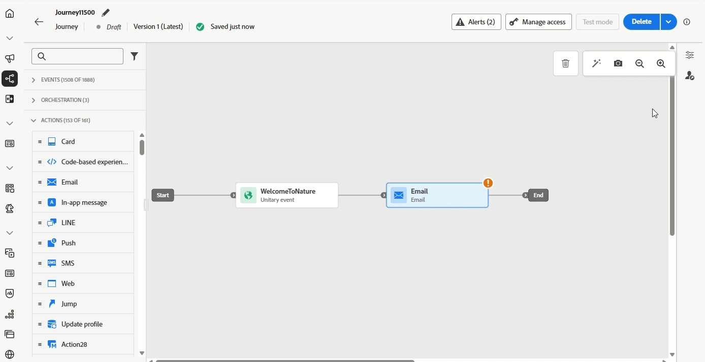

# Versionsinformation {#release-notes}

>[!CONTEXTUALHELP]
>id="ajo_homepage_card1"
>title="Nyheter?"
>abstract="**Adobe Journey Optimizer** levererar kontinuerligt nya funktioner, förbättringar av befintliga funktioner och felkorrigeringar. Alla ändringar konsolideras den sista veckan i varje månad i versionsinformationen."

[!DNL Adobe Journey Optimizer] levererar kontinuerligt nya funktioner, förbättringar av befintliga funktioner och felkorrigeringar. Alla ändringar konsolideras den sista veckan i varje månad i versionsinformationen. [!DNL Adobe Journey Optimizer] är inbyggd i [!DNL Adobe Experience Platform] och ärver från de senaste innovationerna och förbättringarna. Läs mer om de här ändringarna i [Adobe Experience Platform versionsinformation](https://experienceleague.adobe.com/docs/experience-platform/release-notes/latest.html?lang=sv-SE){target="_blank"}.

## Versionsinformation 25 maj {#25-5-rn}

**Noteringar om tidig version nedan kan ändras utan föregående meddelande till releasedatum**. Länkar, skärmar och uppdaterad dokumentation publiceras på releasedatum.

**Releasedatum**: 20-21 maj 2025

### Nya funktioner {#25-04-features}

De nya funktionerna i den här versionen beskrivs nedan.

<table>
<thead>
<tr>
<th><strong>Teman i e-post-Designer</strong> </th>
</tr>
</thead>
<tbody>
<tr>
<td>

Nu kan ni snabbt tillämpa förgodkända teman för att säkerställa ett enhetligt varumärke i alla e-postmeddelanden, snabba upp kampanjprocessen och oberoende producera högkvalitativa e-postmeddelanden samtidigt som ni minskar beroendet av designteam.

Funktionen finns för närvarande i betaversion och är endast tillgänglig för betatestare. Kontakta din Adobe-representant om du vill delta i betaprogrammet.

Mer information finns i den <a href="../email/apply-email-themes.md">detaljerade dokumentationen</a>.

Tillgänglighetsdatum: 14 maj 2025

</td>
</tr>
</tbody>
</table>

<table>
<thead>
<tr>
<th><strong>Beslut - ny AI-formelbyggare</strong> </th>
</tr>
</thead>
<tbody>
<tr>
<td>

Nu kan du skapa särskilda bedömningsformler genom att definiera och kombinera villkor från ett nytt förbättrat gränssnitt. I stället för att bara förlita dig på en statisk erbjudandeprioritet kan du definiera anpassade rankningsformler som kombinerar AI-modellpoäng, erbjudandeprioriteringar, profilattribut, erbjudandeattribut och sammanhangsbaserade signaler via ett guidat gränssnitt.

Mer information finns i den <a href="../experience-decisioning/exd-ranking-formulas.md">detaljerade dokumentationen</a>.

Tillgänglighetsdatum: 14 maj 2025

</td>
</tr>
</tbody>
</table>

<table>
<thead>
<tr>
<th><strong>Synkronisera läsmålgruppsschema med batchsegmenteringsjobb</strong> </th>
</tr>
</thead>
<tbody>
<tr>
<td>

Nu kan du utlösa dagliga körningar efter gruppsegmentering. Det här alternativet är nu tillgängligt i dagliga schemalagda resor till alla kunder. Med den kan ni definiera för en tidsperiod på upp till 6 timmar för att vänta på målgruppsdata från batchsegmenteringsjobb, vilket säkerställer att resorna körs med de senaste data eller hoppas över om de inte är klara.

Den här funktionen lanserades tidigare i begränsad tillgänglighet och är nu tillgänglig i alla miljöer (allmän tillgänglighet).

</td>
</tr>
</tbody>
</table>

<table>
<thead>
<tr>
<th><strong>Integrering av Adobe Experience Manager Content fragment</strong> </th>
</tr>
</thead>
<tbody>
<tr>
<td>

Tack vare integreringen av Adobe Experience Manager och Adobe Journey Optimizer kan du nu enkelt använda Adobe Experience Manager Content Fragments i ditt Journey Optimizer-innehåll. Denna smidiga anslutning gör det enklare att komma åt och använda AEM-material direkt i Journey Optimizer.

Den här funktionen fanns tidigare för ett begränsat antal organisationer (LA) och är nu tillgänglig för GA med följande förbättringar:

<ul>
<li>Skapa erbjudanden genom att välja ett AEM Content Fragment.</li>
<li>Definiera platshållare och mappa personaliseringsvärden i fragmentsignaturen i redigeringsläget.</li>
</ul>
</td>
</tr>
</tbody>
</table>

<table>
<thead>
<tr>
<th><strong>Kalendervy för Kampanj- och Resurslager</strong> </th>
</tr>
</thead>
<tbody>
<tr>
<td>

Nu finns en kalendervy tillgänglig i rese- och kampanjlistorna. Ni kan visualisera alla resor och kampanjaktiveringar i respektive lista.

Den här ändringen är endast tillgänglig för en uppsättning organisationer (begränsad tillgänglighet). Kontakta din Adobe-representant för att få åtkomst.

</td>
</tr>
</tbody>
</table>

<table>
<thead>
<tr>
<th><strong>Adobe Experience Manager Dynamic Media-integrering</strong> </th>
</tr>
</thead>
<tbody>
<tr>
<td>

Dynamiska medieresurser är nu tillgängliga direkt i Journey Optimizer. Integreringen gör att du kan:

<ul>
<li>Hantera resurser centralt med uppdateringar i realtid.</li>
<li>Ändra inställningar för resurser som bredd och höjd direkt.</li>
<li>Anpassa dynamiska mediamallar genom att uppdatera innehållet och lägga till anpassningsfält.</li>
</ul>

Den här funktionen lanserades tidigare i begränsad tillgänglighet och är nu tillgänglig i alla miljöer (allmän tillgänglighet).

</td>
</tr>
</tbody>
</table>

<table>
<thead>
<tr>
<th><strong>Konflikt och prioritering</strong> </th>
</tr>
</thead>
<tbody>
<tr>
<td>

I Journey Optimizer är det viktigt att hantera kampanjernas och resornas volym och tidpunkter för att undvika överväldigande kunder med alltför många interaktioner. Journey Optimizer har nu flera verktyg för konflikthantering och -prioritering - som tidigare bara fanns för LA-organisationer (limited-access) - som nu är allmänt tillgängliga (GA).

Den här funktionen lanserades tidigare i begränsad tillgänglighet och är nu tillgänglig i alla miljöer. I den här allmänna tillgänglighetsversionen har följande förbättringar införts:

<ul>
<li>Utökat stöd: Konflikthanteringsverktygen har nu stöd för både Unitary Journeys och Audience Qualification Journeys, utöver Läs målgruppsresor.</li>
<li>Förbättrad felsökning: Det finns nu två nya händelsefält tillgängliga i frågetjänsten, så att du kan analysera varför en profil avvisades från en resa eller kampanj.</li>
<li>Förbättrad rapportering: Rapporterna visar nu vilken specifik regel som uteslöt en profil från en resa eller kampanj, vilket ger större transparens och åtgärdbara insikter.</li>
</ul>
</td>
</tr>
</tbody>
</table>

<table>
<thead>
<tr>
<th><strong>Simulera innehållsvariationer</strong> </th>
</tr>
</thead>
<tbody>
<tr>
<td>

Tidigare fanns simulering av variationer i betaversion att tillgå (GA). Du kan förhandsgranska olika varianter av ditt innehåll med exempelindata som har överförts från en CSV- eller JSON-fil eller lagts till manuellt. Alla attribut som används i ditt innehåll för personalisering identifieras automatiskt av systemet och kan användas för dina tester för att skapa flera varianter.

Den här funktionen lanserades tidigare i begränsad tillgänglighet och är nu tillgänglig i alla miljöer. I den här allmänna tillgänglighetsversionen har funktionen nu stöd för flerspråkigt innehåll och innehållsexperiment, vilket gör att du kan testa variationer mellan olika språk och behandlingar. Dessutom har det nu stöd för sammanhangsbaserade attribut (utöver profilattribut), vilket möjliggör ännu mer dynamisk och situationsstyrd innehållstestning.

</td>
</tr>
</tbody>
</table>

<table>
<thead>
<tr>
<th><strong>Skala din vinnare av experiment</strong> </th>
</tr>
</thead>
<tbody>
<tr>
<td>

Skala vinnaren så att ni automatiskt eller manuellt kan lansera den vinnande varianten av ett experiment till er fulla publik. Den här funktionen ser till att du när en topprestanda har identifierats kan maximera dess räckvidd och effektivitet utan ständig manuell tillsyn.

</td>
</tr>
</tbody>
</table>

<table>
<thead>
<tr>
<th><strong>Anpassad SMS-provider</strong> </th>
</tr>
</thead>
<tbody>
<tr>
<td>

Nu kan du konfigurera fler SMS-leverantörer än standardalternativen i Journey Optimizer: Sinch, Infobip och Twilio. Med anpassad SMS-providerkonfiguration kan du integrera tredjepartsleverantörer direkt, utnyttja avancerad anpassning av nyttolasten för dynamiska meddelanden och hantera medgivandeinställningar (anmälan/avanmälan) för att säkerställa regelefterlevnad.

Mer information finns i den <a href="../sms/sms-configuration-custom.md">detaljerade dokumentationen</a>.

Den här funktionen lanserades tidigare i begränsad tillgänglighet och är nu tillgänglig i alla miljöer (allmän tillgänglighet).
</td>
</td>
</tr>
</tbody>
</table>

<table>
<thead>
<tr>
<th><strong>Kompletterande ID för händelseutlösta resor</strong> </th>
</tr>
</thead>
<tbody>
<tr>
<td>

Nu kan du utlösa resor med ett profil-ID tillsammans med en annan identifierare, till exempel ett order-ID, ett prenumerations-ID eller ett förskrivnings-ID, vilket gör att samma profil kan finnas på samma resa flera gånger samtidigt. Detta möjliggör scenarier som att hantera flera order eller prenumerationer parallellt, där varje instans följer sin egen väg genom resan.

Den här funktionen är endast tillgänglig för en uppsättning organisationer (begränsad tillgänglighet). Kontakta din Adobe-representant för att få åtkomst.

</td>
</tr>
</tbody>
</table>

### Förbättringar {#25-05-improv}

Förbättringar i den här versionen visas nedan.

* **Stöd för nya objekt för sandlådekopia**

   * **Kampanjer** - Tillgänglighetsdatum: 15 maj 2025

     När du kopierar kampanjer i flera sandlådor med hjälp av funktionerna för paketexport och -import kopieras nu även följande beroenden: kanalkonfigurationer, experimentera med varianter och inställningar, beslutsprinciper och objekt. [Läs mer](../configuration/copy-objects-to-sandbox.md)

   * **Beslut** - Tillgänglighetsdatum: 16 maj 2025

     Beslutsobjekt kan nu kopieras mellan sandlådor, vilket effektiviserar arbetsflödena för testning och distribution. [Läs mer](../configuration/copy-objects-to-sandbox.md#decisioning)

* **Mappar för landningssidor** - Tillgänglighetsdatum: 9 maj 2025
För att enkelt hantera dina landningssidor kan du nu använda mappar för att ordna dem mer effektivt i en strukturerad hierarki. [Läs mer](../landing-pages/manage-lp.md)

* **Direktreklam: Stöd för SSH-nyckel för SFTP-anslutningar** - Tillgänglighetsdatum: 5 maj 2025

  Förutom den befintliga SFTP-servern med lösenordsautentiseringstypen kan du nu exportera din direktmeddelandefil till en SFTP-server med SSH-nyckelautentisering i konfigurationen för filroutning för direkt e-post.

* **Fyller i aktivering för personalisering** - Tillgänglighetsdatum: 5 maj 2025

  En ny Pills-knapp har lagts till i personaliseringsredigeraren. När det här alternativet är aktiverat visas profil- och kontextuella attribut som tabletter, vilket förbättrar läsbarheten för koden. [Läs mer](../personalization/personalization-build-expressions.md#options)

  >[!AVAILABILITY]
  >
  >Denna kapacitet kommer gradvis att byggas ut till alla miljöer under de kommande 30 dagarna.

* **Klickspårning i e-postmallar**\
  Klickspårning på `<area>` element i bildscheman i e-postmallar stöds nu internt i Journey Optimizer. Detta är för att säkerställa att bildschemaområden får samma spårningsomslutning, spårningsdata och tillagda parametrar som standardhyperlänkar.

* **Beslut - utnyttja Adobe Experience Platform datamängder**\
  Nu kan du använda Adobe Experience Platform datamängder i följande beslutsobjekt: regler för behörighet, rankningsformler och regler för appning.

* **Mappar för mallar och fragment**\
  Med mappar kan du enklare och effektivare ordna innehållsmallar och fragment i en strukturerad hierarki. Tidigare var mappar tillgängliga för en uppsättning organisationer (LA), och nu är de tillgängliga för alla användare (GA) att hantera sina innehållsmallar och fragment.

* Stöd för omdirigering till URL för **i webbkanalen**\
  Journey Optimizer webbkanal ger dig nu möjlighet att dirigera om besökare till en annan befintlig URL i stället för att skapa en ny variant i den visuella redigeraren. Den här funktionen kan användas för att experimentera med två helt olika sidor i stället för att bara ändra ett fåtal element på en sida.

* **Högerspåret i kampanjlistan**\
  Om du väljer en kampanj i kampanjlistan öppnas nu en ruta med information om kampanjen.

* **Formulärfält i kodbaserat upplevelseinnehåll**\
  I innehållsmallar kan du nu definiera specifika JSON- eller HTML-fält som gör det möjligt för icke-tekniska användare att enkelt redigera innehåll i kodbaserade upplevelser utan att behöva ändra kod.

* **Stöd för beslutsobjektattribut för beslutsregler**\
  Nu kan du använda attribut för beslutsobjekt för att skapa beslutsregler.

<!--
* **Subdomains - 'Custom delegation' method**  
  In addition to the full delegation and the CNAME method, a new subdomain configuration method is now available: the Custom delegation method, which enables you to fully own controlling and maintaining all aspects of DNS that are required for delivering, rendering, and tracking messages.-->

## Versionsinformation 25 april {#25-4-rn}

**Releasedatum**: 29-30 april 2025

### Nya funktioner {#25-04-features}

Nya funktioner i den här versionen visas nedan.

<table>
<thead>
<tr>
<th><strong>Personalization Editor - Learn by Doing</strong> </th>
</tr>
</thead>
<tbody>
<tr>
<td>

Nu finns det en personaliseringsmiljö där du kan experimentera med personaliseringsuttryck. Du kan utforska exempelmallar och nyttolaster för att komma igång och testa dina egna personaliseringsuttryck.

Mer information finns i den <a href="../personalization/personalize.md#playground">detaljerade dokumentationen</a>.

Tillgänglighetsdatum: 24 april 2025

</td>
</tr>
</tbody>
</table>

<!--table>
<thead>
<tr>
<th><strong>Adobe Experience Manager as a Cloud Service integration</strong> </th>
</tr>
</thead>
<tbody>
<tr>
<td>

The integration between Adobe Journey Optimizer and Adobe Experience Manager as a Cloud Service is now released in General Availability (GA). This integration enables seamless content sourcing and management for personalized customer journeys.

For more information, refer to the <a href="../integrations/aem-templates.md">detailed documentation</a>.

</td>
</tr>
</tbody>
</table-->

<!--<table>
<thead>
<tr>
<th><strong>Simulate content variations (General Availability)</strong> </th>
</tr>
</thead>
<tbody>
<tr>
<td>

Previously available in beta, content variations simulation is now generally available (GA). It allows you to preview different variations of your content using sample input data uploaded from a CSV or JSON file or added manually. All the attributes used in your content for personalization are automatically detected by the system and can be used for your tests to create multiple variants.

With the General Availability release, the feature now includes support for multilingual content and content experiments, enabling you to test variations across different languages and treatments. Additionally, it now supports contextual attributes (in addition to profile attributes), allowing for even more dynamic and situational content testing.

</td>
</tr>
</tbody>
</table>-->

<table>
<thead>
<tr>
<th><strong>LINE-kanal</strong> </th>
</tr>
</thead>
<tbody>
<tr>
<td>

Adobe Journey Optimizer har utökat sina flerkanalsfunktioner så att de har stöd för LINE-kanalen. Den här förbättringen gör att du kan skapa, redigera och förhandsgranska LINE-upplevelser, vilket möjliggör mer personaliserade och engagerande interaktioner. Med LINE kan ni få kontakt med fler kunder, skicka relevant innehåll och förbättra engagemanget.

LINE-kanalen aktiveras på begäran av Adobe Journey Optimizer-kunder. Kontakta Adobe kundtjänst eller en Adobe-representant för att aktivera funktionen för din organisation.

Mer information finns i den <a href="../line/get-started-line.md">detaljerade dokumentationen</a>.
</td>
</tr>
</tbody>
</table>

<!--table>
<thead>
<tr>
<th><strong>Custom SMS provider (General Availability)</strong> </th>
</tr>
</thead>
<tbody>
<tr>
<td>

Adobe Journey Optimizer now supports custom SMS providers, allowing you to integrate your preferred SMS services for enhanced communication flexibility.

For more information, refer to the <a href="../sms/sms-configuration-custom.md">detailed documentation</a>.
</td>
</tr>
</tbody>
</table-->

<table>
<thead>
<tr>
<th><strong>Resemått</strong> </th>
</tr>
</thead>
<tbody>
<tr>
<td>

Nu finns det resestatistik som gör det möjligt att mäta effekten av dina aktiviteter över nyckeltalen i ditt företag och att ge tydligare insikter i hur det fungerar.

 

Mer information finns i den <a href="../building-journeys/success-metrics.md">detaljerade dokumentationen</a>.

Tillgänglighetsdatum: 9 april 2025

</td>
</tr>
</tbody>
</table>

<!--<table>
<thead>
<tr>
<th><strong>Calendar view for campaign and journey inventory (Limited Availability)</strong> </th>
</tr>
</thead>
<tbody>
<tr>
<td>

A new calendar view is now available for campaigns and journey activations. This feature provides a visual representation of scheduled activities, allowing you to view and manage your campaigns and journeys more effectively. Selecting a calendar item opens a right rail with detailed information. This feature is currently in Limited Availability.

</td>
</tr>
</tbody>
</table>-->

<table>
<thead>
<tr>
<th><strong>Adobe Express-integrering (begränsad tillgänglighet)</strong> </th>
</tr>
</thead>
<tbody>
<tr>
<td>

Adobe Journey Optimizer kan nu integreras med Adobe Express så att ni smidigt kan koppla samman ert kreativa material med resesamordning. Den här integreringen förenklar processen att utforma och distribuera personaliserat innehåll mellan kampanjer. 

Denna integrering är för närvarande inte tillgänglig för användning med hälso- och sjukvårdsskölden eller skölden för skydd av privatlivet och säkerheten.

Mer information finns i den <a href="../integrations/express.md">detaljerade dokumentationen</a>.

</td>
</tr>
</tbody>
</table>

<table>
<thead>
<tr>
<th><strong>Utlös den dagliga resan efter gruppsegmentering (begränsad tillgänglighet)</strong> </th>
</tr>
</thead>
<tbody>
<tr>
<td>

För dagliga schemalagda resor kan du med ett nytt alternativ definiera ett tidsintervall på upp till 6 timmar för att vänta på målgruppsdata från batchsegmenteringsjobb, vilket säkerställer att resorna körs med de senaste data eller hoppas över om de inte är klara. Utlösaren efter grupputvärdering är bara tillgänglig för en uppsättning organisationer (begränsad tillgänglighet). Kontakta din Adobe-representant för att få åtkomst.

Mer information finns i den <a href="../building-journeys/read-audience.md#schedule">detaljerade dokumentationen</a>.

</td>
</tr>
</tbody>
</table>

<!--table>
<thead>
<tr>
<th><strong>Themes in the Email Designer (Beta)</strong> </th>
</tr>
</thead>
<tbody>
<tr>
<td>

You can now quickly apply pre-approved styling themes to your email content to ensure brand consistency across all emails, speed up your campaign creation process and independently produce hight-quality emails while reducing dependency on design teams.

This capability is currently in beta version and only available to beta customers. To join the beta program, contact your Adobe representative.

For more information, refer to the <a href="../content-management/brands-score.md">detailed documentation</a>.

Availability date: May 5, 2025

</td>
</tr>
</tbody>
</table-->

<table>
<thead>
<tr>
<th><strong>Poäng för varumärkesjustering (Beta)</strong> </th>
</tr>
</thead>
<tbody>
<tr>
<td>

Poängen för varumärkesjustering ger tydlig feedback direkt i e-postdesignern, som hjälper dig att se om innehållet överensstämmer med varumärkets ton, stil och riktlinjer. Den här funktionen är tillgänglig i Beta.

Mer information finns i den <a href="../content-management/brands-score.md">detaljerade dokumentationen</a>.

</td>
</tr>
</tbody>
</table>

<!--
<table>
<thead>
<tr>
<th><strong>Decisioning - New AI formula builder</strong> </th>
</tr>
</thead>
<tbody>
<tr>
<td>

You can now create specific Decisioning ranking formulas by defining and combining criteria from a new improved interface. Ranking formulas allow you to define rules that will determine which decision items should be presented first, rather than taking into account the priority scores.

For more information, refer to the <a href="../content-management/brands-score.md">detailed documentation</a>.

Availability date: May 5, 2025

</td>
</tr>
</tbody>
</table>
-->

### Förbättringar {#25-04-improv}

**API för förhandsgranskning av kampanjer**

Det finns nya API:er för att förhandsgranska kampanjer, utöver befintliga funktioner för att skicka korrektur. [Läs mer](https://developer.adobe.com/journey-optimizer-apis/references/simulations/#operation/createCampaignPreview){target="_blank"}.

**Verktyg för sandlåda**

* **Verktyg i sandlådan för anpassade åtgärder**

  Anpassade åtgärder ingår nu i listan över Adobe Journey Optimizer-objekt som kan kopieras med sandlådeverktygen, vilket effektiviserar testning och driftsättning. [Läs mer](../configuration/copy-objects-to-sandbox.md)

* **Sandlådeverktyg för kampanjer** - Tillgänglighetsdatum: 3 april 2025

  Nu kan ni kopiera kampanjer över flera sandlådor med hjälp av funktioner för paketexport och -import. Kampanjer kopieras tillsammans med alla objekt som hör till profilen, målgruppen, schemat, textbundna meddelanden och beroende objekt. Vissa objekt kopieras inte, t.ex. beslutsobjekt, dataanvändningsetiketter och språkinställningar. [Läs mer](../configuration/copy-objects-to-sandbox.md#custom-actions)

**Personalization**

* **Nytt sammanhangsberoende attribut**

  Ett nytt sammanhangsberoende attribut, **Profil-ID**, är nu tillgängligt att välja i personaliseringsredigeraren. Det här är ett meddelandeorienterat attribut som unikt identifierar varje meddelande som skickas till varje målprofil i en leverans. Den här unika identifieraren kan till exempel användas som en URL-spårningsparameter för att särskilja varje länk som öppnats eller klickats av mottagarna.

* **Fyllda attribut i attributrutan** - Tillgänglighetsdatum: 2 april 2025

  Attributrutan i anpassningsredigeraren visar nu endast ifyllda attribut som standard. Om du vill visa alla attribut använder du inställningsknappen för att inaktivera alternativet **[!UICONTROL Show only populated attributes]**. [Läs mer](../personalization/personalization-build-expressions.md)

**E-postkanal**

* **Anpassad URL-spårning** - Tillgänglighetsdatum: 30 april 2025

  För ökad flexibilitet och kontroll över e-postinställningarna kan du nu anpassa alla URL-spårningsparametrar samtidigt på e-postkanalens konfigurationsnivå, i stället för att göra det i e-postdesignern för varje länk i innehållet. [Läs mer](../email/surface-personalization.md#personalize-url-tracking)

* **E-posta Designer** - Tillgänglighetsdatum: 1 april 2025

  För att förbättra tillgängligheten i Journey Optimizer finns nu två nya fält tillgängliga i e-post-Designer: de motsvarar elementet `<title>` och attributet `lang` i elementet `<html>` i ditt e-postinnehåll. Du kan definiera dessa inställningar utöver fältet **[!UICONTROL Preheader]** i e-postavsnittet **[!UICONTROL Body]**. [Läs mer](../email/email-metadata.md)

**Använd fallspelningsböcker**

* **Skapa och dela spelböcker (privat beta)** - Nu kan du skapa, hantera och dela egna fallspelningsböcker. Den här funktionen är för närvarande bara tillgänglig för en uppsättning organisationer som en privat betaversion. Kontakta din Adobe-representant för att få åtkomst. [Läs mer](../start/playbooks.md)

**Navigering**

* **Innehållshantering** - Tillgänglighetsdatum: 2 april 2025

  För att enkelt hantera dina innehållsmallar och fragment kan du nu använda mappar för att ordna dem mer effektivt i en strukturerad hierarki. Läs mer i avsnitten [Innehållsmallar](../content-management/access-content-templates.md#folders) och [Fragment](../content-management/manage-fragments.md#folders).

  >[!AVAILABILITY]
  >
  >Den här förbättringen är endast tillgänglig för en uppsättning organisationer (begränsad tillgänglighet).

<!--- **Folders for content templates and fragments** - Availability date: May 5, 2025

  Previously available for a set of organizations (LA), folders are now available to all users (GA) to manage their content templates and fragments. Folders let you organize your content templates and fragments more easily and effectively into a structured hierarchy.

<!--- **Right rail in campaigns list**  

  A right rail has been added to the campaigns list, providing detailed information when a campaign is selected.-->

<!--**Playbooks**

- **Create your own playbooks (Beta)**
  
  You can now create your own playbooks in Adobe Journey Optimizer, enabling greater customization and flexibility in journey planning.-->

