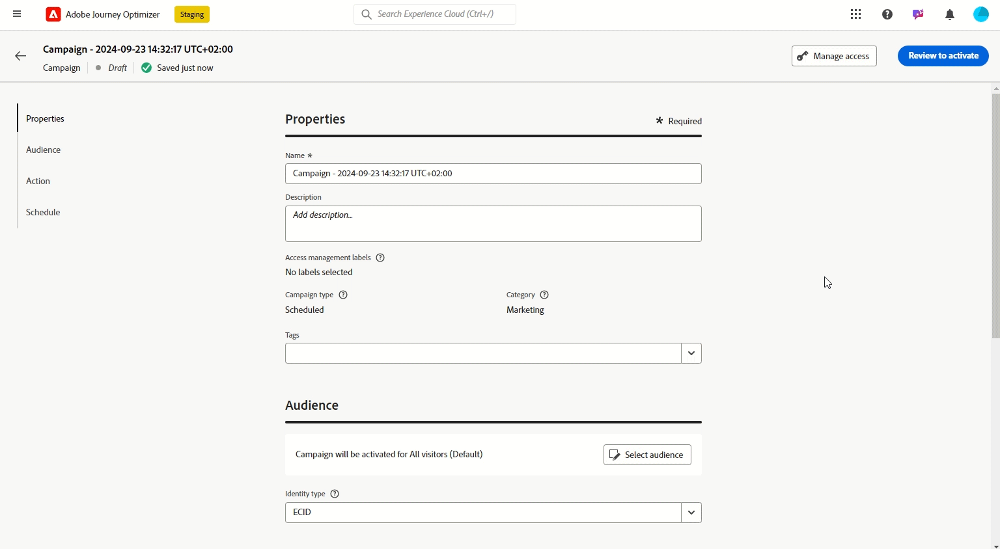

# Versionsinformation {#release-notes}

>[!CONTEXTUALHELP]
>id="ajo_homepage_card1"
>title="Nyheter?"
>abstract="**Adobe Journey Optimizer** levererar kontinuerligt nya funktioner, förbättringar av befintliga funktioner och felkorrigeringar. Alla ändringar konsolideras den sista veckan i varje månad i versionsinformationen."

[!DNL Adobe Journey Optimizer] levererar kontinuerligt nya funktioner, förbättringar av befintliga funktioner och felkorrigeringar. Alla ändringar konsolideras den sista veckan i varje månad i versionsinformationen. [!DNL Adobe Journey Optimizer] är inbyggd i [!DNL Adobe Experience Platform] och ärver från de senaste innovationerna och förbättringarna. Läs mer om de här ändringarna i [Adobe Experience Platform versionsinformation](https://experienceleague.adobe.com/docs/experience-platform/release-notes/latest.html){target="_blank"}.

## Versionsinformation, 24 oktober {#24-10-rn}

>[!CAUTION]
>
>**Noteringar för tidig version nedan kan ändras utan föregående meddelande till releasedatum**. Länkar, skärmar och uppdaterad dokumentation publiceras på releasedatum.

**Releasedatum**: 29-30 oktober 2024

### Nya funktioner {#24-10-features}

Den här versionen innehåller de nya funktionerna som beskrivs nedan.

<table>
<thead>
<tr>
<th><strong>Låsning av e-postinnehåll</strong> </th>
</tr>
</thead>
<tbody>
<tr>
<td>

Med Journey Optimizer kan du nu låsa innehåll i e-postmallar, antingen genom att låsa hela mallen eller specifika strukturer och komponenter. På så sätt kan ni förhindra oavsiktliga redigeringar och borttagningar, vilket ger er bättre kontroll över mallanpassning och förbättrar effektiviteten och tillförlitligheten i era e-postkampanjer.

<!--p>For more information, refer to the <a href="../content-management/gs-generative.md">detailed documentation</a>.
-->

</td>
</tr>
</tbody>
</table>

<table>
<thead>
<tr>
<th><strong>Godkännanden av resor och kampanjer (allmän tillgänglighet)</strong> </th>
</tr>
</thead>
<tbody>
<tr>
<td>

Med godkännandepolicyer kan ni nu skapa en godkännandeprocess i Journey Optimizer som gör det möjligt för marknadsföringsteamen att se till att kampanjer och resor granskas och signeras av lämpliga intressenter innan de publiceras.

Tidigare fanns godkännandepolicyer för en uppsättning organisationer (LA) och är nu tillgängliga för alla användare (GA).

Mer information finns i den <a href="../test-approve/gs-approval.md">detaljerade dokumentationen</a>.

</td>
</tr>
</tbody>
</table>

<table>
<thead>
<tr>
<th><strong>Anpassning av e-postkonfiguration (allmän tillgänglighet)</strong> </th>
</tr>
</thead>
<tbody>
<tr>
<td>

Nu kan du definiera dynamiska underdomäner och anpassade rubrikparametrar när du skapar e-postkanalskonfigurationer, vilket ger större flexibilitet och kontroll över e-postinställningarna.

Om du använder en anpassad konfiguration i en kampanj eller resa kan du förhandsgranska ditt e-postinnehåll för att kontrollera om det finns potentiella fel med de dynamiska inställningar du har definierat.

Tidigare var e-postkonfigurationspersonalisering tillgänglig för en uppsättning organisationer (LA) och nu även för alla användare (GA).

Mer information finns i den <a href="../email/surface-personalization.md">detaljerade dokumentationen</a>.

</td>
</tr>
</tbody>
</table>

<table>
<thead>
<tr>
<th><strong>Testa materialet med exempeldata (Beta)</strong> </th>
</tr>
</thead>
<tbody>
<tr>
<td>

Med reseoptimeraren kan du nu testa olika varianter av ditt e-postinnehåll genom att förhandsgranska det och skicka korrektur med exempelindata som överförts från en CSV-fil eller lagts till manuellt. Alla profilattribut som används i ditt innehåll för personalisering identifieras automatiskt av systemet och kan användas för dina tester för att skapa flera varianter.

Den här funktionen är för närvarande tillgänglig som betaversion.

<!--
For more information, refer to the <a href="../email/surface-personalization.md">detailed documentation</a>.
-->
</td>
</tr>
</tbody>
</table>

<table>
<thead>
<tr>
<th><strong>Hantering av konflikter och prioritet (begränsad tillgänglighet)</strong> </th>
</tr>
</thead>
<tbody>
<tr>
<td>

I Journey Optimizer är det viktigt att hantera kampanjernas och resornas volym och tidpunkter för att undvika överväldigande kunder med alltför många interaktioner. Journey Optimizer har nu flera verktyg för konflikthantering och -prioritering.

<ul><li><b>Resefrekvensbegränsning</b>: Nu kan du skapa regeluppsättningar som ska användas på dina resor, så att du kan begränsa antalet resor för en profil per dag, vecka eller månad, samt styra antalet samtidiga resor som körs samtidigt.</li>
<li><b>Prioritetspoäng</b>: Du kan nu tilldela en kampanj eller en resa ett prioritetspoäng, från 0 till 100. Ett högre tal anger en högre prioritet. När två kampanjer eller reseåtgärder använder samma kanalkonfiguration väljer Journey Optimizer den som har högst prioritet. Om kampanjerna har samma poäng väljs den kampanj som senast ändrades.</li>
<li><b>Visa potentiella konflikter</b>: Med en ny knapp för att visa potentiella konflikter under resor och kampanjer kan du nu identifiera överlappning med andra resor eller kampanjer, till exempel startdatum, målgrupp eller den valda kanalkonfigurationen.</li>
<li><b>Reseskiljeförfarande</b>: Med den här nya funktionen kan du prioritera de viktigaste kundresorna. Du kan skapa en regel som förhindrar inträde på en resa med lägre prioritet när en kund kvalificerar sig för en resa med högre prioritet.</li></ul>

<!--
For more information, refer to the <a href="../email/surface-personalization.md">detailed documentation</a>.
-->

Funktioner för hantering av konflikter och prioriteter är tillgängliga i begränsad tillgänglighet för en viss kundgrupp. Observera att dessa funktioner gradvis kommer att lanseras för fler användare i framtiden. Kontakta ditt kontoteam om du vill bli tillagd i väntelistan för dessa funktioner.

</td>
</tr>
</tbody>
</table>

<table>
<thead>
<tr>
<th><strong>Icke-visuellt redigeringsläge för webbdesignern</strong> </th>
</tr>
</thead>
<tbody>
<tr>
<td>

Som ett alternativ till Journey Optimizer webbdesigner kan du nu lägga till ändringar på webbplatsen med en icke-visuell redigerare. Du kan ange ändringarna manuellt utan att öppna sidorna i den visuella redigeraren.
Det här icke-visuella redigeringsläget är användbart om du inte kan installera webbläsartillägg som Adobe Experience Cloud Visual Helper, som krävs för att läsa in sidorna i webbdesignern.

<!--p>For more information, refer to the <a href="../email/surface-personalization.md">detailed documentation</a>.</p-->
</td>
</tr>
</tbody>
</table>

<table>
<thead>
<tr>
<th><strong>Innehållsexperiment under resor (allmän tillgänglighet)</strong> </th>
</tr>
</thead>
<tbody>
<tr>
<td>

Adobe Journey Optimizer finns redan i kampanjer och stöder nu experiment på resor. Experimentella tester är randomiserade, vilket i samband med onlinetestning innebär att du exponerar vissa slumpmässigt utvalda användare för en viss variant av ett meddelande och en annan slumpmässigt utvald uppsättning användare för annan variation eller behandling. Efter exponering kan du mäta de resultatvärden du är intresserad av, som öppningar av e-post, prenumerationer eller inköp.

Tidigare fanns det för en uppsättning organisationer (LA), och nu finns körningsexperiment för alla användare (GA).

</td>
</tr>
</tbody>
</table>

<table>
<thead>
<tr>
<th><strong>Beslut (allmän tillgänglighet)</strong> </th>
</tr>
</thead>
<tbody>
<tr>
<td>

Beslutsfattandet, som tidigare fanns för en uppsättning organisationer (LA) och som kallas Experience Decisioning, är nu tillgängligt för alla användare (GA). Det förenklar personaliseringen genom att erbjuda en centraliserad katalog med marknadsföringserbjudanden som kallas beslutsposter och en avancerad beslutsmotor. Den här motorn använder regler och rankningskriterier för att välja ut och presentera de mest relevanta beslutsobjekten för varje enskild person. Dessa beslutsobjekt integreras smidigt i ett stort antal inkommande ytor via den kodbaserade upplevelsekanalen.

För närvarande är beslut inte tillgängligt för kunder som har köpt tillägget Adobe Healthcare Shield och Privacy and Security Shield.

<!--p>For more information, refer to the <a href="../configuration/business-rules.md">detailed documentation</a>.</p-->
</td>
</tr>
</tbody>
</table>

<table>
<thead>
<tr>
<th><strong>Regeluppsättningar (begränsad tillgänglighet)</strong> </th>
</tr>
</thead>
<tbody>
<tr>
<td>

Nu kan du skapa detaljerade regler för frekvensbegränsning och tillämpa dem på meddelanden eller resor via regeluppsättningar. Med den här nya funktionen kan ni styra hur ofta era målgrupper får ett meddelande genom att ställa in flerkanalsregler som automatiskt utesluter överbegärda profiler från meddelanden och åtgärder.

Det gör det även möjligt att begränsa antalet resor per dag, vecka eller månad samt att kontrollera antalet samtidiga resor som körs samtidigt.

Regeluppsättningar är tillgängliga i begränsad tillgänglighet för en viss kundgrupp. Observera att dessa funktioner gradvis kommer att lanseras för fler användare i framtiden. Kontakta ditt kontoteam om du vill bli tillagd i väntelistan för den här funktionen.

<!--p>For more information, refer to the <a href="../configuration/business-rules.md">detailed documentation</a>.</p-->
</td>
</tr>
</tbody>
</table>

<table>
<thead>
<tr>
<th><strong>Flerspråkiga meddelanden under resor och kampanjer (allmän tillgänglighet)</strong> </th>
</tr>
</thead>
<tbody>
<tr>
<td>

Nu kan ni enkelt skapa innehåll på flera språk i en enda kampanj eller resa. Med den här funktionen kan ni växla mellan olika språk när ni redigerar kampanjer eller hela kundresan, effektivisera hela redigeringsprocessen och förbättra möjligheterna att effektivt hantera flerspråkigt innehåll.

Tidigare var flerspråkiga meddelanden tillgängliga för en uppsättning organisationer (LA), men nu är de tillgängliga för alla användare (GA).

<!--p>For more information, refer to the <a href="../configuration/business-rules.md">detailed documentation</a>.</p-->
</td>
</tr>
</tbody>
</table>

<table>
<thead>
<tr>
<th><strong>Integrering med Movable Ink och Adobe Journey Optimizer</strong> </th>
</tr>
</thead>
<tbody>
<tr>
<td>

Nu kan du integrera Movable Ink Da Vinci och Adobe Journey Optimizer. Med den nya integreringen kan du 

<ul><li>Utnyttja de kraftfulla funktionerna i Movable Inks Da Vinci-produkt för att sammanställa och personalisera e-postvarianter för gruppkampanjer</li>
<li>Snabba upp arbetsflödena för användare av Journey Optimizer med Da Vinci för framställning och AJO för optimering och leverans</li>
<li>Optimera Da Vinci-modeller med data från Adobe.</li></ul>

<!--p>For more information, refer to the <a href="../code-based/get-started-code-based.md">detailed documentation</a>.</p-->
</tr>
</tbody>
</table>

<table>
<thead>
<tr>
<th><strong>Uppdaterad rapportupplevelse (allmän tillgänglighet)</strong> </th>
</tr>
</thead>
<tbody>
<tr>
<td>

Tillgänglig sedan 16 oktober 2024

Journey Optimizer rapportering är nu allmänt tillgänglig (GA) och har förbättrad interoperabilitet med Customer Journey Analytics, standardiserad rapportering för båda plattformarna och förbättrad datakonsekvens och tillförlitlighet. Denna smidiga integrering mellan Journey Optimizer och Customer Journey Analytics ger en tydligare bild av prestandamätningarna, så att användarna kan fatta mer välgrundade beslut.

Med allmän tillgänglighet introduceras fyra nya funktioner: möjlighet att skapa enkla mätvärden, skapa och publicera målgrupper, ställa ad hoc-frågor med Insight Builder och schemalägga rapporter som automatiskt ska skickas till viktiga mottagare.

Mer information finns i den <a href="../reports/report-cja-manage.md">detaljerade dokumentationen</a>.

Viktigt:Den nuvarande rapportupplevelsen kommer att upphöra i januari 2025. Efter detta datum kommer den nya rapportupplevelsen att bli standard. Vi rekommenderar att du behärskar de nya funktionerna så att övergången blir smidig. <a href="../reports/report-gs-cja.md">Lär dig hur du kommer igång med Journey Optimizer nya rapporteringsgränssnitt</a>

</tr>
</tbody>
</table>

<table>
<thead>
<tr>
<th><strong>Kodbaserade upplevelser under resor</strong> </th>
</tr>
</thead>
<tbody>
<tr>
<td>

Tillgänglig sedan 1 oktober 2024

Med den kodbaserade upplevelsekanalen kan du med Adobe Journey Optimizer utföra avancerad personalisering och testning för alla dina inkommande egenskaper, vilket möjliggör smidig leverans av skräddarsydda upplevelser över olika kontaktytor som webbappar, mobilappar, datorprogram, videokonsoler, tv-anslutna enheter, smarta tv-apparater, kioskdatorer, ATM-enheter, IoT-enheter med mera. Den kodbaserade upplevelsekanalen är nu tillgänglig på arbetsytan för resan.

Mer information finns i den <a href="../code-based/create-code-based.md">detaljerade dokumentationen</a>.

</tr>
</tbody>
</table>

<table>
<thead>
<tr>
<th><strong>Webbupplevelser på resorna</strong> </th>
</tr>
</thead>
<tbody>
<tr>
<td>

Tillgänglig sedan 1 oktober 2024

Med webbkanalen kan Adobe Journey Optimizer personalisera webbupplevelsen som ni levererar till era kunder via inkommande webbresor. Webbkanalen är nu tillgänglig på arbetsytan.

Mer information finns i den <a href="../web/create-web.md">detaljerade dokumentationen</a>.

</tr>
</tbody>
</table>

### Förbättringar {#24-10-improvements}

Den här versionen innehåller de förbättringar som anges nedan.

**SMS-kanal**

SMS-förbättringar har införts för att förbättra dina meddelandefunktioner:

* Ni kan definiera och hantera unika nyckelord för era SMS-kampanjer och resor, vilket möjliggör mer personaliserad och effektiv kommunikation.

* Du kan skapa och leverera ett standard-SMS-meddelande när ett nyckelord inte känns igen.

* Nu kan du redigera eller ta bort en konfiguration för SMS API-kanal.

<!--**Journeys**-->

<!--* **Path experiment in journeys** - With the journey path experiment, you can now define and track key metrics for your journey paths, allowing you to measure the impact of your activities and to provide clearer insights into your performance. -->

&lt;!—* **Maximalt antal Live-resor** - Journey Optimizer har nu 500 live-resor på produktionssandlådor i stället för 100. Antalet direktresor visas på arbetsytan. <!-- DOCAC-10977-->

**Datauppsättningar**

* **Tid-till-live-garanti** - Från och med 1 november 2024 kommer ett TTL-skyddsprotokoll att introduceras i Journey Optimizer systemgenererade datauppsättningar i nya sandlådor och nya organsar enligt följande:

   * 90 dagar för data i profilarkivet
   * 13 månader för data i sjön

  Den här ändringen kommer att införas i befintliga kundsandlådor senare i en andra fas.

  Från och med den 1 november har dessutom direktuppspelningssegmentering inte längre stöd för att skicka och öppna händelser från spårnings- och feedbackdatauppsättningar. Den här ändringen gäller för alla kundsandlådor och organ vid den tidpunkten. [Läs mer](../data/datasets-ttl.md)

* **Parametrar i anpassade åtgärder** (Tillgänglighetsdatum: 3 oktober 2024) - NULL och valfria parametrar stöds nu i anpassade åtgärder. [Läs mer](../action/about-custom-action-configuration.md#define-the-message-parameters)

**Rapportering**

* **Rapportering om Experience Decisioning** finns nu tillgänglig och ger viktiga insikter i hur era besökare interagerar med era upplevelser.

**Datastyrning och samtycke** - Tillgänglighetsdatum: 7 okt 2024

* **Tillämpning av datastyrningsprinciper** sker nu i alla kanaler i Journey Optimizer. För kunder som har skapat policyer i Adobe Experience Platform tillämpas dessa på marknadsföringsåtgärder som en del av kanalkonfigurationsinställningarna. När du skapar innehåll med en konfiguration kontrollerar systemet om det finns några datastyrningsfel i alla anpassningsfält. Om en överträdelse hittas går det inte att publicera en resa eller kampanj. [Läs mer](../action/action-privacy.md)

* **Egna medgivandeprinciper** gäller nu för alla Journey Optimizer-kanaler. Vid behov innan ett meddelande skickas eller en inkommande upplevelse levereras, kontrollerar systemet att användaren har gett sitt medgivande till att använda personaliseringsfält i innehållet som han/hon får. Om inget samtycke ges visas inte upplevelsen. [Läs mer](../action/consent.md)

  >[!NOTE]
  >
  >Samtyckespolicyer är för närvarande bara tillgängliga för organisationer som har köpt tillägget **Adobe Healthcare Shield** eller **Privacy and Security Shield**.

**Publiker** - Tillgänglighetsdatum: 8 okt 2024

* När ni riktar er till en publik med CSV-filer kan ni nu använda attribut från filen i personaliseringsredigeraren och i regelbyggaren för resor och kampanjer. [Läs mer](../audience/about-audiences.md)

* Målgrupper och attribut från anpassad uppladdning (CSV-fil) kan nu användas med hälso- och sjukvårdsskölden eller skölden för skydd av privatlivet och säkerheten.

**Kodbaserad kanal**

* Innehållsmallar är nu tillgängliga. Ni kan snabba upp utvecklingen av era kodbaserade upplevelser med utgångspunkt i en innehållsmall som byggts av era utvecklare. Om du använder en innehållsmall kan marknadsföraren bara ändra vissa värden eller fält, i stället för att disponera hela HTML eller JSON-innehållets nyttolast.

**Beslut**

* [Adobe Customer Journey Analytics](https://experienceleague.adobe.com/docs/analytics-platform/using/cja-overview/cja-overview.html)-användare kan nu välja anpassade modeller att optimera när de ställer in en AI-modell i Decisioning (tidigare Experience Decisioning). Det gör att du till exempel kan optimera en anpassad&quot;inköps&quot;-tabell i stället för definierade begränsningar som klickfrekvens.&quot;

* När du lägger till en beslutspolicy till en kodbaserad kampanj med Decisioning (tidigare kallat Experience Decisioning) kan du nu manuellt välja enstaka beslutsposter, utöver urvalsstrategier. Dessutom kan du nu välja mer än ett reserverbjudande. Detta garanterar att det finns ett visst antal återlämnade beslutsposter. [Läs mer](../experience-decisioning/create-decision.md)

## 24 september {#24-9-rn}

<!--
>[!CAUTION]
>
>**Early release notes below are subject to change without prior notice until the release date**. Links, screens and updated documentation are published at the release date.
>
-->

**Releasedatum**: 24-26 september 2024

### Nya funktioner {#24-9-features}

Den här versionen innehåller de nya funktionerna som beskrivs nedan.

<table>
<thead>
<tr>
<th><strong>Innehållskort för mobilappar och webbplatser</strong> </th>
</tr>
</thead>
<tbody>
<tr>
<td>

Innehållskort är en ny funktion för digitala meddelanden i Adobe Journey Optimizer som levererar personaliserat och engagerande innehåll direkt inifrån mobilappar och webbplatser. Till skillnad från traditionella push-meddelanden integreras Content Cards smidigt i användargränssnittet med permanenta, icke-påträngande uppdateringar som förbättrar användarinteraktionen och upplevelsen.

Med den här funktionen kan marknadsförarna presentera relevant, multimediematerial för användarna, vilket ökar engagemanget och säkerställer att viktiga meddelanden syns utan att störa användarresan.

Mer information finns i den <a href="../content-card/get-started-content-card.md">detaljerade dokumentationen</a>.

</td>
</tr>
</tbody>
</table>

<table>
<thead>
<tr>
<th><strong>Godkännanden av resor och kampanjer (LA)</strong> </th>
</tr>
</thead>
<tbody>
<tr>
<td>

Med godkännandepolicyer kan ni nu skapa en godkännandeprocess i Journey Optimizer som gör det möjligt för marknadsföringsteamen att se till att kampanjer och resor granskas och signeras av lämpliga intressenter innan de publiceras.

Godkännandepolicyer är för närvarande bara tillgängliga för en uppsättning organisationer (begränsad tillgänglighet). Kontakta din Adobe-representant för att få åtkomst.

Mer information finns i den <a href="../test-approve/gs-approval.md">detaljerade dokumentationen</a>.

</td>
</tr>
</tbody>
</table>

<!--<table>
<thead>
<tr>
<th><strong>Email Content Locking</strong> </th>
</tr>
</thead>
<tbody>
<tr>
<td>

Journey Optimizer now allows you to lock content in email templates, either by locking the entire template or specific structures and component. This allows you to prevent unintentional edits or deletions, giving you greater control over template customization, and improving the efficiency and reliability of your email campaigns.

For more information, refer to the <a href="../content-management/gs-generative.md">detailed documentation</a>.

</td>
</tr>
</tbody>
</table>-->

<table>
<thead>
<tr>
<th><strong>Kriterier för globalt utträde under resor</strong> </th>
</tr>
</thead>
<tbody>
<tr>
<td>

Nu definierar ni utträdeskriterier på resenivå. Genom att lägga till kriterier för att avsluta resan gör du så att profilerna avslutas så snart en händelse inträffar (t.ex. köp) eller så kvalificerar de sig för en viss målgrupp. Detta förhindrar användaren från att få ut mer information från resan.

Mer information finns i den <a href="../building-journeys/journey-properties.md#exit-criteria">detaljerade dokumentationen</a>.

</td>
</tr>
</tbody>
</table>

<table>
<thead>
<tr>
<th><strong>AI Assistant Content Accelerator </strong> </th>
</tr>
</thead>
<tbody>
<tr>
<td>

När du har skapat och personaliserat ditt budskap går du ett steg längre med AI Assistant Content Accelerator i Journey Optimizer. Nu kan du använda AI-assistenten för att optimera budskapets effekt genom att experimentera med olika huvudtitlar och bilder. Varje variant hanteras som en unik behandling för att mäta och jämföra vilken titel som effektivt genererar fler klick.

Fördjupa dig i en praktisk upplevelse med <a href="https://experienceleague.adobe.com/en/apps/journey-optimizer/ai-assistant-content-accelerator">vår förhandsvisning av aktiva funktioner</a>, som är utformad för att du först ska kunna utforska dess funktioner och till fullo förstå dess funktioner.</a>.

Mer information finns i den <a href="../content-management/gs-generative.md">detaljerade dokumentationen</a>.

Tillgänglighetsdatum: 12 september 2024

</td>
</tr>
</tbody>
</table>

<table>
<thead>
<tr>
<th><strong>Inställningar för guidad kanal</strong> </th>
</tr>
</thead>
<tbody>
<tr>
<td>

Med Guided Channel Setup kan man automatisera och validera kanalkonfigurationen i en enhetlig upplevelse och därmed få igång Journey Optimizer snabbare. Denna nya guidade installation effektiviserar konfigurationen av kanaler så att alla nödvändiga resurser snabbt kan installeras och användas i Experience Platform, Journey Optimizer och datainsamling. På så sätt kan marknadsförings-, produkt- och datateknikteam snabbt börja med att skapa kampanjer och resor.

Mer information finns i den <a href="../configuration/set-mobile-config.md">detaljerade dokumentationen</a>.

Tillgänglighetsdatum: 3 september 2024

 
</td>
</tr>
</tbody>
</table>

### Förbättringar {#24-9-improvements}

Den här versionen innehåller de förbättringar som anges nedan.

**Publiker** - Tillgänglighetsdatum: 17 september 2024

**Licensanvändning** - Kontrollpanelen för licensanvändning visar nu de aktiveringsbara profilerna i stället för de engagerande målgrupperna. [Läs mer](../audience/license-usage.md)

**Innehållshantering**

Nu kan du exportera innehållsmallar och fragment mellan sandlådor. [Läs mer](../configuration/copy-objects-to-sandbox.md)

**Resor**

* **Förbättringar av Live-rapportering** - Live-rapportering ger insikter om hur dina resor har fungerat de senaste 24 timmarna. Vi har förbättrat den genom att lägga till nya mätvärden (som anges, utelämnas, tas bort och profiler av misstag) så att du får en djupare förståelse för användarbeteende och prestanda direkt från arbetsytan på resan. [Läs mer](../building-journeys/report-journey.md)

* (Tillgänglighetsdatum: 10 september) **Automatiska återförsök vid läsning av målgrupp** - återförsök används nu som standard på målgruppsinställda resor (med början från en **läsning** eller en **affärshändelse**) när exportjobbet hämtas. Om ett fel inträffar när exportjobbet skapas görs nya försök var 10:e minut (max 1 timme). Efter det kommer vi att betrakta det som ett misslyckande. Dessa typer av resor kan därför utföras upp till en timme efter den schemalagda tiden. [Läs mer](../building-journeys/read-audience.md#retries)

**E-postkanal**

* **Meddelanderubrik i skickat e-postmeddelande och BCC-kopia** - En ny rubrik har lagts till i alla e-postmeddelanden. Det här rubrikens värde är unikt för alla skickade e-postmeddelanden och för motsvarande BCC-e-postkopia. Den här rubriken lagras också i datamängderna för meddelanden och feedback från BCC, som gör att du kan stämma av BCC-kopian och motsvarande skickade e-postinformation. [Läs mer](../configuration/archiving-support.md#bcc-header)

* **Spam-poäng** (GA) - Nu kan du kontrollera ditt innehåll-spam-poäng i en dedikerad **Spam-rapport**. Med SpamAssassin kan Adobe Journey Optimizer nu testa ditt e-postinnehåll och ge det ett poängvärde som anger om Internet-leverantörer eller postlådeleverantörer kommer att betrakta det som skräppost eller inte. [Läs mer](../content-management/spam-report.md)

**SMS-kanal**

* **Redigera API-autentiseringsuppgifter** - Nu kan du redigera inställningar i SMS API-autentiseringsuppgifter, inklusive uppdateringar av nyckelord för avanmälan/utanmälan och svar.

**API:er**

* **API för kampanjsimulering** - Använd det här API:t för att utlösa ett korrekturjobb för en kampanj. Att skicka Campaign-korrektur är en asynkron process. API:t returnerar ett proofJobId som kan användas för att kontrollera korrekturets status. [Läs mer](https://developer.adobe.com/journey-optimizer-apis/references/simulations/){target="_blank"}

* (Tillgänglighetsdatum: 10 sep) [Adobe Journey Optimizer API-dokumentationen ](https://developer.adobe.com/journey-optimizer-apis/references/simulations/){target="_blank"} är nu interaktiv. Utforska API-slutpunkterna direkt från dokumentationssidorna för att få omedelbar feedback och snabba upp den tekniska implementeringen.

  Alla API-referenssidor har nu en **Prova**-funktion som du kan använda för att testa API-anrop direkt på dokumentationswebbplatsen. [Hämta nödvändiga autentiseringsuppgifter](https://developer.adobe.com/journey-optimizer-apis/references/authentication/){target="_blank"} och börja använda funktionen för att utforska API-slutpunkterna.

  Använd den här nya funktionen för att utforska förfrågningar och svar från API-slutpunkter, för att få omedelbar feedback och snabba upp den tekniska implementeringen.

  >[!CAUTION]
  >
  >Tänk på att du gör riktiga API-anrop till slutpunkterna när du använder den interaktiva API-funktionen på dokumentationssidorna. Tänk på detta när du experimenterar med produktionssandlådor.

**Konfiguration**

* **IP-beredskapsplaner** - Den här funktionen är nu tillgänglig för alla kunder, inklusive organisationer som har köpt tillägget **Hälsovårdssköld** eller **sekretess och säkerhetssköld** för Adobe. [Läs mer](../configuration/ip-warmup-gs.md)

 Registrera dig för [Adobe Journey Optimizer kvartalsnyhetsbrev](https://www.adobe.com/subscription/Adobe_Journey_Optimizer_NL.html){target="_blank"} idag och få de senaste produktuppdateringarna, spännande historier, användningsexempel, tips och mycket mer levererade direkt till din inkorg varje kvartal.